# TiCLE Lite

**캡스톤 디자인(Capstone Design)** 은 대학에서 배운 이론과 기술을 실제 문제 해결에 적용하는 프로젝트 중심의 실습형 교육 과정입니다. 학생들은 스스로 주제를 정하고, 팀을 구성해 설계·제작·검증의 전 과정을 수행하면서 창의적 사고력, 문제해결력, 그리고 협업 능력을 함께 길러나갑니다. 단순히 배운 내용을 재현하는 데 그치지 않고, 현실의 문제를 기술로 풀어내는 경험을 통해 스스로의 아이디어를 실제로 구현해보는 것이 바로 캡스톤 디자인의 핵심입니다.

이러한 교육 철학과 방향성 속에서 **TiCLE Lite** 는 캡스톤 디자인의 실질적인 출발점을 제시합니다. 학생들이 자유롭게 실험하고 창의적인 발상을 구현할 수 있도록, 복잡한 하드웨어 환경을 단순화하고 안정적인 기반을 제공합니다. 아무리 좋은 아이디어라도 하드웨어가 불안정하면 실행조차 어려운 것이 현실입니다. TiCLE Lite는 이러한 문제를 해결하기 위해, 사용자가 본질적인 설계와 구현에 집중할 수 있도록 설계된 **안정적이고 신뢰성 높은 하드웨어 플랫폼** 입니다.

또한 TiCLE Lite는 여러 가지 센서, 모터, LED 매트릭스, 통신 모듈 등 다양한 주변장치를 기본적으로 갖추고 있어, 별도의 부품 준비 과정 없이 바로 아이디어를 실현할 수 있습니다. 이는 사용자의 시행착오를 줄이고, 프로젝트의 완성도를 높이며, 진정으로 “창의적인 아이디어를 현실로 구현하는 경험”에 집중할 수 있도록 돕습니다.

결국 TiCLE Lite는 단순한 장비가 아니라, 사용자의 **캡스톤 디자인 여정을 함께하는 실험실이자 도구** 입니다. 학문적 지식을 실제 결과로 전환하는 첫 단계에서, TiCLE Lite는 사용자의 상상력을 구체적인 형태로 바꾸는 든든한 동반자가 될 것입니다.


## 플랫폼 구성

TiCLE Lite는 크게 Core와 Power, Basic으로 구분됩니다.

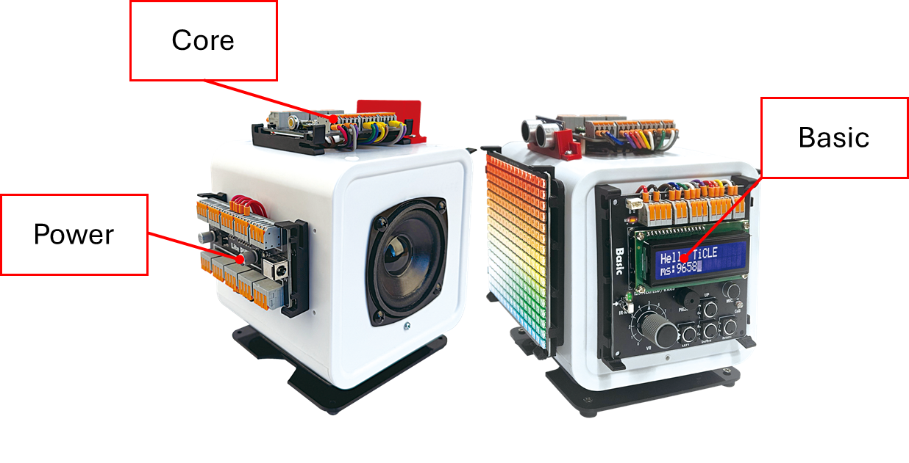

### Core

TiCLE Core 보드는 **RP2350** 칩이 장착된 TiCLE Lite의 실질적인 제어 보드입니다. 사용자는 이 보드와 연결 후 제어를 위한 프로그래밍을 진행할 것입니다.

TiCLE Lite 측면에 아래 사진과 같이 장착되어 있습니다.

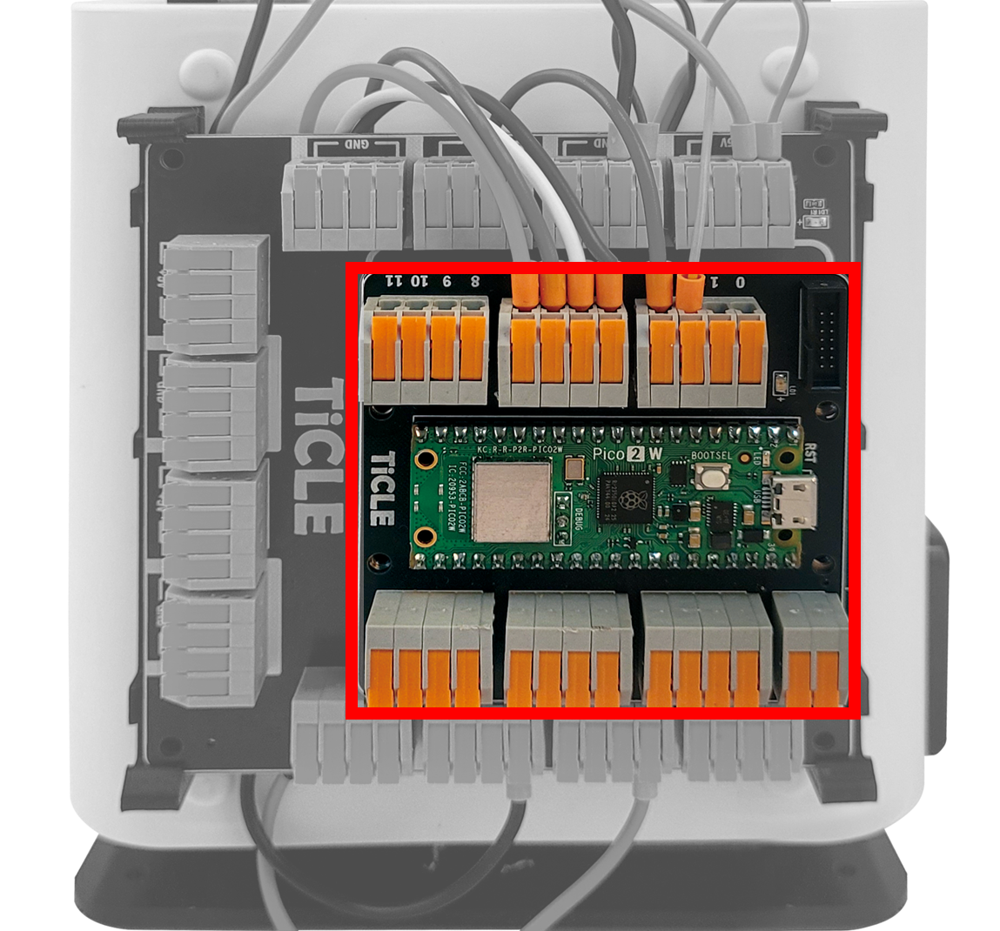

TiCLE Lite의 Core 보드는 다음과 같은 특징을 갖습니다.

- [RP2350](https://datasheets.raspberrypi.com/rp2350/rp2350-datasheet.pdf) 기반의 고성능 CPU 탑재
- Wi-Fi 및 BLE 기반의 무선 통신 기능 제공
- 총 26개의 안정적인 GPIO 핀 제공
- I2C 및 SPI 등 다양한 제어를 위한 통신 기능 제공

### Power

TiCLE Lite의 Core 보드는 Power 보드에 연결되어 있습니다. 아래 사진과 같이 Core 보드 뒤쪽에 위치하여 있습니다.

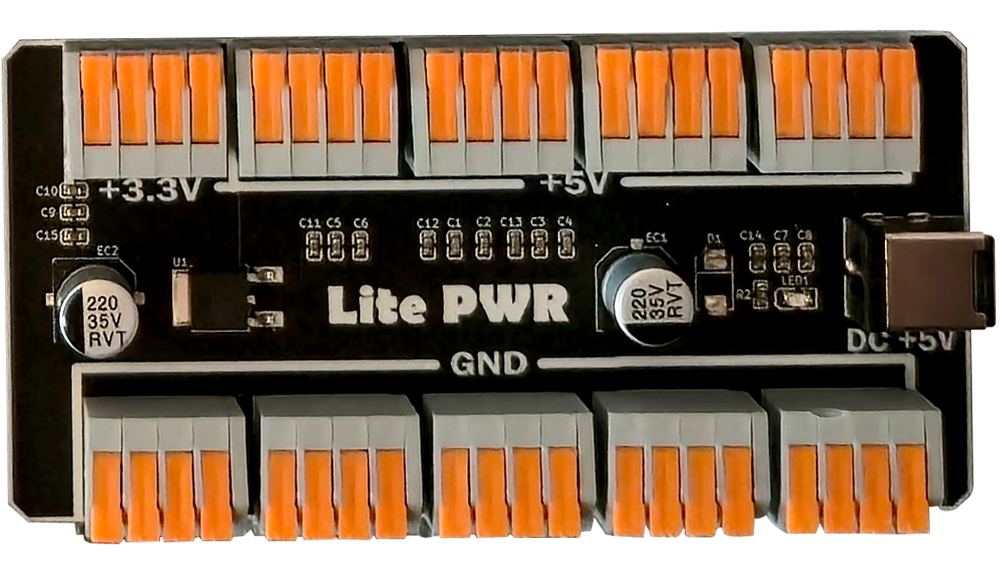

TiCLE Lite의 Power 보드는 다음과 같은 특징을 갖습니다.

- 총 16개의 5V, 4개의 3.3V, 4개의 12V의 안정적인 출력 제공
- 총 24개의 Ground Pin 제공

TiCLE 보드는 다수의 핀과 각 핀마다의 안정적인 출력을 보장하기에, 여러 주변장치와 연결하여도 안정적이게 제어할 수 있다는 특징을 가지고 있습니다.

### Basic

TiCLE Lite의 상단에는 Basic 보드가 장착되어 있습니다. 가장 기초 수준의 주변 장치가 장착되어 있으며, 주변장치 제어에 대한 기본 개념과 다양한 실습 장치들을 진행해볼 수 있습니다.

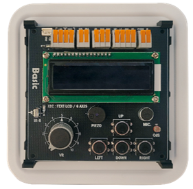

Basic 보드에 구성된 주변 장치는 아래와 같습니다. 자세한 제어 방법은 2장에서 배우게 됩니다.

| 제어 방식 | 주변 장치 |
| -------- | -------- |
| GPIO | Switch |
| GPIO | IR Remote |
| ADC | VR |
| ADC | Mic |
| ADC | CdS |
| PWM | Piezo |
| I2C | LCD (PCF8574) |
| I2C | IMU (MPU6050) |

### Etc

TiCLE Lite에는 상술한 세 보드 외에도 주변장치들이 존재합니다. 아래 사진과 같이 WS2812 Matrix, Bluetooth Audio Amp, Servo Motor가 존재합니다.

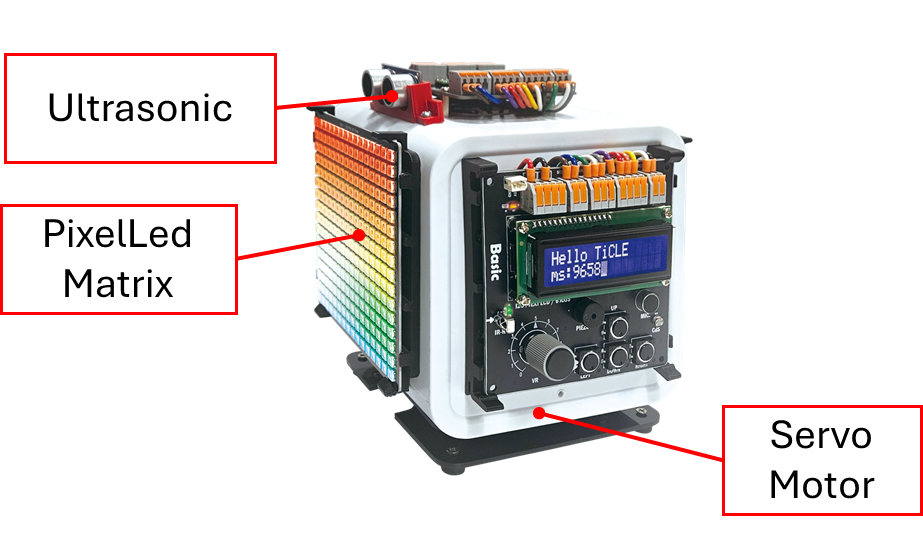

이 주변 장치들은 추후 프로젝트 개발 시 좀 더 역동적이고 다채롭게 프로젝트를 구성해줄 수 있게 해줍니다. 자세한 제어 방법 역시 2장에서 다루게 됩니다.

## Quick Start

### Visual Studio Code
Visual Studio Code(VSCode)는 MS에서 Electron 프레임워크를 기반으로 개발된 무료 프로그램으로 추가로 원하는 확장 기능을 설치해야 IDE로 사용 가능합니다. 윈도우를 비롯해 리눅스 Mac을 모두 지원하며 파이썬을 비롯해 다양한 언어와 부가 기능을 수 많은 확장 기능으로 지원합니다.

### VSCode 설치 및 설정 
VSCode 편집기를 IDE로 사용하기 위해선 다양한 확장 기능을 설치해주고 직접 설정해 주어야 하는 불편함이 있습니다. 한백전자에서는 이러한 불편함을 해소시키기 위해 Windows에서 VSCode 및 pwsh 등 여러 편리한 개발환경들을 자동으로 설치해주는 스크립트를 제공합니다. 설치하는 방법은 다음과 같습니다.

아래 링크에 접속한 후 실행 파일을 다운로드합니다.

- https://raw.githubusercontent.com/hanback-lab/devenv-setup/refs/heads/main/devenv-setup.exe

파일을 다운로드 받은 후 탐색기로 다운로드한 위치로 이동한 후 `devenv-setup.exe` 파일을 실행합니다. 이 후 아래의 사진과 같이 프로그램이 실행됩니다. `Installation Path` 입력 칸에는 VSCode가 설치될 경로를, `Python Version` 입력 칸에는 설치할 파이썬 버전을 입력할 수 있습니다. 다만 파이썬 버전은 추후 교재에서 진행할 실습을 원활히 진행하기 위해 Python 버전을 3.12로 고정해 주시길 바랍니다. 

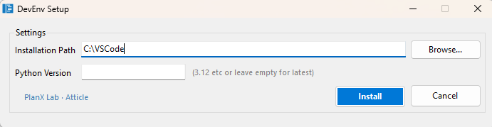

```sh
C:\VSCode\
```

폴더 내부에 launcher.exe 파일을 실행하여 VSCode를 실행합니다. 이 launcher 프로그램은 실행 시 VSCode 관련 패키지의 버전 확인 및 자동 업데이트 기능을 실행과 동시에 진행합니다.

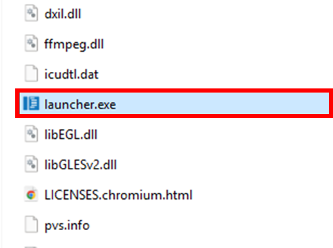

### replx

replx는 MCU 보드에 구축된 Micropython 환경에서의 프로그래밍을 보조하는 개발 툴입니다. 이 툴은 다양한 기능을 제공하고 빠른 속도로 동작하여 개발자로부터 하여금 편의성을 증진시켜줄 수 있습니다.

replx에 대한 자세한 사용법은 아래 사이트에서 확인하실 수 있습니다.

- https://github.com/PlanXLab/replx

#### 기능

제공되는 기능은 다음과 같습니다.
- **간편한 프로그램 실행** : 높은 추상화 및 간편한 환경설정들로 인해 보드 위에서의 Micropython 프로그램 실행의 간편성을 대폭 높입니다.
- **사용자 맞춤 환경설정** : 사용자 맞춤 설정을 통해 필요한 설정값을 미리 저장해 편의성을 증가시킬 수 있습니다.
- **강력한 보드 제어** : Soft Reset, Repl 접속 등 보드를 간단하고도 강력하게 제어할 수 있습니다.
- **저장소 접근 및 관리** : 보드의 저장소에 접근하고 파일들을 관리할 있어 라이브러리 업로드 등 보드의 활용도를 대폭 높일 수 있습니다.
- **자동 업데이트** : 업데이트 버전 등록 시 자동으로 감지하고 설치를 진행합니다.

#### 설치 방법

replx 툴은 파이썬 패키지로써 Pypi에 등록되어 있어, pip로 간편하게 설치할 수 있습니다. 단, 다음 조건을 충족해야 합니다.

- Windows 11 이상
- **Python 3.10 이상**

```
pip install replx
```

### replx 사용

우선, VSCode 상에서 작업할 위치에 폴더를 엽니다.


<br>

아래 사진과 같이 TiCLE Lite의 USB 포트와 PC간의 연결 상태를 확인합니다. 그 후 터미널에 다음 명령어를 입력하여 PC에 연결된 보드의 시리얼 포트를 확인합니다.

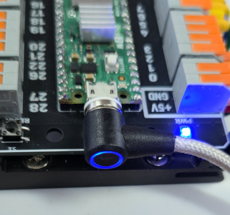

```
replx scan
```

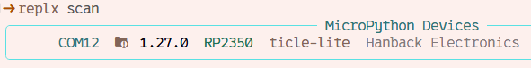

<br>

시리얼 포트를 확인하였다면 다음 명령어를 입력하여 현재 Workspace에 보드의 시리얼 포트 정보를 저장합니다. 

```
replx -s <시리얼 포트> env
```

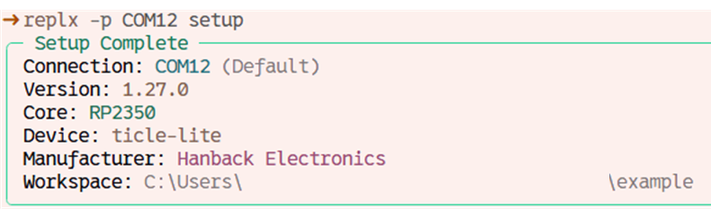

<br>

환경 설정이 완료되었다면 TiCLE Lite를 초기화시킵니다. TiCLE Lite를 사용하기 위한 시스템 초기화 및 기본 라이브러리가 설치됩니다. 

```
replx init
```

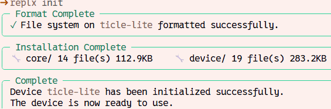

### Hello World!

다음은 Micropython 프로그램을 작성하고 TiCLE Lite에 업로드하는 실습입니다. 

먼저 간단한 프로그램을 작성합니다. VSCode 왼쪽 상단에 'New File' Icon을 눌러 새 파일을 생성한 다음, 'main.py' 라고 이름을 지정합니다.

   
<br>

<br><br>


파일을 아래와 같이 작성합니다.

```python
print("Hello World!")
```

<br>

다음 명령어를 입력하여 프로그램 동작 결과를 확인합니다.

```
replx run main.py
```

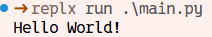

경우에 따라 아래와 같이 `run` 을 생략하고 입력해도 실행시킬 수 있습니다.

```sh
replx main.py
```

### Demo : Snow animation

본격적인 실습에 들어가기 전 간단한 데모를 실행해보겠습니다. 장비에 부착된 WS2812 Pixel display를 사용하여 마치 눈이 오는 것과 같은 애니메이션을 출력하는 데모입니다.

데모 Micropython 코드는 아래 사이트에서 다운로드 받을 수 있습니다.

- https://github.com/hanback-lab/TiCLE-Lite/blob/main/etc/quick_demo.py

그 후 VSCode 터미널에서 다음과 같이 입력합니다.

```py
replx quick_demo.py
```

코드를 실행할 시 아래와 같이 눈이 내리는 애니메이션이 출력되는 것을 볼 수 있습니다.

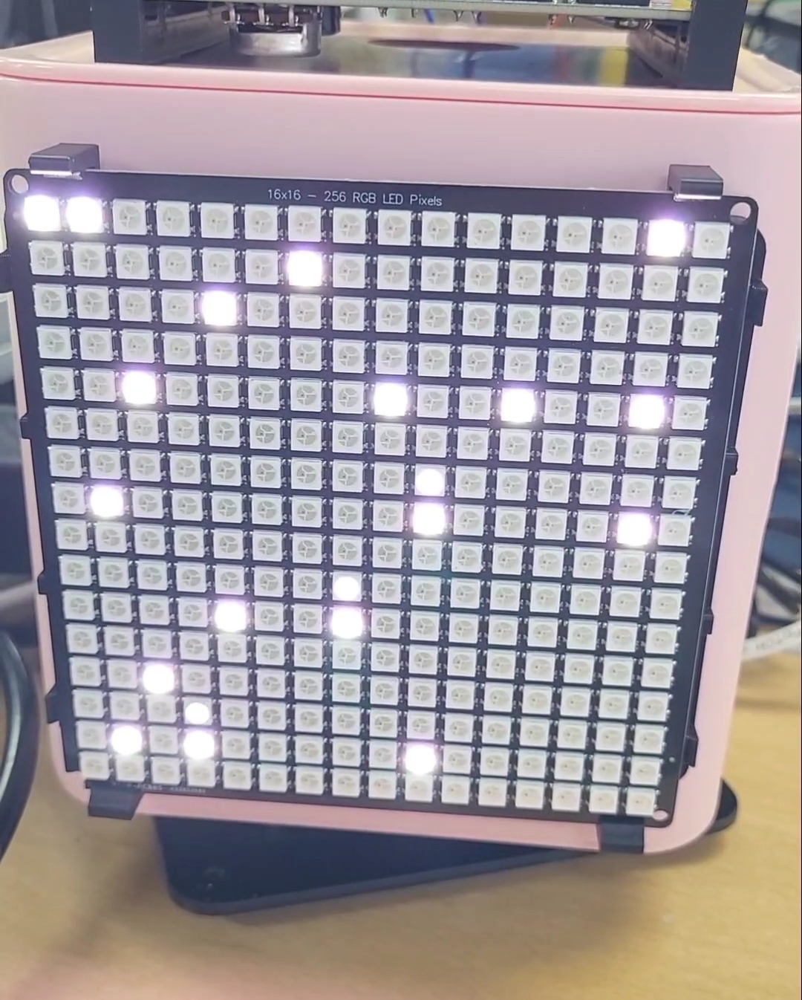