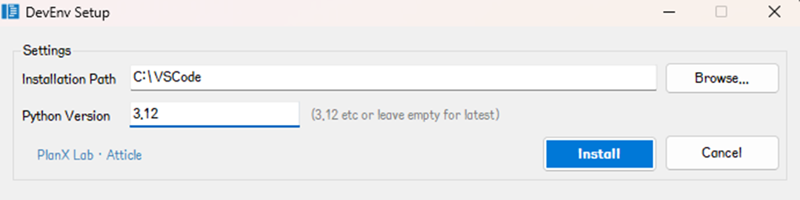
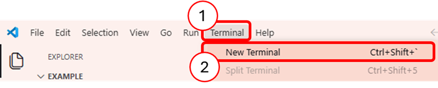
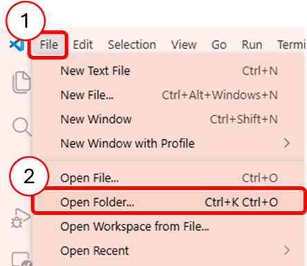
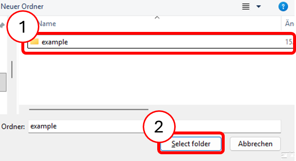

# TiCLE Lite 개요

## 학습 목표

- TiCLE Lite가 어떤 장치인지, 어떤 부품으로 이루어져 있는지 이해한다.
- 코드를 작성하고 실행할 수 있는 개발 환경을 직접 설치하고 설정할 수 있다.
- 간단한 프로그램을 작성하여 TiCLE Lite에서 실행할 수 있다.

---

## TiCLE Lite란?

TiCLE Lite는 아이디어를 실제 장치로 만들어 볼 수 있는 교육용 하드웨어이다. 버튼을 누르면 반응하는 장치, 소리에 따라 빛이 변하는 조명, 스마트폰으로 제어하는 시스템 등 다양한 결과물을 하나의 보드로 구현할 수 있다.

센서, 모터, LED, 통신 기능이 모두 통합되어 있어 복잡한 부품 준비나 배선 없이 바로 실습을 시작할 수 있다. 이 교재는 입문자를 대상으로 구성되었으므로, 전자 회로나 프로그래밍을 전혀 몰라도 순서대로 따라가면 스스로 동작하는 결과물을 완성할 수 있다.

---

## TiCLE Lite의 구성

TiCLE Lite는 프레임 박스와 네 종류의 주요 보드(Core, Power, Basic, Pixel Display), 그리고 연결 케이블로 구성된다. 아래 그림은 조립이 완료된 전체 모습이다.


### 프레임 박스

프레임 박스는 TiCLE Lite의 몸체 역할을 한다. 보드 장착용 브라켓과 케이블 배선 홀이 있으며, 초음파 센서, 서보 모터, 스피커가 기본 장착되어 있다. 각 위치에 보드를 고정하고 케이블을 연결하면 실습 시스템이 완성되고, 불빛 애니메이션, 거리 측정, 모터 각도 제어 등 다양한 프로젝트를 수행할 수 있다. 자세한 조립 방법과 제어 방법은 2장에서 다룬다.


프레임 박스의 주요 사양은 다음과 같다.

| 항목 | 내용 |
| ---- | ---- |
| 크기 | 185x140x165mm (박스 자체 140x140x140mm) |
| 서보 모터 | 토크 9.4Kg/cm, 스피드 0.2sec/60° (베어링 턴테이블 결합) |
| 초음파 센서 | 측정 거리 최대 2m |
| 스피커 | 3" 최대 10W |

### Core 보드

Core 보드는 TiCLE Lite의 두뇌 역할을 하는 보드이다. 사용자가 작성한 프로그램이 이 보드에서 실행되며, RP2350 칩이 탑재되어 있다. Wi-Fi와 BLE 통신 기능도 이 보드가 담당하며, 프레임 상단에 장착한다.


Core 보드의 주요 사양은 다음과 같다.

| 항목 | 내용 |
| ---- | ---- |
| 프로세서 | [RP2350](https://datasheets.raspberrypi.com/rp2350/rp2350-datasheet.pdf) |
| 무선 통신 | Wi-Fi, BLE |
| 핀 수 | 26개 |
| 인터페이스 | GPIO(26), PWM(16), ADC(3), I2C(2), SPI(2), UART(2), PIO(3) |

### Power 보드

Power 보드는 각 장치에 전원을 안정적으로 공급하는 보드이다. 프레임 뒤쪽에 장착하며, 여러 모듈을 동시에 사용해도 전압이 안정적으로 유지되도록 충분한 출력 핀을 제공한다.


| 항목 | 내용 |
| ---- | ---- |
| 5V 출력 핀 | 16개 |
| 3.3V 출력 핀 | 4개 |
| GND 핀 | 20개 |

### Basic 보드

Basic 보드는 실습에 자주 쓰는 입력·출력 부품을 미리 연결해 둔 보드이다. 스위치, 조도 센서, 마이크, 스피커 등이 납땜 없이 바로 사용할 수 있도록 구성되어 있으며, 프레임 오른쪽에 장착한다.


Basic 보드에 탑재된 부품 목록은 다음과 같다.

| 제어 방식 | 부품 |
| -------- | ---- |
| GPIO | 스위치 (Switch) |
| ADC | 가변 저항 (VR) |
| ADC | 조도 센서 (CdS) |
| PWM | 피에조 부저 (Piezo) |
| I2C | 문자 LCD (PCF8574) |
| I2C | 자이로·가속도 센서 (MPU6050) |
| I2S | 마이크 (ICS43434) |
| I2S | 스피커 (MAX98357) |


### Pixel Display 보드

Pixel Display 보드는 WS2812 컨트롤러가 내장된 RGB LED를 16x16으로 배열한 표시 장치이다. 프레임 정면에 장착하며, 글자, 아이콘, 애니메이션 등을 표현하는 데 활용한다.


---

## 개발 환경 설치

프로그램을 작성하고 TiCLE Lite에서 실행하려면, 먼저 컴퓨터에 개발 환경을 설치해야 한다. 이 교재에서는 코드 편집기인 Visual Studio Code와 TiCLE Lite와의 연결을 도와주는 도구인 replx를 사용한다.

### Visual Studio Code 설치

Visual Studio Code(이하 VSCode)는 Microsoft에서 만든 무료 코드 편집기이다. 마치 문서 작성 프로그램처럼 생겼지만, 프로그래밍을 위한 다양한 기능이 내장되어 있다. Windows, macOS, Linux 모두에서 사용할 수 있으며, Python을 비롯한 여러 프로그래밍 언어를 지원한다.

한백전자에서는 VSCode와 개발에 필요한 도구들을 한 번에 자동으로 설치해 주는 프로그램을 제공한다. 아래 링크에서 설치 파일을 다운로드한다.

- https://raw.githubusercontent.com/hanback-lab/devenv-setup/refs/heads/main/devenv-setup.exe

다운로드한 devenv-setup.exe 파일을 실행하면 아래와 같은 화면이 나타난다. Installation Path 칸에는 VSCode를 설치할 경로를 입력하고, Python Version 칸에는 사용할 Python 버전을 입력한다. Python 버전은 이후 실습이 원활하게 진행될 수 있도록 반드시 3.12로 입력한다.




설치가 완료되면 바탕화면 또는 시작 메뉴에 추가된 VSCode (Portable) 단축 아이콘을 실행하는데, 이는 설치 폴더 안에 생성된 launcher.exe 파일을 실행하여 VSCode를 시작한다. launcher는 VSCode를 실행하면서 동시에 관련 도구들의 버전을 확인하고 필요한 경우 자동으로 업데이트를 진행한다.


### replx 설치

replx는 TiCLE Lite와 컴퓨터를 연결하고, 작성한 프로그램을 보드에서 실행할 수 있게 도와주는 도구이다. 주요 기능은 다음과 같다.

| 기능 | 설명 |
| ---- | ---- |
| 프로그램 실행 | 작성한 코드 파일을 명령 한 줄로 보드에서 바로 실행한다. |
| 환경 설정 저장 | 어떤 포트에 보드가 연결되어 있는지 등을 미리 저장해 두어 매번 입력하지 않아도 된다. |
| 보드 제어 | 보드를 재시작하거나 REPL 화면에 접속하는 등의 조작을 간단하게 수행한다. |
| 파일 관리 | 보드 내부의 파일을 업로드하거나 삭제하는 등 관리할 수 있다. |
| 자동 업데이트 | 새 버전이 나오면 자동으로 감지하여 업데이트를 진행한다. |

replx의 상세 사용법은 아래 주소에서 확인할 수 있다. 
> https://github.com/PlanXLab/replx

replx는 Python 패키지로 배포되므로 아래와 같이 pip 명령어 하나로 설치할 수 있다. 설치 전에 다음 조건을 먼저 확인한다.

| 항목 | 요구사항 |
| ---- | -------- |
| 운영체제 | Windows 11 이상 |
| Python 버전 | 3.10 이상 |

VSCode 터미널은 메뉴에서 "Terminal > New Terminal"을 선택하거나 단축키(Ctrl+Shift+`)로 열 수 있다.



<br>

터미널이 열리면 다음 명령어를 입력하고 Enter를 누른다. 설치 버전과 의존성 패키지는 달라질 수 있다.

```
pip install replx
```
```
Collecting replx
  Using cached replx-1.8-py3-none-any.whl.metadata (4.0 kB)
Collecting typer>=0.12 (from replx)
  Downloading typer-0.24.1-py3-none-any.whl.metadata (16 kB)
Collecting rich>=13.0 (from replx)
  Downloading rich-15.0.0-py3-none-any.whl.metadata (18 kB)
Collecting pyserial>=3.5 (from replx)
  Downloading pyserial-3.5-py2.py3-none-any.whl.metadata (1.6 kB)
Collecting mpy-cross>=1.26 (from replx)
  Downloading mpy_cross-1.27.0.post2-py2.py3-none-win_amd64.whl.metadata (4.0 kB)
Collecting psutil>=5.9.0 (from replx)
  Downloading psutil-7.2.2-cp37-abi3-win_amd64.whl.metadata (22 kB)
Collecting markdown-it-py>=2.2.0 (from rich>=13.0->replx)
  Downloading markdown_it_py-4.0.0-py3-none-any.whl.metadata (7.3 kB)
Collecting pygments<3.0.0,>=2.13.0 (from rich>=13.0->replx)
  Downloading pygments-2.20.0-py3-none-any.whl.metadata (2.5 kB)
Collecting mdurl~=0.1 (from markdown-it-py>=2.2.0->rich>=13.0->replx)
  Downloading mdurl-0.1.2-py3-none-any.whl.metadata (1.6 kB)
Collecting click>=8.2.1 (from typer>=0.12->replx)
  Downloading click-8.3.2-py3-none-any.whl.metadata (2.6 kB)
Collecting shellingham>=1.3.0 (from typer>=0.12->replx)
  Downloading shellingham-1.5.4-py2.py3-none-any.whl.metadata (3.5 kB)
Collecting annotated-doc>=0.0.2 (from typer>=0.12->replx)
  Downloading annotated_doc-0.0.4-py3-none-any.whl.metadata (6.6 kB)
Collecting colorama (from click>=8.2.1->typer>=0.12->replx)
  Downloading colorama-0.4.6-py2.py3-none-any.whl.metadata (17 kB)
Using cached replx-1.8-py3-none-any.whl (386 kB)
Downloading mpy_cross-1.27.0.post2-py2.py3-none-win_amd64.whl (1.2 MB)
   ━━━━━━━━━━━━━━━━━━━━━━━━━━━━━━━━━━━━━━━━ 1.2/1.2 MB 10.3 MB/s  0:00:00
Downloading psutil-7.2.2-cp37-abi3-win_amd64.whl (137 kB)
Downloading pyserial-3.5-py2.py3-none-any.whl (90 kB)
Downloading rich-15.0.0-py3-none-any.whl (310 kB)
Downloading pygments-2.20.0-py3-none-any.whl (1.2 MB)
   ━━━━━━━━━━━━━━━━━━━━━━━━━━━━━━━━━━━━━━━━ 1.2/1.2 MB 9.4 MB/s  0:00:00
Downloading markdown_it_py-4.0.0-py3-none-any.whl (87 kB)
Downloading mdurl-0.1.2-py3-none-any.whl (10.0 kB)
Downloading typer-0.24.1-py3-none-any.whl (56 kB)
Downloading annotated_doc-0.0.4-py3-none-any.whl (5.3 kB)
Downloading click-8.3.2-py3-none-any.whl (108 kB)
Downloading shellingham-1.5.4-py2.py3-none-any.whl (9.8 kB)
Downloading colorama-0.4.6-py2.py3-none-any.whl (25 kB)
Installing collected packages: pyserial, mpy-cross, shellingham, pygments, psutil, mdurl, colorama, annotated-doc, markdown-it-py, click, rich, typer, replx
Successfully installed annotated-doc-0.0.4 click-8.3.2 colorama-0.4.6 markdown-it-py-4.0.0 mdurl-0.1.2 mpy-cross-1.27.0.post2 psutil-7.2.2 pygments-2.20.0 pyserial-3.5 replx-1.8 rich-15.0.0 shellingham-1.5.4 typer-0.24.1
```

만약 replx 설치 과정에서 다음과 같은 오류가 표시된다면,
```
ERROR: pip's dependency resolver does not currently take into account all the packages that are installed. This behaviour is the source of the following dependency conflicts.
ipykernel 7.1.0 requires packaging>=22, which is not installed.
```

다음과 같이 packaging 모듈을 추가로 설치한다.
```
pip install packaging
```
```
Collecting packaging
  Downloading packaging-26.0-py3-none-any.whl.metadata (3.3 kB)
Downloading packaging-26.0-py3-none-any.whl (74 kB)
Installing collected packages: packaging
Successfully installed packaging-26.0
```

---

## TiCLE Lite 연결 및 초기 설정

### 작업 폴더 열기

VSCode를 실행한 뒤, 앞으로 코드 파일을 저장할 폴더를 연다. 폴더를 미리 하나 만들어 두고 아래 그림을 따라 진행한다.



<br>



### 보드 연결 및 포트 확인

TiCLE Lite의 Core 보드에 위치한 USB 마그네틱 포트와 컴퓨터를 제공한 USB 케이블로 연결한다. 연결 상태는 아래 그림을 참고한다.


연결이 완료되면 VSCode 터미널에서 다음 명령어를 실행한다. 컴퓨터에 연결된 보드의 포트 번호를 확인할 수 있다.

```
replx scan
```

```
╭─ MicroPython Devices ────────────────────────────────────────────────────────────────────────────╮
│    COM3    1.27.0  RP2350  ticle-lite  Hanback Electronics                                       │
│                                                                                                  │
│   󱓦 connected    󰷌 default                                                                       │
╰──────────────────────────────────────────────────────────────────────────────────────────────────╯
```

### 환경 설정

포트 번호를 확인했으면, 아래 명령어를 실행하여 포트 번호와 함께 현재 작업 폴더를 마이크로파이썬 작업 공간으로 설정한다. 이후에는 replx 명령을 실행할 때 포트 번호를 생략할 수 있고, 보드 초기화의 패키지 다운로드까지 완료하면 VSCode에서 마이크로파이썬 코드를 작성할 때 구문에 대한 힌트를 얻을 수 있다.

```
replx -p <시리얼 포트> setup
```
```
➜ replx -p COM3 setup
╭─ Setup Complete ─────────────────────────────────────────────────────────────────────────────────╮
│ Connection: COM3 (Default)                                                                       │
│ Version: 1.27.0                                                                                  │
│ Core: RP2350                                                                                     │
│ Device: ticle-lite                                                                               │
│ Manufacturer: Hanback Electronics                                                                │
│ Workspace: D:\Workspace\lecture\test                                                             │
│ Typehints: 2 path(s) configured                                                                  │
╰──────────────────────────────────────────────────────────────────────────────────────────────────╯
```

### 보드 초기화

환경 설정이 끝났으면 아래 명령어를 차례대로 실행하여 TiCLE Lite를 초기화하는데, pkg download 명령은 TiCLE Lite 전용 라이브러리를 인터넷에서 다운로드하므로 컴퓨터가 인터넷에 연결되어 있어야 한다.

```
replx pkg download
```
```
╭─ Downloading core/RP2350 + device/ticle-lite ────────────────────────────────────────────────────╮
│ Downloading... sr04a.pyi (68/68)                                                                 │
│ [████████████████████████████████████████████████████████████] 100% (68/68)                      │
╰──────────────────────────────────────────────────────────────────────────────────────────────────╯
╭─ Download Complete ──────────────────────────────────────────────────────────────────────────────╮
│ core/RP2350 + device/ticle-lite: 68 file(s) downloaded. ( 68,  0)                              │
╰──────────────────────────────────────────────────────────────────────────────────────────────────╯
```

init 명령은 TiCLE Lite의 저장 공간을 포맷한 후 전용 라이브러리를 다시 설치한다.

```
replx init
```
```
╭─ Format Complete ────────────────────────────────────────────────────────────────────────────────╮
│ ✓ File system on ticle-lite formatted successfully.                                              │
╰──────────────────────────────────────────────────────────────────────────────────────────────────╯
╭─ Installing core.all to ticle-lite ──────────────────────────────────────────────────────────────╮
│ [6/21] io_async.mpy (3.0KB)                                                                      │
│ [█████████████░░░░░░░░░░░░░░░░░░░░░░░░░░░░░░░░░░░░░░░░░░░░░░░] 21% (29.9KB/139.6KB)              │
╰──────────────────────────────────────────────────────────────────────────────────────────────────╯
```

---

## 첫 번째 프로그램 실행

### Hello World

모든 환경 설정이 끝났으니 이제 첫 번째 프로그램을 작성하고 실행해 보자. VSCode 왼쪽 상단의 새 파일 만들기 아이콘을 클릭하여 새 파일을 만들고, 파일 이름을 main.py로 지정한다.


<br>

main.py 편집창이 열리면, 아래 코드를 그대로 입력한다.

```python
print("Hello TiCLE World!")
```

코드 작성이 끝나면 run 명령으로 main.py를 TiCLE Lite에서 실행한다(➜는 프롬프트로 입력하지 않음). 결과는 터미널창에 바로 표시된다.

```
➜ replx run main.py
Hello TiCLE World!
```

run 명령은 자주 사용하므로 생략할 수 있다.

```
replx main.py
```

또한 코드의 첫 줄에 #!replx를 추가하면,
```
#!replx
print("Hello TiCLE World!")
```

replx 조차 생략할 수 있다.

```
➜ main.py
Hello TiCLE World!
```


### 픽셀 애니메이션

본격적인 실습에 앞서, TiCLE Lite의 픽셀 디스플레이(WS2812)에 다양한 효과를 출력하는 예제를 실행해 보자. pixel_effect.py란 이름으로 새 파일을 생성하고 다음 내용을 입력한다.

```python
#!replx
from ticle_lite.ws2812 import Matrix, Effect
from termio import KeyReader

def get_effects(fx_obj):
    exclude = ('stop')
    return [getattr(fx_obj, n) for n in dir(fx_obj) 
            if callable(getattr(fx_obj, n)) and not n.startswith('_') and n not in exclude]

def cycle(iterable):
    while True:
        for item in iterable:
            yield item

def run_app():
    m = Matrix([0])
    fx = Effect(m)
    
    effs = get_effects(fx)
    eff_iterator = cycle(effs)

    def play_next():
        fx.stop()
        current = next(eff_iterator)
        print(f"Playing: {current.__name__}")
        current()

    play_next()

    with KeyReader() as kr:
        while True:
            key = kr.wait_key()
            if key == "n":
                play_next()
            elif key == "q":
                fx.stop()
                m.clear()
                print("Exit.")
                break

if __name__ == "__main__":
    print("Press 'n' for next effect, 'q' to quit.")
    run_app()
```

코드 입력이 완료되면, 터미널에서 다음과 같이 실행한다. 키 n을 누르면 다음 효과로 전환되고 q는 종료이다.

```
pixel_effect.py
```

다음은 spark_stream 효과가 적용된 결과이다.

