# TiCLE Lite 개요

## 학습 목표

- TiCLE Lite의 구성 요소와 각 보드의 역할을 설명할 수 있다.
- 개발 도구를 설치하고 실습에 필요한 작업 환경을 스스로 준비할 수 있다.
- 기본 명령으로 보드를 연결하고 초기 설정을 완료할 수 있다.
- 첫 번째 프로그램을 작성하고 실행 결과를 확인할 수 있다.

---

## TiCLE Lite란?

TiCLE Lite는 아이디어를 실제 장치로 만들어 보는 교육용 하드웨어이다. 버튼 입력에 반응하는 장치, 소리에 따라 색이 바뀌는 조명, 스마트폰으로 제어하는 시스템처럼 학교 수업에서 다루기 좋은 프로젝트를 한 보드로 구현할 수 있다.

이 장치의 목적은 실습 진입 장벽을 낮추는 데 있다. 센서, 모터, LED, 통신 기능이 한 시스템에 통합되어 있어 부품을 따로 준비하거나 복잡한 배선을 오래 맞추지 않아도 된다. 따라서 학습자는 장치 연결에 시간을 빼앗기기보다 프로그램의 원리와 동작 결과를 이해하는 데 집중할 수 있다.

---

## TiCLE Lite의 구성

TiCLE Lite는 프레임 박스와 네 종류의 주요 보드(Core, Power, Basic, Pixel Display), 그리고 연결 케이블로 구성된다. 아래 그림은 조립이 완료된 전체 모습이다.

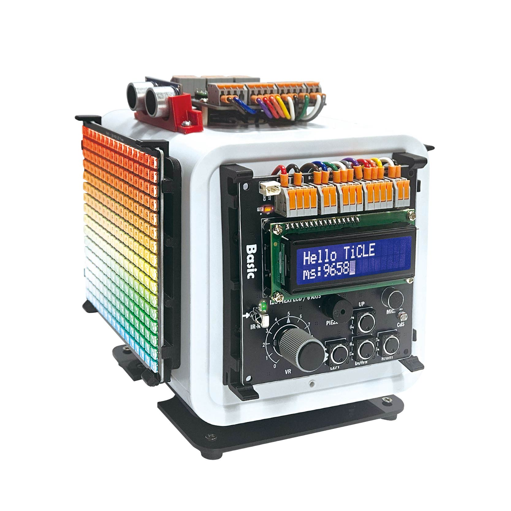

### 프레임 박스

프레임 박스는 TiCLE Lite의 몸체 역할을 한다. 보드 장착용 브라켓과 케이블 배선 홀이 있어 조립이 쉽고, 초음파 센서, 서보 모터, 스피커가 기본 장착되어 있어 바로 실습을 시작할 수 있다. 학습자는 각 위치에 보드를 고정하고 케이블을 연결하여 시스템을 완성하며, 이후 불빛 애니메이션, 거리 측정, 모터 각도 제어 같은 프로젝트를 단계적으로 수행한다. 자세한 조립과 제어 방법은 2장에서 다룬다.

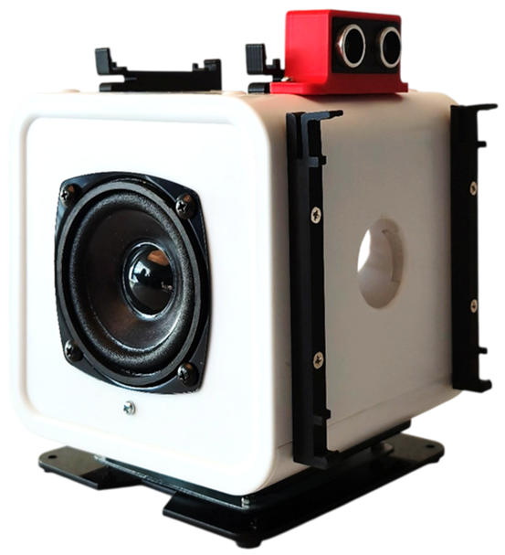

프레임 박스의 주요 사양은 다음과 같다.

| 항목 | 내용 |
| ---- | ---- |
| 크기 | 185x140x165mm (박스 자체 140x140x140mm) |
| 서보 모터 | 토크 9.4Kg/cm, 스피드 0.2sec/60° (베어링 턴테이블 결합) |
| 초음파 센서 | 측정 거리 최대 2m |
| 스피커 | 3" 최대 10W |

### Core 보드

Core 보드는 TiCLE Lite의 두뇌 역할을 하는 보드이다. 사용자가 작성한 프로그램이 이 보드에서 실행되며, RP2350 칩을 기반으로 동작한다. 또한 Wi-Fi와 BLE 통신을 담당하여 외부 장치와 데이터를 주고받을 수 있게 하며, 프레임 상단에 장착한다.


Core 보드의 주요 사양은 다음과 같다.

| 항목 | 내용 |
| ---- | ---- |
| 프로세서 | [RP2350](https://datasheets.raspberrypi.com/rp2350/rp2350-datasheet.pdf) |
| 무선 통신 | Wi-Fi, BLE |
| 핀 수 | 26개 |
| 인터페이스 | GPIO(26), PWM(16), ADC(3), I2C(2), SPI(2), UART(2), PIO(3) |

### Power 보드

Power 보드는 각 장치에 전원을 안정적으로 공급하는 보드이다. 프레임 뒤쪽에 장착하며, 여러 모듈을 동시에 사용해도 전압이 크게 흔들리지 않도록 충분한 전원 출력 핀을 제공한다.


| 항목 | 내용 |
| ---- | ---- |
| 5V 출력 핀 | 16개 |
| 3.3V 출력 핀 | 4개 |
| GND 핀 | 20개 |

### Basic 보드

Basic 보드는 실습에 자주 쓰는 입력·출력 부품을 미리 연결해 둔 보드이다. 스위치, 조도 센서, 마이크, 스피커 등이 납땜 없이 바로 동작하도록 구성되어 있어 초보자도 빠르게 실습할 수 있으며, 프레임 오른쪽에 장착한다.

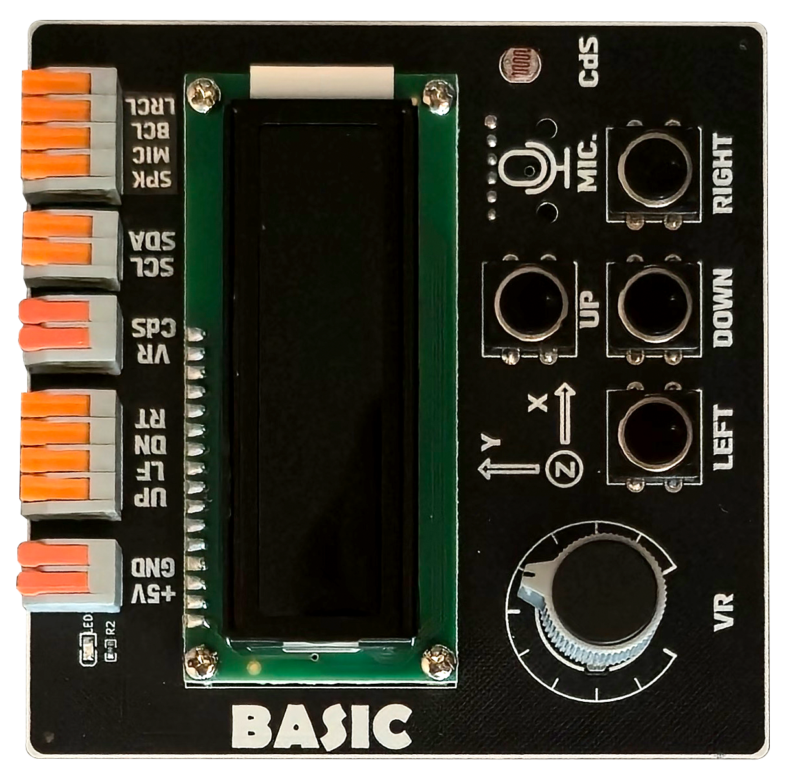

Basic 보드에 탑재된 부품 목록은 다음과 같다.

| 제어 방식 | 부품 |
| -------- | ---- |
| GPIO | 스위치 (Switch) |
| ADC | 가변 저항 (VR) |
| ADC | 조도 센서 (CdS) |
| PWM | 피에조 부저 (Piezo) |
| I2C | 문자 LCD (PCF8574) |
| I2C | 자이로·가속도 센서 (MPU6050) |
| I2S | 마이크 (ICS43434) |
| I2S | 스피커 (MAX98357) |


### Pixel Display 보드

Pixel Display 보드는 WS2812 컨트롤러가 내장된 RGB LED를 16x16으로 배열한 표시 장치이다. 프레임 정면에 장착하며, 글자, 아이콘, 애니메이션 등 눈에 보이는 결과를 즉시 확인하는 실습에 활용한다.

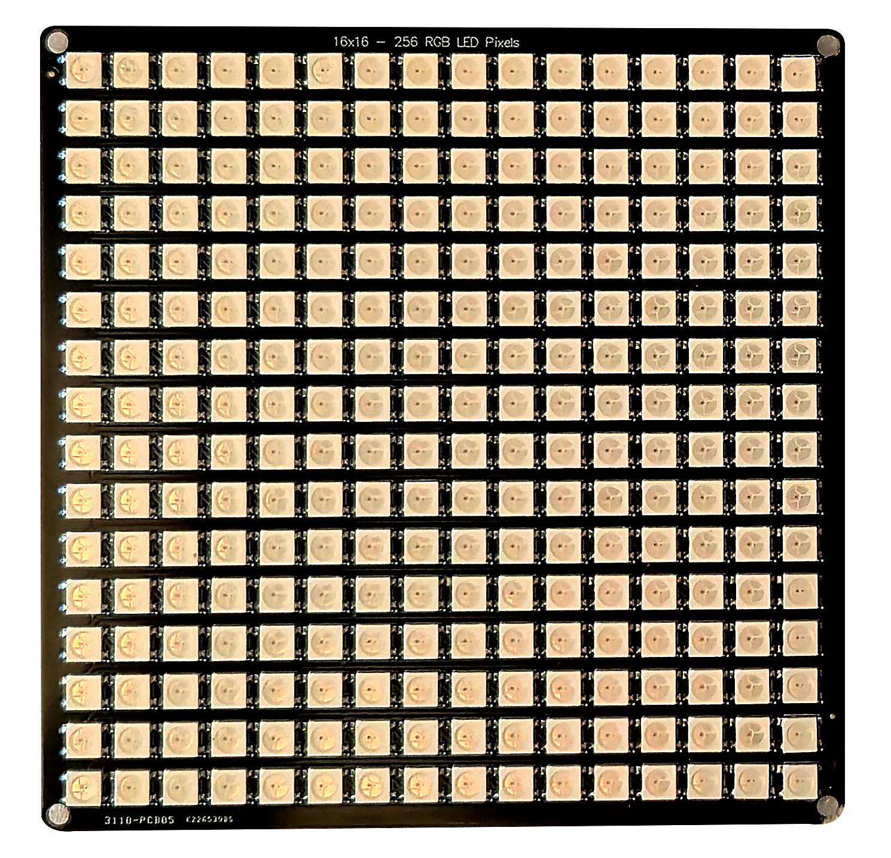

---

## 개발 환경 설치

이 절의 목적은 실습에 필요한 개발 환경을 정확하게 준비하는 데 있다. 프로그램을 작성하고 TiCLE Lite에서 실행하려면 먼저 컴퓨터에 도구를 설치해야 하며, 이 교재에서는 코드 편집기인 Visual Studio Code와 보드 연결 도구인 replx를 사용한다.

### Visual Studio Code 설치

Visual Studio Code(이하 VSCode)는 Microsoft에서 제공하는 무료 코드 편집기이다. 화면은 문서 편집기와 비슷하지만, 코드 자동 완성, 오류 표시, 터미널 실행 같은 프로그래밍 기능을 제공한다. Windows, macOS, Linux에서 사용할 수 있으며 Python을 포함한 다양한 언어를 지원한다.

한백전자에서는 VSCode와 실습 도구를 한 번에 설치할 수 있는 프로그램을 제공한다. 아래 링크에서 설치 파일을 다운로드한다.

- https://github.com/PlanXLab/DevEnv/releases/latest/download/devenv-setup.exe

다운로드한 `devenv-setup.exe`를 실행하면 디지털 서명이 없어 차단 알림창이 표시되는데, `More Info` 링크을 누르면 숨겨져 있던 `Run anyway` 버튼이 나타난다. 

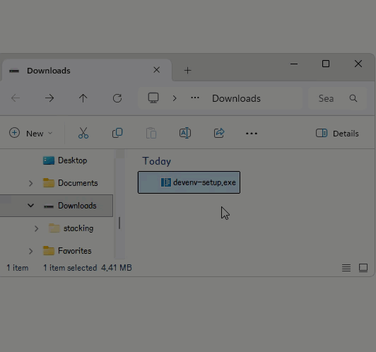</br>

설치 화면이 표시되면 Installation Path에는 VSCode 설치 경로를 입력하고, Python Version에는 사용할 버전을 입력하는데, 실습 호환성을 위해 3.12를 입력한다. 설치가 시작되면 3.12.x에서 x는 자동으로 최신 버전으로 설정된다.

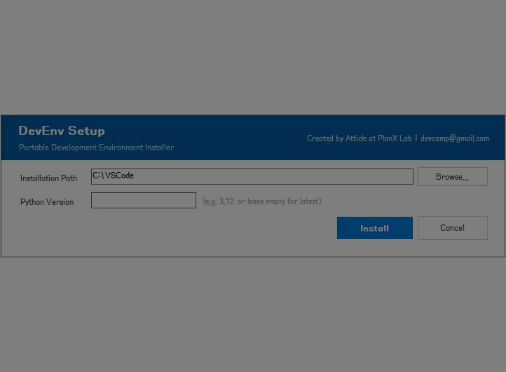</br>


설치가 끝나면 바탕화면 또는 시작 메뉴의 VSCode (Portable) 아이콘으로 실행한다. 이 아이콘은 설치 폴더의 launcher.exe를 통해 VSCode를 시작하며, 실행 과정에서 관련 도구 버전을 확인하고 필요하면 자동 업데이트를 진행한다.

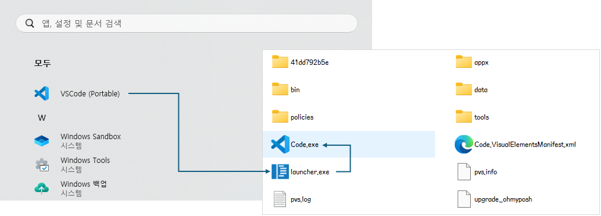</br>

다음은 인터넷에 해당 패키지의 업그레이가 존재할 때 표시되는 화면으로 Upgrade 버튼을 누르면 자동으로 업그레이드 된다.

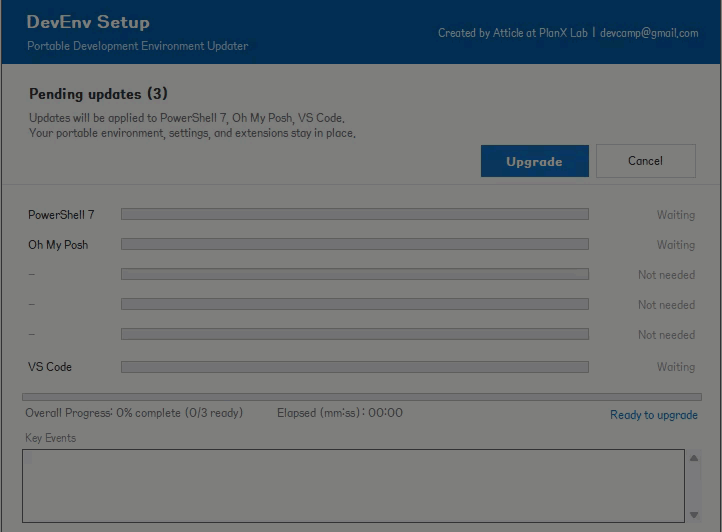</br>

### replx 설치

replx는 TiCLE Lite와 컴퓨터를 연결하고, 작성한 프로그램을 보드에서 실행하도록 도와주는 도구이다. 즉, "작성한 코드"와 "보드 실행"을 이어 주는 실습용 명령 도구이며 주요 기능은 다음과 같다.

| 기능 | 설명 |
| ---- | ---- |
| 프로그램 실행 | 작성한 코드 파일을 명령 한 줄로 보드에서 바로 실행한다. |
| 환경 설정 저장 | 어떤 포트에 보드가 연결되어 있는지 등을 미리 저장해 두어 매번 입력하지 않아도 된다. |
| 보드 제어 | 보드를 재시작하거나 REPL 화면에 접속하는 등의 조작을 간단하게 수행한다. |
| 파일 관리 | 보드 내부의 파일을 업로드하거나 삭제하는 등 관리할 수 있다. |
| 자동 업데이트 | 새 버전이 나오면 자동으로 감지하여 업데이트를 진행한다. |

replx의 상세 사용법은 아래 주소에서 확인할 수 있다.
> https://github.com/PlanXLab/replx

replx는 Python 패키지로 배포되므로 pip 명령어로 설치하는데, Python 버전 3.10 이상이 필요하다. 앞서 VSCode를 설치했으므로 VSCode 터미널은 메뉴에서 `Terminal > New Terminal`을 선택하거나 단축키(Ctrl+Shift+`)로 열 수 있다.

터미널이 열리면 다음 명령어를 입력하고 Enter를 누른다. 설치 시점에 따라 버전과 의존성 패키지는 일부 달라질 수 있다.

```
pip install replx
```

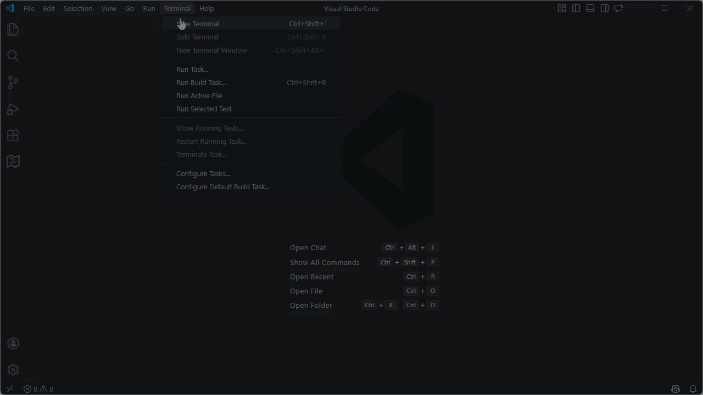</br>

---

## TiCLE Lite 연결 및 초기 설정

이 절의 목표는 보드 연결부터 작업 환경 등록, 초기화까지 한 번에 끝내는 것이다. 이 과정을 완료하면 이후 장에서는 명령어를 반복 입력하지 않고 실습을 빠르게 진행할 수 있다.

### 작업 폴더 열기

VSCode에서 코드 파일을 저장하고 관리하는 기준 폴더를 작업 공간(Workspace) 이라 한다. 작업 공간을 먼저 지정해 두면 파일 탐색과 터미널 경로가 자동으로 해당 폴더를 기준으로 동작하므로, 실습 전에 반드시 설정해야 한다.

VSCode를 실행한 뒤 `File > Open Folder`를 선택하거나, 왼쪽 사이드 바의 `Explorer`에서 `Open Folder`를 선택한다. 원하는 위치에 새 폴더를 만들어 열거나 미리 준비한 폴더를 열면 된다. 폴더를 처음 열면 해당 폴더의 파일을 신뢰할 수 있는지 확인하는 창이 나타난다. `Yes, I trust the authors`를 선택해야 확장 기능이 정상적으로 동작한다.

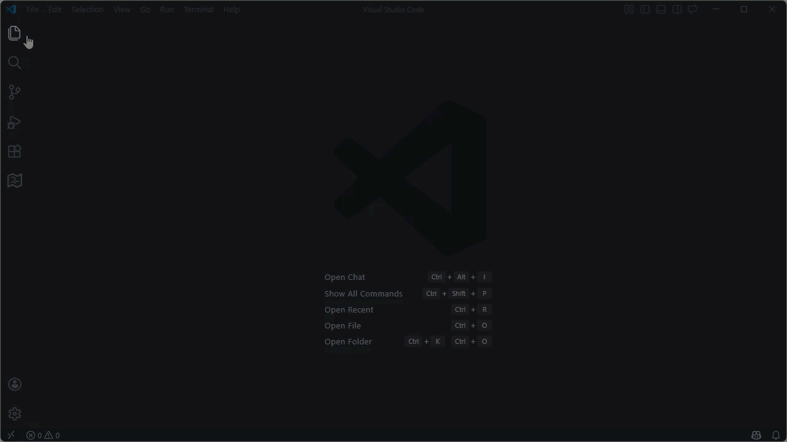<br>

### 보드 연결 및 포트 확인

TiCLE Lite의 Core 보드에 있는 USB 마그네틱 포트를 컴퓨터와 제공된 USB 케이블로 연결한다. 연결 상태는 아래 그림을 참고한다.

</br>

연결이 완료되면 VSCode 터미널에서 다음 명령어를 실행한다. 이 명령으로 컴퓨터에 연결된 보드의 포트 번호를 확인한다.

```
replx scan
```

```
╭─ MicroPython Devices ────────────────────────────────────────────────────────────────────────────╮
│    COM3    1.27.0  RP2350  ticle-lite  Hanback Electronics                                       │
│                                                                                                  │
│   󱓦 connected    󰷌 default                                                                       │
╰──────────────────────────────────────────────────────────────────────────────────────────────────╯
```

### 환경 설정

포트 번호를 확인했으면, 아래 명령어로 현재 작업 폴더를 마이크로파이썬 작업 공간으로 등록한다. 이 설정을 마치면 이후 replx 명령에서 포트 번호를 매번 입력하지 않아도 되고, 패키지 다운로드까지 끝내면 VSCode에서 마이크로파이썬 코드 힌트도 사용할 수 있다.

```
replx -p <시리얼 포트> setup
```
```
➜ replx -p COM3 setup
╭─ Setup Complete ─────────────────────────────────────────────────────────────────────────────────╮
│ Connection: COM3 (Default)                                                                       │
│ Version: 1.27.0                                                                                  │
│ Core: RP2350                                                                                     │
│ Device: ticle-lite                                                                               │
│ Manufacturer: Hanback Electronics                                                                │
│ Workspace: D:\Workspace\lecture\test                                                             │
│ Typehints: 2 path(s) configured                                                                  │
╰──────────────────────────────────────────────────────────────────────────────────────────────────╯
```

### 보드 초기화

환경 설정이 끝났으면 아래 명령어를 순서대로 실행하여 TiCLE Lite를 초기화한다. `pkg download` 명령은 TiCLE Lite 전용 라이브러리를 인터넷에서 내려받으므로, 컴퓨터가 인터넷에 연결되어 있어야 한다.

```
replx pkg download
```
```
╭─ Downloading core/RP2350 + device/ticle-lite ────────────────────────────────────────────────────╮
│ Downloading... sr04a.pyi (68/68)                                                                 │
│ [████████████████████████████████████████████████████████████] 100% (68/68)                      │
╰──────────────────────────────────────────────────────────────────────────────────────────────────╯
╭─ Download Complete ──────────────────────────────────────────────────────────────────────────────╮
│ core/RP2350 + device/ticle-lite: 68 file(s) downloaded. ( 68,  0)                              │
╰──────────────────────────────────────────────────────────────────────────────────────────────────╯
```

`init` 명령은 TiCLE Lite 저장 공간을 포맷한 뒤 전용 라이브러리를 다시 설치한다.

```
replx init
```
```
╭─ Format Complete ────────────────────────────────────────────────────────────────────────────────╮
│ ✓ File system on ticle-lite formatted successfully.                                              │
╰──────────────────────────────────────────────────────────────────────────────────────────────────╯
╭─ Installing core.all to ticle-lite ──────────────────────────────────────────────────────────────╮
│ [6/21] io_async.mpy (3.0KB)                                                                      │
│ [█████████████░░░░░░░░░░░░░░░░░░░░░░░░░░░░░░░░░░░░░░░░░░░░░░░] 21% (29.9KB/139.6KB)              │
╰──────────────────────────────────────────────────────────────────────────────────────────────────╯
```

---

## 첫 번째 프로그램 실행

이 절의 목표는 프로그램 작성부터 실행 결과 확인까지의 기본 흐름을 익히는 것이다. 먼저 가장 간단한 출력 예제로 실행 과정을 익히고, 이어서 픽셀 디스플레이 예제로 눈에 보이는 결과를 확인한다.

### Hello World

모든 환경 설정이 끝났다면 첫 번째 프로그램을 작성하고 실행한다. VSCode 왼쪽 탐색기(Explorer) 상단의 새 파일 만들기 아이콘을 눌러 파일을 만들고 이름을 main.py로 지정한다. VSCode 탐색기는 윈도우 탐색기와 사용법이 비슷하며, 이름 바꾸기는 F2, 파일 삭제는 DEL 키를 사용한다.

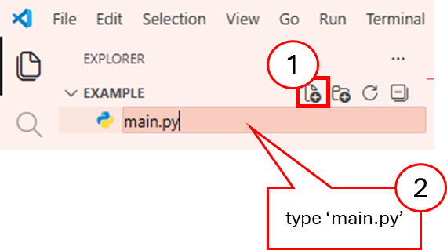

<br>

main.py 편집창이 열리면 아래 코드를 입력한다.

```python
print("Hello TiCLE World!")
```

코드 작성을 마쳤으면 run 명령으로 main.py를 TiCLE Lite에서 실행한다(➜는 프롬프트이므로 입력하지 않는다). 실행 결과는 터미널에 바로 표시된다.

```
➜ replx run main.py
Hello TiCLE World!
```

run 명령은 자주 사용하므로 생략할 수 있다.

```
replx main.py
```

또한 코드의 첫 줄에 #!replx를 추가하면,
```
#!replx
print("Hello TiCLE World!")
```

replx 명령도 생략할 수 있다.

```
➜ main.py
Hello TiCLE World!
```


### 픽셀 애니메이션

본격적인 실습에 앞서 TiCLE Lite의 픽셀 디스플레이(WS2812)에 다양한 효과를 출력하는 예제를 실행한다. pixel_effect.py 파일을 새로 만들고 아래 내용을 입력한다.

```python
#!replx
from ticle_lite.ws2812 import Matrix, Effect
from termio import KeyReader

def get_effects(fx_obj):
    exclude = ('stop')
    return [getattr(fx_obj, n) for n in dir(fx_obj) 
            if callable(getattr(fx_obj, n)) and not n.startswith('_') and n not in exclude]

def cycle(iterable):
    while True:
        for item in iterable:
            yield item

def run_app():
    m = Matrix([0])
    fx = Effect(m)
    
    effs = get_effects(fx)
    eff_iterator = cycle(effs)

    def play_next():
        fx.stop()
        current = next(eff_iterator)
        print(f"Playing: {current.__name__}")
        current()

    play_next()

    with KeyReader() as kr:
        while True:
            key = kr.wait_key()
            if key == "n":
                play_next()
            elif key == "q":
                fx.stop()
                m.clear()
                print("Exit.")
                break

if __name__ == "__main__":
    print("Press 'n' for next effect, 'q' to quit.")
    run_app()
```

코드 입력이 완료되면 터미널에서 다음과 같이 실행한다. 실행 중 키 n을 누르면 다음 효과로 전환되고, q를 누르면 종료한다.

```
pixel_effect.py
```

다음은 spark_stream 효과가 적용된 결과이다.

