# 기본 제어

이 장에서는 Micropython을 통해 TiCLE LiTE 장비에 기초적인 제어를 하고자 합니다.

Micropython이란 Python 3 언어를 최소화 및 효율성을 증진시킨 언어이며, Python의 기본 문법과 표준 라이브러리의 기본 기능을 포함하고 마이크로컨트롤러와 같은 제한된 환경에서 실행되도록 기획된 언어입니다. 또한, `machine` 라이브러리를 기본으로 제공하여 마이크로컨트롤러의 기능 사용 및 확장 등의 작업들에 용이하게 사용할 수 있도록 제공해줍니다.

본 교재는 TiCLE Lite에 장착된 센서 및 액추에이터를 제어하는 수준으로써의 간략한 버전으로 설명을 제공합니다. 보다 더 자세한 기능에 대해 알아가고 싶으시다면 아래 링크를 참고해주시길 바랍니다.

- https://docs.micropython.org/en/latest/library/index.html#python-standard-libraries-and-micro-libraries

TiCLE Lite 제품은 기본적으로 Core 보드와 Basic 보드간에 연결이 된 상태로 출고됩니다. 상세한 핀 연결 정보는 후술한 핀 정보를 참고하여 주십시오. 이 후 프로젝트 챕터에서도 동일한 핀을 사용합니다.

## Basic 보드 전원 연결

실습을 시작하기 전 TiCLE Lite의 Power 보드에 전원 연결이 필요합니다. 아래 사진과 같이 Power 보드의 5V/GND를 Basic 보드의 5V/GND에 연결합니다. 반드시 다른 전압이 아닌 **5V 전압을 연결하도록 합니다.**

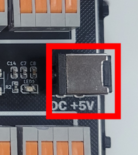

## GPIO

GPIO는 `General Purpose Input Output`의 약자로 말 그대로 범용으로 사용되는 입출력 포트를 의미합니다. 여러가지 다양한 용도로 사용될 수 있다는 것을 의미하기도 합니다. TiCLE Lite에는 마이크로컨트롤러 외에 여러가지 다양한 일을 수행하는 주변장치 및 소자들이 존재합니다. 이 주변 소자들은 MCU의 미리 정해진 인터페이스에 연결되어 동작 하는 것 들도 있지만, 그렇지 않은 경우가 더 많습니다. 이러한 다양한 주변 소자들을 동작 시키기 위해서는 그 주변소자들이 원하는 방식으로 인터페이스를 하여 원하는 신호를 보내주어야 합니다. 예를 들어 LED를 켜거나, 버저를 울리기 위해서는 그 소자에 0 혹은 1의 신호를 보내주어야 하고, TEXT-LCD에 글자를 출력하기 위해서는 좀 더 복잡한 병렬 신호들을 보내 주어야 합니다. 또한, 스위치나 마이크 등의 입력을 받기 위해서는 그 소자들로부터 나오는 신호를 받아들일 수 있는 통로를 가져야 합니다다 이와 같이 TiCLE Lite에서 일어나는 여러 가지 다양한 일들을 처리하기 위해 프로그래머가 마음대로 변형하면서 제어할 수 있도록 제공해 주는 I/O(입출력) 포트를 GPIO라고 합니다.

TiCLE Lite에 장착된 RP2350 마이크로컨트롤러 또한 많은 수의 GPIO 포트를 보유하고 있습니다. 사실 특수한 용도로 사용하는 몇몇 핀을 제외하고는 거의 모든 핀들이 GPIO로 사용할 수 있다고 보아도 무방합니다. 그만큼 마이크로컨트롤러에서 GPIO의 중요성은 매우 크다고 할 수 있으며, 어떤 고성능 마이크로컨트롤러나 SoC에서도 이러한 경향은 마찬가지입니다.

Micropython에서 GPIO 제어는 `machine` 라이브러리의 `Pin` 클래스를 사용하여 제어합니다.

### LED

아래 사진과 같이 Core 보드 내의 Raspberry Pi Pico 2 W 위에 위치한 LED를 제어합니다. 

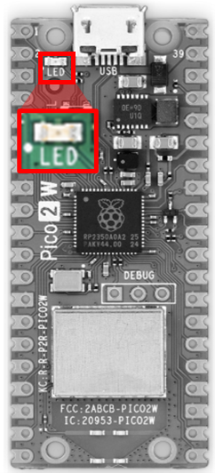

VSCode 상에서 아래와 같이 코드를 작성한 후 'led.py' 라는 이름으로 저장합니다.

```py
# led.py
from machine import Pin
import utime

led_pin = Pin('LED', Pin.OUT)

led_pin.on()
utime.sleep_ms(1000)
led_pin.off()
utime.sleep_ms(1000)

led_pin.value = 1
utime.sleep_ms(1000)
led_pin.value = 0
utime.sleep_ms(1000)
```

4번 개행 줄의 `Pin` 클래스를 생성하는 과정을 주목해 봅니다. 상술하였듯 `machine` 라이브러리에는 마이크로컨트롤러 제어에 필요한 다양한 기능들이 담겨져 있으며, 그 기능들 중 GPIO 제어를 담당하고 있는 `Pin` 클래스를 들고와 인스턴스를 생성합니다. 인스턴스를 생성할 때 두 가지 기본 인자값을 받습니다. 젓 번째는 핀 번호이고, 두 번째는 입출력 방향입니다. 핀 번호는 제어하고자 하는 센서 및 액추에이터과 같은 주변장치가 연결된 핀 번호를 입력해주면 됩니다. 일반적으로 자연수 값이 입력되며, 지금과 같이 Raspberry Pi Pico 2 W 보드 위에 있는 LED를 제어할 때는 특수한 경우로 'LED' 라고 기입합니다. 입출력 방향은 각종 주변장치에 신호를 보낼 지, 아님 신호를 받을 지를 결정해주면 됩니다. 지금은 LED 출력을 제어해 줄 것이기 때문에 `Pin.OUT`, 즉 출력 방향으로 설정해줍니다.

그 이후의 코드는 총 2번 씩 LED가 번갈아 점멸하는 기능을 지시하는 코드입니다. 점멸 주기는 1초이며, 시간과 관련된 기능들이 포함된 라이브러리 `utime` 에서 명시된 시간만큼 동작을 정지시키는 `sleep_ms()` 함수를 통해 주기를 설정해줍니다. 여기서 `sleep_ms` 함수의 인자값은 miliseconds 단위이며, 1 밀리초는 $1*10^{-3}$ 초와 같습니다.

led와 연결된 핀을 제어하는 방법은 총 두 가지가 있습니다. 하나는 `on`/`off` 함수를 사용하는 것이고, 다른 하나는 Pin 클래스의 멤버 변수 `value`의 값을 조정하는 것입니다. `value` 변수는 프로퍼티로 설정되어 있어 실시간으로 값을 읽거나 받을 수 있고, `on`/`off` 함수 또한 본질적으로 `value` 변수의 값을 수정하고 있습니다. 결론적으로 두 가지 방법 다 동일한 결과를 출력하며, 코딩 스타일에 따라 선택할 수 있는 폭이 넓어진 것과 같습니다.

터미널에 다음 명령어를 입력하여 프로그램을 실행시키면, Raspberry Pi Pico 2 W에 부착된 LED가 점멸하는 것을 확인할 수 있습니다.

```sh
replx led.py
```

### Switch

아래 사진과 같이 위치한 Switch를 제어해 보겠습니다. 

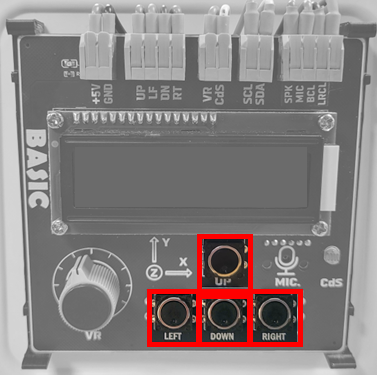

| Peripheral | Pin number |
| ------ | ---------- |
| UP | 18 |
| LEFT | 19 |
| DOWN | 20 |
| RIGHT | 21 |

VSCode 상에서 아래와 같이 코드를 작성한 후 'switch.py' 라는 이름으로 저장합니다.

```py
# switch.py
from machine import Pin
import utime

up_sw_pin = Pin(16, Pin.IN)
left_sw_pin = Pin(17, Pin.IN)
down_sw_pin = Pin(18, Pin.IN)
right_sw_pin = Pin(19, Pin.IN)

for i in range(10):
    print(f"up: {up_sw_pin.value()}, left: {left_sw_pin.value()}, down: {down_sw_pin.value()}, right: {right_sw_pin.value()}")
    utime.sleep_ms(500)
```

버튼의 입력을 받는 것 또한 `Pin` 클래스를 사용합니다. 상술하였듯 `value` 멤버 변수는 프로퍼티로 구현되었기 때문에, 실시간으로 핀의 상태값을 확인받을 수 있습니다.

터미널에서 다음 명령어를 입력해 프로그램을 실행합니다. 버튼을 눌림 상태에 따라 프로그램 출력값이 달라지는 것을 확인할 수 있습니다.

```sh
replx switch.py
```

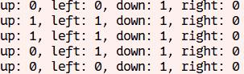

### Ultrasonic

아래 사진과 같이 위치한 Ultrasonic을 제어해 봅니다. 

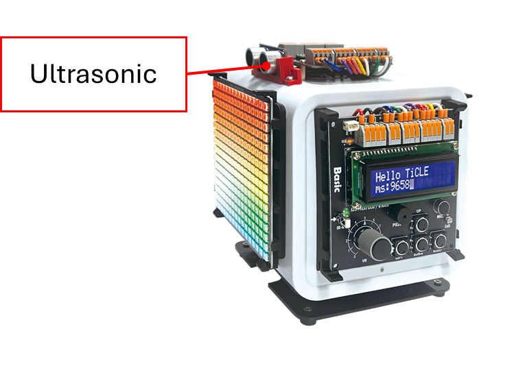

| Connection pin | Pin number |
| ------ | ---------- |
| TRIG | 10 |
| ECHO | 11 |

VSCode 상에서 아래와 같이 코드를 작성한 후 'ultra.py' 라는 이름으로 저장합니다.

```python
# ultra.py
from machine import Pin, time_pulse_us
import time

trig = Pin(10, Pin.OUT)
echo = Pin(11, Pin.IN)

trig.value(0)
time.sleep_ms(100)

while True:
    trig.value(0)
    time.sleep_us(2)
    trig.value(1)
    time.sleep_us(10)
    trig.value(0)

    try:
        duration = time_pulse_us(echo, 1, 30000)
        distance = duration * 0.0343 / 2
        print(distance)
    except OSError:
        print("timeout")

    time.sleep_ms(200)
```

터미널에서 다음 명령어로 실행합니다.

```
replx ultra.py
```

## PIO

PIO(Programmable I/O)는 TiCLE의 RP2350 마이크로컨트롤러에 내장된 독립적인 입출력 처리 장치로, 일반적인 GPIO보다 훨씬 정밀하고 유연한 신호 제어를 가능하게 합니다. PIO는 간단한 명령어로 구성된 전용 프로그램을 실행하여, CPU의 개입 없이도 일정한 타이밍으로 데이터를 송수신하거나 특정 신호 패턴을 생성할 수 있습니다.

RP2350에는 두 개의 PIO 블록이 있으며, 각 블록은 네 개의 상태머신(State Machine)을 가지고 있어 동시에 여러 입출력 동작을 병렬로 수행할 수 있습니다. 이러한 구조를 통해 PixelLed 제어나, 독자적인 통신 프로토콜, 고속 파형 출력 등과 같이 정밀한 타이밍이 필요한 작업을 효율적으로 처리할 수 있습니다.

결과적으로 PIO는 RP2350을 단순한 마이크로컨트롤러가 아닌, 작은 범용 하드웨어 제어 장치로 확장시켜주는 핵심 기능이라 할 수 있습니다.

### PixelLed

PixelLed(WS2812)는 각 LED마다 고유한 데이터 입력 핀을 가진 개별 제어형 RGB LED로, 하나의 데이터 라인으로 여러 LED를 직렬로 연결해 제어할 수 있는 특징이 있습니다. 그러나 PixelLed는 정확한 타이밍(나노초 단위)의 신호를 요구하기 때문에, 일반적인 GPIO 제어나 소프트웨어 루프로는 안정적인 구동이 어렵습니다.

이때 RP2350의 PIO를 사용하면, CPU의 간섭 없이 하드웨어 수준에서 정확한 주기와 신호 폭을 유지하며 데이터를 전송할 수 있습니다. 즉, PIO가 일정한 속도로 LED 데이터 스트림을 생성하고 CPU는 다른 작업을 수행할 수 있어, 다수의 PixelLed를 효율적이고 안정적으로 제어할 수 있습니다.

아래 사진과 같이 위치한 PixelLed를 제어해봅니다.

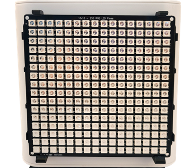

| Peripheral | Pin number |
| ------ | ---------- |
| PixelLed | 0 |

VSCode 상에서 아래와 같이 코드를 작성한 후 'pixelled.py' 라는 이름으로 저장합니다.

```py
# pixelled.py
from machine import Pin
from rp2 import PIO, StateMachine, asm_pio
import utime

WIDTH, HEIGHT = 16, 16

@asm_pio(
    sideset_init=PIO.OUT_LOW,
    out_shiftdir=PIO.SHIFT_LEFT,
    autopull=True,
    pull_thresh=24
)
def pixelled():
    T1 = 2
    T2 = 5
    T3 = 3
    wrap_target()
    label("bitloop")
    out(x, 1)               .side(0) [T3 - 1]
    jmp(not_x, "do_zero")   .side(1) [T1 - 1]
    jmp("bitloop")          .side(1) [T2 - 1]
    label("do_zero")
    nop()                   .side(0) [T2 - 1]
    wrap()

class PixelLedMatrixPIO:
    def __init__(self, pin, width=WIDTH, height=HEIGHT, sm_id=0, freq=8_000_000):
        self.width, self.height = width, height
        self.buf = bytearray(width * height * 3)
        self.sm = StateMachine(sm_id, pixelled, freq=freq, sideset_base=Pin(pin))
        self.sm.active(1)

    def _idx(self, x, y):
        return (y * self.width + x) * 3

    def __setitem__(self, xy, rgb):
        x, y = xy
        r, g, b = rgb
        i = self._idx(x, y)
        self.buf[i + 0] = g & 0xFF
        self.buf[i + 1] = r & 0xFF
        self.buf[i + 2] = b & 0xFF

    def clear(self):
        for i in range(len(self.buf)):
            self.buf[i] = 0

    def show(self):
        mv = memoryview(self.buf)
        for i in range(0, len(mv), 3):
            v = (mv[i] << 16) | (mv[i + 1] << 8) | mv[i + 2]
            self.sm.put(v, 8)
        utime.sleep_us(300)

matrix = PixelLedMatrixPIO(pin=0, width=16, height=16)
matrix.clear()
matrix[3, 4] = (255, 0, 0)
matrix[4, 4] = (0, 255, 0)
matrix[5, 4] = (0, 0, 255)
matrix.show()
```

각 픽셀의 색상을 지정한 뒤, PIO를 통해 일정한 타이밍으로 데이터를 전송하여 LED의 색을 정확하게 표시합니다.

프로그램은 먼저 PIO 어셈블리로 PixelLed 통신 규격에 맞는 신호를 생성합니다. 이 신호는 LED가 요구하는 나노초 단위의 정밀한 펄스 폭을 유지해야 하므로, 일반적인 GPIO 제어 대신 PIO를 사용합니다. 이후 `PixelLedMatrixPIO` 클래스는 PixelLed를 위한 버퍼를 생성하고, 각 좌표에 해당하는 색상 데이터를 RGB 형태로 저장합니다. `show()` 함수가 호출되면 이 데이터가 순서대로 전송되어 매트릭스에 표시됩니다.

이와 같은 구조를 통해 CPU는 복잡한 타이밍 제어에 관여하지 않고도 안정적으로 다수의 LED를 구동할 수 있습니다. 실습을 실행하면 특정 좌표의 LED가 빨강, 초록, 파랑으로 점등되는 것을 확인할 수 있습니다.

터미널에서 다음 명령어를 입력해 프로그램을 실행합니다. 이후 특정 위치의 PixelLed 픽셀에 대해 색상이 들어옵니다. 

```sh
replx pixelled.py
```

## ADC

ADC란 'Analog to Digital Conversion' 의 약자로써, 문자 그대로 아날로그 신호를 디지털 신호로 변환시켜주는 장치를 의미합니다. 디지털 신호만 처리하는 컴퓨터와는 다르게 우리 세상 속에는 수없이 많은 아날로그 신호들이 있습니다. 대표적인 예로 빛을 들자면, High/Low만 구분할 수 있는 디지털과는 달리 빛의 양, 즉 조도량은 High/Low로 표현할 수 없습니다. 이와 같은 아날로그 신호들은 ADC를 거쳐 디지털 신호로 변환된 뒤 그 값을 확인시켜줄 수 있게 해줍니다.

Micropython에선 `machine` 라이브러리의 `ADC` 클래스를 사용하여 제어합니다.

### VR

VR이란 가변 저항의 변화를 측정하는 센서로써, 다이얼이 돌려진 값을 정확하게 파악할 수 있는 센서입니다. 아래 사진과 같이 위치한 VR을 제어해봅니다.

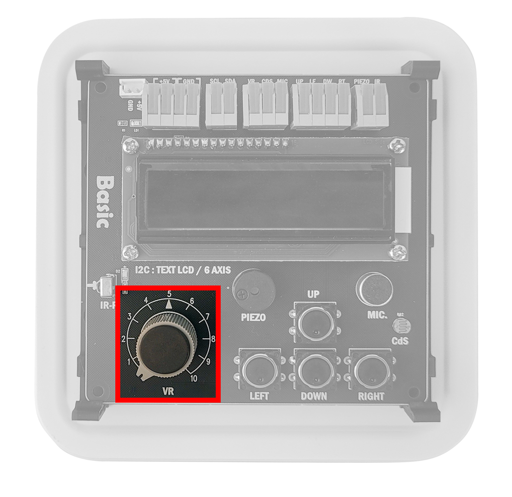

| Peripheral | Pin number |
| ------ | ---------- |
| VR | 27 |

VSCode 상에서 아래와 같이 코드를 작성한 후 'vr.py' 라는 이름으로 저장합니다.

```python
# vr.py
from machine import Pin, ADC
import utime

vr_pin = 27

vr = ADC(Pin(vr_pin))

while True:
    print(f"VR : {vr.read_u16()}")
    utime.sleep_ms(500)
```

실질적으로 ADC를 통해 센서값을 읽는 함수는 `read_u16()` 함수입니다. 이 함수는 3.3V를 16bit(0~65535)로 변환시켜주어 디지털 값으로 반환시켜줍니다.

터미널에서 다음 명령어를 입력해 프로그램을 실행합니다. 다이얼의 돌림 상태에 따라 프로그램 출력값이 달라지는 것을 확인할 수 있습니다.

```
VR : 14003
VR : 52364
VR : 59054
VR : 63167
VR : 12739
VR : 80
VR : 96
```

### CdS

CdS란 조도량을 측정할 수 있는 센서입니다. 아래 사진과 같이 위치한 Cds를 제어해봅니다.

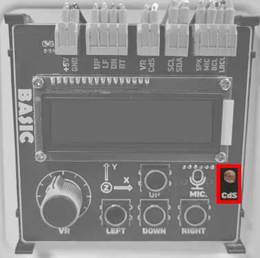

| Peripheral | Pin number |
| ------ | ---------- |
| CdS | 28 |

VSCode 상에서 아래와 같이 코드를 작성한 후 'cds.py' 라는 이름으로 저장합니다.

```python
# cds.py
from machine import Pin, ADC
import utime

cds_pin = 28

cds = ADC(Pin(cds_pin))

while True:
    print(f"CDS : {cds.read_u16()}")
    utime.sleep_ms(500)
```

터미널에서 다음 명령어를 입력해 프로그램을 실행합니다. 주변 환경의 밝기 상태에 따라 프로그램 출력값이 달라지는 것을 확인할 수 있습니다.

```sh
replx cds.py
```

터미널 출력 결과

```
CDS : 50892
CDS : 50700
CDS : 50636
CDS : 50508
```

## PWM

펄스 폭 변조(PWM Pulse Width Modulation)는 디지털 방식으로 다양한 아날로그 신호를 흉내 내는 기술로 HIGH와 LOW로 구성된 펄스에 HIGH 구간의 비율을 조절하는 것으로 설명할 수 있습니다.

PWM 신호를 정의하는 매개 변수는 주파수와 듀티 사이클입니다. 주파수는 펄스, 듀티 사이클은 펄스 폭에 해당하는 것으로 출력 장치의 전원에 주파수를 듀티 사이클로 순환시킨 PWM 출력을 전달하면, 출력 장치는 이를 정전압 아날로그 신호로 인식합니다. 

듀티 사이클은 HIGH 구간의 펄스 폭을 주기에 대한 백분율로 표현하는데, 주파수가 고정된 상태에서 듀티 사이클을 바꾸면 출력되는 평균 전압도 변합니다. 100% 듀티 사이클은 출력 레벨이 HIGH임을 의미하고 0% 듀티 사이클은 LOW임을 의미합니다. 50% 듀티 사이클은 출력 레벨이 HIGH와 LOW의 중간입니다. 60% 듀티 사이클은 출력을 60% 동안만 HIGH로 유지하므로 주기가 10 us (마이크로 초; 1 us = $1*10^{-6}$ 초)(100kHz)인 경우 6 us 동안 출력이 HIGH를 유지하며, HIGH일 때 최대 전압이 3.3V라면 평균 전압은 3.3V * 0.6 = 1.98V입니다. 

Micropython에서의 PWM 제어는 `machine` 라이브러리의 `PWM` 클래스를 사용하여 제어합니다.

### Servo Motor

아래 사진과 같이 위치한 Servo Motor를 제어해봅니다.

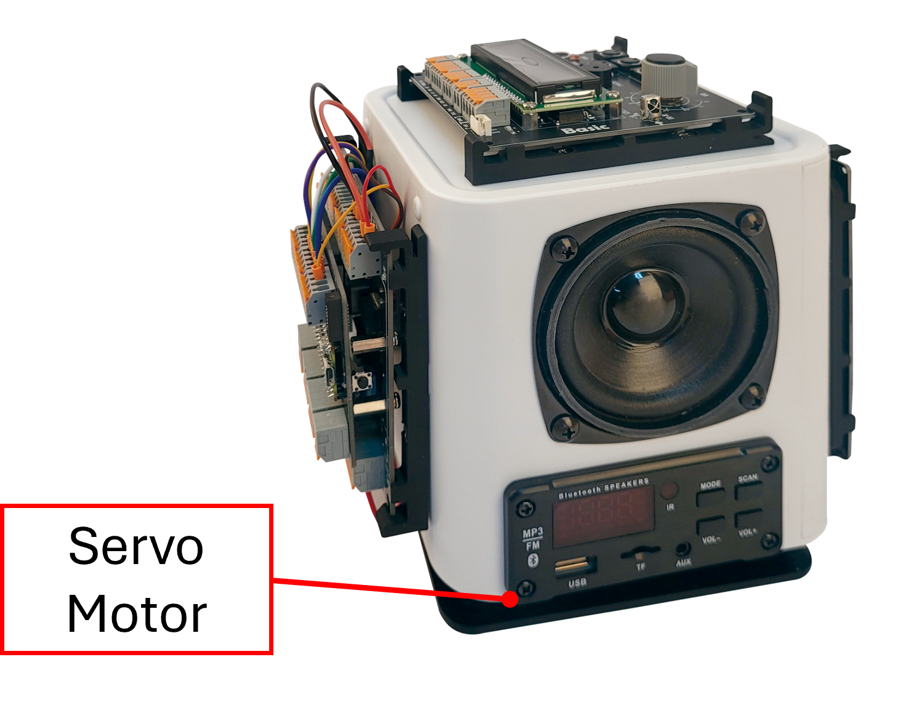

| Peripheral | Pin number |
| ------ | ---------- |
| Servo | 1 |

VSCode 상에서 아래와 같이 코드를 작성한 후 'servo.py' 라는 이름으로 저장합니다.

```py
# servo.py
from machine import Pin, PWM
import utime

class Servo:
    def __init__(self, pin, freq=50):
        self.pwm = PWM(Pin(pin))
        self.pwm.freq(freq)
        self.min_duty = 1638
        self.max_duty = 8191

    def write(self, angle):
        angle = max(0, min(180, angle))
        duty = self.min_duty + (self.max_duty - self.min_duty) * angle // 180
        self.pwm.duty_u16(duty)

    def deinit(self):
        self.pwm.deinit()

servo = Servo(pin=1)
for ang in range(0, 181, 30):
    servo.write(ang)
    utime.sleep(0.5)
for ang in range(180, -1, -30):
    servo.write(ang)
    utime.sleep(0.5)
servo.deinit()
```

초기화 시 PWM 주파수를 50Hz로 설정하며, write(angle) 함수를 통해 0~180도 범위의 각도를 듀티비로 변환하여 제어합니다.

deinit() 함수는 PWM 출력을 종료하여 서보모터의 동작을 멈추며, 예제에서는 일정 각도로 움직였다가 다시 원위치로 돌아오도록 반복 동작합니다.

터미널에서 다음 명령어를 입력해 프로그램을 실행합니다. 서보모터의 각도가 0~180도에서 30도 간격으로 회전하는 것을 확인할 수 있습니다.

```sh
replx servo.py
```

<br>

위 클래스를 활용하여 아래와 같은 예제를 작성할 수 있습니다.

```py
# servo.py
from ticle.servo import Servo
import utime

servo_pin = 1

servo = Servo(servo_pin)

while True:
    for i in range(0,180):
        servo.angle = i
        utime.sleep_ms(100)
```

## I2C

프로세서에 내장되어 근거리 칩 사이 통신에 사용되는 I2C Inter-Integrated Circuit는 동기식 직렬 통신 방식 중 하나로 풀업 저항이 연결된 SDA Serial Data와 SCL Serial Clock이라는 두 개의 반 이중 방식 Half-Duplex 오픈 드레인 버스 라인을 사용해 프로세서와 주변장치 사이에 데이터를 교환합니다. 

I2C는 마스터와 슬레이브 동작을 지원하며, 다중 마스터도 가능합니다. 각 디바이스는 송신기나 수신기로 동작합니다. I2C의 7bit 주소는 128개의 다른 슬레이브 주소까지 허용하며 400kHz까지의 데이터 전송 속도를 지닙니다.

이러한 특징은 I2C의 두 핀(scl/sda) 연결만으로도 I2C 라인에 위치한 모든 주변장치들을 제어할 수 있다는 것을 의미합니다. 핀 연결 정보는 다음과 같습니다.

| Connection pin | Pin number |
| ------ | ---------- |
| SCL | 13 |
| SDA | 12 |

### LCD

아래 사진과 같이 위치한 LCD를 제어해봅니다. LCD 품목 명칭은 `PCF8574` 이며, 정확한 데이터 시트는 아래 사이트에서 확인하실 수 있습니다.
- https://www.alldatasheet.com/datasheet-pdf/pdf/18212/PHILIPS/PCF8574.html

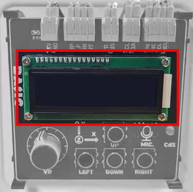

<br>

VSCode 상에서 아래와 같이 코드를 작성한 후 'lcd.py' 라는 이름으로 저장합니다.

```python
# lcd.py
from machine import I2C, Pin
import utime

ADDR = 0x27

class LCD_PCF8574:
    def __init__(self, i2c, addr=ADDR, backlight=True):
        self.i2c = i2c
        self.addr = addr
        self.bl = 0x08 if backlight else 0x00
        utime.sleep_ms(50)
        self._pulse(0x30)
        utime.sleep_ms(5)
        self._pulse(0x30)
        utime.sleep_us(200)
        self._pulse(0x30)
        self._pulse(0x20)
        self.cmd(0x28)
        self.cmd(0x0C)
        self.cmd(0x06)
        self.clear()

    def _send_raw(self, data):
        self.i2c.writeto(self.addr, bytes([data | self.bl]))

    def _pulse(self, data):
        self._send_raw(data | 0x04)
        utime.sleep_us(500)
        self._send_raw(data & ~0x04)
        utime.sleep_us(100)

    def _send_nibble(self, nibble, rs):
        data = ((nibble & 0x0F) << 4) | (0x01 if rs else 0x00)
        self._send_raw(data)
        self._pulse(data)

    def _send_byte(self, val, rs):
        self._send_nibble(val >> 4, rs)
        self._send_nibble(val & 0x0F, rs)

    def cmd(self, c):
        self._send_byte(c, 0)
        utime.sleep_ms(2)

    def write(self, ch):
        self._send_byte(ch, 1)

    def clear(self):
        self.cmd(0x01)
        utime.sleep_ms(2)

    def text(self, s):
        for ch in s:
            self.write(ord(ch))

i2c = I2C(0, scl=Pin(13), sda=Pin(12), freq=100000)
lcd = LCD_PCF8574(i2c, ADDR)
lcd.text("hi")
utime.sleep_ms(2000)
lcd.clear()
```

I2C 통신은 하나의 버스라인에 여러 장치가 연결되었기에, 각 장치를 인식하기 위한 **주소** 가 필요합니다. PCF8574의 주소는 `0x27` 및 `0x3f` 이며, 변하지 않는 고정 값이기에 상수로 지정해둡니다. 본 교재에서는 `0x3f` 로 가정합니다.

프로그램은 i2c 객체를 생성한 후, I2C 주소값과 함께 `LCD_PCF8574` 클래스의 매개변수로 넣어줘 객체를 생성합니다. 클래스가 생성되었을 때, 다양한 명령어들이 LCD로 발송됩니다. 이는 LCD를 초기화하는 명령어들을 순차적으로 보내는 것이며, `clear` 함수에서는 `0x01` 을, `text` 함수에서는 아스키코드를 바탕으로 문자열을 문자 하나씩 전송해주는 것을 확인할 수 있습니다.

정확한 명령어 표 및 주기는 상술한 데이터시트를 참고해주시길 바랍니다.

터미널에서 다음 명령어를 입력해 프로그램을 실행합니다. 이후 Basic 보드의 LCD에 'hi'라는 글자를 출력한 후, 2초간 유지하였다 화면이 초기화됩니다.

```sh
replx lcd.py
```

### IMU

아래 사진과 같이 위치한 IMU를 제어해봅니다. 사진 표기와는 달리, 실제 IMU 장치는 LCD 아래 편에 위치해 있습니다. IMU 품목 명칭은 `MPU6050` 이며, 정확한 데이터 시트는 아래 사이트에서 확인하실 수 있습니다.

- https://www.alldatasheet.co.kr/datasheet-pdf/pdf_kor/517744/ETC1/MPU-6050.html

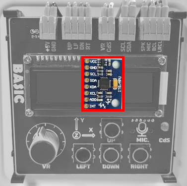

Basic 보드에 설치된 기준으로 세 축의 위치는 다음과 같습니다.

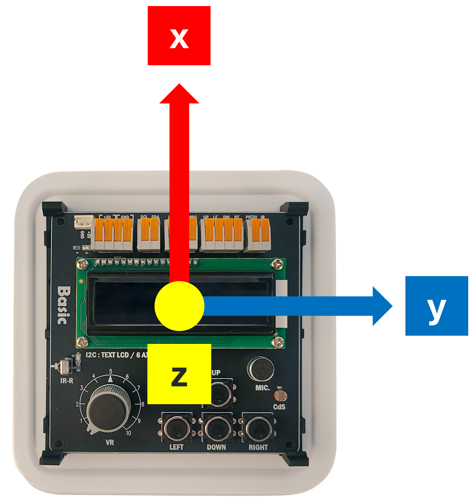

VSCode 상에서 아래와 같이 코드를 작성한 후 'imu.py' 라는 이름으로 저장합니다.

```python
# imu.py
from machine import I2C, Pin
import utime, struct

MPU_ADDR=0x68
REG_PWR=0x6B
REG_ACCEL=0x3B
REG_GYRO_CFG=0x1B
REG_ACC_CFG=0x1C

i2c=I2C(0, scl=Pin(13), sda=Pin(12), freq=400000)

def wreg(r,v):
    i2c.writeto_mem(MPU_ADDR,r,bytes([v]))

def init():
    wreg(REG_PWR,0x00)
    wreg(REG_ACC_CFG,0x00)
    wreg(REG_GYRO_CFG,0x00)
    utime.sleep_ms(50)

def read_raw():
    buf=bytearray(14)
    i2c.readfrom_mem_into(MPU_ADDR,REG_ACCEL,buf)
    ax,ay,az,tmp,gx,gy,gz=struct.unpack(">hhhhhhh",buf)
    return ax,ay,az,gx,gy,gz

def read():
    ax,ay,az,gx,gy,gz=read_raw()
    ax/=16384.0; ay/=16384.0; az/=16384.0
    gx/=131.0;   gy/=131.0;   gz/=131.0
    return (ax,ay,az),(gx,gy,gz)

init()

while True:
    acc,gyro=read()
    print("ACC",acc,"GYR",gyro)
    utime.sleep_ms(100)
```

## I2S

I2S(Inter-IC Sound)는 디지털 오디오 데이터를 IC 간에 전달하기 위해 설계된 직렬 통신 규격입니다. UART나 SPI와 같은 범용 통신과 달리, I2S는 연속적으로 생성되는 오디오 샘플을 일정한 타이밍에 맞추어 전송하는 것을 목적으로 합니다. 따라서 주소, 패킷, 오류 제어와 같은 복잡한 구조를 사용하지 않고, 클럭에 동기화된 단순한 방식으로 동작합니다.

I2S 통신은 주로 비트 클럭(BCLK), 좌우 클럭(LRCLK), 데이터선(SD)으로 구성됩니다. 비트 클럭은 데이터가 전송되는 속도를 결정하고, 좌우 클럭은 현재 전송 중인 데이터가 왼쪽 채널인지 오른쪽 채널인지를 구분합니다. 실제 오디오 데이터는 데이터선을 통해 비트 단위로 순차적으로 전달되며, 좌우 채널이 클럭 신호에 따라 교대로 전송됩니다. 이러한 구조 덕분에 I2S는 일정한 속도로 흐르는 오디오 데이터를 안정적으로 처리할 수 있습니다.

핀 연결 정보는 다음과 같습니다.

| Connection pin | Pin number |
| ------ | ---------- |
| BCL | 4 |
| LRCL | 5 |

### Mic

아래 사진과 같이 위치한 Mic를 제어해봅니다.

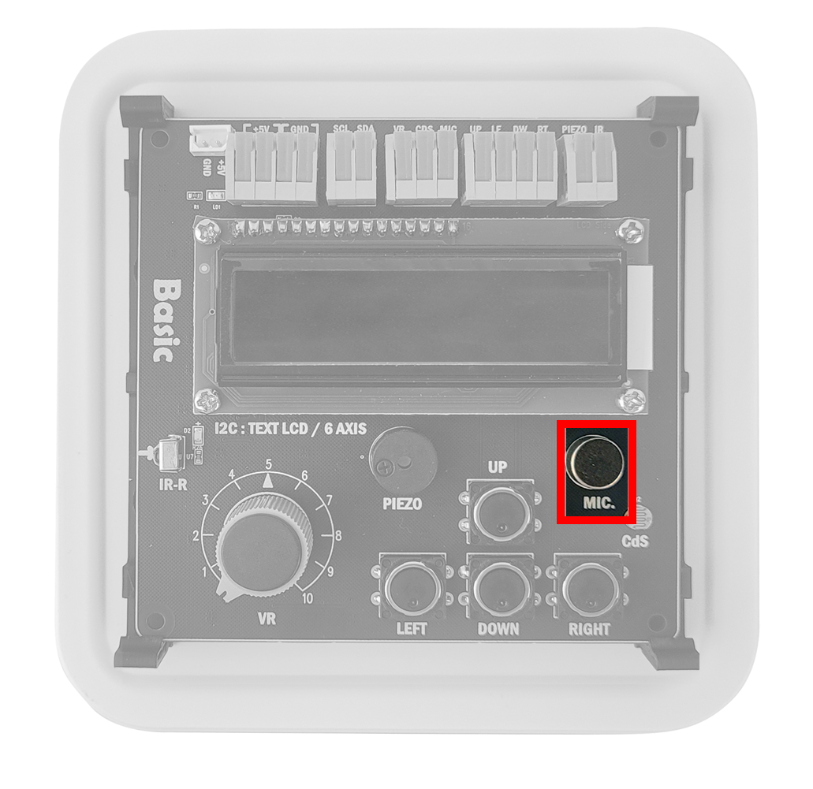

| Peripheral | Pin number |
| ---------- | ---------- |
| Mic | 6 |

<br>

VSCode 상에서 아래와 같이 코드를 작성한 후 'mic.py' 라는 이름으로 저장합니다.

```python
# mic.py
from machine import Pin, I2S
import math
import struct
import time

I2S_ID = 0
SAMPLE_RATE = 16000
BITS = 32
BUFFER_BYTES = 4096

SCK_PIN = 4
WS_PIN  = 5
MIC_PIN  = 6
audio_in = I2S(
    I2S_ID,
    sck=Pin(SCK_PIN),
    ws=Pin(WS_PIN),
    sd=Pin(MIC_PIN),
    mode=I2S.RX,
    bits=BITS,
    format=I2S.MONO,  
    rate=SAMPLE_RATE,
    ibuf=BUFFER_BYTES
)

def calc_rms_db(samples):
    if not samples:
        return -120.0

    acc = 0
    for s in samples:
        acc += s * s
    mean_sq = acc / len(samples)
    rms = math.sqrt(mean_sq)

    if rms == 0:
        return -120.0  

    full_scale = (1 << 31) - 1
    db = 20 * math.log10(rms / full_scale)
    return db

FRAME_BYTES = 4  
READ_BYTES = 1024 

buf = bytearray(READ_BYTES)

try:
    while True:
        read_len = audio_in.readinto(buf)
        if read_len is None or read_len == 0:
            time.sleep(0.01)
            continue

        n_frames = read_len // FRAME_BYTES

        samples = []
        for i in range(n_frames):
            b0 = buf[4*i + 0]
            b1 = buf[4*i + 1]
            b2 = buf[4*i + 2]
            b3 = buf[4*i + 3]
            s = struct.unpack('<i', bytes((b0, b1, b2, b3)))[0]

            samples.append(s)

        db = calc_rms_db(samples)
        print("Level: {:.1f} dBFS".format(db))

        time.sleep(0.05)

except KeyboardInterrupt:
    pass

finally:
    audio_in.deinit()
```

터미널에서 다음 명령어를 입력해 프로그램을 실행합니다. 주변 환경의 소음 크기에 따라 프로그램 출력값이 달라지는 것을 확인할 수 있습니다.

```
replx mic.py
```

터미널 출력 결과

```sh
Level: -49.9 dBFS
Level: -48.6 dBFS
Level: -58.3 dBFS
Level: -72.4 dBFS
```

### Speaker

아래 사진과 같이 위치한 Speaker를 제어해봅니다.

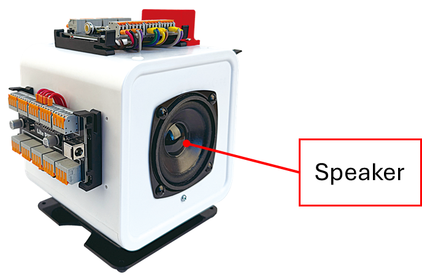

| Peripheral | Pin number |
| ---------- | ---------- |
| Speaker | 7 |

<br>

VSCode 상에서 아래와 같이 코드를 작성한 후 'speaker.py' 라는 이름으로 저장합니다.

```python
# speaker.py
from machine import Pin, I2S

I2S_ID = 0
WAV_PATH = "test.wav"

BCK_PIN = 4 
LRCK_PIN = 5
SPEAKER_PIN = 7

SAMPLE_RATE = 16000
BITS = 16
BUFFER_SIZE = 2048

audio_out = I2S(
    I2S_ID,
    sck=Pin(BCK_PIN),
    ws=Pin(LRCK_PIN),
    sd=Pin(SPEAKER_PIN),
    mode=I2S.TX,
    bits=BITS,
    format=I2S.MONO,
    rate=SAMPLE_RATE,
    ibuf=BUFFER_SIZE,
)

buf = bytearray(BUFFER_SIZE)

with open(WAV_PATH, "rb") as f:
    f.read(44)
    while True:
        n = f.readinto(buf)
        if n == 0:
            break
        written = 0
        while written < n:
            written += audio_out.write(buf[written:n])

audio_out.deinit()
```

프로그램을 실행하기 전 재생할 음악 파일이 필요합니다. 다음 링크에서 샘플 음원을 다운로드 받은 뒤, 터미널에서 아래 명령어로 파일을 TiCLE Lite에 다운로드 시킵니다.

- https://github.com/hanback-lab/TiCLE-Lite/blob/main/etc/test.wav

```
replx put test.wav /
```

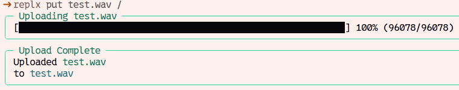

터미널에 다음 명령어를 입력해 프로그램을 실행합니다. 스피커에서 비프음이 출력되는 것을 확인할 수 있습니다.


```
replx speaker.py
```