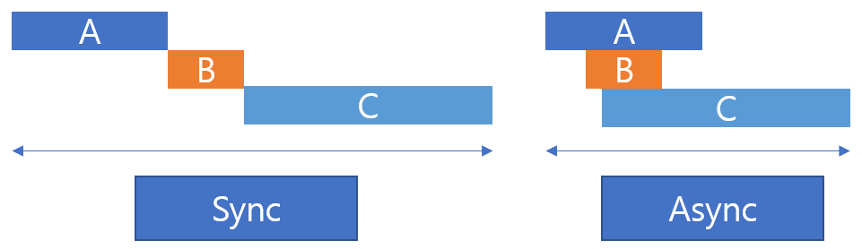

# 고급 제어

## 학습 목표

- 인터럽트(IRQ)의 의미와 사용 목적을 설명할 수 있다.
- 타이머를 이용해 주기 작업과 1회성 작업을 구현할 수 있다.
- 동기 방식과 비동기 방식의 차이를 이해하고 asyncio 예제를 실행할 수 있다.

## 이 장의 목적

이 장의 목적은 "항상 반복 확인하는 코드"에서 벗어나, 이벤트가 발생할 때 필요한 동작을 효율적으로 실행하는 방법을 익히는 것이다. 이를 위해 IRQ, Timer, asyncio를 실습 중심으로 학습한다.

## irq

IRQ(Interrupt Request)는 특정 이벤트가 발생했을 때 CPU에 즉시 알려 주는 기능이다. 버튼 입력처럼 언제 발생할지 모르는 신호를 빠르게 처리할 때 유용하다.

먼저 IRQ를 사용하지 않는 일반적인 방식부터 보자.

참고로 `sw_pin` 변수는 UP 스위치와 연결된 GPIO 핀, `led_pin`은 LED를 제어하는 GPIO 핀 변수이다.

```python
from machine import Pin
import utime

led_pin = Pin('LED', Pin.OUT)
sw_pin = Pin(18, Pin.IN)

while True:
    if sw_pin.value():
        led_pin.on()
    else:
        led_pin.off()
    utime.sleep_ms(10)    
```

위 코드는 10ms마다 스위치를 확인하는 폴링 방식이다. 구현은 쉽지만, 입력이 없어도 계속 확인해야 하므로 비효율적이다.

IRQ를 사용하면 입력이 바뀌는 순간에만 콜백 함수를 실행할 수 있다. 즉, "필요할 때만 동작"하므로 메인 루프 부담이 줄고 반응성이 좋아진다.

MicroPython에서는 `Pin` 클래스의 `irq()`로 콜백과 트리거 조건을 설정한다.

아래 예제는 위 코드를 irq를 사용하여 개선한 코드이다.

```python
from machine import Pin
import utime

global led_pin
led_pin = Pin('LED', Pin.OUT)
sw_pin = Pin(18, Pin.IN)

def control_led(pin):
    global led_pin
    if pin.value():
        led_pin.on()
    else:
        led_pin.off()

sw_pin.irq(handler=control_led, trigger=Pin.IRQ_FALLING | Pin.IRQ_RISING)

while True:
    ...
    utime.sleep_ms(10)    
```

`irq`에 관련된 더 자세한 내용은 다음 링크를 참고한다.

- https://docs.micropython.org/en/latest/library/machine.Pin.html#machine.Pin.irq

## timer

Timer는 지정한 시간 간격마다 함수를 자동 실행해 주는 기능이다. 예를 들어 "1초마다 센서값 출력" 또는 "3초 뒤 한 번만 실행" 같은 작업에 적합하다.

MicroPython에서는 `machine` 라이브러리의 `Timer` 클래스를 사용한다. 타이머는 반복 모드(`PERIODIC`)와 1회 모드(`ONE_SHOT`)를 지원한다.

아래 예제는 1초마다 LED 상태를 바꾸는 코드이다.

```python
from machine import Pin, Timer

led = Pin("LED", Pin.OUT)
state = 0

def blink(timer):
    global state
    state = 0 if state else 1
    led.value(state)

t = Timer()
t.init(period=1000, mode=Timer.PERIODIC, callback=blink)

while True:
    pass
```

`Timer` 클래스와 관련된 자세한 내용은 다음 링크를 참고한다.

- https://docs.micropython.org/en/latest/library/machine.Timer.html

## asyncio
asyncio는 비동기 작업을 다루는 Python 라이브러리이다. 스레드를 여러 개 만들지 않아도, 대기 시간이 있는 작업을 효율적으로 함께 처리할 수 있다.

### asyncio 작동 원리 
asyncio는 이벤트 루프 기반으로 동작한다. `async def`로 만든 코루틴이 루프에 등록되고, `await`를 만나면 현재 작업이 잠시 양보한 뒤 다른 작업이 실행된다. 그래서 CPU를 놀리지 않고 여러 작업을 번갈아 처리할 수 있다.

### 주요 구성 요소 
- `async def`: 비동기 함수를 정의한다.
- `await`: 현재 코루틴 실행을 잠시 멈추고 다른 작업에 실행 기회를 준다.
- `asyncio.run()`: 이벤트 루프를 시작하고 메인 코루틴을 실행한다.
- `asyncio.create_task()`: 여러 코루틴을 동시에 실행하도록 예약한다.
- `asyncio.sleep()`: 비동기 대기 함수이다. `utime.sleep()`과 달리 전체 흐름을 막지 않는다.

## 동기방식과 비동기 방식의 차이 
예를 들어 A, B, C 작업 시간이 각각 5초, 10초, 15초라고 가정하자. 동기 방식으로 순서대로 처리하면 총 30초가 걸리지만, 비동기 방식으로 함께 처리하면 전체 시간은 가장 오래 걸리는 작업 시간(약 15초)에 가까워진다.



동기 방식과 비동기 방식을 요약하면 다음과 같다.

| 항목 | 동기 방식 | 비동기 방식 |
|:-------|:------|:------|
| 실행 방식 | 순차 실행 | 동시 실행 | 
| 총 작업 시간 | 모든 작업 시간 누적 | 가장 긴 작업 시간에 수렴 | 
| 사용 예시 | DB 트랜잭션, 시리얼 처리 등 | 센서 데이터 수집, 네트워크 요청 등 | 

### 동기 방식 예시
```python
import utime

def task_sync(name, duration):
    print(f"{name} start")
    utime.sleep_ms(duration)
    print(f"{name} done")

def run_sync_tasks():
    start = utime.time()
    task_sync("A", 5000)
    task_sync("B", 10000)
    task_sync("C", 15000)
    end = utime.time()
    print(f"Total time : {end - start:.2f}초")

if __name__ == "__main__":
    run_sync_tasks()
```

### 비동기 방식 예시
```python
import asyncio
import utime

async def task_async(name, duration):
    print(f"{name} start")
    await asyncio.sleep(duration)
    print(f"{name} done")

async def run_async_tasks():
    start = utime.time()
    await asyncio.gather(
        task_async("A", 5),
        task_async("B", 10),
        task_async("C", 15)
    )
    end = utime.time()
    print(f"Total utime : {end - start:.2f}초")

if __name__ == "__main__":
    asyncio.run(run_async_tasks())
```
