# TiCLE Lite 개발환경

## 개요

### 학습 목표

- TiCLE Lite의 구성 요소와 각 보드의 역할을 설명할 수 있다.
- 개발 도구를 설치하고 실습에 필요한 작업 환경을 스스로 준비할 수 있다.
- 기본 명령으로 TiCLE Lite를 연결하고 초기 설정을 완료할 수 있다.
- 첫 번째 프로그램을 작성하고 실행 결과를 확인할 수 있다.

### 피지컬 컴퓨팅과 피지컬 인공지능

피지컬 컴퓨팅은 센서로 주변 환경을 읽고, 프로그램으로 판단한 뒤, LED, 스피커, 모터, 디스플레이 같은 출력 장치로 반응을 만들어 내는 학습 분야이다. 사용자는 버튼, 가변저항, 조도 센서, 마이크, IMU와 같은 입력 장치를 다루며 물리 세계의 신호가 데이터가 되는 과정을 경험한다.

피지컬 인공지능은 이러한 피지컬 컴퓨팅 시스템에 인공지능의 판단 능력을 더하는 방향으로 확장된다. 예를 들어 센서 값을 단순한 조건문으로 처리하는 데서 나아가, 소리, 움직임, 밝기, 거리 같은 데이터를 분석해 상황을 분류하거나 사용자의 행동 패턴에 맞추어 장치의 반응을 바꾸는 시스템을 만들 수 있다. 즉 피지컬 인공지능은 화면 안에서만 동작하는 AI가 아니라, 실제 장치와 센서를 통해 주변 환경을 인식하고 물리적인 출력으로 반응하는 AI 시스템을 뜻한다.

### 마이크로컨틀롤러
앞서 살펴본 피지컬 컴퓨팅과 피지컬 인공지능이 실제 물리 세계에서 작동하려면, 센서 신호를 수집하고 알고리즘을 연산하여 출력 장치를 제어하는 '두뇌' 역할이 필요하다. 이 역할을 수행하는 핵심 장치가 바로 마이크로컨트롤러(Microcontroller Unit, MCU)이다.

마이크로컨트롤러는 단일 반도체 칩 안에 CPU(중앙처리장치), 메모리(RAM/Flash), 그리고 입출력(I/O) 포트를 모두 통합한 초소형 컴퓨터이다. 범용 PC가 고성능 연산과 다중 작업(Multitasking)을 목적으로 설계된 것과 달리, 마이크로컨트롤러는 특정 장치를 제어하거나 전용 제어 프로그램을 안정적으로 반복 실행하는 임베디드 시스템(Embedded System)에 특화되어 있다.

**피지컬 컴퓨팅에서의 인터랙션 루프 제어**
피지컬 컴퓨팅 체계에서 마이크로컨트롤러는 '입력 -> 처리 -> 출력'의 인터랙션 루프를 다음과 같이 제어한다.

- 신호 수집 (Input): 버튼의 디지털 신호(0/1)나 IMU, 마이크 등의 아날로그/디지털 센서 값을 GPIO 및 통신 포트(I2C, SPI)를 통해 수집한다.
- 제어 연산 (Processing): 내부 프로그램에 작성된 조건문(if-else)이나 임계값(Threshold) 비교 알고리즘을 통해 시스템의 반응 방식을 결정한다.
- 결과 출력 (Output): LED를 점등하거나(GPIO Digital Output), PWM 신호로 모터 속도 및 각도를 제어하는 등 물리적 반응을 유도한다.

**TinyML과 Physical AI의 구현 조건**
센서 데이터를 단순 조건문으로 처리하는 기존 방식을 넘어, 마이크로컨트롤러 내부에서 직접 머신러닝/딥러닝 모델을 구동하는 기술을 TinyML(Tiny Machine Learning)이라고 부른다.

마이크로컨트롤러는 PC나 클라우드 서버에 비해 메모리와 연산 능력이 극히 제한적이므로, MCU 기반의 Physical AI를 구현하기 위해서는 다음과 같은 기술적 특징과 하드웨어 조건이 요구된다.

- 온디바이스 AI (On-Device AI): 네트워크(인터넷) 연결 없이 마이크로컨트롤러 자체적으로 인공지능 추론(Inference)을 수행한다. 이를 통해 초저지연 반응 속도 확보, 인터넷 미연결 환경 동작, 데이터 프라이버시 보호 등의 이점을 얻는다.
- 모델 경량화 (Quantization & Pruning): 초경량 머신러닝 프레임워크(예: TensorFlow Lite for Microcontrollers)를 활용하여 딥러닝 모델의 가중치를 압축(양자화 및 가지치기)하고, 모델 크기를 수십~수백 KB 단위로 축소하여 MCU 메모리에 탑재한다.

- 하드웨어 사양의 발전: 최신 마이크로컨트롤러(예: RP2040, ESP32-S3, ARM Cortex-M4/M55 기반 보드 등)는 동작 클럭 속도가 향상되고 DSP(디지털 신호 처리) 명령어 및 AI 연산 가속기를 내장하여 음성 인식, 동작 분류, 초소형 비전(Vision) 추론까지 직접 처리할 수 있다.

### 하드웨어 인터페이스
마이크로컨트롤러가 다양한 주변 장치 및 센서 모듈과 데이터를 송수신하기 위해 사용하는 핵심 하드웨어 인터페이스의 주요 특징은 다음과 같다.

- GPIO (General Purpose Input/Output, 범용 입출력): 제어 프로그램의 설정에 따라 입력(Input) 또는 출력(Output) 용도를 자유롭게 지정할 수 있는 디지털 핀.
  - 디지털 신호: 0 V(Low / 0) 또는 3.3 V / 5 V(High / 1)의 두 가지 이진(Binary) 논리 상태만 인식 및 제어.
  - 입력 모드: 스위치, 버튼, PIR 인체 감지 센서 등 외부의 온/오프 신호를 읽어 들일 때 사용.
  - 출력 모드: LED 점등, 릴레이 스위치 제어, 부저 음향 출력 등에 활용.

  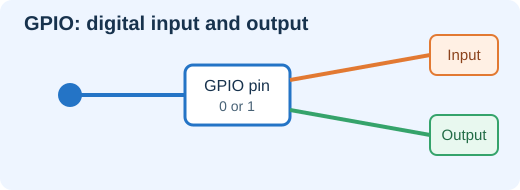

- PWM (Pulse Width Modulation, 펄스 폭 변조): 디지털 핀의 고속 온/오프 제어를 통해 아날로그 출력 효과를 상사(Emulation) 구현하는 기법.
  - 디지털 신호의 High(1) 전압 유지 시간과 Low(0) 전압 유지 시간의 비율(Duty Cycle)을 고속으로 조절하여 평균 출력 전압 제어.
  - 서보 모터의 정밀한 각도 제어를 비롯해 별도의 디지털-아날로그 변환기(DAC) 없이도 LED 밝기 조절(Dimming), DC 모터 속도 제어 등 수행.

  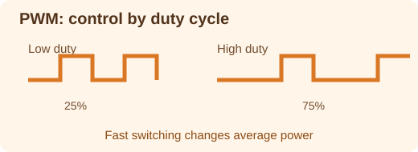

- ADC (Analog-to-Digital Converter, 아날로그-디지털 변환기): 외부의 연속적인 아날로그 전압 신호를 마이크로컨트롤러가 처리할 수 있는 수치형 디지털 데이터로 변환하는 장치.
  - 온도, 빛, 음량 등 연속적으로 변화하는 전압 값을 정수 형태의 디지털 수치로 측정.
  - 가변 저항, CdS 조도 센서, 아날로그 온도 센서(LM35), 2축 조이스틱 입력 장치 등에 활용.

  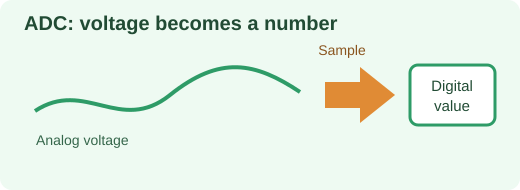

- I2C (Inter-Integrated Circuit): 오픈 드레인(Open-Drain) 구조를 이용하여 여러 센서 모듈을 병렬 연결하는 2선식 동기식 직렬 버스 통신 규격.
  - SDA (Serial Data): 양방향 데이터 송수신을 담당하는 라인.
  - SCL (Serial Clock): 마스터(Master) 장치가 생성하는 동기화 클록 라인.
  - 1개의 마스터 기기가 고유의 7비트 또는 10비트 주소(Address)를 지정하여 다수의 슬레이브(Slave) 센서와 통신.
  - OLED 디스플레이, MPU-6050 IMU 센서, RTC(실시간 시계) 모듈 등 근거리 센서 결합에 활용.

  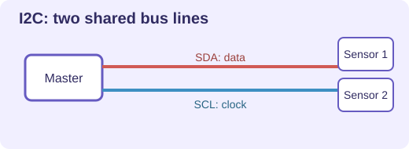

- SPI (Serial Peripheral Interface): 4개의 신호선을 이용하는 고속 전이중(Full-Duplex) 동기식 직렬 통신 규격.
  - MOSI (Master Out Slave In): 마스터에서 슬레이브 방향으로 데이터 전송.
  - MISO (Master In Slave Out): 슬레이브에서 마스터 방향으로 데이터 전송.
  - SCLK (Serial Clock): 데이터 동기화를 위한 클록 신호 라인.
  - CS / SS (Chip Select / Slave Select): 통신 대상 슬레이브를 선택하는 라인(Active Low 동작).
  - 송신과 수신이 동시에 이루어지며 I2C보다 빠른 전송 속도를 지원하므로 TFT LCD 컬러 디스플레이, SD 카드 모듈, 고속 카메라 센서 등에 사용.

  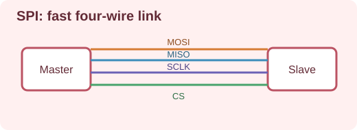

- UART (Universal Asynchronous Receiver-Transmitter, 범용 비동기 송수신기): 클록 신호선 없이 데이터를 전송하는 비동기 직렬 통신 방식이며, 통신하는 두 장치 간 공통 그라운드(GND) 연결이 필수적.
  - TXD (Transmit): 데이터 송신 라인.
  - RXD (Receive): 데이터 수신 라인(장치 A의 TXD는 장치 B의 RXD와 교차 연결해야 함).
  - 동기용 클록 라인이 없으므로 통신 양측이 초당 비트 전송 속도(Baud Rate, 예: 9600 bps, 115200 bps)를 동일하게 사전 설정해야 함.
  - PC와의 시리얼 콘솔 통신, 블루투스 모듈(HC-06), GPS 모듈 수신 등에 활용.

  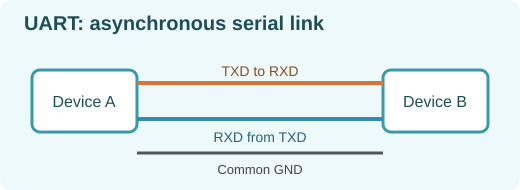

- SWI (Single-Wire Interface): 오직 1개의 데이터선(Single-Wire)과 엄격한 펄스 폭 타이밍(Pulse Width Timing)을 이용하여 다수의 LED 소자를 직렬(Cascade)로 제어하는 단방향 비동기 직렬 통신 규격.
  - DIN / DOUT (Data In / Data Out): 마스터 기기에서 출력된 데이터가 첫 번째 LED의 DIN으로 입력되고, 내부 데이터를 처리한 후 DOUT을 통해 다음 LED의 DIN으로 순차 전달(Chaining)되는 라인.
  - No Clock Line: 별도의 동기화 클록 라인이 없으며, 하이(High)와 로우(Low) 신호의 유지 시간(T0H, T0L, T1H, T1L) 비율만으로 데이터 '0'과 '1'을 판별하는 비동기 NZR(Non-Zero-to-Return) 방식 사용.
  - Cascade Address-free: 슬레이브 기기가 고유한 하드웨어 주소(Address)를 가지지 않음. 각 LED가 자신에게 필요한 24비트(RGB) 데이터를 흡수한 뒤, 나머지 데이터만 다음 소자로 토스(Toss)하는 물리적 순서 기반의 제어 방식 사용.
  - Reset Signal: 데이터 전송 후 일정 시간(주로 50µs 또는 280µs 이상) 동안 라인을 로우(Low) 상태로 유지하면 리셋(Reset) 신호로 인식되어, 가 가동된 모든 LED에 입력된 데이터가 동시에 래치(Latch)되어 발광.
  - WS2812B RGB LED 스트립, 네오픽셀(NeoPixel) 링, 매트릭스 디스플레이 등 개별 제어가 가능한 스마트 LED 모듈 및 시각 효과 구현에 활용.

  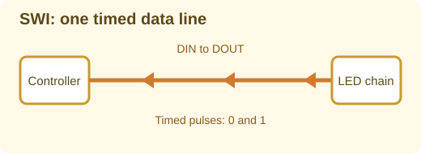

- I2S (Integrated Interchip Sound): 디지털 오디오 음원 데이터를 고음질로 전송하기 위해 특화된 직렬 오디오 버스 규격.
  - SCK / BCLK (Bit Clock): 데이터 비트 단위의 동기화 클록 라인.
  - WS / LRCK (Word Select / Left-Right Clock): 스테레오 좌/우(Left/Right) 오디오 채널을 구분하는 신호 라인.
  - SD / SDATA (Serial Data): 실제 오디오 샘플 데이터를 전송하는 라인.
  - I2S DAC 사운드 카드, 앰프 모듈, 디지털 MEMS 마이크로폰 연결 사용.

  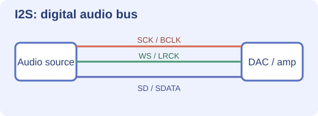

### MicroPython

MicroPython은 메모리와 연산 자원이 제한된 마이크로컨트롤러 환경에 최적화하여 구현한 경량화 프로그래밍 언어이다. 문법적 구조는 Python 3와 거의 동일하며, GPIO, I2C, SPI 등 주요 하드웨어 인터페이스를 직관적으로 직접 제어하는 기능을 제공한다.

표준 Python은 '배터리 포함(Batteries Included)' 철학에 기반하여 매우 방대한 풍부한 표준 라이브러리를 내장하고 있으며, NumPy, Pandas, TensorFlow와 같은 대용량 외부 라이브러리를 자유롭게 확장하여 사용할 수 있다. 이와 달리 MicroPython은 제약이 큰 소량의 시스템 메모리를 효율적으로 활용하기 위해 표준 라이브러리의 핵심 기능만을 엄선하여 축소 제공한다. 대신 임베디드 하드웨어 장치를 직접 제어하기 위한 machine, network 등 제어 전용 모듈을 특화하여 내장하는 차이점을 지닌다.

---
</br>


## TiCLE Lite 하드웨어 구성

> **풀고 싶은 문제**  
> 상자를 열어 보면 낯선 보드 여러 개와 센서, 모터가 나뉘어 들어 있다. 조립을 시작하려면 각 보드가 어떤 역할을 맡고, 서로 어떻게 연결되어 하나의 시스템을 이루는지부터 파악해야 한다.

TiCLE Lite는 피지컬 컴퓨팅과 이를 기반으로 한 피지컬 인공지능(Physical AI)을 학습하기 위한 마이크로컨트롤러 환경에서 MicroPython으로 운영되는 실습 장비이며, 기본적으로 반조립 형태(Semi-assembled)로 공급된다.

초음파 센서, 서보 모터, 스피커 등의 주요 입출력 장치는 사전에 육면체 프레임 박스에 장착되어 있다. 사용자는 Core 보드, Power 보드, Basic 보드, Pixel Display 보드를 프레임 박스에 장착하는 과정에서 각 모듈 간 전원 및 신호 배선(Cabling) 작업을 직접 수행하게 된다. 이때 보드들을 프레임에 최종 고정하기 전, 전원선과 신호선을 하드웨어에 임시 연결하여 각 보드의 이상 유무를 검증하는 과정이 필요하다. 검증 결과 하드웨어 결함이 없다면 각 보드를 프레임 박스의 지정된 위치에 결합하여 최종 조립을 완성한다.

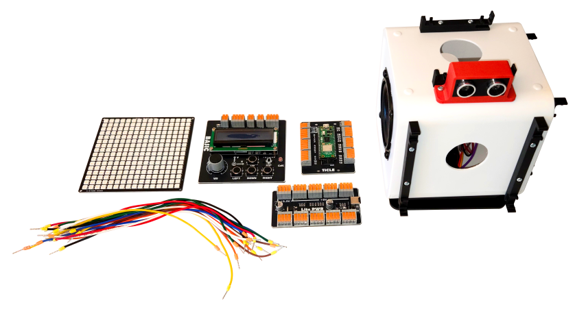</br>

### 프레임 박스
프레임 박스는 TiCLE Lite의 몸체 역할을 한다. 보드 장착용 브라켓과 케이블 배선 홀이 있어 조립이 쉽고, 초음파 센서(윗면), 서보 모터(아랫면), 스피커(오른쪽면)는 사전 장착되어 바로 실습을 시작할 수 있다. 각 브라켓에 체결되는 보드는 프레임 박스 기준으로 앞면(초음파 센서가 바라보는 쪽) Display 보드, 뒷면 Power 보드, 윗면 Core 보드, 왼쪽면 Basic 보드이며, 실수로 다른 보드를 체결할 수 없도록 크기가 다르다. 사용자는 상호 케이블을 연결한 보드를 해당 위치의 브라켓에 체결해 시스템을 완성하며, 이후 주변 장치 제어부터 커넥티비티, 피지컬 인공지능 구현을 단계적으로 수행한다.

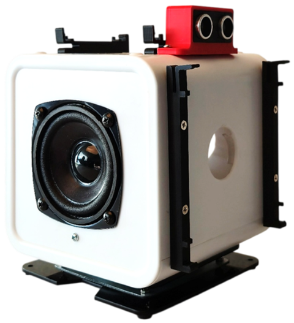</br>

프레임 박스의 주요 사양은 다음과 같다.

| 항목 | 내용 |
| ---- | ---- |
| 크기 | 185x140x165mm (박스 자체 140x140x140mm) |
| 서보 모터 | 토크 9.4Kg/cm, 스피드 0.4sec/60° (베어링 턴테이블 결합) |
| 초음파 센서 | 측정 거리 최대 2m |
| 스피커 | 크기 3", 최대 출력 10W |

### Core 보드
TiCLE Lite 전체 시스템의 두뇌 역할을 수행하는 Core 보드는 라즈베리 파이 재단(Raspberry Pi Ltd)이 독자 설계한 2세대 마이크로컨트롤러 칩셋인 RP2350을 탑재하고 있다. RP2350은 최대 150 MHz 동작 속도를 갖는 ARM Cortex-M33 또는 Hazard3 RISC-V 선택형 듀얼 코어(Dual-core) 아키텍처를 지원하며, 고속 입출력 독립 제어를 위한 12개의 상태 머신 기반 프로그래머블 I/O(PIO)를 3개의 블록으로 나눠 제공한다. 

또한 PC 및 스마트폰 등 외부 기기와의 유연한 무선 통신 환경을 구축하기 위해 인피니언(Infineon)사의 CYW43439 통신 칩을 함께 탑재하여 2.4 GHz 대역의 Wi-Fi 네트워크와 블루투스(Bluetooth/BLE) 기능을 사용할 수 있다.

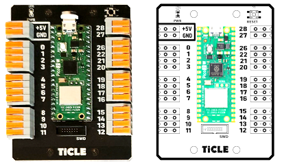</br>

Core 보드의 주요 사양은 다음과 같다.

| 항목 | 내용 |
| ---- | ---- |
| 프로세서 | [RP2350](https://datasheets.raspberrypi.com/rp2350/rp2350-datasheet.pdf) ARM Cortex-M33 또는 Hazard3 RISC-V 선택형 듀얼 코어 150MHz |
| 메모리 | 520KB SRAM, 4MB QSPI 플래시 메모리 |
| 무선 통신 | 2.4GHz 802.1n Wi-Fi 및 Bluetooth 5.2/BLE 지원 |
| I/O 지원 | 26개의 다기능 GPIO 핀 |
| 인터페이스 | GPIO(26), PWM(16), ADC(3), I2C(2), SPI(2), UART(2), PIO(3) |
| 프로그래밍 포트 | 마이크로 USB |
| LED | 내장 1개(Green) |
| RGB LED | 외장 1개(스위치 On/Off, GPIO 20 ~ 22 공유) |
| BOOT | 버튼 1개 |
| 하드웨어 리셋 | 버튼 1개 |
| 전원 | 5V/GND 또는 USB 전원 |

**SRAM과 플래시 메모리**
RP2350 내부의 520 KB SRAM은 실시간 프로그램 실행 데이터 및 변수 저장을 담당하는 고속 시스템 메모리로 활용된다. 이와 함께 QSPI 인터페이스로 초고속 연결된 외부 4 MB 플래시 메모리(Flash Memory)에는 마이크로파이썬 펌웨어(MicroPython Interpreter) 및 사용자 코드가 영구 저장된다. 이를 통해 시스템 전원이 인가되면 사용자가 작성한 코드 스크립트를 즉시 해석하여 안정적으로 실행한다.

**코어 보드 핀 아웃**
Core 보드에 다양한 주변장치를 연결할 때는 각 핀의 고유 번호와 지원 가능한 인터페이스 사양이 명시된 핀아웃 다이어그램(Pinout Diagram)을 반드시 참조해야 한다.

하단 다이어그램의 GPxx(연두색) 표시는 디지털 입출력을 담당하는 GPIO 핀 번호를 의미하며, 이는 Core 보드 기판 표면에 인쇄된 실크스크린 핀 번호(0 ~ 28)와 정확히 일치한다. 이 중 GPIO 26 ~ GPIO 28 핀은 필요에 따라 아날로그 전압 신호를 읽어 들일 수 있는 ADC 입력 핀으로 겸용할 수 있으며, I2C, SPI 등 외부 통신 모듈 연결용 인터페이스 핀으로도 동일하게 지정하여 활용할 수 있다.

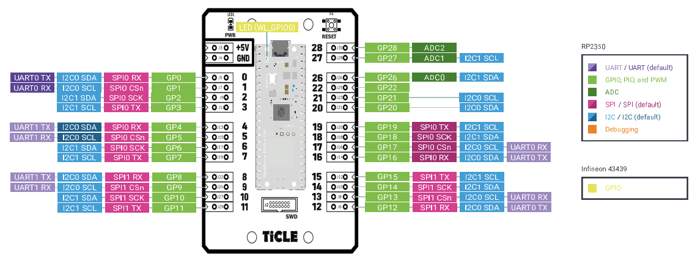

### Power 보드

Power 보드는 TiCLE Lite 시스템을 구성하는 각 모듈 및 센서에 직류(DC) 전원을 안정적으로 공급하는 전원 관리 보드이다. 다수의 하드웨어 모듈을 동시에 작동시키더라도 전압 강하 현상이 발생하지 않도록 다수의 전원 출력 핀을 구비하고 있다.

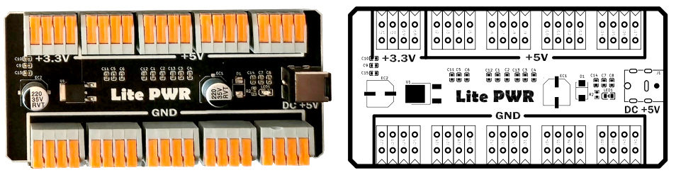

Power보드의 주요 사양은 다음과 같으며, 초기 버전에서는 3V3 출력 핀 4개와 GND 4개가 추가로 제공되었으나, 현재 버전에서는 제거되었다.

| 항목 | 내용 |
| ---- | ---- |
| DC 입력 커넥터 | 5V/4A 전원 어댑터 권장 |
| 5V 출력 핀 | 16개 |
| GND 핀 | 16개 |

**전원 어댑터**
일반적인 실습 환경에서는 Core 보드를 PC와 USB로 연결하는 것만으로 충분하다. PC로부터 인가된 USB 전원이 Core 보드를 경유하여 Power 보드를 통해 시스템 전체로 확장 분배되기 때문이다. 다만, 픽셀 디스플레이나 스피커 앰프와 같이 고전력 소비 모듈을 동시에 구동할 경우 USB 공급 전력이 부족해질 수 있다. 따라서 이러한 고부하 상황에서는 안정적인 동작을 위해 5V/4A 사양의 외부 전용 DC 전원 어댑터를 추가로 연결하여 전원을 공급해야 한다.

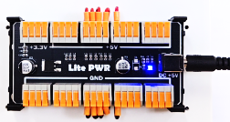</br>

### Basic 보드
Basic 보드는 실습에 빈번하게 활용되는 다양한 입력 및 출력 소자들을 사전에 일체형으로 모듈화한 확장 보드이다. 택트 스위치(Tact Switch), 가변 저항(VR, Variable Resistor), 조도 센서(CdS Sensor, 이하 CdS), 캐릭터 LCD, 관성 측정 장치(IMU, Inertial Measurement Unit), 마이크로폰, 그리고 스피커 앰프 등이 기본 탑재되어 있다.

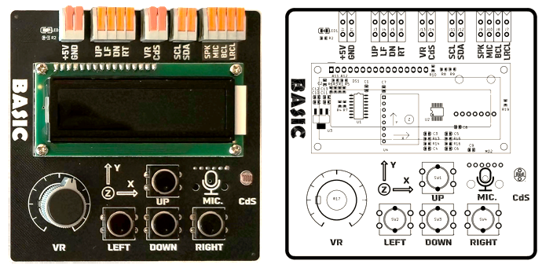</br>

Basic 보드에 탑재된 부품 목록은 다음과 같다.

| 제어 방식 | 부품 |
| -------- | ---- |
| GPIO | 택트 스위치 (버튼) |
| ADC | 가변 저항 (VR) |
| ADC | 조도 센서 (CdS) |
| I2C | 캐릭터 LCD (HD44780+PCF8574) |
| I2C | IMU (MPU-6050) |
| I2S | 마이크로폰 (ICS43434) |
| I2S | 스피커 앰프 (MAX98357) |

**버튼**
스위치, 버튼, 택트 스위치는 모두 같은 부품을 가리키는 말처럼 혼용되지만 엄밀히는 스위치, 버튼, 택트 스위치 순으로 범위가 좁아지는 구분이며, 택트 스위치는 그 중에서도 작고 클릭감이 있는 세부 부품을 가리킨다. 일상 대화에서는 택트 스위치를 버튼이라 부르는 경우가 많으므로, 이 교재에서도 버튼으로 통일한다.

| 구분 | 범위 | 핵심 특징 | 주요 용도 |
| ---- | ---- | ---- | ---- |
| 스위치 | 최상위 개념 | 모든 회로 개폐 장치 | 산업, 가정용 전기 설비 전체 |
| 버튼 | 중간 범위 | 누르는 동작으로 조작 | 사용자 인터페이스(UI) 기기 |
| 택트 스위치 | 세부 부품 | 작고 딸깍하는 클릭감 | 정밀 전자제품 내부 기판 |

**가변 저항**
가변 저항은 부품 내부의 저항체 위를 금속 스와이퍼(Wiper, 접점 회전자)가 이동하면서 전류가 통과하는 유효 저항 길이를 변형시켜 저항값을 변화시키는 전자 소자이다. 따라서 사용자가 스와이퍼와 연결된 다이얼이나 레버를 회전시킴으로써 원하는 저항값을 자유롭게 조절할 수 있다.

일반적인 가변 저항 부품은 3개의 단자(핀)로 구성되어 있다. 3개 핀을 모두 연결하여 전압 분배 회로를 구성하면 다이얼의 회전 각도에 비례하는 전압 신호를 출력하는 포텐셔미터(Potentiometer) 방식으로 동작한다. 반면 2개 핀만을 선택적으로 연결하여 회로 내 전류량을 조절하는 회로로 구성하면 회전 각도에 따라 회로 전체의 저항값 자체가 변화하는 리오스탯(Rheostat) 방식으로 동작한다. Basic 보드에 탑재된 가변 저항 모듈은 다이얼 회전량에 따른 전압 변화를 센싱하기 위한 포텐셔미터(Potentiometer) 회로 방식으로 설계되어 있다.

**IMU**
Basic 보드에 탑재된 MPU-6050은 가속도 센서와 자이로스코프(Gyroscope) 센서가 단일 칩에 통합 설계된 6축 관성 측정 장치(IMU, Inertial Measurement Unit)이다. 다양한 센서 데이터를 복합 처리(Sensor Fusion)하여 물체의 가속도, 각속도 및 공간상의 기울임 상태를 정밀하게 계측한다.

여기서 가속도 센서는 X, Y, Z의 3축 방향으로 작용하는 운동 가속도 및 중력 가속도를 $\text{m/s}^2$ 단위로 측정하여 물체의 기울기와 직선 운동 상태를 감지한다. 자이로스코프 센서는 각 축을 중심으로 회전하는 속도인 각속도(Angular Velocity, $\text{°/s}$ 또는 $\text{rad/s}$)를 측정하여 물체의 회전 동작과 방향 변화를 실시간으로 추적한다.

### Pixel Display 보드
Pixel Display 보드는 개별 제어가 가능한 WS2812 RGB LED 소자를 16 x 16 매트릭스(Matrix) 형태로 배열한 시각 출력 장치이다. 각 LED 소자는 Core 보드로부터 전달되는 단일 데이터 신호를 직렬(Daisy Chain) 방식으로 순차 송수신하며, 이를 통해 256개 개별 소자의 휘도와 색상을 독립적으로 정밀 제어할 수 있다. 이 모듈은 텍스트 문자열 출력, 2D 아이콘 표현, 다양한 애니메이션 효과 구현 등 프로그래밍을 통한 하드웨어 제어 결과를 즉각적인 시각적 피드백으로 직관성 있게 확인하는 피지컬 컴퓨팅 실습에 중점적으로 활용된다.

Pixel Display 보드를 프레임 박스에 체결할 때는 기판 표면에 인쇄된 "16x16 - 256 RGB LED Pixels"라는 실크스크린 문구가 상단을 향하도록 정확한 결합 방향을 맞추어야 한다.

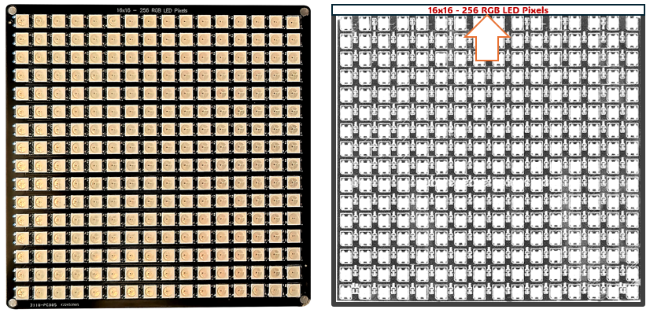</br>

---
</br>


## MicroPython 개발 환경

> **풀고 싶은 문제**  
> TiCLE Lite에서 코드를 실행하려면 PC에 어떤 도구가 필요할까? 필요한 것들을 하나씩 내려받아 설치하는 대신, 한 번에 환경을 준비할 수 있는 방법을 찾아보자.

PC에서 소스 코드를 작성하고 이를 TiCLE Lite 보드로 전송하여 동작시키려면, 호스트 PC 환경에 전용 개발 도구 모음(Toolchain)이 사전 설치되어 있어야 한다.

본 교재에서는 표준 통합 개발 환경(IDE) 편집기로 Visual Studio Code(이하 VSCode)를 사용하며, TiCLE Lite 보드 제어 및 스크립트 전송을 위해 전용 CLI 도구인 replx를 활용한다. 아울러 Windows 운영체제 환경에서도 macOS와 동일한 수준의 개발 편의성과 터미널 환경을 확보할 수 있도록 PowerShell 7 및 필수 확장 모듈을 연동하여 시스템을 구축한다.

- VSCode: 코드 작성, 신택스 하이라이팅, 자동 완성 및 프로젝트 관리를 담당하는 표준 텍스트 편집기이다.
- replx 툴: 호스트 PC와 TiCLE Lite 마이크로컨트롤러 간의 시리얼 통신을 매개하여, 소스 코드 업로드, 백그라운드 에이전트 구동 및 CLI 기반 하드웨어 제어 명령을 수행하는 핵심 도구이다.
- PowerShell 7 및 확장 모듈: Windows 환경에서 Unix/macOS 스타일의 고급 셸 명령어를 지원하고 터미널 작업 생산성을 극대화하기 위한 차세대 범용 명령 줄 셸이다.

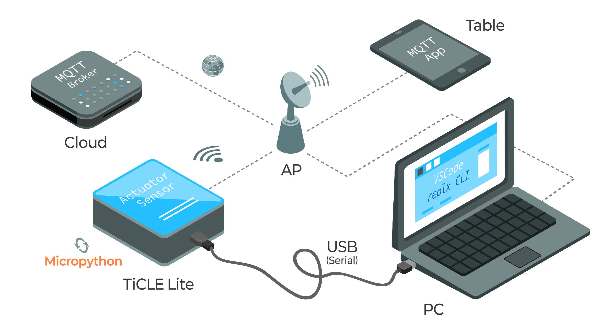</br>

### VSCode 개발 환경 구축

VSCode의 화면 구성은 일반적인 문서 편집기와 유사하지만, 지능형 코드 자동 완성, 실시간 구문 오류 감지, 터미널 세션 통합 실행 등 전문적인 프로그래밍 편의 기능을 고루 갖추고 있다. 또한 Windows, macOS, Linux 등 다양한 운영체제 환경에서 동일하게 동작하므로 플랫폼에 구애받지 않고 안정적인 개발 환경을 구축할 수 있다.

Windows 환경에서 macOS와 동일한 수준의 MicroPython 개발 환경을 구축하려면, VSCode 설치부터 파이썬 확장 플러그인, PowerShell 7 시스템 및 추가 확장 모듈, 파이썬 SDK, 표준 패키지 관리자(pip)에 이르기까지 개별 요소를 수동으로 다운로드 및 설치하고 세부 환경 변수까지 직접 설정해야 하므로 상당한 시간과 노력이 소요된다.

이와 관련된 상세한 구축 절차 및 단계별 설정 지침은 아래의 웹 문서에서 확인할 수 있다.

- [https://github.com/atticle/meister/blob/main/common/101_VSCode_env.md](https://github.com/atticle/meister/blob/main/common/101_VSCode_env.md)

**설치 프로그램**
devenv-setup.exe는 이러한 번거로운 환경 구축 절차를 완전히 자동화한 전용 패키지 도구이다. Windows 환경에서 시스템 파일 오염 없이, 개발에 필요한 필수 도구 일체를 독립된 무설치(Portable) 환경으로 일괄 구축해 준다.

> **macOS 사용자**
>
> macOS는 zsh가 기본 포함되어 있어 Windows보다 설치 단계가 적다. 터미널을 열고 아래 명령 한 줄을 실행하면 Homebrew, VSCode, 임베더블 python, modern-unix 도구, oh-my-zsh, pipx, 폰트, VSCode 확장과 설정 파일이 자동으로 설치된다.
>
>```zsh
>sh -c "$(curl -fsSL https://raw.githubusercontent.com/PlanXLab/DevEnv/main/res/devenv-setup.sh)"
>```
>
> 스크립트 실행 중 Homebrew 설치 단계에서 관리자 암호를 요청할 수 있다.

아래 링크에서 설치 파일을 다운로드한다.

- https://github.com/PlanXLab/DevEnv/releases/latest/download/devenv-setup.exe

다운로드한 devenv-setup.exe를 실행하면 디지털 서명 부재로 인한 차단 알림창이 표시된다. 알림창에서 'More Info'를 클릭하면 'Run anyway' 버튼이 나타나며, 이를 클릭하여 설치를 진행한다.

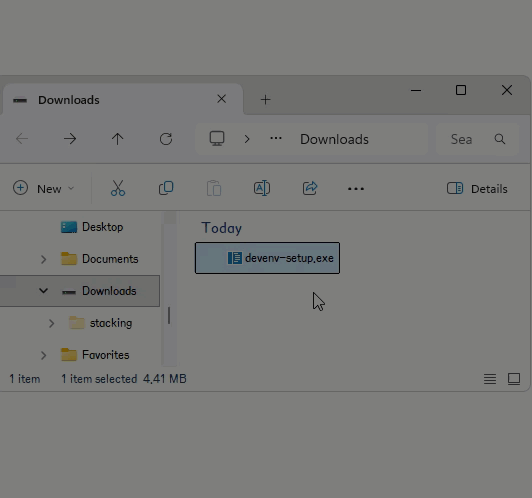</br>

설치 화면이 표시되면 'Installation Path' 항목에 VSCode의 실제 설치 경로를 지정하고, 'Python Version' 항목에는 3.12를 입력한다. 설치 프로세스가 시작되면 지정한 파이썬 버전인 3.12는 시스템 내부 기준에 따라 자동으로 3.12.x 형태로 치환 및 업데이트된다. 여기서 x는 파이썬 3.12 계열의 최신 마이너 패치 버전(Sub-version)을 의미하며, 사용자가 개발 환경을 구축하고 다운로드하는 시점에 따라 버전 번호가 다소 상이할 수 있다.

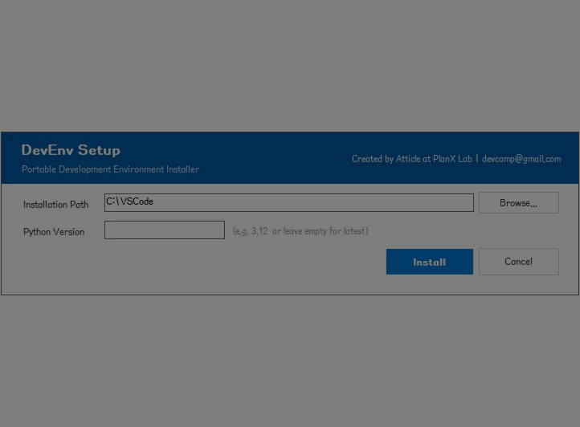</br>

설치가 완료되면 바탕화면 또는 시작 메뉴의 VSCode (Portable) 아이콘을 실행하는데, 이 아이콘은 설치 폴더의 launcher.exe를 통해 VSCode를 시작하며 실행 과정에서 관련 도구 버전을 확인하고 필요한 경우 자동 업데이트를 진행한다.

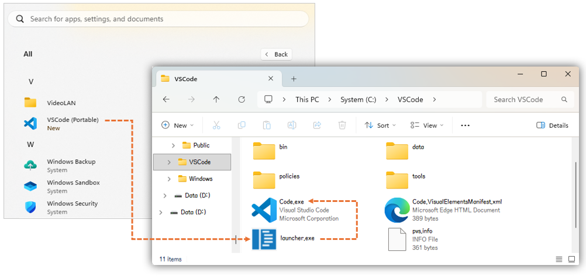</br>

VSCode를 처음 사용한다면 다음 링크를 참조해 기본 사용법을 익힌다.
>- https://code.visualstudio.com/docs/getstarted/getting-started

**개발 환경 업그레이드**
VSCode (Portable)는 프로그램을 실행할 때마다 기존 설치된 패키지의 최신 업데이트가 인터넷상에 존재하는지 자동으로 검증한다. 검증 과정에서 신규 버전이 확인되면 시스템 안내 화면이 화면에 출력된다. 이때 'Upgrade' 버튼을 선택하면 추가적인 설정 없이 최신 패키지로의 자동 업그레이드 프로세스가 진행된다.

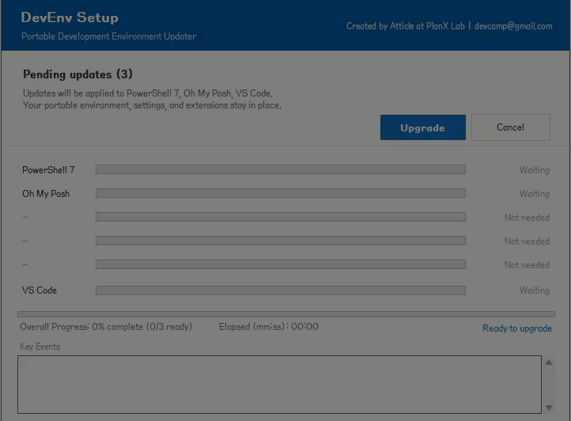</br>

### 작업 폴더 열기

VSCode 환경에서 소스 코드 파일을 저장하고 관리하는 기준 폴더를 작업 공간(Workspace)이라 한다. 파일 탐색 및 관리, 내장 터미널의 기본 실행 경로 등이 모두 이 작업 공간을 기준으로 동기화되어 동작하므로, 프로그래밍 작업을 시작하기 전에는 반드시 작업 공간 폴더를 열어야 한다.

VSCode를 실행한 후 상단 메뉴의 'File > Open Folder...' 항목을 선택하거나, 좌측 액티비티 바(Activity Bar)의 파일 탐색기(Explorer) 아이콘을 클릭하여 'Open Folder' 버튼을 지정한다. 원하는 경로에 새 폴더를 생성하여 연결하거나, 기존에 생성해 둔 전용 작업 폴더를 선택하여 오픈할 수 있다. 폴더를 처음 지정하여 열면 해당 폴더의 보안 신뢰성을 확인하는 대화상자가 화면에 출력된다. 이때 반드시 'Yes, I trust the authors' 옵션을 선택해야 정상적인 코드 편집 및 터미널 제어 권한이 부여된다.

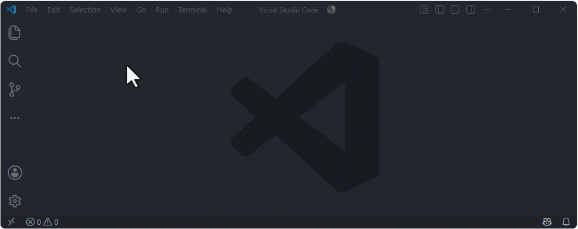<br>

만약 'Yes, I trust the authors'를 선택하지 않고 'No, I don't trust the authors'를 누르면 VSCode가 제한 모드(Restricted Mode)로 진입한다. 이 상태에서는 소스 코드 편집이나 터미널 실행, 확장 프로그램(Extensions) 동작이 제한되므로 다음과 같이 다시 모든 권한을 활성화해야 한다.

1. VSCode 화면 하단 상태 표시줄에 있는 'Restricted Mode' 아이콘(방패 모양) 선택
2. 화면 상단에 안내 창이 뜨면 'Trust' 선택 

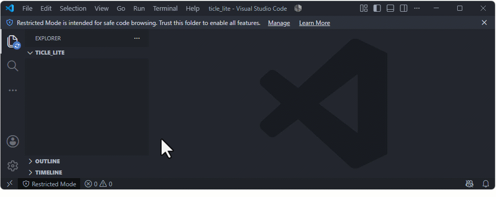<br>

### replx 툴 설치

replx는 TiCLE Lite와 같은 MicroPython 보드를 관리하고, PC에서 작성한 MicroPython 스크립트를 보드에서 실행하는 공개용 CLI 툴로, 멀티 운영체제(Windows, macOS, Linux)를 지원한다. 주요 기능은 다음과 같다.

| 기능 | 설명 |
| ---- | ---- |
| MicroPython 작업 공간 설정 | VSCode 작업 공간을 MicroPython 작업 공간으로 확장 |
| 프로그램 실행 | PC에서 작성한 MicroPython 스크립트 파일을 Core 보드에서 실행 |
| 파일 관리 | PC와 Core 보드 사이 파일 전송 및 Core 보드 내부 파일 관리 |

replx 툴을 설치하기 위해 VSCode 메뉴에서 'Terminal > New Terminal'을 선택하거나 단축키(Ctrl+Shift+`)로 새 터미널을 열고, 다음 명령을 실행한다. 설치 시점에 따라 버전과 의존성 패키지는 달라질 수 있다.

```sh
pip install -U replx
```

> macOS 사용자는 pipx를 설치했다면, pip 대신 pipx를 사용한다.

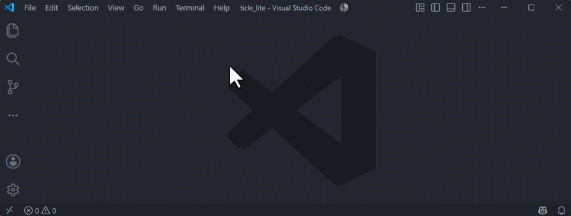</br>

replx 툴에 대한 자세한 사용법은 아래 링크를 참조한다.
- https://github.com/PlanXLab/replx

## Core 보드 초기 설정

> **풀고 싶은 문제**  
> 도구 설치가 끝났다. Core 보드를 USB로 연결했는데 replx는 어느 포트에 Core 보드가 있는지 어떻게 알 수 있을까? 매번 포트 번호를 직접 입력하지 않으려면 어떤 설정이 필요할까?

Core 보드를 처음 사용할 때는 PC에 할당된 시리얼 포트를 확인한 후 TiCLE Lite 라이브러리 다운로드, MicroPython 작업 공간 설정, Core 보드 초기화(라이브러리 설치)와 같은 초기 설정이 필요한데, replx 툴을 이용해 진행한다.

### Core 보드 연결 및 시리얼 포트 확인

Core 보드에 있는 USB 마그네틱 포트를 PC와 제공된 USB 케이블로 연결한다. 연결 상태는 아래 그림을 참고한다.

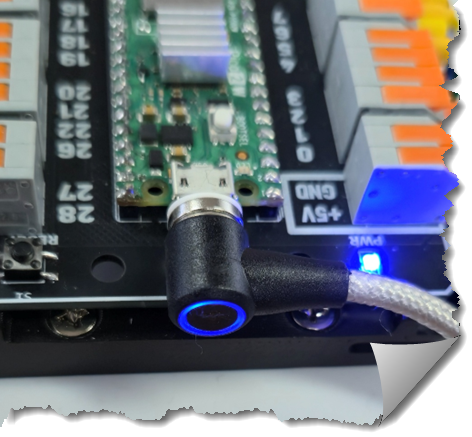</br>

PC가 TiCLE Lite를 인식하면, 통신하는데 필요한 시리얼 포트가 자동으로 할당되는데, scan 명령으로 이를 확인 한다. 시리얼 포트 형식은 운영체제마다 다르며, Windows에서는 COMx, macOS에서는 /dev/tty.usbmodemXXXX 이다.

```
replx scan
```

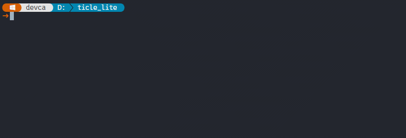</br>

### TiCLE Lite 라이브러리 다운로드

TiCLE Lite 라이브러리는 인터넷을 통해 배포는데, pkg search 명령으로 설치 가능한 패키지를 검색하고, pkg download 명령으로 해당 패키지를 PC로 다운로드한다. 

search 결과 중 버전 앞에 표시되는 (+) 기호는 새 버전을 의미하며, 초기 상태이므로 현재는 모든 모듈이 새 버전이다. download는 새 버전만 PC로 다운로드하므로 현재는 TiCLE Lite용 모든 모듈을 다운로드한다. 

```
replx <port> pkg search
replx <port> pkg download
```
</br>

라이브러리는 버그가 발견되거나 새로운 기능이 추가될 때마다 업데이트되므로 가끔씩 pkg search로 확인한 후, 새 버전이 발견되면 pkg download를 실행한다.

### MicroPython 작업 공간 초기화

PC에 TiCLE Lite 라이브러리를 다운로드한 후 setup 명령을 실행하여 현재 작업 공간(폴더)을 MicroPython 전용 개발 환경으로 확장 및 초기화한다. 이러한 환경 설정 과정을 거치면 replx 툴을 실행할 때마다 시리얼 포트 인자를 매번 명시적으로 지정해야 하는 번거로움을 덜 수 있다. 또한 VSCode 코드 편집기에서 MicroPython 소스 코드를 작성할 때, 구문 자동 완성 기능과 타입 힌트, 그리고 TiCLE Lite 라이브러리의 주요 API에 대한 동적 도움말 기능이 활성화되어 한층 효율적인 프로그래밍 환경을 경험할 수 있다.

```
replx <port> setup
```

MicroPython 작업 공간에서 다시 scan 명령을 실행하면 setup 명령으로 전달한 포트가 기본 포트로 설정되어 있을 것이다.

</br>

### Core 보드 초기화

TiCLE Lite 라이브러리를 다운받은 PC에서 Core 보드에 이를 설치할 때는 init 명령을 사용한다. init 명령을 실행하면 Core 보드 저장 공간을 포맷한 뒤 전용 라이브러리를 설치한다. 

```
replx <port> init
```

MicroPython 작업 공간에서 설정한 기본 포트는 생략 가능하므로 init 명령도 다음과 같이 실행할 수 있다.

```
replx init
```

</br>

---
</br>


## TiCLE Lite 하드웨어 테스트와 조립

> **풀고 싶은 문제**
> Core 보드 초기화는 마쳤지만 나머지 보드들을 프레임에 어떻게 배치하고 고정해야 할까? 곧바로 최종 조립부터 진행하기보다, 먼저 나머지 보드와 주변 장치를 임시로 배선하여 정상 동작 여부를 확인하는 것이 조립의 첫 단계이다.

조립 과정 중 발생할 수 있는 하드웨어 결함을 방지하기 위해, 각 보드를 프레임 박스에 최종 결합하기 전 다음의 단계별 테스트 절차를 순차적으로 수행한다.

1. Core 보드 및 Power 보드 기본 전원 점검
   - Core 보드와 Power 보드를 전원 케이블로 상호 연결한 후, Core 보드의 USB 포트를 PC에 연결하여 시스템 전원 인가 상태를 확인한다.
2. Basic 보드 입출력 소자 점검
   - Power 보드로부터 전원 케이블을, Core 보드로부터 신호 케이블을 연결하고 스피커 전원선까지 상호 결합한다. 이후 택트 스위치(버튼) -> 가변 저항(VR) 및 조도 센서(CdS) -> 캐릭터 LCD -> IMU 센서 -> 스피커 -> 마이크로폰 순으로 각 입출력 소자의 작동 상태를 검증한다.
3. 초음파 센서 계측 점검
   - Power 보드로부터 전원을, Core 보드로부터 신호선을 연결하여 거리 측정 데이터의 정상 수신 여부를 검증한다.
4. Pixel Display 보드 출력 점검
   - Power 보드의 전원 케이블과 Core 보드의 신호 케이블을 연결한 뒤, 16 x 16 LED 매트릭스의 점등 및 색상 제어 동작을 테스트한다.
5. 서보 모터 구동 점검
   - Power 보드의 전원선과 Core 보드의 PWM 신호선을 연결한 후, 설정한 회전 각도에 맞춰 모터가 정확하게 구동되는지 확인한다.

### TiCLE Lite 배선 연결

> **풀고 싶은 문제**  
> 보드를 프레임에 고정했지만 USB를 연결해도 아무 반응이 없다. 전원과 신호를 어디에, 어떤 순서로 연결해야 각 장치가 동작할까?

보드의 장착 위치를 파악했으면 전원선과 신호선을 연결하면서 주변 장치에 대한 테스트를 진행한다. 전원선은 각 보드와 장치의 동작에 필요한 전력을 공급하며, 신호선은 Core 보드가 센서값을 읽거나 장치를 제어하는 통신 경로이다. 전원선을 먼저 모두 연결한 뒤 신호선을 연결한다. 순서를 지키면 오결선이 발생하더라도 장치 손상을 다소 줄일 수 있다.

전체 배선도는 다음과 같다. 전원선의 출발점은 파워 보드이고, 신호선의 출발점은 Core 보드임에 유의한다.

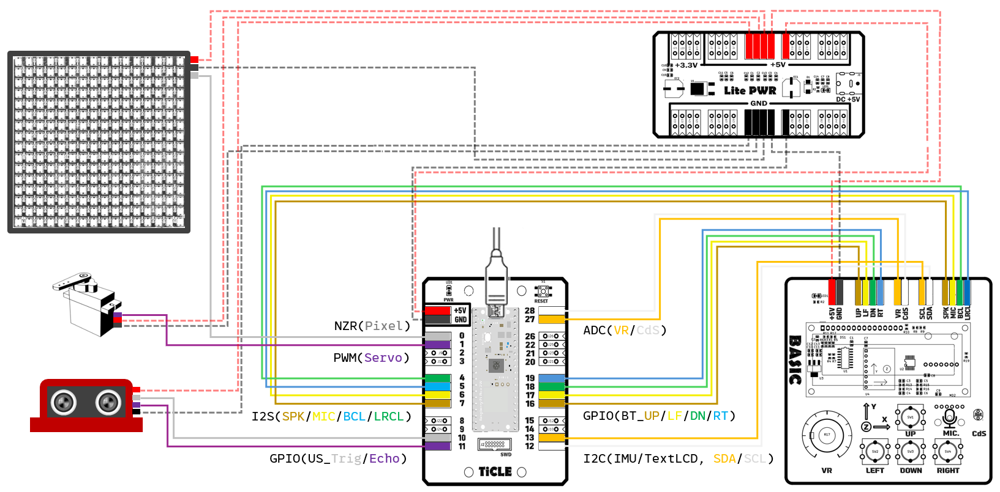</br>

이 배선도에는 전원 경로와 신호 경로가 함께 표시되어 있다. 각 선의 의미는 다음과 같다.

| 표기 | 의미 |
| ---- | ---- |
| 빨간 점선 | 5V 전원선 |
| 회색 점선 | GND 선 |
| 색이 있는 실선 | 장치 제어 또는 데이터 전송용 신호선 |

**레버 커넥터**

보드와 주변장치는 레버 커넥터로 전원과 신호선을 연결한다. 레버 커넥터는 공구 없이 손가락만으로 케이블을 고정할 수 있어 초보자도 쉽게 사용할 수 있다.

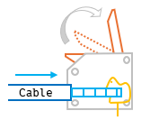</br>  

레버 커넥터 사용 순서는 다음과 같다.

1. 주황색 레버를 위로 들어 올려 잠금을 해제한다.
2. 케이블 끝단 도선을 구멍에 끝까지 밀어 넣는다.
3. 레버를 아래로 눌러 케이블을 고정한다.

케이블 끝단 도선은 최소 5mm 이상(기본 제공 케이블은 10mm) 피복을 벗겨 노출시켜야 전류나 신호가 정상적으로 흐른다. 연결 후 케이블을 가볍게 당겨 빠지지 않는지 확인한다.

**전원선 배선 매핑**

Power 보드는 Core 보드의 USB 케이블 전원 또는 DC 5V 4A 전원 어댑터에서 공급된 전원을 여러 장치에 분배하는 역할을 한다. 각 장치의 5V 단자에는 파워 보드의 5V를, GND 단자에는 파워 보드의 GND를 빨강(5V)과 검정(GND) 선을 이용해 연결한다. 5V와 GND를 반대로 연결하면 장치가 손상될 수 있으므로, 연결 방향을 반드시 확인한다.

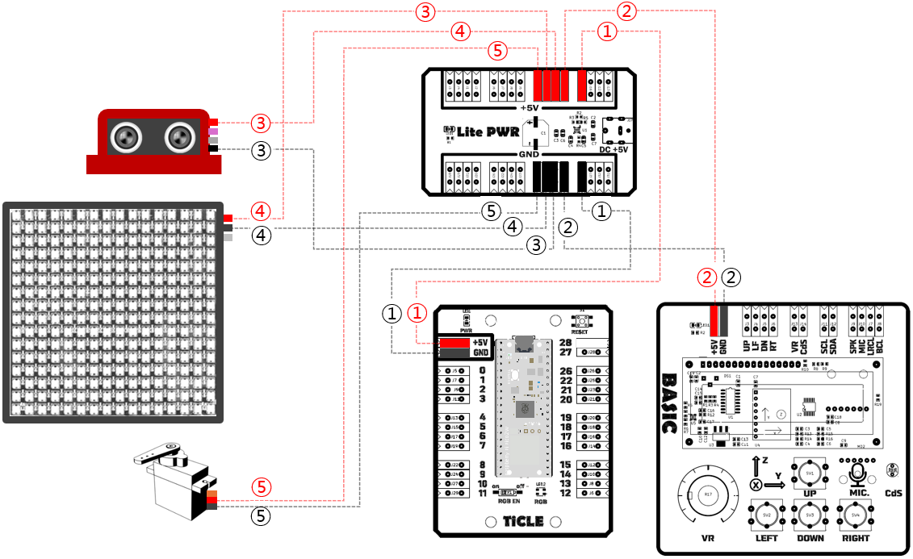</br>

| 파워 보드 | 장치 | 전원
|-----------|-----|----|
| ① | Core 보드 | 5V(빨강), GND(검정)
| ② | Basic 보드 | 5V(빨강), GND(검정)
| ③ | 초음파 센서 | 5V(빨강), GND(검정)
| ④ | Pixel Display 보드 | 5V(빨강), GND(검정)
| ⑤ | 서보 모터 | 5V(빨강), GND(검정)

**Core 보드와 Basic 보드 간 신호선 배선 매핑**

Basic 보드에는 버튼(Tact Switch), 가변 저항(VR), 조도 센서(CdS), IMU 센서, 캐릭터 LCD 및 오디오 입출력 모듈 제어를 위한 총 12개의 신호 단자가 탑재되어 있다. 각 단자의 표기명은 Core 보드에 인쇄된 해당 GPIO 핀 번호와 $1:1$로 정확히 상응하도록 설계되어 있으므로, 동일한 명칭의 핀끼리 신호 케이블을 서로 연결한다.

배선 작업 시 복잡성을 줄이고 오배선을 방지하기 위해 6가지 색상(흰색, 주황색, 갈색, 노랑색, 녹색, 파랑색)의 케이블이 각 2세트씩 기본 제공된다. 이때 케이블 양 끝단의 커넥터 핀 캡이 노란색과 주황색 2가지 그룹으로 다르게 구분되어 있어, 컬러 조합을 통해 총 12개의 신호선을 혼선 없이 명확하게 식별할 수 있다.

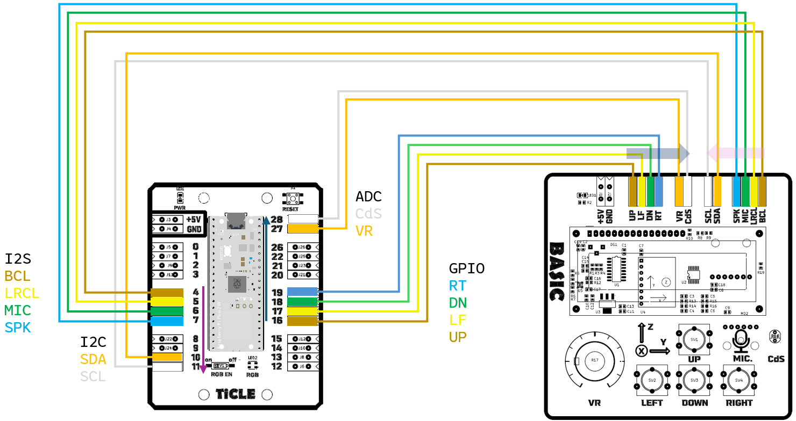</br>

Core 보드와 Basic 보드를 상호 연결할 때는 각 통신 방식 및 소자별로 지정된 GPIO 핀 번호와 케이블의 컬러 조합(케이블 색상 + 캡 색상)을 일대일로 정확히 일치시켜 배선해야 한다. 상세 배선 매핑 사양은 아래 표와 같다.

| 이름 | GPIO|색상(캡 색상)||이름 | GPIO|색상(캡 색상)|
|----|-----|-|-|----|-----|-----|
|**I2S**||||**버튼**|||
|BCL(SCK)   | 4 |갈색(주황)||UP   |16|갈색(노랑)|
|LRCL(WS)   | 5 |노랑(주황)||LEFT |17|노랑(노랑)|
|MIC(SD_IN) | 6 |녹색(주황)||DOWN |18|녹색(노랑)|
|SPK(SD_OUT)| 7 |파랑(주황)||RIGHT|19|파랑(노랑)|
|**I2C**||||**ADC**|||
|SDA        | 10|주황(주황)||VR   |27|주황(노랑)|
|SCL        | 11|흰색(주황)||CdS  |28|흰색(노랑)|

신호와 전원을 동시에 공급받는 오디오 스피커 케이블의 끝단에는 1.5 mm 규격의 2핀 하네스 커넥터(수형)가 결합되어 있다. 이 커넥터는 Basic 보드 후면에 탑재된 오디오 스피커 앰프 모듈의 전용 하네스 커넥터(암형)에 오삽입 방지 홈을 맞춰 직접 체결한다. 하네스 커넥터 체결 시 핀 단자의 방향과 극성(빨강+, 검정-)을 확인한 뒤, "딸깍" 소리가 나며 유격 없이 끝까지 완전히 결합되었는지 반드시 점검해야 한다.

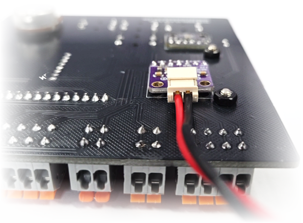</br>

**Core 보드와 기타 주변 장치 간 신호선 배선 매핑**

Pixel Display 보드와 서보 모터, 초음파 센서의 신호선은 케이블 색상을 기준으로 Core 보드의 GPIO에 연결한다. 초음파 센서는 신호선이 2개이므로 반드시 색상에 따른 GPIO 번호에 주의해야 한다.

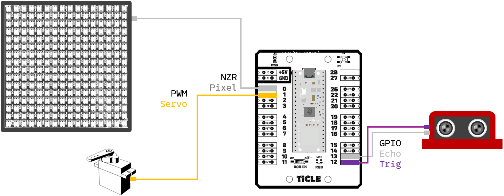</br>

|이름||GPIO|색상|
|---|-|----|---|
|Pixel Display 보드||0|회색|
|서보 모터||1|주황|
|초음파 센서|트리거| 12|보라|
||에코| 13|회색|

모든 배선이 끝나면 아래 항목을 순서대로 점검한다. 이상이 없으면 USB 케이블로 Core 보드를 PC에 연결하여 전원을 인가한다.

| 확인 항목 | 확인 방법 |
| --------- | --------- |
| 보드가 프레임에 단단히 고정되어 있는가 | 손으로 흔들어 유격 여부 확인 |
| 전원선의 5V(빨강)와 GND(검정)가 바르게 연결되었는가 | 색상과 단자 표기 대조 |
| 모든 레버 커넥터가 잠겨 있는가 | 케이블을 가볍게 당겨 확인 |
| 신호선이 표의 GPIO 번호와 일치하는가 | 배선 표와 핀 번호 대조 |
| 스피커 커넥터가 끝까지 삽입되었는가 | 커넥터 삽입 깊이 확인 |

> 전원 인가 후 코어, 파워, Basic 보드의 LED에 불이 들어오면 정상 동작 중이다. 아무 반응이 없으면 USB 케이블과 전원선 연결 상태를 다시 확인한다.

### Basic 보드 케이블링과 테스트
Basic 보드의 +5V와 Power 보드의 +5V를 빨강 케이블로 연결하고, Basic 보드의 GND와 Power 보드의 GND를 검정 케이블로 연결한 후 주변 장치 별로 신호선을 연결하면서 동작을 테스트한다.

**버튼**
Basic 보드의 방향 버튼 단자(UP, LEFT, DOWN, RIGHT)와 Core 보드의 해당 GPIO 핀(GPIO 16, GPIO 17, GPIO 18, GPIO 19)을 노란색 캡이 씌워진 갈색, 노란색, 녹색, 파란색 케이블로 각각 1:1 직결한다. 

배선 연결 완료 후 gpio read 명령을 실행하여 각 버튼의 디지털 신호 입력 상태를 검증한다.

- 동작 확인 방식: 스위치를 누를 때마다 해당 입력 신호 변화를 감지하여 현재 눌린 버튼의 명칭 및 GPIO 핀 번호를 콘솔 화면에 직관적으로 출력한다.
- 테스트 종료 조건: 4개의 방향 버튼을 빠짐없이 한 번씩 모두 누르면 디지털 입력 기능 검증 프로그램이 성공적으로 완료 및 종료된다.

```sh
replx gpio read GP16 GP17 GP18 GP19 pulse_h
```

**가변 저항, 조도 센서**
Basic 보드의 가변 저항(VR) 및 조도 센서(CdS) 단자를 Core 보드의 GPIO 27 및 GPIO 28 핀에 노란색 캡이 씌워진 주황색, 흰색 케이블로 각각 1:1 연결한다. 본 실습은 측정된 아날로그 데이터를 콘솔 아스키 그래프 형태로 실시간 출력하므로, 정상적인 시각화를 위해 마우스를 사용하여 터미널 창의 높이(행 개수)를 24줄 이상으로 미리 조절해야 한다.

배선 체결 및 터미널 크기 조절 후 adc scope 명령을 실행하여 ADC 신호를 모니터링한다.
- 가변 저항(GP27) 검증: 가변 저항 노브를 시계/반시계 방향으로 회전시켰을 때 GP27에 해당하는 아날로그 그래프 수치가 오르내리는지 확인한다.
- 조도 센서(GP28) 검증: CdS 센서 표면을 손가락으로 가리거나 빛을 비추었을 때 GP28 그래프 파형이 즉각적으로 변화하는지 확인한다.
- 프로그램 종료: 테스트를 완료하거나 모니터링을 종료할 때는 키보드의 Ctrl+C를 입력한다.

```sh
replx adc scope GP27 GP28
```

**캐릭터 LCD, IMU**
Basic 보드의 SDA(시리얼 데이터) 및 SCL(시리얼 클록) 단자를 Core 보드의 GPIO 10 및 GPIO 11 핀에 주황색 캡이 씌워진 주황색, 흰색 케이블로 각각 1:1 연결한다.

배선 체결 완료 후 i2c scan 명령을 실행하여 I2C 버스 라인에 결합된 장치들을 검색한다. 본 명령이 수행되면 I2C 통신 라인에 연결된 캐릭터 LCD 모듈의 고유 주소인 0x27과 MPU-6050 IMU 센서의 고유 주소인 0x68이 탐지 결과 목록에 모두 정상적으로 표시되어야 한다. 

```sh
replx i2c scan --sda GP10 --scl GP11
```

I2C 버스 스캔을 통해 두 디바이스의 탐지가 확인되면, 탐지된 캐릭터 LCD 주소(0x27)를 지정하여 i2c seq 명령을 실행한다. 본 명령은 LCD를 4비트 데이터 전송 모드로 초기화하고 백라이트 및 화면 출력을 활성화한 후, 지정된 문자를 모듈로 전송하는 일련의 제어 시퀀스를 수행한다.

초기화 시퀀스 실행 후 캐릭터 LCD 화면에 알파벳 대문자 'H'가 정상적으로 표시되면 I2C 통신 및 디바이스 동작 테스트가 성공적으로 완료된 상태이다.

```sh
replx i2c seq 0x27 3C 38 m5 3C 38 u120 3C 38 2C 28 m1 0C 08 CC C8 
replx i2c seq 0x27 4D 49 8D 89
```

I2C 버스에서 탐지된 MPU-6050 IMU 센서의 고유 주소(0x68)와 함께 i2c dump 명령을 실행하여, 센서 내부 레지스터 메모리 맵의 전체 데이터가 콘솔 화면에 출력되는지 확인한다.

- WHO_AM_I 레지스터(0x75) 검증: 덤프된 메모리 표에서 주소 0x75(70행 05열 위치)에 저장된 16진수 데이터 값이 0x68(또는 칩셋 버전에 따른 고유 식별 값)로 읽혀서 출력되면, MPU-6050 센서의 I2C 레지스터 읽기 동작이 정상 상태임을 의미한다.

```sh
replx i2c dump 0x68
```

**오디오 스피커, 마이크**
Basic 보드의 I2S 오디오 단자(BCL, LRCL, MIC, SPK)와 Core 보드의 해당 GPIO 핀(GPIO 4, GPIO 5, GPIO 6, GPIO 7)을 주황색 캡이 씌워진 갈색, 노란색, 녹색, 파란색 케이블로 각각 1:1 직결한다.

배선 연결 완료 후 i2s scope 명령을 실행하면, 디지털 MEMS 마이크로폰을 통해 실시간으로 입력되는 주변 음향 데이터 및 소음 진폭이 콘솔 화면에 아스키 파형 그래프 형태로 연속 출력된다.

- 동작 검증: 마이크 주변에서 소리를 내거나 박수를 쳤을 때 파형 그래프의 진폭이 수신된 음량 크기에 반응하여 실시간으로 변화하는지 확인한다.
- 프로그램 종료: 테스트를 종료할 때는 키보드의 Ctrl+C를 입력한다.

```sh
replx i2s scope  --sck gp4 --ws gp5 --sd gp6 --gain 2
```

스피커 오디오 출력 기능을 검증하기 위해 i2s tone 명령을 실행하며, 매개변수로 재생할 음의 주파수(Hz)와 유지 시간(ms, 밀리초)을 순차적으로 전달한다.
- 테스트 음계 구성: 4옥타브의 '도'(262 Hz) -> '미'(330 Hz) -> '솔'(392 Hz) 순서로 주파수 값을 지정하여 차례로 출력한다. m500은 0.5초 동안 현재 출력을 유지한다.
- 정상 판단 기준: 해당 명령 실행 시 Basic 보드에 연결된 스피커를 통해 3가지 지정 음계의 톤 신호가 명확하고 맑은 음색으로 차례대로 출력되면 I2S 오디오 앰프 및 스피커 모듈이 정상 동작하는 상태이다.

```sh
replx i2s tone --sck gp4 --ws gp5 --sd gp7 262 m500 330 m500 392 m500 
```

### 기타 주변 장치 케이블링과 테스트
**초음파 센서**

초음파 센서 모듈의 전원선 중 빨간색(VCC) 케이블과 검은색(GND) 케이블은 Power 보드의 5V 및 GND 단자에 각각 연결한다. 신호선인 보라색(Trig) 케이블과 회색(Echo) 케이블은 Core 보드의 GPIO 12 및 GPIO 13 핀에 각각 1:1 직결한다.

배선 체결 완료 후 gpio seq 명령을 실행하여 초음파 거리 측정 시퀀스를 수행한다.
- 트리거(Trig) 펄스 방사 (GP12): GPIO 12 핀에 10 us(마이크로초) 동안 High(1) 신호를 인가하여 센서 송신기에서 40 kHz 대역의 초음파를 외부로 방사하도록 요청한다.
- 에코(Echo) 수신 및 거리 계산 (GP13): 송출된 초음파가 장애물에 맞고 반사되어 수신기로 돌아올 때까지 GPIO 13 핀이 High(1) 상태를 유지하는 시간(t, us)을 측정한다. 음속 환산 정수를 적용하여 수신 시간 값을 58로 나누어 센서와 장애물 사이의 공간 거리를 계산한다.
- 동작 검증: 장애물과의 거리를 변화시켰을 때 콘솔 화면에 연산된 측정 거리 값(cm 단위)이 실시간으로 정확하게 업데이트되어 출력되면 정상이다.
- 프로그램 종료: 테스트를 완료하거나 모니터링을 중단할 때는 키보드의 Ctrl+C를 입력한다.

```sh
replx gpio seq GP12 1 u10 0 GP13 pulse_h --expr "pulse_us/58" --repeat 0 --interval 500
```

**Pixel Display 보드**

Pixel Display 보드의 전원선 중 빨간색(VCC) 케이블과 검은색(GND) 케이블은 Power 보드의 5V 및 GND 단자에 각각 연결하며, 신호선인 회색 케이블은 Core 보드의 GPIO 0 핀에 결합한다.

배선 연결 완료 후 ws2812 write 명령을 실행하여 픽셀 매트릭스의 동작 상태를 테스트한다.
- 인덱스 슬라이싱 구문 [:, :]: 가로와 세로 좌표 전체 범위(16 x 16 = 256개 LED 소자)를 일괄 지정함을 의미한다.
- 색상 데이터 0xFFFFFF: Red, Green, Blue 채널의 최대 휘도가 결합된 흰색(White)을 나타낸다.

이와 같이 제어 명령 전송 시 256개의 모든 LED 소자가 일제히 흰색으로 점등되면 Pixel Display 보드가 정상적으로 동작하는 상태이다.

```sh
replx ws2812 write GP0 [:,:] 0xffffff 
```

WS2812 RGB LED의 모든 소자를 최대 밝기의 흰색(0xFFFFFF)으로 켜면, 시스템 전체의 소비 전력이 최대치로 급증하게 된다. 따라서 전원 과부하를 방지하고 다음 실습 과정을 안전하게 진행하기 위해, LED 색상 값을 0x000000으로 지정하여 전체 LED 소자를 모두 소등(Off) 상태로 전환해야 한다.

```sh
replx ws2812 write GP0 [:,:] 0x000000
```

스텝(Step) 간격을 지정하는 슬라이싱 구문 [::15, ::15]를 사용하면, 매트릭스의 네 꼭짓점에 위치한 4개의 모서리 LED 소자만 선택하여 정밀하게 제어할 수 있다.

아래 명령어를 실행하여 슬라이싱 제어 동작을 검증한다.
- 슬라이싱 구문 분석 ([::15, ::15]): 가로(x) 축 및 세로(y) 축에 대해 시작점부터 끝점까지 15 간격(Step)으로 픽셀 인덱스를 추출한다. 이에 따라 x축과 y축 모두 0번과 15번 인덱스만 선택되어 총 4개의 외각 꼭짓점 좌표 (0,0), (0,15), (15,0), (15,15)가 일괄 지정된다.
- 색상 데이터 0xFF0000: Red 채널만 최대 휘도로 지정한 빨간색(Red)을 의미한다.
- 동작 검증: 명령 실행 시 16 x 16 픽셀 매트릭스의 최외각 네 모서리에 위치한 4개의 LED만 일제히 빨간색으로 점등되면 스텝 지정 명령이 정상 작동하는 상태이다.

```sh
replx ws2812 write GP0 [::15,::15] 0xff0000
```

**서보 모터**
서보 모터는 움직이므로 턴테이블과 함께 조립된 프레임 박스 하단을 분리한 후 테스트를 진행한다. 서보 모터의 전원선 중 빨간색(VCC) 케이블과 검은색(GND) 케이블은 Power 보드의 5V 및 GND 단자에 각각 연결하며, 제어 신호선인 주황색 케이블은 Core 보드의 GPIO 1 핀에 연결한다.

배선 체결 완료 후 서보 모터 제어 표준 주파수인 50 Hz(주기 20 ms) 조건에서 pwm seq를 아래와 같이 실행하여 모터의 회전 각도 및 제어 동작을 검증한다.

- PWM 펄스 폭 매핑 및 각도 제어 시퀀스:
  - pulse_us: 마이크로초(us) 단위 펄스 폭
  - 500: 펄스 폭 500 us 인가 -> 최소 각도($0^\circ$) 위치 이동
  - m1000: 해당 상태 1,000 ms(1초) 동안 유지
  - 1500: 펄스 폭 1500 us 인가 -> 중앙 각도($90^\circ$) 위치 이동
  - 2500: 펄스 폭 2500 us 인가 -> 최대 각도($180^\circ$) 위치 이동
- 동작 검증: 명령 실행 시 서보 모터가 지정된 시퀀스 시간에 맞춰 $0^\circ$ -> $90^\circ$ -> $180^\circ$ -> $90^\circ$ 위치로 정확히 단계별 회전 구동을 수행하면 서보 모터 PWM 제어 테스트가 정상적으로 완료된 상태이다.

```sh
replx pwm seq GP1 --freq 50 --duty pulse_us 500 m1000 1500 m1000 2500 m1000 1500 m1000
```

### TiCLE Lite 최종 조립 및 유의 사항
모든 보드 및 센서 모듈의 기능 검증이 이상 없이 완료되면, 각 부품을 프레임 박스의 지정된 위치에 결합하여 TiCLE Lite 시스템의 최종 조립을 완성한다. 다음은 조립이 정상적으로 완료된 전체 시스템의 외관 구조이다.

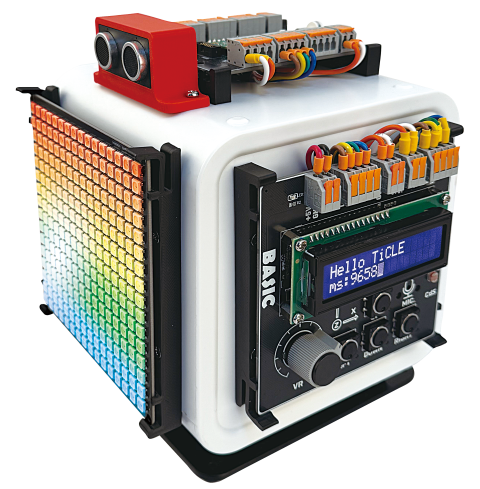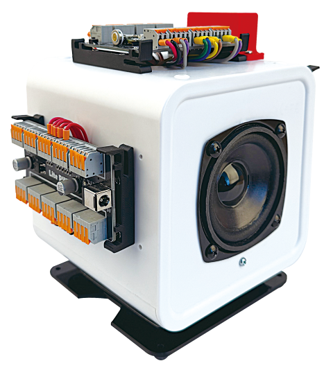 

각 보드를 프레임 박스에 결합할 때 적용되는 장착 위치 규격은 다음과 같다. 기준점은 초음파 센서 모듈이 외부를 향해 노출되는 방향을 전면(앞쪽)으로 정의한다.

| 보드 명칭 | 프레임 장착 위치 | 비고
| ------- | ------------ |--------
| Pixel Display 보드 | 프레임 전면 (Front) | 초음파 센서 정면 결합
| Basic 보드 | 프레임 좌측면 (Left) | 입력/출력 인터페이스 조작부
| Core 보드 | 프레임 상단부 (Top) | 메인 컨트롤러 및 무선 통신부
| Power 보드 | 프레임 후면 (Rear) | DC 전원 입력 및 전원 확장부

프레임 박스 내부 공간에는 스피커 연결 케이블을 비롯하여 전면에 위치한 초음파 센서 및 내부 서보 모터 구동을 위한 전원 및 신호 케이블이 들어 있다.

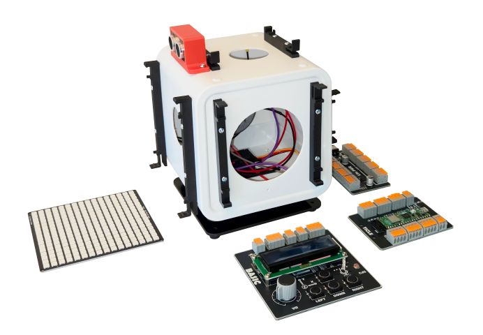</br>

**원터치 브라켓 결합 및 분리 메커니즘**

각 보드는 별도의 나사(Screw) 체결 없이 원터치 브라켓 슬롯 방식을 통해 프레임에 간편하게 탈부착할 수 있다.
- 체결(장착) 방법: 보드 하단부를 브라켓 가이드 홈에 먼저 비스듬히 끼워 넣은 후, 보드 상단부를 가볍게 눌러 밀어 넣으면 "딸깍" 소리와 함께 고정된다.
- 분리 방법: 브라켓 상단에 위치한 고정 래치(손잡이)를 위쪽으로 살짝 올려 고정을 해제한 뒤, 보드 상단을 앞으로 끌어당겨 꺼낸다.

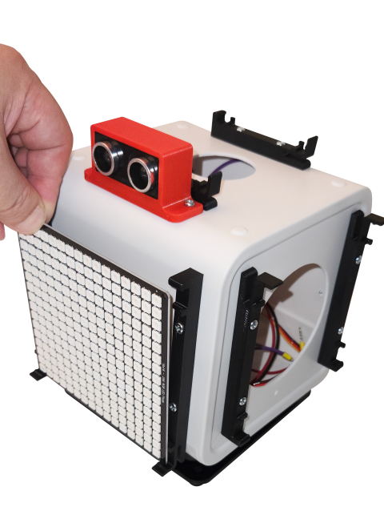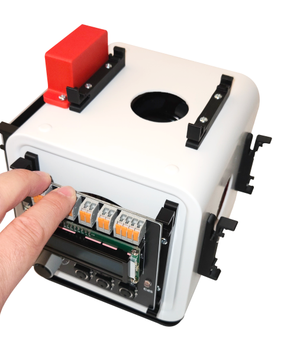</br>
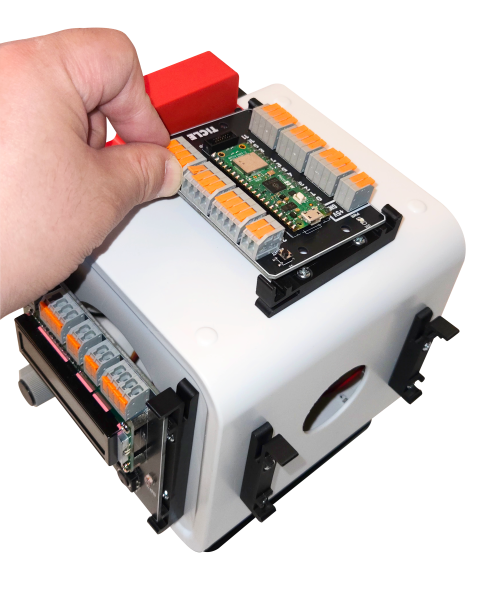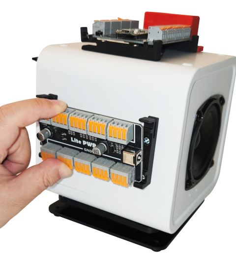</br> 

조립 및 배선 작업 시 아래의 작업 팁을 적용하면 유지보수 편의성을 대폭 향상시킬 수 있다.

- 케이블 라벨링(Labeling): 견출지나 라벨 태그를 미리 준비하여 각 케이블의 단자부 근처에 해당 신호선 명칭(B_VCC, B_GND, SDA 등)을 적어두면, 배선 오류 발생 시 식별 및 수정 작업이 매우 용이하다.
- 신호 라인 그룹화(Binding): 방향 버튼, I2S 오디오, I2C 통신 라인과 같이 2개 이상의 신호선을 사용하는 다선 케이블은 케이블 타이나 피복 튜브를 활용하여 사전에 묶어 정리하는 것이 바람직하다. 배선 얽힘을 방지하고 보드 내부 공기 순환 및 결합 안정성을 확보할 수 있다.

---
</br>


## 첫 번째 프로그램 실행

> **풀고 싶은 문제**  
> 작성한 코드를 TiCLE Lite에서 실행하고 싶다. 파일을 어떻게 실행하며, 결과는 어디서 확인하는가?

이 장의 목표는 프로그램 작성부터 실행 결과 확인까지의 기본 흐름을 익히는 것이다. 먼저 가장 간단한 출력 예제로 실행 과정을 익히고, 이어서 Pixel Display 보드 예제로 눈에 보이는 결과를 확인한다.

### Hello World

> **이 예제로 풀 문제**  
> 파일에 코드를 저장하고 replx로 실행해 터미널에서 결과를 확인하는 이 세 단계가 정상으로 연결되는지, 가장 짧은 코드로 먼저 확인해 보자.

모든 환경 설정이 완료된 후 첫 번째 프로그램을 작성하고 실행한다. VSCode 왼쪽 탐색기(Explorer) 상단의 새 파일 만들기 아이콘을 클릭하여 파일을 만들고 이름을 hello.py로 지정한다. VSCode 탐색기는 Windows 탐색기와 사용법이 유사하며, 이름 바꾸기는 F2, 파일 삭제는 DEL 키를 사용한다.

새 파일은 메뉴에서 'File > New File'을 선택하거나, VSCode 탐색기에서 마우스 오른쪽 버튼을 클릭하여 팝업 메뉴의 'New File'을 선택하는 방법으로도 만들 수 있다.

hello.py 편집창이 열리면 아래 코드를 입력한다. VSCode는 다른 창으로 포커스가 이동할 때마다 편집 중인 내용을 열린 파일에 자동으로 저장하도록 설정되어 있으므로, 별도로 저장할 필요는 없다.

```python
# hello.py
from termviz import Term

msg = f"Hello {Term.FG.BRIGHT_RED}TiCLE{Term.RESET} !!!"
print(msg)
```

코드 작성이 완료되면 터미널 창에서 run 명령으로 hello.py를 TiCLE Lite에서 실행한다. 실행 결과는 터미널에 출력된다.

```
replx run hello.py
```

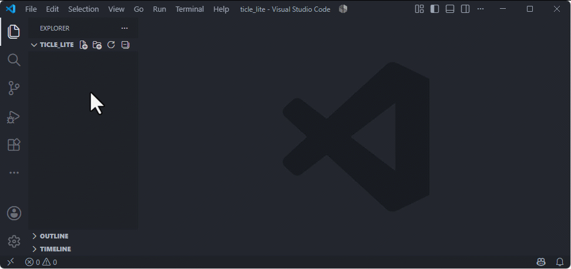<br>

> **한 걸음 더**
> 1. hello.py의 print 메시지를 자신의 이름이나 짧은 문구로 바꾸고, replx로 실행해 터미널에 바뀐 출력이 나오는지 확인해 보자.
> 2. run 명령은 자주 사용하므로 생략할 수 있다. 즉, 다음과 같이 replx와 파일명만 사용해도 된다.
>    ```sh
>    replx hello.py
>    ```
> 3. VSCode 단축키인 Ctrl+Shift+B를 누르면 새 터미널에서 현재 열린 파일을 자동으로 보드에 실행한다.
>    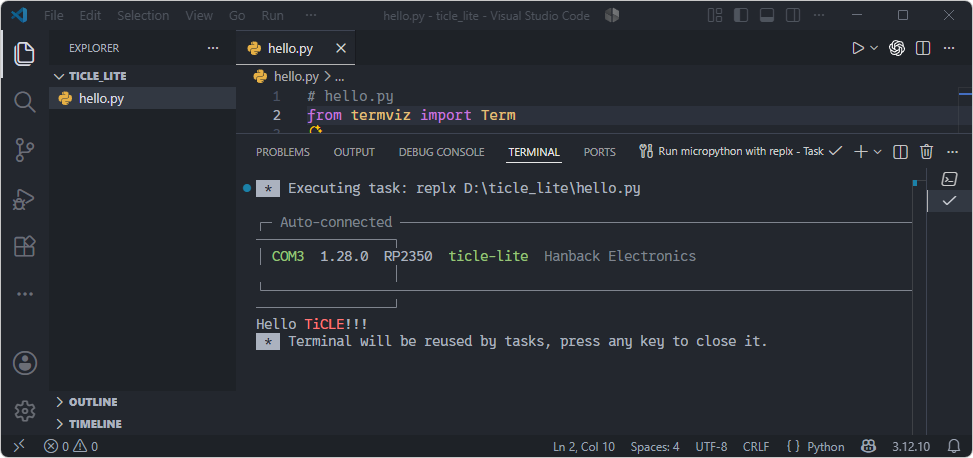<br>

### 간단한 데모: 픽셀 애니메이션

> **이 예제로 풀 문제**  
> Hello TiCLE 출력은 확인했지만, TiCLE Lite가 실제로 어떤 동작을 낼 수 있는지는 아직 모른다. 완성된 데모 코드를 실행해 이 TiCLE Lite가 표현할 수 있는 것을 먼저 살펴보자.

본격적인 실습에 앞서 TiCLE Lite의 Pixel Display 보드(WS2812)에 다양한 효과를 출력하는 예제를 실행한다. pixel_effect.py 파일을 새로 만들고 아래 내용을 입력한다.

```python
# pixel_effect.py
from ticle_lite.ws2812 import Matrix, Effect
from termio import KeyReader

def get_effects(fx_obj):
    exclude = ('stop')
    return [getattr(fx_obj, n) for n in dir(fx_obj) 
            if callable(getattr(fx_obj, n)) and not n.startswith('_') and n not in exclude]

def cycle(iterable):
    while True:
        for item in iterable:
            yield item

def run_app():
    effs = get_effects(fx)
    eff_iterator = cycle(effs)

    def play_next():
        fx.stop()
        current = next(eff_iterator)
        print(f"Playing: {current.__name__}")
        current()

    play_next()

    with KeyReader() as kr:
        while True:
            key = kr.wait_key()
            if key == "n":
                play_next()
            elif key == "q":
                fx.stop()
                m.clear()
                print("Exit.")
                break

if __name__ == "__main__":
    try:
        m = Matrix(0, brightness=0.2)
        fx = Effect(m)
    
        print("Press 'n' for next effect, 'q' or <Ctrl>+C to quit.")
        run_app()
    finally:
        fx.stop()
        m.deinit()
```

코드 입력이 완료되면 터미널에서 다음과 같이 실행한다. 실행 중 n 키를 누르면 다음 효과로 전환되고, q 키 또는 Ctrl+C를 누르면 종료한다.

```
replx pixel_effect.py
```

다음은 Pixel Display 보드 실행 결과이다.

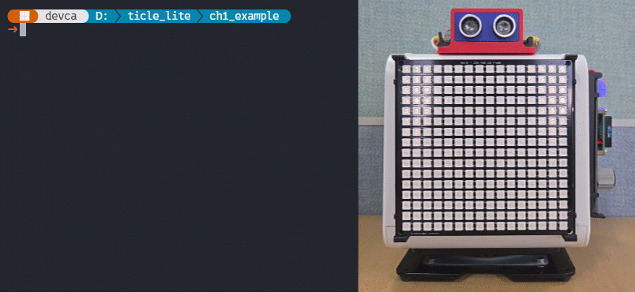</br>

> **한 걸음 더**
> 1. pixel_effect.py에서 get_effects() 함수의 반환값만 출력(pixel_effect_get_effects.py)해 보자.
> 2. get_effects()의 반환값이 의미하는 것은 무엇인가?

---
</br>


## replx 핵심 명령과 문제 해결

> **풀고 싶은 문제**  
> VSCode에서 MicroPython으로 TiCLE Lite 제어 프로그램을 작성해도 replx가 없으면 실행할 수 없다. 실습 과정에서 반드시 알아야 할 replx 명령은 어떤 것이 있을까?

앞으로 실습을 진행하다 보면 파일 실행 외에도 다양한 상황이 생긴다. PC에 있는 파일을 Core 보드에 올리거나 내려받아야 하거나, 사용자가 작성한 라이브러리를 직접 설치해야 할 때가 그 예다. 아래 명령은 이후 장에서 자주 등장하므로 미리 익혀 두면 좋다.

자주 쓰는 명령은 아래 표에 정리한다. 

| 명령 | 역할 |
| ---- | ---- |
| replx repl | 대화형 셸 접속 (Ctrl+X로 종료) |
| replx ls [경로] | Core 보드 파일 목록 확인 |
| replx get 파일 | Core 보드 파일을 PC로 내려받기 |
| replx put 파일 [Core 보드 경로] | PC 파일을 Core 보드에 올리기 |
| replx rm 파일 | Core 보드 파일 삭제 |
| replx mpy 파일.py [-d 경로] | .mpy로 컴파일 [Core 보드에 배포] |
| replx shutdown | 백그라운드에서 실행 중인 에이전트 서버 종료 |

### REPL로 MicroPython 명령 테스트
repl 명령으로 Core 보드의 대화형 셸(REPL, Read-Eval-Print-Loop)에 접속하면 코드를 한 줄씩 입력해 바로 실행할 수 있다. REPL은 결과를 빠르게 확인하거나 간단한 동작을 테스트할 때 유용하다. 접속 후 Ctrl+D 키를 누르거나 exit()를 입력하면 셸에서 빠져나온다.

```sh
replx repl
```
```sh
help('modules')  # Core board firmware built-in module output
import sys
sys.implementation
exit()
```

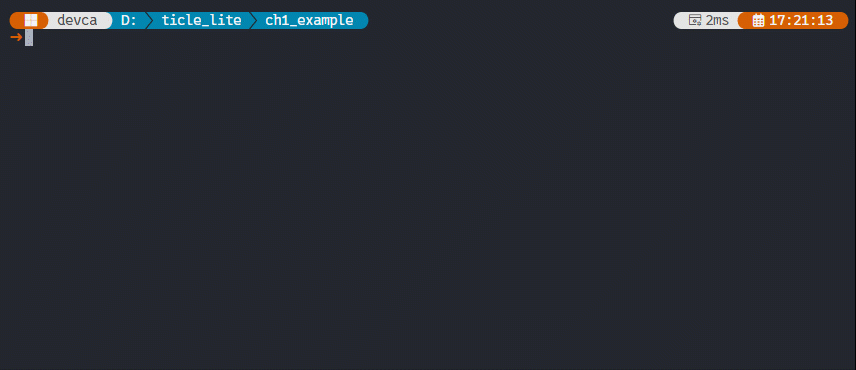</br>

### Core 보드 파일 관리
간단한 테스트를 위해 platform_check.py란 이름으로 새 파일을 만든 후 다음 내용을 입력한다.

```python
# platform_check.py
import sys

_mach  = sys.implementation._machine.split()
core, device   = _mach[-1], _mach[-3]

if __name__ == '__main__':
    print(core, device)
```

ls 명령은 Core 보드 내부의 파일 목록을 보여 주는데, 경로를 지정하면 해당 폴더만 탐색한다. run 명령에 -d/--device 옵션을 붙이면 Core 보드에 저장된 스크립트를 실행한다. put은 PC의 파일을 Core 보드로 올리고, cat은 Core 보드의 파일 내용을 출력하며, get은 Core 보드의 파일을 PC로 내려받고, rm은 Core 보드의 파일을 삭제한다. Core 보드 경로에서 루트인 '/'는 생략할 수 있다.

```sh
replx put ./platform_check.py /platform_check.py
replx ls
replx cat /platform_check.py
replx run -d /platform_check.py
replx get /platform_check.py ./platform_check2.py
cat ./platform_check2.py
rm platform_check2.py
replx rm /platform_check.py
replx ls
```

</br>

### 사용자 라이브러리 설치와 MicroPython 명령 이어서 실행
mpy 명령은 MicroPython 파일을 즉시 기능한 바이트코드(.mpy)로 컴파일하는데, -d/--device 옵션으로 Core 보드의 /lib 경로에 배포하면, 이후 사용자 스크립트에서 'from 모듈명 import 이름' 형태로 불러와 사용할 수 있다. -c/exec 명령은 run처럼 Core 보드에서 간단한 MicroPython 명령을 실행하지만, 이전 실행 결과를 초기화하지 않고 이어서 실행한다. 

```sh
replx mpy platform_check.py -d /lib
replx ls /lib/platform_check.mpy
replx -c "from platform_check import core, device"
replx -c "core"
replx -c "device"
replx rm -f /lib/platform_check.mpy
```

</br>

> **한 걸음 더** 
> run과 -c/exec 명령 모두 PC에서 MicroPython 명령을 TiCLE Lite로 전송해 실행하지만, run은 대상이 파일이고, -c/exec는 줄단위 문자열이다. 또한 run은 MicroPython 인터프리터를 초기화한 후 파일 내용을 줄단위로 실행하지만, -c/exec는 이러한 초기화 과정이 생략된다.

### replx 도움말
사용자는 replx --help로 전체 명령의 도움말 또는 replx CMD --help로 해당 명령의 세부 도움말을 얻을 수 있다.

```sh
replx --help
replx run --help
```

</br>

### MicroPython 스크립트 실행 중 Core 보드가 죽는 경우

> **풀고 싶은 문제**  
> 스크립트를 실행했는데 갑자기 아무 명령에도 응답하지 않는다면 어떻게 해야 할까? 리셋 버튼조차 소용없어 보이는 이 상황에서, Core 보드를 다시 정상 상태로 되돌리는 방법을 알아야 한다.

Core 보드에서 가용한 MicroPython 힙(Heap) 메모리는 약 446 KB이다. 이 가용 용량을 초과하는 복잡한 대용량 스크립트를 실행할 경우, 메모리 부족(Out of Memory) 현상으로 인해 Core 보드가 응답 불능 상태인 패닉(Panic)에 빠질 수 있다. 패닉 상태에 진입하면 CLI 환경에서 replx 명령어 제어가 불가능해진다.

시스템 패닉 발생 시 아래의 단계별 트러블슈팅 절차에 따라 복구를 진행한다.

- 1단계: 하드웨어 리셋 버튼 조작
  - Core 보드 표면에 내장된 하드웨어 리셋(RESET) 버튼을 눌러 보드를 재부팅한다.
- 2단계: USB 케이블 재연결 및 백그라운드 에이전트 리셋
  - 하드웨어 리셋으로도 통신이 복구되지 않을 경우, PC와 연결된 USB 케이블을 분리하여 전원을 완전히 차단한 후 다시 연결한다.
  - 케이블 재연결 후 콘솔 터미널에서 replx shutdown 명령을 실행한다.

```sh
replx shutdown
```

replx shutdown 명령은 PC에서 동작 중인 replx 백그라운드 에이전트 서버를 강제로 종료하여 시리얼 통신 세션을 초기화한다. 종료 이후 다른 replx 제어 명령을 입력하면 에이전트 서버가 자동으로 재구동되어 보드와의 통신이 정상 복구된다.

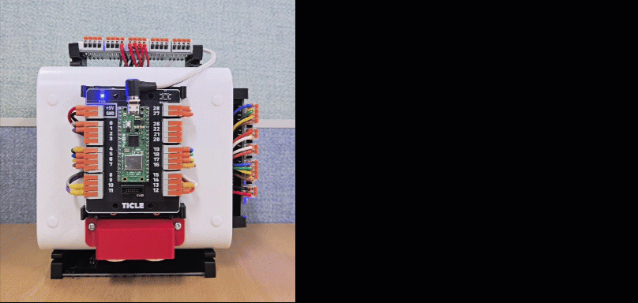</br>

> **한 걸음 더**
> 1. replx <PORT> setup 명령으로 현재 폴더를 MicroPython 작업 공간으로 설정했다면 .vscode 폴더가 존재한다. ls -a 명령으로 확인해 보자. replx status 명령을 실행해 에이전트가 관리 중인 foreground 포트를 확인하자. foreground 포트는 replx <PORT> <명령>에서 <PORT>를 생략할 수 있게 한다. replx shutdown 명령으로 에이전트를 종료해 보자. 이후 replx ls -r 명령으로 현재 Core 보드에 저장된 모든 파일 목록을 확인한다.
> 2. replx put hello.py / 명령으로 hello.py를 Core 보드의 루트(/)경로에 업로드한 후 replx cat -n 명령으로 Core 보드에 위치한 hello.py 내용을 확인하자. replx -d 명령으로 Core 보드에 위치한 hello.py를 실행한 후 replx rm 명령으로 삭제하자.
> 3. Core 보드가 패닉 상태일 때, 별도 전원 어댑터를 파워 보드에 연결한 상태라면 이를 제거한 후 USB 케이블을 분리해야 한다. 또한 윈도우 OS는 이런 상황에서 시리얼 포트를 다시 인식하는 데 약간의 시간이 더 걸리므로 통신이 재개될 때까지 좀 더 기다려야 한다.

---
</br>

## 정리

이 장에서는 TiCLE Lite의 하드웨어 구성과 MicroPython 개발 환경을 처음부터 끝까지 갖추었다. TiCLE Lite가 Core, Power, Basic, Pixel Display 4개의 보드와 초음파 센서, 서보 모터, 스피커 등 주변 장치로 이루어지며, 각 보드가 서로 다른 역할을 맡아 하나의 시스템으로 동작한다는 점을 확인하였다. 이어서 VSCode와 replx를 설치하고, scan·setup·init 명령으로 Core 보드를 초기화한 뒤, 전원선과 신호선을 순서대로 연결하며 각 주변 장치를 하나씩 테스트하고 최종 조립까지 마쳤다.

마지막으로 hello.py와 pixel_effect.py를 직접 실행해 첫 프로그램의 결과를 확인하고, 파일 관리와 라이브러리 설치에 필요한 replx 핵심 명령, 그리고 Core 보드가 응답하지 않을 때의 복구 절차까지 살펴보았다. 이 장에서 갖춘 개발 환경과 replx 명령은 이후 모든 실습의 기반이 되므로, 다음 장으로 넘어가기 전에 아래 항목으로 내용을 다시 한번 점검해 보자.

### 스스로 점검하기

1. TiCLE Lite는 몇 개의 보드로 구성되며, 각 보드의 역할은 무엇인가?
2. 배선을 연결할 때 전원선을 신호선보다 먼저 연결해야 하는 이유는 무엇인가?
3. replx scan 명령과 replx setup 명령은 각각 어떤 역할을 하는가?
4. MicroPython 작업 공간(Workspace)을 설정해야 하는 이유는 무엇인가?
5. replx run hello.py 대신 replx hello.py처럼 run을 생략해도 실행되는 이유는 무엇인가?
6. Core 보드가 패닉 상태에 빠져 응답하지 않을 때, 어떤 순서로 복구를 시도해야 하는가?
