# 3. 기본 제어 —GPIO , ADC , PWM

## 개요

### 학습 목표

- machine 표준 라이브러리로 GPIO, ADC, PWM의 기본 원리를 이해하고 제어할 수 있다.
- TiCLE Lite 라이브러리(Button, Ain, SR04, Servo)와 Core 라이브러리(Pout)를 활용하여 더 정확하고 간결한 프로그램을 작성할 수 있다.
- 입력, 판단, 출력을 연결하여 간단한 피지컬컴퓨팅 문제를 스스로 해결할 수 있다.
- machine 방식과 TiCLE Lite 라이브러리 방식의 차이를 비교하고 상황에 맞게 선택할 수 있다.
 
### 이 장의 의미

피지컬 컴퓨팅은 센서가 입력받은 값을 바탕으로 구동 장치를 제어하거나 화면을 전환하는 활동이므로, 가장 먼저 학습해야 할 내용은 핀(Pin)을 통해 외부 장치와 신호를 주고받는 방법이다. 이에 따라 이 장에서는 피지컬 컴퓨팅의 기초가 되는 GPIO, ADC, PWM이라는 세 가지 핵심 인터페이스를 순서대로 다룬다.

각 인터페이스의 학습은 두 단계로 나누어 진행되는데, 먼저 MicroPython 표준 라이브러리인 machine을 활용하여 기본적인 구동 원리를 익힌 후, TiCLE Lite 라이브러리를 사용하여 동일한 기능을 더욱 정밀하고 풍부하게 구현해 본다. 이러한 단계별 구성을 통해 사용자는 기초 개념 확립과 실전 활용 능력 향상을 동시에 달성할 수 있다.

또한 이 장에서 다루는 핀 번호와 장치 연결 방식은 4장(I2C, SWI, I2S)을 비롯하여 이후에 전개될 프로젝트 장에서도 지속적으로 연계되어 활용된다.

### 라이브러리 구성

이 장에서 사용하는 라이브러리는 보드의 두 위치에 나뉘어 저장된다.

| 종류 | 경로 | 설명 |
| ---- | ---- | ---- |
| Core 계열 | /lib | MicroPython 위에서 동작하는 공통 유틸리티. Din, Ain, Pout 등 하드웨어 추상화 클래스 포함 |
| Device 계열 | /lib/ticle_lite | TiCLE Lite용 장치 드라이버. Button, SR04, Servo 등 포함 |

각 장에서 machine 예제로 원리를 익힌 후, 이 라이브러리의 클래스를 이용해 더 간결하고 안정적인 코드로 발전시키는 과정을 경험하게 된다.

두 계열 라이브러리의 특징을 비교하면 다음과 같다.

| 구분 | machine 표준 | TiCLE Lite 전용 라이브러리 |
| ---- | ------------ | -------------------------- |
| 목적 | 하드웨어 원리 이해 | 정확도, 편의성, 재미 향상 |
| 코드 복잡도 | 높음 (직접 계산 필요) | 낮음 (메서드로 추상화) |
| 디바운스/필터 | 직접 구현 | 내장 |
| 측정 정밀도 | 보통 | 높음 (칼만 필터 등 적용) |

### 실습 전 준비

실습을 시작하기 전에 파워 보드와  Basic 보드의 전원을 먼저 연결해야 하는데, 이때 파워 보드의 5V와 GND를  Basic 보드의 5V와 GND에 각각 일치하도록 연결하며 반드시 5V 전원을 사용해야 한다. 만약 전원 연결이 불안정하면 센서 측정값이 흔들리거나 장치가 정상적으로 동작하지 않을 수 있으므로 주의가 필요하다.

이 장의 일부 예제는 TiCLE Lite 전용 라이브러리를 사용하므로, 1장 'Core 보드 초기 설정' 절의 'TiCLE Lite 라이브러리 다운로드'와 'Core 보드 초기화'가 선행되어야 하며 아래와 같은 import 문이 오류 없이 정상적으로 실행되는지 미리 확인해야 한다.

```python
from ticle_lite.button import Button
from ticle_lite.ain import Ain
from ticle_lite.servo import Servo
from pout import Pout
```

---

## GPIO

> **풀고 싶은 문제**  
> 프로그램이 제대로 동작하고 있는지 한눈에 확인하고 싶다면, 가장 단순한 답은 LED를 깜빡이는 것이다. 그다음 자연스러운 질문은 버튼을 눌렀을 때 보드가 이를 인식할 수 있는지이다. 이 장은 이 두 가지 질문에서 출발해 점점 다양한 장치로 확장한다.

GPIO(General Purpose Input Output)는 다양한 목적으로 사용할 수 있는 범용 입출력 핀으로, 버튼 상태 읽기나 LED 제어, 초음파 센서 신호 전송과 같은 가장 기본적인 제어는 대부분 이 GPIO에서 시작된다.

GPIO 신호는 전기가 흐르는 상태를 논리 1, 흐르지 않는 상태를 논리 0으로 표현하는 두 가지 상태만 가지며, 이 두 가지 값을 통해 켜짐과 꺼짐 또는 눌림과 떨어짐과 같이 명확하게 구분되는 상태를 처리한다.

### MicroPython에서 GPIO 제어

MicroPython에서는 machine.Pin 클래스를 활용하여 GPIO를 제어하는데, 이때 제어하고자 하는 핀 번호와 신호의 방향을 함께 지정한다. 출력 장치에는 Pin.OUT을, 입력 장치에는 Pin.IN을 신호 방향으로 사용한다. 신호 방향을 설정한 후 출력 장치는 on(), off() 또는 value() 메서드로 출력 상태를 변경하고, 입력 장치는 value() 메서드를 통해 현재 입력되는 상태 값을 읽어온다.

```python
from machine import Pin

gp_out = Pin(10, Pin.OUT)
gp_in = Pin(11, Pin.IN)

gp_out.on()          # set pin to HIGH level
gp_out.off()         # set pin to LOW level
gp_out.value(1)      # set pin to HIGH level
gp_out.toggle()      # toggle pin

ret = gp_in.value()  # get value, 0 or 1
```

### LED 출력: 디지털 출력의 출발점

> **풀고 싶은 문제**  
> 보드가 살아 있다는 신호를 가장 단순하게 보여 주려면 어떻게 할까. LED 깜빡임은 모든 임베디드 프로그램의 Hello, World에 해당한다.

가장 먼저 살펴볼 예제는 Core 보드의 내장 LED 제어이다. LED는 실행 결과가 눈에 바로 보이므로, 프로그램이 정상적으로 동작하는지 확인하기에 가장 적합한 장치이다. 실행을 강제 종료할 때는 Ctrl+C를 누른다.

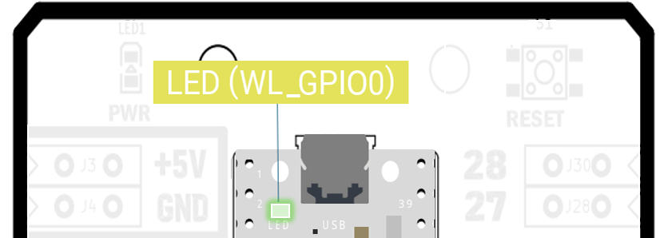</br>

```python
# led_basic.py - Built-in LED blink example
from machine import Pin
import time

# Prepare the built-in LED on the core board in output mode.
led = Pin("LED", Pin.OUT)

while True:
    led.on()           # Turn LED on
    time.sleep_ms(500)
    led.off()          # Turn LED off
    time.sleep_ms(500)
```

**코드 해설**

Pin("LED", Pin.OUT)은 이름이 LED(MicroPython 표준 이름)인 핀을 출력 모드로 사용하겠다는 뜻이다. 출력 모드는 프로그램이 직접 0 또는 1을 내보내는 방식이므로 LED, 릴레이, 버저처럼 무언가를 움직이거나 켜는 장치에 사용한다. led.on()은 1을 출력하는 것과 같고, led.off()는 0을 출력하는 것과 같다.

예제는 무한 반복문 안에서 0.5초(500밀리초) 간격으로 LED를 켜고 끈다. 이 구조는 단순하지만 매우 중요하다. 이후 장의 거의 모든 제어 프로그램은 장치 준비 -> 반복 실행 -> 상태 변경이라는 세 단계 흐름으로 작성되기 때문이다.

while 조건: 은 조건이 참인 동안 들여쓰기된 줄을 반복 실행한다는 뜻이다. True는 항상 참이므로, while True:는 Ctrl+C로 멈출 때까지 영원히 반복한다는 의미이다. 피지컬컴퓨팅 프로그램은 거의 모두 이 무한 루프 안에서 센서를 읽고 출력을 갱신한다.

time.sleep_ms(500) 은 0.5초 동안 프로그램을 정지시킨다. 단위가 ms(밀리초, 1초 = 1000ms)이며, 더 짧게 멈추려면 time.sleep_us()(마이크로초)를 쓴다. CPU에는 시간 감각이 없으므로, 사람이 변화를 인식할 수 있는 속도로 늦춰 주는 일은 우리가 직접 해야 한다.

**실행 결과와 확인할 점**

프로그램을 실행하면 LED가 일정한 간격으로 깜빡여야 한다. LED가 계속 켜져 있거나 전혀 켜지지 않는다면, 코드가 저장되지 않았거나 보드 연결 상태가 바르지 않을 가능성이 크다. 또한 sleep_ms()의 숫자를 바꾸면 점멸 속도가 달라지는데, 이 경험은 나중에 센서 주기나 애니메이션 속도를 조절할 때 그대로 연결된다. 

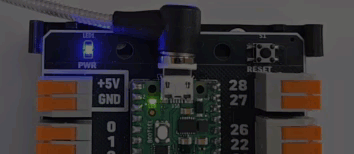</br>

> **한 걸음 더**  
> sleep_ms(500)을 50으로, 다시 2000으로 바꾸어 깜빡임이 어떻게 달라지는지 관찰해 본다. 그다음 두 줄의 sleep을 서로 다르게(예: 켜짐 100ms, 꺼짐 900ms) 설정하면 심장 박동 같은 효과가 난다. 이처럼 같은 코드 구조에서 숫자만 바꿔 의미가 달라지는 경험은 매개변수 사고의 출발점이다.

### 버튼 입력: 디지털 입력 읽기

> **풀고 싶은 문제**  
> 보드가 사람의 의사를 알아차리려면 어떻게 해야 할까. 키보드도 마우스도 없는 임베디드 보드에서 가장 간단한 입력 수단이 바로 스위치이다. 4방향 버튼을 읽어 어느 방향이 눌렸는지를 화면에 그대로 표시해 본다.

이번에는 사용자의 입력을 읽어 본다. 스위치는 LED와 반대로 프로그램이 외부 장치의 상태를 받아들이는 대표적인 입력 장치이다. 버튼이 눌렸는지 아닌지를 0과 1로 읽을 수 있기 때문에 GPIO 입력 실습에 적합하다.

1장에서 연결한  Basic 보드의 방향 버튼 핀 번호는 다음과 같다.

| Peripheral | Pin number |
| ---------- | ---------- |
| UP | 16 |
| LEFT | 17 |
| DOWN | 18 |
| RIGHT | 19 |

```python
# button_read.py
from machine import Pin
import time

up = Pin(16, Pin.IN)
left = Pin(17, Pin.IN)
down = Pin(18, Pin.IN)
right = Pin(19, Pin.IN)

while True:
    up_val = up.value()
    left_val = left.value()
    down_val = down.value()
    right_val = right.value()
    
    print(f"UP={up_val}, LEFT={left_val}, DOWN={down_val}, RIGHT={right_val}")
    
    time.sleep_ms(200)
```

**코드 해설**

이번에는 Pin.IN을 사용했다. 입력 모드에서는 핀의 전압 상태를 읽어 들이며, value() 메서드가 그 결과를 0 또는 1로 반환한다. 네 개의 스위치를 각각 다른 변수로 준비한 이유는, 어느 버튼이 눌렸는지 따로 확인하기 위해서이다.

이 예제는 0.2초(200밀리초)마다 현재 상태를 한 줄로 출력한다. 버튼을 누르는 동안 값이 변하는지 관찰하면 입력 장치가 어떻게 프로그램으로 전달되는지 알 수 있다. 버튼을 오래 누르지 않아도 값이 금방 바뀌어야 하므로, 입력 장치는 출력 장치보다 더 빠른 반응이 중요하다.

f"UP={up.value()}"처럼 문자열 앞에 f를 붙이면, 중괄호 {} 안에 변수나 식을 넣어 자동으로 문자열에 끼워 넣을 수 있다. 숫자 형식도 지정할 수 있는데, f"{x:.2f}"는 소수점 2자리, f"{x:5d}"는 5자리 폭의 정수 출력이다. 이 책의 거의 모든 print에 f-string이 등장한다.

**실행 결과와 확인할 점**

UP/LEFT/DOWN/RIGHT 버튼을 누르기 전과 후의 숫자가 달라지는지 확인한다. 만약 여러 값이 빠르게 바뀌거나 눌렀을 때 값이 흔들린다면, 버튼 접점이 짧은 시간 동안 여러 번 붙었다 떨어지는 현상 때문일 수 있다. 이런 문제를 줄여 주는 기능이 다음 절에서 다룰 TiCLE Lite Button 클래스의 장점이다.

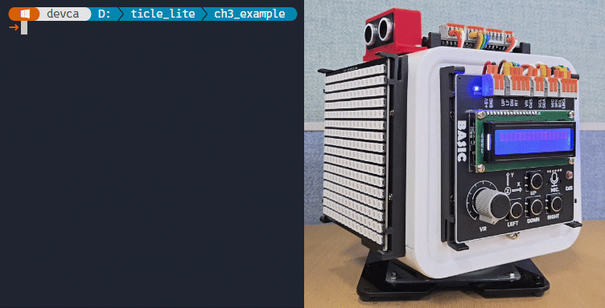</br>


### 버튼으로 LED 켜기: 입력과 출력의 첫 결합

> **풀고 싶은 문제**  
> 버튼을 누르고 있는 동안만 LED가 켜지게 하려면 어떻게 해야 할까. 출력만으로도 입력만으로도 풀 수 없고, 입력값을 읽어 출력에 반영해야 풀린다. 이것이 모든 피지컬컴퓨팅의 가장 작은 완성 패턴이다.

```python
# button_led.py
from machine import Pin
import time

led = Pin("LED", Pin.OUT)  # Onboard LED 
up  = Pin(18, Pin.IN)      # GP18: DOWN button

while True:
    if up.value() == 1:
        led.on()
        print("LED ON")
    else:
        led.off()
        print("LED OFF")
    time.sleep_ms(20)
```

**코드 해설**

이 짧은 코드 안에는 피지컬컴퓨팅의 세 단계가 모두 들어 있다. 입력 읽기(up.value()), 판단(if ... else), 출력 반영(led.on()/off())이 그것이다. 이후 모든 예제는 결국 이 세 단계의 조합이다. 센서 종류만 바뀌고, 판단 조건이 복잡해지고, 출력 장치가 다양해질 뿐이다.

time.sleep_ms(20)을 두는 이유는 두 가지다. 첫째, 사람이 버튼을 누르는 속도(보통 50ms 이상)에 비해 CPU가 너무 빨라서 같은 입력을 수만 번 반복해 읽는 낭비를 줄이기 위해서다. 둘째, 다른 장치도 함께 다룰 때를 위해 약간의 여유를 주는 것이다.

**실행 결과와 확인할 점**

DOWN 버튼(18번 핀)을 누르고 있으면 LED가 켜지고, 떼면 꺼진다. 다음과 같이 확장해 보면 사고가 한 단계씩 자란다.

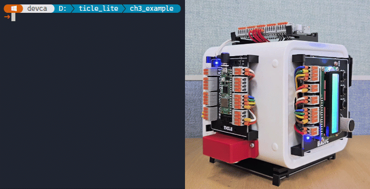</br>

> **한 걸음 더**  
> 1. UP을 누르면 켜고, DOWN을 누르면 끄는 토글식 스위치로 바꿔 본다(led.value()로 현재 상태 읽기).
> 2. 4개 버튼 중 하나라도 눌리면 LED가 켜지도록 or 조건으로 묶어 본다.
> 3. 버튼을 한 번 눌렀다 뗄 때마다 LED 상태가 바뀌는 진짜 토글을 만들어 본다. 
>    - 상태 변수가 필요한데, 다음 절 Button 클래스를 사용하면 간단하게 구현할 수 있다.

### Button 클래스로 이벤트 세분화

> **이 예제로 풀 문제**  
> 버튼을 누르고 떼는 물리적 입력 동작을 복잡한 상태머신 구현 없이 단일 클릭, 길게 누름(Long Press), 더블클릭 등과 같은 다양한 패턴으로 세분화할 수 없을까?

MicroPython 표준 machine.Pin 클래스를 사용하여 버튼의 상태를 직접 읽어 들이면 단순히 0과 1이라는 디지털 전압 수치만을 얻을 수 있지만, 실제 제어 환경에서는 버튼이 눌리는 순간과 떨어지는 순간, 또는 길게 눌렸거나 연속으로 눌렸는지와 같은 구체적인 하드웨어 사건(Event)을 정밀하게 구분해야 하는 경우가 많다.

TiCLE Lite 라이브러리의 Button 클래스는 이러한 로우 레벨(Low-level) 단계의 복잡한 타이밍 연산을 내장 상태 머신을 통해 자동화함으로써, 사용자의 입력 동작을 누름(Press), 뗌(Release), 단일 클릭(Click), 길게 누름(Long Press), 더블클릭(Double Click)의 다섯 가지 고수준 사건으로 정교하게 분류하여 반환한다. 또한 버튼 내부의 금속 접점이 물리적으로 부딪힐 때 발생하는 미세한 전기적 신호 흔들림 현상인 디바운스(Debounce) 처리를 소프트웨어 내부에서 자동으로 수행하므로, 개발자는 변수 관리의 번거로움 없이 오작동 없는 깔끔한 이벤트 기반 제어 프로그램을 구현할 수 있다.

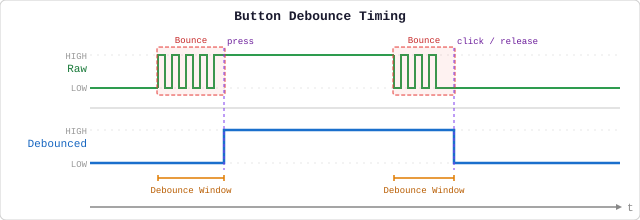</br>

Button 클래스는 사용자의 하드웨어 제어 환경에 맞추어 두 가지 독립적인 방식으로 활용할 수 있는데, 본 장에서는 동작 원리를 직관적으로 이해하기 쉬운 update() 메서드 중심의 폴링(Polling) 방식을 우선적으로 사용하여 실습을 진행한다. 이후 5장의 고급 제어 과정에서는 on_press와 같은 이벤트 구동형 콜백(Callback) 함수와 start() 메서드를 연계함으로써, 인터럽트 요청(IRQ, Interrupt Request) 기반으로 버튼의 입력을 하드웨어 수준에서 더욱 신속하고 정밀하게 처리하는 비동기식 제어 기법을 심도 있게 다룰 예정이다.

```python
# button_event.py
import time
from ticle_lite.button import Button

btn = Button([16, 17, 18, 19])     # UP, LEFT, DOWN, RIGHT buttons

try:
    while True:
        events = btn.update()      # Check for button events
        for idx, event in events:  
            # idx: button index (0=UP, 1=LEFT, 2=DOWN, 3=RIGHT)
            # event: "press", "release", "click", "long_press", "double_click"
            names = ["UP", "LEFT", "DOWN", "RIGHT"]
            print(f"{names[idx]}: {event}")
        time.sleep_ms(10)
finally:
    btn.deinit()
```

**코드 해설**

Button([16, 17, 18, 19])는 네 개의 핀을 하나의 버튼 인스턴스로 묶는다. update()를 호출하면 이번 주기에 발생한 이벤트 목록을 (핀 인덱스, 이벤트 이름) 쌍의 리스트로 반환한다. 아무 이벤트도 없으면 빈 리스트가 반환된다.

machine.Pin 방식에서는 상태값이 0 또는 1이었지만, Button 클래스에서는 press, click, long_press처럼 의미 있는 이름으로 받는다. 이렇게 하면 어떤 조건에서 어떤 동작을 해야 하는지가 코드만으로도 명확하게 드러난다.

Button.update()가 반환하는 이벤트 목록은 내부에서 재사용된다. 위 예제처럼 바로 for 문으로 처리하면 가장 효율적이다. 이벤트 목록을 나중에 비교하거나 저장해야 한다면 events.copy()처럼 복사본을 만들어 두어야 다음 update() 호출에 의해 내용이 바뀌지 않는다.

**실행 결과와 확인할 점**

버튼을 짧게 누르면 press와 click이 순서대로 출력된다. 길게 누르면 long_press가 추가로 출력된다. machine.Pin 예제와 달리 흔들림 없이 깔끔한 이벤트만 출력되는지 비교해 보면 두 방식의 차이를 직접 체감할 수 있다.

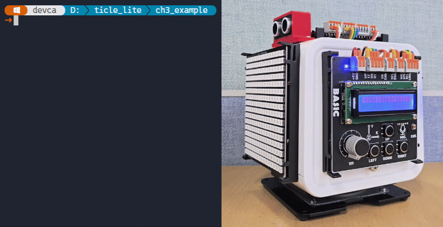</br>

> **한 걸음 더**  
> 1. UP을 더블클릭하면 시작, LEFT를 길게 누르면 리셋을 출력하도록 if/elif를 추가해 보자. 
> 2. update(Button.PRESS)로 변경해 버튼 누름만 감지하도록 수정해 보자. 단, 이때 반환값은 idx 리스트이다.

### 두 개의 GPIO로 초음파 센서 거리 측정하기

> **풀고 싶은 문제**  
> 자동차가 후진할 때 다가오는 장애물을 알려 주는 후방 센서는 어떻게 거리를 잴까. 소리는 공기 중에서 1ms에 약 34cm를 이동하는데, 이 속도를 알고 있으면 소리를 쏘아 다시 돌아올 때까지 걸린 시간을 알 수만 있다면 거리를 역으로 계산할 수 있다.

초음파 센서는 사람이 들을 수 없는 높은 주파수의 음파를 발사한 후, 이 음파가 장애물에 부딪혀 반사되어 돌아오는 시간을 측정하여 거리를 계산하는 장치이다. 센서의 트리거(Trigger) 핀에 신호를 주면 초음파가 발생하고, 물체에 반사되어 돌아온 초음파를 에코(Echo) 핀으로 감지하여 그 시간차를 바탕으로 거리를 산출하게 된다.

따라서 초음파 센서를 GPIO로 제어할 때는 하나의 핀으로 신호를 보낸 후 다른 하나의 핀으로 되돌아오는 시간을 측정하게 된다. 즉, 겉보기에는 단순히 0과 1의 디지털 신호만 읽는 것처럼 보이지만 실제로는 정밀한 시간 측정을 결합하여 거리를 계산하므로, 이 예제는 GPIO가 단순한 버튼 입력 확인을 넘어 훨씬 다양하고 복합적인 제어에 활용될 수 있음을 잘 보여 준다.

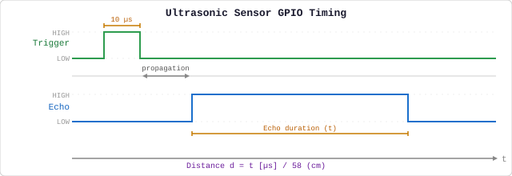</br>

초음파 센서 핀 연결은 다음과 같다. 

| Connection pin | Pin number |
| -------------- | ---------- |
| Trigger | 12 |
| Echo | 13 |

다음 예제는 Trigger(출력) 핀을 통해 초음파 센서에 초음파 방사 시점을 알리고, Echo(입력) 핀이 1을 유지하는 시간을 계산해 거리를 추정한다.

```python
# ultra_distance.py
from machine import Pin, time_pulse_us
import time

trig = Pin(12, Pin.OUT)  # Trigger pin for ultrasonic sensor
echo = Pin(13, Pin.IN)   # Echo pin for ultrasonic sensor

while True:
    # Send a very short pulse to start measurement.
    trig.value(0)
    time.sleep_us(2)
    trig.value(1)
    time.sleep_us(10) # Send a 10us pulse to trigger the sensor
    trig.value(0)

    duration = time_pulse_us(echo, 1, 30_000) # max wait time for echo pin: 30ms
    if duration < 0:
        print("distance = timeout")
    else:
        distance_cm = duration * 0.0343 / 2  # Convert time to distance (cm)
        print(f"distance = {distance_cm:.1f} cm")

    time.sleep_ms(100) # minimum measurement interval for this sensor is 60ms
```

**코드 해설**

TRIG 핀은 출력 핀이고, ECHO 핀은 입력 핀이다. 프로그램은 TRIG에 아주 짧은 펄스(10마이크로초)를 보내고, 초음파가 물체에 반사되어 돌아오는 동안 ECHO가 로직-1로 유지되는 시간을 측정한다. time_pulse_us()는 이 시간을 마이크로초(us) 단위로 반환하는데, 세 번째 인자인 30_000은 센서가 신호를 기다리는 최대 대기 시간(Timeout)을 의미한다.

초음파는 목표물까지 왕복해야 하므로, 음속(343 m/s) 기준 1 cm를 왕복하는 데 약 58.3us가 소요된다.
- 음속 = $34,300 cm / 1,000,000 us = 0.0343 cm/us$
- 시간 = 거리 / 속력 = $1 cm / 0.0343 cm/us = 29.154 us$
- 왕복 = $29.154 us x 2 = 58.308 us$

따라서 현재 설정된 30_000(30ms)은 물리적으로 약 514 cm(5.1m) 전방까지 탐색하겠다는 뜻이며, 실제 초음파 센서의 유효 측정 한계치(400cm)를 안정적으로 모두 포함하면서 하드웨어 오동작을 방지하는 최적의 마진이다.

만약 좁은 공간에서 가동하는 로봇이어서 전방 2 m(200 cm)까지만 감지하면 충분하다면, 이 값을 200 * 58.3 = 11_660로 줄여서 설정할 수 있다. 이렇게 목표 유효거리에 맞추어 타임아웃을 줄여주면, 전방에 장애물이 없을 때 프로그램이 신호 수신을 위해 무한정 대기하는 블로킹(Blocking) 시간을 최소화하여 전체 시스템의 제어 주기와 반응 속도를 효율적으로 향상시킬 수 있다.

거리 계산식에서 0.0343은 소리가 공기 중에서 1마이크로초 동안 이동하는 거리(cm)이지만, 초음파는 센서에서 물체까지 갔다가 다시 돌아오기 때문에 왕복 거리이다. 따라서 실제 거리를 구하려면 2로 나누어야 한다.

**실행 결과와 확인할 점**

손이나 물체를 가까이 가져가면 숫자가 작아지고, 멀리 두면 숫자가 커져야 한다. 간혹 timeout이 출력될 수 있는데, 이는 측정 범위를 벗어났거나 초음파가 안정적으로 돌아오지 않았기 때문이다. 센서를 손으로 완전히 막거나 너무 먼 곳을 향하게 했을 때도 이런 현상이 나타난다.

초음파 센서는 레이저처럼 한 점으로 쏘지 않는다. 약 15도 반각의 원뿔 형태로 퍼져 나가며, 물체 표면에 부딪힌 소리가 센서 방향으로 충분히 되돌아와야만 거리를 측정할 수 있다. 물체가 원뿔 가장자리에 걸리거나, 표면이 비스듬히 기울어져 있거나, 소리를 흡수하는 재질이면 반사파가 약해져 timeout이 발생한다.

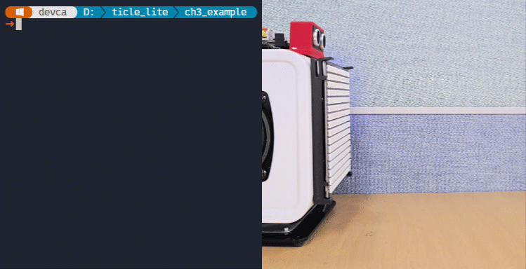</br>

> <details>
> <summary><b>알아두기 - 초음파 거리 측정 핵심 요소</b></summary>
>
> 초음파 센서를 활용한 거리 측정은 단순히 송수신 시간만을 계산하는 것처럼 보이지만, 실제 환경에서는 측정 대상(장애물)의 물리적 특성에 따라 큰 오차가 발생하거나 측정이 불가능해질 수 있으므로 이에 대한 특성을 정확히 이해하는 것이 중요하다. 초음파 거리 측정의 정확도에 영향을 미치는 세 가지 핵심 요소를 정리하면 다음과 같다.
> 
> 1. 장애물의 재질에 따른 초음파 흡수와 반사:
> 초음파는 음파의 일종이므로 매질의 밀도와 표면 상태에 따라 반사되는 양이 크게 달라진다. 금속, 벽돌, 유리, 플라스틱과 같이 표면이 딱딱하고 평평한 물체는 초음파를 대부분 반사하므로 매우 정확한 거리를 측정할 수 있다. 반면 천, 솜, 스펀지, 인형과 같이 표면이 부드럽고 다공성인 재질은 초음파를 반사하기보다 흡수해 버리기 때문에, 센서로 되돌아오는 에코 신호가 급격히 약해져 거리를 제대로 인식하지 못하거나 실제보다 훨씬 멀리 있는 것으로 오인하는 측정 오류가 발생한다.
>
> 2. 장애물의 크기와 센서의 개방각(지향각):
> 초음파 센서에서 발사되는 음파는 레이저처럼 직진하는 단일 선이 아니라, 센서 정면을 기준으로 일정한 부채꼴 모양을 그리며 퍼져나가는 성질을 가지는데 이를 개방각 또는 지향각이라고 한다. 만약 측정하려는 장애물의 크기가 이 개방각 내부를 충분히 채우지 못할 정도로 너무 작거나 가느다란 막대 형태라면, 초음파가 물체에 부딪혀 반사되는 양이 부족하여 센서가 신호를 놓치기 쉽다. 따라서 정확한 측정을 위해서는 센서의 탐지 거리와 개방각을 고려하여 측정 대상이 최소한 일정 면적 이상을 유지해야 한다.
>
> 3. 장애물의 반사 각도 (입사각과 반사각):
> 초음파 센서의 거리 측정 원리는 보낸 신호가 정면으로 되돌아온다는 가정을 전제로 하므로 물체의 표면 각도가 매우 결정적인 역할을 한다. 센서와 장애물의 표면이 서로 수직을 이루어 입사각이 0도에 가까울 때는 대부분의 음파가 센서 방향으로 곧바로 반사되어 최고의 정확도를 보여준다. 그러나 장애물이 기울어져 있어서 입사각과 반사각이 커지게 되면, 발사된 초음파가 센서로 돌아오지 않고 다른 방향으로 튕겨 나가 버리는 거울 반사(Specular Reflection) 현상이 일어난다. 이 경우 센서는 신호가 되돌아오지 않은 것으로 판단하여 장애물이 없는 것으로 인식하거나, 주변의 다른 물체에 부딪혀 멀리 돌아온 신호를 뒤늦게 감지하여 거리를 완전히 잘못 계산하게 된다.


### 초음파 측정 함수로 코드 정리하기

> **이 예제로 풀 문제**  
> 측정 로직이 메인 반복문과 뒤섞이면 코드가 길어질수록 읽기 어려워진다. 같은 기능을 어디서나 한 줄로 불러 쓰려면 어떻게 정리하면 좋을까.

앞의 machine 예제는 정확하게 동작하지만, 트리거 펄스 생성과 거리 계산 코드가 메인 반복문과 섞여 있다. 측정 로직을 함수로 분리하면 코드의 구조가 훨씬 명확해지며, 같은 로직을 여러 곳에서 재사용할 때도 편리하다. 이 추상화 방식은 이후 프로젝트에서 센서를 조합할 때 반복적으로 사용하는 패턴이다.

```python
# ultra_func.py
from machine import Pin, time_pulse_us
import time

trig = Pin(12, Pin.OUT)
echo = Pin(13, Pin.IN)

def read_distance_cm():
    trig.value(0)
    time.sleep_us(2)
    trig.value(1)
    time.sleep_us(10)
    trig.value(0)
    dt = time_pulse_us(echo, 1, 30_000)
    return None if dt < 0 else dt * 0.0343 / 2

try:
    while True:
        dist = read_distance_cm()
        if dist is None:
            print("distance = timeout")
        else:
            print(f"distance = {dist:.1f} cm")
        time.sleep_ms(100)
except KeyboardInterrupt:
    pass
```
**코드 해설**

read_distance_cm()은 측정에 필요한 세 단계(트리거 펄스, 에코 시간 측정, 거리 변환)를 하나의 함수 안에 담는다. 이렇게 하면 메인 반복문은 거리를 읽고 출력하는 의도만 남아 훨씬 읽기 쉬워진다. machine 예제와 동일한 로직이지만, 호출 방식이 단순해졌다는 점이 차이이다.

**실행 결과와 확인할 점**

본 예제는 이전 machine 실습과 동일한 출력 결과를 나타내지만, 구조적 측면에서 다음과 같이 개선되었다. 메인 루프를 최소화하여 코드의 직관성을 높였으며, 측정 로직을 함수화함으로써 향후 로직 변경 시 해당 함수의 내부만 수정하도록 모듈화했다. 한편, 실제 거리 측정값은 타깃 물체의 기하학적 형태뿐만 아니라 대기의 온도 변화 및 기류(바람)의 영향에 의해 오차가 발생할 수 있다. 테스트 과정에서 이러한 물리적 환경 변수를 감안하여 데이터를 검증해야 한다.

</br>

### SR04 클래스로 거리 측정하기

> **이 예제로 풀 문제**  
> 초음파 거리 측정 코드를 직접 작성하면 트리거 펄스 생성, 에코 대기, 거리 변환 세 단계를 빠짐없이 구현해야 한다. 클래스 하나를 가져와 거리를 곧바로 읽을 수 있다면 어떨까?

앞서 진행한 두 예제는 MicroPython 표준 machine.Pin과 machine.time_pulse_us를 활용하여 초음파 센서의 동작 원리를 직접 구현하는 데 초점을 맞추었으나, 이제는 동일한 역할을 TiCLE Lite 라이브러리의 SR04 클래스에 맡겨 효율성을 높여 본다.

SR04 클래스는 트리거 펄스의 생성부터 에코 신호의 시간 측정과 1차원 칼만 필터를 적용한 최종 거리 계산 과정을 내부적으로 자동 처리하므로 코드를 한층 더 간결하게 작성할 수 있다. 다만 SR04는 시중에 존재하는 수많은 초음파 센서 모델 중 특정 제품군을 가리키므로, 교재의 범용적인 이해를 돕기 위해 본문에서는 UltraSonic이라는 별칭을 부여하여 사용한다.

```python
# ultra_lib.py
import math
import time
from ticle_lite.us import SR04 as UltraSonic
from ticle_lite.button import Button

sonic = UltraSonic(trig=12, echo=13)  # GP12: TRIG, GP13: ECHO
bt = Button([16, 18])                 # GP16: UP, GP18: DOWN

try:
    print("Press UP to start measuring, DOWN to stop measuring")
    is_measuring = False
    while True:
        for idx in bt.update(Button.PRESS):
            if not is_measuring and idx == 0: # UP button
                is_measuring = True
                print("Measuring started") 
            elif is_measuring and idx == 1:   # DOWN button
                is_measuring = False
                print("Measuring stopped") 

        if is_measuring:
            # returns distance in meters, or NaN if timeout
            dist_m = sonic.read()
            if math.isnan(dist_m):
                print("distance = timeout")
                continue

            dist_cm = int(dist_m * 100)
            print(f"distance = {dist_cm} cm")
            time.sleep_ms(100)
finally:
    sonic.deinit()
    bt.deinit()
```

**코드 해설**

UltraSonic(trig=12, echo=13)는 트리거 12번, 에코 13번 핀으로 센서를 초기화하고, Button([16, 18])은 UP(16번)과 DOWN(18번) 두 버튼을 묶어 초기화한다. bt.update(Button.PRESS)는 버튼을 누르는 순간 발생하는 이벤트에 대해서만 버튼 번호(0은 UP, 1은 DOWN)를 반환하는데, UP을 누르면 is_measuring이 True로, DOWN을 누르면 False로 바뀐다.

UltraSonic에 내장된 1차원 칼만 필터는 물리 법칙 기반의 예측값과 센서의 측정값을 통계적으로 결합하여 최적의 실제 값을 실시간으로 추정하는 알고리즘이다. 이 필터는 예측 오차(Q)와 측정 오차(R)의 크기를 비교하여 산출된 가중치인 칼만 이득을 통해, 오차가 큰 정보는 배제하고 신뢰도가 높은 정보에 가중치를 두어 최종 상태를 보정한다. 기본값은 R=25, Q=4이며, 안정성을 높이려면 R을 키우거나 Q를 줄여 센서 노이즈를 억제하고, 실시간성을 높이려면 R을 줄이거나 Q를 키워 센서 변화를 빠르게 반영해야 한다.

- R 축소: 센서의 오차가 작다고 판단하여 센서 값을 더 강하게 신뢰
- Q 증가: 물리 모델의 예측(이전 데이터 기반)이 부정확하다고 판단하여 이전 데이터를 과감히 버림

is_measuring이 True일 때만 sonic.read()를 호출해 거리를 읽는다. read()는 미터 단위 실수를 반환하며, 에코 신호가 규정 시간 내에 도착하지 않으면 math.nan을 반환한다. math.isnan()으로 이를 구분해 timeout을 출력하고 continue로 다음 반복으로 넘어간다.

try/finally 구조는 Ctrl+C로 중단되더라도 finally 블록이 반드시 실행되도록 보장한다. sonic.deinit()은 센서 내부 타이머와 IRQ 자원을 해제하는 정리 작업이다.

> NaN(Not a Number) 은 IEEE 754 부동소수점 표준에서 정의된 특별한 값으로, 정의되지 않거나 표현할 수 없는 연산 결과를 의미한다. 0으로 나누기, 무한대끼리 뺄셈, 음수의 제곱근과 같은 부정(Indeterminate) 연산 시 발생하며, 시스템 에러를 즉각 일으키는 대신 계산 불능 상태를 값(NaN)으로 반환한다.
>
> NaN은 수학적 정의가 없으므로 자신과도 같지 않다고 판단한다. 따라서 math.isnan()과 같은 전용 함수를 이용해 유효한 숫자인지 검사해야 한다.

**실행 결과와 확인할 점**

프로그램이 시작되면 아무 출력 없이 대기한다. UP 버튼을 누르면 “Measuring started”가 한 번 출력되고, 100 ms 간격으로 거리값이 연속 출력되기 시작한다. DOWN 버튼을 누르면 “Measuring stopped”가 출력되고 거리 출력이 멈춘다. 손을 센서 앞에 가까이 가져가면 수치가 줄고, 멀리 치우면 늘어나는지 확인한다. 

측정 범위(약 2에서 200 cm) 밖에서는 timeout이 출력된다. 칼만 필터 덕분에 이전 예제보다 수치가 더 안정적으로 유지되는 것을 비교해 볼 수 있다. Ctrl+C를 누르면 finally 블록이 실행되어 센서 자원이 정리된 뒤 종료된다.

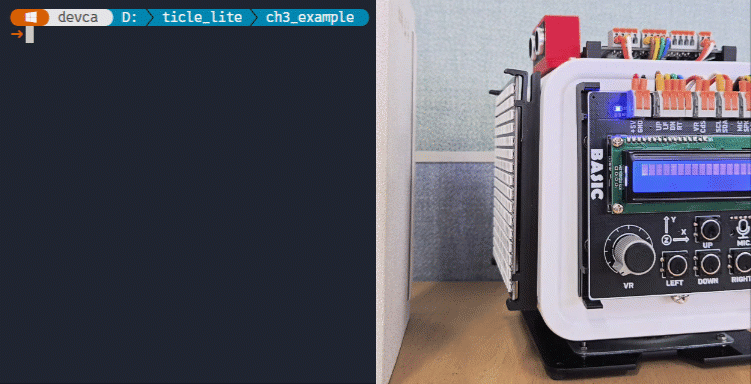</br>

---

## ADC

> **풀고 싶은 문제**  
> 스마트폰의 자동 밝기 조절은 주변이 얼마나 밝은지를 어떻게 파악할까. 켜지고 끄는 0/1 신호만으로는 매우 밝음, 다소 어두움 같은 정도의 차이를 표현할 수 없다. 이 장은 아날로그 신호를 숫자로 바꾸는 ADC를 이용해 조도 구역 분류와 다이얼 레벨이라는 두 가지 도메인 문제를 해결한다.

조도 센서나 가변 저항처럼 값이 연속적으로 변하는 아날로그 장치의 신호는 디지털 장치가 직접 인식할 수 없으므로, 아날로그 신호의 전압 크기를 디지털 숫자로 변환하는 ADC(Analog to Digital Converter) 과정을 거쳐야만 프로그램 내부에서 데이터를 가공하고 읽을 수 있다.

이때 ADC 변환의 정확성을 결정하는 핵심 기준이 바로 참조 전압(Reference Voltage, $V_{\text{ref}}$)인데, 이는 ADC가 측정할 수 있는 최대 전압의 한계점이자 변환의 절대적인 기준선 역할을 수행한다. 마이크로컨트롤러는 입력된 아날로그 전압이 이 참조 전압(예: 3.3V)의 몇 퍼센트($\%$)에 해당하는지를 비교하여 최종 디지털 값으로 정량화하므로, 안정적인 제어를 위해서는 흔들림 없는 정확한 참조 전압을 공급하는 것이 필수적이다.

또한 ADC의 정밀도는 전압의 측정 범위를 얼마나 세밀한 단계로 쪼갤 수 있는지를 뜻하는 해상도(Resolution)에 의해 결정되며, 이는 보통 비트(bit) 수로 나타낸다. 예를 들어 12비트 해상도를 가진 ADC는 참조 전압으로 설정된 전체 전압 범위를 최소 0부터 최대 4,095까지 총 4,096단계의 세밀한 디지털 수치로 나누어 읽는다는 의미이다. 이처럼 단 두 가지 상태(0과 1)만을 가지는 일반 디지털 입력과 달리, ADC 입력은 참조 전압을 기준으로 촘촘하게 분할된 연속적 단계별 값을 제공하므로 주변의 밝기 정도나 다이얼을 회전시킨 각도와 같은 미세한 물리적 변화를 정밀하게 표현하기에 매우 적합하다.

### MicroPython에서 ADC 읽기
Core 보드는 GP27부터 GP29까지 총 3개의 12비트 해상도 3.3V ADC 채널을 제공한다. MicroPython에서는 machine.ADC 클래스에 해당 핀 인스턴스를 인수로 전달하여 아날로그 입력 핀으로 초기화하며, 이후 read_u16() 메서드를 호출하여 물리적인 전압 값을 읽어온다. 이때 하드웨어 고유의 ADC 해상도는 12비트(0~4,095의 4,096단계)이지만, read_u16() 메서드는 이 값을 부호 없는 16비트 형태인 0~65,535 범위로 정규화하기 위해 상위 비트로 이동(4비트 왼쪽 시프트)시켜 반환하므로, 표면적인 숫자 범위는 넓어 보일지라도 실제 하드웨어가 구별할 수 있는 정밀도는 여전히 4,096단계이다.

```python
from machine import Pin, ADC

# Initialize one of GPIO 26, 27, 28 as analog input.
adc = ADC(Pin(27))

# Returns 0~65535 range, but actual resolution is 4096 steps.
value = adc.read_u16()

# Shift right by 4 bits to restore original 12-bit value (0~4095).
raw12 = value >> 4
```

### VR과 CdS 센서값 읽기

> **이 예제로 풀 문제**  
> ADC가 실제로 어떤 숫자를 돌려주는지 직접 확인하고 싶다. 다이얼을 돌리거나 빛을 가릴 때 값이 어떻게 달라지는지, 두 센서를 같은 화면에 나란히 보면 훨씬 빠르게 감을 잡을 수 있다.

Basic 보드에 내장된 가변 저항(Variable Resistor. 이하 VR)과 조도 센서(Cadmium Sulfide Photo Resistor. 이하 CdS)는 모두 아날로그 신호를 출력하므로 ADC 채널을 통해 그 데이터를 읽어온다.

VR은 사용자가 다이얼이나 레버를 조작하여 저항값을 임의로 조절할 수 있는 부품으로, 내부에는 반원 모양의 저항체와 그 위를 이동하는 회전 접점(Wiper)이 포함되어 있어 물리적인 회전 각도에 따라 저항의 크기가 변화한다. TiCLE Lite 보드에서는 사용자가 다이얼을 시계 방향으로 돌릴수록 전압이 상승하여 변환된 ADC 결괏값이 높아지도록 회로를 해석하고 제어한다.

CdS는 주변에 가해지는 빛의 세기에 따라 내부 저항값이 달라지는 감광성 반도체 소자이다. 이 센서는 광량의 변화에 반비례하여 주변이 밝으면 저항이 작아지고 어두우면 저항이 커지는 물리적 특성을 지니고 있는데, TiCLE Lite의 제어 회로에서는 변환된 ADC 원시 값(Raw Value)이 높을수록 주변이 밝은 상태를 나타내고 반대로 값이 낮을수록 어두운 상태를 나타내도록 해석한다. 

VR과 CdS의 핀 번호는 다음과 같다.

| Peripheral | Pin number |
| ---------- | ---------- |
| VR | 27 |
| CdS | 28 |

다음 예제는 두 아날로그 센서의 raw 값을 같은 화면에 나란히 출력해, ADC가 실제로 어떤 숫자를 반환하는지 직접 확인한다.

```python
# adc_read.py
from machine import Pin, ADC
import time

vr = ADC(Pin(27))   # GP27: VR 
cds = ADC(Pin(28))  # GP28: CdS

while True:
    # Returns 0~65535 range, but actual resolution is 4096 steps
    vr_raw_16 = vr.read_u16()
    cds_raw_16 = cds.read_u16()
    
     # Scale down to 0~4095 for easier thresholding
    vr_raw_12 = vr_raw_16 >> 4
    cds_raw_12 = cds_raw_16 >> 4
    print(f"VR ADC value: {vr_raw_12:4d}, CdS ADC value: {cds_raw_12:4d}")
    time.sleep_ms(50)  # Add a small delay to avoid flooding the output
```

**코드 해설**

ADC(Pin(27))은 GPIO 27번을 아날로그 입력으로 초기화해 VR 전압을 측정할 준비를 한다. ADC(Pin(28))은 CdS 쪽이다.

read_u16()은 측정값을 16비트 정수(0~65535)로 반환한다. Core 보드 ADC의 실제 해상도는 12비트이므로 의미 있는 단계는 4096개뿐이므로 >> 4로 4비트 오른쪽으로 이동하면 0~4095 범위로 되돌아온다. 이후 예제들은 이 12비트 값을 기준으로 구간을 나누거나 레벨을 계산한다.

f-스트링 출력의 :4d는 숫자를 네 자리 너비로 오른쪽 정렬하는 서식 지정자이다. 값이 3자리에서 4자리로 바뀌어도 콜론 위치가 흔들리지 않아 두 센서의 수치를 한 줄에서 비교하기 좋다.

**실행 결과와 확인할 점**

터미널에 VR ADC value: XXXX, CdS ADC value: XXXX 형식의 줄이 빠르게 흘러 내려간다. VR 다이얼을 왼쪽 끝까지 돌리면 VR 값이 0 근처, 오른쪽 끝으로 돌리면 4095 근처로 변한다. CdS를 손으로 가리면 값이 내려가고, 밝은 곳에 놓으면 올라가는지 확인한다. 두 센서를 동시에 조작하면 각 숫자가 서로 독립적으로 움직이는 것이 보인다.

</br>

> **한 걸음 더**  
> 반복이 너무 빠르면 숫자를 눈으로 따라가기 어렵다. time.sleep_ms(500)으로 변경한 후 출력 속도가 어떻게 달라지는지 확인하자.

### VR 보정과 경계값 저장하기

> **이 예제로 풀 문제**  
> VR 부품은 같은 모델이라도 다이얼 위치와 ADC 값의 관계가 대상마다 다르다. 이때, 단계별 ADC 값을 사전에  vr_thresholds.json에 저장해 두면, 이후 예제에서는 보정 없이 바로 레벨 표시를 시작할 수 있다.

VR 내부에는 전류 흐름을 방해하는 저항체 성분이 코팅되어 있는데, 대량 생산 과정에서 이 코팅을 완벽하게 균일하게 만드는 것은 불가능에 가깝다. 특히 탄소 VR의 제조 공차(Tolerance)는 $\pm 20%$ 수준으로 매우 큰 편이며, 비교적 정밀한 금속 피막형이나 권선형(Wire-wound)도 $\pm 5%$~$\pm 10%$에 이르는 오차를 가지므로 실제 회로를 설계하고 정밀하게 제어할 때는 반드시 별도의 보정(Calibration) 과정이 필요하다. 

Basic 보드에 내장된 VR 역시 다이얼의 회전 위치와 ADC 출력값이 완전히 정비례하는 선형적 대응을 보이지 않으며, 동일한 각도를 회전시키더라도 다이얼의 시작 위치나 부품 고유의 특성에 따라 입력값의 변화 폭이 달라진다. 따라서 전체 측정 범위를 단순히 수학적으로 균등하게 분할하여 경계값으로 삼으면, 다음과 같이 특정 구간은 제어 범위가 너무 좁아지고 다른 구간은 지나치게 넓어지는 불균형이 발생한다.

|Dial       | 1  | 2  | 3  | 4   | 5   | 6   | 7   | 8   | 9  |
|-----------|----|----|----|-----|-----|-----|-----|-----|----|
|ADC        |112 |545 |961 |1462 |1905 |2399 |2824 |3216 |3753|
|Difference |112 |433 |416 |501  |443  |494  |425  |392  |537 |

이러한 문제를 해결하기 위해 이번 예제에서는 레벨 1부터 레벨 9까지 각 단계의 최소 회전 위치에서 실제 ADC 입력값을 측정해 9개의 보정 경계값을 vr_thresholds.json 파일로 저장한다. 이렇게 저장한 파일을 활용하는 방법은 다음 절의 'VR 보정을 이용한 10 단계 다이얼'를 통해 알아본다. 

```python
# vr_calibrate.py
import json
from machine import Pin, ADC

vr = ADC(Pin(27))  # GP27: VR

SAVE_PATH = "vr_thresholds.json"

print("""--- VR Calibration ---
Align the dial to the minimum position of each level and press ENTER.
9 boundary raw values (0~4095) will be saved to vr_thresholds.json.
""")

thresholds = []
for lv in range(1, 10):
    input(f"  >> Align to Level {lv} minimum and press ENTER: ")
    raw = vr.read_u16() >> 4   # 12-bit raw value (0~4095)
    thresholds.append(raw)
    print(f"  -> raw = {raw:4d}  saved")

with open(SAVE_PATH, "w") as f:
    json.dump(thresholds, f)

print(f"\nSaved to {SAVE_PATH}")
print(f"thresholds: {thresholds}")
print("Run vr_level.py to use these thresholds.")
```

**코드 해설**

vr.read_u16() >> 4는 ADC 측정값을 12비트(0~4095) 범위로 줄인다. 이 값을 그대로 경계값으로 쓴다. 전압으로 변환하지 않는 이유는, 전압 계산에 쓰는 기준 전압(3.3V)이 부품과 보드 상태에 따라 조금씩 달라질 수 있어 오히려 오차가 생길 수 있기 때문이다. ADC raw 값을 직접 쓰면 변환 오차 없이 측정한 그대로를 기록할 수 있다.

레벨 1의 최소 위치란, 레벨 0과 레벨 1의 경계에 해당하는 다이얼 위치이다. 레벨 1 구간의 가장 낮은 지점에 다이얼을 맞추고 ENTER를 누르면, 그 시점의 raw 값이 첫 번째 경계값이 된다. 9개 레벨의 최소 위치를 차례로 기록하면 레벨 0~9를 구분하는 9개의 경계값이 완성된다.

json.dump(thresholds, f)는 파이썬 리스트를 JSON 텍스트로 변환해 파일에 쓴다. MicroPython의 json 모듈은 리스트와 딕셔너리를 직접 직렬화할 수 있으므로, 다음 실행 때 json.load()로 그대로 읽어 올 수 있다.

**실행 결과와 확인할 점**

레벨 1부터 9까지 순서대로 안내 문구가 나온다. 각 단계에서 다이얼을 해당 레벨의 가장 낮은 위치에 맞춘 뒤 Enter를 누르면 raw 값이 출력되고 다음 단계로 넘어간다. 9단계가 끝나면 보드의 저장소에 vr_thresholds.json이 생성된다. 측정된 raw 값이 단계가 올라갈수록 대체로 증가하는지 확인한다. 만약 어느 두 단계의 값이 역전되거나 거의 같다면, 그 구간의 다이얼 위치를 다시 맞추고 재실행한다.

</br>

> **한 걸음 더**  
> 1. 보정이 끝난 뒤 thresholds 목록을 보면 값 간격이 균등하지 않을 수 있다. 간격이 좁은 구간은 다이얼을 조금만 움직여도 레벨이 바뀌고, 간격이 넓은 구간은 많이 돌려야 바뀐다. 이것이 VR 부품의 실제 특성이며, 보정의 목적은 이 불균등함을 있는 그대로 기록해 두는 것이다.
> 2. 보드에 저장된 파일 내용을 replx cat vr_thresholds.json 명령으로 확인해 본다.

### VR 보정을 이용한 10 단계 다이얼

> **풀고 싶은 문제**  
> vr_calibrate.py로 저장한 경계값을 불러와 다이얼을 0부터 9까지 10단계 레벨 선택기처럼 표시하고 싶다. 경계 근처에서 값이 왔다 갔다하는 레벨 흔들림 문제도 함께 해결해야 한다.

앞에서 진행한 'VR 보정과 경계값 저장하기'를 통해 vr_thresholds.json이 보드에 저장되어 있으면 그 경계값을 사용하고, 없으면 기본 경계값으로 동작하도록 한다. 경계 근처에서 ADC 값이 조금씩 떨림으로 인해 레벨이 빠르게 왔다 갔다 하는 현상을 막기 위해 레벨을 올릴 때는 경계값보다 조금 더 높아야, 내릴 때는 경계값보다 조금 더 낮아야 전환을 허용하는 히스테리시스(Hysteresis)를 적용한다.

```python
# vr_level.py
import json
import time
from machine import Pin, ADC

vr = ADC(Pin(27))  # GP27: VR

SAVE_PATH   = "vr_thresholds.json"
# Default thresholds (raw 12-bit, 0~4095): used when vr_thresholds.json is absent.
# Derived from typical VR output; run vr_calibrate.py for accurate values.
DEFAULT_RAW =  [112, 545, 961, 1462, 1905, 2399, 2824, 3216, 3753]
HYSTERESIS  = 25   # raw units; prevents level flickering at boundaries

try:
    with open(SAVE_PATH) as f:
        thresholds = json.load(f)
    print(f"Loaded: {SAVE_PATH}")
except OSError:
    thresholds = DEFAULT_RAW
    print("vr_thresholds.json not found. Using default thresholds.")

prev = -1
while True:
    raw = vr.read_u16() >> 4   # 12-bit raw value (0~4095)
    candidate = sum(1 for t in thresholds if raw >= t)   # levels 0~9

    if prev == -1:
        prev = candidate   # first reading: accept immediately
    elif candidate > prev and raw >= thresholds[prev] + HYSTERESIS:
        prev = candidate   # advance only when clearly past boundary
    elif candidate < prev and raw < thresholds[prev - 1] - HYSTERESIS:
        prev = candidate   # retreat only when clearly below boundary

    bar = "█" * prev + "░" * (9 - prev)
    print(f"[{bar}] {prev:2d} / 9  (raw={raw:4d})")
    time.sleep_ms(50)
```

**코드 해설**

json.load(f)는 파일에서 JSON 텍스트를 읽어 파이썬 리스트로 되돌린다. OSError는 파일이 없거나 열 수 없을 때 발생하는 예외이다. except OSError 블록에서 DEFAULT_RAW로 대체하면 vr_calibrate.py를 먼저 실행하지 않아도 일단 동작한다.

candidate = sum(1 for t in thresholds if raw >= t)는 현재 raw 값이 경계값 목록에서 몇 개 이상인지 세어 목표 레벨을 구한다. 전압 변환 없이 raw 값을 직접 비교하므로 계산 단계가 하나 줄어든다.

히스테리시스는 candidate가 prev와 다를 때만 작동한다. 레벨을 올리려면(candidate > prev) raw가 현재 경계값 thresholds[prev]보다 HYSTERESIS만큼 더 높아야 한다. 반대로 레벨을 내리려면(candidate < prev) raw가 직전 경계값 thresholds[prev - 1]보다 HYSTERESIS만큼 더 낮아야 한다. 경계 바로 위아래에서 ADC 값이 떨려도 이 조건을 동시에 만족할 수 없으므로 레벨이 바뀌지 않는다. HYSTERESIS = 25는 3.3V 기준으로 약 0.02V에 해당하며, 대부분의 환경에서 충분하다.

sum(1 for t in thresholds if raw >= t)는 제너레이터 표현식이다. thresholds 목록을 하나씩 확인하면서 조건을 만족하는 항목마다 1을 더한다. 다음 코드와 완전히 같은 결과를 낸다.

```python
candidate = 0
for t in thresholds:
    if raw >= t:
        candidate += 1
```

**실행 결과와 확인할 점**

프로그램을 시작하면 먼저 thresholds 출처가 한 줄 출력된다. 이어서 50 ms 간격으로 블록 막대와 레벨 숫자가 출력된다. 다이얼을 천천히 돌리면 레벨이 0에서 9까지 단계적으로 바뀌고, 같은 위치에 고정하면 출력이 멈춘다. 경계 근처에서 다이얼을 미세하게 흔들어도 레벨이 흔들리지 않는지 확인한다. 흔들린다면 HYSTERESIS 값을 30~40으로 늘린다. vr_calibrate.py 없이 기본 경계값으로 실행했을 때와 보정 후 실행했을 때 단계 전환 지점이 달라지는지 비교해 보면 보정의 효과가 체감된다.

</br>

> **한 걸음 더**  
> 경계값 개수를 4개로 줄이면 5단계 조명 버튼, 19개로 늘리면 20단계 세밀 볼륨이 된다. DEFAULT_RAW의 원소 수를 바꾸면 나머지 코드는 그대로이면서 단계 수가 달라지는 것을 확인한다.


### CdS 센서로 주변 밝기 판단

> **이 예제로 풀 문제**  
> 스마트 홈 조명이 주변의 밝기를 자동으로 감지하고 단계별로 대응하려면 어떻게 해야 할까? 센서 값을 직접 읽기만 해서는 '밝다', '어둡다'라는 정성적 판단을 할 수 없고, 경계값으로 범위를 나누어 해석해야 한다. 이 예제는 ADC 값을 5개 조도 구역으로 매핑하고, 구역 변화만 출력해 사용자가 현재 환경을 한눈에 파악하게 한다.

이 예제는 raw 값의 범위를 5개 구역(매우 어두움, 어두움, 보통, 밝음, 매우 밝음)으로 나누고, 센서값이 한 구역에서 다른 구역으로 넘어갈 때만 새로운 상태를 출력한다. 같은 구역 안에서의 미세한 변화는 무시함으로써 조명 변화가 잦은 환경에서도 깨끗한 출력을 유지한다. 경계값은 CdS 부품 개체차와 조명 환경에 따라 달라지므로, 각자의 환경에 맞게 조정해야 한다.

```python
# cds_zone.py
from machine import Pin, ADC
import time

cds = ADC(Pin(28))  # CDS sensor to GPIO28 (ADC1)

# Zone thresholds (0~4095). May vary by environment;
# cover the sensor by hand first to see how the raw value changes before adjusting.
zones = [
    ( 800, "Very dark (completely covered)"),
    (1800, "Dark (dark room)"),
    (2800, "Moderate (indoor lighting)"),
    (3600, "Bright (by the window, cloudy day)"),
    (4096, "Very bright (direct sunlight , flashlight)"),
]

prev = -1
while True:
    raw = cds.read_u16() >> 4  # Scale down to 0~255 for easier thresholding
    for i, (thresh, label) in enumerate(zones):
        if raw < thresh:
            if i != prev:
                print(f"{raw:4d}  ->  {label}")
                prev = i
            break
    time.sleep_ms(100)
```

**코드 해설**

zones는 (경계값, 이름) 쌍의 목록이며, raw 값을 비교해 해당하는 구역을 찾는다. if raw < thresh 조건으로 raw 값이 경계값보다 작은 첫 구역을 찾으면 break로 루프를 빠져나간다.

경계값은 CdS 부품 개체차와 조명 환경에 따라 크게 달라진다. 사용 환경에 맞게 조정하려면 먼저 print(cds.read_u16() >> 4)를 실행해 각 조명 환경에서 raw 값(0~4095)을 확인한 뒤, zones의 숫자를 수정한다.

if i != prev 조건은 같은 구역에 머물러 있을 때 반복 출력을 막는다. 이로써 경계값 근처에서 ADC 값이 미세하게 떨려도 레벨 전환이 없으면 출력이 나지 않는다.

**실행 결과와 확인할 점**

손이나 종이로 CdS를 가리거나 빛을 비추면 zones에 설정된 경계값에 따라 구역 이름이 바뀐다. 구역이 바뀔 때마다 새 이름과 raw 값이 출력되고, 같은 구역 안에서 움직이면 화면이 멈춘다. raw 값이 경계값 근처에 있으면 센서 떨림 때문에 같은 구역을 빠르게 왔다 갔다 할 수 있다. 그럴 때는 zones의 경계값을 조정하거나 인접한 두 경계값 사이 간격을 더 넓힌다.

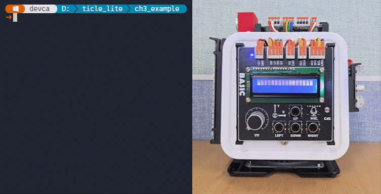</br>

> **한 걸음 더**  
> zones에 항목을 하나 추가해 6개 구역으로 나누고, 구역 이름을 내 손으로 지은 표현(예: "동굴 수준")으로 바꾸어 보자. 그다음 코드를 건드리지 않고도 자동으로 구역 수가 늘어나는지 확인한다(zones 리스트만 고치면 되는 구조가 재사용 설계의 핵심이다).


### Ain 클래스로 퍼센트와 전압값 읽기

> **이 예제로 풀 문제**  
> VR과 CdS를 동시에 관찰할 때, raw 숫자만 보면 값의 의미를 바로 파악하기 어렵다. 같은 센서값을 퍼센트와 전압으로 함께 표시하면 해석이 얼마나 쉬워질까?

MicroPython 표준 machine.ADC 클래스의 read_u16() 메서드는 0부터 65,535 범위의 정수만을 반환하므로 데이터 자체는 정확하지만, 현재 센서의 측정값이 전체 범위 중 어느 정도 위치에 해당하는지 직관적으로 파악하기 어렵다는 한계가 있다. 반면 TiCLE Lite 라이브러리의 Ain 클래스는 bits=12 매개변수를 통해 동일한 아날로그 입력을 12비트 해상도 기준 백분율(%)과 실제 전압(V) 값으로 자동 변환하므로 센서의 상태를 해석하고 가공하는 데 필요한 복잡한 연산 과정을 크게 줄여준다.

아래의 실습 예제에서는 VR(27번 핀)과 CdS(28번 핀)의 ADC 데이터를 읽은 후, 왼쪽 그래프에는 백분율(%)을, 오른쪽 그래프에는 전압값(V)을 실시간으로 표시한다. 단, 단위만 다를 뿐 형태는 같으므로 양쪽 그래프는 동일하게 보인다.

```python
# ain_read.py
import time
from ticle_lite.ain import Ain
from termviz import Canvas, Plot, Scope

ain = Ain([27, 28], bits=12)  # GP27: VR, GP28: CdS, 12-bit ADC

cv = Canvas(60, 30)
plt_pct = Plot(cv, region_px=(2, 2, 56, 54))
plt_vol = Plot(cv, region_px=(62, 2, 56, 54))

scope_pct = Scope(plt_pct, vmin=0, vmax=100)
scope_vol = Scope(plt_vol, vmin=0, vmax=3.3)

try:
    while True:
        vr_pct  = ain[0].read_percent()  # VR percentage
        cds_pct = ain[1].read_percent()  # CdS percentage
        scope_pct.tick([vr_pct, cds_pct], names=["vr", "cds"], info_text="Percent(%)")
        
        vr_v    = ain[0].read_voltage()  # VR voltage
        cds_v   = ain[1].read_voltage()  # CdS voltage
        diff_v  = abs(vr_v - cds_v)        
        scope_vol.tick([vr_v, cds_v, diff_v], names=["vr", "cds", "diff"], info_text="Voltage(V)")
        time.sleep_ms(50)
finally:
    ain.deinit()
    cv.end()
```

**코드 해설**

Core 보드의 ADC는 12bit이므로 Ain([27, 28], bits=12)은 27번과 28번 핀에 연결된 VR과 CdS를 12비트 해상도로 묶어 관리한다. 채널 0은 VR, 채널 1은 CdS로 사용한다.

Ain이 2개 이상의 ADC 핀을 관리할 때는 배열처럼 접근할 수 있다. ain[0].read_percent()와 ain[0].read_voltage()는 VR에 대한 백분율과 전압을, ain[1].read_percent()와 ain[1].read_voltage()는 CdS에 대한 백분율과 전압을 반환한다.

Canvas(60, 30) 위에 Plot 두 개를 배치해 퍼센트 그래프와 전압 그래프를 동시에 그리고, scope_pct.tick()과 scope_vol.tick()는 각각 같은 시점의 센서값을 받아 화면을 갱신한다. 한 주기에서 4개 값을 모두 읽은 뒤 두 그래프를 같이 업데이트하기 때문에, 같은 순간의 값 변화를 좌우 화면에서 비교할 수 있다.

time.sleep_ms(50)은 갱신 주기이며, finally 블록의 ain.deinit(), cv.end()는 Ctrl+C로 종료하더라도 ADC와 터미널 캔버스 자원을 정리해 다음 실습에 영향을 남기지 않는다.

**실행 결과와 확인할 점**

실행하면 화면 왼쪽에는 Percent(%), 오른쪽에는 Voltage(V) 그래프가 동시에 갱신된다. VR 다이얼을 천천히 돌릴 때 두 그래프의 vr 곡선이 같은 방향으로 움직이는지 확인한다. 값의 단위만 다를 뿐 같은 센서 변화가 동기화되어 나타나므로 왼쪽과 오른쪽 그래프는 일치해야 한다.

CdS를 손으로 가리거나 플래시를 비추면 cds 곡선이 즉시 반응한다. 실내 조명 깜빡임이나 손떨림 때문에 미세한 진동이 보일 수 있는데, 이는 센서 노이즈와 환경 변화에 따른 정상적인 현상이다. 또한 VR과 CdS는 회로 및 부품 편차 때문에 끝까지 조작해도 퍼센트가 정확히 0 또는 100, 전압이 정확히 0V 또는 3.3V에 닿지 않을 수 있다.

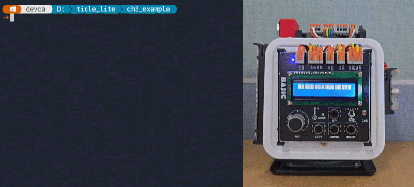</br>


> **한 걸음 더**  
> 1. sleep_ms(50)을 20과 500으로 각각 바꿔 그래프 반응성과 안정감이 어떻게 달라지는지 비교해 보자.
> 2. info_text를 Percent(%) 대신 VR/CdS Monitor처럼 바꿔, 그래프가 전달하는 의미를 더 분명하게 표현해 보자.
> 3. vr_pct가 80 이상일 때만 Core 보드의 내장 LED가 깜빡이도록 수정해, 아날로그 입력을 임계값 기반 제어로 연결해 보자.
> 4. read_percent(), read_voltage() 대신 다음과 같이 채널 수 만큼의 버퍼를 만든 후 read_into()를 호출하면 여러 채널의 ADC 값을 한 번에 읽을 수 있다. 기존 코드를 read_into()로 수정해 보자.
>
>    ```python
>    # ain_read_into.py
>    import array
>    ...
>    # buffer for 2 channels, 2 bytes each (16 bits)
>    buf = array.array('H', bytes(2 * 2)) 
>
>    ain.read_into(buf)  # read all channels into buffer
>
>    vr_pct, cds_pct = (val * 100 / 4095 for val in buf)
>    vr_v, cds_v = (val * 3.3 / 4095 for val in buf)
>    ```
> 5. 앞에서 실습한 vr_level.py를 vr_level_ain.py로 복사한 후 Ain의 read()로 변경해 보자.
>
>    ```python
>     # vr_level_ain.py
>     ...
>     vr = Ain(27, bits=12)  # GP27: VR, 12-bit ADC
>     ...
>     raw = vr.read()  # 12-bit raw value (0-4095)
>     ``` 
---

## PWM

> **풀고 싶은 문제**  
> LED 밝기를 부드럽게 조절하고, 로봇 팔의 관절을 정확한 각도로 움직이려면 어떻게 해야 할까. GPIO는 0/1 둘뿐이지만, 이를 아주 빠르게 켜고 끄는 비율만 잘 조절하면 장치가 느끼는 평균 세기를 조절할 수 있다. 이 방식이 PWM이다.

PWM(Pulse Width Modulation, 펄스 폭 변조)은 전압의 크기를 직접 조절하기 어려운 디지털 장치에서 아날로그와 같은 연속적인 출력 변화를 만들어내기 위해 반드시 필요한 제어 방식이다. 디지털 핀은 기본적으로 0V와 5V(또는 3.3V)처럼 켜지거나 꺼진 두 가지 상태만 출력할 수 있으므로 중간 크기의 전압을 제어할 수 없는데, 이러한 하드웨어적 한계를 극복하고 신호의 켜짐(High)과 꺼짐(Low) 상태를 매우 빠른 주기로 반복하면서 전체 주기 중 신호가 켜져 있는 시간의 비율인 듀티 사이클(Duty Cycle)을 조절하여 평균적인 전력 출력 세기를 제어한다. 이러한 우회적인 방식을 통해 LED의 밝기를 미세하게 조절하거나 모터의 회전 속도를 부드럽게 제어할 수 있어 피지컬 컴퓨팅 분야에서 널리 활용된다.

PWM 신호를 정확히 제어하기 위해서는 주파수(Frequency)와 듀티 사이클이라는 두 가지 핵심 요소를 명확히 이해해야 한다. 먼저 주파수는 켜짐과 꺼짐 상태가 모두 포함된 하나의 완전한 주기(Cycle)가 1초 동안 몇 번 반복되는지를 나타내는 지표로 단위는 Hz(헤르츠)를 사용한다. 예를 들어 주파수가 50Hz로 설정되었다면 1초 동안 이 반복 과정이 정확히 50번 일어남을 의미하는데, 시각적인 제어 시 이 주파수가 인간의 잔상 시간보다 충분히 높아야만 LED가 깜빡이지 않고 부드럽게 점등되어 있는 것처럼 인식된다.

반면 듀티 사이클은 설정된 한 주기 내부에서 신호가 켜져 있는(High) 시간이 차지하는 백분율(%)을 뜻한다. 즉, 주파수가 신호가 반복되는 속도를 결정한다면 듀티 사이클은 실제로 출력되는 에너지의 평균 총량을 결정하게 된다. 이에 따라 듀티 사이클이 0%이면 신호는 지속해서 꺼진 상태를 유지하고, 50%이면 한 주기의 절반은 켜지고 절반은 꺼진 상태가 되며, 100%에 도달하면 신호가 끊임없이 켜진 상태가 되므로, 이 공급 비율의 평균값에 따라 LED의 밝기가 달라지거나 서보모터의 정밀한 목표 회전 각도가 지정된다.

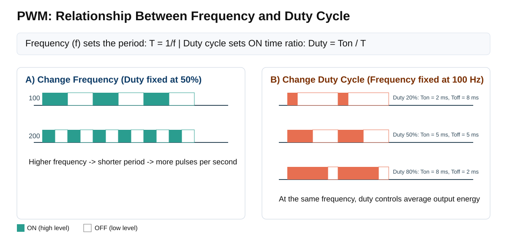</br>

Core 보드는 외부 핀 배치 제약에 맞추어 총 16개의 하드웨어 PWM 채널을 제공한다. 내부적으로는 독립된 PWM 발생기인 슬라이스(Slice)들이 각각 두 개씩 짝을 이루어 동작하며, 시스템 클록 주파수(machine.freq())를 기준으로 최소 8Hz에서 최대 수십 MHz까지 폭넓은 주파수 설정이 가능하다. 이때 동일한 슬라이스에 묶인 채널 쌍은 주파수 제어 회로를 공유하므로 서로 같은 주파수로만 동작하지만, 출력되는 신호의 듀티 사이클은 각각 독립적으로 제어할 수 있다는 특징이 있다.

이러한 하드웨어 PWM 채널은 기본적으로 인접한 짝수와 홀수 번호의 GPIO 핀 쌍(예: GP0과 GP1)에 순차적으로 매핑되어 할당된다. 또한 동일한 PWM 내부 신호를 복수의 서로 다른 GPIO 핀(예: GP0과 GP16)에 중복으로 지정하는 것도 가능하여, 하나의 내부 제어 파형을 복수의 물리 핀으로 동시에 출력하는 유연한 시스템 제어 환경을 제공한다.

### MicroPython에서 PWM 출력 제어

MicroPython에서는 machine.PWM 클래스에 핀 인스턴스와, 주파수, 듀티 사이클을 전달하면 PWM 출력으로 초기화된다. 이후 필요에 따라 freq()와 duty_u16()로 현재 주파수와 듀티 사이클을 읽거나 변경할 수 있다.

```python
from machine import Pin, PWM

pwm0 = PWM(Pin(1), freq=2000, duty_u16=32768)

pwm0.freq()        # get the current frequency
pwm0.freq(1000)    # set/change the frequency

pwm0.duty_u16()    # get the current duty cycle, range 0-65535
pwm0.duty_u16(200) # set the duty cycle 
pwm0.duty_u16(0)   # stop the output
```

### 서보 모터 이해

서보모터는 입력된 제어 신호에 따라 회전축의 위치(각도)를 정밀하게 제어할 수 있는 구동 장치(액추에이터)이다. 일반적인 모터는 전원이 공급되면 360도 연속 회전하지만, 조향 및 관절 제어용 서보모터는 대개 0도에서 180도 사이의 제한된 각도 안에서 지정된 위치로만 정확하게 움직인다.

서보모터 내부에는 일반 DC 모터 외에도 감속 기어, 제어 회로, 그리고 현재 위치를 측정하는 '피드백 센서'가 일체형으로 구성되어 있다. 센서의 종류는 부품에 따라 다르며, 교육용 소형 서보모터는 가격이 저렴한 가변저항을 주로 사용하고 고정밀 산업용 모터는 마모가 없는 디지털 엔코더나 홀 센서를 사용한다. 내부 제어 회로는 외부에서 들어온 목표 PWM 신호와 이 센서가 측정한 현재 위치값을 끊임없이 비교하며, 오차가 0이 될 때까지 모터를 구동하는 폐루프(Closed-loop) 제어 방식으로 동작한다.

축과 연결된 감속 기어는 모터의 회전 속도를 낮추는 대신 물리적인 힘(토크, Torque)을 극대화하는 역할을 한다. 서보모터는 목표 각도에 도달한 후 외부에서 축을 억지로 돌리려고 해도, 현재 지정된 각도를 유지하기 위해 내부 제어 회로가 반대 방향으로 버티는 힘(정지 토크)을 발생시킨다. 이러한 안정적인 위치 유지 특성 덕분에 로봇의 관절, 드론의 조향 장치, 스마트 가전의 자동 개폐 장치 등에 광범위하게 쓰인다.

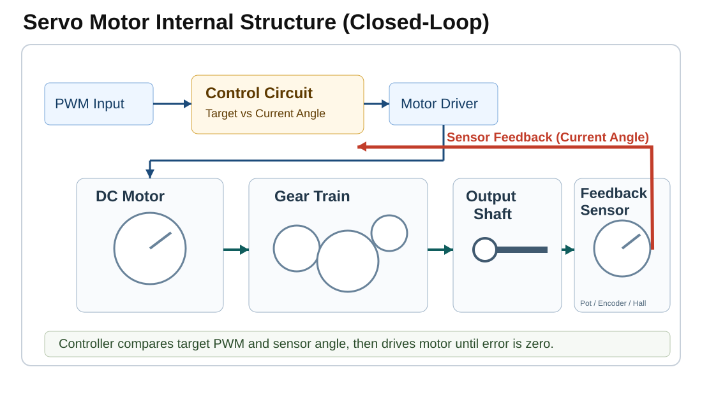</br>

TiCLE Lite에서 서보 모터는 1번 핀을 사용한다.

| Peripheral | Pin number |
| ---------- | ---------- |
| Servo | 1 |

#### PWM과 서보 모터 각도 관계
서보모터는 단순히 전원을 공급하는 것만으로는 원하는 각도로 움직이지 않으며, 일정한 주기 내부에서 신호가 켜져 있는 시간인 펄스 폭을 정밀하게 조절해야만 그 길이에 따라 회전축의 최종 각도가 결정된다. 따라서 PWM은 단순히 LED 밝기나 모터 속도와 같은 출력을 증감하는 세기 조절 목적 외에도, 이처럼 하드웨어의 위치를 정밀하게 제어하기 위한 신호 생성 기술로 이해하는 것이 바람직하다.

일반적인 소형 서보모터를 안정적으로 제어하기 위해서는 반드시 PWM 주파수를 50Hz로 고정하여 출력해야 한다. 주파수가 50Hz라는 것은 신호의 완전한 한 주기(Period)가 1초 동안 50번 반복됨을 뜻하므로 이를 시간 단위로 환산하면 정확히 20ms(밀리초)가 되며, 서보모터는 내부 제어 회로를 통해 이 20ms 주기로 입력되는 신호를 실시간으로 감시하면서 자신의 동작을 제어한다.

서보모터는 이 20ms의 한 주기 안에서 신호가 켜져 있는(High) 시간인 펄스 폭(Pulse Width)의 길이에 따라 회전축의 목표 각도를 인식하게 되는데, 표준적인 제어 규격에 따른 펄스 폭과 회전 각도의 대응 관계는 다음과 같다.

- 0도 이동 (최소 각도): 펄스 폭이 0.5ms 동안 유지될 때
- 90도 이동 (중앙 정렬): 펄스 폭이 1.5ms 동안 유지될 때
- 180도 이동 (최대 각도): 펄스 폭이 2.5ms 동안 유지될 때

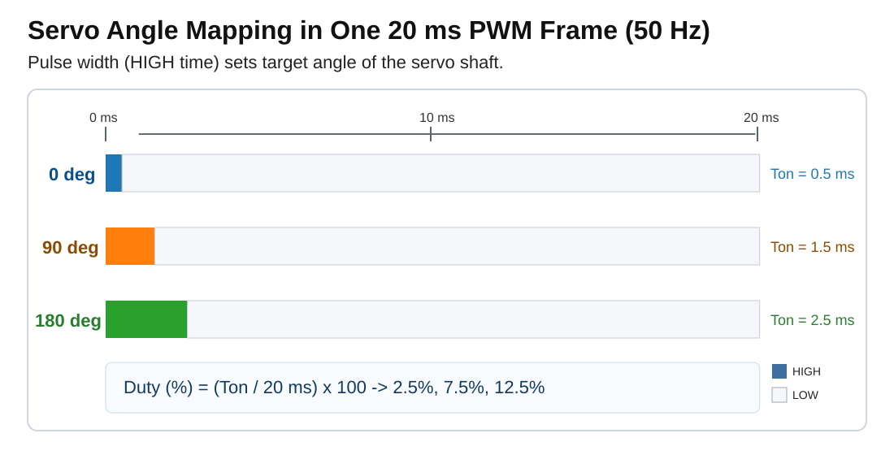</br>

마이크로컨트롤러에서 서보모터를 실제로 제어할 때는 이 물리적인 펄스 폭 시간을 듀티 사이클(%) 수치로 환산하여 명령을 내려야 하므로, 전체 신호 주기인 20ms 중에서 신호가 켜져 있는 시간이 차지하는 비율을 백분율로 계산하면 다음과 같다.

- 0도 (0.5ms): 0.5ms/20ms * 100 = 2.5%
- 90도 (1.5ms): 1.5ms/20ms * 100 = 7.5%
- 180도 (2.5ms): 2.5ms/20ms * 100 = 12.5%

그러나 MicroPython 환경에서는 PWM 제어의 분해능과 정밀도를 극대화하기 위해 0% ~ 100%까지의 듀티 사이클 범위를 16비트 부호 없는 정수인 0부터 65,535까지의 숫자로 촘촘하게 쪼개어 입력받는다. 이에 따라 duty_u16(0)은 듀티 사이클 0%를 의미하고, 최대 설정값인 duty_u16(65535)는 듀티 사이클 100%의 제어 신호를 의미하게 된다.

결과적으로 주파수가 50Hz(주기 20ms)로 고정된 제어 환경에서 서보모터의 주요 목표 각도에 해당하는 요구 펄스 폭을 duty_u16() 메서드 전용 설정값으로 최종 환산하면 다음과 같은 연산 결과가 도출된다.

- 0도 이동 (펄스 폭 0.5ms, 듀티 2.5%): 65535 * 0.025 = 약 1638
- 90도 이동 (펄스 폭 1.5ms, 듀티 7.5%): 65535 * 0.075 = 약 4915
- 180도 이동 (펄스 폭 2.5ms, 듀티 12.5%): 65535 * 0.125 = 약 8192

### 서보 모터 움직이기

> **풀고 싶은 문제**  
> 로봇 팔을 90도에서 0도로, 다시 180도로 움직이고 싶다. 이동 거리가 다른데도 모든 이동에 같은 시간을 주면 앞 명령이 끝나기 전에 다음 명령이 끼어들어 동작이 어긋난다. 이 문제는 움직이는 데 걸리는 시간을 고려해야 한다는 움직임 제어(motion control) 관점을 자연스럽게 도입한다.

서보모터에 특정 각도의 제어 명령을 전달하더라도 모터의 회전축이 해당 위치로 즉시 순간 이동하는 것은 아니며, 물리적으로 회전하여 목표 각도에 도달하기까지는 반드시 일정 시간이 소요되므로 이동 거리가 멀수록 하드웨어의 작동 완료를 위해 더 오래 대기해야 한다. 만약 프로그램 내부에서 모든 각도 이동에 대해 동일한 대기 시간을 부여한다면, 회전 거리가 짧은 구간에서는 불필요한 시간 낭비가 발생하고 반대로 회전 거리가 긴 구간에서는 시간이 부족하여 모터가 미처 도달하기도 전에 다음 명령이 수행됨으로써 제어 타이밍이 어긋나게 된다.

또한 제어 프로그램이 최초로 실행되는 시점에는 현재 서보모터의 회전축이 어느 각도에 위치해 있는지 하드웨어적으로 정확히 파악할 수 없으므로, 이러한 위치적 불확실성을 제거하기 위해 제어의 기준점이 되는 원점(Home Position)을 먼저 설정해야 한다. 이에 따라 이번 예제에서는 시스템의 기하학적 중심인 90도 위치를 원점으로 정의하고, 프로그램의 시작 단계와 최종 종료 단계에서 반드시 이 원점 위치로 복귀하도록 제어 알고리즘을 설계하여 동작의 안정성을 확보한다.

```python
# servo_pwm_basic.py
from machine import Pin, PWM
import time

pwm = PWM(Pin(1)) # Connect servo signal wire to GPIO1 (Pin 1).
pwm.freq(50)      # Servo motors typically use 50Hz.

MIN_U16 = 1638    # duty value for 0 degrees
MAX_U16 = 8192    # duty value for 180 degrees

# With power adapter (5V): ~400ms per 60 degrees -> ~6.6ms per degree
MS_PER_DEG = 400 / 60

def write_angle(angle):
    angle = max(0, min(180, angle))
    duty = MIN_U16 + (MAX_U16 - MIN_U16) * angle // 180
    pwm.duty_u16(duty)

def move_to(target, current):
    travel = abs(target - current)
    wait_ms = int(travel * MS_PER_DEG) + 50  # proportional to travel + 50ms margin
    write_angle(target)
    time.sleep_ms(wait_ms)
    print(f"  {current:3d} degrees -> {target:3d} degrees Move: {travel:3d} degrees, Wait: {wait_ms}ms")
    return target

# Start: move to home position (90 degrees). Wait long enough since current angle is unknown.
print("Moving home (90 degrees)...")
write_angle(90)
time.sleep_ms(700)  # ~600ms for max travel (180 degrees) + margin
current = 90

# Move sequence: observe that wait time varies with angular distance traveled.
for target in [0, 30, 90, 150, 180, 90]:
    current = move_to(target, current)

pwm.deinit()
```

**코드 해설**

write_angle()은 각도를 듀티 값으로 변환하는 역할만 한다. move_to()는 여기서 한 걸음 더 나아가, 현재 각도와 목표 각도의 차이(travel)에 MS_PER_DEG를 곱해 실제 이동에 필요한 시간을 계산한 뒤 여유 50ms를 더해 기다린다. MS_PER_DEG는 TiCLE Lite 서보 기준값인 60도당 약 400ms에서 구했다.

이동 시퀀스를 실행하면 출력에서 차이가 드러난다. 90도 -> 0도는 90도를 이동하므로 약 650ms를 기다리고, 0도 -> 30도는 30도를 이동하므로 약 250ms만 기다린다. 모든 이동에 똑같이 sleep_ms(400)을 쓰면 짧은 이동에서는 시간을 낭비하고, 긴 이동에서는 서보가 다 움직이기 전에 다음 명령이 실행되어 동작이 어긋난다.

시퀀스의 마지막은 항상 90도(홈)로 끝난다. 프로그램이 종료된 뒤에도 서보가 기준 위치에 있으면 다음 프로그램이 어디서 시작하는지 예측할 수 있다. 로봇 제어에서 기준 위치와 이동 시간 계산은 정밀한 동작의 출발점이다.

**실행 결과와 확인할 점**

프로그램이 시작되면 서보모터가 기준점인 90도 위치로 먼저 이동한 후, 이어서 정의된 이동 시퀀스가 순서대로 실행되는데 이때 터미널 창에는 이동 전의 현재 각도와 목표 각도, 실제 이동 거리 및 그에 따른 연산 대기 시간이 실시간으로 함께 출력된다.

사용자는 터미널 출력 결과를 통해 90도에서 0도로 이동할 때의 대기 시간은 약 650ms가 소요되는 반면, 0도에서 30도로 이동할 때는 상대적으로 짧은 약 250ms의 대기 시간이 지정됨을 확인할 수 있다. 이 실습의 핵심은 모터의 제어 오차를 방지하기 위해 회전해야 할 물리적 거리가 클수록 그에 비례하여 프로그램의 대기 시간(Sleep Time)을 유동적으로 길게 설정해야 한다는 점이다. 정의된 모든 이동 시퀀스가 안정적으로 종료되면, 서보모터는 최종적으로 다시 원점인 90도(홈) 위치로 복귀한 후 프로그램을 안전하게 종료한다.

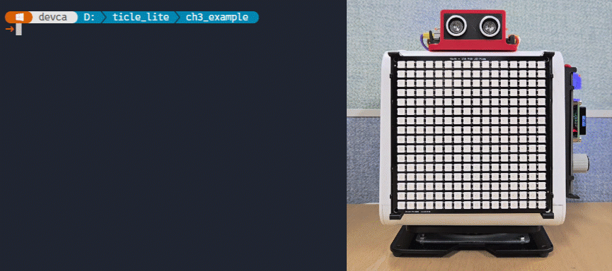</br>

> **한 걸음 더**  
> 이동 시퀀스 리스트 [0, 30, 90, 150, 180, 90]을 [90, 45, 135, 0, 180, 90]처럼 자유롭게 바꿔 보자. 출력 로그의 "이동: NN도, 대기: NNms"가 각도 차이에 비례해 달라지는지 관찰한다. 그다음 MS_PER_DEG를 절반으로 줄여 "더 빨리" 움직이면 서보가 명령을 따라잡지 못하는 현상(동작 절단)이 어떻게 나타나는지도 확인해 보자.


### Pout 클래스로 PWM 출력을 간결하게 다루기

> **이 예제로 풀 문제**  
> PWM의 원리는 machine.PWM으로 확인했지만, 실제 코드에서는 주파수 설정, 듀티 범위 제한, 여러 채널 제어를 매번 직접 처리하기 번거롭다. 범용 PWM 출력을 더 짧고 안전하게 다룰 수 있을까?

TiCLE Lite 라이브러리의 Pout 클래스는 하드웨어 PWM 출력을 편리하게 제어할 수 있도록 도와주는 공통 래퍼(Wrapper) 클래스이다. 해당 클래스 내부의 set_duty() 메서드는 사용자 직관성을 높이기 위해 0부터 100 사이의 백분율(%) 단위를 인수로 받아 듀티 사이클을 설정하는 반면, set_duty_u16() 메서드는 MicrPython 표준 machine.PWM 클래스와 동일하게 0부터 65,535 범위의 16비트 원시 데이터(Raw Data) 값을 그대로 입력받아 정밀한 제어 기능을 제공한다.

```python
# servo_pout_basic.py
import time
from pout import Pout

pwm = Pout(1, freq=50)  # GP1: Servo, 50 Hz

try:
    for duty in (2.5, 7.5, 12.5, 7.5):
        pwm.set_duty(duty)       # idx defaults to 0
        print(f"duty = {duty}%")
        time.sleep_ms(700)
finally:
    pwm.deinit()
```

**코드 해설**

Pout(1, freq=50)은 1번 핀을 PWM 출력으로 준비한다. set_duty(duty)는 퍼센트 단위로 듀티를 설정하므로, machine.PWM의 duty_u16 범위를 직접 계산하지 않아도 된다.

Pout은 범용 PWM 출력에 적합하다. 서보 모터처럼 각도, 홈 위치, 이동 완료 대기까지 필요한 장치는 아래에서 다룰 Servo 클래스가 더 알맞다.

**실행 결과와 확인할 점**

서보모터가 2.5%, 7.5%, 12.5%, 7.5% 순서로 네 위치를 이동하며, 각 단계에서 터미널에 duty 값이 출력된다. 2.5%는 0도(한쪽 끝), 7.5%는 90도(중앙), 12.5%는 180도(반대쪽 끝)에 해당하며, 각 위치에서 0.7초 머문 뒤 다음 위치로 이동한다. 서보가 각 각도에 실제로 멈추는지 눈으로 확인하고, duty 값을 3.0이나 10.0으로 바꾸었을 때 서보가 어떤 위치로 이동하는지도 살펴보자.

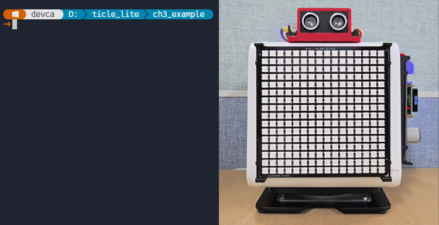</br>

### Servo 클래스로 왕복 운동

> **이 예제로 풀 문제**  
> 선풍기 자동 회전이나 레이더 스캐너처럼 서보가 양 끝 사이를 쉬지 않고 왕복하게 만들어 보자. machine.PWM으로 직접 구현하던 듀티 계산과 Pout의 이동 시간 관리를 전용 Servo 클래스로 얼마나 줄일 수 있을까?

앞서 사용한 Pout 클래스는 서보모터용 듀티 사이클(%)을 수식으로 계산할 필요는 없었으나 제어 대기 시간은 여전히 개발자가 직접 연산해야 했던 반면, Servo 클래스는 복잡한 내부 계산 없이 사용자가 직관적인 디그리 각도 단위로 서보모터를 제어할 수 있도록 지원한다.

이에 따라 아래의 실습 예제는 회전축이 한쪽 끝에서 반대쪽 끝까지 이동하는 전체 과정을 하나의 긴 연속적인 보간(Interpolation) 동작으로 처리하는데, 이는 짧은 각도 구간마다 매번 제어 신호를 끊어 멈추고 다시 출발하는 불연속적 방식이 아니므로 서보모터의 왕복 회전 동작을 훨씬 부드럽고 자연스럽게 구현할 수 있게 해 준다.

```python
# servo_lib_sweep.py
from ticle_lite.servo import Servo

servo = Servo(1)

LEFT_ANGLE  = 15
RIGHT_ANGLE = 165
SWEEP_MS    = 2200  # Longer movement time gives the servo more interpolation steps.

try:
    servo.home()
    servo.wait()

    while True:
        servo.move_to(LEFT_ANGLE, ms=SWEEP_MS, easing="cubic")
        servo.wait()
        print(f"angle = {LEFT_ANGLE}")

        servo.move_to(RIGHT_ANGLE, ms=SWEEP_MS, easing="cubic")
        servo.wait()
        print(f"angle = {RIGHT_ANGLE}")

finally:
    servo.home()
    servo.wait()
    servo.deinit()
```

**코드 해설**

Servo(1)으로 GP1에 연결된 서보를 위치 제어 모드로 초기화하고, 홈 각도를 기본값(90도)로 설정한다.

LEFT_ANGLE과 RIGHT_ANGLE은 왕복 운동의 양 끝 각도이다. 0도와 180도는 일부 서보에서 물리적 끝단에 가까워 걸리는 느낌이 날 수 있으므로, 예제에서는 15도와 165도를 사용해 여유를 둔다. SWEEP_MS는 한쪽 끝에서 반대쪽 끝까지 이동하는 데 걸리는 시간이며, 값을 늘릴수록 서보가 보간하는 중간 단계가 많아져 움직임이 더 부드러워진다.

move_to()은 서보 이동을 시작하는데, easing="cubic"은 시작과 끝을 조금 부드럽게 만들어 갑작스럽게 출발하거나 멈추는 느낌을 줄인다. 만약 10도처럼 짧은 구간마다 move_to()와 wait()를 반복하면 각 구간 끝에서 이동 완료 판정을 하고 다음 구간이 새로 시작되므로 미세한 정지와 재출발이 생긴다. 하지만 지금처럼 전체 왕복 구간을 한 번에 보간하면 덜컥거림이 줄어든다.

PWM 예제에서는 각도 차이로 대기 시간을 직접 계산해야 했지만, Servo 라이브러리는 wait()로 이동이 완료될 때까지 지연을 보장한다.

**실행 결과와 확인할 점**

서보가 15도와 165도 사이를 약 2.2초에 걸쳐 부드럽게 왕복한다. 방향이 바뀌면 곧바로 반대쪽으로 출발하며, cubic easing 덕분에 시작과 끝 구간에서 속도가 자연스럽게 붙었다 줄어드는 것이 보인다. SWEEP_MS를 1000으로 줄이면 빠른 왕복, 3500으로 늘리면 느리고 긴 스윙이 된다. LEFT_ANGLE과 RIGHT_ANGLE을 바꾸면 왕복 범위를 조정할 수 있다.

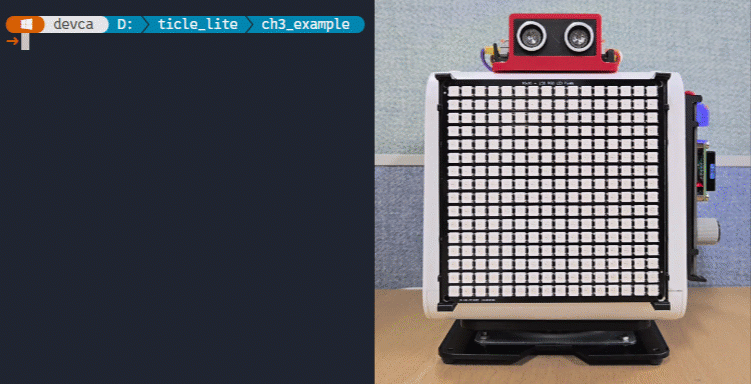</br>


### Servo로 만드는 거리 표시 바늘

> **풀고 싶은 문제** 
> 자동차 계기판의 바늘처럼, 또는 주차 보조 센서의 경고 게이지처럼, 센서가 읽은 값을 실시간으로 움직이는 바늘로 나타내고 싶다. 아이디어는 간단하다. 거리를 각도로 바꾸면 된다. 이 예제는 이미 배운 두 장치(SR04 + Servo)를 처음으로 결합하는 종합 예제이다.

이 예제에서 서보는 속도계나 온도계의 바늘처럼 동작한다. 물체가 가까우면 바늘이 왼쪽(0도)으로, 멀면 오른쪽(180도)으로 움직인다. 구체적으로는 거리(cm)에 3을 곱해 각도를 구한다. 60 cm이면 180도(최대), 30 cm이면 90도(중간)에 해당한다. 물체를 앞뒤로 움직이면 바늘이 그 거리를 따라 실시간으로 반응한다. 매 측정 주기마다 바늘은 거리에 해당하는 각도까지 스윙했다가 홈(0도)으로 복귀해 다음 측정을 기다린다.

```python
# servo_distance_pointer.py
import math
import time

from ticle_lite.servo import Servo
from ticle_lite.us import SR04 as UltraSonic  # alias SR04 as UltraSonic

sonic = UltraSonic(trig=12, echo=13)
servo = Servo(1, home_angle=0)

try:
    while True:
        dist_m = sonic.read()
        if math.isnan(dist_m):
            print("distance = timeout")
            time.sleep_ms(100)
            continue

        distance = dist_m * 100
        angle = int(max(0, min(180, distance * 3)))
        servo.move_to(angle, easing="quad")
        servo.wait()
        print(f"distance = {distance:.1f} cm \t angle = {angle}")
        servo.home()
        servo.wait()
finally:
    sonic.deinit()
    servo.home()
    servo.wait()
    servo.deinit()
```

**코드 해설**

UltraSonic()로 초음파 센서를 초기화하고, read()를 호출하면 미터 단위 거리가 반환된다. 이를 100배 해서 cm로 바꾼 뒤, 3을 곱해 각도를 계산한다. 3을 곱하는 이유는 60 cm를 180도에 대응시키기 위해서이다(60 × 3 = 180). max(0, min(180, ...))는 범위를 0~180 안으로 제한해 서보가 한계를 벗어나는 것을 막는다.

측정 실패 시 nan이 반환되므로 math.isnan()으로 확인한 뒤, continue로 이번 주기를 건너뛴다. continue가 없으면 nan인 채로 angle 계산이 실행되어 TypeError가 발생한다.

성공적으로 거리를 읽으면 서보를 해당 각도까지 움직인 뒤 출력하고, home()으로 홈(0도)에 복귀해 다음 측정을 준비한다. home_angle을 0으로 설정한 이유는 바늘이 항상 왼쪽 끝에서 출발하고 복귀하도록 해 동작이 일정하게 보이도록 하기 위해서이다.

move_to(), wait(), home() 덕분에 서보 제어 코드의 의미가 분명하게 드러난다. machine.PWM 예제처럼 듀티 값을 직접 계산하지 않아도 되므로, 사용자는 거리를 각도로 바꾼다는 제어 아이디어에 더 집중할 수 있다. easing="quad"는 서보 이동이 조금 더 부드럽게 보이도록 돕는다.

**실행 결과와 확인할 점**

물체를 센서 앞 10~60 cm 범위에서 천천히 움직이면 서보 바늘이 그 거리에 비례해 오른쪽으로 스윙하고, 매 주기마다 0도(홈)로 복귀한다. 60 cm보다 멀면 서보는 180도까지 스윙했다가 0도로 복귀한다. 물체를 완전히 치우거나 범위 밖에 두면 timeout이 출력되고, 서보는 0도(홈)에서 멈춘 채 다음 측정을 기다린다. distance * 3에서 2로 바꾸면 90 cm까지를 0~180도에 펼쳐 더 넓은 범위를 표현할 수 있다.

</br>

> **한 걸음 더**  
> 1. 만약 서보의 움직임에 따른 진동이 초음파 측정에 영향을 미친다면, while 루프의 마지막 줄인 servo.wait() 다음에 time.sleep_ms(100) 등으로 지연을 추가해 보자.
> 2. 계수를 6으로 올려 30 cm를 '다 채움'으로 잡아 주차 보조 경고계가 되게 해 보자. 계수만 바꿔도 경고의 민감도가 확 달라진다.
> 3. 거리가 20 cm 이하일 때 추가로 print("Danger")을 함께 출력해 보자. 이 한 줄을 추가하는 작은 행위가 사용자 경험 설계(UX) 사고의 시작이다.
---

## 정리

이 장에서는 디지털, 아날로그, PWM이라는 세 가지 기본 인터페이스를 두 단계로 학습하였다. machine 표준 라이브러리로 원리를 익힌 뒤, TiCLE Lite 전용 라이브러리로 같은 기능을 더 간결하고 정확하게 구현하는 방법을 경험하였다.

세 가지 인터페이스의 역할은 다음과 같이 정리할 수 있다. GPIO는 LED, 버튼, 초음파 센서처럼 켜고 끄는 디지털 신호를 다룬다. ADC는 빛 센서나 가변저항처럼 연속적으로 변하는 아날로그 값을 숫자로 읽는다. PWM은 서보 모터의 각도 제어처럼 시간 비율로 출력을 조절한다.

TiCLE Lite 라이브러리는 각 인터페이스에 대응하는 편의 기능을 제공한다. Button은 디바운스와 이벤트 감지를 자동 처리하고, Ain은 전압, 퍼센트 변환과 다채널 읽기를 제공하며, Pout은 범용 PWM 듀티 제어를, SR04는 거리 계산과 timeout 처리를, Servo는 각도 이동과 부드러운 가감속을 담당한다. machine 방식과 비교하면, 반복 작성해야 했던 수식과 타이밍 코드가 의미 있는 메서드 이름으로 대체된다.

이 장의 마지막 예제처럼, 장치는 따로 동작하지 않는다. 초음파 센서(SR04)와 서보 모터(Servo)를 연결하면 거리 측정값이 바늘의 움직임으로 바뀐다. 피지컬컴퓨팅의 핵심은 한 장치의 사용법을 외우는 것이 아니라 여러 장치를 묶어 의미 있는 동작을 설계하는 데 있다.

### 스스로 점검하기

1. Pin.OUT과 Pin.IN은 각각 어떤 장치에 사용하는가?
2. 초음파 센서 거리 계산식에서 2로 나누는 이유는 무엇인가?
3. machine.ADC의 read_u16()과 Ain 클래스의 read_percent()는 어떤 차이가 있는가?
4. Button 클래스가 machine.Pin보다 유리한 상황은 어떤 경우인가?
5. Ain.read_into(raw)는 왜 반복문 안에서 새 리스트를 만드는 방식보다 안정적인가?
6. Pout.set_duty()와 machine.PWM.duty_u16()은 어떤 차이가 있는가?
7. PWM의 듀티비를 조절하면 서보 모터에서 무엇이 달라지는가?
8. Servo 클래스의 wait() 메서드는 왜 필요한가? machine.PWM으로 서보를 제어할 때 어떤 불편함이 있었는가?
