# 4. 기본 제어 -I2C, SWI, I2S

## 개요

### 학습 목표

- I2C 통신으로 CharLCD와 IMU 센서를 초기화하고 데이터를 읽을 수 있다.
- Matrix 클래스로 16×16 픽셀 디스플레이에 색, 도형, 문자, 스크롤 텍스트를 표현할 수 있다.
- Audio 클래스로 음 재생, WAV 파일 재생, 마이크 입력, 박수 감지, 소리 녹음을 다룰 수 있다.
- 여러 장치(버튼, LCD, 픽셀, 오디오)를 조합하여 의미 있는 피지컬컴퓨팅 프로그램을 만들 수 있다.


### 이 장의 의미

3장에서 GPIO, ADC, PWM으로 신호를 주고받는 방법을 익혔다면, 이 장에서는 그 위에서 동작하는 풍부한 입출력 장치를 다룬다. I2C는 단 두 가닥의 선으로 여러 장치를 연결하고, 픽셀 디스플레이는 256개의 RGB LED를 화면처럼 제어하며, I2S는 디지털 오디오 신호를 주고받는 전용 통신이다.

이 장의 예제는 대부분 TiCLE Lite 전용 라이브러리만 사용한다. machine 원리 단계 없이 처음부터 라이브러리를 쓰는 이유는, I2C 프로토콜 처리나 WS2812 타이밍, I2S 샘플링처럼 저수준 구현이 복잡하여 활용 자체가 더 중요한 장치들이기 때문이다.

이 장의 예제들은 이후 프로젝트 장에서 화면 출력, 소리, 센서 데이터가 함께 동작하는 복합 프로그램의 직접적인 바탕이 된다.

### 실습 전 준비

1장의 설치 환경이 갖춰져 있어야 한다. 추가로 이 장에서 사용하는 라이브러리가 오류 없이 동작하는지 미리 확인한다.

```python
from ticle_lite.hd44780 import HD44780_PCF8574 as CharLCD
from ticle_lite.mpu6050 import MPU6050 as IMU
from ticle_lite.audio import Audio
from ticle_lite.ws2812 import Matrix
```

WAV 파일 재생 예제를 실행하려면 I2S 절의 설명에 따라 인터넷에서 배포하는 res 폴더를 보드에 미리 설치해야 한다. 또한 Audio와 Matrix를 함께 사용할 때는 MicroPython에서 제공하는 I2S의 PIO 할당 순서 때문에 Audio 인스턴스를 먼저 만들어야 한다.

```python
from ticle_lite.audio import Audio
from ticle_lite.ws2812 import Matrix

# Note) You must create an Audio object before creating a Matrix object.
audio  = Audio(sck=4, ws=5, sd_in=6, sd_out=7)
matrix = Matrix(0, brightness=0.2)
```

### PIO와 상태 머신

임베디드 시스템 설계 시 빈번하게 발생하는 하드웨어적 제약 중 하나는 내장된 주변장치 포트 수가 부족하다는 점이다. 예를 들어, 하드웨어적 I2C 포트가 두 개만 존재하는 마이크로컨트롤러에서 세 개의 독립적인 I2C 장치를 제어해야 하는 경우, 소프트웨어적으로 핀의 출력을 강제 제어하는 비트뱅잉(Bit Banging) 방식을 채택하게 된다. 그러나 비트뱅잉 방식은 다음과 같은 치명적인 한계를 가진다.

- 메인 CPU의 연산 자원 대량 소모: 타이밍을 맞추기 위해 CPU가 루프를 돌며 대기해야 하므로 주 연산 성능 저하
- 데이터 무결성 저해 위험: 인터럽트 발생 시 정밀한 하드웨어 타이밍이 순간적으로 틀어져 데이터가 깨질 수 있음

Core 보드에 내장된 RP2350 마이크로컨트롤러는 이러한 물리적 제약을 극복하고 하드웨어 확장성을 극대화하기 위해 프로그래밍 가능한 입출력인 PIO 블록을 탑재하였다. PIO는 하드웨어 수준에서 입출력 프로토콜을 자유롭게 프로그래밍할 수 있는 전용 서브 프로세서 시스템이다. 기존의 고정된 하드웨어 블록과 달리 내부 구조가 가변적이며, 개발자가 전용 어셈블리 코드를 주입하면 다음과 같은 전용 인터페이스 컨트롤러로 즉시 변환된다.

- WS2812B LED 제어기: 정밀한 펄스 폭 제어가 필요한 주소 지정형 LED 구동
- I2S 및 SPDIF 오디오 제어기: 고속 실시간 오디오 스트리밍 구현
- 기타 커스텀 프로토콜: 시중에 없는 독자적인 규격의 고속 통신 하드웨어 생성

**PIO 블록과 명령어 저장공간 공유**
RP2350은 총 3개의 PIO 블록(PIO0~PIO2)을 제공하며, 각 블록은 4개의 상태 머신으로 구성되어 전체 시스템에서 총 12개의 상태 머신(SM0~SM11)을 운용할 수 있다. 단, 동일한 PIO 블록 내의 상태 머신 4개는 32개의 명령어 저장 공간(슬롯)을 공동으로 공유하므로, 한 블록 내부에서 실행되는 제어 프로그램들의 총 명령어 수가 32개를 초과하지 않도록 자원을 분배해야 한다.

**상태 머신**
PIO 블록의 실질적인 연산과 제어를 담당하는 핵심 하드웨어 유닛은 상태 머신이다. 하나의 PIO 공통 블록 내부에는 독립적으로 구동되는 복수의 상태 머신(SM)이 내장되어 있으며, 이들은 각각 개별적인 입출력 태스크를 전담하여 처리하는 미니 프로세서의 역할을 수행한다. 상태 머신의 내부 독립 실행 환경은 다음과 같은 요소들로 구성된다.
 
- 프로그램 카운터(PC): 메인 CPU와 독립된 자체 명령어 라인의 실행 순서 제어
- X 및 Y 스크래치 레지스터: 데이터의 임시 저장 및 조건문 판별 연산 수행
- 시프트 레지스터(ISR, OSR): 입력 및 출력 데이터의 비트 단위 직렬화와 병렬화 전담
 
또한, 상태 머신은 시스템 클럭 주기와 하드웨어 레벨에서 완벽하게 동기화되어 동작한다. 명령어 세트가 극도로 단순하여 대부분의 명령어가 단 1클럭 주기 내에 실행 완료되며, 하드웨어 클럭 디바이더를 통해 주파수를 정밀하게 제어할 수 있다. 이로 인해 각 명령어의 실행 시간이 명확히 고정되므로 소프트웨어 기반 제어의 타이밍 지터나 간섭 현상이 원천적으로 배제된다.
 
상태 머신이 가진 이러한 고유의 결정성 덕분에 PIO는 오차가 수 나노초에 불과한 초정밀 파형을 스스로 생성하거나 오차 없이 수신할 수 있다. 결과적으로 이 독립적인 상태 머신들의 병렬 구동 메커니즘은 RP2350이 호스트 CPU의 연산 개입을 최소화하면서도 고속 오디오 스트리밍, 초당 수천 회의 라이다 및 센서 신호 분석, 다채널 모터 제어 및 고해상도 PWM 생성, 대규모 LED 매트릭스 디스플레이 실시간 구동 등 고도의 실시간 임베디드 핵심 태스크를 안정적으로 완수할 수 있게 만드는 기술적 기반이 된다.

### PIO 상태 머신 할당과 인스턴스 생성

RP2350에 내장된 Wi-Fi/Bluetooth 모듈은 기본적으로 PIO1 블록에서 사용 가능한 빈 상태 머신을 탐색하여 자동 할당한다. 반면, MicroPython 환경에서 제공하는 RP2350용 I2S 클래스는 오디오 데이터의 송수신 처리를 위해 하드웨어적으로 고정된 상태 머신인 SM0과 SM1을 점유하며, TiCLE Lite 라이브러리의 Audio 클래스는 내부적으로 이 I2S 클래스를 기반으로 동작한다. 또한 TiCLE Lite 라이브러리 중 초음파 센서로부터 거리를 읽는 SR04 클래스는 PIO2 블록에서 상태 머신을 자동 할당받고, Pixel Display 보드를 제어할 때 사용하는 Matrix 클래스는 PIO0부터 PIO2까지 순차적으로 빈 상태 머신을 탐색하여 동적 할당을 수행한다.

이처럼 상태 머신의 할당 방식이 고정과 동적으로 나뉘기 때문에, 이들 장치를 동시에 제어할 때는 반드시 Audio 클래스의 인스턴스를 가장 먼저 생성해야 한다. 만약 Matrix나 SR04 인스턴스를 먼저 생성할 경우, 이들이 PIO0의 SM0과 SM1 자리를 임의로 선점해 버려 추후 생성되는 Audio 인스턴스가 고정 자원(SM0, SM1)을 할당받지 못하는 자원 충돌(Resource Conflict)이 발생하기 때문이다. 따라서 전체 자원의 안정적인 운용을 위해서는 Matrix와 SR04 인스턴스의 생성 시점을 반드시 Audio 인스턴스가 완전히 인스턴스화된 이후로 엄격히 제한해야 한다.

---

## I2C

> **풀고 싶은 문제**  
> 마이크로컨트롤러에 일일이 핀을 할당하다 보면 금방 핀이 모자라 장치를 5개 이상 붙이기 어렵다. 단 두 가닥의 선으로 여러 장치를 연결할 수는 없을까. 이 질문의 답이 바로 I2C이다. 다른 장치들이 같은 선을 공유하므로, 각 장치는 고유 주소(이름표)를 가져야 한다.

I2C는 데이터 신호를 전송하는 SDA(Serial Data)와 동기화 클록을 담당하는 SCL(Serial Clock), 단 두 개의 선을 이용해 여러 장치를 연결하는 직렬 통신 방식이다. 이 통신 방식은 I2C 컨트롤러(또는 마스터)가 클록 신호 생성을 통해 통신을 주도하며, 그 명령에 따라 데이터를 주고받는 타깃(또는 슬레이브)으로 구성된다. 모든 장치가 동일한 두 선을 공유하는 버스(Bus) 구조에서 운영되며, 컨트롤러는 타깃의 고유 주소를 통해 이들을 식별한다.

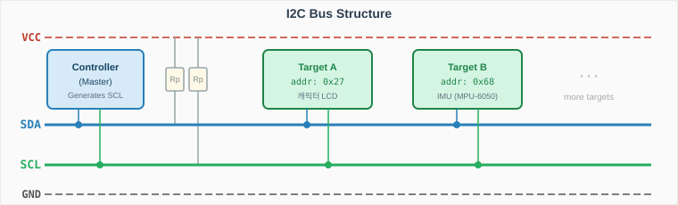</br>

I2C 버스는 통신이 이루어지지 않을 때 신호선을 하이(High, 논리 1) 상태로 유지하다가, 데이터를 전송할 때만 신호를 변화시킨다. 이러한 설계를 통해 여러 장치가 하나의 버스에 연결되어 있어도 전기적 충돌 없이 안전하고 효율적으로 데이터를 교환할 수 있다.

다음은 I2C 컨트롤러와 타깃 사이 물리적인 통신 규약을 정리한 것이다.

- 스타트 조건 (Start Condition): SCL선이 High 상태를 유지하고 있을 때, SDA선이 High에서 Low로 떨어지는 하강 에지(Falling Edge)가 발생하면 통신의 시작을 의미한다.
- 데이터 유효성 (Data Validity): 스타트 조건 이후 데이터가 전송될 때, SDA의 비트 값은 SCL이 High인 구간 동안 반드시 안정적으로 유지되어야 하며, SCL이 Low인 구간에서만 SDA의 상태 변화가 허용된다.
- 읽기/쓰기 비트 (R/W Bit): 컨트롤러가 타깃 주소(7비트)를 보낸 바로 직후의 8번째 비트는 데이터의 방향을 결정한다. 0이면 컨트롤러가 타깃에 데이터를 쓰는 것(Write)을 의미하고, 1이면 타깃으로부터 데이터를 읽어오는 것(Read)을 의미한다.
- 응답 비트 (ACK / NACK): 매 8비트 데이터 전송이 끝날 때마다 데이터를 수신한 장치는 9번째 클럭 주기에 SDA 선을 Low로 떨어뜨려 수신 성공 신호인 ACK(Acknowledgement)를 반환해야 한다. 선을 그대로 High로 두면 NACK로 간주되어 통신 오류 처리나 종료 절차를 밟게 된다.
- 스톱 조건 (Stop Condition): SCL선이 High 상태를 유지하고 있을 때, SDA선이 Low에서 High로 올라가는 상승 에지(Rising Edge)가 발생하면 전체 데이터 트랜잭션이 종료되고 버스는 다시 대기(Idle) 상태로 돌아간다.

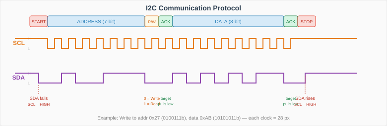</br>

### TiCLE Lite I2C 핀 할당
Core 보드에는 GPIO 핀을 공유하는 2개의 I2C 제어 장치가 내장되어 있는데, 입출력 핀 번호는 4개씩 그룹화되어 SDA와 SCL 역할이 완전히 고정된 채 교대로 배열된다. 해당 핀을 I2C 통신 목적으로 할당한 상태에서는 GPIO 핀을 일반적인 디지털 입출력 용도로 전환하여 사용할 수 없다.

- SDA 핀: GPIO % 4 == 0 또는 2
- SCL 핀: GPIO % 4 == 1 또는 3

여기서 2개의 I2C 제어 장치는 GPIO 핀 조합을 기준으로 (0, 1), (4, 5), (8, 9), (12, 13), (16, 17), (20, 21)번 핀이 하나의 그룹을 형성하며, (2, 3), (6, 7), (10, 11), (14, 15), (18, 19), (22, 23)번 핀이 다른 하나의 그룹을 형성하여 각각 I2C0(I2C0 버스 또는 I2C0 채널), I2C1(I2C1 버스 또는 I2C1 채널)로 명명된다.

I2C 통신 핀을 할당할 때 주의할 점은 서로 다른 제어 장치에 할당된 SDA와 SCL 핀을 교차하여 조합할 수 없으며, 동일한 제어 장치 내부의 조합은 유연하게 선택할 수 있다는 것이다. 예를 들어, 서로 다른 채널의 핀을 혼용한 sda=Pin(0), scl=Pin(3) 조합은 시스템 오류가 발생하지만, 동일한 I2C0 채널 내부의 핀을 활용한 sda=Pin(0), scl=Pin(5) 조합은 정상적으로 구동된다.

TiCLE Lite에서 I2C 통신 핀 매핑은 다음과 같으며, I2C0 채널의 유효한 GPIO 핀을 활용한다.

| Connection pin | Pin number |
| -------------- | ---------- |
| SDA | 10 |
| SCL | 11 |

### MicroPython에서 I2C 통신
MicroPython에서는 machine.I2C 클래스에 물리적인 SCL 및 SDA 핀 인스턴스를 인수로 전달하여 I2C 컨트롤러를 초기화하며, 생성된 인스턴스의 scan() 메서드를 활용하여 I2C 버스에 연결된 타깃의 고유 주소를 자동으로 검색할 수 있다. I2C 통신 속도는 표준 모드(100 kHz)와 고속 모드(400 kHz)로 분류되는데, 기본 설정값은 고속 모드이다. 만약 버스에 표준 모드만 지원하는 타깃이 혼용되어 있다면, 생성자 인수에 freq=100000를 명시하여 통신 주파수를 낮추어 지정해야 한다.

```python
# i2c_scan.py
from machine import I2C, Pin

# Initialize I2C1 on GP10 (SDA) and GP11 (SCL)
i2c = I2C(0, sda=Pin(10), scl=Pin(11), freq=100000) # freq=400000(default) for fast mode
devices = i2c.scan()

# I2C addresses in hexadecimal format
print(f"Connected devices: {[hex(addr) for addr in devices]}") 

# result: Connected devices: ['0x27', '0x68']
```

버스 내부의 특정 타깃과 통신을 시작할 때는 해당 장치 주소를 활용하여 writeto() 및 readfrom() 메서드로 원시 데이터를 직접 전송하거나 수신한다.

```python
addr = 0x27                         # PCF8574 Address

i2c.writeto(addr, b'\x01\x02\x03')  # Write 3byte 

data = i2c.readfrom(addr, 4)        # Read 4byte
print(data)                         # Result: b'\xaa\xbb\xcc\xdd' 
```

또한 내부 메모리나 설정 레지스터 맵(Register Map) 구조를 갖춘 타깃에 대해서는 writeto_mem()과 readfrom_mem() 메서드를 활용해 장치 주소와 제어 대상 레지스터의 주소를 함께 전달함으로써 1바이트 혹은 다중 바이트 단위의 정밀한 읽기 및 쓰기 작업을 직접 수행한다.

```python
addr = 0x68       # MPU6050 Address
reg_power = 0x6B  # Power Management Register
reg_data = 0x3B   # Data Register

i2c.writeto_mem(addr, reg_power, b'\x00')  # Wake-up
sensor_bytes = i2c.readfrom_mem(addr, reg_data, 6) #
```

### TiCLE Lite 라이브러리와 I2C 통신

TiCLE Lite 라이브러리는 MicroPython의 기존 I2C 클래스를 고수준으로 추상화한 I2CController 클래스를 제공한다. 이 클래스는 기존의 scan(), writeto(), readfrom()과 같은 기본 통신 제어 메서드를 완전히 포괄하는 동시에, 사용자의 개발 편의성을 극대화하기 위한 확장 메서드들을 추가로 지원한다.

대표적으로 특정 코드 블록(문맥) 내에서 일시적으로 통신 속도를 변경한 후 실행이 끝나면 원래의 주파수로 자동 복원하는 scoped_freq() 메서드를 제공하며, 버스 상에 특정 주소를 가진 타깃이 정상적으로 존재하는지 탐색 및 확인하는 probe() 메서드를 포함한다. 또한 레지스터 기반 제어의 직관성을 높이기 위해 8비트 및 16비트 단위의 데이터 송수신을 직접 전담하는 write_u8() / read_u8() 및 write_u16() / read_u16() 등의 전용 메서드들을 갖추고 있어, 임베디드 주변장치 제어의 효율성을 크게 향상시킨다.

또한 표준 machine.I2C(id, sda, scl) 방식에서는 개발자가 해당 핀이 하드웨어 내부적으로 몇 번 컨트롤러에 매핑되어 있는지 직접 확인하고 지정해야 하는 번거로움이 있다. 반면 I2CController는 전달된 sda와 scl 핀 번호를 기반으로 RP2350 하드웨어 내부의 적절한 I2C 채널 번호를 자동으로 판단 및 할당하므로, 사용자는 하드웨어 레지스터 맵을 일일이 확인하지 않고도 직관적으로 버스를 초기화할 수 있다.

```python
from ticle_lite.i2c import I2CController

i2c = I2CController(sda=10, scl=11) 
```

MicroPython의 I2C 또는 TiCLE Lite 라이브러리의 I2CController 클래스를 이용한 I2C 통신 자체는 수식과 메서드가 단순하여 진입장벽이 낮다. 그러나 연결된 타깃의 하드웨어 사양과 내부 레지스터 구조, 신호 타이밍 규칙에 맞추어 통신 프로토콜을 직접 구현하는 작업은 하드웨어에 대한 깊은 이해와 많은 경험을 요구한다.

다음은 PCF8574 익스텐더 칩과 결합된 HD44780 캐릭터 LCD의 첫 번째 행, 첫 번째 열에 문자 'H' 하나를 출력하기 위한 가장 기본적인 저수준 제어 코드이다.

```python
# i2c_hd44780_pcf8574.py
from ticle_lite.i2c import I2CController
import time

i2c = I2CController(sda=10, scl=11)   # GP10: SDA, GP11: SCL -> I2C1

ADDR = 0x27  # PCF8574 default address (may be 0x3F depending on the chip)

# PCF8574 control pin mapping rules (based on a typical backpack module)
# P0=RS, P1=RW, P2=E, P3=Backlight(1=ON), P4~P7=D4~D7 data
BK = 0x08  # Backlight ON (Bit 3)
E  = 0x04  # Enable pin (Bit 2)
RS = 0x01  # Register Select pin (Bit 0)

def lcd_write_4bit(value):
    """ Write 4-bit data to the LCD and pulse the Enable pin. """
    i2c.writeto(ADDR, bytes([value | BK]))      # Set data
    i2c.writeto(ADDR, bytes([value | E | BK]))  # E High (start strobe)
    time.sleep_us(1)
    i2c.writeto(ADDR, bytes([value & ~E | BK])) # E Low (end strobe, latch data)
    time.sleep_us(50)

def lcd_send(data, mode=0):
    """ Split 8-bit data into high and low nibbles and send to LCD. (mode: 0=command, 1=data) """
    high_nibble = (data & 0xF0) | mode
    low_nibble = ((data << 4) & 0xF0) | mode
    lcd_write_4bit(high_nibble)
    lcd_write_4bit(low_nibble)

# HD44780 4-bit mode initialization sequence (required)
time.sleep_ms(50)
lcd_write_4bit(0x30) # Attempt to enter 8-bit mode 1
time.sleep_ms(5)
lcd_write_4bit(0x30) # Attempt to enter 8-bit mode 2
time.sleep_us(150)
lcd_write_4bit(0x30) # Attempt to enter 8-bit mode 3
lcd_write_4bit(0x20) # Set final 4-bit interface mode

# Send basic display configuration commands
lcd_send(0x28)  # Function Set: 4-bit mode, 2-line display, 5x8 font
lcd_send(0x0C)  # Display ON/OFF: display ON, cursor OFF, blink OFF
lcd_send(0x01)  # Clear Display: clear screen
time.sleep_ms(2)

# Display the character 'H' on the screen (ASCII value: 0x48)
# Add RS(=1) to the mode so that the LCD recognizes it as 'data' rather than a command.
lcd_send(0x48, mode=RS) 

print("LCD has successfully displayed 'H'.")
```

이처럼 문자 하나를 출력하기 위해서도 인터페이스 모드 전환, 상/하위 비트 분할(Nibble Split), 스트로브(Strobe) 신호 제어 등 복잡한 저수준 연산을 개발자가 직접 구현해야 하므로 애플리케이션 개발의 효율성이 저하될 수 있다.

따라서 Basic 보드에 내장된 캐릭터 LCD나 MPU-6050 MPU를 제어할 때는 TiCLE Lite 라이브러리에서 이들 I2C 관련 클래스로 구현한 HD44780_PCF8574 클래스와 MPU6050 클래스를 사용하기로 한다. 복잡한 버스 통신 규칙을 이들 드라이버 인스턴스에 위임함으로써, 사용자는 저수준 비트 연산의 늪에서 벗어나 주변 장치들을 조합하고 제어하는 상위 애플리케이션 논리 구현에만 온전히 집중할 수 있게 된다.

**캐릭터 LCD와 HD44780_PCF8574 클래스**

캐릭터 LCD는 영문자/숫자/기호를 고정된 위치(가로 16자, 세로 2줄을 표시하는 16x2 LCD가 일반적)에 출력하는 액정 디스플레이의 일종이다. 내부 구동 소자(HD44780)에 영문, 숫자, 기호에 해당하는 폰트 데이터가 픽셀 배열(보통 5x8 점행렬) 형태로 메모리(ROM)에 미리 내장되어 있어, 사용자가 ASCII 코드를 보내면 그에 맞는 글자 모양을 꺼내어 출력한다.

HD44780 소자는 마이크로컨트롤러와 4개 또는 8개의 입출력(GPIO) 핀을 사용해 4비트 또는 8비트 병렬 인터페이스로 통신하지만, Basic 보드에 내장된 캐릭터 LCD처럼 I2C 확장 소자인 PCF8574를 추가하면 병렬 통신이 I2C 통신으로 전환된다.

TiCLE Lite 라이브러리의 HD44780_PCF8574 클래스는 이처럼 PCF8574를 통해 HD44780 소자를 제어하는 방법을 구현한 것으로, clear(), text()와 같은 메서드를 이용해 간단하게 캐릭터 LCD를 제어할 수 있다.

**IMU와 MPU6050 클래스**

가장 일반적으로 사용하는 가성비 높은 IMU는 3축 가속도계(Accelerometer)와 3축 자이로스코프(Gyroscope)로 구성된 MPU-6050으로, 가속도계는 X, Y, Z 축 방향으로 작용하는 중력과 움직임의 힘을 측정하고, 자이로스코프는 X, Y, Z 축을 기준으로 얼마나 빠르게 회전하고 있는지(각속도)를 측정한다.

가속도 값의 단위는 $m/s^2$로, TiCLE Lite를 움직임 없이 수평으로 놓으면 ax와 ay는 0에 가까운 값, az는 약 9.8에 가까운 값이 되며, 기울이면 중력 성분이 ax나 ay 쪽으로 분배되어 나타난다. 회전 속도를 나타내는 자이로스코프 값의 단위는 rad/s이며, 움직이지 않으면 gx, gy, gz가 모두 0에 가까운 값이다. TiCLE Lite를 한 축을 중심으로 회전시키는 동안에는 그 축의 자이로스코프 값이 커지고, 회전을 멈추면 다시 0에 가까운 값으로 돌아오는데, 이 값은 현재의 각도가 아니라 얼마나 빠르게 회전하고 있는지를 나타낸다는 점에 유의한다.

MPU-6050 내부에는 독립된 하드웨어 연산 장치(DMP: Digital Motion Processor)가 내장되어, 드론이나 로봇 본체의 3차원 공간 속 자세(방향과 기울기)를 나타내는 오일러(Euler) 값을 라디안 단위로 계산해 반환한다.

- 롤(Roll / X축 회전): 앞뒤 축을 기준으로 좌우가 기울어지는 각도
- 피치(Pitch / Y축 회전): 좌우 축을 기준으로 앞뒤가 기울어지는 각도
- 요(Yaw / Z축 회전): 수직축을 기준으로 회전하는 각도

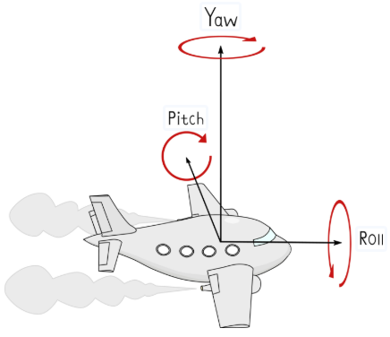</br>

롤, 피치, 요는 3차원 자세를 직관적인 세 개의 각도로 분할하여 정의한 표현으로 수평에 가까운 자세에서는 정확하게 해석되지만, 특정 축이 $90^\circ$ 부근으로 기울어지면 두 회전축이 동일 선상에 겹치면서 하나의 자유도를 상실하여 각도 변화가 상호 간섭을 일으키는데, 이를 짐벌락(Gimbal Lock) 현상이라고 한다. 

짐벌락은 센서의 결함이 아니라 오일러 각도 표현 방식이 지닌 수학적 한계이다. 따라서 롤과 피치는 주로 $\pm45^\circ$ 이내의 기울기 측정 및 제어에 주로 사용되며, $90^\circ$를 초과하여 넘나드는 광범위한 3차원 자세 제어가 필요할 때는 4차원 복소수 형태인 사원수(Quaternion) 값을 활용한다.

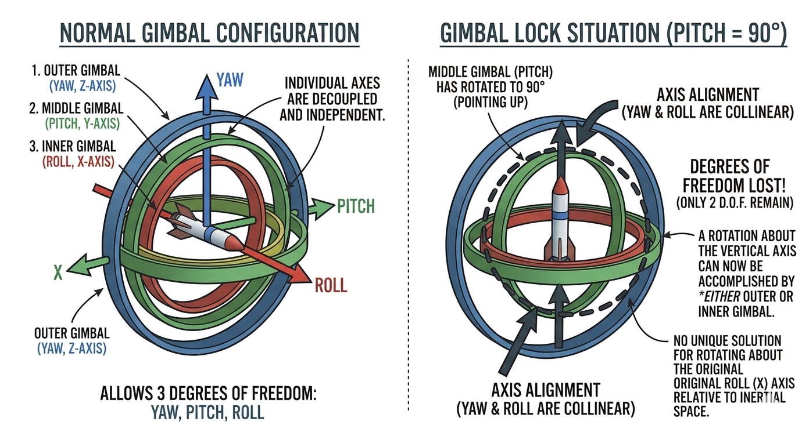</br>

IMU가 측정하는 원시 데이터는 센서 소자에 내장된 축이 기준이지만, 응용에서는 TiCLE Lite 본체 기준점을 공유하는 좌표계로 사상(Mapping)되어야 하며, 이처럼 TiCLE Lite 본체의 중심을 원점으로 삼아 물리량을 해석하는 기준계를 본체 좌표계(Body Frame)라고 한다. 

로봇 소프트웨어 개발을 위한 오픈소스 환경인 ROS에서는 본체 좌표계로 FLU(Forward-Left-Up) 방식을 사용하는데, +X는 앞쪽, +Y는 왼쪽, +Z는 위쪽을 뜻한다. 

- Forward: \(+X_{FLU}\)
- Left: \(+Y_{FLU}\)
- Up: \(+Z_{FLU}\)

MPU-6050의 축 방향은 고유의 칩 좌표계(Chip Frame 또는 Sensor Frame)로 정의된다. 데이터시트의 표준 배치에서는 +X축이 칩의 오른쪽, +Y축이 칩의 위쪽, +Z축이 칩의 인쇄면(Top) 방향을 향한다. 이때 오른쪽, 위쪽, 인쇄면 방향은 표준 배치에서 축을 설명하기 위한 기준일 뿐이며, 칩 좌표계 자체는 +X, +Y, +Z만 정의한다. 따라서 칩을 어떤 방향으로 장착하거나 회전해도 칩 좌표계는 변하지 않고, 본체 좌표계와의 축 대응만 달라진다.

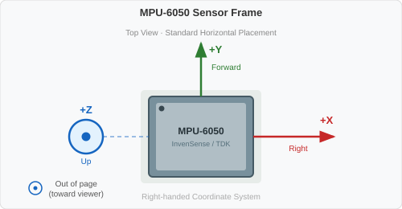</br>

MPU-6050이 내장된 Basic 보드는 TiCLE Lite의 왼쪽면(관찰자 시선이 아님)에 세워져 장착되므로 칩 좌표계의 회전 변환과 이를 다시 FLU 좌표계로 변환하는 과정이 필요하다. 

TiCLE Lite 라이브러리의 MPU6050 클래스에는 인스턴스를 생성할 때 이러한 변환을 remap과 coord 인자로 처리한다. 여기서 remap은 칩이 물리적 보드에 실장된 방위(하드웨어적 기하 구조)를 나타내며, coord는 이를 본체 좌표계(FLU, NED 등)로 최종 변환하는 역할을 수행한다. 

TiCLE Lite의 하드웨어 상황을 반영하여 Pixel Display 보드가 전면으로 FLU 본체 좌표계를 계산하도록 MPU6050 클래스 생성자에는 coord='flu', remap='-xzy'가 기본값으로 설정되어 있다.

```python
from ticle_lite.mpu6050 import MPU6050 as IMU
from ticle_lite.i2c import I2CController

i2c = I2CController(sda=10, scl=11)  # GP10: SDA, GP11: SCL
imu = IMU(i2)                        # default: coord='flu', remap='-xzy'
```

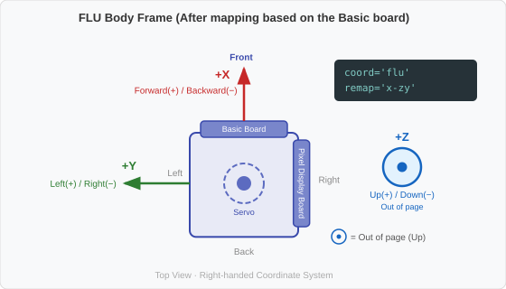</br>

accel 속성은 각 축에 대한 (ax, ay, az)를 반환한다. 범위는 약 +10.0 ~ -10.0이고, 단위는 $m/s^2$이며, 측정값의 양(+) 방향은 중력 반대 방향이다.

| 반환값 | 방향 | 양수(+) | 음수(-) |
|--------|------|---------|---------|
| ax | 앞/뒤(X축) | 앞(Front) | 뒤(Back) |
| ay | 좌/우(Y축) | 왼쪽(Left) | 오른쪽(Right) |
| az | 상/하(Z축) | 위(Up) | 아래(Down) |

gyro 속성은 각속도 (gx, gy, gz)를 반환한다. 모든 축의 각속도는 오른손 법칙(right-hand rule)을 따르며, FLU 좌표계에서 오른손 엄지를 해당 축의 양(+) 방향(X: Front, Y: Left, Z: Up)으로 향하게 했을 때, 나머지 손가락이 자연스럽게 감기는 방향이 그 축의 양(+) 회전이다.

그 밖에 raw_accel과 raw_gyro 속성은 센서 좌표계 고유의 초기 측정값을 반환하고, quat 속성은 3차원 운동을 4개의 원소로 표현한 사원수 성분(w, x, y, z)을, tilt 속성은 가속도 기반의 기울기 각도(roll, pitch)를, euler 속성은 DMP 가속도와 자이로스코프를 바탕으로 계산한 오일러 각도(roll, pitch, yaw)를, linear 속성은 중력 가속도를 배제한 순수 외력에 의한 선형 가속도 성분을 반환한다.

로봇 공학에서 좌표축의 정의는 항상 로봇 본체 좌표계를 기준으로 삼는다. TiCLE Lite 역시 이와 동일한 규격을 따르므로 사용자가 뒤에서 TiCLE Lite를 바라볼 때 좌표계가 일치하지만, 정면으로 마주 보고 있는 상태라면 좌우 방향이 반전되어 인지되므로 주의해야 한다.

### 캐릭터 LCD로 문자 출력하기

> **풀고 싶은 문제**  
> 터미널 화면을 켤 수 없는 환경(예: 독립 동작 중인 로봇)에서도 상태를 표시할 수단이 필요할 때가 있다. 소형 장치에 달린 작은 캐릭터 LCD가 그 역할을 한다. 가전제품, ATM, 프린터, 자동판매기의 어디에나 들어 있는 이 장치를 직접 제어해 본다.

다음 예제는 TiCLE Lite 라이브러리의 HD44780_PCF8574 클래스를 이용해 간단하게 글자를 출력하는 방법을 보여주는 것으로 HD44780_PCF8574는 2개의 소자 이름이므로 CharLCD를 별칭으로 사용한다.

```python
# char_lcd_basic.py
import time
from ticle_lite.hd44780 import HD44780_PCF8574 as CharLCD
from ticle_lite.i2c import I2CController

i2c = I2CController(sda=10, scl=11)  # GP10: SDA, GP11: SCL
lcd = CharLCD(i2c) 

try:
    lcd.clear()
    lcd.set_display(cursor=True, blink=True) # turn on cursor and blinking
    lcd.text(" iCLE Lite", 0, 0)
    time.sleep_ms(500)
    lcd.text("I2C connected", 0, 1)
    time.sleep_ms(500)
    lcd.set_display(cursor=False)
    lcd.home()
    lcd.text("T")
    time.sleep_ms(2000)
finally:
    lcd.deinit()
```

**코드 해설**

I2CController(sda=10, scl=11)은 I2C0 버스에 연결된 PCF8574 소자를 제어하는데 필요한 I2C 컨트롤러를 초기하고, CharLCD()에 이를 전달해 HD44780 소자를 초기화한다. PCF8574 주소와(addr=0x27) 액정 디스플레이 크기(cols=16, rows=2)는 디폴트 값을 사용하므로 생략되었다.

clear()는 액정 디스플레이 전체를 지우고, set_display()는 커서를 표시하거나 숨기며(기본값) 커서를 표시할 때 깜빡임 유/무(기본값)를 설정한다.

text()는 주어진 행(x)과 열(y)에 문자열을 출력하는데, x, y를 생략하면 현재 커서 위치에 글자를 출력한 후 커서를 다음 위치로 옮긴다. 이때, wrap 인자에 True를 전달하면 (15, 0)에서는 (0, 1), (15, 1)에서는 (0, 0)으로 이동한다. home()은 커서를 (0, 0)으로 옮긴다. 

사용자는 이 예제를 통해 캐릭터 LCD가 단순한 출력 장치가 아니라, 프로그램의 현재 상태를 설명하는 정보판으로 쓰일 수 있음을 이해해야 한다. 이후 프로젝트에서는 센서값, 모드 이름, 경고 메시지 등을 캐릭터 LCD에 출력하게 된다.

**실행 결과와 확인할 점**

LCD 첫째 줄에 " iCLE Lite", 둘째 줄에 "I2C connected"가 표시되고, 서커는 둘째 줄 끝에서 깜빡이다가 커서가 사라지면서 첫 줄이 "TiCLE Lite"로 바뀐다. 약 2초 뒤 화면이 지워지고 프로그램이 종료된다. 

만약 화면에 아무것도 나타나지 않으면 PC에서 USB 케이블을 통해 공급하는 전원이 부족한 것이므로, 별도 전원 어뎁터(5V 3A 이상 권장)를 연결한다. 

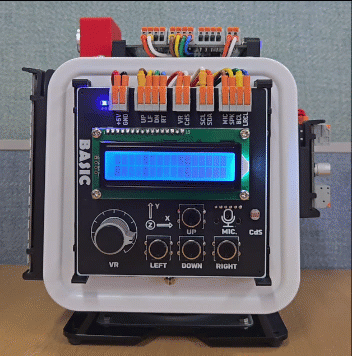</br>

### VR/CdS 백분률 표시하기

> **이 예제로 풀 문제**  
> ADC로 읽은 값을 숫자로만 출력하면, VR이 얼마나 돌려져 있는지 빛이 얼마나 밝은지 한눈에 파악하기 어렵다. 게이지처럼 직관적인 방식으로 표현할 수는 없을까?

CharLCD의 bar()는 0에서 100까지의 정수를 받아 지정한 행에 막대 그래프로 채우는 메서드이다. 이 예제는 VR과 CdS의 측정값을 백분율로 변환해 두 줄에 각각 막대로 표시한다.

```python
# char_lcd_vr_cds.py
import time
from ticle_lite.ain import Ain
from ticle_lite.hd44780 import HD44780_PCF8574 as CharLCD
from ticle_lite.i2c import I2CController

ain = Ain([27, 28], bits=12)         # GP27: VR, GP28: CdS, 12-bit ADC
i2c = I2CController(sda=10, scl=11)  # GP10: SDA, GP11: SCL
lcd = CharLCD(i2c) 

try:
    lcd.bar_patterns = 0b00011000
    lcd.text(f"VR :", 0, 0)
    lcd.text(f"CdS:", 0, 1)
    
    while True:
        vr_pct  = int(ain[0].read_percent())  # VR percentage
        cds_pct = int(ain[1].read_percent())  # CdS percentage
        lcd.bar(0, vr_pct, start_col=4)
        lcd.bar(1, cds_pct, start_col=4)
        time.sleep_ms(100)
finally:
    ain.deinit()
    lcd.deinit()
```

**코드 해설**

Ain([27, 28], bits=12)는 VR과 CdS를 12비트 해상도로 읽는 두 채널 ADC 인스턴스를 초기화한다. ain[0]이 VR, ain[1]이 CdS에 해당한다.

lcd.bar_patterns = 0b00011000은 막대 조각 문자의 픽셀 행 패턴을 지정하는 8비트 마스크이다. 각 비트는 5×8 문자 셀의 8개 행에 위에서부터 순서대로 대응하며, 비트가 1인 행만 막대 색으로 채워진다. 0b00011000은 4번째와 5번째 행만 켜므로 셀 중앙을 지나는 가는 가로선 모양 조각이 그려지고, 기본값 0xFF는 8행 전부를 채우는 꽉 찬 블록이 된다.

루프를 시작하기 전에 lcd.text()로 레이블을 각 줄에 한 번만 고정한다. 이후 루프에서는 lcd.clear()를 호출하지 않고 bar()로 막대 부분만 덮어 쓰냠으로 레이블은 그대로 유지되고 꺜밖임도 없다.

read_percent()는 12비트 ADC 원시값을 0.0~100.0 범위의 백분율로 변환한다. int()로 소수점을 버린 뒤 bar()에 정수로 전달한다.

lcd.bar(row, percent, start_col=4)는 row 행의 start_col 열부터 percent에 비례하는 길이의 막대를 그린다. 레이블이 4칸을 차지하므로 start_col=4로 지정해 레이블 바로 뒤에서 막대가 시작된다. 남은 12칸이 막대 전체 길이가 된다.

**실행 결과와 확인할 점**

VR을 한쪽 끝까지 돌리면 첫째 줄 막대가 꽉 차고, 반대 방향으로 되돌리면 짧아진다. CdS 위를 손으로 가리면 빛이 줄어들면서 둘째 줄 막대 길이가 함께 바뀌는 것을 확인한다. 숫자 없이도 두 센서의 현재 수준을 동시에 비교할 수 있다.

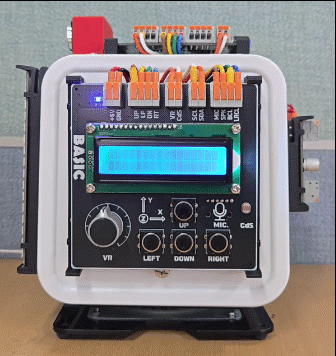</br>

> **한 걸음 더**  
> VR 값이 80을 넘거나 CdS 값이 20을 밑돌 때 lcd.text()로 경고 문구를 표시하도록 수정해 보자. 막대 시각화와 조건 판단을 함께 쓰면 간단한 임계값 알림 장치가 완성된다.

### 버튼으로 메뉴 선택하기

> **풀고 싶은 문제**  
> 가전제품의 메뉴는 대분류를 고르면 소분류가 펼쳐지는 2단계 구조인 경우가 많다. 항목이 늘어날수록 한 줄에 담기 어려우므로, 관련 항목을 묶어 계층으로 나누는 편이 탐색하기 훨씬 쉽다. 4개의 버튼으로 계층 사이를 오가는 2단계 메뉴를 만들어 보자.

CharLCD와 4개의 버튼을 결합하면 2단계 메뉴를 탐색하는 인터페이스가 된다. 이 예제에서는 네 버튼에 역할을 하나씩 맡겨, UP/DOWN은 같은 계층 안에서 항목 이동에, LEFT는 상위 계층으로 복귀에, RIGHT는 하위 계층 진입과 항목 실행에 사용한다.

```python
# char_lcd_button_menu.py
import time
from ticle_lite.button import Button
from ticle_lite.hd44780 import HD44780_PCF8574 as CharLCD
from ticle_lite.i2c import I2CController

MENU_TREE = {
    "MAIN": ["LED", "Servo", "SR04", "IMU"],
    "SUB": {
        "LED":   ["Red ON", "Blue ON", "All OFF"],
        "Servo": ["Angle 0", "Angle 90", "Angle 180"],
        "SR04":  ["Read Dist", "Continuous"],
        "IMU":   ["Get Raw", "Calibrate"]
    }
}

i2c = I2CController(sda=10, scl=11)  # GP10: SDA, GP11: SCL
lcd = CharLCD(i2c) 
btn = Button([16, 17, 18, 19])       # GP16: UP, GP17: LEFT, GP18: DOWN, GP19: RIGHT

current_layer = "MAIN"   # "MAIN" or "SUB"
main_idx = 0
sub_idx = 0

def get_current_list():
    if current_layer == "MAIN":
        return MENU_TREE["MAIN"]
    else:
        selected_main = MENU_TREE["MAIN"][main_idx]
        return MENU_TREE["SUB"][selected_main]

def get_current_index():
    return main_idx if current_layer == "MAIN" else sub_idx

def set_current_index(val):
    global main_idx, sub_idx
    if current_layer == "MAIN":
        main_idx = val
    else:
        sub_idx = val

def render_menu(force_clear=False):
    if force_clear:
        lcd.clear()
        
    items = get_current_list()
    idx = get_current_index()
    
    curr_text = f"> {items[idx]}"
    lcd.text(f"{curr_text:<16}", 0, 0)
    
    next_idx = (idx + 1) % len(items)
    next_text = f"  {items[next_idx]}"
    info_text = f"{idx + 1}/{len(items)}"
    
    line2_combined = f"{next_text[:11]:<11}{info_text:>5}"
    lcd.text(line2_combined, 0, 1)

def execute_action(main_title, sub_title):
    lcd.clear()
    lcd.text("Executing...", 0, 0)
    lcd.text(f"{main_title}->{sub_title}", 0, 1)
    time.sleep(1.0)    
    render_menu(force_clear=True)

try:
    render_menu(force_clear=True)

    while True:
        for btn_id in btn.update(Button.PRESS):
            items = get_current_list()
            idx = get_current_index()

            if btn_id == 0:    # UP
                set_current_index((idx - 1) % len(items))
                render_menu(force_clear=False)
            elif btn_id == 2:  # DOWN
                set_current_index((idx + 1) % len(items))
                render_menu(force_clear=False)
            elif btn_id == 1: # LEFT
                if current_layer == "SUB":
                    current_layer = "MAIN"
                    sub_idx = 0 
                    render_menu(force_clear=True)
            elif btn_id == 3:  # RIGHT
                if current_layer == "MAIN":
                    current_layer = "SUB"
                    render_menu(force_clear=True)
                else:
                    main_name = MENU_TREE["MAIN"][main_idx]
                    sub_name = MENU_TREE["SUB"][main_name][sub_idx]
                    execute_action(main_name, sub_name)

        time.sleep_ms(20)

finally:
    lcd.deinit()
    btn.deinit()
```

**코드 해설**

MENU_TREE는 메뉴 전체 구조를 담은 딕셔너리이다. "MAIN" 키에는 최상위 항목 이름 목록이, "SUB" 키에는 MAIN 항목 이름을 키로 하는 하위 항목 딕셔너리가 들어 있다. 데이터와 로직을 분리해 두었으므로, MENU_TREE만 수정하면 항목 추가나 이름 변경이 자동으로 반영된다.

current_layer, main_idx, sub_idx 세 변수가 현재 탐색 상태를 나타낸다. current_layer는 지금 어느 계층에 있는지("MAIN" 또는 "SUB")를, main_idx는 MAIN 계층에서 선택된 항목 번호를, sub_idx는 SUB 계층에서 선택된 항목 번호를 기억한다.

get_current_list()는 현재 계층에 맞는 항목 목록을 반환한다. MAIN 계층이면 최상위 목록을, SUB 계층이면 현재 선택된 MAIN 항목의 하위 목록을 반환한다. get_current_index()와 set_current_index()는 current_layer에 따라 main_idx 또는 sub_idx를 읽고 쓴다. 이 세 함수가 계층 정보를 캡슐화하므로, 메뉴 동작 코드는 현재 계층을 직접 확인하지 않고도 동일한 방식으로 항목을 처리할 수 있다.

render_menu(force_clear)는 항상 같은 방식으로 화면을 그린다. 첫째 줄에는 '>' 기호와 현재 항목 이름을 16자 고정 폭으로, 둘째 줄에는 다음 항목 이름 미리 보기(11자 한도, 왼쪽 정렬)와 오른쪽에 위치 표시("현재/전체", 5자)를 채워 표시한다. force_clear가 True일 때만 lcd.clear()를 호출한다. 계층이 바뀔 때는 True를 전달해 잔상을 지우고, UP/DOWN처럼 같은 계층 안에서 이동할 때는 False를 전달해 깜빡임 없이 덮어 쓴다.

execute_action()은 선택된 경로를 "상위->하위" 형식으로 1초 표시한 뒤 render_menu(force_clear=True)로 메뉴를 다시 그려 복귀한다.

메인 루프는 네 버튼 이벤트에 따라 동작을 나눈다. UP(인덱스 0)과 DOWN(인덱스 2)은 현재 계층 안에서 나머지 연산으로 순환 이동한다. LEFT(인덱스 1)는 SUB 계층에서만 반응해 MAIN으로 돌아가고 sub_idx를 0으로 초기화한다. RIGHT(인덱스 3)는 MAIN에서는 SUB로 진입하고, SUB에서는 execute_action()을 호출한다.

**실행 결과와 확인할 점**

실행하면 첫째 줄에 "> LED", 둘째 줄에 "  Servo      1/4"가 나타난다. UP이나 DOWN을 누르면 현재 항목과 다음 항목 미리 보기가 함께 바뀐다. "Servo"에 커서를 맞추고 RIGHT를 누르면 하위 메뉴로 전환되어 "Angle 0", "Angle 90", "Angle 180" 사이를 탐색할 수 있다. LEFT를 누르면 상위 메뉴로 복귀한다. 하위 메뉴에서 항목을 선택하고 RIGHT를 누르면 "Executing..." 화면이 1초 표시된 뒤 메뉴로 돌아온다.

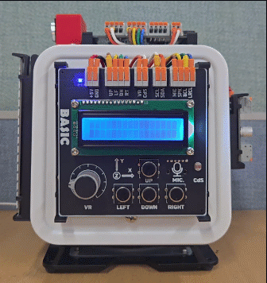</br>

> **한 걸음 더**  
> execute_action() 안의 내용을 바꾸어, 선택된 장치와 기능에 따라 실제 동작(예: LED 켜기, 서보 각도 이동)이 실행되도록 확장해 보자. 데이터(MENU_TREE)는 그대로 두고 execute_action() 하나만 수정하면 메뉴 탐색 흐름 전체가 그대로 유지된다는 점을 직접 확인할 수 있다.

### IMU의 가속도와 자이로스코프 값 읽기

> **풀고 싶은 문제**  
> TiCLE Lite가 기울었는지, 흔들렸는지, 회전하고 있는지 알려면 먼저 IMU가 내보내는 숫자의 뜻을 알아야 한다. 가속도와 자이로스코프 값을 직접 읽어 보며 축, 부호, 단위를 확인해 보자.

IMU 클래스를 이용해 가속도와 자이로스코프 측정값을 읽는데, MPU6050은 특정 제품을 가리키므로 별칭인 IMU를 사용하며, 해당 장치의 I2C 주소(0x68)는 기본값이므로 생략한다. 인스턴스가 생성되면 accel과 gyro 속성으로 가속도와 자이로스코프 측정값을 읽는다.

```python
# imu_accel_gyro_read.py
import math
import time
from ticle_lite.i2c import I2CController
from ticle_lite.mpu6050 import MPU6050 as IMU

i2c = I2CController(sda=10, scl=11)  # GP10: SDA, GP11: SCL
imu = IMU(i2c)

try:
    while True:
        accel_data = (round(i, 1)+0.0 for i in imu.accel)              # in m/s^2
        accel_data_raw = (round(i, 1)+0.0 for i in imu.raw_accel)
        gyro_data = (round(math.degrees(i), 1)+0.0 for i in imu.gyro)  # in radians/s

        ax, ay, az = accel_data
        ax_raw, ay_raw, az_raw = accel_data_raw
        gx_d, gy_d, gz_d = gyro_data
        
        print(f"accel     = ({ax:5.1f}, {ay:5.1f}, {az:5.1f}) m/s^2")
        print(f"accel raw = ({ax_raw:5.1f}, {ay_raw:5.1f}, {az_raw:5.1f}) m/s^2")
        print(f"gyro      = ({gx_d:5.1f}, {gy_d:5.1f}, {gz_d:5.1f}) deg/s")
        print("-"*40)
        time.sleep_ms(100)

finally:
    imu.deinit()
```

**코드 해설**

MPU6050 클래스의 인스턴스를 생성할 때 생략한 mode 인자의 기본값은 Mode.RAW_FAST로 가속도와 자이로스코프 측정값을 DMP를 사용하지 않고 고속으로 읽는 구동 방식이다. 

imu.accel은 X, Y, Z 세 축에 대한 FLU 본체 좌표계에 대한 가속도(ax, ay, az)를 $m/s^2$ 단위로 반환하고, imu.raw_accel은 좌표계 변환 전 원본 가속도 값을 반환한다. imu.gyro 역시 FLU 본체 좌표계로 변화된 세 축의 회전 각도(gx, gy, gz)를 rad/s 단위로 반환한다. 

이들 값들은 모두 3개의 요소를 갖는 튜플(벡터 값)로 제너레이터 식을 통해 각 요소를 round(...,1)로 소수점 둘째 자리에서 반올림하고, -0.0, +0.0이 발생하지 않도록 +0.0 추가 연산을 수행한다. 자이로스코프 값은 라디안 각도이므로 사용자가 이해하기 쉽도록 math.degrees()를 이용해 디그리 각도로 변환한다.

ax, ay, az = accel_data 형식으로 튜플 요소 3개를 풀어 3개의 변수에 대입한 후 f-string 형식으로 변환된 문자열을 print()로 출력한다.

**실행 결과와 확인할 점**

Pixel Display 보드가 전면을 향한 상태(Forward: +X, Left: +Y, Up: +Z)에서 움직임이 없으면 accel은 (0.0, 0.0, 9.8)에 가까운 값, gyro는 세 값 모두 0.0에 가까운 값이 측정된다. 이는 내부 공간 변환 연산을 통해 TiCLE Lite 상단 방향이 FLU 본체 좌표계의 윗방향(+Z, 하늘 방향)으로 정확히 일치되었음을 뜻한다.

TiCLE Lite를 해당 축 방향으로 기울일 때, 가속도 값의 출력은 중력 반대 방향이므로 +X가 땅(-X가 하늘)을 향하면 $ax\approx-9.8$, +Y가 땅(-Y가 하늘)을 향하면 $ay\approx-9.8$, +Z가 땅(-Z가 하늘)을 향하면 $az\approx-9.8$이다. (단, 실제 최대값은 -9.8보다 작거나, 9.8보다 클 수 있다.)

TiCLE Lite가 해당 축을 중심으로 회전할 때, 자이로스코프는 오른손 법칙에 따라 X축을 기준으로 오른쪽으로 회전하면 gx=양(+)의 각도, Y축을 기준으로 오른쪽으로 회전하면 gy=양(+) 각도, Z축을 기준으로 왼쪽으로 회전하면 gz=양(+) 각도이다. (FLU 본체 좌표계 기준이므로 사용자 시선에서 회전 방향은 반대가 된다.)

</br>

> <details>
> <summary><b>알아두기 - 전면 방향을 바꾸고 싶다면</b></summary>
>
> remap은 칩이 보드에 물리적으로 어떻게 실장되어 있는지만 나타내며, coord와는 완전히 무관하다. remap을 정할 때 coord가 무엇인지는 전혀 신경 쓸 필요가 없다. remap 문자열의 세 자리는 순서 그대로 최종 ax, ay, az에 대응한다.
>
> 다음 절차로 어떤 장착 방향에도 remap을 직접 구할 수 있다.
>
> 1. 새로 전면으로 삼고 싶은 면이 바닥을 향하게 기울이고 raw_accel을 읽는다. 값이 0이 아닌 축을 찾아, 읽힌 값이 음수면 그 축에 + 부호를, 양수면 - 부호를 붙여 remap의 1번째 글자로 적는다.
> 2. 새로 왼쪽으로 삼고 싶은 면이 바닥을 향하게 하고 같은 방식으로 확인해 remap의 2번째 글자를 적는다.
> 3. 새로 위쪽으로 유지하고 싶은 면이 바닥을 향하게(보드를 뒤집어) 확인해 remap의 3번째 글자를 적는다.
>
> 기본값 coord='flu', remap='-xzy'는 Pixel Display 보드 방향을 전면으로 삼는 값이다. Basic 보드 방향을 전면으로 쓰고 싶다면 remap만 'zxy'로 바꾸면 된다. coord를 'ned'로 바꾸어도(오른쪽/아래쪽 기준 표기) remap은 그대로 둘 수 있다.
>
> </details>
>
> </details>
</br>

### IMU 가속도로 충격 감지하기

> **풀고 싶은 문제**  
> 택배 상자가 낙하했는지 감지하는 장치, 휴대폰이 떨어졌을 때 화면을 끄는 안전 기능, 자동차가 충돌했을 때 에어백을 터뜨리는 판단은 공통적으로 가속도 센서가 담당한다. 앞에서 읽어 본 가속도 측정값을 이용해 충격을 판단해 보자.

세 축 가속도를 벡터로 합산한 크기는 보드가 어느 방향에 놓이든 항상 약 9.8 m/s² 내외를 유지한다. 충격이 더해지면 이 크기가 급격히 커지는데, 이 점을 이용하면 특정 축 방향에 무관하게 충격 여부를 판단할 수 있다. 벡터 크기가 임계값을 넘으면 충격으로 판단해 캐릭터 LCD와 터미널에 결과를 출력한다.

```python
# imu_shock_detect.py
import math
import time
from ticle_lite.i2c import I2CController
from ticle_lite.hd44780 import HD44780_PCF8574 as CharLCD
from ticle_lite.mpu6050 import MPU6050 as IMU

i2c = I2CController(sda=10, scl=11)  # GP10: SDA, GP11: SCL
lcd = CharLCD(i2c)
imu = IMU(i2c)

SHOCK_THRESHOLD = 12.5  # m/s^2, adjust this threshold based on your needs

try:
    lcd.clear()
    lcd.text("Shock Detector", 0, 0)
    lcd.text("Ready", 0, 1)
    time.sleep_ms(1000)
    lcd.clear()

    last_shock = 0.0

    while True:
        ax, ay, az = imu.accel     # in m/s^2
        mag = math.sqrt(pow(ax, 2) + pow(ay, 2) + pow(az, 2))  # acceleration magnitude in m/s^2

        if mag > SHOCK_THRESHOLD:  # shock detected
            last_shock = mag
            lcd.clear()
            lcd.text("!! SHOCK !!", 0, 0)
            lcd.text(f"{mag:.1f} m/s^2", 0, 1)
            time.sleep_ms(1000)
            lcd.clear()
        else:
            lcd.text(f"G:{mag:.1f}     ", 0, 0)
            if last_shock > 0:
                lcd.text(f"Last:{last_shock:.1f}  ", 0, 1)
            else:
                lcd.text("No shock    ", 0, 1)

        time.sleep_ms(50)
finally:
    imu.deinit()
    lcd.deinit()
```

**코드 해설**

3차원 공간에서의 가속도 벡터 $\vec{a} = (a_x, a_y, a_z)$의 크기(Norm)를 구하기 위해 유클리드 거리 공식(피타고라스 정리의 3차원 확장)인

$$\Vert{}\vec{a}\Vert{} = \sqrt{a_x^2 + a_y^2 + a_z^2}$$

식을 적용하여 전체 가속도의 절대적인 크기(스칼라합 가속도)를 구하면, IMU의 실장 방위와 독립적으로 전체 가속도의 스칼라 총합을 산출할 수 있다. 보드가 수평 상태로 정지해 있을 때는 az 축에 중력 가속도(약 9.8 $m/s^2$)가 집중되지만 합성된 스칼라합 가속도의 크기는 항상 약 $9.8\,m/s^2$로 유지되며, 외력에 의한 충격이 발생하면 이 변위량이 급격하게 상승한다.

가속도 크기가 SHOCK_THRESHOLD(12.5 $m/s^2$)를 초과하면 외부 충격이 인가된 것으로 판단하여 last_shock 변수에 해당 측정값을 기록하고, 1초(1000ms) 동안 화면에 경고 문구를 출력한다.

충격이 감지되지 않는 정상 상태(평상시)에는 현재 가속도 크기와 직전에 기록된 최대 충격값을 화면에 지속적으로 출력한다. 이때 정상 상태 출력 과정에서는 lcd.clear() 메서드를 호출하지 않고 동일한 좌표에 문자열을 중첩하여 출력하도록 설계하여 화면이 주기적으로 점멸(깜빡임)하는 현상을 방지했다. 반면 충격이 감지된 직후에는 이전 화면의 잔상을 완전히 제거하기 위해 표시 장치를 명시적으로 초기화한 후 경고 문구를 새로 출력한다.

**실행 결과와 확인할 점**

TiCLE Lite를 움직임 없이 가만히 두면 LCD에 중력 가속도가 반영된 'G: 9.8' 전후의 수치가 출력된다. 보드를 책상 위에 내려치거나 손으로 흔들어 충격을 가하면 LCD의 첫 번째 줄에는 '!! SHOCK !!', 두 번째 줄에는 측정된 최대 충격 수치(스칼라합 가속도)가 기록으로 남는다. 

SHOCK_THRESHOLD 설정값을 낮추면 더 미세한 충격까지 감지할 수 있다.

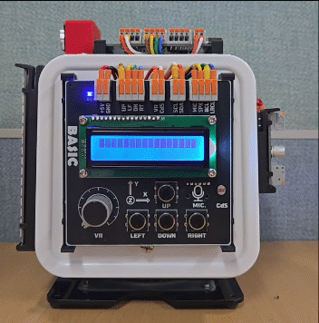</br>

> **한 걸음 더**  
> 1. SHOCK_THRESHOLD를 12.0/15.0/20.0으로 바꿔 가면서 약한 터침, 일상적 충격, 강한 낙하를 구분해 보자. 임계값은 도메인 설계의 가장 기본적인 요소이다.
> 2. mag > SHOCK_THRESHOLD일 때 LCD 출력 내용을 사용자가 인지할 수 있도록 time.sleep_ms(1000)으로 1초 동안 IMU 측정을 멈추는데, 시간 측정 및 비교(논블로킹 타이머)를 적용해 이를 제거하도록 코드를 수정(imu_shock_detect_nonblocking.py)해 보자. 이렇게 하면 충격 상태를 출력하는 동안에 새로운 충격이 발생하면 즉시 이를 반영한다.
> 3. 시간 측정 및 비교로 수정한 코드에 충격 시 추가로 audio.tone(880, 80) 같은 알림음을 울리면 작업자의 낙상 감지 알림이 된다. 다음절 I2S를 학습한 후 적용해 보자.

### 가속도계로 기울기 경보 만들기

> **풀고 싶은 문제**  
> 운반 로봇이 너무 기울면 실린 물건이 쿠아지고, 기울어진 선반은 물체를 떨어뜨린다. 이런 상황을 자동으로 감지하려면 기울기를 각도로 측정하고 임계값을 넘는 순간 경보를 내야 한다. 그렇다면 가속도계 값만으로 기울기 각도를 어떻게 계산할 수 있을까?

이번 예제는 충격 감지 단계에서 진보하여, 보드가 지면을 기준으로 얼마나 기울어져 있는지를 각도로 계측한다. 가속도 센서는 지구의 중력 방향을 직접 측정하므로, 장시간 구동하더라도 측정값에 오차가 누적되는 현상 없이 기울기 각도를 안정적으로 산출할 수 있다. 구체적으로는 수평면을 기준으로 기체가 기울어졌을 때, 가속도 센서의 각 축에 분배되는 중력 가속도 성분의 비율을 활용하여 기울기 각도를 계산한다.

하지만 가속도 측정값은 구동 모터의 고속 회전으로 인한 진동이나 주변부의 미세한 움직임에 대단히 민감하게 반응하여 데이터의 편차가 극대화되는데, 역탄젠트(atan2) 수식으로 기울기를 연산할 때 삼각함수를 직접 적용하면 이러한 미세 진동조차 각도의 심각한 흔들림(잡음)으로 증폭된다. 하지만 시간에 따라 변하는 단 하나의 상태 변수를 통계적으로 추정하는 1차원 칼만 필터(Kalman Filter)를 적용하면, 동적인 움직임이나 연속적인 흔들림이 발생하는 환경에서도 신뢰성 높은 기울기 데이터를 실시간으로 산출할 수 있다.

TiCLE Lite 라이브러리는 이와 같이 센서 데이터의 물리적 특성에 따른 잡음을 통계적으로 억제하고 신호를 평활화할 수 있도록 ufilter 모듈을 제공하는데, 본 예제에서는 자세 제어의 정밀도를 극대화하기 위해 핵심적인 역할을 수행하는 Kalman1D 클래스를 사용한다.

Kalman1D는 측정 데이터의 잡음을 제거하고 최적의 물리적 상태를 추정하는 1차원 칼만 필터로, 센서가 실제로 측정한 값의 불확실성($R$)과 수식을 통해 예측한 값의 불확실성($Q$) 중 어느 것을 더 신뢰할지를 실시간으로 비교 및 보정하는 알고리즘을 수행한다. ticks_us()와 ticks_diff() 함수를 통해 측정 시간 변화량(dt)을 연산하고, 이를 kalman.update() 함수의 인수로 각도 성분과 함께 전달하면 실시간으로 잡음이 완전히 감쇄된 안정적인 각도 데이터를 산출하게 된다.

```python
# imu_tilt_monitor.py
import math
import time
from ticle_lite.i2c import I2CController
from ticle_lite.hd44780 import HD44780_PCF8574 as CharLCD
from ticle_lite.mpu6050 import MPU6050 as IMU
from ufilter import Kalman1D

i2c = I2CController(sda=10, scl=11)  # GP10: SDA, GP11: SCL
lcd = CharLCD(i2c)
imu = IMU(i2c)

kalman_ax = Kalman1D(R=22)
kalman_ay = Kalman1D(R=22)
kalman_az = Kalman1D(R=22)

TILT_THRESHOLD = 20  # alarm threshold angle (degrees)

try:
    last_time = time.ticks_us()
    while True:
        now = time.ticks_us()
        dt = time.ticks_diff(now, last_time) / 1_000_000.0  # Convert to seconds
        last_time = now
        
        ax, ay, az = imu.accel

        ax = (kalman_ax.update(ax, dt))
        ay = (kalman_ay.update(ay, dt))
        az = (kalman_az.update(az, dt))
        
        tilt_x = int(math.degrees(math.atan2(ax, az)))  # forward/backward tilt
        tilt_y = int(math.degrees(math.atan2(ay, az)))  # left/right tilt

        lcd.text("FB:{:>4} LR:{:>4}".format(tilt_x, tilt_y), 0, 0)

        if abs(tilt_x) > TILT_THRESHOLD or abs(tilt_y) > TILT_THRESHOLD:
            lcd.text("Tilt Warning!", 0, 1)
        else:
            lcd.text("Stable       ", 0, 1)

        time.sleep_ms(120)
finally:
    imu.deinit()
    lcd.deinit()
```

**코드 해설**
가속도 측정값 $(a_x, a_y, a_z)$의 신뢰성을 칼만 필터로 향상하기 위해 3개의 Kalman1D 인스턴스를 생성하여 독립적으로 운영한다.

ticks_us()는 Core 보드가 부팅된 후 얼마나 지났는지를 마이크로초 단위로 반환하고 ticks_diff()는 두 시간 차를 계산한다. 이들 함수를 통해 계측 시간 변화량(dt)을 연산한 후, imu.accel 속성으로 얻은 ax, ay, az를 update() 함수의 인수로 시간 변화량(dt)과 함께 전달하여 잡음이 억제된 보정값으로 변환한다.

역탄젠트(atan)는 탄젠트의 역함수로, '밑변에 대한 높이의 비율'을 통해 각도를 계산한다. 그러나 이 함수는 밑변에 해당하는 분모가 0일 때 연산 오류가 발생하며, 사분면을 구분하지 못해 출력 각도의 범위가 제한적이라는 단점이 있다. 반면 atan2 함수는 두 축의 변위(y, x)를 각각 독립된 인수로 입력받아 분모가 0인 상황에서도 연산 오류 없이 처리하며, $-180^\circ$에서 $180^\circ$까지 모든 사분면의 방향을 정확히 판별하므로 기울기 계산에 필수적이다.

math.atan2(ax, az) 수식은 수직축인 az를 기준으로 앞뒤 방향에 해당하는 ax의 기울기 각도를 계산하고, math.atan2(ay, az) 수식은 동일한 방식으로 좌우 방향에 해당하는 ay의 기울기 각도를 계산한다. 이는 분모에 수직 성분을 배치하는 표준 IMU 연산 방식과 일치하며, 압력 가속도의 분배 비율을 기반으로 직접 산출하므로 장시간 구동하더라도 시간에 따른 오차가 누적되지 않는다.

계산된 두 기울기 각도의 절대값 중 하나라도 TILT_THRESHOLD($20^\circ$)를 초과하면 LCD 하단에 'Tilt Warning!' 문구를 출력하고, 모두 $20^\circ$ 이내이면 'Stable' 문구를 출력한다..

**실행 결과와 확인할 점**

TiCLE Lite를 수평으로 유지하면 앞뒤 기울기(FB)와 좌우 기울기(LR) 모두 $0^\circ$에 가까운 수치를 유지하며, 장시간 경과하더라도 측정값이 서서히 증가하거나 편차가 발생하는 현상이 나타나지 않는다. 

보드를 임의의 방향으로 기울여 $20^\circ$를 초과하면 화면에 경고 문구가 출력되며, TILT_THRESHOLD 설정값을 $10^\circ$로 낮추면 더 미세한 기울기 변화에도 반응하도록 감도를 조정할 수 있다.

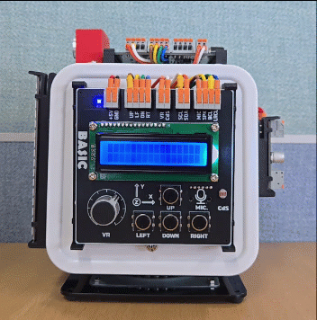</br>

> **한 걸음 더**  
> 1. TILT_THRESHOLD를 5/15/30으로 바꿔 가면서 기울기에 따른 결과를 확인해 보자.
> 2. Kalman1D 인스턴스를 만들 때 측정 노이즈(R)와 프로세스 노이즈(Q)의 기본값은 25, 4이다. 반응 속도가 느리다고 느껴지면 Q를 미세하게 올리거나, R을 내려본다. 반대로 여전히 노이즈가 심하다고 느껴지면 Q를 미세하게 내리거나, R을 올려본다.

### 오일러 값 읽기

> **풀고 싶은 문제**  
> IMU에는 가속도계와 자이로스코프가 함께 들어 있다. 기울기 각도를 오래 믿고 쓸 수 있는 쪽은 어느 센서일까. 그리고 수평면에서의 회전 방향, 즉 어느 방위를 향하고 있는지는 IMU만으로 알 수 있을까.

가속도계는 중력 방향을 직접 측정하므로, 장시간 경과하더라도 기준이 흐트러지지 않는다. 앞선 예제에서는 가속도 측정값에 atan2 수식을 직접 적용하여 기울기 각도를 계산했으나, 일반적인 IMU는 이러한 연산 과정과 IMU 장착 방향에 따른 보정을 내부에서 처리한 오일러 각(롤, 피치, 요)을 라디안 단위로 반환한다.

지자기 센서까지 포함한 9축 IMU라면 요 각도는 나침반처럼 절대 방향이지만, MPU-6050은 지자기 센서가 없으므로 상대적인 회전 각으로만 받아들어야 한다.

TiCLE Lite 라이브러리의 MPU6050 클래스는 MPU-6050의 DMP를 통해 반환되는 사원수 값을 연산을 통해 오일러 값으로 바꾸는데, 롤, 피치 요에 포함된 노이즈를 제거하기 위해 앞서 소개한 Kalman1D를 활용한다.

```python
# imu_euler.py
import math
import time
from ticle_lite.hd44780 import HD44780_PCF8574 as CharLCD
from ticle_lite.mpu6050 import MPU6050 as IMU
from ticle_lite.i2c import I2CController
from ufilter import Kalman1D

i2c = I2CController(sda=10, scl=11)        # GP10: SDA, GP11: SCL
lcd = CharLCD(i2c)
imu = IMU(i2c, mode=IMU.Mode.DMP_STABLE)  # Initialize IMU in DMP_STABLE mode

kalman_roll = Kalman1D(Q=2)   # 1D Kalman filter for roll
kalman_pitch = Kalman1D(Q=2)  # 1D Kalman filter for pitch
kalman_yaw = Kalman1D(Q=3)    # 1D Kalman filter for yaw

try:
    last_time = time.ticks_us()
    while True:
        now = time.ticks_us()
        dt = time.ticks_diff(now, last_time) / 1_000_000.0 # Convert to seconds
        last_time = now

        roll, pitch, yaw = imu.euler # Get Euler angles from IMU

        roll_d = round(math.degrees(kalman_roll.update(roll, dt)), 1)
        pitch_d = round(math.degrees(kalman_pitch.update(pitch, dt)), 1)
        yaw_d = round(math.degrees(kalman_yaw.update(yaw, dt)), 1)

        lcd.text(f"RL:{roll_d+0.0:4.1f} PT:{pitch_d+0.0:4.1f}", 0, 0)
        lcd.text(f"YW:{yaw_d:4.1f}  ", 0, 1)
        time.sleep_ms(100)
finally:
    imu.deinit()
    lcd.deinit()
```

**코드 해설**
MPU6050 클래스는 MPU-6050에 내장된 DMP로 얻은 사원수를 오일러 각으로 변환하므로 인스턴스를 생성할 때 mode 인자에 Mode.DMP_STABLE를 전달한다.

Kalman1D 인스턴스를 생성할 때 Q 값을 2로(기본값은 4)로 설정해 시스템의 물리적 변화(예측 수식)가 더 안정적이고 정확하다고 판단하도록 설정한다. 이렇게 하면 잡음이 줄어들어 데이터가 더 매끄러워지는 반면, 움직임에 대한 반응 속도(추종성)는 미세한 지연이 생길 수 있다.

round(..., 1)는 소수점 둘째 자리에서 반올림하여 결과를 소수점 첫째 자리까지 남긴다. 

**실행 결과와 확인할 점**

TiCLE Lite를 수평으로 움직임 없이 두면 롤과 피치 모두 $0^\circ$에 가까운 수치로 수렴한다. 좌우로 기울이면 roll 값이 변화하고, 앞뒤로 기울이면 pitch 값이 변화한다. TiCLE Lite를 수평 상태로 유지한 채 제자리에서 회전시키면 yaw 각도가 변화하며, 다시 초기 방향으로 회전시키면 $0^\circ$에 가까운 값으로 복귀한다. 다만 yaw 지자기 센서의 보정이 없는 상대적 회전량이기 때문에, 시간 경과에 따라 편차가 누적될 수 있다는 점을 유의해야 한다.

롤은 X축 회전, 피치는 Y축 회전이다. TiCLE Lite 전면(+X)이 땅을 향하면, pitch는 양(+) 방향으로 증가하고, 좌측면(+Y)이 땅을 향하면 roll은 음(-) 방향으로 감소한다.

임의의 한 축을 $90^\circ$ 부근까지 급격하게 기울이면 롤과 피치 성분이 서로 간섭을 일으키며 수치 왜곡이 발생하는데, 이는 센서의 오작동이 아니라 오일러 각도계의 정상적인 수학적 특성이다. 따라서 일반적인 기울기 계측 및 자세 제어 시스템에서는 신뢰성이 보장되는 $\pm45^\circ$ 이내의 범위에서 해당 데이터를 활용해야 한다.

</br>

> **한 걸음 더**  
> 1. 출력 주기를 20ms 또는 500ms로 바꾸면 어떤 변화를 보이는지 비교해 보자.
> 2. 반응 속도가 느리다고 느껴지면 Kalman1D의 Q를 미세하게 올리거나, R을 내려보자. 반대로 여전히 노이즈가 심하다고 느껴지면 Q를 미세하게 내리거나, R을 올려보자.
> 3. roll 또는 pitch가 30도를 넘으면 경고 문구를 출력하도록 조건문을 추가해 보자.

### 롤 각도를 서보모터에 적용하기

> **풀고 싶은 문제**  
> 몸체 좌표계를 손에 쥐고 좌우로 기울이면, 프레임 안에 내장된 서보 턴테이블이 반대 방향으로 회전한다. 턴테이블 위에 카메라나 센서를 올려두면 바디가 어느 쪽으로 기울어도 그 장치는 항상 같은 방향을 유지할 수 있다. 이것이 카메라 짐벌의 1축 손떨림 보정 원리이다.

앞선 예제에서는 imu.euler 속성을 통해 롤과 피치 값을 얻었다. 이번에는 롤 값을 서보 모터의 목표 각도로 활용한다. 보드의 기울어짐이 서보의 각도에 반영되어 기울어지는 방향으로 서보가 움직인다. 


```python
# imu_servo_feedback.py
import math
import time
from ticle_lite.hd44780 import HD44780_PCF8574 as CharLCD
from ticle_lite.mpu6050 import MPU6050 as IMU
from ticle_lite.i2c import I2CController
from ticle_lite.servo import Servo
from ufilter import Kalman1D

i2c = I2CController(sda=10, scl=11)  # GP10: SDA, GP11: SCL
lcd = CharLCD(i2c)
imu = IMU(i2c, mode=IMU.Mode.DMP_STABLE)
servo = Servo(1)

kalman_roll = Kalman1D(R=1000, Q=2)

try:
    servo.home()
    servo.wait()
    last_angle = None
    
    last_time = time.ticks_us()
    while True:
        now = time.ticks_us()
        dt = (now - last_time) / 1_000_000  # convert to seconds
        last_time = now
        
        roll, _, _ = imu.euler              # (roll, pitch, yaw)

        roll = math.degrees(roll)
        roll_smooth = kalman_roll.update(roll, dt)

        roll_control = max(-45, min(45, roll_smooth))
        angle = int(-roll_control * 2 + 90)    # -45 to 45 degrees -> 180~0 (inverted)

        if last_angle is None or abs(angle - last_angle) >= 2:
            servo.move_to(angle, ms=100)  
            last_angle = angle

        lcd.text(f"R:{roll:>5.1f} F:{roll_smooth:>5.1f}", 0, 0)
        lcd.text(f"Servo: {angle:>3d} deg", 0, 1)
        time.sleep_ms(20)
finally:
    servo.home()
    servo.wait()
    servo.deinit()
    imu.deinit()
    lcd.deinit()
```

**코드 해설**
서보모터의 각도 제어에 따라 TiCLE Lite가 구동되는 중에도 롤 각도를 지속적으로 계측하므로, 롤 각도 성분은 진동에 따른 잡음(노이즈)의 영향이 매우 크다. 따라서 Kalman1D 인스턴스를 생성할 때 측정 잡음 공분산($R$)과 시스템 잡음 공분산($Q$)의 비율인 $\frac{R}{Q}$ 값을 500으로 설정하여, 순시적인 롤 계측값을 과도하게 신뢰하지 않고 매우 완만하게 반영하도록 roll_smooth를 계산한다.

roll_control은 roll_smooth 변수를 $-45^\circ$에서 $45^\circ$ 사이의 범위로 임계 제한(Clamping)한 값이다. 이 임계 범위를 벗어난 기울기는 서보모터의 제한 각도로 처리되므로, 보드를 지나치게 기울이더라도 서보모터가 불안정하게 흔들리는 현상을 방지한다.

롤 값은 +Y 축이 지면을 향하면 음수, 반대 방향을 향하면 양수로 산출된다. 이에 따라 각도 변환식인 -roll_control * 2 + 90은 수평 상태($0^\circ$)를 서보모터의 중앙 위치($90^\circ$)에 동기화하고, 기체의 기울임 방향을 반전하도록 설계되었다. 결과적으로 TiCLE Lite를 좌측으로 $45^\circ$ 기울이면 서보모터는 $180^\circ$로, 우측으로 $45^\circ$ 기울이면 $0^\circ$로 구동된다.

last_angle은 목표 각도가 $2^\circ$ 이상 변동되었을 때만 새로운 제어 명령을 송신하기 위한 기준 변수이다. 관성 측정 장치(IMU)의 계측값이 미세하게 흔들릴 때마다 서보모터에 동작 명령을 주기적으로 인가하면 모터의 미세 진동 및 소음이 유발되므로, 유의미한 변위량만을 선별적으로 반영하여 제어 루프의 안정성이 향상된다.

move_to(angle, ms=100)는 서보모터가 목표 각도까지 100ms 동안 이동하도록 명령한 후 즉시 반환되므로, 기체의 기울기를 실시간으로 지연 없이 반영할 수 있다.

**실행 결과와 확인할 점**

TiCLE Lite가 수평일 때는 서보가 90도 전후에 머물러야 하며, 왼쪽으로 기울이면 각도가 늘고 오른쪽으로 기울이면 줄어야 한다. 약 45도 이상 기울이면 서보는 끝 각도에 머문다.

TiCLE Lite를 양손으로 들고 빠르게 기울이거나, 양방향으로 기울기를 변화시켜도 서보는 이를 실시간으로 따라 움직인다. 

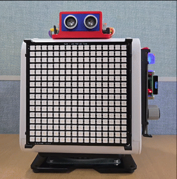</br>

> **한 걸음 더**  
> 1. Kalman1D의 R, Q 값을 조절해 최적의 조합을 찾아 보자.
> 2. TiCLE Lite 기울임에 따른 서보 각도 회전을 반전시켜 보자. 즉, 좌측으로 $45^\circ$ 기울이면 $0^\circ$로 이동해야 한다.
> 3. move_to()의 ms 인자를 20/80/150 등으로 조절하면서 움직임을 관찰하자.
> 4. roll 대신 pitch를 사용해 앞뒤 기울기로 서보를 제어해 보자. roll과 pitch를 서보 두 개에 각각 연결하면 2축 팬틸트 마운트 컨트롤러가 된다.

---

## SWI

> **풀고 싶은 문제**  
> 수십, 수백 개의 RGB LED를 개별적으로 제어하려면 수많은 제어 핀이나 복잡한 멀티플렉싱 회로가 필요해 시스템이 비대해진다. 단 한 가닥의 데이터선만으로 수많은 LED를 원하는 색상으로 동시 제어할 수 없을까. 이 질문의 답이 바로 WS2812 계열의 SWI 방식이다. 별도의 클록선이나 장치 주소 없이도, 데이터가 LED를 타고 흐르며 각자의 자리(순서)를 찾아간다.

SWI는 데이터를 전송하는 단 하나의 라인(DIN/DOUT)만을 이용해 수많은 LED 소자를 직렬(Cascade)로 연결하여 제어하는 단방향 비동기 직렬 통신 방식이다. 이 통신 방식은 마스터 기기가 매우 정밀한 타이밍의 펄스 신호를 생성하여 첫 번째 LED로 송신하며, 데이터를 받은 LED는 자신의 데이터를 흡수한 뒤 나머지 데이터를 다음 LED로 전달하는 방식으로 운영된다. 장치 고유의 하드웨어 주소가 없는 대신, 물리적으로 연결된 순서 자체가 곧 주소가 되는 것이 특징이다.

SWI 라인은 통신이 이루어지지 않을 때나 전송 마무리에 신호선을 로우(Low, 논리 0) 상태로 일정 시간 유지하여 시스템을 대기 및 갱신 상태로 둔다. 이러한 설계를 통해 별도의 클록선 없이도 단 한 가닥의 선만으로 수많은 LED의 색상 데이터를 충돌 없이 순차적으로 밀어 넣을 수 있다.

다음은 SWI 마스터와 LED 소자 사이 물리적인 통신 규약을 정리한 것이다.

- 비동기 NZR 타이밍 (Asynchronous NZR)
  - 별도의 동기화 클록(CLK) 라인을 사용하지 않는 대신, 신호선의 High 전압 유지 시간과 Low 전압 유지 시간의 비율을 정밀하게 제어하여 비트 데이터 '0'과 '1' 판별.
- 데이터 표현 방식 (Data Pepresentation)
  - 비트 '0' ($T_{0H} / T_{0L}$): 신호선이 High 상태를 유지하는 시간($T_{0H}$)을 짧게(약 0.4 us), Low 상태를 유지하는 시간($T_{0L}$)을 길게(약 0.85 us) 구성.
  - 비트 '1' ($T_{1H} / T_{1L}$): 신호선이 High 상태를 유지하는 시간($T_{1H}$)을 길게(약 0.8 us), Low 상태를 유지하는 시간($T_{1L}$)을 짧게(약 0.45 us) 구성.
- 데이터 직렬 전달 및 변환 메커니즘 (Data Cascading)
  - 각 LED 소자는 DIN 핀으로 입력된 데이터 스트림의 최전방 24비트(Green -> Red -> Blue 각 8비트 색상 데이터)를 자신의 내부 래치 레지스터에 저장.
  - 24비트가 채워진 후 뒤이어 들어오는 나머지 데이터 패킷은 내부 신호 파형을 깨끗하게 재정렬(Reshaping)하여 DOUT 핀을 통해 다음 직렬 연결된 LED 소자로 바이패스 전송.
- 리셋 및 래치 조건 (Reset / Latch Condition) 
  - 전체 LED 직렬 프레임 데이터 전송이 완료된 후, 신호선을 일정 시간(최신 데이터시트 기준 280 us 이상) 동안 지속적으로 Low 상태로 유지하면 이를 리셋(Reset) 신호로 인식.
  - 리셋 신호 감지 순간, 직렬로 연결된 모든 LED 소자가 각자 레지스터에 저장하고 있던 24비트 색상 데이터를 동시에 물리적 점등 상태로 동기화(Latch)하여 발광.

### Pixel Display 보드 제어
Pixel Display 보드는 SWI 기반으로 동작하는 WS2812 RGB LED 256개를 16 x 16 행렬 형태의 매트릭스(Matrix) 구조로 배치한 시각 디스플레이 모듈로 핀 매핑은 다음과 같다.

| Connection pin | Pin number |
| -------------- | ---------- |
| DIN | 0 |

**MicroPython에서 WS2812 매트릭스 제어**
MicroPython 환경에서는 내장 라이브러리인 neopixel.NeoPixel 클래스를 사용하여 각 픽셀 소자의 RGB 색상 값을 배열(Array) 형태의 프레임 버퍼 데이터로 지정하고 직접 제어한다. 전체 256개 픽셀의 색상 데이터를 1차원 직렬 배열로 차례대로 전송하는 구조이므로, 개별 LED 픽셀의 휘도 및 색상을 세밀하게 제어할 수 있다.

```python
import time
import machine
import neopixel

np = neopixel.NeoPixel(machine.Pin(0), 256)

np[0] = (255, 0, 0)
np[1] = (0, 255, 0)
np[2] = (0, 0, 255)
np.write()
time.sleep_ms(3000)

np.fill((0, 0, 0))  # all clear
np.write()
```

하지만 래픽 전용 라이브러리가 아닌 raw 프레임 버퍼를 직접 다루기 때문에 선, 원, 사각형 등의 도형이나 문자를 화면에 출력하려면 사용자가 2차원 좌표 (x, y)를 1차원 배열 인덱스로 직접 매핑하고 연산해야 하는 번거로움이 발생한다.

**TiCLE Lite 라이브러리로 WS2812 매트릭스 제어**
TiCLE Lite는 기존 MicroPython의 표준 neopixel 모듈을 사용하는 대신, 마이크로컨트롤러 내장 하드웨어인 PIO(Programmable I/O) 상태 머신을 활용하여 WS2812 구동 신호를 하드웨어 레벨에서 직접 생성하는 ws2812.Matrix 클래스를 제공한다. 프로세서의 개입을 최소화하므로 데이터 전송 신호의 정밀도와 제어 효율이 대폭 향상된다.

기존 NeoPixel 방식과 달리 2차원 대해 인덱스 슬라이싱 구문([X_start\[:end\[:step]], Y_start\[:end\[:step]]])을 지원하므로, 개발자가 별도의 인덱스 변환 연산 없이 매트릭스의 가로(x) 및 세로(y) 좌표 전체 범위를 2차원 직교좌표계 배열로 직접 제어할 수 있다.

```python
import time
from ticle_lite.ws2812 import Matrix

mat = Matrix(0, brightness=0.5) # default 256 (16x16)

mat[0, 0].value = (255, 0, 0)
mat[1, 0].value = (0, 255, 0)
mat[2, 0].value = (0, 0, 255)
mat.update()
time.sleep_ms(3000)

mat.deinit()
```

Matrix 클래스는 단일 픽셀 단위 제어뿐만 아니라, 그래픽 표현 및 문자 출력을 위한 상위 수준(High-Level)의 그래픽 메서드를 다양하게 기본 제공한다. 이를 통해 개발자는 번거롭고 복잡한 2차원 좌표 연산 로직을 직접 구현하지 않고도 직관적이고 효율적으로 디스플레이 화면을 연출할 수 있다.

### 픽셀 단위 출력

> **풀고 싶은 문제**  
> 한 점의 빛이 패널 테두리를 따라 한 칸씩 이동하는 애니메이션을 만들어 보자. 픽셀의 위치를 좌표로 직접 지정하고, 변경 내용을 화면에 반영하는 원리를 이해하면 이후 그리기 기능의 동작 방식을 파악할 수 있다.

Matrix 클래스는 mat[x, y].value 형태로 개별 픽셀의 색을 읽고 쓸 수 있다. 그리기 명령은 즉시 LED에 반영되지 않고 내부 프레임 버퍼에 기록되며, update()를 호출해야 버퍼 전체가 한꺼번에 LED로 전송된다. 이 두 단계 구조 덕분에 여러 픽셀을 연속으로 바꾸더라도 중간 상태가 화면에 나타나지 않아 깜빡임 없이 자연스러운 화면 전환이 가능하다.

```python
# pixel_value.py
import time
from ticle_lite.ws2812 import Matrix

mat = Matrix(0, brightness=0.2)  # GP0: Pixel Display, set brightness to 20%

INTERVAL = 50 # ms
black = (0, 0, 0)
w, h = mat.width, mat.height

edges = [
    (0, 1, w, (255, 0, 0)),        # Top edge (x movement)
    (1, 1, h, (0, 255, 0)),        # Right edge (y movement)
    (2, w-2, -1, (255, 255, 0)),   # Bottom edge (x reverse movement)
    (3, h-2, -1, (255, 0, 255))    # Left edge (y reverse movement)
]

for side, start, end, color in edges:
    # Set step to -1 for reverse movement (bottom, left)
    step = -1 if start > end else 1
    
    for i in range(start, end, step):
        # Calculate coordinates to turn on and off based on current direction (side)
        if side == 0:    # Top edge (y=0 fixed, x=i)
            mat[i-step, 0].value = black
            mat[i, 0].value = color
        elif side == 1:  # Right edge (x=w-1 fixed, y=i)
            mat[w-1, i-step].value = black
            mat[w-1, i].value = color
        elif side == 2:  # Bottom edge (y=h-1 fixed, x=i)
            mat[i+1, h-1].value = black
            mat[i, h-1].value = color
        elif side == 3:  # Left edge (x=0 fixed, y=i)
            mat[0, i+1].value = black
            mat[0, i].value = color
            
        mat.update()
        time.sleep_ms(INTERVAL)

mat.deinit()
```

**코드 해설**

Matrix(0, brightness=0.2)는 GPIO 0번 핀에 연결된 16×16 LED 패널을 초기화한다. brightness=0.2는 최대 밝기의 20%로 설정하는 것인데, 너무 밝으면 눈이 피로해지고 전류 소모도 크므로 실습에서는 0.1~0.3 범위가 적당하다.

mat.width와 mat.height는 패널의 가로, 세로 픽셀 수를 반환한다. 값을 상수로 고정하지 않고 속성으로 읽으면 패널 크기가 달라져도 코드를 수정할 필요가 없다.

edges 리스트는 네 방향의 이동을 묶어 정의한다. 각 항목은 방향 인덱스, 시작 위치, 끝 위치, 색으로 구성되며, 시작이 끝보다 크면 역방향이므로 step = -1을 쓴다.

mat[x, y].value = color는 좌표 (x, y)에 해당하는 픽셀을 지정 색으로 설정한다. (0, 0)은 패널의 왼쪽 위 모서리이며, x는 오른쪽, y는 아래쪽이 양의 방향이다. 루프 안에서 이전 픽셀에 black을 덮어 쓰고 새 위치에 색을 켜면, 빛이 한 칸씩 이동하는 효과가 만들어진다.

mat.update()는 프레임 버퍼에 쌓인 변경 사항을 실제 LED로 전송한다. 이전 픽셀 소등과 새 픽셀 점등이라는 두 가지 변경이 update() 한 번에 동시에 반영되므로 중간 상태가 화면에 나타나지 않는다.

**실행 결과와 확인할 점**

빨간 점이 위쪽 가장자리를 오른쪽으로, 초록 점이 오른쪽 가장자리를 아래로, 노란 점이 아래쪽 가장자리를 왼쪽으로, 분홍 점이 왼쪽 가장자리를 위로 이동한다. 각 모서리에서 색이 바뀌므로 네 방향을 구분할 수 있다. INTERVAL 값을 줄이면 이동이 빨라지고, 늘리면 느려진다.

> **한 걸음 더**  
> 1. INTERVAL을 5/50/100/500을 변경한 후 변화를 확인하자.
> 2. 다음 코드는 위 예제와 완전히 동일한 결과를 보인다. 차이점이 무엇인가?
>     ```python
>     # pixel_value_for.py
>     ...
>     mat[0, 0].value = (255, 0, 0)
>     mat.update()
>     time.sleep_ms(INTERVAL)
>     
>     for x in range(1, W):  # last x is W - 1
>         mat[x-1, 0].value = BLACK
>         mat[x, 0].value = (255, 0, 0)
>         mat.update()
>         time.sleep_ms(INTERVAL)
>     
>     for y in range(1, H): # last y is H - 1
>         mat[x, y-1].value = BLACK  # x is last x from previous loop
>         mat[x, y].value = (0, 255, 0)
>         mat.update()
>         time.sleep_ms(INTERVAL)
>     
>     for x in range(W-2, -1, -1):  
>         mat[x+1, y].value = BLACK  # y is last y from previous loop
>         mat[x, y].value = (255, 255, 0)
>         mat.update()
>         time.sleep_ms(INTERVAL)
>     
>     for y in range(H-2, -1, -1):
>         mat[x, y+1].value = BLACK # x is last x from previous loop
>         mat[x, y].value = (255, 0, 255)
>         mat.update()
>         time.sleep_ms(INTERVAL)
>     
>     mat.deinit()
>     ```
> 3. 점 이동 대신 한 번에 선이 그려지도록 코드를 수정(pixel_value_line.py)해 보자. 

### 카운트 다운
> **풀고 싶은 문제**  
>  3,2,1처럼 경기 시작을 알리는 카운트다운을 화면에 띄우고 싶다. 패널 그리기의 기본은 언제나 배경 -> 테두리 -> 내용 -> 반영의 네 단계이다. 이 리듬을 세 번 반복하면 카운트다운이 완성된다.

앞선 예제에서는 mat[x, y].value로 픽셀을 하나씩 제어했다. 이 방식은 직접적이지만, 숫자나 도형을 표현하려면 그 모양을 이루는 픽셀 좌표를 하나하나 계산해야 한다. 예를 들어 숫자 "3"을 그리려면 그 글자를 구성하는 어느 픽셀을 켜야 하는지 모두 직접 지정해야 한다. Matrix 클래스는 이런 반복 작업을 대신하는 추상화된 그리기 함수를 제공한다.

화면을 바꾸는 일은 항상 같은 순서를 따른다. fill()로 배경을 채우고, 그 위에 도형과 문자를 올린 뒤, update()를 호출해야 실제 LED에 반영된다. 다음 예제는 이 흐름을 3->2->1 카운트다운으로 반복한다.

TiCLE Lite에 포함된 폰트는 글자 높이가 16픽셀이어서 한 글자가 패널 세로 전체를 채운다. 숫자 글자의 가로 픽셀은 10픽셀이다. 따라서 여러 글자를 정적으로 나열하는 대신, 숫자 한 자리를 화면 중앙에 크게 배치하는 방식이 16×16 패널에서 가장 자연스럽다.

```python
# pixel_countdown.py
import time
from ticle_lite.ws2812 import Matrix

mat = Matrix(0, brightness=0.2) # Pixel Display to GPIO0, set brightness to 20%

phases = [
    {"bg": (25,  0,  0), "frame": (180, 20,  0), "digit": "3", "fg": (255, 120, 120)},
    {"bg": (20, 12,  0), "frame": (160,120,  0), "digit": "2", "fg": (255, 220, 120)},
    {"bg": ( 0, 20,  0), "frame": (  0,160, 20), "digit": "1", "fg": (140, 255, 160)},
]

for phase in phases:
    mat.fill(phase["bg"])
    mat.draw_rect(0, 0, 16, 16, phase["frame"])
    mat.draw_text(phase["digit"], x=4 if phase["digit"] == "1" else 3, y=0, fg=phase["fg"], bg=None)
    mat.draw_line(3, 8, 12, 8, phase["frame"])
    mat.update()
    time.sleep_ms(1000)

mat.fill((200, 200, 200))
mat.update()
time.sleep_ms(300)
mat.deinit()
```

**코드 해설**

phases 리스트에는 배경색, 테두리 색, 숫자 문자, 숫자 색을 묶어 놓았다. 반복문은 이 세 단계를 순서대로 꺼내 같은 구조로 화면을 그린다.

각 단계의 화면은 네 개의 그리기 명령을 순서대로 쌓아 완성한다.

fill()은 지정한 색으로 패널 전체를 덮어 이전 화면의 흔적을 없앤다. 배경색을 먼저 깔지 않으면 앞 단계의 잔상이 남으므로 매 단계 첫 번째 명령으로 항상 호출한다.

draw_rect(0, 0, 16, 16, ...)는 패널 가장자리를 따라 테두리를 그린다. fill 인자를 생략하면 내부는 채우지 않고 윤곽선만 그리므로, 배경색 위에 얇은 프레임 효과가 남는다.

draw_text()는 숫자 한 글자를 y=0에 출력한다. pixel.bin 폰트의 글자 높이는 16픽셀로 패널 세로 전체를 채우므로, y=0이 글자가 잘리지 않는 유일한 위치이다. 숫자 "1"은 잉크 폭이 6픽셀로 나머지 숫자(10픽셀)보다 좁기 때문에, x를 4로 따로 지정해 가로 중앙을 맞춘다. bg=None을 전달하면 잉크 픽셀만 덮어쓰고 나머지 픽셀은 배경색 그대로 유지되므로, 앞서 그린 테두리가 가려지지 않는다.

draw_line(3, 8, 12, 8, ...)은 화면 가로 중앙(y=8)에 짧은 강조선을 추가한다. 이 선은 숫자 잉크 픽셀이 없는 배경 영역을 지나기 때문에 숫자 가독성에 영향을 주지 않으면서도 단계마다 같은 위치에 반복되어 화면 전환에 리듬감을 더한다.

update()를 호출해야 이 네 단계의 결과가 한꺼번에 LED에 반영된다. 반복문이 끝난 뒤에는 화면 전체를 밝게 채워 카운트다운이 끝났음을 알리고 프로그램을 종료한다.

**실행 결과와 확인할 점**

3, 2, 1이 각기 다른 배경색과 강조선으로 1초 간격을 두고 순서대로 표시된다. 3은 어두운 빨간 배경, 2는 주황 계열, 1은 초록 계열로 바뀐다. 카운트다운이 끝나면 전체 화면이 밝은 회색으로 한순간 켜졌다가 꺼진다. phases 리스트의 bg, frame, fg 색을 바꾸어 원하는 색 조합을 만들어 보자.

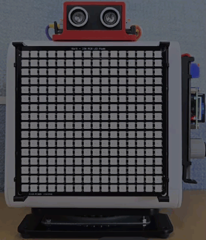</br>

> **한 걸음 더**  
> phases 리스트에 5,4,3,2,1 다섯 단계를 넣으면 그대로 다섯 고개 카운트다운이 된다. 데이터를 바꾸는 것만으로 동작이 확장되는 설계 패턴을 체감해 보자.

### 텍스트 스크롤

> **풀고 싶은 문제**  
> 주식 시세 전광판, 버스의 다음 정거장 안내, 공장의 안전 메시지는 왜 모두 글자가 흐를까. 정지된 글자보다 움직이는 글자가 훨씬 잘 보이고, 좌우로 긴 문장도 작은 화면 안에 담을 수 있기 때문이다.

이번에는 버튼과 조합해 draw_text_scroll() 메서드로 움직이는 글자를 만들어 본다. 같은 문자열이라도 정지 화면보다 스크롤 화면이 더 눈에 잘 띄기 때문에 안내판, 알림 장치, 게임 화면 등에 자주 쓰인다.

draw_text_scroll()은 논블로킹 방식으로 문자열을 출력하므로 스크롤 중에도 다른 작업이 가능하며, 전경색(기본값, fg=(255,255,255))과 배경색(기본값, bg=(0,0,0))을 비롯해 스크롤 방향(기본값, direction="left"), 스크롤 스탭 간격(기본값, step_px=1), 스크롤 속도(기본값, speed_ms=0) 등을 세밀하게 지정할 수 있다.

```python
# pixel_text_scroll.py
from ticle_lite.ws2812 import Matrix
from ticle_lite.button import Button

mat = Matrix(0, brightness=0.2)
btn = Button([16, 17, 19])       # GP16: Up, GP17: Left, GP19: Right

msg = (
    (
        "Hello, TiCLE!",
        (0, 180, 255),
        20,
    ),
    (
        "This is a scrolling text example.",
        mat.shader_rainbow((255, 0, 0), (0, 0, 255)),
        50,
    ),
    (
        "And this is a snowflake shader.",
        mat.shader_snowflake((255, 255, 255), (0, 0, 255)),
        30,
    )
)

mat.clear()
try:
    for text, color, speed_ms in msg:
        mat.draw_text_scroll(text, fg=color, speed_ms=speed_ms)
        while mat.is_scrolling():
            for idx in btn.update(Button.PRESS):  # Check for button press events only  
                if idx == 0:  # Up 
                    mat.stop_scroll()
                elif idx == 1:  # Left
                    mat.pause_scroll()
                elif idx == 2:  # Right
                    mat.resume_scroll()
finally:
    mat.deinit()
```

**코드 해설**

msg는 출력할 문자열과 전경색, 스크롤 속도를 테이블 형식으로 만든 것이다. 전경색은 (R, G, B) 형식의 단색 외에 여러 색상 조합이나 특정 패턴 형태를 지정하는 쉐이더도 지원하는데, shader_rainbow()와 shader_snowflake()는 무지개 패턴과 눈꽃 패턴을 생성한다.

clear()는 fill(0, 0, 0) + update()와 같이 Pixel Display 보드 전체를 지우고, is_scrolling()은 현재 스크롤 중이면 True를 반환한다. stop_scroll()은 현재 진행 중인 스크롤을 종료하고, pause_scroll()은 중단, resume_scroll()은 재개한다. 

**실행 결과와 확인할 점**

첫 번째 문자열은 각 문자가 cyan(0, 180, 255) 단색으로 20ms 속도로 스크롤되며, LEFT 버튼을 누르면 멈추고, RIGHT 버튼을 누르면 재개한다. UP 버튼을 누르면 현재 진행 중인 스크롤을 중단하고 다음 문자열을 스크롤 한다.

두 번째 문자열의 각 문자는 무지개처럼 빨간색에서 파란색으로 이어지는 색상 변화가 전경색으로 사용되고, 세 번째 문자열의 각 문자는 흰색과 파란색으로 구성된 눈꽃 모양의 전경색을 갖는다.

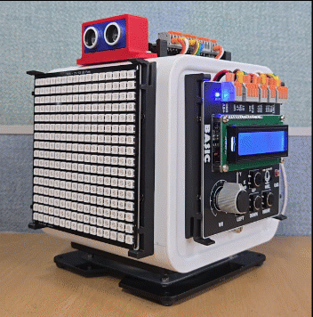</br>

### 픽셀 디스플레이를 N개의 RGB LED로 표현하기

> **이 예제로 풀 문제**  
> 앞에서 도형을 그릴 때는 draw_rect()에 좌표를 직접 써 넣었다. 패널을 네 개의 독립 LED처럼 쓰고 싶은데, LED마다 좌표를 일일이 계산해 전달하지 않고 번호 하나만으로 색을 지정할 수 있을까?

draw_rect()는 패널의 특정 사각형 영역만 선택적으로 채울 수 있다. 이 특성을 이용하면 16×16 패널을 여러 구역으로 나누고, 각 구역을 독립된 하나의 RGB LED처럼 다룰 수 있다.

이 예제에서는 람다 rgb_led를 RGB LED 드라이버로 정의한다. 구역 번호와 r, g, b 값을 인자로 전달하면, 람다가 해당 구역의 draw_rect() 호출로 변환한다. 이후 코드는 좌표를 직접 계산하지 않고 몇 번 LED를 무슨 색으로 켤지만 결정하면 된다.

```python
# pixel_rgb_leds.py
import time
from ticle_lite.ws2812 import Matrix

mat = Matrix(0, brightness=0.2)

# Divide the 16x16 panel into 4 zones in a 2x2 grid. (x, y, w, h)
zones = [(1, 1, 6, 6), (9, 1, 6, 6), (1, 9, 6, 6), (9, 9, 6, 6)]

# rgb_led: takes zone index i and color r, g, b; fills the zone with a white border.
rgb_led = lambda i, r, g, b: mat.draw_rect(
    zones[i][0], zones[i][1], zones[i][2], zones[i][3],
    (255, 255, 255), fill=(r, g, b)
)

# Map 0~255 to the color wheel R->G->B->R.
wheel = lambda s: (
    (255 - s * 3, s * 3, 0) if s <  85 else
    (0, 255 - (s - 85) * 3, (s - 85) * 3) if s < 170 else
    ((s - 170) * 3, 0, 255 - (s - 170) * 3)
)

try:
    for step in range(256):
        mat.fill((0, 0, 0))
        for i in range(4):
            # Offset each LED's phase by 64 steps to display different colors.
            r, g, b = wheel((step + i * 64) % 256)
            rgb_led(i, r, g, b)
        mat.update()
        time.sleep_ms(20)
finally:
    mat.clear()
    mat.deinit()
```

**코드 해설**

zones 리스트는 패널을 네 개의 사각형 구역으로 나누는 좌표 정보이다. 왼쪽 위, 오른쪽 위, 왼쪽 아래, 오른쪽 아래 순으로 배치하면 2×2 배열이 된다. 각 항목의 값은 draw_rect()에 전달할 (x, y, w, h)이다.

lambda(람다)는 복잡한 과정 없이 함수 호출이 필요한 자리에 이름 없는 함수를 간단히 정의해 쓰는 것으로 '이름 = lambda 인자들: 식'은 재사용을 위해 람다에 이름 붙인 것이다. def로 쓴 것과 결과는 같으며, 한 줄로 끝나는 도우미 함수를 만들 때 편리하다. 

rgb_led 람다는 '구역 번호 + 색' 이라는 의도만 남기고 좌표 계산을 숨긴다. 구역 번호 i와 r, g, b 세 값을 받아 zones[i]의 좌표를 꺼내 draw_rect()를 호출하는데, 이 람다 하나가 RGB LED 드라이버 역할을 하므로 이후 코드에서는 좌표 대신 LED 번호와 색만 다루면 된다. 구역 크기나 위치를 바꾸고 싶을 때도 zones 한 줄만 수정하면 전체가 바뀐다.

wheel 람다는 0~255 범위를 세 구간으로 나누어 R->G, G->B, B->R 전환을 담당한다. 반복문에서 각 LED에 (step + i × 64) % 256을 전달하면, LED마다 색상환 위의 시작 위치가 64단계(= 색상환의 1/4)씩 어긋난다. 따라서 네 LED는 항상 서로 다른 색을 동시에 표현한다.

'(255 - s*3, s*3, 0) if s < 85 else ...' 형태는 삼항 연산자(조건부 식)이다. 조건이 참이면 앞의 값, 아니면 else 뒤의 값"을 고른다. 세 구간을 구분하는 이 예제처럼 if/elif/else 여러 줄 대신 한 표현으로 압축할 수 있다. 단, 너무 많이 쓰면 읽기가 어려워지므로 적절한 곳에 쓰는 감각이 중요하다.


**실행 결과와 확인할 점**

네 구역이 동시에 서로 다른 색으로 빛나면서 색상환을 따라 서서히 바뀌어야 한다. 어느 시점이든 인접한 두 LED는 색상환에서 약 90도씩 떨어진 색을 띤다. draw_rect()를 draw_ellipse()로 교체하면 각 구역이 원형 LED 모양으로 바뀐다. zones 리스트의 좌표나 항목 수를 바꾸면 LED 배열 자체를 자유롭게 재설계할 수 있다.

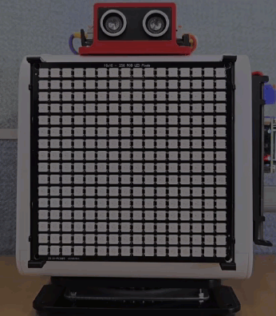</br>

### 반응 속도 게임

> **풀고 싶은 문제**  
> 화면에 빨간 표적이 나타나는 순간 버튼을 눌러 반응 시간을 ms 단위로 측정하는 게임을 만들어 보자. 이 장에서 배운 버튼 입력, 시간 계산, 화면 출력이 하나의 흐름으로 이어지는 첫 번째 완성 프로그램이다.

본 예제는 픽셀 디스플레이에 빨간색 표적이 나타나는 순간 버튼을 눌러 반응 시간을 밀리초(ms) 단위로 측정하는 게임이다. 이는 버튼 동작과 시간 연산, 캐릭터 LCD, Pixel Display 보드 출력이 하나의 유기적인 흐름으로 연결된다는 점에서, 단순한 LED 점멸 제어보다 한 단계 발전된 완성형 프로그램 실습이다.

```python
# pixel_reaction_game.py
import time
from ticle_lite.button import Button
from ticle_lite.i2c import I2CController
from ticle_lite.hd44780 import HD44780_PCF8574 as CharLCD
from ticle_lite.ws2812 import Matrix

btn = Button(16)                     # GP16: UP
i2c = I2CController(sda=10, scl=11)  # GP10: SDA, GP11: SCL
lcd = CharLCD(i2c)
mat = Matrix(0, brightness=0.2)

def show_wait():
    mat.fill((0, 0, 0))
    mat.draw_text_scroll_blocking(
        "Wait",
        fg=(0, 100, 255),
        direction="left",
        speed_ms=50,
        update_flag=True,
    )

def show_target():
    mat.fill((0, 0, 0))
    mat.draw_rect(5, 5, 6, 6, (255, 60, 60), fill=(255, 60, 60))
    mat.update()

try:
    reaction_ms_list = []
    
    for round_no in range(3):
        show_wait()
        time.sleep_ms(1000 + (time.ticks_ms() % 2000))

        show_target()
        
        start = time.ticks_ms()
        while not btn.update(Button.PRESS): pass
        reaction_ms = time.ticks_diff(time.ticks_ms(), start)

        lcd.text(f"Round {round_no + 1}", 0, 0)
        lcd.text(f"{reaction_ms} ms", 0, 1)
        reaction_ms_list.append(reaction_ms)
        
        mat.fill((0, 255, 0))
        mat.update()
        time.sleep_ms(200)
        mat.fill((0, 0, 0))
        mat.update()

    time.sleep_ms(200)
    lcd.text(f"AVG: {sum(reaction_ms_list) // len(reaction_ms_list)} ms", 0, 0)
    lcd.text(f"BEST: {min(reaction_ms_list)} ms", 0, 1)
    while not btn.update(Button.PRESS): pass

finally:
    mat.clear()
    mat.deinit()
    lcd.deinit()
    btn.deinit()
```
 
**코드 해설**

show_wait()와 show_target()은 픽셀 디스플레이의 화면 상태를 제어하는 함수이다. 이처럼 특정 화면 연출을 독립된 함수로 분리하면 메인 루프의 흐름과 프로그램의 제어 의도를 명확히 파악할 수 있으며, 향후 연출 내용을 변경할 때도 해당 함수만 수정하면 되므로 코드의 유지보수성이 향상된다.

대기 상태를 표시하는 show_wait() 내부의 draw_text_scroll_blocking()는 텍스트가 화면에서 완전히 스크롤되어 사라질 때까지 프로그램의 제어권을 점유(블로킹)한다는 점을 제외하면, 앞서 학습한 비동기식 draw_text_scroll()와 동작이 동일하다.

ticks_ms()는 Core 보드가 부팅된 이후 경과한 시간을 밀리초 단위로 반환한다. show_target()를 통해 화면에 빨간 사각형 표적이 표시된 시점의 시간 데이터를 start 변수에 저장한 뒤, 사용자가 버튼을 눌렀을 때의 현재 시간을 다시 측정한다. 이후 두 시간값의 차이를 ticks_diff()로 연산하면 표적이 나타난 순간부터 버튼을 누를 때까지 걸린 실제 반응 시간을 정확하게 산출할 수 있다.

각 라운드별로 측정된 반응 시간은 리스트(reaction_ms_list)에 순차적으로 누적 저장되며 동시에 캐릭터 LCD에도 실시간으로 표시된다. 총 3라운드의 게임이 종료되면 리스트에 저장된 정수 데이터를 활용하여 산술 평균 시간과 최저(최고 속도) 반응 시간을 계산하여 화면에 출력하고, 사용자가 다시 버튼을 누를 때까지 대기 상태를 유지한다.

**실행 결과와 확인할 점**

픽셀 디스플레이에 빨간색 사각형 표적이 표시된 이후 UP 버튼을 빠르게 누를수록 계산되는 반응 시간의 수치가 감소한다. 주변 사람들과 번갈아 가며 게임을 실행하여 누구의 반응 속도가 더 빠른지 비교할 수 있으며, 여러 번 반복 수행하여 도출된 평균값을 비교해 보는 것도 유익한 활동이다. 

이와 같은 실습은 피지컬컴퓨팅이 단순히 물리적인 장치를 제어하는 수준을 넘어, 데이터를 계측 및 수집하고 이를 분석/비교하는 훌륭한 도구로 활용될 수 있음을 보여 준다.

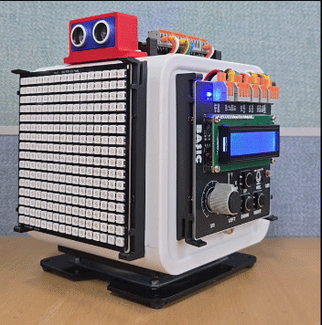</br>

> **한 걸음 더 (reaction_game_refect.py)**  
> 1. 현재 대기 시간(time.sleep_ms)은 내부적으로 시스템 시간값을 연산하여 1초에서 3초 사이의 무작위 값으로 결정된다. 이 대기 시간을 random 모듈의 randint() 함수로 대체해 보자.
> 2. 표적이 나타나기 전에 사용자가 버튼을 미리 누르는 부정행위(예측 출발)를 감지하고 경고 메시지를 출력하도록 코드를 개선해 보자.
> 3. 현재 예제는 3라운드 동안의 평균 반응 시간과 최저 반응 시간만을 산출한다. 3라운드 중 가장 느리게 반응한 최고(Maximum) 반응 시간을 함께 캐릭터 LCD에 출력해 보자.

### 픽셀 3D 뷰어 만들기

> **풀고 싶은 문제**  
> Pixel Display 보드 위에서 VR과 CdS, Button으로 끊김 없이 부드러운 실시간 3D 렌더링을 구현할 수 있을까?

본 예제는 픽셀 디스플레이에 3차원 공간의 정육면체(Cube) 모델을 투영하고, VR과 버튼을 활용해 이를 실시간으로 제어하는 시각화 시스템이다. VR과 CdS, 모드 전환을 위한 버튼, 상태 정보 표시를 위한 캐릭터 LCD, 그리고 복잡한 그래픽 렌더링을 수행하는 픽셀 디스플레이를 유기적으로 결합한다. 특히 평면(2차원) 스크린의 한계를 극복하기 위해 3차원 정점 데이터를 삼각함수 연산을 통해 2차원 화면 좌표로 변환하는 3차원 투영 회전 알고리즘을 구현하여, 단순한 입출력 제어를 넘어선 수준 높은 그래픽스 프로그래밍 기법을 학습할 수 있는 종합 실습 과정이다.

CdS나 VR의 출력값에 포함된 노이즈 제거는 지수 이동 평균(EMA, Exponential Moving Average) 필터로 해결할 수 있는데, EMA는 직전 단계의 필터 출력값과 현재 센서 측정값에 각각 차등 가중치를 적용하는 방식이다. 이 방식은 과거의 모든 데이터를 누적하여 저장할 필요가 없어 메모리 소모가 적고, 실시간으로 잡음을 감쇄하여 신호를 매끄럽게 다듬어 주는 재귀적 연산 특징을 지닌다.

따라서 Alpha 인스턴스를 생성한 후 이를 Ain.filtered() 함수의 인수로 전달하면, 미세하게 흔들리는 ADC의 초기 측정값을 실시간으로 평활화하므로 사용자는 신뢰성 높은 데이터를 입력값으로 활용할 수 있다.

```python
# pixel_cube_controller.py
import math
import time
from ticle_lite.ain import Ain
from ticle_lite.button import Button
from ticle_lite.i2c import I2CController
from ticle_lite.hd44780 import HD44780_PCF8574 as CharLCD
from ticle_lite.ws2812 import Matrix
from ufilter import Alpha

ain = Ain([27, 28], bits=12)    # GP27: VR, GP28: CDS, 12-bit ADC
btn = Button([16, 17, 18, 19])  # GP16: UP, GP17: LEFT, GP18: DOWN, GP19: RIGHT
i2c = I2CController(sda=10, scl=11) 
lcd = CharLCD(i2c)
mat = Matrix(0, brightness=0.2)

w, h = mat.width, mat.height
CX, CY = (w - 1) / 2.0, (h - 1) / 2.0 
COLOR_CUBE = (0, 255, 255)
COLOR_BLACK = (0, 0, 0)

f_vr  = Alpha(0.2)
f_cds = Alpha(0.4)

# real-time current angle reflected in actual rendering
current_elev = 45.0  
current_azim = 45.0  
current_scale = 4.5  

# Target angles/scales that will smoothly approach based on VR, Button
target_elev = 45.0
target_azim = 45.0
target_scale = 4.5

# Variable to track VR changes
prev_vr_angle = None  

# Rotation mode (0: horizontal rotation [RIGHT], 1: vertical rotation [LEFT])
rot_mode = 0  

def project_vertices(elevation_deg, azimuth_deg, cube_scale):
    vertices_3d = [
        [-1, -1, -1], [1, -1, -1], [1, 1, -1], [-1, 1, -1],
        [-1, -1,  1], [1, -1,  1], [1, 1,  1], [-1, 1,  1]
    ]
    
    phi = math.radians(elevation_deg)
    theta = math.radians(azimuth_deg)
    cos_phi, sin_phi = math.cos(phi), math.sin(phi)
    cos_theta, sin_theta = math.cos(theta), math.sin(theta)

    vertices_2d = []
    for x, y, z in vertices_3d:
        u_logic = CX + (x * cos_theta - z * sin_theta) * cube_scale
        v_logic = CY - (y * cos_phi + (x * sin_theta + z * cos_theta) * sin_phi) * cube_scale
        vertices_2d.append((int(round(u_logic)), int(round(v_logic))))
    return vertices_2d

edges = [
    (0, 1), (1, 2), (2, 3), (3, 0),
    (4, 5), (5, 6), (6, 7), (7, 4),
    (0, 4), (1, 5), (2, 6), (3, 7)
]

try:
    mat.clear()
    
    while True:
        smooth_vr = int(ain[0].filtered(f_vr))
        smooth_cds = int(ain[1].filtered(f_cds))
        
        mat.brightness = 0.05 + (smooth_cds / 4095) * 0.55
        
        for idx in btn.update(Button.PRESS):
            if idx == 0:    # UP: increase target scale
                target_scale = min(7.0, target_scale + 0.5)
            elif idx == 2:  # DOWN: decrease target scale
                target_scale = max(1.5, target_scale - 0.5)
            elif idx == 1:  # LEFT: change vertical rotation control
                target_elev = current_elev
                target_azim = current_azim
                rot_mode = 1
            elif idx == 3:  # RIGHT: change horizontal rotation control
                target_elev = current_elev
                target_azim = current_azim
                rot_mode = 0

        # Convert VR analog value to angle (0 ~ 360 degrees)
        vr_step = (smooth_vr * 9) // 4095
        vr_angle = vr_step * 40.0
        
        # Initialize previous VR angle at the start
        if prev_vr_angle is None:
            prev_vr_angle = vr_angle

        delta_angle = vr_angle - prev_vr_angle
        
        # Handle exceptions at the ends of the variable resistor
        if abs(delta_angle) > 180.0:
            delta_angle = 0.0
            
        # Backup current VR angle for the next loop
        prev_vr_angle = vr_angle

        if rot_mode == 0:   # RIGHT (horizontal): accumulate azimuth target
            target_azim += delta_angle
        elif rot_mode == 1: # LEFT (vertical): accumulate elevation target
            target_elev += delta_angle

        # Normalize to prevent target angles from diverging too much
        target_azim %= 360.0
        target_elev %= 360.0

        # current angles smoothly approach target angles by 15% per frame
        current_scale += (target_scale - current_scale) * 0.15
        current_elev += (target_elev - current_elev) * 0.15
        current_azim += (target_azim - current_azim) * 0.15

        vertices_2d = project_vertices(
            elevation_deg=current_elev, 
            azimuth_deg=current_azim, 
            cube_scale=current_scale
        )        
        
        mat.fill(COLOR_BLACK)
        
        # Apply precise rendering to prevent distortion (fast=False)
        for p1, p2 in edges:
            x0, y0 = vertices_2d[p1]
            x1, y1 = vertices_2d[p2]
            mat.draw_line(x0, y0, x1, y1, COLOR_CUBE, False)
            
        mat.update()
        
        mode_name = "V-ROT" if rot_mode == 1 else "H-ROT"
        lcd.text(f"VR:{smooth_vr:4d} S:{vr_step}", 0, 0)
        lcd.text(f"M:{mode_name} SC:{current_scale:.1f}", 0, 1)
        
        time.sleep_ms(20)

finally:
    mat.deinit()
    ain.deinit()
    lcd.deinit()
    btn.deinit()
```

**코드 해설**
Alpha(0.2)와 Alpha(0.4)는 새로 입력되는 샘플 데이터의 반영 비중을 각각 20%, 40%로 설정한 EMA 필터를 생성하며, 이에 따라 ain[0].filtered()와 ain[1].filtered()는 해당 필터를 거치며 급격한 값의 변화가 제거된 VR 및 CdS의 12비트 ADC 변환 값을 반환한다. 

project_vertices() 함수는 3차원 정점 좌표를 입력받아 삼각함수 공식(사인, 코사인)을 적용하여 화면에 표시될 2차원 $X, Y$ 좌표로 변환하는 핵심 연산 함수이다. 수학적으로 정의된 8개의 3차원 정육면체 정점 데이터(vertices_3d)에 사용자가 제어하는 고도각(elevation_deg)과 방위각(azimuth_deg), 스케일(cube_scale)을 곱하여 픽셀 디스플레이의 가로/세로 규격(16x16)에 맞게 재투영한다. 변환 과정에서 화면 중심 좌표인 CX와 CY를 기준으로 회전 중심을 정렬함으로써 그래픽 왜곡 현상을 방지한다.

target_scale, target_elev, target_azim 변수는 사용자의 조작에 의해 최종 도달해야 하는 목표 상태값이며, current_scale, current_elev, current_azim 변수는 실제 화면에 실시간으로 반영되는 현재 상태값이다. 매 루프마다 현재 값이 목표 값을 향해 매끄럽게 다가가도록 선형 보간(Linear Interpolation) 수식인 current += (target - current) * 0.15를 적용한다. 이와 같은 수학적 보간법을 활용하면 입력 장치의 불연속적인 값 변화나 잡음 요소를 상쇄하여, 3차원 그래픽이 끊기지 않고 물 흐르듯 부드럽게 움직이는 시각적 효과를 구현할 수 있다.

메인 루프 내부에서는 VR 아날로그 계측값인 0 ~ 4095 스케일을 9단계의 분해능(vr_step)으로 나눈 뒤, 이를 $40.0^\circ$ 단위의 이산적인 각도(vr_angle)로 변환한다. 사용자가 LEFT 버튼(UP 및 DOWN을 통한 배율 제어 외에 회전 모드를 수직 회전으로 설정)을 누르면 회전 제어 변수인 rot_mode가 1(V-ROT)로 전환되며, RIGHT 버튼을 누르면 rot_mode가 0(H-ROT)으로 전환된다. 이때 축이 전환되면서 각도가 급격하게 뒤틀리는 연산 예외를 방지하기 위해, 모드를 전환하는 순간 현재 부드럽게 연산되고 있던 실시간 각도 성분을 목표 변수에 강제로 동기화(target_elev = current_elev)해 주는 정교한 예외 처리가 반영되어 있다.

**실행 결과와 확인할 점**

프로그램이 실행되면 Pixel Display 보드 중앙에 청록색(Cyan)의 정육면체 와이어프레임이 3차원 기하 구조를 유지하며 선명하게 출력된다. 캐릭터 LCD의 첫 번째 줄에는 현재 필터링된 VR 계측값과 분해능 단계가 표시되며, 두 번째 줄에는 현재 제어 모드(H-ROT 또는 V-ROT)와 정육면체의 현재 스케일 배율이 시각화된다.

UP 버튼을 누르면 정육면체가 화면 가득 점진적으로 확대되고, DOWN 버튼을 누르면 축소된다. 이어서 VR을 조작하면 정육면체가 좌우 방향으로 회전하기 시작한다. 이 상태에서 LEFT 버튼을 눌러 모드를 V-ROT으로 전환한 뒤 다시 VR을 돌리면, 정육면체가 위아래 방향으로 회전하는 것을 관찰할 수 있다. 주변 조도를 감지하는 CdS 센서의 계측값에 따라 픽셀 디스플레이의 밝기가 실시간으로 조절되므로, 주변 환경이 어두워지면 디스플레이 광량도 눈부시지 않게 스스로 감소하는 자동 제어 메커니즘을 함께 확인할 수 있다.

</br>

> **한 걸음 더**  
> Alpha()에 전달하는 alpha 값은 높일수록 센서 변화에 대한 반응 속도는 빨라지지만 노이즈 억제 효과가 감소하며, 반대로 값을 낮추면 노이즈 억제 효과는 증가하지만 처리 시간도 함께 증가한다. 이 값을 0.1/0.3/0.5/0.8로 변경해 결과를 확인해 보자.

---

## I2S

> **풀고 싶은 문제**  
> 요즘 스마트 스피커는 주인의 목소리를 알아듣고 음악도 들려준다. 보드가 소리를 듣고 내는 일은 디지털적으로 어떻게 가능할까. GPIO도 ADC도 소리의 속도를 감당하지 못한다. 이를 위해 태어난 전용 통신이 I2S이다.

GPIO는 전위의 유무(High/Low)를 판별하고, ADC는 전압의 물리적인 크기를 계측한다. 그렇다면 연속적인 아날로그 파형인 소리는 어떻게 디지털 시스템 간에 송수신할 수 있을까?

소리는 공기의 압력 변화로 발생하는 진동이다. 마이크로폰은 이러한 진동을 매우 조밀한 주기로 연속 계측하여 디지털 데이터의 흐름(비트 스트림)으로 변환한다. 스피커는 이와 반대로 수신한 디지털 데이터를 다시 공기의 물리적 진동으로 복원한다. CD 음질 수준으로 오디오 데이터를 전송하려면 1초에 44,100번이나 물리량을 측정해야 하므로, 범용적인 GPIO 입력이나 I2C 통신 규격으로는 전송 대역폭이 매우 부족하다. I2S(Inter-IC Sound)는 이처럼 대용량의 디지털 오디오 데이터를 결정된 클록 주기에 동기화하여 빠르고 안정적으로 전송하기 위해 고안된 오디오 전용 직렬 통신 방식이다.

I2S 통신 규격은 물리적으로 세 개의 신호선으로 구성된다. BCLK(Bit Clock)는 오디오 데이터를 구성하는 각 비트의 전송 타이밍을 맞추는 기준 클록 역할을 수행하고, LRCLK(Left/Right Clock)는 현재 전송되는 데이터가 좌측(Left) 채널인지 우측(Right) 채널인지를 구분하며, SD(Serial Data)는 실제 디지털 오디오 데이터를 직렬로 전송한다. 

TiCLE Lite에서 마이크로폰과 스피커 앰프는 각각 독립된 SD 선을 사용하며, 클록 제어를 위한 BCLK와 LRCLK 신호선은 서로 병렬로 공유하는데, 핀 연결은 다음과 같다.

| Connection pin | Pin number |
| -------------- | ---------- |
| BCLK | 4 |
| LRCLK | 5 |
| Mic SD | 6 |
| Speaker SD | 7 |

### 디지털 오디오 제어
I2S 통신을 통해 디지털 오디오 시스템을 제어하려면 비트 깊이(Bit Depth, 양자화 비트 수)와 샘플레이트(Sample Rate, 샘플링 주파수)에 대한 선행 이해가 필요하다.

비트 깊이는 소리의 세기(음압의 진폭)를 얼마나 정밀한 단계로 나누어 양자화하는지를 나타낸다. 예를 들어 16비트 해상도의 경우, 음압의 진폭을 최소 0부터 최대 65,535까지 총 65,536단계의 정밀한 디지털 수치로 세분화하여 표현한다. 이 값이 클수록 미세한 소리의 크기 변화를 왜곡 없이 작은 신호 영역까지 정확하게 재현할 수 있다.

반면, 샘플레이트는 1초 동안 아날로그 신호를 몇 번 쪼개어 디지털 수치로 변환(샘플링)하는지를 나타내는 것으로  CD 음질은 44,100 Hz, 고품질 음성은 16,000 Hz, 일반 전화 통화 품질은 8,000 Hz 수준의 스펙을 갖는다. 이 수치가 높을수록 원음에 가까운 고해상도의 소리를 기록할 수 있지만, 전송 및 저장해야 할 데이터의 총량도 비례하여 증가한다.

**MicroPython의 I2S 클래스**
MicroPython 환경에서 하드웨어 수준의 디지털 오디오를 직접 제어할 때는 machine.I2S 클래스를 사용한다. sck(BCLK), ws(LRCLK), sd(Mic or Speaker)에 각각 대응하는 물리 핀 인스턴스를 지정하고 비트 깊이, 포맷, 샘플레이트 등을 인수로 전달하여 오디오 인터페이스를 초기화한다. 이후 readinto()와 write() 함수를 호출하여 버퍼 단위로 데이터를 읽고 쓴다.

마이크로폰으로부터 디지털 오디오 데이터를 수신(RX)하여 버퍼에 저장하는 코드는 다음과 같다.

```python
from machine import Pin, I2S

audio_in = I2S(
    0, 
    sck=Pin(4), 
    ws=Pin(5), 
    sd=Pin(6), 
    mode=I2S.RX, 
    bits=32, 
    format=I2S.MONO, 
    rate=16000, 
    ibuf=4096
)

buf = bytearray(1024)
read_len = audio_in.readinto(buf)
```

이와 반대로 저장된 WAV 형식의 오디오 파일을 읽어 스피커 앰프 장치로 전송(TX)하는 코드는 다음과 같다.

```python
from machine import Pin, I2S

audio_out = I2S(
    1, 
    sck=Pin(4), 
    ws=Pin(5), 
    sd=Pin(7), 
    mode=I2S.TX, 
    bits=16, 
    format=I2S.MONO, 
    rate=16000, 
    ibuf=2048
)

buf = bytearray(2048)
with open("<wav file path>", "rb") as f:
    # Skip the 44-byte WAV header area containing file format information
    f.read(44)  
    while True:
        n = f.readinto(buf)
        if n == 0:
            break
        written = 0
        # Repeat the process until the data contained in the buffer is completely written to the hardware transmit buffer.
        while written < n:
            written += audio_out.write(buf[written:n])
```

그러나 하위 수준(Low-level)의 인터페이스를 직접 다루는 방식은 단순히 오디오 데이터를 송수신하는 것 외에 실시간 주변 소음도(데시벨)를 계산하거나 특정 주파수의 효과음(비프음 및 멜로디 톤)을 출력하려 할 때 매우 복잡한 수학적 연산과 방대한 양의 제어 코드를 요구한다.

**TiCLE Lite의 Audio 클래스**
TiCLE Lite 라이브러리의 Audio 클래스는 이러한 하드웨어 레벨의 복잡한 I2S 제어 과정을 내부적으로 캡슐화하여 고수준의 통합 기능을 제공한다. 덕분에 사용자는 하드웨어의 전송 타이밍이나 복잡한 비트 연산에 신경 쓰지 않고, 구현하고자 하는 핵심 기능인 무엇을 어떻게 재생하고 녹음할 것인가에만 집중하여 애플리케이션을 빠르게 개발할 수 있다.

```python
from ticle_lite.audio import Audio

audio = Audio(
    sck=4, ws=5, sd_in=6, sd_out=7,  # GP4: SCK, GP5: WS, GP6:MIC, GP7:SPEAKER
    tempo_bpm=120,
    default_fade_ms=6,
    default_volume=0.12,
    default_mic_gain=16.0,
    rate=16000,
    ibuf=8192
)
```

TiCLE Lite 라이브러리의 Audio 클래스는 하드웨어의 물리적 특성을 고려하여 마이크로폰의 입력 비트 깊이는 32bit, 스피커 앰프의 출력 비트 깊이는 16bit로 고정하여 운영한다. 인스턴스를 생성할 때 설정하는 주요 초기화 매개변수와 속성은 다음과 같다.

- tempo_bpm: note() 함수를 통해 음표를 재생할 때 기준이 되는 기본 템포이며, 설정 범위는 20 ~ 300 BPM이다.
- default_fade_ms: tone() 함수로 효과음을 출력할 때 음이 자연스럽게 시작되고 끝나도록 처리하는 기본 페이드인(Fade-in) 및 페이드아웃(Fade-out) 시간이다.
- default_volume: 스피커의 재생 볼륨 크기이며, 0.0(무음)부터 1.0(최대 볼륨) 사이의 실수 범위로 지정한다.
- default_mic_gain: 마이크로폰 입력 신호의 크기를 소프트웨어적으로 증폭하는 디지털 게인(Gain) 값이며, 1부터 256 사이의 정수 범위로 설정한다.

Audio 인스턴스를 생성한 이후에는 tempo, volume, mic_gain, rate 속성을 통해 위의 설정값들을 실시간으로 읽거나 동적으로 변경할 수 있다.

Audio 클래스가 제공하는 라이브러리 함수는 하드웨어 제어 목적에 따라 스피커 출력 기능과 마이크 입력 기능으로 명확히 구분된다.

- 스피커 출력 관련
  - tone(): 특정 주파수의 단일 음 출력 
  - note(): 악보의 음표와 박자 연주 
  - play_pcm16(): 메모리에 적재된 16비트 오디오 데이터 재생 
  - play(): 오디오 파일을 디코딩하여 재생
- 마이크 입력 관련
  - read_raw(): 마이크로폰으로부터 정제되지 않은 원시 데이터 수신 
  - read_samples(): 수치 연산에 적합한 오디오 샘플 배열 반환 
  - record_to_file(): 입력 음성을 파일로 직접 녹음 
  - get_level()/rms(): 주변 소음의 크기 계측 및 분석

### 주파수와 음계로 소리 만들기

> **이 예제로 풀 문제**  
> 버튼을 누르면 정답, 오답을 소리로 알려 주는 퀴즈 장치를 만들고 싶다. 스피커에서 음을 내려면 주파수가 필요한데, 도가 261 Hz, 레가 294 Hz처럼 음표마다 숫자를 따로 찾아 써야 한다면 짧은 멜로디 하나도 만들기가 꽤 번거롭다.

tone()은 단일 주파수 음을 재생하고, note()는 음이름과 박자를 묶어 멜로디를 연주한다. 주파수가 높을수록 높은 음이 나며, 440 Hz는 피아노 기준음인 가(A4)에 해당한다.

```python
# audio_tone_note.py
from ticle_lite.audio import Audio

audio = Audio(sck=4, ws=5, sd_out=7)  # GP4: SCK, GP5: WS, GP7:SPEAKER
audio.volume = 0.25

try:
    audio.tone(440, 300)  # 440 Hz, 300 ms
    audio.tone(880, 300)  # 880 Hz, 300 ms
    audio.note(['C4', 4, 'E4', 4, 'G4', 4, 'C5', 2])
finally:
    audio.deinit()
```

**코드 해설**

tone()는 지정한 주파수를 지정한 시간(밀리초) 동안 재생한다. 440 Hz와 880 Hz를 차례로 들어 보면 두 번째 음이 정확히 한 옥타브 높다는 것을 귀로 확인할 수 있다. 음의 시작과 끝에는 짧은 페이드가 자동으로 적용되어, 전자음 특유의 딱딱한 클릭 잡음 없이 자연스럽게 들린다.

note()는 ['음이름', 음길이, ...] 형식의 목록을 받는다. 음이름은 'C4', 'F#5', 'REST' 등 영어 표기를 따른다. 음길이는 4분음표를 4로 기준 삼아 2분음표는 2, 8분음표는 8로 나타내며, 음수를 넣으면 점음표가 된다. 위 예제의 ['C4', 4, 'E4', 4, 'G4', 4, 'C5', 2]는 도, 미, 솔을 4분음표로, 높은 도를 2분음표로 연주하는 C 장조 분산화음이다. 연주 속도는 audio.tempo = 120처럼 BPM으로 설정하며 기본값은 120이다.

**실행 결과와 확인할 점**

프로그램을 실행하면 스피커에서 두 개의 단음이 차례로 울린 뒤 멜로디가 이어진다. 소리가 전혀 나지 않는다면 전원 어댑터가 연결되어 있는지, volume 값이 0이 아닌지 확인한다. note()의 음이름을 바꾸거나 순서를 다르게 해 보면 나만의 멜로디를 만들 수 있다. 'REST'를 중간에 넣으면 쉼표 효과를 줄 수 있다.

<audio controls>
  <source src="pds/audio1.ogg" type="audio/mpeg">
</audio></br>

### 멜로디 연주하기

> **이 예제로 풀 문제**  
> 테트리스 배경 음악을 TiCLE Lite로 연주하고 싶다. 수십 개의 음표를 보기 좋게 정리해 원래 템포로 재생하려면 어떻게 코드를 구성해야 할까.

주파수와 음계로 소리 만들기 예제에서는 note()의 기본 사용법을 확인했다. 이번에는 실제 곡을 연주해 보면서, 긴 시퀀스를 보기 좋게 정리하는 방법과 점음표/변화음 표기법을 함께 익혀 본다. 예제 곡은 많은 사람들이 알고 있는 테트리스의 배경 음악(코로부시카, A 파트)이다.

```python
# audio_note_tetris.py
from ticle_lite.audio import Audio

audio = Audio(sck=4, ws=5, sd_out=7)  # GP4: SCK, GP5: WS, GP7:SPEAKER
audio.tempo = 144
audio.volume = 0.1

# In note names, '#' and 'S' both mean sharp. e.g. 'G#5' == 'GS5'
tetris = [
    "E5",4,  "B4",8,  "C5",8,  "D5",4,  "C5",8,  "B4",8,
    "A4",4,  "A4",8,  "C5",8,  "E5",4,  "D5",8,  "C5",8,
    "B4",-4, "C5",8,  "D5",4,  "E5",4,
    "C5",4,  "A4",4,  "A4",4,  "REST",4,

    "REST",8, "D5",4,  "F5",8,  "A5",4,  "G5",8,  "F5",8,
    "E5",-4,  "C5",8,  "E5",4,  "D5",8,  "C5",8,
    "B4",4,   "B4",8,  "C5",8,  "D5",4,  "E5",4,
    "C5",4,   "A4",4,  "A4",4,  "REST",4,

    "E5",2, "C5",2,
    "D5",2, "B4",2,
    "C5",2, "A4",2,
    "B4",1,

    "E5",2,  "C5",2,
    "D5",2,  "B4",2,
    "C5",4,  "E5",4,  "A5",2,
    "G#5",1,

    "E5",4,  "B4",8,  "C5",8,  "D5",4,  "C5",8,  "B4",8,
    "A4",4,  "A4",8,  "C5",8,  "E5",4,  "D5",8,  "C5",8,
    "B4",-4, "C5",8,  "D5",4,  "E5",4,
    "C5",4,  "A4",4,  "A4",4,  "REST",4,

    "REST",8, "D5",4,  "F5",8,  "A5",4,  "G5",8,  "F5",8,
    "REST",8, "E5",4,  "C5",8,  "E5",4,  "D5",8,  "C5",8,
    "REST",8, "B4",4,  "C5",8,  "D5",4,  "E5",4,
    "REST",8, "C5",4,  "A4",8,  "A4",4,  "REST",4,
]

try:
    audio.note(tetris)
finally:
    audio.deinit()
```

**코드 해설**

audio.tempo = 144는 4분음표 하나가 60000 ÷ 144 ≈ 417 밀리초 동안 울린다는 뜻으로, 이 값을 크게 하면 연주가 느려지고 작게 하면 빨라지므로 120에서 시작해 160까지 바꿔 가며 원하는 속도를 찾아보자.

음길이에 음수를 쓰면 점음표가 되는데, 예를 들어 -4는 점 4분음표로서 4분음표(417ms)의 1.5배인 625ms 동안 울리며, 이는 악보에서 음표 옆에 점이 찍힌 것과 같은 의미이다. 올림표(샵, ♯)는 음이름 뒤에 '#' 또는 'S'를 붙여 나타내므로 'G#5'와 'GS5'는 완전히 같은 음이며, 이 예제에서는 한눈에 알아보기 쉽도록 '#' 표기를 선택했다.

목록이 길어질 때는 이 예제처럼 마디 단위로 줄을 나누어 정리하면 음악 구조가 한눈에 들어오고, 각 줄이 4분의 4박자 한 마디에 해당하도록 맞춰 두면 빠진 음이나 박자 오류도 쉽게 발견할 수 있다.

**실행 결과와 확인할 점**

실행하면 테트리스 배경 음악이 처음부터 끝까지 한 번 재생된다. tempo를 160으로 높이거나 100으로 낮춰 보면 같은 곡이 얼마나 달라지는지 느낄 수 있다. 마지막 'G#5'를 'A5'로 바꾸면 끝 화음이 어떻게 달라지는지도 비교해 보자.

<audio controls>
  <source src="pds/audio2.ogg" type="audio/mpeg">
</audio></br>

### WAV 플레이어

> **이 예제로 풀 문제**  
>  단순한 도레미 연주를 넘어, 미리 녹음된 진짜 소리를 그대로 재생하고 싶다. WAV 파일을 TiCLE Lite에 설치한 후 재생하려면 어떻게 해야 할까? 여러 곡 중 하나를 버튼으로 선택하고, 지금 어떤 곡이 재생 중인지 LCD에 표시하는 소형 음악 플레이어를 만들어 보자.

WAV는 오디오 데이터를 압축하지 않고 원음 그대로 기록하는 비압축 오디오 파일 형식이다. MP3와 같은 손실 압축 포맷에 비해 용량이 크다는 단점이 있으나, 별도의 디코딩 연산 과정이 필요 없어 마이크로컨트롤러 환경에서 연산 리소스 소모가 적고 음질 손실이 전혀 없다는 장점을 지닌다. play() 함수의 인수로 파일 경로를 전달하면, 오디오 파일의 재생이 완료될 때까지 대기한 후 제어권을 반환(블로킹 동작)한다. 즉, 파일이 재생되는 동안에는 프로그램의 다른 제어 명령을 동시에 실행할 수 없다.

이번 예제는 여러 WAV 파일을 목록으로 준비하고, LEFT/RIGHT 버튼으로 이전 곡과 다음 곡을 순환 선택하며, 캐릭터 LCD 1행에 현재 곡 번호와 재생 여부를, 2행에 파일명을 표시하는 소형 플레이어다.

```python
# audio_wav_play.py
from ticle_lite.button import Button
from ticle_lite.i2c import I2CController
from ticle_lite.hd44780 import HD44780_PCF8574 as CharLCD
from ticle_lite.audio import Audio

btn = Button([17, 19])                # GP17: LEFT, GP19: RIGHT
i2c = I2CController(sda=10, scl=11) 
lcd = CharLCD(i2c)
audio = Audio(sck=4, ws=5, sd_out=7)  # GP4: SCK, GP5: WS, GP7:SPEAKER

audio.volume = 0.1

wav_list = [
    "/res/come_get_it.wav",
    "/res/doorbell_x.wav",
    "/res/fanfare2.wav",
    "/res/jingle_bells_x.wav",
    "/res/laugh2_zz.wav",
    "/res/warning_horn.wav",
]

idx = 0
WAV_LIST_LEN = len(wav_list)
BTN_OFFSETS = {0: -1, 1: 1} # LEFT: -1, RIGHT: +1

def show(i, playing=False):
    name = wav_list[i].split("/")[-1]       # extract filename only
    if len(name) > 16:
        name = name[:16]
    lcd.text(f"{i + 1}/{len(wav_list)}{' >' if playing else '  '}", 0, 0)
    lcd.text(f"{name:<16}", 0, 1)

try:
    show(idx)
    while True:
        show(idx, True)
        audio.play(wav_list[idx])
        show(idx)

        # handle button input after playback ends
        while True:
            for btn_idx in btn.update(Button.PRESS):
                if btn_idx in BTN_OFFSETS:
                    idx = (idx + BTN_OFFSETS[btn_idx]) % WAV_LIST_LEN
                    show(idx)
                    break
            else:
                continue
            break
finally:
    audio.deinit()
    lcd.deinit()
    btn.deinit()
```

**코드 해설**

show(i, playing) 함수는 화면 갱신을 한곳에서 담당한다. 1행에는 "현재 번호/전체 수"와 재생 중 여부(">")를, 2행에는 파일명을 고정 16칸 폭으로 출력하므로 lcd.clear() 없이도 이전 내용이 남지 않는다.

audio.play()는 파일 끝까지 재생한 뒤에야 반환되는 블로킹 함수이므로, 재생 중에는 버튼 입력을 처리할 수 없다. 이를 보완하기 위해 재생이 끝난 뒤 별도의 대기 루프에서 버튼을 감시하며, LEFT를 누르면 이전 곡, RIGHT를 누르면 다음 곡으로 인덱스를 변경한다. 인덱스 갱신에 나머지 연산(% len(wav_list))을 적용하므로, 목록 끝에서 다음 곡을 누르면 첫 번째 곡으로, 첫 번째 곡에서 이전 곡을 누르면 마지막 곡으로 순환한다.

**실행 결과와 확인할 점**

TiCLE Lite에는 예제 파일들이 존재하지 않는다. 따라서 코드를 실행하기 전에 터미널 창에서 다음 명령을 차례로 실행해서 압축된 예제 파일 다운로드부터 압축 해제, TiCLE Lite 저장소 설치까지 진행한다.

```sh
curl -L -o res.zip https://raw.githubusercontent.com/PlanXLab/utils/main/res.zip
```
```sh
mkdir res
tar -xf res.zip -C ./res
```
```sh
replx put ./res /res
replx ls -r /res
```

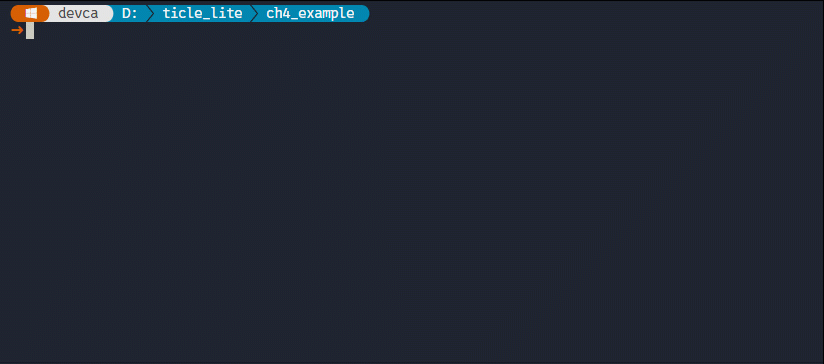</br>

WAV 파일이 설치되면, 예제를 실행한다. 프로그램을 실행하면 첫 번째 곡이 자동으로 재생된다. 예를 들어 네 번째 곡이 재생되는 동안에는 LCD 1행에 "4/6 >"가 표시되고, 재생이 끝나면 ">"가 사라져 "4/6"으로 바뀐다. 이 상태에서 LEFT 버튼을 누르면 세 번째 곡, RIGHT 버튼을 누르면 다섯 번째 곡이 재생된다. 

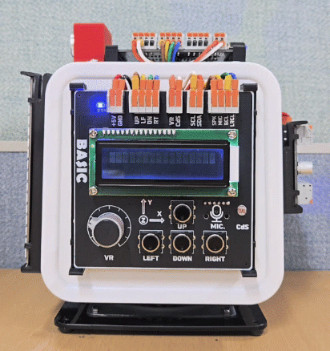</br>


### 소리로 시스템 상태 알리기

> **이 예제로 풀 문제**  
> 시스템 상태가 변경될 때마다 음성으로 이를 알려 줄 수 없을까? 버튼을 누를 때마다 어떤 버튼을 누렀는지를 음성으로 안내하는 방법을 알아 본다. 

앞서 소개한 WAV 파일 재생 기능을 사용할 때 가장 주의해야 할 점은 Core 보드의 플래시 메모리 저장 공간이 약 1MB 내외로 매우 협소하다는 사실이다. 용량이 300KB를 초과하는 오디오 파일을 2 ~ 3개만 보드에 업로드하더라도 사용 가능한 잔여 공간을 모두 소모하게 된다. 따라서 이 기능은 시스템 시작 시 출력되는 환영 문구나 상태 변화를 알리는 짧은 안내 음성 등 제한적인 용도로만 사용하는 것이 바람직하며, 음성 합성 기술(TTS, Text-to-Speech)로 가볍게 생성한 WAV 파일을 활용하는 것이 효과적이다.

이번에는 프로그램이 시작될 때 환영 음성을 출력하고, 사용자가 누르는 버튼의 종류(UP, LEFT, DOWN, RIGHT)에 대응하는 고유의 WAV 오디오 파일을 각각 재생하며, 프로그램이 종료될 때 종료 안내 음성을 출력하도록 구성한다.

```python
# audio_interface.py
from ticle_lite.button import Button
from ticle_lite.i2c import I2CController
from ticle_lite.hd44780 import HD44780_PCF8574 as CharLCD
from ticle_lite.audio import Audio

btn = Button([16, 17, 18, 19])        # GP16: UP, GP17: LEFT, GP18: DOWN, GP19: RIGHT
i2c = I2CController(sda=10, scl=11)    # GP10: SDA, GP11: SCL
lcd = CharLCD(i2c)
audio = Audio(sck=4, ws=5, sd_out=7)  #GP4: SCK, GP5: WS, GP7:SPEAKER
audio.volume = 0.25

btn_text = ["UP", "LEFT", "DOWN", "RIGHT"]

wav_list = [
    "/res/ticle_start.wav",
    "/res/ticle_end.wav",
    "/res/up.wav",
    "/res/left.wav",
    "/res/down.wav",
    "/res/right.wav"
]

try:
    audio.play(wav_list[0])  # Play the start sound
    lcd.text("Press a button", 0, 0)

    while True:
        for idx in btn.update(Button.PRESS):
            lcd.text("              ", 0, 0)
            lcd.text(f"> {btn_text[idx]:>5} pressed", 0, 1)
            audio.play(wav_list[idx+2])
            lcd.text("Press a button", 0, 0)

finally:
    audio.play(wav_list[1])  # Play the end sound
    audio.deinit()
    btn.deinit()
    lcd.deinit()
```

**코드 해설**
재생할 오디오 파일의 경로들은 wav_list 배열에 순차적으로 등록하여 인덱스를 기반으로 일관성 있게 관리한다. 이때 시작 음성은 wav_list[0]에, 종료 음성은 wav_list[1]에 배치하며, 개별 버튼 대응 음성은 버튼의 하드웨어 인덱스(0 ~ 3)에 오프셋 값 2를 더해 wav_list[idx+2] 형태로 접근하도록 설계하여 조건문 분기를 최소화한다.

메인 루프인 while True 구문에서는 btn.update(Button.PRESS)를 호출하여 실시간으로 입력 이벤트 발생 여부를 감시한다. 버튼 입력이 감지되면 캐릭터 LCD의 첫 번째 줄을 공백 문자로 일시 초기화한 뒤, 두 번째 줄에 오른쪽 정렬 형식(f"> {btn_text[idx]:>5} pressed")으로 눌린 버튼의 이름을 출력한다.

이와 동시에 audio.play() 함수를 호출하여 해당 버튼과 매칭된 WAV 파일을 스피커로 출력한다. play()는 전송 스트림이 완료될 때까지 메인 루프를 점유하는 블로킹(Blocking) 방식으로 동작하므로, 사운드 재생이 완전히 끝난 후에야 비로소 다음 라인인 lcd.text("Press a button", 0, 0)이 실행되며 대기 상태로 복귀한다.

**실행 결과와 확인할 점**
오픈 소스 TTS인 piper를 설치한 후 음성 합성 모델을 다운받는다. 

```sh
pip install piper-tts
python -m piper.download_voices en_US-lessac-medium
```

다음과 같이 piper 명령으로 4개의 버튼에 대응하는 WAV 파일을 만들고, 이를 TiCLE Lite에 설치한다.

```sh
piper -m en_US-lessac-medium -f ticle_start.wav Welcome to ticle lite
piper -m en_US-lessac-medium -f ticle_end.wav good-bye
piper -m en_US-lessac-medium -f up.wav up
piper -m en_US-lessac-medium -f left.wav left
piper -m en_US-lessac-medium -f down.wav down
piper -m en_US-lessac-medium -f right.wav right

```

```sh
replx put ./res /res
replx ls -r /res
```

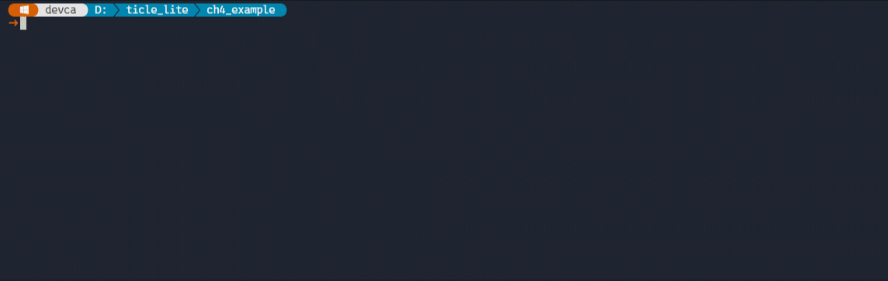</br>

프로그램이 시작되면 스피커를 통해 시작 알림음이 재생되며, 캐릭터 LCD의 첫 번째 줄에 "Press a button"이라는 대기 메시지가 출력된다. 이 상태에서 제어 보드의 네 가지 버튼 중 하나를 누르면, 캐릭터 LCD의 두 번째 줄에 해당 버튼의 이름(예: >    UP pressed)이 즉시 시각화되며 스피커에서 해당 버튼 전용 안내 음성이 명확하게 재생된다.

여기서 확인할 점은 오디오 파일이 재생되는 동안에는 다른 버튼을 누르더라도 즉각적인 반응이 일어나지 않는다는 사실이다. 이는 앞서 설명한 것처럼 audio.play() 함수가 동기식(Blocking)으로 동작하기 때문이다. 하나의 WAV 재생이 완전히 끝나서 제어 루프가 다음 단계로 진행되기 전까지는 CPU가 다른 입력을 처리할 수 없으므로, 하드웨어 장치 제어 시 동기식 제어 구조가 갖는 타이밍상의 특징과 사용자 경험(UX) 측면의 영향을 관찰해야 한다.

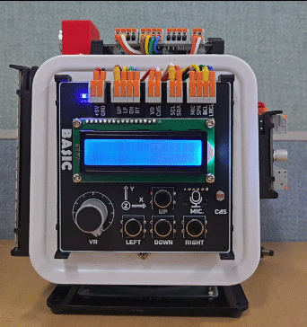</br>

> **한 걸음 더**  
> 현재 audio.volume은 고정되어 있는데, Ain을 추가한 후 VR로 볼륨(0.0 ~ 1.0)을 조절하도록 수정해 본다.


### 주변 소음 크기 측정

> **풀고 싶은 문제**  
> 소음 경고기, 아기 울음 감지기, 도서관의 조용함, 보통, 시끄러움 게시판. 이 모든 제품은 소리의 크기를 숫자 하나로 판단한다. 먼저 소리를 숫자로 읽고, 그다음 화면에 막대그래프로 보여 주는 방법을 살펴본다.

get_level()은 마이크로 들어오는 소리의 세기를 0.0~1.0 범위의 숫자로 돌려준다. 0에 가까울수록 조용하고, 1에 가까울수록 큰 소리다. Matrix에 막대그래프로 표시하면 소리 크기를 눈으로 직접 확인할 수 있다. ADC 예제에서 밝기나 전압을 시각화한 것과 같은 접근 방식이다.

```python
# audio_sound_meter.py
import time
from ticle_lite.i2c import I2CController
from ticle_lite.hd44780 import HD44780_PCF8574 as CharLCD
from ticle_lite.audio import Audio
from ticle_lite.ws2812 import Matrix

i2c = I2CController(sda=10, scl=11)    # GP10: SDA, GP11: SCL
lcd = CharLCD(i2c)

# Note) You must create an Audio object before creating a Matrix object.
audio = Audio(sck=4, ws=5, sd_in=6)   #GP4: SCK, GP5: WS, GP6:MIC
mat = Matrix(0, brightness=0.2)

try:
    lcd.text("Sound Level Meter", 0, 0)
    while True:
        level = audio.get_level()     # 0.0 ~ 1.0
        height = int(level * 16)      # map to 0~16 pixel height

        if height < 8:
            color = (0, 180, 0)       # green: quiet
        elif height < 12:
            color = (255, 160, 0)     # orange: moderate
        else:
            color = (255, 0, 0)       # red: loud

        mat.fill((0, 0, 0))
        for y in range(16 - height, 16):
            mat.draw_line(5, y, 10, y, color)
        mat.update()

        lcd.text(f"Level: {level:.2f}", 0, 1)
        time.sleep_ms(80)
finally:
    audio.deinit()
    mat.deinit()
```

**코드 해설**

MicroPython의 I2S 클래스 내부처리 메커니즘 때문에 반드시 Audio 인스턴스를 먼저 생성한 후 Matrix 인스턴스를 생성해야 한다.

get_level()은 내부적으로 RMS(Root Mean Square, 제곱평균제곱근)라는 방식으로 소리 크기를 계산한다. 단순히 가장 큰 순간의 값을 쓰지 않고 짧은 시간 동안의 평균 에너지를 구하기 때문에 잡음에 덜 흔들리고 안정적인 수치를 돌려준다. 결과는 dBFS(풀스케일 데시벨)를 기준으로 -60 dB ~ 0 dB 범위를 0.0 ~ 1.0으로 변환한 값이다. 소리가 완전히 없으면 0.0, 마이크가 처리할 수 있는 최대 음량이면 1.0에 가까워진다.

반환값에 16을 곱하면 0 ~ 16 범위의 막대 높이를 바로 구할 수 있다. 막대는 패널 아래쪽(y=15)부터 위로 채우는 방식으로 그린다. range(16 - height, 16)는 높이가 4라면 y=12, 13, 14, 15 네 줄에 선을 긋는다는 뜻이다.

소리가 커지면 막대가 즉시 올라가고, 조용해지면 잠시 유지되다가 서서히 내려온다. 이 덕분에 박수처럼 짧고 강한 소리도 화면에서 놓치지 않고 확인할 수 있다.

**실행 결과와 확인할 점**

조용한 환경에서 실행하면 막대가 낮게 유지된다. 박수를 치거나 큰 소리를 내면 막대가 빠르게 올라갔다가 서서히 내려온다. 마이크가 너무 조용하게 반응한다면 audio.mic_gain = 32.0처럼 값을 높여 보자.

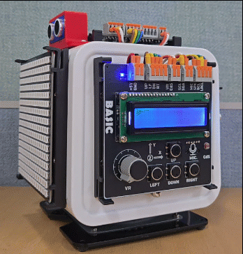</br>

> **한 걸음 더**  
> 1. 막대 색과 경계값을 바꿔 우리 교실 소음 경고기로 만들고, level 값이 0.6을 넘는 순간 mat 전체를 한 순간 깜빡이도록 추가해 보자.
> 2. level이 경계값을 넘은 횟수를 세어 오늘의 시끄러움 횟수를 기록해 보자. 단순 시각화가 데이터 기록으로 이어지는 경험이 된다.

### 박수 소리 감지

> **풀고 싶은 문제**  
> 강의 중 총 몇 번의 박수가 나왔는지, 공연 중 관객의 반응을 수치로 기록하려면 어떻게 해야 할까? 단일 소리의 크기를 읽는 데서 한 단계 더 나아가, 특정 패턴의 소리 이벤트를 세는 일이 필요하다. 이는 세면대 자동 급수, 박수 세기, 고객 호출 같은 섬세한 서비스의 기술 핵심이다.

소리 크기 측정 예제에서 한 걸음 더 나아가, 박수처럼 짧고 강한 충격음을 인식해 픽셀 디스플레이와 스피커로 피드백을 주는 예제다. 박수 감지에는 두 가지 핵심 조건이 필요하다. 첫째, RMS 에너지가 일정 임계값(threshold)을 넘어야 한다. 둘째, 한 번의 박수가 여러 번으로 중복 계수되지 않아야 한다. 아래 예제는 armed 플래그를 이용해 이 두 조건을 동시에 만족한다.

```python
# audio_clap_detect.py
import time
from ticle_lite.i2c import I2CController
from ticle_lite.hd44780 import HD44780_PCF8574 as CharLCD
from ticle_lite.audio import Audio
from ticle_lite.ws2812 import Matrix

i2c = I2CController(sda=10, scl=11)    # GP10: SDA, GP11: SCL
lcd = CharLCD(i2c)

# Note) You must create an Audio object before creating a Matrix object.
audio  = Audio(sck=4, ws=5, sd_in=6, sd_out=7)  # GP4: SCK, GP5: WS, GP6:MIC, GP7:SPEAKER
mat = Matrix(0, brightness=0.2)                 # GP0: Pixel Display

CLAP_THRESH = 1000   # RMS threshold for clap detection (adjust for environment)
CLAP_GAP_MS = 150    # minimum interval to prevent duplicate detection of same clap (ms)
CHUNK       = 441    # ~10ms @ 44100Hz

count   = 0
armed   = True       # ready to detect a clap
last_ms = 0          # timestamp of last detected clap

try:
    lcd.text("Clap your hands!", 0, 0)
    while True:
        level = audio.rms(CHUNK)           # read mic and compute RMS in one call
        now   = time.ticks_ms()

        if level > CLAP_THRESH:
            if armed and time.ticks_diff(now, last_ms) > CLAP_GAP_MS:
                count  += 1
                last_ms = now
                armed   = False

                lcd.text(f"CNT:{count:>3},RMS:{level:>4}", 0, 1)
                audio.tone(880, 80)        # short alert beep
                mat.fill((0, 80, 200))
                mat.update()
        else:
            if not armed and time.ticks_diff(now, last_ms) > CLAP_GAP_MS:
                armed = True               # re-arm when sound fades
                mat.fill((0, 0, 0))
                mat.update()
finally:
    audio.deinit()
    mat.deinit()
    lcd.deinit()
```

**코드 해설**

audio.rms(CHUNK)는 약 10ms 분량(441 샘플)의 마이크 입력을 읽고 RMS까지 한 번에 반환한다. 내부적으로 read_raw()를 호출하고 상위 16비트만 꺼내 부호 있는 정수로 변환한 뒤 제곱합 평균의 제곱근을 계산하므로, 별도 버퍼나 import math가 필요 없다.

armed 플래그는 한 번의 박수 충격을 한 번만 세기 위한 장치다. 소리가 임계값을 넘는 순간 armed가 True일 때만 박수로 인정하고 즉시 False로 바꾼다. 이후 소리가 임계값 아래로 내려가고 CLAP_GAP_MS가 지나면 armed를 다시 True로 복원하는데, 이 구조 없이 임계값만 체크하면 하나의 박수 동안 수십 번이 연속으로 카운트된다.

MicroPython의 machine.I2S는 재생(TX)과 녹음(RX)을 동시에 열 수 없다. Audio 클래스는 내부에 I2S 인스턴스를 하나만 유지하며, audio.tone()을 호출하면 현재 열려 있는 RX 인스턴스를 닫고 TX 인스턴스를 새로 열어 재생한 뒤 다시 RX로 복귀한다. 이 전환 과정 동안 마이크를 읽을 수 없다. 각 단계별 소요 시간은 다음과 같다.

| 단계 | 시간 |
|---|---|
| TX 모드 전환 | 80ms+20ms(deinit+pin idle+init 오버헤드) |
| tone(880, 80) 재생 | 80ms |
| 출력 버퍼 소진(tail drain) | 100ms |
| RX 모드 재전환 | 100ms |
| 감지 불가 사각지대 | 약 390ms |

따라서 박수를 너무 빠르게 치면 사각지대 안에 들어온 박수는 놓친다. 박수 간격을 0.6초(600ms) 이상 유지하면 대부분 감지되고, 1초 이상이면 안정적으로 동작한다. 더 빠른 박수도 감지해야 한다면 audio.tone()을 루프 안에서 제거하고, 감지 횟수가 목표에 도달한 시점에 루프 밖에서 재생하는 구조로 바꾸면 된다.

**실행 결과와 확인할 점**

박수를 치면 LCD의 두 번째 줄에 CNT: <횟수>, RMS:<소음레벨> 이 표시되고 알림음이 울리며 Matrix가 푸른색으로 켜졌다가 꺼진다. 감지가 잘 안 된다면 CLAP_THRESH를 낮춰 보고, 반대로 말소리나 배경 소음에 오작동한다면 값을 2000~3000으로 높인다. CLAP_GAP_MS를 낮추면 빠른 박수도 따로 세고, 높이면 박수 여운에 의한 중복 계수를 줄일 수 있다. LCD를 통해 현재 RMS 값을 실시간으로 확인할 수 있어서 임계값을 정하는 데 도움이 된다.

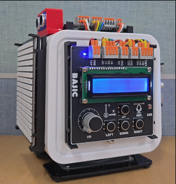</br>


### 마이크 입력을 파일로 저장하기

> **이 예제로 풀 문제**  
> 스피커로 소리를 내고, 마이크로 소리를 감지하는 것은 해 봤다. 이번엔 마이크로 소리를 받아 파일로 저장하고 다시 재생해 보자. 디지털 녹음은 어떻게 이루어질까?

record_to_file()은 지정한 시간 동안 마이크 입력을 받아 WAV 파일로 저장한다. 이 예제에서는 UP 버튼을 누르면 3초 동안 녹음한 뒤 /rec.wav라는 파일로 저장하고, DOWN 버튼을 누르면 이 파일을 재생한다.

버튼의 역할과 LCD의 상태 문구를 연결하면 녹음기와 재생기의 동작을 한눈에 확인할 수 있다. 녹음과 재생이 끝나면 다음 버튼 입력을 기다리며, 저장된 파일은 replx get 명령으로 PC에 내려받을 수 있다.

```python
# audio_record.py
from ticle_lite.button import Button
from ticle_lite.i2c import I2CController
from ticle_lite.hd44780 import HD44780_PCF8574 as CharLCD
from ticle_lite.audio import Audio

i2c = I2CController(sda=10, scl=11)             # GP10: SDA, GP11: SCL
lcd = CharLCD(i2c)
btn = Button([16, 18])                          # GP16: UP, GP18: DOWN

audio = Audio(sck=4, ws=5, sd_in=6, sd_out=7)   # GP4: SCK, GP5: WS, GP6:MIC, GP7:SPEAKER

audio.volume = 0.5
WAV_FILE = '/rec.wav'

try:
    lcd.text("Audio Recorder", 0, 0)
    
    while True:
        for idx in btn.update(Button.PRESS):
            if idx == 0: # UP
                lcd.text("> Recording...", 0, 1)
                audio.record_to_file(WAV_FILE, 3000)  # record for 3 seconds
                lcd.text("> Recorded!", 0, 1)
            elif idx == 1: # DOWN
                lcd.text("> Playing...  ", 0, 1)
                audio.play(WAV_FILE)                  # play back the recorded file
        lcd.text("> Waiting...  ", 0, 1)

finally:
    audio.deinit()
    lcd.deinit()
    btn.deinit()
```

**코드 해설**

Audio 객체는 마이크 입력과 스피커 출력을 모두 사용하도록 초기화했다. sck와 ws는 마이크와 스피커가 함께 사용하는 I2S 클록 핀이고, sd_in은 마이크 입력 핀, sd_out은 스피커 출력 핀이다. 따라서 하나의 audio 객체로 녹음과 재생을 모두 처리할 수 있다.

WAV_FILE에는 녹음 파일의 경로를 저장해 두었다. UP 버튼을 누르면 먼저 LCD에 Recording...을 표시하고 record_to_file(WAV_FILE, 3000)을 호출한다. 여기서 3000은 녹음 시간을 밀리초로 나타내므로 3초를 뜻한다. 녹음이 끝나면 LCD 문구를 Recorded!로 바꾼다.

DOWN 버튼을 누르면 LCD에 Playing...을 표시하고 audio.play(WAV_FILE)로 방금 저장한 WAV 파일을 재생한다. 녹음 파일이 아직 없다면 재생할 파일이 없으므로, 먼저 UP 버튼으로 녹음해야 한다. try 블록을 빠져나갈 때는 finally 블록에서 audio, lcd, btn의 deinit()을 호출해 사용한 장치를 정리한다.

**실행 결과와 확인할 점**

프로그램을 실행하면 LCD 첫 번째 줄에 Audio Recorder가 표시되고 두 번째 줄에는 'Waiting...'이 표시된다. UP 버튼을 누르면 두 번째 줄이 'Recording...'으로 바뀌고 3초 동안 녹음한다. 녹음이 끝나면 Recorded!가 표시된다. DOWN 버튼을 누르면 'Playing...'이 표시되고 /rec.wav가 스피커로 재생된다. 재생이 끝나면 다음 반복에서 'Waiting...'으로 돌아간다.

녹음 시간을 바꾸려면 record_to_file()의 두 번째 인자를 원하는 시간(밀리초)으로 수정한다. 예를 들어 5000을 전달하면 버튼을 누를 때마다 5초 동안 녹음한다. 녹음한 파일은 보드에 저장되므로 PC에서 확인하려면 다음 명령으로 내려받는다.

TiCLE-Lite에 녹음된 파일을 PC로 가져오려면 다음 명령을 실행한다.

```sh
replx get /rec.wav rec.wav
```

---

## 정리

이 장에서는 I2C, 픽단선식 비동기 직렬 통신, I2S라는 세 가지 풍부한 입출력 인터페이스를 TiCLE Lite 라이브러리 중심으로 학습하였다.

세 인터페이스의 역할을 정리하면 이렇다. I2C는 단 두 가닥의 선으로 캐릭터 LCD, IMU처럼 주소를 가진 여러 장치와 통신한다. 픽셀 디스플레이는 WS2812 기반 16×16 LED 패널을 Matrix 클래스로 다루며, 색, 도형, 문자, 애니메이션을 간결한 메서드 호출로 표현한다. I2S는 디지털 오디오 전용 통신으로, 음 재생부터 WAV 파일 재생, 소리 크기 측정, 박수 감지, 녹음까지 오디오 처리 전반을 담당한다.

이 장의 예제들은 대부분 여러 장치를 동시에 사용한다. IMU는 CharLCD와 연결되고, Matrix는 Button과 연결되며, WAV 플레이어는 버튼 입력, LCD 출력, I2S 재생을 한 프로그램 안에서 함께 동작시켰다. 피지컬컴퓨팅의 핵심은 한 장치의 사용법을 외우는 것이 아니라 여러 장치를 묶어 의미 있는 동작을 설계하는 데 있다.


### 스스로 점검하기

1. I2C에서 장치 주소를 먼저 확인하면 어떤 문제를 줄일 수 있는가?
2. CharLCD에서 lcd.clear() 없이 깜빡임을 없애려면 어떻게 하는가?
3. IMU의 accel과 gyro는 각각 무엇을 나타내는가? 보드를 가만히 수평으로 놓았을 때 두 값은 어떻게 달라지는가?
4. MPU6050을 coord='flu', remap='-z-xy'로 초기화하면 remap과 coord는 각각 어떤 보정을 담당하는가? 보드를 앞쪽으로 기울였을 때 ax가 음수로 나오는 이유는 무엇인가?
5. Matrix 클래스에서 update()를 호출하기 전에 fill(), draw_rect() 등을 먼저 실행해야 하는 이유는 무엇인가?
6. 픽셀 디스플레이에서 draw_text_scroll_blocking()과 직접 draw_text()를 반복 호출하는 방식은 어떤 차이가 있는가?
7. Audio.tone()과 Audio.note()는 어떤 상황에 각각 더 적합한가?
8. record_to_file()로 녹음할 수 있는 시간을 늘리려면 어떤 매개변수를 어떻게 조정해야 하는가?
9. WAV 플레이어 예제에서 버튼, LCD, I2S 오디오는 각각 어떤 역할을 맡고 있는가?
10. 박수 감지 예제의 armed 플래그는 어떤 역할을 하는가? 이 플래그가 없으면 어떤 문제가 생기는가?

