# 5. 고급 제어 — IRQ / Timer / _thread / asyncio

## 개요

### 학습 목표

- machine.Pin.irq로 핀 변화를 즉시 감지하고, 콜백에서 상태를 안전하게 기록하는 방법을 적용할 수 있다.
- machine.Timer로 주기적 반복 작업(PERIODIC)과 일회성 지연 실행(ONE_SHOT)을 설계할 수 있다.
- _thread로 두 번째 코어에서 독립 작업을 실행하고, Lock으로 공유 데이터를 안전하게 보호할 수 있다.
- asyncio로 여러 장치를 번갈아 실행하고, 비동기 도우미 클래스(SR04Async, ButtonAsync, ServoAsync, AsyncAudio)를 활용할 수 있다.
- 네 가지 방법의 특성을 비교하여 상황에 맞는 방법을 선택하고 조합할 수 있다.

### 이 장의 의미

3장과 4장에서는 GPIO, ADC, PWM, I2C, SWI(WS2812), I2S라는 여섯 가지 인터페이스를 각각 다루는 방법을 익혔다. 그러나 실제 프로젝트에서는 이 장치들이 동시에 동작한다. 버튼이 눌리는 순간 화면이 바뀌어야 하고, 센서를 일정 간격으로 읽어야 하며, 음악이 재생되는 동안 픽셀 애니메이션도 멈추지 않아야 한다.

이 장에서는 새로운 장치를 추가로 배우는 것이 아니라, 이미 배운 장치들을 더 효율적으로 다루는 네 가지 방법을 익힌다. IRQ는 이벤트가 발생한 순간에 즉시 반응하고, Timer는 시간을 기준으로 작업을 자동 실행하며, _thread는 두 번째 코어에서 독립적으로 실행하고, asyncio는 기다리는 시간을 이용해 여러 작업을 번갈아 처리한다.

RP2350은 ARM Cortex-M33 코어를 두 개 탑재한다. _thread를 활용하면 두 코어가 진정한 병렬 실행을 수행하므로, 계산이 많은 작업을 메인 루프와 완전히 분리할 수 있다. asyncio는 하나의 코어에서 센서 읽기나 소리 재생처럼 기다리는 시간을 나누어 쓰는 방식이므로, 두 방법은 상황에 따라 함께 사용할 수 있다.

### 라이브러리 구성

이 장에서 사용하는 비동기 도우미 클래스는 기존 장치 인스턴스를 받아서, 기다리는 동안 다른 작업이 멈추지 않게 사용할 수 있도록 도와준다.

| 도우미 클래스 | 기반 클래스 | import 경로 | 주요 기능 |
| ---------- | ---------- | ----------- | -------- |
| SR04Async | SR04 | ticle_lite.us_async | 거리 읽기, 반복 측정 |
| ButtonAsync | Button | ticle_lite.button_async | 클릭 기다리기, 버튼 변화 확인 |
| ServoAsync | Servo | ticle_lite.servo_async | 각도 이동, 왕복/순서 이동 |
| MPU6050Async | MPU6050 | ticle_lite.mpu6050_async | 안정 상태 기다리기, 반복 측정 |
| AsyncAudio | Audio | ticle_lite.audio_async | 톤, 음표, WAV 재생 |

### 실습 전 준비

3장과 4장의 설치 환경이 갖춰져 있어야 한다. IRQ와 Timer 기본 예제는 machine 표준 라이브러리만 사용하므로 추가 설치가 필요 없다. 비동기 도우미 예제를 실행하려면 TiCLE Lite 라이브러리가 설치되어 있어야 한다.

```python
from ticle_lite.us import SR04
from ticle_lite.us_async import SR04Async
from ticle_lite.ain import Ain
from ticle_lite.button import Button
from ticle_lite.button_async import ButtonAsync
from ticle_lite.servo import Servo
from ticle_lite.servo_async import ServoAsync
from ticle_lite.audio import Audio
from ticle_lite.audio_async import AsyncAudio
```

### 고급 제어가 필요한 이유

다음과 같은 상황을 생각해 본다.

- 버튼이 눌리는 순간 즉시 경고 화면이 떠야 한다.
- 1초마다 센서값을 갱신해야 한다.
- CPU 집약적인 연산을 메인 루프와 분리해야 한다.
- 같은 시간에 LCD, Pixel Display 보드, IMU, 오디오가 함께 동작해야 한다.

이 상황들을 모두 단순한 반복문으로만 처리하려 하면 코드가 길어지고 반응 속도가 떨어진다. 상황에 따라 맞는 제어 방법을 선택해야 한다.

| 상황 | 적합한 방법 | 이유 |
| ---- | ----------- | ---- |
| 버튼이 눌리는 순간 즉시 반응해야 할 때 | IRQ | 변화가 생긴 순간에만 처리할 수 있다. |
| 일정 시간마다 같은 작업을 반복할 때 | Timer | 시간 간격을 자동으로 유지할 수 있다. |
| CPU 집약 작업을 메인 루프와 분리할 때 | _thread | 두 번째 코어에서 진정한 병렬 실행이 가능하다. |
| 여러 입출력 장치를 동시에 관리할 때 | asyncio | await로 대기 시간을 효율적으로 나누어 쓴다. |

위 방법들은 상호 배타적이지 않다. 같은 프로그램에서 Timer와 asyncio를 함께 쓰거나, IRQ로 이벤트를 받아 asyncio 작업에 전달하는 구조도 가능하다.

## IRQ

> **풀고 싶은 문제**  
> 버튼을 눌렀는데 보드가 다른 일을 하느라 반응이 늦거나 입력 자체를 놓쳐 버리는 경우가 있다. 10ms마다 스위치를 확인하는 방식으로는 근본적으로 해결할 수 없는 문제일까?

CPU는 코드를 위에서 아래로 한 번에 한 줄씩 실행한다. 여러 작업이 동시에 돌아가는 것처럼 보이는 컴퓨터도, 실제로는 매우 빠른 속도로 하나씩 처리하고 있다. 이때 버튼 누름처럼 언제 발생할지 알 수 없는 사건이 있다면 어떻게 알 수 있을까.

가장 단순한 방법은 반복해서 확인하는 것이다. 버튼 값이 바뀌었는지 쉬지 않고 물어보는 이 방식을 폴링(polling)이라고 한다. 구조가 단순하지만, 아무 일도 일어나지 않는 대부분의 시간에도 CPU가 같은 확인을 반복해야 한다는 한계가 있다.

인터럽트(Interrupt)는 반대 발상이다. 프로그램이 사건을 기다리는 대신, 사건이 발생하는 순간 하드웨어가 직접 CPU에게 신호를 보낸다. CPU는 하던 일을 잠깐 멈추고 그 사건을 처리한 뒤 원래 위치로 돌아온다. IRQ(Interrupt Request)는 이 신호를 보내는 요청이다.

인터럽트가 발생했을 때 이를 처리하기 위해 실행되는 전용 함수를 인터럽트 서비스 루틴(ISR, Interrupt Service Routine) 또는 IRQ 핸들러(Handler), IRQ 콜백 함수(Callback Function) 등으로 부르는데, MicroPython은 Pin 인스턴스의 irq()를 통해 IRQ 핸들러(또는 콜백 함수)와 IRQ 조건(Trigger)을 등록한다.

IRQ 핸들러를 구현할 때는 다음과 같은 제약 조건을 반드시 따라야 한다.

- 힙 메모리 동적 할당 금지 (No Heap Allocation)
  - 핸들러 내부에서는 메모리 공간을 새로 차지하는 새로운 인스턴스를 생성하거나 메모리를 동적으로 확장할 수 없다.
  - 실수형 연산(1.5 + 2.3), 새로운 리스트 요소 추가(list.append()), 문자열 포맷팅 및 변환(f"value: {x}", str(val)) 등은 내부적으로 모두 가비지 컬렉션을 유발하는 힙 할당 연산이므로 핸들러 내부에서 결코 사용해서는 안 된다.
  - 인터럽트 내부에서는 프로그램 시작 시점에 전역 공간에 이미 고정 할당되어 생성되어 있는 변수나 플래그의 값만 수정하는 방식으로 코드를 작성해야 한다.
- 블로킹(Blocking) 및 지연 함수 사용 금지
  - 핸들러 내에서 time.sleep()이나 time.sleep_ms()를 사용해 CPU의 실행을 의도적으로 멈춰두면 안 된다.
  - 인터럽트가 실행되는 동안에는 마이크로컨트롤러의 타임 슬라이싱 시스템과 하드웨어 스케줄러가 일시적으로 제약을 받기 때문에, 시스템 전체의 타이머 및 동시성 제어 흐름이 마비된다.
  - 대기가 불가피한 하드웨어적 정밀 지연이 필요하다면, 마이크로초 단위의 초정밀 지연 함수인 time.sleep_us()를 최소한의 주기로만 극도로 짧게 사용해야 한다.
- 출력문(print())의 원칙적 사용 금지
  - 시스템 디버깅을 위한 print() 함수 역시 핸들러 내부에서의 사용을 자제하거나 배제해야 한다.
  - print() 함수는 출력할 문자열 데이터를 내부 버퍼 메모리에 새로 할당하고 입출력(I/O) 스트림을 독점하는 무거운 연산이므로, 인터럽트 핸들러 내에서 실행 시 심각한 시스템 병목과 메모리 할당 오류를 유발한다.

IRQ 핸들러에서 힙 할당을 하면 안 되는 이유는 다음과 같다. 힙 메모리는 프로그램 실행 중 동적으로 생성되는 변수, 리스트, 클래스 인스턴스, 문자열 등의 인스턴스를 저장하는 RAM의 영역이다. 시스템은 제한된 RAM을 효율적으로 사용하기 위해 가비지 컬렉터(Garbage Collector)를 구동하며, 루트 변수에서 시작해 연결된 모든 인스턴스를 추적하여 사용 중인 메모리는 표시(Mark)하고, 사용되지 않는 메모리는 회수(Sweep)하는 방식으로 관리한다.

하지만 IRQ에 의해 실행되는 핸들러는 메인 프로그램의 실행 흐름과 무관하게 언제 어느 시점에 실행될지 예측할 수 없다. 만약 메인 루프가 힙 메모리를 정리(Garbage Collection)하거나 새로운 인스턴스를 생성하여 메모리 주소를 할당하고 있는 도중에 인터럽트가 발생하면 다음과 같은 치명적인 문제가 발생한다.
- 메모리 경합(Race Condition) 발생: 메인 코드가 힙 관리자를 제어하는 순간에 ISR이 개입하여 새 리스트나 문자열을 위한 메모리를 중복 할당하려고 시도하면, 두 코드가 동일한 메모리 관리 스택 및 포인터 공간을 동시에 수정하게 된다.
- 시스템 크래시(Crash): 이로 인해 힙 메모리의 링크 구조가 파괴되거나 주소 참조 오류가 발생하여 전체 시스템이 즉시 마비(하드 폴트)된다.

따라서 인터럽트 핸들러 내에서는 힙 메모리 할당이 금지되므로, 만약 핸들러 실행 도중 런타임 오류(Error)가 발생하더라도 시스템은 오류 메시지를 담을 메모리 공간을 생성하지 못해 에러 내용을 출력하지 못하고 멈추게 된다. MicroPython은 이러한 문제를 방지하기 위해 프로그램 초기화 시점에 비상 예외 버퍼를 미리 할당해 두는 안전장치를 제공한다.

```python
import micropython

micropython.alloc_emergency_exception_buf(100)
```

이 함수를 메인 진입점에 미리 선언해 두면, 메모리 동적 할당이 불가한 IRQ 핸들러 내부에서 예외 오류가 발생하더라도 시스템이 미리 확보해 둔 비상 버퍼를 사용하여 개발자에게 정확한 에러 트레이스백(Traceback) 메시지를 출력해 줄 수 있다. 단, 이는 어디까지나 사후 디버깅을 위한 보조 수단이므로 인터럽트 내부에서 오류 자체가 발생하지 않도록 플래그 중심의 단순 구조로 작성하는 것을 권장한다.
 
이 장의 두 예제는 같은 하드웨어 동작(스위치에 반응해 Pixel Display 보드를 제어하기)을 서로 다른 방식으로 구현한다. 첫 번째 예제는 클래스로, 두 번째는 클로저로 LED 제어 인스턴스를 만든다. 동작은 같고 코드 구조만 다르므로, 두 가지를 나란히 비교하면서 읽어 보자.

### 폴링 방식: 계속 확인하는 방법

> **풀고 싶은 문제**  
> 장치가 하나일 때는 폴링이 간단해 보인다. 하지만 장치가 늘어나면 어떤 문제가 생길지 생각하며 읽어 보자.

다음 예제는 Pixel Display 보드 전체를 1개의 가상 LED로 만드는 MLed 클래스(Class)로 정의하고, 메인 루프에서 10ms마다 버튼 값을 읽어 메서드를 호출하는 구조다.

```python
# work_polling.py
from machine import Pin
from ticle_lite.ws2812 import Matrix
import time

class MLed:  # define a class to control the LED matrix
    def __init__(self): #  Constructor to initialize the LED matrix
        self.mat = Matrix(0, brightness=0.2)

    def on(self):
        self.mat.fill((255, 128, 0))
        self.mat.update()
        
    def off(self):
        self.mat.fill((0, 0, 0))
        self.mat.update()

up_bt = Pin(16, Pin.IN)  # UP Button
m_led = MLed()

while True:
    if up_bt.value():
        m_led.on()
    else:
        m_led.off()
    time.sleep_ms(10)
```

**코드 해설**

MLed 클래스는 Pixel Display 보드 인스턴스를 생성자에서 초기화하고, on()과 off() 두 메서드로 Pixel Display 보드 동작을 캡슐화한다. 메인 루프는 Pixel Display 보드가 어떻게 켜지고 꺼지는지를 알 필요 없이 m_led.on()과 m_led.off()만 호출하면 된다. 메인 루프는 10ms마다 up_bt.value()를 확인하고 그에 맞는 메서드를 호출한다. 눈으로 보기에는 즉시 반응하는 것처럼 느껴질 수 있지만, 실제로는 입력이 없는 대부분의 시간에도 CPU가 같은 확인을 반복하고 있다.

**실행 결과와 확인할 점**

버튼(핀 16)을 누르면 Pixel Display 보드가 주황색으로 켜지고, 손을 떼면 꺼진다. time.sleep_ms(10)을 200으로 늘리고 스위치를 빠르게 두드려 보면, 200ms 안에 끊겼다 연결된 입력은 인식되지 않는 구간이 생긴다.

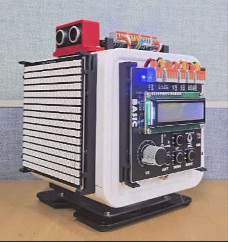</br>

> **한 걸음 더**  
> sleep_ms(10)을 sleep_ms(200)으로 바꾸고 스위치를 짧게 두드려 보자. 눌림이 무시되는 경우를 확인한 뒤, 다시 10으로 되돌려 차이를 비교해 보자.

폴링은 예제 수준에서는 이해하기 쉽지만, 장치가 많아질수록 비효율이 커진다. 예를 들어 버튼 외에 IMU 읽기, LCD 출력, 스피커 제어가 함께 들어오면 모든 것을 짧은 주기로 반복 확인해야 하므로 코드가 복잡해지고 실수가 늘어난다.

### IRQ 방식: 변화가 생긴 순간 반응하기

> **이 예제로 풀 문제**  
> 폴링의 비효율을 없애고 싶다. 버튼 값이 바뀌는 그 순간에만 CPU가 반응하게 만들 수 있을까?

IRQ는 버튼 값이 바뀌는 순간에만 처리하도록 바꾼 방식이다. 여기서 중요한 점은 콜백 함수 안에서 너무 많은 일을 하지 않는 것이다. 우선 상태만 기록하고, 실제 동작은 메인 루프에서 처리하는 방식이 더 안전하다.

이번 예제는 MatrixLed를 클래스 대신 클로저로 구현한다. 클로저는 외부 함수의 로컬 변수를 내부 함수가 기억하고 접근하는 구조다. 폴링 예제에서 class 키워드로 상태와 동작을 묶었다면, 이번에는 함수 안에 함수를 정의하는 방식으로 같은 효과를 낸다.

```python
# work_irq.py
from machine import Pin
from ticle_lite.ws2812 import Matrix
import time

def MLed():
    # local variable of outer function (state persistence)
    mat = Matrix(0, brightness=0.2)   

    def value(n):
        mat.fill((0, 128, 255) if n == 1 else (0, 0, 0))
        mat.update()

    # return an object (namespace) containing the inner functions
    class Methods: pass
    Methods.value = value
    
    return Methods

m_led = MLed()
up_bt = Pin(16, Pin.IN) # UP Button

pressed = 0
changed = True

def on_button(pin): # ISR, Handler, Callback 
    global pressed, changed
    pressed = pin.value()
    changed = True

up_bt.irq(handler=on_button, trigger=Pin.IRQ_RISING | Pin.IRQ_FALLING)

while True:
    if changed:
        changed = False
        m_led.value(pressed)

    time.sleep_ms(10)
```

**코드 해설**

MLed()는 함수 안에서 Pixel Display 보드 인스턴스를 만들고, value() 함수가 그 인스턴스를 기억해 두는 방식으로 구성되어 있다. 겉에서 사용할 때는 폴링 예제의 MLed 클래스와 똑같이 m_led.value(n)으로 켜고 끌 수 있다. 이 예제의 목적은 같은 동작도 클래스가 아닌 함수 묶음으로 만들 수 있음을 보여 주는 것이다.

up_bt.irq()는 버튼 값이 올라가거나(IRQ_RISING) 내려갈 때(IRQ_FALLING) on_button() 함수를 실행하라고 설정하는데, on_button() 안에서는 LED를 바로 바꾸지 않고, 현재 상태를 pressed에 저장한 뒤 changed를 True로 바꾸기만 한다. 그다음 메인 루프가 이 값을 확인해 실제 동작을 수행한다.

이 방법은 처음에는 한 줄 더 늘어난 것처럼 보이지만, 장치가 많아질수록 훨씬 유리하다. 인터럽트 함수는 짧고 단순해야 하며, 시간이 오래 걸리는 작업은 메인 루프나 다른 함수로 넘기는 편이 좋다.

**실행 결과와 확인할 점**

스위치를 누르면 Pixel Display 보드가 파란색으로, 손을 떼면 꺼진다. 폴링 예제와 동작 결과는 같지만, sleep_ms(200)으로 바꿔도 입력이 즉시 반응하는 것이 핵심 차이다.

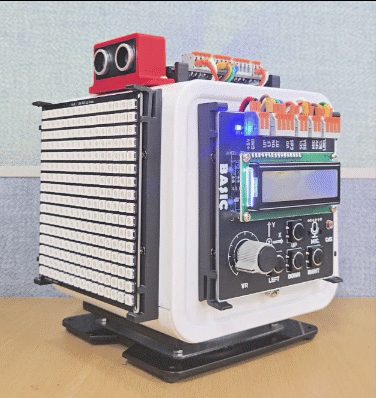</br>


### IRQ 기반 알림판

> **풀고 싶은 문제**  
> 버튼이 눌리는 즉시 화면 전체가 바뀌는 알림판을 만들고 싶다. IRQ와 메인 루프를 어떻게 역할 분담하면 될까?

다음 예제는 버튼이 눌리면 Pixel Display 보드 화면이 즉시 바뀌는 알림판 프로그램이다. draw_text()로 글자를 출력해야 하므로 Pixel Display 보드를 직접 사용한다. 중요한 점은 Pixel Display 보드를 그리는 작업을 IRQ 콜백 함수 안이 아니라 메인 루프에서 수행한다는 점이다.

```python
# irq_notice_board.py
import time
from machine import Pin

from ticle_lite.ws2812 import Matrix

led = Pin("LED", Pin.OUT)
up_bt = Pin(16, Pin.IN)  # UP Button
mat = Matrix(0, brightness=0.2)

pressed = 0
changed = True

def on_button(pin):
    global pressed, changed
    pressed = pin.value()
    changed = True

up_bt.irq(handler=on_button, trigger=Pin.IRQ_RISING | Pin.IRQ_FALLING)

try:
    while True:
        if changed:
            changed = False

            if pressed:
                led.on()
                mat.fill((255, 0, 0))
                mat.draw_text("X", x=3, bg=None)
            else:
                led.off()
                mat.fill((0, 0, 60))
                mat.draw_text("O", x=3, bg=None)

            mat.update()

        time.sleep_ms(10)
finally:
    mat.deinit()
```

**코드 해설**

이 예제는 IRQ가 실제 프로젝트에서 어떻게 쓰이는지 잘 보여 준다. 입력 변화는 즉시 감지하되, Pixel Display 보드에 그림을 그리는 일은 메인 루프에서 처리한다. on_button() 콜백은 pressed와 changed 두 변수만 갱신하고 바로 끝난다. 그다음 메인 루프가 changed를 확인해 Pixel Display 보드를 다시 그린다. 덕분에 콜백은 짧고 안전하며, 반응성도 그대로 유지된다.

on_button() 안의 global pressed, changed 선언은 이 두 변수가 함수 안에서 새로 만들어지는 것이 아니라, 바깥 스코프에 있는 변수를 수정하겠다는 뜻이다. 파이썬에서 함수 안에서 변수에 값을 대입하면 기본적으로 그 함수의 로컬 변수가 된다. global을 선언하지 않으면 콜백 함수가 바깥의 pressed와 changed를 바꾸지 못하고 UnboundLocalError가 발생한다.

이 예제를 통해 인터럽트는 모든 일을 직접 처리하는 기능이 아니라, 사건이 일어났음을 빠르게 알려 주는 기능이라는 점을 이해해야 한다.

**실행 결과와 확인할 점**

UP 버튼(핀 16)을 누르면 보드 LED가 켜지고 Pixel Display 보드에 빨간 배경과 큰 X자가 표시되며, 손을 떼면 LED가 꺼지고 짙은 남색 배경에 O자가 표시된다.

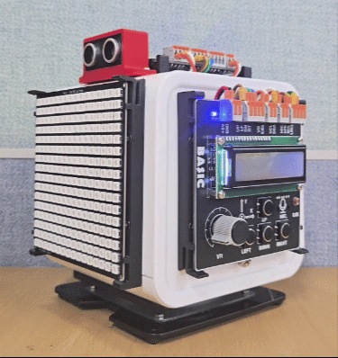</br>

> **한 걸음 더**  
> Pixel Display 보드 출력 코드를 on_button() 콜백 함수 안으로 직접 옮겨 보자. mat.fill()과 mat.update()가 IRQ 함수 안에서 실행되면 어떤 문제가 생기는지 확인하고, 원래 구조로 되돌리자.

### micropython.schedule()로 IRQ에서 안전하게 작업 넘기기

> **이 예제로 풀 문제**  
> 앞의 IRQ 예제는 콜백에서 전역 변수만 갱신하고, 메인 루프가 이를 확인해 처리하는 구조였다. 이 두 단계를 하나로 줄이고, IRQ에서 처리 함수를 메인 루프로 직접 넘길 수 있을까.

IRQ 콜백은 아주 급하게 잠깐 실행되는 코드이므로, 그 안에서 리스트를 새로 만들거나 화면 출력처럼 복잡한 일을 하면 오류가 날 수 있다. micropython.schedule()은 해야 할 일을 예약해 두고, 프로그램이 다시 안전한 상태가 되었을 때 실행해 준다.

```python
# irq_schedule.py
import time
import micropython
from machine import Pin
from ticle_lite.ws2812 import Matrix

up_bt = Pin(16, Pin.IN)    # UP Button
down_bt = Pin(18, Pin.IN)  # DOWN Button
mat = Matrix(0, brightness=0.2)

def update(pin):
    val = pin.value()
    if pin is up_bt and val:
        mat.fill((255, 0, 0))
        mat.draw_text("X", x=3, bg=None)
    elif pin is down_bt and val:
        mat.fill((0, 255, 0))
        mat.draw_text("O", x=3, bg=None)
    elif not val:
        mat.fill((0, 0, 0))
    mat.update()

def on_button(pin):
    micropython.schedule(update, pin)

up_bt.irq(handler=on_button, trigger=Pin.IRQ_RISING | Pin.IRQ_FALLING)
down_bt.irq(handler=on_button, trigger=Pin.IRQ_RISING | Pin.IRQ_FALLING)

try:
    count = 0
    while True:
        count += 1
        print(f"{count}: Main loop is running...")
        time.sleep(1)
finally:
    mat.deinit()
```

**코드 해설**

on_button()는 micropython.schedule(update, pin)으로 나중에 실행할 update() 함수와 버튼 정보를 함께 예약한다. update()는 IRQ 바깥에서 실행되므로 mat.fill()이나 mat.draw_text() 같은 시간이 걸리는 화면 작업을 안전하게 수행할 수 있다.

update(pin)은 pin.value()로 눌림 여부를 확인하고, pin is up_bt 비교로 어느 버튼인지 판별한다. 같은 on_button 콜백을 두 버튼이 공유할 수 있는 것도 어떤 버튼에서 신호가 왔는지 pin으로 알 수 있기 때문이다. 한편 메인 루프는 카운터를 출력하면서 계속 실행된다. schedule()로 예약된 update()가 화면을 갱신한 뒤 메인 루프가 이어지므로, 버튼 입력과 메인 루프가 서로 방해 없이 동작하는 것을 확인할 수 있다.

micropython.schedule()은 예약해 둘 수 있는 작업 수가 제한되어 있다. 기본적으로 8개까지 저장할 수 있으므로, 아주 짧은 시간에 IRQ가 계속 발생하면 RuntimeError가 발생할 수 있다. 버튼 입력처럼 사람의 속도로 발생하는 이벤트에는 적합하지만, 매우 빠르게 반복되는 신호에는 전역 변수만 바꾸는 방식이 더 안정적이다.

**실행 결과와 확인할 점**

UP 버튼(핀 16)을 누르면 빨간 배경에 X가, DOWN 버튼(핀 18)을 누르면 초록 배경에 O가 표시된다. 손을 떼면 화면이 꺼진다. 터미널에는 "1: Main loop is running..." 형태의 출력이 매초 계속 흐른다. 버튼을 눌러도 메인 루프가 멈추지 않고 카운터가 계속 올라가는 것을 확인한다.

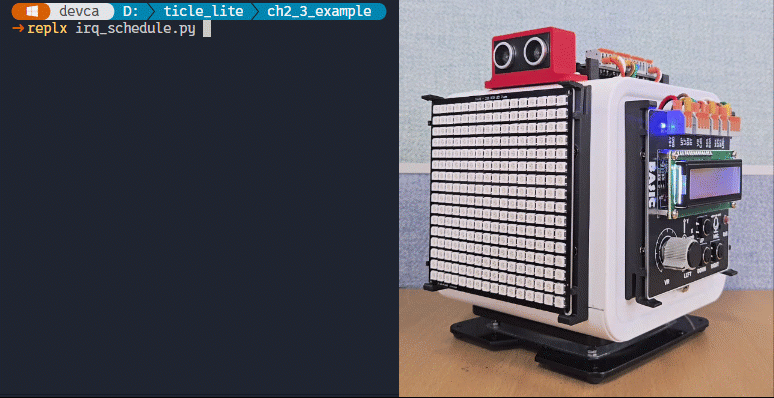</br>

> **한 걸음 더**  
> on_button() 안에 schedule() 없이 update(pin)을 직접 호출해 보자. 어떤 오류가 발생하는지 확인하고, IRQ 환경에서 복잡한 함수를 직접 실행할 수 없는 이유를 생각해 보자.

### MLed 모듈 만들기

> **이 예제로 풀 문제**
> 예제마다 Pixel Display 보드를 가상 LED로 만드는 코드를 반복해 쓰면 코드가 길어진다. 켜기, 끄기 동작과 자원 정리를 하나의 클래스로 묶고, with 문으로 정리까지 자동화할 수 있을까?

앞으로 나오는 예제들은 Pixel Display 보드를 가상 LED로 사용하는데 매번 기존 코드를 복사하는 대신, 이 동작을 하나의 클래스로 묶고 with 문으로 자원 정리까지 보장하면 예제 코드가 훨씬 간결해진다.

다음 mled.py 파일을 만들고 보드에 설치하면, 이후 예제에서 단 한 줄로 불러올 수 있다.

```python
# mled.py
from ticle_lite.ws2812 import Matrix

class MLed:
    def __init__(self, *, pin, color=(255, 255, 255)):
        self.mat = Matrix(pin, brightness=0.5)
        self.color = color

    def __enter__(self):  # Context manager entry point
        return self

    def __exit__(self, exc_type, exc_val, exc_tb): # Context manager exit point, ensure resources are cleaned up
        self.deinit()

    def deinit(self):
        self.mat.deinit()

    def on(self):
        self.mat.fill(self.color)
        self.mat.update()

    def off(self):
        self.mat.fill((0, 0, 0))
        self.mat.update()

    def value(self, n):
        if n == 1:
            self.on()
        else:
            self.off()

if __name__ == "__main__":
    import time

    with MLed(pin=0, color=(255, 0, 200)) as led:
        while True:
            led.on()
            time.sleep(1)
            led.off()
            time.sleep(1)
```

**코드 해설**

if __name__ == "__main__": 블록은 파일을 replx로 직접 실행할 때만 동작한다. 다른 예제에서 from mled import MLed로 불러올 때는 이 블록을 건너뛰므로, 하나의 파일이 라이브러리 역할을 하면서 단독 실행 테스트도 가능하다. with 블록 안에서 1초마다 켜고 끄는 동작을 반복하다가, Ctrl+C로 중단하면 __exit__가 자동으로 호출되는지 직접 확인할 수 있다.

with 문은 시작과 끝이 있는 장치를 안전하게 쓰기 위한 문법이다. 파일을 열고 닫거나, 장치를 켜고 끄거나, 잠금을 걸고 푸는 일처럼 마지막 정리가 꼭 필요한 경우에 유용하다.

with 뒤에 오는 인스턴스는 시작할 때 실행할 __enter__()와 끝날 때 실행할 __exit__()를 가지고 있어야 한다.
- __enter__(self): with 블록에 들어갈 때 자동 실행되며, 반환값이 as 뒤의 변수에 들어간다.
- __exit__(self, exc_type, exc_val, exc_tb): with 블록을 벗어날 때 자동 실행되며, 오류가 나도 정리 코드를 실행할 수 있다.  

기존 방식:
```python
m_led = MLed(pin=0)
try:
    m_led.on()
    ...
finally:
    m_led.deinit()
```

with 방식:
```python
with MLed(pin=0) as m_led:
    m_led.on()
    ...
```

인스턴스가 만들어질 때 자동으로 호출되는 __init__의 인자 목록에서 * 뒤에 오는 pin과 color는 반드시 이름을 붙여서 전달해야 한다. MLed(0)처럼 위치 인자로 쓰면 오류가 발생하고, MLed(pin=0)처럼 이름을 명시해야 한다. 이렇게 하면 MLed(pin=0, color=(0, 150, 0))처럼 인자가 여러 개일 때 순서를 잘못 넣는 실수를 막을 수 있다.

color=(255, 255, 255)는 기본값이 흰색이라는 뜻이다. MLed(pin=0)처럼 color를 생략하면 자동으로 흰색이 사용된다. 색을 바꾸고 싶을 때만 color=(0, 150, 0)처럼 직접 지정하면 된다.

on()은 지정한 색으로 화면을 채우고, off()는 검정으로 끈다. value(n)은 0과 1을 받아 on/off를 전환하므로 기존 LED 제어 코드와 인터페이스가 동일하다. __enter__는 self를 반환해 with MLed(pin=0) as led 형태로 쓸 수 있게 하고, __exit__는 블록을 벗어날 때 예외 발생 여부와 무관하게 mat.deinit()을 자동으로 호출한다.

이 파일을 보드에 설치하려면 터미널에서 다음 명령을 실행한다.

```
replx mpy mled.py -d /lib
replx ls /lib/mled.mpy
```

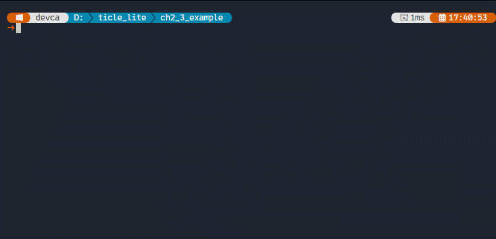</br>

replx mpy는 Python 파일을 MicroPython 바이트코드(.mpy)로 컴파일해 보드의 /lib 디렉터리에 설치한다. 한 번 설치해 두면 이후 예제에서 from mled import MLed로 언제든 불러올 수 있다.

.py는 텍스트 소스 파일이고, .mpy는 MicroPython 인터프리터가 바로 실행할 수 있는 바이트코드 파일이다. .mpy로 배포하면 보드에서 컴파일 시간이 줄어들고 RAM 사용량도 낮아진다. 메모리가 제한된 마이크로컨트롤러에서는 작은 차이도 프로그램 안정성에 영향을 미친다.

**실행 결과와 확인할 점**

파일을 replx로 직접 실행하면 Pixel Display 보드가 1초마다 분홍색(255, 0, 200)으로 켜졌다 꺼지기를 반복한다. Ctrl+C로 중단하면 with 블록을 벗어나면서 __exit__가 자동으로 호출되어 mat.deinit()이 실행되고 디스플레이가 꺼진다. replx mpy mled.py -d /lib 명령으로 보드에 설치한 뒤에는 from mled import MLed 한 줄로 불러올 수 있고, if __name__ == "__main__" 블록은 import 시에 실행되지 않는다.

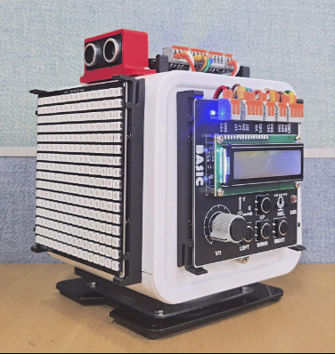</br>

---

## Timer

> **풀고 싶은 문제**  
> while True 루프 안에 time.sleep_ms()를 두면 기다리는 동안 다른 작업이 완전히 멈춰 버린다. 일정 간격으로 반복하는 작업을 메인 루프와 독립적으로 처리할 수는 없을까?

마이크로컨트롤러 칩 안에는 CPU와 독립적으로 동작하는 하드웨어 타이머 회로가 내장되어 있다. 이 회로는 CPU가 다른 일을 하는 동안에도 스스로 시간을 센다. 지정한 시간에 도달하면 CPU에게 IRQ를 보내고, CPU는 그 시점에 IRQ 핸들러를 실행하는데, Timer에서는 IRQ 핸들러 대신 콜백 또는 콜백 함수란 용어를 더 선호한다.

time.sleep_ms()로 시간을 기다리는 방식은 CPU가 그 시간 동안 멈춰 있는 것과 같다. MicroPython의 machine.Timer 클래스는 시간을 세는 일을 하드웨어에 맡기므로, CPU는 타이머가 세는 동안 다른 일을 계속할 수 있다. 주기적인 반복 작업을 메인 루프와 완전히 독립적으로 처리할 수 있는 것도 이 때문이다.

Timer는 크게 두 가지 방식으로 나뉜다.

| 모드 | 의미 | 사용 예 |
| ---- | ---- | ------- |
| PERIODIC | 일정 주기로 계속 반복 실행 | 1초마다 LED 점멸, 센서 주기 측정 |
| ONE_SHOT | 지정한 시간이 지난 뒤 한 번만 실행 | 3초 뒤 자동 종료, 일정 시간 후 원위치 복귀 |

Timer() 클래스는 hard 매개변수 설정을 통해 인터럽트의 처리 방식을 결정한다. 이 설정은 하드웨어 타이머 신호가 발생했을 때 CPU가 얼마나 즉각적으로 개입하여 처리할 것인가(실시간성)와, 콜백 함수(핸들러) 내부에서 메모리 및 내장 함수를 얼마나 자유롭게 사용할 수 있는가(제약 조건)를 결정하는 핵심 분기점이 된다.

hard=True로 설정하는 하드 타이머 방식은 지정된 시간이 만료되는 순간, CPU 하드웨어 레벨에서 직접 인터럽트를 발생시킨다. 이때는 메인 프로그램의 실행 상태와 관계없이 하드웨어 타이머가 즉각적으로 CPU의 제어권을 가로챈다. 따라서 마이크로초(us) 단위의 정밀한 주기로 모터를 제어하거나 물리적인 정밀 신호를 생성해야 하는 등, 시간 타이밍의 실시간성과 정확도가 시스템의 최우선 과제일 때 주로 사용된다.

반면 hard=False로 설정하는 소프트 타이머 방식은 하드웨어 타이머 신호가 발생하더라도 CPU를 즉시 멈추지 않고, MicroPython 스케줄러가 안전하게 처리할 수 있는 시점까지 기다렸다가 콜백 함수를 실행한다. 이 방식은 메인 루프에서 무거운 연산이 수행 중이거나 가비지 컬렉션(GC)이 가동되는 등의 상황과 맞물릴 경우, 타이머 핸들러의 실행이 수 밀리초(ms) 이상 뒤로 밀리는 지터(Jitter, 타이밍 오차) 현상이 발생할 수 있다. 

결과적으로 두 설정은 시스템의 목적에 따른 명확한 상충 관계를 지닌다. 하드 타이머는 정밀한 타이밍을 보장받는 대신 내부에서 힙 메모리 할당이 엄격히 금지되는 제약을 감수해야 하며, 반대로 소프트 타이머는 타이밍의 미세한 오차를 감수하는 대신 가상 머신의 보호 아래 일반 함수처럼 자유롭게 코드를 작성할 수 있는 구현 이점을 얻는다.

### 1초마다 Pixel Display 보드 깜빡이기

> **풀고 싶은 문제**  
> Pixel Display 보드를 1초 간격으로 켜고 끄되, 메인 루프는 다른 일을 계속할 수 있게 만들어 보자.

PERIODIC 모드는 init()에서 지정한 주기마다 콜백 함수를 반복해서 호출한다. 메인 루프가 어떤 일을 하고 있든 타이머는 독립적으로 동작하므로, 반복 작업을 루프 안의 sleep()에 의존하지 않아도 된다.

```python
# timer_periodic.py
from machine import Timer
from mled import MLed

m_led = MLed(pin=0, color=(0, 150, 0))
state = 0
changed = False

def on_blink(timer):
    global state, changed
    state = 0 if state else 1
    changed = True

t = Timer()
t.init(period=1000, mode=Timer.PERIODIC, callback=on_blink, hard=True)

try:
    while True:
        if changed:
            changed = False
            m_led.value(state)
finally:
    m_led.off()
    t.deinit()
```

**코드 해설**

Timer() 인스턴스를 만든 뒤 init()으로 주기, 모드, 콜백 함수를 설정한다. period=1000은 1000밀리초, 즉 1초를 의미한다. hard=True를 지정하면 콜백이 하드웨어 인터럽트로 실행되므로 IRQ와 같은 규칙이 적용된다. on_blink()는 state 값을 0과 1로 바꾸고 changed를 True로 설정한다. Pixel Display 보드 갱신은 메인 루프에서 처리하는데, changed==True일 때만 changed를 False로 바꾸고, state를 이용해 Pixel Display 보드를 켜거나 끈다.

finally 블록은 Ctrl+C로 프로그램을 멈출 때 반드시 실행된다. m_led.off()로 화면을 끄고, t.deinit()으로 타이머를 해제하는데, 이 두 줄이 없으면 replx만 종료될 뿐 보드에서는 타이머가 계속 동작하므로 프로그램을 다시 실행할 때 충돌이 생길 수 있다.

**실행 결과와 확인할 점**

Pixel Display 보드가 1초 간격으로 초록색과 검정 사이를 오간다. 메인 루프 안에 print("running")을 추가하면 Pixel Display 보드가 깜빡이는 동안 터미널에 출력도 계속 이루어지는 것을 확인할 수 있다.

while True 안에는 실제 작업 코드를 넣어도 된다. hard=True로 설정한 타이머의 콜백은 하드웨어가 정해진 주기에 맞춰 메인 루프 중간에 끼어들므로, 메인 루프가 무엇을 하고 있든 독립적으로 동작한다. IRQ와 동일한 인터럽트 방식이므로 콜백 안에서는 상태를 기록하고, 실제 처리는 메인 루프에 맡기는 것이 안전하다.

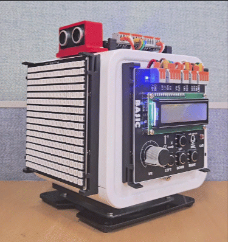</br>

> **한 걸음 더**  
> period=1000을 200으로 바꾸어 깜빡임 속도를 높여 보자. 그다음 메인 루프 안에 print("running")을 추가하여, 터미널 출력이 멈추지 않으면서 Pixel Display 보드도 계속 깜빡이는지 확인해 보자.

### 한 번만 실행하기

> **이 예제로 풀 문제**  
> 경고등(Pixel Display 보드)을 3초 동안만 빨간색으로 켜고 싶다. time.sleep()으로 기다리지 않고, 시간이 되면 저절로 꺼지게 만들 수 있을까.

ONE_SHOT 모드는 조금 뒤에 한 번만 실행할 작업을 등록할 때 유용하다. 예를 들어 경고등을 3초 동안만 켜거나, 버튼을 누른 뒤 일정 시간이 지나면 원래 상태로 돌아가게 할 수 있다.

```python
# timer_oneshot.py
from machine import Timer
from mled import MLed

led = MLed(pin=0, color=(150, 0, 0))
timer = Timer()
done = False

def on_timer(_):
    global done
    done = True

led.on()
timer.init(period=3000, mode=Timer.ONE_SHOT, callback=on_timer, hard=True)

try:
    while not done:
        pass
    led.off()
finally:
    led.deinit()
    timer.deinit()
```

**코드 해설**

프로그램 시작과 함께 led.on()으로 Pixel Display 보드를 빨간색으로 켠 다음, 타이머에게 3초 뒤 on_timer()를 한 번 실행하라고 지시하는데, on_timer()는 done을 True로 바꾸기만 한다. hard=True이므로 IRQ와 같은 규칙이 적용되고, 픽셀 출력은 메인 루프에서 처리한다.

메인 루프는 done이 True가 될 때까지 대기하다가, 타이머가 신호를 보내면 루프를 빠져나와 led.off()를 실행한다. ONE_SHOT 타이머는 콜백이 한 번 실행되면 스스로 멈추므로, 이후에는 타이머가 다시 울리지 않는다.

**실행 결과와 확인할 점**

프로그램을 시작하면 Pixel Display 보드가 빨간색으로 켜지고, 3초 뒤 저절로 꺼진다. on_timer()가 done을 True로 바꾸는 순간 메인 루프가 led.off()를 실행한다. period를 1000으로 바꾸면 1초 뒤에 꺼진다.

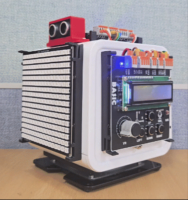</br>

### Timer로 만드는 자동 스캔 연주기

> **풀고 싶은 문제**  
> 서보가 턴 테이블을 회전시키면 캐릭터 LCD도 함께 돌아 특정 방향에서는 화면을 읽기 어렵다. 캐릭터 LCD 출력에 소리를 더하면 방향에 관계없이 현재 각도를 전달할 수 있지 않을까.

이번 예제는 서보가 가리키는 각도를 캐릭터 LCD와 소리로 함께 표현한다. 각도 배열과 음표 배열을 같은 인덱스로 짝지어 두면 서보 위치마다 화면과 음표가 함께 달라진다. audio.note()는 음표 한 개를 끝까지 연주한 뒤 다음 줄로 넘어가므로, 서보 이동, 캐릭터 LCD 갱신, 음표 연주를 순서대로 이어 쓰는 것만으로도 세 장치가 하나의 흐름으로 맞물린다.

캐릭터 LCD와 스피커, 서보 모터를 모두 사용하므로 PC 환경에 따라 USB 전원만으로는 TiCLE Lite의 전원 부족해 다음과 같이 실행 중에 시스템 오류가 발생할 수 있다. 이때는 DC 5V 4A 전원 어댑터를 Power 보드에 연결한다. 

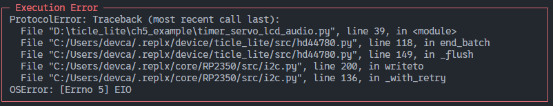</br>

```python
# timer_servo_lcd_audio.py
from machine import Timer
from ticle_lite.servo import Servo
from ticle_lite.audio import Audio
from ticle_lite.hd44780 import HD44780_PCF8574 as CharLCD
from ticle_lite.i2c import I2CController

servo = Servo(1)
audio = Audio(sck=4, ws=5, sd_out=7)
i2c = I2CController(sda=10, scl=11) 
lcd = CharLCD(i2c)

angles = [30,   60,   90,   120,  150,  120,  90,   60  ]
notes  = ['C4', 'D4', 'E4', 'G4', 'A4', 'G4', 'E4', 'D4']
index = 0
current = 90
note_name = 'E4'
changed = True

def on_tick(_):
    global index, current, note_name, changed
    current = angles[index]
    note_name = notes[index]
    index = (index + 1) % len(angles)
    changed = True

timer = Timer()
timer.init(period=400, mode=Timer.PERIODIC, callback=on_tick, hard=True)

try:
    servo.home()
    servo.wait()

    while True:
        if changed:
            changed = False
            servo.angle = current
            lcd.clear()
            lcd.text("Servo Scan", 0, 0)
            lcd.text(f"Angle: {current:>3} deg", 0, 1)
            audio.note([note_name, 8])
finally:
    timer.deinit()
    servo.home()
    servo.wait()
    servo.deinit()
    audio.deinit()
    lcd.deinit()
```

**코드 해설**

angles와 notes 배열은 같은 인덱스로 짝이 맞도록 구성했다. on_tick() 콜백은 index를 전진시키면서 current와 note_name을 함께 갱신하고 changed를 세운다. 두 배열의 길이가 같으므로 서보 위치와 음표는 항상 동기화된다.

메인 루프는 changed가 참일 때 세 작업을 순서대로 실행한다. servo.angle로 서보를 이동시킨 다음, lcd.clear()와 lcd.text()로 화면에 각도를 표시한다. 그 직후 audio.note([note_name, 8])를 호출하면 120 BPM 기준 8분음표인 250ms 동안 음을 낸 뒤 다음 줄로 넘어간다. 이 시간 동안 LCD에는 방금 갱신한 각도가 유지된 채로 음이 울린다. 연주가 끝나면 타이머 주기 400ms 중 약 150ms가 남으므로 다음 tick을 처리할 여유가 있다.

**실행 결과와 확인할 점**
서보가 30도에서 150도 사이를 오가면서 LCD에 현재 각도가 표시되고, C4, D4, E4, G4, A4 순서로 음이 울린다. 음이 울리는 동안 화면에는 해당 각도가 유지되므로, LCD가 특정 방향을 가리켜 보이지 않더라도 소리로 현재 위치를 파악할 수 있다. 낮은 각도에서는 낮은 음, 높은 각도에서는 높은 음이 나는 것도 확인해 보자.

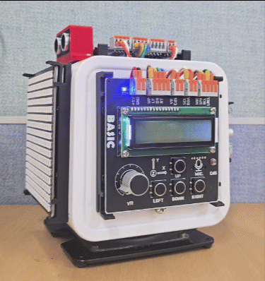</br>

> **한 걸음 더**  
> notes 배열을 바꾸어 자신만의 멜로디를 만들어 보자. 예를 들어 ['E4', 'E4', 'G4', 'A4', 'G4', 'E4', 'D4', 'C4']로 바꾸면 어떤 소리가 날까. 음표 이름은 C4, D4, E4처럼 음이름 뒤에 옥타브 번호를 붙이고, 샵은 C#4처럼 쓴다.

---

## _thread

> **풀고 싶은 문제**  
> RP2350에는 코어가 두 개 있다. 기다림이 긴 작업이나 계산이 많은 작업을 메인 루프에서 분리해 다른 코어에서 실행하면 어떨까?

Core 보드의 RP2350에는 Core 0과 Core 1 두 코어가 있다. 보통 사용자가 작성한 프로그램은 Core 0에서 실행된다. _thread.start_new_thread()를 호출하면 지정한 함수가 Core 1에서 따로 실행되어, 메인 루프가 멈추지 않은 채 다른 일을 맡길 수 있다. asyncio가 한 코어에서 작업을 번갈아 실행하는 방식이라면, _thread는 두 코어가 실제로 동시에 일을 나누는 방식이다.

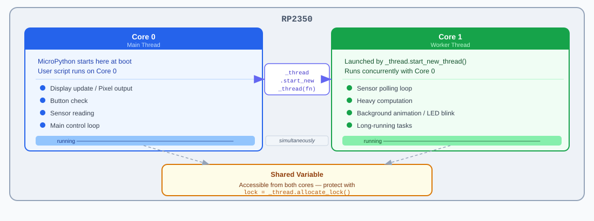
</br>

TiCLE Lite가 부팅되면 먼저 Core 0에서 MicroPython이 실행된다. 여기에 사용자가 작성한 스크립트가 올라간다. 별도의 작업을 Core 1에서 시작하면, Core 0은 화면 출력이나 버튼 확인을 계속하고 Core 1은 센서 읽기나 계산을 맡을 수 있다. 두 코어가 같은 값을 함께 사용할 때는 Lock으로 보호해야 한다.

### 두 번째 코어에서 Pixel Display 보드 깜빡이기

> **풀고 싶은 문제**  
> 서브 코어에서 Pixel Display 보드를 0.2초 간격으로 깜빡이면서, 메인 코어는 1초마다 카운터를 출력하도록 만들어 보자. 두 작업이 서로 기다리지 않고 동시에 실행될 수 있을까?

가장 단순한 _thread 예제는 두 번째 코어(core1)에서 Pixel Display 보드를 독립적으로 깜빡이면서 메인 코어(core0)가 별도 작업을 수행하는 구조다.

```python
# work_thread.py
import _thread
import time
from mled import MLed

led = MLed(pin=0, color=(0, 0, 180))
running = True
state = False

def blink_task():  # runs in Core1 (sub-thread or worker thread)
    global state
    while running:
        state = not state
        led.value(1 if state else 0)
        time.sleep_ms(200)

def main_task():  # runs in Core0 (main thread)
    global running
    _thread.start_new_thread(blink_task, ())

    try:
        count = 0
        while True:
            print("Core0 is running:", count)
            count += 1
            time.sleep_ms(1000)
    finally:
        running = False
        time.sleep_ms(400)
        led.deinit()

if __name__ == "__main__":
    main_task()
```

**코드 해설**

_thread.start_new_thread(blink_task, ())는 blink_task 함수를 두 번째 코어(core1)에서 실행하는데, ()는 blink_task에 전달할 인자가 없음을 뜻한다. running 변수는 두 코어가 공유하는 종료 신호다. finally에서 running = False로 바꾸면 core1의 반복문이 탈출하고 스레드가 자연스럽게 종료된다. led.deinit()는 스레드가 완전히 멈춘 뒤 호출해야 안전하므로, sleep_ms(400)으로 잠깐 기다린 다음에 실행한다.

**실행 결과와 확인할 점**

프로그램을 실행하면 터미널에 "Core0 is running: N"이 1초 간격으로 출력되고, 동시에 Pixel Display 보드가 0.2초 간격으로 파란색과 검정 사이를 오간다. 두 작업이 서로 기다리지 않고 동시에 실행되는 것이 asyncio와의 핵심 차이다.

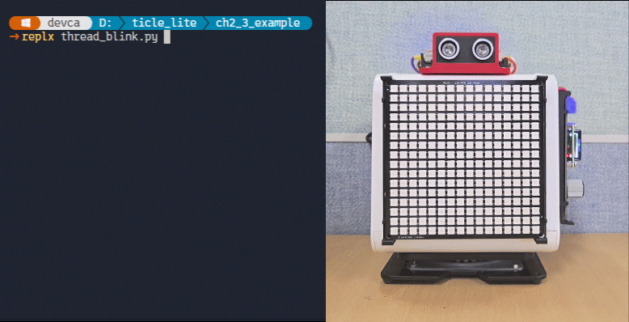</br>

> **한 걸음 더**  
> blink_task() 안의 sleep_ms(200)을 sleep_ms(50)으로 바꾸어 Pixel Display 보드 깜빡임이 빨라지는지 확인해 보자. 그다음 running = False 줄을 finally 블록에서 제거하고 Ctrl+C를 눌러, 종료 신호 없이 코어1이 어떻게 되는지 관찰해 보자.


### 배경 음악과 함께 IMU 동작 인식하기

> **풀고 싶은 문제**  
> 배경 음악이 흐르는 동안 IMU로 쓰다듬기, 톡 건드리기, 세게 치기를 구분하고, 각 행위에 맞춰 서보가 반응하게 할 수 있을까. audio.note()는 음이 끝날 때까지 메인 루프로 돌아오지 않으므로, 음악을 틀면서 센서까지 읽으려면 두 코어가 필요하다.

이번 예제에서 core0는 MELODY 배열을 반복하며 베토벤 기쁨의 송가 멜로디를 연주하고, core1은 IMU 가속도 데이터로 세 가지 행위를 인식해 서보를 제어한다. 쓰다듬으면 강아지 꼬리처럼 천천히 좌우로 흔들리고, 톡 건드리면 깜짝 놀란 듯 빠르게 작게 떨리고, 세게 치면 크게 왔다 갔다 한다.

동작 인식에는 가속도 벡터 크기의 변화를 이용한다. 정지 상태에서는 중력 하나만 측정되어 크기가 항상 약 9.8 m/s²이고, 충격이 가해지면 크기가 급격히 달라진다. math.sqrt(ax*ax + ay*ay + az*az)로 구한 총 크기에서 9.8을 빼면 순수한 동적 가속도(dyn)를 얻을 수 있다.

```python
# thread_gesture.py
import _thread
import time
import math
from ticle_lite.servo import Servo
from ticle_lite.audio import Audio
from ticle_lite.mpu6050 import MPU6050 as IMU
from ticle_lite.i2c import I2CController

servo = Servo(1)
audio = Audio(sck=4, ws=5, sd_out=7)  #GP4: SCK, GP5: WS, GP7:SPEAKER
i2c = I2CController(sda=10, scl=11) 
imu = IMU(i2c)

MELODY = [
    ['E4', 4], ['E4', 4], ['F4', 4], ['G4', 4],
    ['G4', 4], ['F4', 4], ['E4', 4], ['D4', 4],
    ['C4', 4], ['C4', 4], ['D4', 4], ['E4', 4],
    ['E4', 2], ['D4', 2],
    ['E4', 4], ['E4', 4], ['F4', 4], ['G4', 4],
    ['G4', 4], ['F4', 4], ['E4', 4], ['D4', 4],
    ['C4', 4], ['C4', 4], ['D4', 4], ['E4', 4],
    ['D4', 2], ['C4', 2],
    ['D4', 4], ['D4', 4], ['E4', 4], ['C4', 4],
    ['D4', 4], ['E4', 8], ['F4', 8], ['E4', 4], ['C4', 4],
    ['D4', 4], ['E4', 8], ['F4', 8], ['E4', 4], ['D4', 4],
    ['C4', 4], ['D4', 4], ['G3', 2],
    ['E4', 4], ['E4', 4], ['F4', 4], ['G4', 4],
    ['G4', 4], ['F4', 4], ['E4', 4], ['D4', 4],
    ['C4', 4], ['C4', 4], ['D4', 4], ['E4', 4],
    ['D4', 2], ['C4', 2],
]

running = True
HIT    = 'hit'
TAP    = 'tap'
STROKE = 'stroke'

def respond(gesture):  # runs in Core1
    if gesture == STROKE:
        for angle in [70, 90, 110, 90, 70, 90, 110, 90]:
            servo.angle = angle
            time.sleep_ms(350)
    elif gesture == TAP:
        for _ in range(5):
            servo.angle = 75
            time.sleep_ms(80)
            servo.angle = 105
            time.sleep_ms(80)
    elif gesture == HIT:
        for angle in [30, 150, 60, 120, 90]:
            servo.angle = angle
            time.sleep_ms(400)
    servo.angle = 90

def gesture_task():  # runs in Core1
    stroke_count = 0
    cooldown     = 0
    while running:
        ax, ay, az = imu.accel
        dyn = abs(math.sqrt(ax*ax + ay*ay + az*az) - 9.8)

        if cooldown > 0:
            cooldown -= 1
            time.sleep_ms(30)
            continue

        if dyn > 6.0:
            stroke_count = 0
            respond(HIT)
            cooldown = 20
        elif dyn > 0.4:
            stroke_count = 0
            respond(TAP)
            cooldown = 15
        elif dyn > 0.06:
            stroke_count += 1
            if stroke_count >= 6:
                stroke_count = 0
                respond(STROKE)
                cooldown = 10
        else:
            stroke_count = max(0, stroke_count - 1)

        time.sleep_ms(30)

def main():
    global running
    
    _thread.start_new_thread(gesture_task, ())
    servo.home()
    servo.wait()

    try:
        idx = 0
        while True:
            audio.note(MELODY[idx])
            idx = (idx + 1) % len(MELODY)
    finally:
        running = False
        time.sleep_ms(800)
        servo.home()
        servo.wait()
        servo.deinit()
        audio.deinit()
        imu.deinit()

if __name__ == "__main__":
    main()
```

**코드 해설**

MELODY 배열에는 베토벤 기쁨의 송가 4악절이 담겨 있다. 음표 이름과 음가 숫자의 쌍으로 이루어져 있고, audio.note()가 각 음을 지정된 길이만큼 연주한 뒤 반환한다. 4분음표(4)는 500ms, 2분음표(2)는 1000ms, 8분음표(8)는 250ms에 해당한다. idx를 나머지 연산으로 순환시키면 배열 끝에 도달했을 때 자동으로 처음으로 돌아가 멜로디가 끊김 없이 반복된다.

gesture_task()는 core1에서 30ms마다 imu.accel을 읽어 dyn을 계산한다. dyn이 6.0 m/s²를 넘으면 세게 치는 행위로 판단해 서보를 30도에서 150도까지 크게 왕복시킨다. 0.4 이상이면 톡 건드린 것으로 판단해 75도와 105도 사이를 5회 빠르게 왕복한다. 0.06 이상이 6회 연속으로 쌓이면 쓰다듬는 행위로 판단해 70도와 110도 사이를 천천히 흔든다.

임계값은 이론이 아니라 실제 측정 데이터로 결정한다. 각 동작을 5회씩 반복하며 dyn을 출력해 보면, 쓰다듬기의 최대 dyn은 약 0.24 m/s², 톡 건드리기의 피크 dyn은 약 0.7~4.9 m/s², 세게 치기의 최솟값은 약 7.0 m/s²임을 알 수 있다. 계층 사이의 빈 구간을 확인하고 그 안에 임계값을 배치하는 것이 보정의 핵심이다.

cooldown은 응답이 끝난 직후 곧바로 다음 인식이 시작되는 것을 막는 카운터다. 한 번 응답이 시작되면 cooldown이 설정되고, 그 횟수만큼 30ms 사이클을 건너뛴 뒤에야 다시 인식이 시작된다. imu와 servo는 gesture_task()만 접근하므로 Lock이 필요 없고, running 하나만 두 코어가 공유한다.

finally 블록에서 running = False로 종료 신호를 보내고 800ms를 기다린다. gesture_task()가 respond() 안에서 sleep_ms 중일 수 있으므로 넉넉하게 기다린 뒤 servo, audio, imu를 순서대로 해제한다.

**실행 결과와 확인할 점**

프로그램을 실행하면 기쁨의 송가 멜로디가 반복해서 울린다. 보드를 손으로 가볍게 쓸어 주면 서보가 천천히 좌우로 흔들리고, 손가락으로 톡 건드리면 빠르게 떤다. 손바닥으로 세게 치면 크게 왔다 갔다 한다. 음악 도중에 어느 행위를 해도 멜로디는 멈추지 않는다.

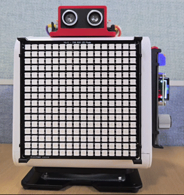</br>

> **한 걸음 더**  
> dyn 임계값 6.0과 0.4를 바꾸어 인식 감도를 조정해 보자. 값을 낮추면 약한 자극에도 반응하고, 높이면 강한 충격만 인식한다. 쓰다듬기 판단에 필요한 연속 횟수 6도 4로 낮추면 짧게 쓸어도 반응하는 것을 확인할 수 있다.

### Lock으로 공유 데이터 보호하기

> **풀고 싶은 문제**  
> 두 코어가 같은 변수를 동시에 증가시키면 결과가 얼마나 달라질까. Lock으로 보호했을 때와 보호하지 않았을 때를 직접 비교해 보자.

서브 스레드와 메인 스레드는 물리적으로 분리되어 독립 연산을 수행하지만, 하나뿐인 힙 메모리를 공유하므로 동일한 전역 변수에 동시에 접근하면 심각한 논리적 오류가 발생할 수 있다. 예를 들어, 한 코어가 전역 변수의 값을 1 증가시키는 덧셈(+=) 연산을 수행하는 과정은 하드웨어 수준에서 단 한 번에 처리되지 않는다. 내부적으로는 변수의 현재 값을 메모리에서 읽어오고(Read), 값을 1 증가시킨 뒤(Modify), 다시 메모리에 저장하는(Write) 세 단계의 세부 과정을 거친다. 만약 첫 번째 코어가 읽기와 증가 단계를 거치는 도중에 두 번째 코어가 동일한 변수의 값을 읽어가 버리면, 두 코어가 각각 값을 증가시켰음에도 불구하고 최종적으로는 한 번의 증가 결과가 누락되는 현상이 발생한다. 이처럼 둘 이상의 스레드가 공유 자원에 동시에 접근하여 실행 순서나 타이밍에 따라 결과가 달라지는 비결정적인 오류 상황을 경쟁 조건(Race Condition)이라고 한다.

이러한 문제점을 해결하기 위해 _thread.allocate_lock()으로 Lock 인스턴스를 만들고, 공유 데이터에 접근하기 전에 lock.acquire(), 접근이 끝나면 lock.release()를 호출하면 한 번에 하나의 코어만 접근하도록 보장할 수 있다.

```python
# thread_lock.py
import _thread
import time

lock = _thread.allocate_lock()
shared_count = 0  # shared resource accessed by both threads

def increment_task():
    global shared_count
    for _ in range(100000):
        lock.acquire()
        shared_count += 1  # Critical Section
        lock.release()

def main():
    global shared_count

    _thread.start_new_thread(increment_task, ())

    for _ in range(100000):
        lock.acquire()
        shared_count += 1  # Critical Section
        lock.release()

    time.sleep_ms(500)   # wait for core1 task to complete
    print("expected: 200000, got:", shared_count)

if __name__ == "__main__":
    main()
```

**코드 해설**

_thread.allocate_lock()으로 Lock 인스턴스를 하나 만들고, increment_task()와 main() 두 함수가 각각 100000번씩 shared_count를 1씩 늘린다. shared_count += 1은 겉으로는 한 줄이지만 내부적으로는 값 읽기, 1 더하기, 다시 쓰기의 세 단계로 이루어진다. 두 코어가 동시에 진행되면 한 코어가 값을 읽은 직후 다른 코어가 같은 값을 읽어 각자 1을 더하면, 두 번 더했는데도 한 번 더한 결과만 저장되는 경쟁 조건이 발생한다.

lock.acquire()와 lock.release() 사이의 구간이 임계 영역이다. 한 코어가 acquire()를 호출하면 잠금을 잡고, 다른 코어는 release()가 호출될 때까지 기다린다. 이렇게 하면 shared_count에 대한 읽기-수정-쓰기가 항상 한 번에 하나의 코어에서만 이루어진다.

time.sleep_ms(500)은 core1의 increment_task()가 100000번의 반복을 모두 마칠 때까지 기다리는 구간이다. core1이 먼저 끝나거나 늦게 끝날 수 있으므로 충분한 여유를 두고 기다린 뒤 shared_count를 출력한다.

**실행 결과와 확인할 점**

두 코어가 각각 100000번씩 증가시키므로 최종 값은 200000이어야 한다. Lock으로 보호하면 한 코어가 += 연산을 완전히 끝낼 때까지 다른 코어가 기다린다. Lock을 제거하면 최종 값이 200000보다 작아지는 것을 확인할 수 있다.

Lock을 잡은 채로 오래 기다리면 다른 코어가 멈춘 것처럼 보이므로 acquire와 release 사이는 최대한 짧게 유지한다. MicroPython에서 print()는 스레드 안전을 보장하지 않아 두 코어에서 동시에 호출하면 출력이 섞일 수 있다. _thread 스레드는 메인 프로그램이 종료되어도 자동으로 멈추지 않으므로 종료 신호 변수를 사용해 명시적으로 멈춰야 한다.

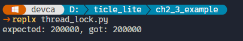</br>

> **한 걸음 더**  
> thread_lock.py에서 lock.acquire()와 lock.release() 두 줄을 주석 처리하고 실행해 보자. 출력 값이 200000보다 작아지거나 오류가 발생하는지 확인하고, Lock의 필요성을 직접 체감해 보자.
>
> 서브 스레드 루프 내부에서 새로운 인스턴스(리스트, 딕셔너리, 문자열 등)를 지속적으로 생성하면, MicroPython은 메모리 할당 테이블을 보호하기 위해 내부 잠금 장치(Global Interpreter Lock, GIL)를 반복적으로 사용한다. 이는 상대 코어의 실행을 일시적으로 멈추게 만들어 듀얼 코어의 병렬 처리 효율을 크게 떨어뜨리는 원인이 된다.
>
> 무엇보다 GIL은 메모리 구조의 무결성만을 보장할 뿐, 사용자가 작성한 변수의 논리적 원자성(Atomicity)까지 보호해 주지는 않으므로 사용자가 직접 _thread.allocate_lock()으로 상호 배제(Mutex) 잠금을 구현하여 이를 해결해야 한다.
>
> Lock은 두 코어가 같은 값을 동시에 고치지 못하게 잠그는 장치이다. 코어 0이 lock.acquire()를 호출하면 그 구간은 잠긴 상태가 되고, 코어 1은 lock.release()가 호출될 때까지 기다린다. 이렇게 하면 count = count + 1처럼 읽고 고치는 과정이 서로 겹치지 않는다.
>
> 중요한 점은 Lock을 잡은 상태로 오래 머물지 않는 것이다. 센서 읽기, 파일/통신 처리, 긴 sleep()처럼 시간이 걸리는 일은 Lock 밖에서 하고, Lock 안에서는 공유 변수 값을 읽거나 쓰는 짧은 일만 처리한다.
>
> Lock은 공유 데이터를 안전하게 지켜 주지만, 너무 오래 잡고 있으면 다른 코어가 기다리기만 하게 된다. 다음 두 가지를 특히 조심해야 한다.
> - Lock을 잡은 상태에서 센서 읽기, 통신, 긴 sleep()처럼 시간이 걸리는 일을 하지 않는다.
> - Lock을 여러 개 사용할 때는 항상 같은 순서로 잡는다. 서로 다른 순서로 잡으면 두 코어가 서로를 기다리며 멈출 수 있다.

### 두 번째 코어로 초음파 거리 측정

> **풀고 싶은 문제**  
> 초음파 센서가 에코 신호를 기다리는 시간이 화면 갱신을 방해한다. 거리 측정을 두 번째 코어에 맡기고, 메인 코어는 Pixel Display 보드 화면을 끊김 없이 갱신할 수 있을까?

초음파 센서(SR04)는 에코 신호를 기다리는 시간이 최대 38ms에 달한다. 동기 방식에서는 이 대기 동안 다른 작업이 멈추지만, _thread를 사용하면 거리 측정을 core1에 맡기고 core0는 화면 출력을 계속할 수 있다.

```python
# thread_pixel_ultrasonic.py
import _thread
import time
import math
from ticle_lite.us import SR04 as UltraSonic
from ticle_lite.ws2812 import Matrix

mat  = Matrix(0, brightness=0.05)
sonic = UltraSonic(trig=12, echo=13)
lock    = _thread.allocate_lock()
dist_m  = float('nan')  # shared resource accessed by both threads
running = True

def sensor_task():  # runs in Core1
    global dist_m
    while running:
        raw = sonic.read()
        d = raw
        lock.acquire()
        dist_m = d  # Critical Section
        lock.release()
        time.sleep_ms(80)

def main():
    global running
    
    _thread.start_new_thread(sensor_task, ())
    time.sleep_ms(50)    # wait for core1's first measurement to complete

    try:
        old_cm = -1  # Initialize to -1 so first measurement (including 0) always displays
        while True:
            lock.acquire()
            d = dist_m  # Critical Section
            lock.release()
            
            msg = None
            color = None
            
            if math.isnan(d):
                msg = "--"
                color = (255, 0, 0)
            else:
                cm = int(d * 100)
                if cm != old_cm:
                    old_cm = cm
                else:
                    time.sleep_ms(100)
                    continue
                
                msg = f"{cm}"
                if d < 0.1:
                    msg = "NEAR"
                    color = (255, 0, 100)
                elif d < 0.2:
                    color = (255, 100, 0)
                elif d < 0.4:
                    color = (0, 100, 255)
                else:
                    color = (0, 255, 0)

            mat.draw_text_scroll_blocking(msg, bg=color, speed_ms=15)
            time.sleep_ms(100)
    finally:
        running = False
        time.sleep_ms(150)
        sonic.deinit()
        mat.deinit()

if __name__ == "__main__":
    main()
```

**코드 해설**

_thread.start_new_thread() 직후의 time.sleep_ms(50)은 core1이 첫 번째 us.read()를 마칠 때까지 잠깐 기다리는 구간이다. SR04 에코 대기 시간은 최대 38ms이므로, 50ms 후에는 dist_m에 유효한 첫 측정값이 들어 있다. 덕분에 메인 루프가 시작될 때부터 바로 데이터를 읽을 수 있다.

sensor_task()는 core1에서 80ms마다 sonic.read()를 호출해 결과를 그대로 dist_m에 저장한다. 측정에 실패하면 NaN이 그대로 dist_m에 저장되며, 이는 메인 루프에서 math.isnan()으로 걸러진다. sonic.read()는 다음 줄로 돌아오기까지 최대 수십 ms가 걸릴 수 있지만 core1에서 실행되므로 core0의 화면 갱신에 영향을 주지 않는다. lock은 dist_m 변수에 대한 동시 접근을 막는다.

finally에서 running = False는 Lock으로 감싸지 않는다. running은 core1 반복문을 멈추기 위한 단순 종료 신호이고, sensor_task()도 이 값을 lock으로 읽지 않는다. 읽기 쪽은 보호하지 않으면서 쓰기 쪽만 임계 영역으로 감싸면 동기화 효과가 없고, 오히려 lock이 dist_m뿐 아니라 running까지 보호하는 것처럼 보일 수 있다. 따라서 이 예제에서 lock은 거리값 dist_m을 읽고 쓰는 짧은 구간에만 사용한다.

화면은 거리를 텍스트로 표시한다. 측정 중 NaN이면 빨간 배경에 --를 표시하고, 10cm 미만이면 진한 분홍 배경에 NEAR를 표시한다. 10~20cm는 주황 배경, 20~40cm는 파란 배경에 cm 단위 숫자를 표시하며, 40cm 이상은 초록 배경에 cm 단위 숫자를 표시한다. 2자리까지는 화면에 고정 표시되고, 100cm 이상의 3자리 숫자는 draw_text_scroll_blocking()으로 좌우 스크롤하여 보여 준다.

**실행 결과와 확인할 점**

프로그램을 실행하면 Pixel Display 보드에 초록 배경으로 cm 단위 거리가 표시된다. 손을 10cm 이내로 가져가면 진한 분홍 배경의 NEAR로 전환되고, 10~40cm 구간에서는 주황·파랑 배경으로 바뀌며, 측정 중에는 빨간 배경의 --가 나타난다. 숫자가 3자리(100cm 이상)일 때는 텍스트가 스크롤된다. core0는 화면 표시를, core1은 센서 읽기를 독립적으로 처리하므로 스크롤 중에도 측정이 계속된다.

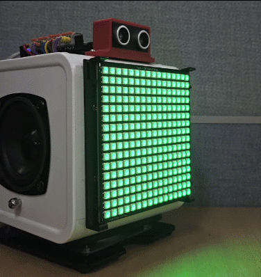</br>

### Pixel Display 보드 효과 인터랙티브 제어기

> **풀고 싶은 문제**  
> 버튼/VR/CdS/캐릭터 LCD/Pixel Display 보드를 동시에 다루는 종합 프로그램을 만들고 싶다. 각 장치가 서로를 방해하지 않고 자기 역할을 수행하게 하려면 어떻게 설계해야 할까?

이 예제는 앞에서 배운 IRQ, Timer, _thread를 목적에 맞게 조합하는 별도 종합 예제다. Pixel Display 보드 효과 여러 가지를 버튼으로 순환 선택하고, VR 다이얼로 각 효과의 조절값과 속도를 실시간으로 바꾼다. CDS는 주변 밝기에 따라 Pixel Display 보드 밝기를 자동 보정하고, CharLCD는 현재 상태를 두 줄로 표시한다. 버튼을 누를 때는 짧은 tone으로 전환 피드백도 준다.

픽셀 애니메이션은 검증된 Effect 클래스에 맡기고, 사용자 코드는 Effect를 자주 멈추거나 다시 만들지 않도록 제어 요청만 정리해서 전달한다. 느린 I2C LCD 출력과 짧은 오디오 피드백은 core1 스레드로 분리하고, core0에서는 Matrix와 Effect를 한 흐름에서만 다룬다.

Effect 라이브러리는 16×16 WS2812 환경에 맞춰 효과별 상태 메모리를 줄이고, 내부 Timer 콜백에서 메모리 할당을 피하도록 개선되어 있다. 또한 반응 지연이 컸던 sparkle과 차별성이 낮았던 fire_horizontal은 목록에서 제외하고, 밤하늘 별빛 효과인 night_sky를 포함한다.

| 구성 | 역할 | 이유 |
|------|------|------|
| core0 버튼 폴링 | 2ms마다 btn.update()로 눌림 수집 | 즉각 처리와 단순 구조를 동시에 갖추기 위해 |
| core0 센서 폴링 | 30ms마다 VR과 CDS를 읽음 | 센서 읽기와 Effect 제어를 한 흐름에서 처리하기 위해 |
| core0 메인 루프 | Effect 전환, VR 조절, CDS 밝기 반영 | Matrix와 Effect 접근을 한 코어로 제한하기 위해 |
| core1 스레드 | CharLCD 갱신, Audio.tone 출력 | 느린 I2C와 I2S 작업이 Effect 제어 흐름을 막지 않게 하기 위해 |
| Effect 내부 Timer | 애니메이션 프레임 갱신 | 검증된 효과 엔진이 정해진 속도로 화면을 갱신하게 하기 위해 |

버튼은 메인 루프가 2ms마다 btn.update()를 호출해 직접 눌림 이벤트를 수집한다. 눌린 버튼이 감지되면 효과 전환과 start_effect() 호출은 core0에서 즉시 처리하고, 오디오 피드백 요청만 beep_q에 기록해 core1로 넘긴다. ADC 읽기, 필터 적용, Effect 재설정도 core0 메인 루프에서 처리한다. 화면을 그리는 Matrix와 Effect는 core0에서만 접근하고, LCD와 오디오는 core1에서만 접근하도록 나누어 장치 간 충돌 가능성을 줄인다.

| 장치/입력 | 역할 |
|-----------|------|
| RIGHT 버튼 | 다음 효과로 전환 + 짧은 높은 tone |
| LEFT 버튼  | 이전 효과로 전환 + 짧은 낮은 tone |
| VR(GPIO 27) | 효과에 조절값이 있으면 해당 값 조절, 없으면 애니메이션 속도 조절 |
| CDS(GPIO 28) | 주변 밝기에 따라 Pixel Display 보드 밝기 자동 보정 |
| CharLCD 0번 줄 | 현재 효과 이름 |
| CharLCD 1번 줄 | 효과 라벨, VR 레벨(0–15), CDS raw 값(0–4095) |

```python
# thread_matrix_effect_controller.py
import _thread
import time
from array import array

from ticle_lite.ain import Ain
from ticle_lite.button import Button
from ticle_lite.audio import Audio
from ticle_lite.ws2812 import Matrix, Effect
from ticle_lite.hd44780 import HD44780_PCF8574 as CharLCD
from ticle_lite.i2c import I2CController
from ufilter import Median

# Grouped timing values make the control loop easier to tune.
ADC_MS      = 30
LCD_MS      = 120
EFFECT_MS   = 120
LOOP_MS     = 2
CORE1_MS    = 5
VR_LEVELS   = 16
VR_HYST     = 45
CDS_HYST    = 20

BRIGHT_TABLE = (
    (500, 0.008), 
    (650, 0.010), 
    (820, 0.012), 
    (1020, 0.018),
    (1260, 0.030), 
    (1540, 0.050), 
    (1850, 0.100), 
    (2180, 0.150),
    (2460, 0.200), 
    (2600, 0.250),
)

# VR changes visible effect parameters and also nudges animation speed.
EFFECTS = [
    ("night_sky",         "SKY", (("stars", 18, 72), ("twinkle_step", 1, 8))),
    ("meteor_rain",       "MET", (("count", 1, 8), ("trail", 3, 8), ("step", 1, 3))),
    ("fireworks",         "FIR", (("rockets", 1, 3), ("sparks", 16, 36), ("life_decay", 8, 22))),
    ("campfire",          "CMP", (("sparking", 60, 220), ("ember_particles", 8, 32), ("cooling", 35, 80))),
    ("matrix_rain",       "MTX", (("spawn_prob", 12, 100), ("decay", 12, 48), ("trail_boost", 70, 170))),
    ("spark_stream",      "STR", (("emitters", 1, 5), ("spawn_rate", 1, 7), ("max_sparks", 16, 56))),
    ("horizontal_wave",   "WAV", (("wavelength", 5, 48), ("phase_step", 1, 10))),
    ("comet_horizontal",  "COM", (("count", 1, 8), ("trail", 3, 8), ("fade", 205, 250))),
    ("scrolling_gradient","GRD", (("segment_width", 4, 80),)),
    ("scanner",           "SCN", (("width", 2, 4), ("fade", 205, 252))),
]

def level(raw):
    return int(raw) * (VR_LEVELS - 1) // 4095

def pad16(text):
    text = str(text)[:16]
    return text + " " * (16 - len(text))

def param_value(vr_lvl, lo, hi):
    return int(lo + ((hi - lo) * vr_lvl) // (VR_LEVELS - 1))

def effect_speed(vr_lvl):
    return 0.045 - ((0.045 - 0.010) * vr_lvl / (VR_LEVELS - 1))

def brightness(raw):
    for limit, value in BRIGHT_TABLE:
        if raw <= limit:
            return value
    return BRIGHT_TABLE[-1][1]

def stable_level(raw, old):
    new = level(raw)
    if new > old:
        limit = ((old + 1) * 4095 // (VR_LEVELS - 1)) + VR_HYST
        return new if raw >= limit else old
    if new < old:
        limit = (old * 4095 // (VR_LEVELS - 1)) - VR_HYST
        return new if raw <= limit else old
    return old

def start_effect(fx, idx, vr_lvl):
    name, _label, params = EFFECTS[idx]
    kwargs = {"speed": effect_speed(vr_lvl)}
    for param, lo, hi in params:
        kwargs[param] = param_value(vr_lvl, lo, hi)
    getattr(fx, name)(**kwargs)

def main():
    ain = Ain([27, 28], bits=12)          # GP27: VR, GP28: CDS, 12-bit ADC
    btn = Button([17, 19])                # GP17: LEFT, GP19: RIGHT

    # Note) You must create an Audio object before creating a Matrix object.
    audio = Audio(sck=4, ws=5, sd_out=7)  # GP4: SCK, GP5: WS, GP7: SPEAKER
    audio.volume = 0.5
    matrix = Matrix(0, brightness=BRIGHT_TABLE[0][1])
    fx = Effect(matrix)
    i2c = I2CController(sda=10, scl=11) 
    lcd = CharLCD(i2c)
    lcd.clear()

    vr0 = ain[0].read()
    cds0 = ain[1].read()
    vr_filter = Median(5, initial=vr0)
    cds_filter = Median(5, initial=cds0)

    lock = _thread.allocate_lock()
    beep_lock = _thread.allocate_lock()
    shared = {"idx": 0, "vr_lvl": level(vr0), "cds_raw": cds0}

    running = True
    beep_q = array("b", [0] * 8)
    beep_head = beep_tail = 0

    def publish(idx, vr_lvl, cds_raw):
        lock.acquire()
        shared["idx"], shared["vr_lvl"], shared["cds_raw"] = idx, vr_lvl, cds_raw
        lock.release()

    def queue_beep(step):
        nonlocal beep_tail
        beep_lock.acquire()
        tail = (beep_tail + 1) % len(beep_q)
        if tail != beep_head:
            beep_q[beep_tail] = step
            beep_tail = tail
        beep_lock.release()

    def lcd_task():
        nonlocal beep_head
        last0 = last1 = None
        next_lcd = time.ticks_add(time.ticks_ms(), -LCD_MS)

        while running:
            # Audio runs on core1 so the matrix/effect loop keeps polling inputs.
            beep_lock.acquire()
            step = 0
            if beep_head != beep_tail:
                step = beep_q[beep_head]
                beep_head = (beep_head + 1) % len(beep_q)
            beep_lock.release()

            if step:
                audio.tone(880 if step > 0 else 660, 45, fade_ms=12)

            now = time.ticks_ms()
            if time.ticks_diff(now, next_lcd) >= 0:
                lock.acquire()
                idx = shared["idx"]
                vr_lvl = shared["vr_lvl"]
                cds_raw = shared["cds_raw"]
                lock.release()

                name, label, _params = EFFECTS[idx]
                row0 = pad16(name)
                row1 = pad16("%s:%2d/%2d C:%4d" %
                             (label, vr_lvl, VR_LEVELS - 1, cds_raw))
                if row0 != last0:
                    lcd.text(row0, 0, 0)
                    last0 = row0
                if row1 != last1:
                    lcd.text(row1, 0, 1)
                    last1 = row1
                next_lcd = time.ticks_add(now, LCD_MS)

            time.sleep_ms(CORE1_MS)

    idx = 0
    vr_lvl = level(vr0)
    cds_raw = cds0
    matrix.brightness = brightness(cds_raw)
    publish(idx, vr_lvl, cds_raw)
    start_effect(fx, idx, vr_lvl)

    _thread.start_new_thread(lcd_task, ())

    next_adc = time.ticks_add(time.ticks_ms(), ADC_MS)
    last_effect = time.ticks_ms()
    effect_waiting = False

    try:
        while True:
            # Poll the button state and update the effect index if a button is pressed.
            for btn_idx in btn.update(Button.PRESS):
                step = -1 if btn_idx == 0 else 1
                idx = (idx + step) % len(EFFECTS)
                queue_beep(step)
                publish(idx, vr_lvl, cds_raw)
                start_effect(fx, idx, vr_lvl)
                last_effect = time.ticks_ms()
                effect_waiting = False

            now = time.ticks_ms()
            if time.ticks_diff(now, next_adc) >= 0:
                next_adc = time.ticks_add(now, ADC_MS)
                new_vr = stable_level(ain[0].filtered(vr_filter), vr_lvl)
                new_cds = int(ain[1].filtered(cds_filter))

                changed = False
                if new_vr != vr_lvl:
                    vr_lvl = new_vr
                    effect_waiting = True
                    changed = True
                if abs(new_cds - cds_raw) > CDS_HYST:
                    cds_raw = new_cds
                    matrix.brightness = brightness(cds_raw)
                    changed = True
                if changed:
                    publish(idx, vr_lvl, cds_raw)

            if effect_waiting and time.ticks_diff(time.ticks_ms(), last_effect) >= EFFECT_MS:
                start_effect(fx, idx, vr_lvl)
                last_effect = time.ticks_ms()
                effect_waiting = False

            time.sleep_ms(LOOP_MS)
    finally:
        running = False
        btn.deinit()
        fx.stop()
        matrix.deinit()
        ain.deinit()
        audio.deinit()
        lcd.deinit()

if __name__ == "__main__":
    main()
```

**코드 해설**

코드는 설정값, 보조 함수, main()으로 구성된다. 보조 함수는 밝기 계산, VR 레벨 안정화, 효과 시작처럼 반복해서 쓰는 계산과 동작을 맡고, main()은 장치 초기화, core1 스레드, core0 메인 루프를 한곳에서 묶는다. 이 예제의 핵심은 모든 장치를 같은 루프에 넣는 것이 아니라, 각 작업의 성격에 맞는 실행 위치를 분리하는 것이다.

장치 초기화 단계에서는 Ain, Button, Audio, Matrix, Effect, LCD를 순서대로 준비한다. Audio는 PIO 상태 머신을 고정 번호로 선점하므로 Matrix보다 먼저 생성해야 한다.

Effect와 Matrix는 core0에서만 접근한다. Effect는 내부 Timer와 micropython.schedule()로 애니메이션 스텝을 예약하므로, 같은 Matrix를 core1에서 동시에 건드리면 프레임버퍼가 섞일 수 있다. 따라서 core1은 LCD와 Audio만 맡고, Pixel Display 보드 관련 작업은 start_effect(), matrix.brightness 변경, 정리 코드까지 모두 core0에 남겨 둔다.

버튼은 메인 루프가 LOOP_MS(2ms)마다 btn.update(Button.PRESS)를 호출해 직접 눌림 이벤트를 수집한다. 눌린 버튼이 감지되면 LEFT(인덱스 0)는 step=-1, RIGHT(인덱스 1)는 step=+1로 즉시 처리한다. 효과 인덱스를 갱신하고 start_effect()를 호출한 뒤, queue_beep(step)으로 오디오 피드백 요청을 beep_q에 쌓는다. beep_q는 크기 8의 미리 할당된 array 링 버퍼로, 큐가 꽉 찼을 때 들어오는 요청은 조용히 버린다. 효과 전환과 센서 처리는 모두 core0 메인 루프에서 담당하고, LCD와 오디오는 core1에서만 접근하도록 나누어 장치 간 충돌 가능성을 줄인다.

VR과 CDS는 core0 메인 루프가 30ms마다 읽는다. 읽은 값은 Median(5) 필터를 거치며, VR 값은 stable_level()로 한 번 더 확인해 레벨 경계 근처에서 숫자가 흔들리는 현상을 줄인다.

core1의 lcd_task()는 매 CORE1_MS(5ms)마다 먼저 beep_q를 확인한다. 요청이 있으면 step > 0이면 880Hz, step < 0이면 660Hz의 45ms짜리 음을 낸다. 오디오 피드백을 core1로 분리한 덕분에 tone() 재생 중에도 core0의 버튼·센서 폴링이 멈추지 않는다. 그다음 LCD_MS(120ms) 간격이 되면 shared 상태를 Lock으로 짧게 복사한 뒤 Lock을 놓고 LCD 출력을 처리한다. Lock을 잡은 채 I2C 작업을 하지 않는 것이 중요하다. LCD는 바뀐 줄만 다시 쓰고, 문자열은 pad16()으로 공백을 붙여 16자로 맞춘다. MicroPython 환경에 따라 ljust()가 없을 수 있기 때문이다.

메인 루프는 버튼 확인과 센서 값 갱신을 빠르게 반복한다. VR 레벨이 바뀌면 effect_waiting 플래그를 세우고 publish()로 shared를 갱신한다. EFFECT_MS(120ms)가 지난 뒤에야 start_effect()를 다시 호출하는데, VR을 돌릴 때마다 즉시 재설치하지 않음으로써 메모리 압박과 화면 끊김을 줄인다. CDS 값이 CDS_HYST보다 크게 바뀌면 BRIGHT_TABLE에서 밝기를 다시 계산해 matrix.brightness에 반영한다.

Effect 속도는 VR 레벨에 따라 약 45ms에서 10ms 사이로 변한다. Effect 자체는 더 빠르게 동작할 수 있지만, LCD와 센서, 버튼 피드백을 함께 다루는 종합 예제에서는 화면의 부드러움보다 전체 반응 안정성이 더 중요하다.

**실행 결과와 확인할 점**

프로그램을 실행하면 Pixel Display 보드에 첫 번째 효과가 나타나고, 캐릭터 LCD 0번 줄에 효과 이름, 1번 줄에 효과 라벨, VR 레벨, CDS raw 값이 표시된다. RIGHT 버튼을 누르면 짧은 높은 tone과 함께 다음 효과로, LEFT 버튼을 누르면 짧은 낮은 tone과 함께 이전 효과로 넘어가야 한다. 버튼을 빠르게 여러 번 눌러도 입력이 쉽게 사라지지 않고 순서대로 반영되어야 한다. 

VR을 고정했을 때 표시 단계가 계속 튀지 않는지, CDS에 빛을 비추거나 가렸을 때 Pixel Display 보드 밝기가 실시간으로 변하는지 확인한다. 캐릭터 LCD 표시는 core1에서 120ms 단위로 갱신되므로 픽셀 효과보다 약간 늦게 보일 수 있지만, 버튼 전환과 센서 반응이 밀려서는 안 된다.

</br>

---

## asyncio

> **풀고 싶은 문제**  
> 장치가 3개, 4개로 늘어날수록 while True 루프에 모든 처리를 넣는 것이 한계에 부딪힌다. LCD는 150ms마다, 센서는 40ms마다, 화면은 100ms마다 갱신해야 할 때, 각 장치가 자기만의 리듬으로 독립적으로 동작하게 할 수 없을까?

asyncio는 여러 작업을 한 번에 다루기 위한 MicroPython의 비동기 라이브러리이다. 여기서 중요한 점은 스레드를 여러 개 만드는 것이 아니라, 대기 시간이 생길 때 다른 작업에 실행 기회를 넘겨 준다는 것이다.

센서를 읽고, LCD를 갱신하고, Pixel Display 보드를 바꾸는 일은 모두 서로 다른 속도로 이루어진다. 어떤 작업은 40밀리초마다, 어떤 작업은 150밀리초마다 실행하면 충분하다. 이런 경우 모든 것을 하나의 반복문으로 처리하는 것보다, 작업을 나누어 번갈아 실행하는 방식이 훨씬 효율적이다.

### asyncio와 _thread 비교

두 방식의 특성을 이해하는 것이 중요하다.

| 항목 | asyncio | _thread |
| ---- | ------- | ------- |
| 동작 코어 | 1개 (작업을 번갈아 실행) | 2개 (진정한 병렬) |
| 전환 방식 | await를 만날 때 다른 작업 실행 | 두 코어가 동시에 실행 |
| 공유 데이터 | 잠금 불필요 | Lock 필수 |
| 주 용도 | 센서/화면/소리처럼 기다림이 있는 작업 | 계산이 많은 작업 분리 |
| 복잡도 | 중간 | 높음 |

asyncio가 적합한 상황은 여러 장치를 기다리는 동안 번갈아 사용하는 경우이고, _thread가 적합한 상황은 계산이 오래 걸리거나 한동안 돌아오지 않는 코드를 메인 루프와 완전히 분리해야 하는 경우이다.

### asyncio의 핵심 요소

asyncio는 실행을 도중에 일시 중단(Suspend)했다가 필요한 시점에 멈춘 지점부터 다시 이어서 실행(Resume)할 수 있는 특별한 함수인 코루틴(Coroutine, Cooperative Routine)을 관리하는 모듈이다. 코루틴을 이용하면 단일 코어 환경이나 자원이 제한된 임베디드 시스템(MicroPython 등)에서 프로세스나 스레드를 물리적으로 늘리지 않고도, 여러 작업을 동시에 처리하는 것처럼 소프트웨어 수준의 멀티태스킹을 구현할 수 있다.

이러한 비동기 시스템에서 async 키워드는 일반 함수를 코루틴 인스턴스로 선언하고, await 키워드는 코루틴 내부를 작업 조각으로 나누는 분기점 역할을 한다. 이처럼 정의된 코루틴들을 내부 이벤트 루프를 통해 타이밍에 맞게 실행하고 중단하며 전체 스케줄링을 담당하는 것이 바로 asyncio 모듈이다.

함수 정의 앞에 async를 붙이면 해당 함수가 비동기로 동작하는 코루틴임을 나타내는데, 호출 시 내부 코드가 즉시 실행되지 않고 이벤트 루프가 스케줄링할 수 있는 작업 인스턴스로 변환된다. 반면 await는 반드시 async 함수 내부에서만 사용할 수 있으며, 시간이 걸리는 연산 앞에 붙여 코루틴 실행을 잠시 중단한다. 이 지점이 코루틴 내부의 절단선이 되는데, 대기하는 동안 제어권을 다른 코루틴에 넘겨 프로세서가 쉬지 않고 여러 작업을 번갈아 처리할 수 있게 한다.

예를 들어 아래의 my_task 코루틴은 하나의 함수처럼 보이지만, 내부적으로는 await 키워드를 분기점으로 삼아 총 3개의 독립된 작업 조각으로 나뉘어 스케줄러에 의해 관리된다.

```python
async def my_task():
    # [작업 조각 1]
    print("시작")
    x = 10
    
    await asyncio.sleep_ms(500) # ---- 첫 번째 절단선
    
    # [작업 조각 2]
    print("중간 단계:", x)
    
    await asyncio.sleep_ms(500) # ---- 두 번째 절단선
    
    # [작업 조각 3]
    print("종료")
```

asyncio 모듈의 run()은 이벤트 루프를 시작하고 메인 코루틴을 실행하는데, 프로그램이 완전히 종료될 때까지 대기열에 등록된 모든 비동기 작업을 총괄한다.

gather()는 여러 코루틴을 동시에 실행하는데, 지정한 모든 작업이 완료될 때까지 호출 지점에서 대기한다. LED 깜빡이기, 센서 측정, 네트워크 통신처럼 서로 독립적으로 실행되어야 하는 작업들을 한꺼번에 출발시킬 때 사용한다. create_task()는 코루틴을 백그라운드 태스크로 등록하는데, 완료를 기다리지 않고 즉시 다음 코드로 넘어간다. 센서 값 갱신이나 입력 감시처럼 상시 실행되어야 하는 루틴을 메인 흐름과 분리하여 독립적으로 운용할 때 사용한다.

sleep_ms()는 지정한 밀리초(ms) 동안 현재 코루틴만 일시 중단하고 제어권을 다른 코루틴에 넘긴다. 하드웨어 지연 함수인 time.sleep_ms()가 CPU 전체를 점유하여 다른 코드 실행을 막는 것과 달리, asyncio.sleep_ms()는 대기 시간 동안 다른 코루틴이 계속 실행될 수 있게 한다.

| 요소 | 의미 |
| ---- | ---- |
| async def | 비동기 함수를 정의한다. |
| await | 현재 작업을 잠시 멈추고 다른 작업에 실행 기회를 준다. |
| asyncio.gather() | 여러 비동기 작업을 함께 실행한다. |
| asyncio.create_task() | 하나의 비동기 작업을 백그라운드로 실행한다. |
| asyncio.sleep_ms() | 정해진 시간 동안 기다리면서 다른 작업이 실행되게 한다. |

### 동기 방식과 비동기 방식 비교

> **풀고 싶은 문제**  
> 세 작업을 순서대로 기다리면 총 시간이 각각의 합이 된다. 비동기로 바꾸면 전체 시간이 어떻게 달라지는지 직접 측정해 보자.

예를 들어 세 작업 A, B, C가 각각 1초, 2초, 3초가 걸린다고 하자. 동기 방식은 A가 끝난 뒤 B를, B가 끝난 뒤 C를 실행한다. 따라서 총 시간은 약 6초가 된다. 반면 비동기 방식은 기다리는 시간 동안 다른 작업을 실행할 수 있으므로 전체 시간이 가장 긴 작업 시간에 가까워진다.

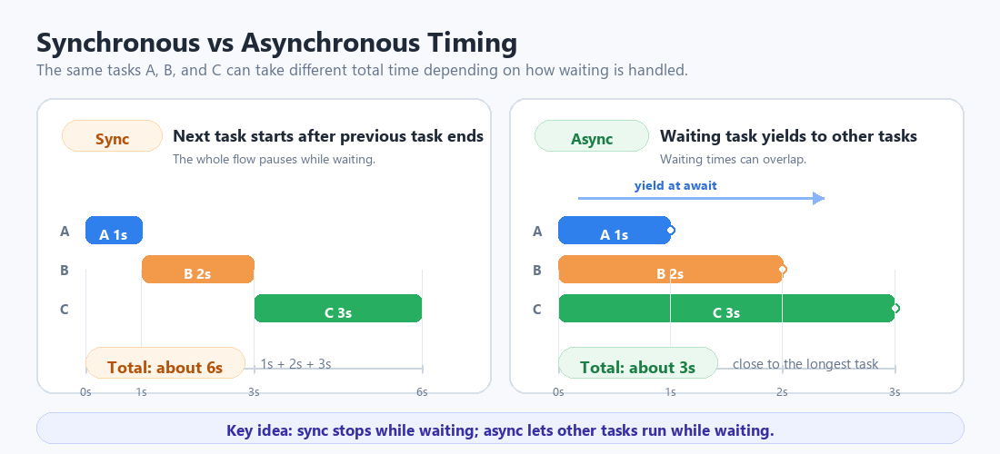</br>

| 항목 | 동기 방식 | 비동기 방식 |
| ---- | --------- | ----------- |
| 실행 순서 | 한 작업이 끝난 뒤 다음 작업 실행 | 작업들이 번갈아 실행 |
| 총 소요 시간 | 모든 작업 시간의 합에 가까움 | 가장 긴 작업 시간에 가까움 |
| 적합한 상황 | 반드시 순서가 고정되어야 할 때 | 여러 장치가 동시에 동작해야 할 때 |

세 작업을 순서대로 실행했을 때 전체 시간이 얼마나 걸리는지 측정해 보자. 비동기 예제와 결과를 비교하기 위한 기준점이다.

```python
# work_sync.py
import time

def task_sync(name, duration_ms):
    print(name, "start")
    time.sleep_ms(duration_ms)
    print(name, "done")

def main():
    start = time.ticks_ms()
    task_sync("A", 1000)
    task_sync("B", 2000)
    task_sync("C", 3000)
    elapsed = time.ticks_diff(time.ticks_ms(), start) / 1000
    print("total = {:.1f} sec".format(elapsed))

if __name__ == "__main__":
    main()
```

실행 결과는 다음과 같다.

</br>


같은 세 작업을 비동기로 바꾸면 전체 시간이 어떻게 달라지는지 측정해 보자. await를 만나면 이벤트 루프가 어떻게 작업을 넘기는지 관찰한다.

```python
# work_async.py
import asyncio
import time

async def task_async(name, duration_ms):
    print(name, "start")
    await asyncio.sleep_ms(duration_ms)  # sleep_ms() is a non-blocking sleep
    print(name, "done")

async def main():
    start = time.ticks_ms()
    await asyncio.gather(
        task_async("A", 1000),
        task_async("B", 2000),
        task_async("C", 3000),
    )
    elapsed = time.ticks_diff(time.ticks_ms(), start) / 1000
    print("total = {:.1f} sec".format(elapsed))


asyncio.run(main())
```

**코드 해설**

동기 예제는 한 함수가 끝날 때까지 다음 함수가 기다린다. 반면 비동기 예제는 await asyncio.sleep_ms()를 만났을 때 다른 작업이 실행될 수 있다. 따라서 각 작업이 번갈아 진행되며, 전체 시간은 가장 오래 걸리는 작업에 가까워진다.

이 차이는 하드웨어 제어에서 매우 중요하다. 센서 읽기, 화면 표시, 통신 처리를 하나의 반복문에서 모두 기다리게 하면 반응성이 떨어지지만, 비동기 구조를 사용하면 각 작업이 필요한 주기로 나뉘어 실행될 수 있다.

**실행 결과와 확인할 점**

프로그램을 실행하면 A가 먼저 시작되고, await asyncio.sleep_ms()를 만나 대기 상태에 들어가면 B가 이어 실행된다. B도 같은 방식으로 대기에 들어가면 C가 시작된다. 이후 대기 시간이 끝나는 순서대로 A, B, C가 차례로 종료된다. 

await asyncio.sleep_ms()는 단순히 기다리는 것이 아니다. 이 작업이 잠깐 쉬는 동안 다른 작업이 실행될 수 있게 자리를 비켜 주는 것이다. await 없이 time.sleep_ms()를 쓰면 현재 작업이 쉬는 동안 다른 작업도 함께 멈춘다.

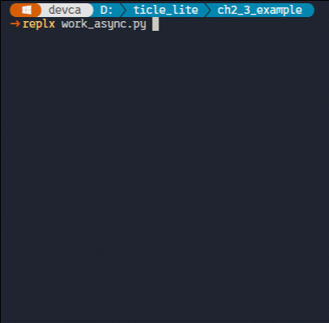</br>


### 비동기 방식으로 초음파 거리 측정

> **풀고 싶은 문제**  
> 3장에서는 초음파 거리를 측정하고 출력하는 일을 하나의 while 루프에서 처리했다. 측정이 끝나야 출력할 수 있고, 출력이 끝나야 다음 측정을 시작한다. 측정 주기와 출력 주기를 서로 다르게 조정하거나, 두 작업 사이에 다른 일을 끼워 넣으려면 구조를 어떻게 바꿔야 할까?

3장의 초음파 측정 코드는 트리거 신호 발생, 에코 대기, 거리 계산, 출력을 하나의 루프 안에서 순서대로 처리했다. asyncio로 바꾸면 이 과정을 역할별로 나눌 수 있다. _update_distance_loop()은 50밀리초 주기로 센서 값을 갱신하는 백그라운드 태스크로 등록하고, main()은 100밀리초 주기로 최신 거리 값을 읽어 출력하기만 하는데, 두 코루틴은 current_distance 변수를 통해 값을 공유한다.

```python
from machine import Pin, time_pulse_us
import time
import asyncio

trig = Pin(10, Pin.OUT)
echo = Pin(11, Pin.IN)
current_distance = 0.0

async def _update_distance_loop():
    global current_distance
    
    while True:
        trig.value(1)
        time.sleep_us(10)
        trig.value(0)
        
        duration = time_pulse_us(echo, 1, 25000)
        
        if duration > 0:
            current_distance = (duration * 0.0343) / 2
        else:
            current_distance = -1.0  # don't get a valid reading
            
        await asyncio.sleep_ms(50)

async def main():
    asyncio.create_task(_update_distance_loop())
    await asyncio.sleep_ms(10)  # give the distance loop a chance to start and get a reading

    while True:
        print(f"Distance: {current_distance:.1f} cm")
        await asyncio.sleep_ms(100)

asyncio.run(main())
```

**코드 해설**

asyncio.create_task(_update_distance_loop())는 측정 루프를 백그라운드 태스크로 등록하는데, 완료를 기다리지 않고 즉시 while True 루프로 진입한다. 이후 측정 루프와 출력 루프는 각자의 sleep_ms 주기에 따라 번갈아 실행된다.

_update_distance_loop()의 await asyncio.sleep_ms(50)이 두 코루틴 사이의 절단선이다. 이 50밀리초 대기 동안 main()이 실행될 수 있고, main()의 await asyncio.sleep_ms(100) 동안에는 다시 측정 루프가 실행된다. 출력 주기가 측정 주기의 두 배이므로, 출력할 때마다 측정은 이미 두 번 이루어진 상태이다.

측정 결과는 current_distance 전역 변수로 공유한다. asyncio는 협력형 멀티태스킹이라 await 사이에는 단 하나의 코루틴만 실행되는데, 덕분에 같은 변수를 읽고 쓸 때 별도의 잠금 장치 없이 안전하게 공유할 수 있다.

단, time_pulse_us()는 에코를 기다리는 동안 최대 25밀리초간 CPU를 점유하는 동기 함수이다. 이 구간에서는 다른 코루틴이 잠시 멈추지만, 초음파 측정에 필요한 최소한의 하드웨어 타이밍이므로 불가피한 절충안이다. 이 한계를 완전히 없애려면 SR04Async처럼 하드웨어 타이머를 이용한 비동기 도우미 클래스를 사용한다.

**실행 결과와 확인할 점**

약 100밀리초 간격으로 거리 값이 출력된다. 손을 센서 앞에서 움직이면 값이 즉시 따라오는 것을 확인할 수 있다. 측정 범위를 벗어나면 -1.0 cm가 출력되는데, 이는 에코 신호를 받지 못했음을 나타낸다.

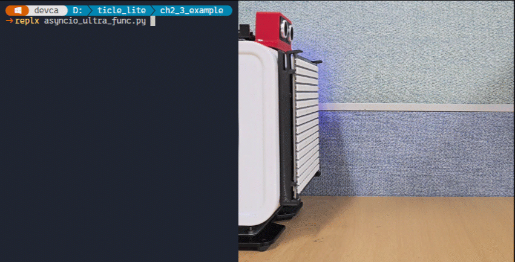</br>

### asyncio를 쓰면 달라지는 것

IRQ, 타이머, _thread는 기존 코드에 얹는 방식이다. while True 루프는 그대로 두고, 거기에 IRQ 처리 함수를 등록하거나 스레드를 추가하면 된다. 기존 코드를 크게 바꾸지 않아도 새 기능을 추가할 수 있다. 하지만 asyncio는 다르다. 프로그램 전체를 async def 함수로 다시 구성해야 한다. 진입점은 반드시 asyncio.run(main())이어야 하고, 오래 실행되는 모든 동작은 async def 함수 안에 있어야 한다. 어느 한 곳에서라도 time.sleep_ms()처럼 그냥 기다리는 코드가 있으면, 그 동안 다른 작업 전체도 함께 멈춘다.

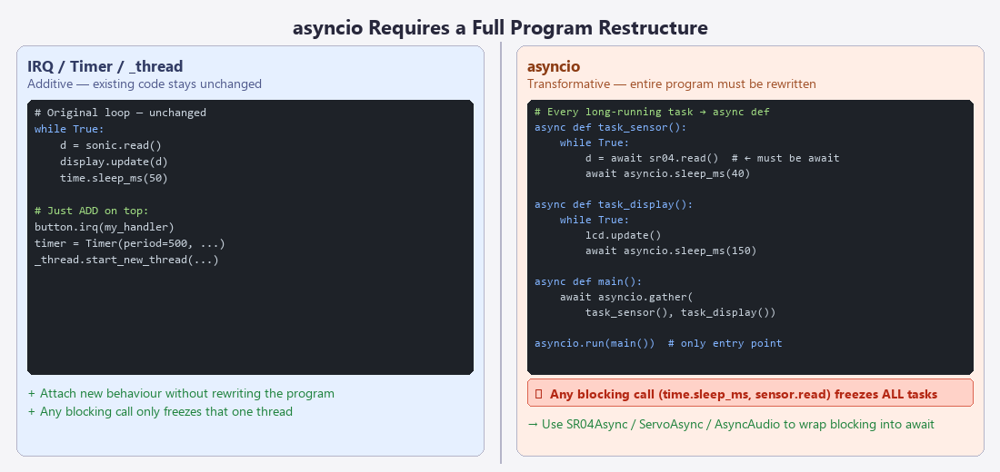</br>

이것이 바로 비동기 도우미 클래스가 필요한 이유다. us.read(), servo.move_to()처럼 결과가 나올 때까지 기다리는 함수를 그대로 쓰면 asyncio 프로그램 전체가 거기서 멈춰 버린다. SR04Async, ServoAsync 같은 비동기 도우미 클래스는 이 대기를 await로 바꿔 주어, 기다리는 동안 다른 작업이 계속 실행될 수 있게 한다.

asyncio에서 작업 전환은 await를 만날 때만 일어난다. 미리 정해진 시간마다 강제로 넘기는 것이 아니다. 따라서 await 없이 오래 걸리는 코드가 있으면 그 코드가 끝날 때까지 다른 작업은 아무것도 할 수 없다. _thread는 두 코어가 나뉘거나 인터럽트로 전환되지만, asyncio는 작업 스스로 await에서 자리를 비켜 주는 방식이다.

3장과 4장에서 사용한 각 장치 클래스에는 함께 쓸 수 있는 비동기 도우미 클래스가 있다. 핀 설정과 장치 준비 방법은 그대로 두고, 기다리는 시간이 생길 때 다른 작업도 함께 실행할 수 있게 바꿔 준다.

### ButtonAsync: 이벤트 기반 버튼 감시

> **풀고 싶은 문제**  
> 버튼 이벤트를 감시하면서 Pixel Display 보드 출력도 계속하고 싶다. 두 작업이 동시에 동작하려면 어떻게 구성해야 할까? 

ButtonAsync는 Button 인스턴스를 비동기 방식으로 사용할 수 있게 도와준다. 버튼 상태를 계속 확인하다가 클릭이 생기면 하나씩 알려 주고, 필요하면 특정 버튼이 눌릴 때까지 기다릴 수도 있다.

다음 예제는 버튼을 누를 때 마다 Pixel Display 보드가 지정된 색으로 변하는 것을 보여준다. task_button()이 버튼 이벤트를 감시하는 동안 task_idle()은 1초마다 상태를 출력한다.

```python
# asyncio_button.py
import asyncio
from ticle_lite.button import Button
from ticle_lite.button_async import ButtonAsync
from ticle_lite.ws2812 import Matrix

btn  = Button([16, 17, 18, 19]) # GP16: UP, GP17: LEFT, GP18: DOWN, GP19: RIGHT
abtn = ButtonAsync(btn)
mat  = Matrix(0, brightness=0.2)
COLORS = [(200, 0, 0), (0, 150, 0), (0, 0, 200), (150, 100, 0)]

async def task_button():
    async for idx, event in abtn.events(poll_ms=10):
        if event == 'press':  # fast processing of button press events
            mat.fill(COLORS[idx])
            mat.update()

async def task_idle():
    cnt = 0
    while True:
        print(f"running... {cnt}")
        cnt += 1
        await asyncio.sleep_ms(1000)

async def main():
    await asyncio.gather(task_button(), task_idle())

try:
    asyncio.run(main())
finally:
    btn.deinit()
    mat.deinit()
```

**코드 해설**

abtn.events(poll_ms=10)는 10ms마다 Button.update()를 호출해 버튼 상태를 확인하고, 변화가 생긴 버튼의 번호와 이벤트 이름을 하나씩 돌려주는데, idx는 버튼 인덱스로 0이면 UP(GP16), 1이면 LEFT(GP17), DOWN(GP18), RIGHT(GP19)이며, COLORS[idx]로 각 버튼에 고유한 색이 지정된다.

events()가 반환하는 이벤트 종류에는 press, release, click, long_press, double_click이 있다. 이 중 press는 버튼을 누르는 순간 발생한다. click은 릴리즈 후 일정 시간(기본값 200ms) 동안 다시 눌리지 않아야 발생하는데, 이는 더블클릭과 구분하기 위해서이다. 따라서 click을 쓰면 반응이 일정 시간 지연될 뿐 아니라, 연속으로 빠르게 누를 경우 double_click만 발생하고 click은 끝내 발생하지 않아 화면이 반응하지 않는 것처럼 보인다. 즉각 반응이 필요한 경우에는 press를 사용한다.

버튼을 기다리는 동안에도 다른 작업에 실행 기회가 넘어가므로, task_idle()의 출력도 계속 이어진다.

**실행 결과와 확인할 점**

프로그램을 실행하면 터미널에 "running..."이 1초마다 출력된다. UP을 누르면 Pixel Display 보드가 진한 빨간색(200, 0, 0)으로, LEFT를 누르면 초록색(0, 150, 0)으로, DOWN을 누르면 파란색(0, 0, 200)으로, RIGHT를 누르면 주황색(150, 100, 0)으로 채워진다. 출력이 멈추지 않으면서 버튼도 즉시 반응하는 것이 asyncio 병행 실행의 핵심이다.

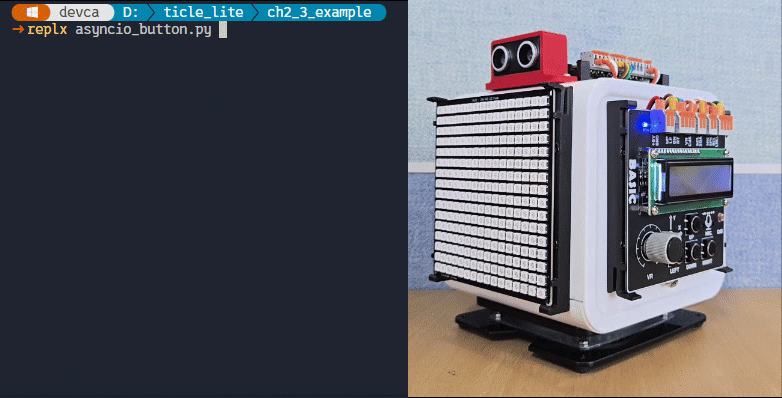</br>

### 비동기 환경에서 버튼 누락 방지

> **풀고 싶은 문제**  
> events(poll_ms=10)는 10ms마다 GPIO 상태를 읽는다. 만약 다른 작업이 await 없이 10ms 이상 실행되면, 그 사이에 버튼을 눌렀다 뗀 경우 클릭을 놓칠 수 있다. 어떻게 해결할 수 있을까? 퀴즈쇼의 'O', 'X' 버튼과 초기화 버튼을 만들어 보자.

events()는 await asyncio.sleep_ms(poll_ms)에서 자리를 비킬 때만 GPIO를 읽는다. 다른 태스크가 await 없이 오래 실행되면 그 시간 동안 GPIO 읽기가 미루어지고, 그 사이에 눌렀다 뗀 버튼은 감지되지 않는다.

버튼을 놓치지 않으려면 하드웨어 인터럽트를 활용하면 된다. IRQ는 asyncio 스케줄러와 무관하게 핀 변화 순간에 즉시 실행된다. 이 예제는 IRQ와 asyncio를 함께 활용하는 패턴을 보여 준다. IRQ는 응답성을 맡고, asyncio는 여러 작업을 병행하는 구조를 담당한다. btn.start()로 IRQ를 켜고, on_press 콜백에서 _click_idx에 인덱스를 직접 기록한다. task_button()은 10ms마다 플래그를 확인해 UP이면 'O', DOWN이면 'X'를 표시하고 LEFT/RIGHT이면 화면을 지우며, UP/DOWN에는 audio.tone()으로 짧은 음도 함께 낸다. 'O' 또는 'X'가 한 번 표시된 뒤에는 LEFT 또는 RIGHT로 화면을 지워야 다음 UP/DOWN에 반응하도록, _ox_press 플래그로 상태를 관리한다.

```python
# asyncio_button_irq.py
import asyncio
from ticle_lite.button import Button
from ticle_lite.audio import Audio
from ticle_lite.ws2812 import Matrix

btn = Button([16, 17, 18, 19])
audio = Audio(sck=4, ws=5, sd_out=7)
mat = Matrix(0, brightness=0.2)

_click_idx = -1    # -1: idle, 0-3: button index of last press
_ox_press = False

def on_press(idx):
    global _click_idx
    _click_idx = idx

for i in range(len(btn)):
    btn[i].on_press = on_press

btn.start()

async def task_button():
    global _click_idx, _ox_press
    while True:
        if _click_idx >= 0:
            idx = _click_idx
            _click_idx = -1
            if idx == 0 and not _ox_press:  # UP
                _ox_press = True
                mat.fill((0, 100, 0))
                mat.draw_text("O", x=3, bg=None)
                audio.tone(440, 100)  # 440 Hz, 100 ms
            elif idx == 2 and not _ox_press: # DOWN
                _ox_press = True
                mat.fill((150, 0, 0))
                mat.draw_text("X", x=3, bg=None)
                audio.tone(880, 100)  # 880 Hz, 100 ms
            elif (idx == 1 or idx == 3) and _ox_press:          # LEFT / RIGHT
                _ox_press = False
                mat.fill((0, 0, 0))
            mat.update()
        await asyncio.sleep_ms(10)

async def task_idle():
    cnt = 0
    while True:
        print(f"running... {cnt}")
        cnt += 1
        await asyncio.sleep_ms(1000)

async def main():
    await asyncio.gather(task_button(), task_idle())

try:
    asyncio.run(main())
finally:
    btn.stop()
    btn.deinit()
    audio.deinit()
    mat.deinit()
```

**코드 해설**

IRQ 방식에서는 반드시 on_press를 사용해야 한다. on_click은 릴리즈 후 300ms 동안 다시 누름이 없어야 발생하고, 그 전에 다시 누르면 double_click으로 분류되어 on_click 콜백이 전혀 호출되지 않는다. on_press는 누르는 순간 즉시 발생하므로 IRQ의 빠른 응답성을 살릴 수 있다.

btn.start()는 핀 변화 순간을 IRQ로 감지하도록 등록하는데, Button 내부에서는 IRQ에서 이벤트를 짧게 기록하고 on_press()는 안전한 시점에 실행된다. 여기서는 _click_idx에 인덱스를 직접 써서 asyncio 태스크가 나중에 확인할 수 있게 한다.

task_button()은 10ms마다 _click_idx >= 0 여부를 확인하는데, IRQ가 플래그를 세운 뒤 최대 10ms 안에 반응하므로 눈으로 보기에 즉각 반응하는 것처럼 느껴진다. 처리 직후 _click_idx = -1로 되돌려 다음 신호 전까지 반응하지 않도록 한다.

_ox_press는 O 또는 X가 화면에 표시된 상태를 나타내는데, UP이나 DOWN을 처리하면 _ox_press = True로 기록되고 이후에 UP/DOWN이 들어와도 조건 not _ox_press에 걸려 무시된다. LEFT 또는 RIGHT가 들어오면 _ox_press = False로 초기화해 다음 UP/DOWN을 받을 준비를 한다. 이처럼 상태 플래그 하나로 버튼 입력의 유효 범위를 명시적으로 제어할 수 있다.

IRQ가 켜져 있으므로 asyncio 스케줄러가 다른 태스크를 실행하는 동안에도 버튼 누름은 놓치지 않는다. task_idle()이 1초 동안 다른 태스크에 양보하지 않아도 버튼 입력은 IRQ로 즉시 받아낸다.

audio.tone()은 지정한 주파수와 길이로 짧은 음을 재생한다. UP을 누르면 440Hz 저음이, DOWN을 누르면 880Hz 고음이 100ms 출력된다. tone()은 재생이 끝날 때까지 기다리는 블로킹 호출이지만, 100ms는 사람이 지연으로 느끼기 어려운 시간이다.

**실행 결과와 확인할 점**

프로그램을 실행하면 터미널에 "running..."이 1초마다 출력된다. UP을 누르면 초록 배경에 O가 표시되고 낮은 음이, DOWN을 누르면 빨간 배경에 X가 표시되고 높은 음이 함께 출력된다. O 또는 X가 나온 뒤에는 UP/DOWN을 다시 눌러도 반응하지 않는다. LEFT 또는 RIGHT를 누르면 화면이 꺼지고, 그다음부터 다시 UP 또는 DOWN에 반응한다. task_idle()에 무거운 작업을 넣어도 버튼 누름이 누락되지 않는지 확인해 보자.

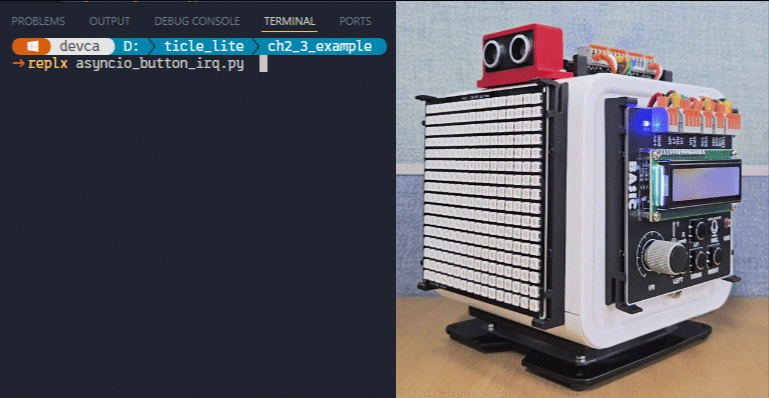</br>

> **한 걸음 더**  
> task_idle()의 print() 앞에 time.sleep_ms(50)을 추가해 보자. events() 방식과 IRQ 방식에서 버튼 반응이 어떻게 달라지는지 비교해 보자.

### ServoAsync: 비동기 서보 제어

> **풀고 싶은 문제**  
> 서보가 이동하는 동안 Pixel Display 보드 화면이 멈추지 않게 하고 싶다. await move_to()는 이동하는 내내 다른 작업을 멈추게 할까?

ServoAsync는 Servo 인스턴스를 비동기 방식으로 움직이게 도와준다. 일반 servo.move_to()는 서보가 목표 각도에 도달할 때까지 다음 줄로 넘어가지 않지만, ServoAsync의 await move_to()는 이동 중간중간 다른 작업이 실행될 시간을 내준다. 그래서 서보가 움직이는 동안에도 화면 갱신이나 버튼 확인을 함께 할 수 있다.

다음 예제는 서보가 네 개의 위치를 순환하는 동안 Pixel Display 보드가 독립적으로 색을 바꾸는 프로그램이다.

```python
# asyncio_servo.py

import asyncio
from ticle_lite.servo import Servo
from ticle_lite.servo_async import ServoAsync
from ticle_lite.ws2812 import Matrix

servo = Servo(1)
asevc = ServoAsync(servo)
mat   = Matrix(0, brightness=0.2)

WAYPOINTS = [(30, 600), (90, 400), (150, 600), (90, 400)]
PALETTE   = [(200, 0, 0), (200, 100, 0), (0, 180, 0), (0, 80, 200)]


async def task_servo():
    i = 0
    while True:
        deg, ms = WAYPOINTS[i % len(WAYPOINTS)]
        await asevc[0].move_to(deg, ms, easing='quad')
        i += 1


async def task_display():
    i = 0
    while True:
        mat.fill(PALETTE[i % len(PALETTE)])
        mat.update()
        i += 1
        await asyncio.sleep_ms(200)


async def main():
    await asyncio.gather(task_servo(), task_display())

try:
    asyncio.run(main())
finally:
    servo.deinit()
    mat.deinit()
```

**코드 해설**

task_servo()는 await asevc[0].move_to(deg, ms)를 호출해 서보를 목표 각도까지 천천히 이동시키는데, 이동하는 동안에도 프로그램 전체가 멈추지 않기 때문에 task_display()는 200ms 주기로 계속 색을 바꾼다. WAYPOINTS는 (각도, 이동 시간ms) 쌍의 목록이고, easing='quad'는 서보가 부드럽게 가속하고 감속하도록 한다.

**실행 결과와 확인할 점**

서보가 30->90->150->90를 반복하는 동안 Pixel Display 보드는 200ms마다 색이 바뀐다. 서보 이동이 완료되어야 Pixel Display 보드가 바뀌는 것이 아니라 두 작업이 독립적으로 실행되는 것을 확인할 수 있다. 비교를 위해 ServoAsync 대신 servo[0].angle = deg로 직접 설정하면 서보 이동 완료를 기다리는 동안 Pixel Display 보드 갱신이 멈추는 차이를 볼 수 있다.

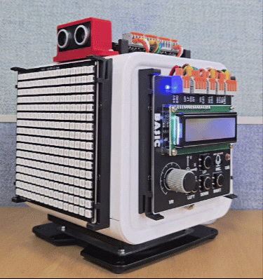</br>

### SR04Async: 비동기 거리 측정

> **풀고 싶은 문제**  
> 거리 측정이 진행되는 동안 Pixel Display 보드 화면 갱신도 멈추지 않게 만들고 싶다. asyncio로 두 작업을 어떻게 독립적으로 실행할 수 있을까?

SR04로 거리를 읽을 때는 에코 신호를 기다리는 시간이 포함된다. 동기 방식에서는 이 대기 시간 동안 다른 작업이 멈추지만, SR04Async를 사용하면 기다리는 동안 화면 출력이나 다른 센서 처리를 함께 진행할 수 있다.

SR04Async는 SR04 인스턴스를 비동기 방식으로 사용할 수 있게 도와주는 클래스이다. SR04 인스턴스를 먼저 만들고, 그것을 SR04Async에 전달하면 된다.

```python
# asyncio_distance.py
import asyncio
import math

from ticle_lite.audio import Audio
from ticle_lite.ws2812 import Matrix
from ticle_lite.us import SR04 as UltraSonic
from ticle_lite.us_async import SR04Async as UltraSonicAsync

# Note) You must create an Audio object before creating a Matrix object.
audio = Audio(sck=4, ws=5, sd_out=7)
mat = Matrix(0, brightness=0.05)

# Real-time capabilities increased due to R(default 25) reduction
sonic = UltraSonic(trig=12, echo=13, R=20) 
async_sonic = UltraSonicAsync(sonic)

state = {"dist_m": float("nan")}
MAX_DIST = 2.0

def dist_to_bar(d):
    if math.isnan(d) or d >= MAX_DIST:
        return 0, (0, 0, 0)
    h = max(1, int((1.0 - d / MAX_DIST) * 16))
    if d < 0.5:
        return h, (200, 0, 0)
    elif d < 1.0:
        return h, (200, 80, 0)
    elif d < 1.5:
        return h, (180, 150, 0)
    else:
        return h, (0, 150, 0)

async def task_distance():
    while True:        
        raw = await async_sonic.read()
        if not math.isnan(raw):
            print(f"distance = {raw:.2f} m")
            state["dist_m"] = raw
        await asyncio.sleep_ms(100)

async def task_display():
    while True:
        h, color = dist_to_bar(state["dist_m"])
        mat.fill((0, 0, 0))
        if h > 0:
            mat.draw_rect(0, 16 - h, 16, h, color, fill=color)
        mat.update()
        await asyncio.sleep_ms(50)

async def task_beep():
    while True:
        d = state["dist_m"]
        if math.isnan(d) or d >= MAX_DIST:
            await asyncio.sleep_ms(200)
            continue
        if d < 0.25:
            audio.tone(1000, 120)
            await asyncio.sleep_ms(50)
        elif d < 0.5:
            audio.tone(880, 100)
            await asyncio.sleep_ms(200)
        elif d < 1.0:
            audio.tone(660, 80)
            await asyncio.sleep_ms(500)
        else:
            audio.tone(440, 60)
            await asyncio.sleep_ms(1100)

async def main():
    await asyncio.gather(task_distance(), task_display(), task_beep())

try:
    asyncio.run(main())
finally:
    mat.deinit()
    audio.deinit()
    async_sonic.deinit() # async_sonic.deinit() will deinit sonic too
```

**코드 해설**

Audio는 PIO 상태 머신을 고정 번호로 선점하므로 Matrix보다 먼저 생성해야 한다. 세 개의 코루틴이 asyncio.gather()로 동시에 실행되며, 각자의 주기로 독립적으로 동작한다.

task_distance()는 100밀리초마다 async_sonic.read()로 거리를 측정하는데, 반환값이 NaN이 아닐 때만 state에 저장하므로 NaN이 섞여도 state는 직전 유효값을 유지한다. await async_sonic.read() 호출 중에는 에코 대기 시간 동안 이벤트 루프가 나머지 두 태스크를 실행할 수 있다.

task_display()는 50밀리초마다 dist_to_bar()로 거리를 막대 높이와 색상으로 변환한 뒤 fill()/draw_rect()/update()로 Pixel Display 보드를 갱신한다. 막대는 아래에서 위로 쌓이며, 거리가 가까울수록 높고 붉어진다. 200 cm 이상이거나 NaN이면 화면이 꺼진다.

task_beep()는 거리 구간에 따라 비프 주파수와 간격을 바꾼다. 25 cm 미만이면 1000 Hz로 약 170 ms 간격의 준연속 비프를 내고, 멀어질수록 주파수가 낮아지고 간격이 넓어져 200 cm 이상이면 무음이 된다. audio.tone()은 동기 방식이라 비프가 끝날 때까지 task_beep 코루틴이 대기하지만, 비프 시간이 짧아 나머지 두 태스크의 반응성에 미치는 영향이 거의 없다.

SR04Async는 3장에서 사용한 SR04 인스턴스를 그대로 받아 감싸는데, 핀 설정은 같고 사용 방식만 동기에서 비동기로 바뀐다.

**실행 결과와 확인할 점**

프로그램이 실행되면 Pixel Display 보드에 거리 막대가 나타난다. 손을 가까이 가져갈수록 막대가 높아지고 색이 빨개지며 비프 간격이 짧아져야 한다. 50 cm 이내에서 빨간 막대와 빠른 비프가 동시에 나오면 세 태스크가 서로 방해하지 않고 병행 실행되고 있는 것이다.

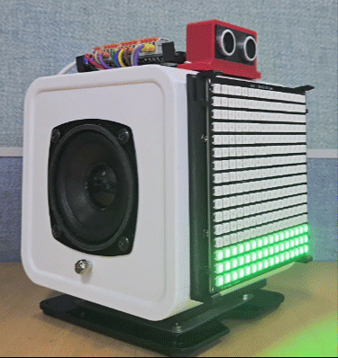</br>

### IMU 경사 감시기

> **풀고 싶은 문제**  
> IMU로 기기의 기울기를 읽어, Pixel Display 보드에 항공기 자세 표시계처럼 하늘과 땅 배경이 기울어진 수평선과 함께 실시간으로 나타나게 하고 싶다. 기울기가 위험 수준을 넘으면 소리로도 경고를 받을 수 있을까?

이번 예제는 롤(좌우 기울기)과 피치(앞뒤 기울기)를 IMU에서 읽어 Pixel Display 보드에 인공 수평선을 그리는 프로그램이다. 항공기 자세 표시계(ADI)처럼 위쪽에는 하늘색, 아래쪽에는 땅색을 채우고 기울기에 따라 수평선이 기울어진다. 기울기가 기준값을 넘으면 배경색이 바뀌고 Audio.tone()으로 경고음이 울린다.

```python
# asyncio_tilt_guard.py
import math
import asyncio
from ticle_lite.i2c import I2CController
from ticle_lite.hd44780 import HD44780_PCF8574 as CharLCD
from ticle_lite.mpu6050 import MPU6050 as IMU
from ticle_lite.audio import Audio
from ticle_lite.ws2812 import Matrix

i2c = I2CController(sda=10, scl=11) 
lcd = CharLCD(i2c)
imu = IMU(i2c, remap='-z-xy')

# Note) You must create an Audio object before creating a Matrix object.
audio = Audio(sck=4, ws=5, sd_out=7)  #GP4: SCK, GP5: WS, GP7:SPEAKER  
mat   = Matrix(0, brightness=0.2)

WARN = 20     # Warning begin angle (degrees)
CRIT = 35     # Critical angle (degrees)

# Color table by level — Safe(0) / Warning(1) / Critical(2)
SKY_C   = [(0, 60, 180),    (80,  60,  0), (160,  0,  0)]
EARTH_C = [(60, 30,  0),    (60,  30,  0), ( 80,  0,  0)]
HORIZ_C = [(220, 220, 220), (255, 180,  0), (255, 60, 60)]

state = {"roll": 0.0, "pitch": 0.0, "level": 0}

def draw_horizon(roll_deg, pitch_deg, level):
    # Calculate the y position of the horizon for each of the 16 columns and fill sky/earth
    tan_r     = math.tan(math.radians(max(-70, min(70, roll_deg))))
    pitch_off = max(-7, min(7, int(pitch_deg * 7 / 45)))
    sky, earth, horiz = SKY_C[level], EARTH_C[level], HORIZ_C[level]

    mat.fill((0, 0, 0))
    for x in range(16):
        hy = max(0, min(16, int(8 + pitch_off - (x - 7.5) * tan_r)))
        if hy > 0:
            mat.draw_rect(x, 0, 1, hy, sky, fill=sky)
        if hy < 16:
            mat.draw_rect(x, hy, 1, 16 - hy, earth, fill=earth)

    # Tilted horizon line
    y0 = max(0, min(15, int(8 + pitch_off + 7.5 * tan_r)))
    y1 = max(0, min(15, int(8 + pitch_off - 7.5 * tan_r)))
    mat.draw_line(0, y0, 15, y1, horiz)

    # Aircraft reference wings (fixed at the center of the screen)
    mat.draw_line(2, 8, 6, 8, (255, 220, 0))
    mat.draw_line(9, 8, 13, 8, (255, 220, 0))
    mat.draw_line(7, 7, 7, 9, (255, 220, 0))

    mat.update()

async def task_imu():
    while True:
        roll, pitch = imu.tilt
        r = math.degrees(roll)
        p = math.degrees(pitch)
        worst = max(abs(r), abs(p))
        state["roll"]  = r
        state["pitch"] = p
        state["level"] = 2 if worst >= CRIT else (1 if worst >= WARN else 0)
        await asyncio.sleep_ms(30)

async def task_display():
    while True:
        draw_horizon(state["roll"], state["pitch"], state["level"])
        await asyncio.sleep_ms(50)

async def task_lcd():
    while True:
        r, p, lv = state["roll"], state["pitch"], state["level"]
        row0 = "R:{:+5.1f} P:{:+5.1f}".format(r, p)[:16]
        lcd.text(row0 + " " * (16 - len(row0)), 0, 0)
        msg = "!! DANGER !!" if lv == 2 else ("CAUTION" if lv == 1 else "Level")
        lcd.text(msg + " " * (16 - len(msg)), 0, 1)
        await asyncio.sleep_ms(100)

async def task_beep():
    while True:
        lv = state["level"]
        if lv == 2:
            audio.tone(1200, 80)
            await asyncio.sleep_ms(120)
        elif lv == 1:
            audio.tone(800, 60)
            await asyncio.sleep_ms(600)
        else:
            await asyncio.sleep_ms(300)

async def main():
    await asyncio.gather(task_imu(), task_display(), task_lcd(), task_beep())

try:
    asyncio.run(main())
finally:
    mat.deinit()
    audio.deinit()
    imu.deinit()
    lcd.deinit()
```

**코드 해설**

remap 값이 4장의 다른 예제들과 다르다. 4장 예제들은 Basic 보드를 정면으로 바라볼 때를 기준으로 세 축 방향을 맞추어 remap='zxy'를 사용했다. 이 예제는 인공 수평선을 보기 위해 Pixel Display 보드 쪽을 바라보며 기기를 들게 된다. Pixel Display 보드는  Basic 보드의 왼쪽 면에 붙어 있으므로, Pixel Display 보드가 정면이 되려면 기기를 오른쪽으로 90도 수평 회전해야 한다. 수평 회전이므로 위아래 방향(chip_y)은 그대로 고정되고, 기존의 정면 방향(-chip_z)이 새로운 오른쪽이 되며, 기존의 왼쪽(-chip_x)이 새로운 정면이 된다. 이를 차례로 나열하면 (-z, -x, y)이고, 이것이 remap='-z-xy'이다.

draw_horizon()은 roll과 pitch 각도를 받아 Pixel Display 보드를 갱신하는 함수이다. 각 열(x = 0~15)마다 수평선의 y 위치를 계산해 위쪽을 하늘색, 아래쪽을 땅색 직사각형으로 채운다. 그 위에 draw_line()으로 기울어진 수평선과 기체 기준 날개를 덧그린다. 날개는 항상 화면 중앙(y=8)에 고정되어 있어서, 기울기가 생겼을 때 기준선 역할을 한다. 이때 수평선이 기울임 방향과 반대로 움직이는 것이 처음에는 이상하게 느껴질 수 있다. ADI는 세상의 지평선이 고정된 채 기기(항공기)가 움직이는 관점으로 그린다. 앞쪽을 들어 올리면 지평선이 기기 아래로 내려가므로, 화면에는 파란 하늘이 더 넓게 채워지고 수평선 바는 아래로 내려간다.

하늘색/땅색/수평선 색은 레벨에 따라 달라진다. 안전(레벨 0)이면 파란 하늘/갈색 땅이 보이고, 경고(레벨 1)이면 주황빛으로, 위험(레벨 2)이면 붉은색으로 변해 화면 전체가 위험 신호가 된다.

네 개의 코루틴이 asyncio.gather()로 동시에 실행된다. task_imu()는 30ms 주기로 IMU를 읽어 롤/피치/레벨을 state에 저장하고, task_display()는 50ms마다 draw_horizon()으로 화면을 갱신한다. task_lcd()는 100ms마다 각도와 상태 문구를 LCD에 표시하며, 줄을 지우지 않고 16자가 되도록 공백을 채워 쓰기 때문에 깜빡임이 없다. task_beep()는 레벨에 따라 주파수와 간격을 바꾼다. 위험이면 1200 Hz로 빠르게, 경고면 800 Hz로 느리게, 안전이면 무음이다.

각 태스크 주기를 다르게 설정한 이유가 있다. IMU는 빠른 물리적 반응이 필요해 30ms, 눈이 인식할 수 있는 화면 갱신은 50ms, LCD 숫자 읽기는 100ms면 충분하다. 이처럼 서로 다른 리듬의 작업을 asyncio.gather()로 묶어 동시에 실행하는 구조는 센서/화면/소리를 함께 다루는 거의 모든 프로젝트에 적용할 수 있다.

**실행 결과와 확인할 점**

프로그램이 실행되면 Pixel Display 보드에 파란 하늘과 갈색 땅이 나뉜 수평선이 나타난다. 기기를 좌우로 기울이면 수평선이 기울어지고, 앞쪽을 위로 들면 수평선이 화면 아래로 내려오며 하늘이 더 넓어지고, 앞쪽을 아래로 내리면 수평선이 위로 올라가며 땅이 더 넓어지는 것을 확인하자. 기울기가 20도를 넘으면 배경이 주황빛으로 바뀌고 경고음이 울리며, 35도를 넘으면 화면이 붉어지고 빠른 비프가 연속해서 나오는 것을 확인하자.

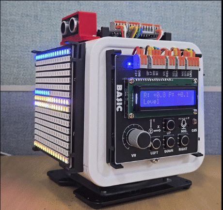</br>

---

## 정리

이 장에서는 IRQ, Timer, _thread, asyncio라는 네 가지 방법으로 3장과 4장에서 배운 장치들을 더 효율적으로 제어하는 방법을 학습하였다.

IRQ는 핀 변화가 발생한 순간 콜백 함수를 즉시 호출한다. 콜백은 짧게 유지하고 실제 처리는 메인 루프에 맡기는 것이 핵심이다. Timer는 시간을 기준으로 작업을 자동 실행한다. PERIODIC 모드는 주기적 반복에, ONE_SHOT 모드는 일정 시간 뒤 한 번 실행에 적합하다.

_thread는 RP2350의 두 번째 코어를 활용해 진정한 병렬 실행을 제공한다. 공유 데이터는 반드시 Lock으로 보호해야 하며, acquire와 release 사이는 최대한 짧게 유지해야 한다. asyncio는 한 코어에서 여러 작업을 번갈아 실행하므로 이 예제들처럼 센서/화면/소리 제어를 함께 다룰 때 유용하다.

네 가지 방법은 서로 배타적이지 않다. 종합 예제처럼 IRQ로 입력을 받고, Timer로 주기를 만들고, _thread로 느린 출력 작업을 분리하며, 검증된 장치 클래스의 내부 Timer 동작과 함께 사용할 수도 있다. 상황에 맞는 방법을 선택하고 조합할 수 있게 되면, 이후 장의 통신과 통합 프로젝트도 자연스럽게 설계할 수 있다.

### 스스로 점검하기

1. 폴링 방식과 IRQ 방식의 가장 큰 차이는 무엇인가?
2. IRQ 콜백 함수 안에서 복잡한 화면 출력을 바로 처리하지 않는 이유는 무엇인가?
3. Timer의 PERIODIC 모드와 ONE_SHOT 모드는 각각 어떤 상황에 적합한가?
4. _thread로 시작한 스레드는 메인 프로그램이 종료되어도 자동으로 멈추는가? 멈추려면 어떻게 해야 하는가?
5. _thread에서 Lock이 필요한 이유는 무엇인가? asyncio에서 Lock이 필요 없는 이유는 무엇인가?
6. asyncio에서 await는 어떤 역할을 하는가?
7. SR04Async와 SR04의 차이는 무엇인가? 어떤 상황에서 각각 더 적합한가?
8. ServoAsync.move_to()를 await로 실행하는 동안 화면 갱신을 병행할 수 있는 이유는 무엇인가?
9. asyncio와 _thread 중 CPU 집약적인 연산을 분리하는 데 더 적합한 것은 무엇인가? 그 이유는?
