# 6. MQTT 원격 제어

## 개요

### 학습 목표

- MQTT의 브로커(Broker), 클라이언트(Client), 토픽(Topic), 발행(Publish), 구독(Subscribe) 구조를 설명할 수 있다.
- NanoMQ 브로커와 MQTTX를 사용하여 MQTT 메시지 흐름을 관찰할 수 있다.
- replx 도구로 Core 보드를 Wi-Fi에 연결하고, upaho 라이브러리로 MQTT 메시지를 주고받을 수 있다.
- 3장과 4장에서 학습한 Button, Ain, Matrix, Servo, SR04를 MQTT와 결합하여 원격 모니터링과 원격 제어 시스템을 구성할 수 있다.
- TiCLE Lite 두 대 이상이 MQTT 브로커를 중심으로 협력하는 구조를 설계할 수 있다.

### 이 장의 의미

Part2에서는 TiCLE Lite 한 대 안에서 입력, 판단, 출력이 이루어지는 프로그램을 작성하였다. 버튼을 누르면 Pixel Display 보드 색이 바뀌고, CdS나 VR 값을 읽어 밝기나 각도를 바꾸는 방식이었다. 그러나 실제 IoT 시스템에서는 입력 장치와 출력 장치가 같은 위치에 있지 않은 경우가 많다. 예를 들어 사무실이나 공장 앞쪽에 설치된 센서가 뒤쪽의 알림 장치를 켜야 할 수도 있고, 여러 장치의 상태를 한 PC 화면에서 동시에 확인해야 할 수도 있다.

MQTT는 이러한 문제를 해결하기 위해 널리 사용하는 메시지 기반 통신 방식이다. 소켓 통신처럼 상대 장치의 IP 주소와 포트를 직접 관리하는 대신, 모든 장치가 브로커에 연결하고 정해진 토픽 이름으로 메시지를 주고받는다. 이 구조는 장치 수가 늘어나도 프로그램이 비교적 단순하게 유지된다는 장점이 있다.

이 장에서는 MQTT를 단순한 네트워크 기능으로 다루지 않는다. 3장과 4장에서 만든 피지컬컴퓨팅 장치들을 네트워크 위로 확장하여, 여러 장치가 협력하는 작은 IoT 시스템을 구성하는 방법을 학습한다.

---

## MQTT 기본 개념

> **풀고 싶은 문제**  
> 센서가 있는 보드는 뒤에 있고, 디스플레이가 있는 보드는 앞에 있다. 직접 연결 없이 두 보드가 데이터를 주고받을 수 있을까? MQTT의 브로커를 중심으로 여러 장치가 협력하는 구조를 이해한다.

### 브로커 중심 구조

> **이 예제로 풀 문제**  
> 센서 보드, PC, 제어 보드가 많아져도 연결 코드가 복잡해지지 않게 하려면 어떤 통신 구조를 선택해야 할까? 브로커 한 대를 중심으로 메시지 경로를 단순화한다.


MQTT 시스템에는 세 가지 핵심 요소가 있다.

| 요소 | 의미 |
| ---- | ---- |
| Broker | 메시지를 받아 필요한 구독자에게 전달하는 중간 서버 |
| Client | 브로커에 연결하여 메시지를 보내거나 받는 장치 또는 프로그램 |
| Topic | 메시지가 오가는 주소 역할을 하는 이름 |

MQTT에서 장치는 보통 서로 직접 연결하지 않는다. 모든 장치가 브로커에 연결하고, 브로커가 메시지를 중계한다.

```
센서 보드 ── publish ──> Broker ── deliver ──> PC 화면
PC 화면  ── publish ──> Broker ── deliver ──> 제어 보드
보드 A   ── publish ──> Broker ── deliver ──> 보드 B, 보드 C
```

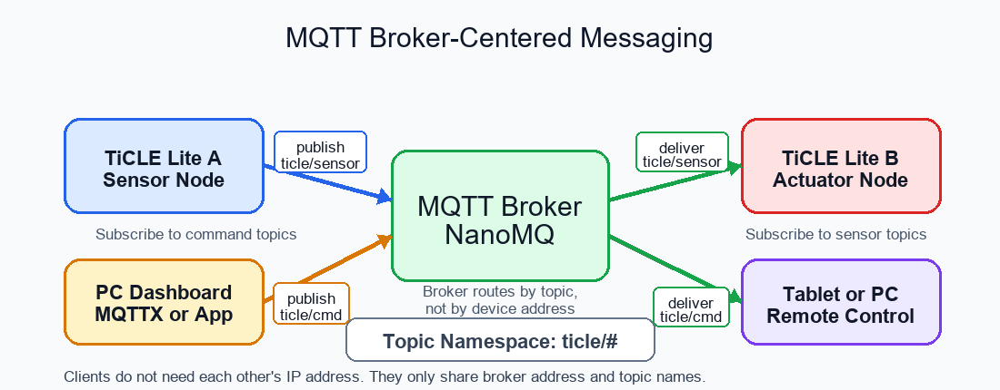</br>

이 방식의 장점은 송신자와 수신자가 서로를 직접 알 필요가 없다는 점이다. 센서 보드는 값을 ticle/class/light 토픽으로 발행하기만 하면 된다. 그 값을 PC가 받을지, 다른 TiCLE Lite가 받을지, 여러 장치가 동시에 받을지는 구독자가 결정한다.

### 발행-구독 모델과 토픽

> **이 예제로 풀 문제**  
> 메시지를 보낸 쪽과 받는 쪽이 서로를 직접 몰라도 통신되게 하려면 주소 규칙을 어떻게 정해야 할까? 토픽 설계 원칙을 세워 센서값과 제어 명령을 분리한다.


MQTT에서 메시지를 보내는 동작을 발행이라고 하고, 메시지를 받겠다고 등록하는 동작을 구독이라고 한다.

토픽은 발행자와 구독자가 메시지를 공유하기 위해 사용하는 계층형 구조의 UTF-8 문자열 식별자이다. 이를 통해 그 메시지가 어디로 가고 어디서 오는지 식별하게 된다. UTF-8 문자열이지만, 호환성을 위해 영문 소문자와 숫자, 슬래시(/) 조합으로만 작성하는 것이 관례이다.

예를 들어 다음과 같은 토픽 규칙을 정할 수 있다.

| 토픽 | 의미 |
| ---- | ---- |
| ticle/sensor/cds | CdS 밝기 센서값 |
| ticle/sensor/vr | VR 값 |
| ticle/input/button | 버튼 입력 |
| ticle/cmd/pixel | Pixel Display 보드 색 변경 명령 |
| ticle/cmd/servo | Servo 각도 변경 명령 |

센서 보드는 ticle/sensor/cds로 값을 발행한다. PC나 다른 보드는 이 토픽을 구독하면 값을 받을 수 있다. 반대로 PC가 ticle/cmd/pixel로 red를 발행하면, 이 토픽을 구독하던 TiCLE Lite가 Pixel Display 보드를 빨간색으로 바꿀 수 있다.

### 토픽 와일드카드

> **이 예제로 풀 문제**  
> 여러 토픽 흐름을 한 번에 관찰하거나 범주별로 묶어 받아야 할 때 매번 토픽을 전부 나열하면 비효율적이다. 와일드카드로 필요한 범위를 정확히 구독한다.


토픽은 슬래시 기호로 단계를 나누어 작성한다. MQTT에서는 구독할 때 와일드카드를 사용할 수 있다.

| 와일드카드 | 의미 | 예 |
| ---------- | ---- | -- |
| + | 한 단계만 대신한다 | ticle/sensor/+ |
| # | 남은 모든 단계를 대신한다 | ticle/# |

ticle/sensor/+는 ticle/sensor/cds와 ticle/sensor/vr을 받을 수 있지만, ticle/sensor/room/cds처럼 단계가 더 깊은 토픽은 받지 않는다.

ticle/#는 ticle/로 시작하는 모든 토픽을 받는다. 실습 중 MQTTX에서 전체 메시지 흐름을 관찰할 때 유용하다.

---

## 실습 준비

> **풀고 싶은 문제**  
> 실습을 시작하기 전에 브로커, 클라이언트 도구, 보드 네트워크 상태가 뒤엉키면 어디서부터 점검해야 할지 막막하다. 본격 실습 전에 실행 순서와 점검 기준을 먼저 잡는다.


### NanoMQ 브로커 실행

> **이 예제로 풀 문제**  
> 브로커가 뜨지 않으면 모든 MQTT 실습이 멈춘다. 설치, 실행, 방화벽 허용까지 한 번에 끝내고 재실행 가능한 상태를 만든다.


MQTT를 사용하려면 브로커가 필요하다. 이 교재에서는 실습 PC에서 가볍게 실행할 수 있는 NanoMQ를 사용한다.

NanoMQ는 GitHub 릴리스에서 받을 수 있다. 이 교재는 GitHub에 공개되므로, 긴 설치 명령을 본문에 모두 적는 대신 etc 폴더에 자동 설치 스크립트를 포함한다. 사용자는 터미널에서 설치 스크립트를 내려받아 실행하면 된다. 설치 스크립트는 최신 NanoMQ 버전을 확인한 뒤 홈 폴더에 nanomq-x.y.z 형식의 폴더를 만든다. 이미 같은 버전이 설치되어 있으면 설치를 중단하고, 더 낮은 버전이 설치되어 있으면 이전 폴더를 지운 뒤 최신 버전을 설치한다.

> **NanoMQ 브로커 설치 및 실습 환경 구축 시 고려사항**
>
> 교육 과정 내에서 NanoMQ 브로커를 구축하고 실습 환경을 구성할 때는 교육 목적과 인프라 상황에 따라 다음과 같은 세 가지 브로커 운용 방식을 고려하여 적용해야 한다.
>
> 1. 독립형 개인 실습 환경 구성
>    - 교육생 개별 PC에 NanoMQ 브로커를 각각 설치한 후, 자신의 로컬 브로커를 대상으로 MQTT 통신 수행
>    - 외부 네트워크 상태와 관계없이 안정적인 독립 실습 가능
>    - 타인의 송수신 데이터에 영향을 받지 않고 기초 토픽 발행(Publish) 및 구독(Subscribe) 원리 학습에 적합.
>
> 2. 통합형 공유 실습 환경 구성
>    - 강사용 PC에 단일 NanoMQ 브로커를 설치/운영하고, 모든 교육생이 해당 브로커에 동시 접속하여 MQTT 통신 수행
>    - 실제 운영 환경과 유사한 다중 클라이언트 간의 데이터 교환 및 토픽 제어 구조 경험
>    - 교육생 간의 상호 데이터 송수신 실습이 필요할 때 효과적
> 
> 3. 혼합형 실습 환경 구성
>    - 독립형과 통합형 방식을 병행하여 운용
>    - 교육 초기에는 개별 브로커를 통해 기본 개념을 안전하게 습득
>    - 교육 후반부나 프로젝트 단계에서는 강사 PC의 통합 브로커로 전환하여 협업 및 확장 실습을 진행해 교육 효과 극대화

**Windows에서 설치하기**

PowerShell 터미널을 열고 다음 명령을 실행하는데, 이 명령은 인터넷에서 Windows용 NanoMQ 설치 스크립트를 내려받는다. 

```sh
cd ~
curl -L -o ./install-nanomq.ps1 https://raw.githubusercontent.com/PlanXLab/utils/main/install-nanomq.ps1
```

> <details>
> <summary><b>알아두기 - 다운로드 오류가 발생한다면?</b></summary>
>
> 'curl: (23) client returned ERROR...' 오류는 curl 버전이 낮아 ~/(홈 폴더 경로 축약어)를 자동으로 인식하지 못하기 때문이다. 이때는 아래 PowerShell 표준 명령어를 사용한다.
> ```sh
> Invoke-WebRequest -Uri "https://raw.githubusercontent.com/PlanXLab/utils/main/install-nanomq.ps1" -OutFile "$HOME\install-nanomq.ps1"
> ```
>
> </details>
</br>

설치 스크립트를 실행한다. 스크립트는 GitHub에서 최신 NanoMQ Windows 릴리스를 찾고, NanoMQ 실행 파일과 필요한 라이브러리, 설정 파일, 실행 스크립트만 홈 폴더의 버전별 폴더에 설치한다. 만약 설치 과정에서 이전 버전이 있다하면 이를 삭제하고 새 버전을 설치한다. 

```sh
powershell -NoProfile -ExecutionPolicy Bypass -File ~/install-nanomq.ps1
rm ~/install-nanomq.ps1
```

설치가 끝나면 스크립트가 출력한 nanomq-x.y.z 폴더 이름을 이용해 브로커를 실행한다. 처음 실행하면 윈도우 디펜더 방화벽(Windows Defender Firewall)의 네트워크 접근 허용 경고 창이 표시되는데, '허용'을 누르는 순간 윈도우 방화벽의 인바운드 규칙(Inbound Rules)에 해당 프로그램이 등록되어 이후 재실행해도 다시 뜨지 않는다.

```sh
cd -
~/nanomq-x.y.z/run
```

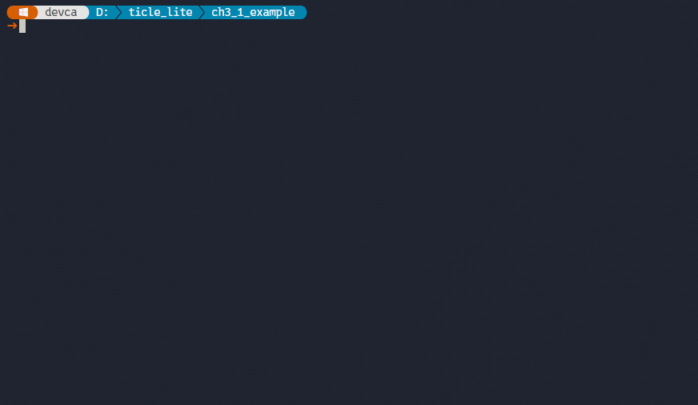</br>


다음과 같이 NanoMQ 설치 폴더를 자동으로 찾아 이를 변수에 저장한 후 실행하는 방법도 있다.

```sh
$NANO_DIR = (Get-ChildItem -Path "$HOME\nanomq-*" | Select-Object -Last 1).FullName
```
```sh
& $NANO_DIR/run
```

이 터미널 창은 브로커가 실행되는 동안 열어 둔다.

**macOS와 Linux에서 설치하기**

macOS, Linux에서는 터미널을 열고 다음 명령을 실행하는데, 이 명령은 Github에서 Unix 계열 NanoMQ 설치 스크립트를 내려받는다.

```sh
curl -L -o ~/install-nanomq.sh https://raw.githubusercontent.com/PlanXLab/utils/main/install-nanomq.sh
```

설치 스크립트를 실행한다. 스크립트는 현재 운영체제와 CPU 아키텍처를 확인하여 macOS, Linux x86_64, Linux ARM 계열에 맞는 최신 NanoMQ 파일을 내려받고, 홈 폴더의 버전별 폴더에 필요한 파일만 설치한다. 다운로드에 사용한 설치 스크립트는 실행 후 삭제한다.

```sh
sh ~/install-nanomq.sh
rm ~/install-nanomq.sh
```

설치가 끝나면 홈 폴더에서 가장 최근에 설치된 NanoMQ 폴더를 찾아 실행하는데, 이 터미널 창은 브로커가 실행되는 동안 열어 둔다.

```sh
NANO_DIR=$(ls -d "$HOME"/nanomq-* | tail -n 1)
"$NANO_DIR"/run
./run
```

> <details>
> <summary><b>알아두기 - PC가 시작될 때 NanoMQ 자동 실행하기</b></summary>
>
> 교육용 실습에서는 필요할 때마다 터미널에서 NanoMQ를 직접 실행하는 방식이 가장 좋다. 브로커가 언제 켜져 있고 언제 꺼지는지 눈으로 확인할 수 있기 때문이다. 그러나 이후 프로젝트에서 PC를 항상 MQTT 허브처럼 사용한다면, PC가 켜질 때 NanoMQ가 자동으로 실행되도록 설정할 수 있다.
>
> Windows에서는 작업 스케줄러에 로그인 시 실행 작업을 등록한다. PowerShell 터미널에서 다음 명령을 실행한다.
> 
> ```sh
> $NanoMQ = Get-ChildItem $HOME -Directory -Filter "nanomq-*" | Sort-Object Name -Descending | > > Select-Object -First 1
> 
> $Action = New-ScheduledTaskAction `
>   -Execute "powershell.exe" `
>   -Argument "-NoProfile -ExecutionPolicy Bypass -WindowStyle Hidden -File `"$($NanoMQ.FullName)> \run.ps1`""
> 
> $Trigger = New-ScheduledTaskTrigger -AtLogOn
> 
> Register-ScheduledTask `
>   -TaskName "TiCLE NanoMQ" `
>   -Action $Action `
>   -Trigger $Trigger `
>   -Description "Start NanoMQ for TiCLE Lite MQTT examples" `
>   -Force
> ```
> 
> 자동 실행을 해제하려면 다음 명령을 실행한다.
> 
> ```powershell
> Unregister-ScheduledTask -TaskName "TiCLE NanoMQ" -Confirm:$false
> ```
> 
> macOS에서는 LaunchAgent를 등록한다. 터미널에서 다음 명령을 실행한다.
> 
> ```sh
> NANO_DIR=$(ls -d "$HOME"/nanomq-* | tail -n 1)
> mkdir -p "$HOME/Library/LaunchAgents"
> 
> cat > "$HOME/Library/LaunchAgents/kr.ticle.nanomq.plist" <<EOF
> <?xml version="1.0" encoding="UTF-8"?>
> <!DOCTYPE plist PUBLIC "-//Apple//DTD PLIST 1.0//EN"
>  "http://www.apple.com/DTDs/PropertyList-1.0.dtd">
> <plist version="1.0">
> <dict>
>   <key>Label</key>
>   <string>kr.ticle.nanomq</string>
>   <key>ProgramArguments</key>
>   <array>
>     <string>/bin/sh</string>
>     <string>$NANO_DIR/run</string>
>   </array>
>   <key>RunAtLoad</key>
>   <true/>
>   <key>KeepAlive</key>
>   <true/>
>   <key>StandardOutPath</key>
>   <string>$NANO_DIR/nanomq.log</string>
>   <key>StandardErrorPath</key>
>   <string>$NANO_DIR/nanomq.err</string>
> </dict>
> </plist>
> EOF
> 
> launchctl load "$HOME/Library/LaunchAgents/kr.ticle.nanomq.plist"
> ```
> 
> 자동 실행을 해제하려면 다음 명령을 실행한다.
> 
> ```sh
> launchctl unload "$HOME/Library/LaunchAgents/kr.ticle.nanomq.plist"
> rm "$HOME/Library/LaunchAgents/kr.ticle.nanomq.plist"
> ```
> 
> Linux에서는 systemd 사용자 서비스를 등록할 수 있다. 터미널에서 다음 명령을 실행한다.
> 
> ```sh
> NANO_DIR=$(ls -d "$HOME"/nanomq-* | tail -n 1)
> mkdir -p "$HOME/.config/systemd/user"
> 
> cat > "$HOME/.config/systemd/user/ticle-nanomq.service" <<EOF
> [Unit]
> Description=NanoMQ for TiCLE Lite MQTT examples
> 
> [Service]
> ExecStart=$NANO_DIR/run
> Restart=always
> WorkingDirectory=$NANO_DIR
> 
> [Install]
> WantedBy=default.target
> EOF
> 
> systemctl --user daemon-reload
> systemctl --user enable --now ticle-nanomq.service
> ```
> 
> Raspberry Pi처럼 모니터와 키보드 없이 항상 켜 두는 장치에서는 로그인하지 않아도 사용자 서비스가 실행되도록 다음 명령을 > 추가로 실행할 수 있다.
> 
> ```sh
> sudo loginctl enable-linger "$USER"
> ```
> 
> 자동 실행을 해제하려면 다음 명령을 실행한다.
> 
> ```sh
> systemctl --user disable --now ticle-nanomq.service
> rm "$HOME/.config/systemd/user/ticle-nanomq.service"
> systemctl --user daemon-reload
> sudo loginctl disable-linger "$USER"
> ```
> 
> 자동 실행을 설정한 경우에는 PC를 다시 시작한 뒤 MQTTX에서 127.0.0.1, 포트 1883으로 연결하여 브로커가 실행 중인지 확인한다.
>
> </details>
</br>

**브로커 접속 주소 확인**

MQTT 클라이언트는 브로커에 연결할 때 주소가 필요하므로, NanoMQ가 설치된 PC의 IP 주소를 다음 명령으로 확인한다.

```sh
# Windows
ipconfig

# macOS
ifconfig

# Linux / Raspberry Pi
hostname -I
```

네트워크 어댑터의 IPv4 주소를 확인한 뒤, 이후 예제의 BROKER 값에 입력한다.

```python
BROKER = "192.168.100.10"  # You can change this to your MQTT broker address
```

### MQTTX로 메시지 확인

> **이 예제로 풀 문제**  
> 보드 코드를 올리기 전에 브로커와 토픽이 정상인지 어떻게 확인할까? MQTTX로 발행과 구독을 먼저 검증해 통신 경로를 눈으로 확인한다.


MQTTX는 클라이언트의 일종으로 MQTT 메시지를 보내고 받을 수 있는 GUI 도구이다. 코드 작성 전 브로커가 정상 동작하는지 확인하는 데 사용한다.

```
https://mqttx.app/
```

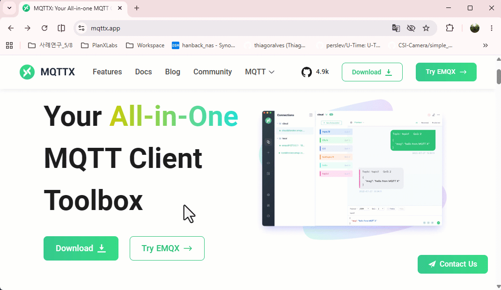</br>

NanoMQ 브로커가 실행 중인 상태에서 '+ New Connection'을 눌러 새 연결을 만들고 다음 값을 입력한다. 포트는 기본값이므로 생략해도 된다.

| 항목 | 값 |
| ---- | -- |
| Name | nanoMQ |
| Host | 127.0.0.1 |
| Port | 1883 |
| Client ID | mqttx-test |

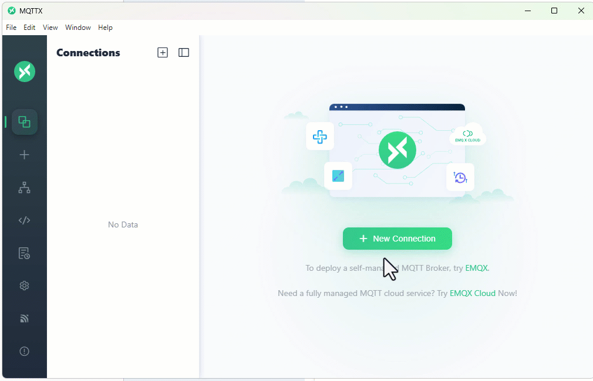</br>

연결 후 '+ New Subscription'을 눌러 ticle/test 토픽을 구독하고, 오른쪽 아래 발행 패널에서 같은 토픽으로 "Hello Ticle!"를 발행한다. 수신/구독 창에 내가 발행한 토픽 메시지와 동일한 구독 토픽 메시지가 표시되면 브로커와 MQTTX 준비가 완료된 것이다.

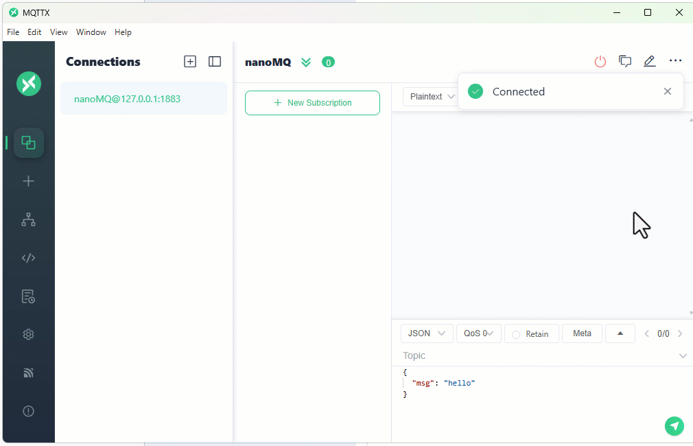</br>

### Core 보드 Wi-Fi 연결

> **이 예제로 풀 문제**  
> 보드가 브로커에 닿지 않으면 코드가 맞아도 메시지가 오지 않는다. 보드를 Wi-Fi에 안정적으로 붙이고 연결 상태를 확인한다.


Core 보드의 Wi-Fi 설정은 replx 툴을 사용하는데, wifi는 현재 Wi-Fi 공유기 연결 상태를 알려주고, wifi scan은 연결할 주변 공유기를 찾는다. 

```sh
replx wifi
replx wifi scan
```

wifi connect는 SSID(공유기 이름)와 비밀번호를 인자로 공유기에 연결한다. 이때 연결 정보는 Core 보드에 ticle_wifi.py로 저장되는데, 비밀번호는 암호화되어 있다. 

```sh
replx wifi connect <SSID> <password>
replx wifi cat wifi_config.py
```

wifi off는 wifi 기능을 끄는데, 공유기 연결도 해제된다. 이후 인자 없이 wifi connect를 실행하면, 이 정보를 이용해 다시 연결한다. 

```sh
replx wifi off
replx wifi connect
```

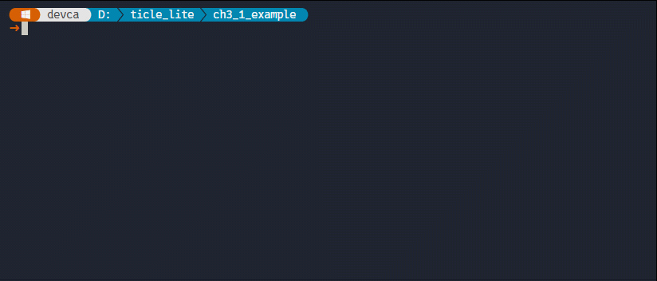</br>

> **한 걸음 더**
> MQTT 프로그램을 실행할 때는 반드시 Core 보드가 네트워크에 연결되어 있어야 한다. 따라서 예제 코드에서는 Wifi 라이브러리의 is_connected()로 검사할 필요가 있다.
>
> ```python
> # wifi_check.py
> from wifi import Wifi
>
> if not Wifi.is_connected():
>     raise RuntimeError("Wi-Fi is not connected")
>
> print(f"Wi-Fi OK: {Wifi.ip()}")
> ```
>
> 만약 Core 보드가 재시작 될 때마다 자동으로 연결되게 하려면 boot on 명령을 실행한다.
> 
> ```sh
> replx wifi boot on
> ```
> 
> 자동 연결 기능은 네트워크 환경에 따라 다소 시간이 걸리므로 연결이 완료될 때까지 기다리는 wait_connected()를 사용한다.
> 
> ```python
> # wifi_wait.py
> from wifi import Wifi
>
> # Wait for Wi-Fi connection with a timeout of 10 seconds
> if not Wifi.wait_connected(timeout_s=10):
>     raise RuntimeError("Wi-Fi is not connected")
>
> print(f"Wi-Fi OK: {Wifi.ip()}")
> ```
>


### upaho 라이브러리

> **이 예제로 풀 문제**  
> raw 소켓 수준에서 MQTT를 직접 구현하면 학습 초기에 코드가 과도하게 길어진다. upaho로 연결, 발행, 구독의 핵심 흐름만 먼저 잡는다.


Core 보드에서 MQTT를 직접 구현하려면 TCP 연결, MQTT 패킷 형식, 연결 유지 신호, 수신 메시지 처리 등을 모두 다루어야 하는데, 이 과정은 네트워크 프로토콜을 깊게 이해하는 데에는 도움이 되지만 센서값을 보내고 원격 명령으로 장치를 제어하는 실습의 핵심에서 벗어나기 쉽다. 이 장에서는 TiCLE Lite 라이브러리에 포함된 upaho를 사용하여 MQTT 통신을 간결하게 작성한다.

upaho는 MicroPython 환경에서 사용할 수 있는 MQTT 클라이언트 라이브러리이다. 이름은 PC 파이썬에서 널리 사용하는 Paho MQTT 라이브러리와 비슷한 사용 방식을 떠올리게 하지만, Core 보드의 제한된 메모리와 실행 환경에 맞게 가볍게 사용하는 데 초점을 둔다. 사용자는 브로커 주소, 클라이언트 ID, 토픽, 메시지 내용만 정하면 된다.

upaho를 사용할 때 가장 먼저 만드는 인스턴스는 Client이다. Client 인스턴스는 Core 보드가 MQTT 브로커에 접속한 하나의 클라이언트라는 뜻이다. 한 브로커에 여러 장치가 동시에 연결될 수 있으므로, 각 장치는 서로 다른 클라이언트 ID를 가져야 한다.

```python
from upaho import Client

client = Client("ticle-hello")
```

Client 인스턴스를 만든 뒤에는 브로커에 연결하고, 필요한 토픽으로 메시지를 보내거나 받을 수 있다.

| 메서드 또는 속성 | 역할 |
| ---- | ---- |
| connect() | 브로커에 연결한다 |
| publish() | 특정 토픽으로 메시지를 보낸다 |
| subscribe() | 특정 토픽의 메시지를 받겠다고 등록한다 |
| on_message | 구독한 메시지가 도착했을 때 실행할 함수를 지정한다 |
| loop() | 수신 메시지 처리와 연결 유지 작업을 수행한다 |
| disconnect() | 브로커와의 연결을 종료한다 |

메시지를 보내기만 하는 짧은 프로그램에서는 connect, publish, disconnect만으로도 동작한다. 그러나 센서값을 주기적으로 보내거나 다른 장치의 명령을 기다리는 프로그램에서는 반복문 안에서 loop를 계속 호출해야 한다. MQTT는 연결된 뒤에도 브로커와 클라이언트가 서로 살아 있는지 확인하고, 도착한 메시지를 프로그램의 콜백 함수로 넘기는 과정이 필요하기 때문이다.

```python
client.connect(BROKER)
client.publish("ticle/hello", "hello")
client.loop(timeout=0)
client.disconnect()
```

원격 제어 예제에서는 on_message에 함수를 지정한 뒤 subscribe로 토픽을 등록한다. 이후 loop가 실행될 때 새 메시지가 있으면 on_message 함수가 호출된다. 이 구조는 버튼 이벤트나 센서값 변화처럼, 어떤 일이 생겼을 때 특정 동작을 실행하는 피지컬 컴퓨팅 프로그램과 잘 어울린다.

---

## 첫 신호 보내기

> **풀고 싶은 문제**  
> 멀리 떨어진 PC 화면에 TiCLE Lite가 "나 여기 있어"라는 첫 신호를 보낼 수 있을까? 센서나 모터를 사용하기 전에, TiCLE Lite가 네트워크를 통해 자신의 존재를 알리는 가장 작은 통신 실험을 수행한다.

이 예제는 Core 보드가 네트워크에 접속한 뒤 MQTT 브로커를 거쳐 PC 화면까지 짧은 문자열 하나를 보내는 과정이다. 센서값을 보내거나 다른 장치를 원격으로 제어하기 전에는 먼저 이 가장 작은 통신 경로가 정상인지 확인해야 하는데, 이 단계가 성공하면 Wi-Fi 연결, 브로커 실행, MQTT 클라이언트 동작, 토픽 구독이 모두 연결된 것이다.

통신 흐름은 다음 순서로 진행된다.

1. Core 보드가 Wi-Fi에 연결되어 있는지 확인한다.
2. Core 보드가 PC에서 실행 중인 NanoMQ 브로커에 접속한다.
3. Core 보드가 ticle/hello 토픽으로 hello from TiCLE Lite 메시지를 발행한다.
4. MQTTX는 같은 토픽을 구독하고 있다가 브로커가 전달한 메시지를 화면에 표시한다.

여기서 토픽은 메시지가 지나가는 이름표이다. 발행자는 특정 토픽으로 메시지를 보내고, 구독자는 관심 있는 토픽을 미리 등록해 둔다. 두 장치가 서로의 IP 주소를 직접 알 필요는 없다. 둘 다 같은 브로커를 바라보고, 같은 토픽 이름을 사용하면 브로커가 메시지를 전달한다.

실행하기 전에 PC에서 NanoMQ가 실행 중이어야 하며, Core 보드는 replx의 Wi-Fi 연결 기능으로 같은 네트워크에 접속되어 있어야 한다. MQTTX에서는 ticle/hello 토픽을 구독해 둔다. 여러 토픽을 한꺼번에 보고 싶다면 ticle/#을 구독해도 된다. 코드의 BROKER에는 NanoMQ가 실행 중인 PC의 Wi-Fi IP 주소를 넣는다.

```python
# mqtt_hello.py
from wifi import Wifi
from upaho import Client

BROKER = "192.168.100.10"  # You can change this to your MQTT broker address
TOPIC = "ticle/hello"

# When you connect to Wi-Fi, this step is explained.
if not Wifi.is_connected():
    raise RuntimeError("Wi-Fi is not connected")

client = Client("ticle-hello")
client.connect(BROKER)
client.publish(TOPIC, "hello from TiCLE Lite")
client.disconnect()

print("published")
```

**코드 해설**

Wifi.wait_connected(timeout_s=20)은 Core 보드가 이미 Wi-Fi에 연결되어 있는지 확인한다. 연결되지 않은 상태에서 MQTT 브로커에 접속하려고 하면 실패 원인을 파악하기 어렵다. 따라서 네트워크 연결을 먼저 확인하고, 20초 안에 연결되지 않으면 오류를 발생시킨다.

Client("ticle-hello")는 MQTT 클라이언트 ID를 정한다. 클라이언트 ID는 브로커가 접속한 장치를 구분하기 위한 이름이다. 같은 브로커에 연결하는 장치들은 서로 다른 클라이언트 ID를 사용해야 한다. 두 장치가 같은 ID를 동시에 사용하면 브로커는 둘을 같은 장치로 판단할 수 있고, 기존 연결을 끊을 수 있다.

client.connect(BROKER)는 PC에서 실행 중인 NanoMQ 브로커에 접속하는데, BROKER 값은 Core 보드의 주소가 아니라 브로커가 실행 중인 PC의 주소이다. MQTT에서는 각 장치가 서로에게 직접 접속하는 것이 아니라, 브로커에 접속한 뒤 토픽을 통해 메시지를 주고받는다.

client.publish(TOPIC, "hello from TiCLE Lite")는 TOPIC에 들어 있는 ticle/hello 이름으로 문자열 메시지를 발행하는데, 이 문자열은 메시지 본문이다. 브로커는 이 메시지를 저장해 두는 것이 아니라, 현재 ticle/hello를 구독 중인 클라이언트에게 전달한다. MQTTX가 이 토픽을 구독하고 있으면 화면에 메시지가 표시된다.

이 예제는 메시지를 한 번만 보내고 끝나는 프로그램이므로 반복문이 필요하지 않다. 구독 메시지를 기다리는 프로그램에서는 client.loop()를 반복해서 호출해야 하지만, 여기서는 publish() 뒤에 바로 disconnect()를 호출해 연결을 정리한다. 마지막 print("published")는 보드 쪽 코드가 끝까지 실행되었는지 확인하기 위한 터미널 출력이다.

**실행 결과와 확인할 점**

MQTTX의 ticle/hello 구독 창에 hello from TiCLE Lite가 표시되면 보드, Wi-Fi, 브로커, MQTTX가 모두 같은 통신 경로에 위치한 것이다. 이때 터미널에는 published가 출력되어야 한다. 터미널에는 published가 나오는데 MQTTX에 메시지가 보이지 않는다면, 보드의 코드는 끝까지 실행되었지만 토픽 구독이나 브로커 연결 쪽을 다시 확인해야 한다.

메시지가 보이지 않을 때는 먼저 BROKER 주소가 PC의 Wi-Fi IP 주소와 일치하는지 확인한다. PC에 유선 LAN과 Wi-Fi가 동시에 연결되어 있으면 IP 주소가 여러 개일 수 있다. Core 보드가 접속한 네트워크와 같은 쪽의 IP 주소를 사용해야 한다.

다음으로 NanoMQ가 실행 중인지 확인한다. 브로커가 실행 중이지 않으면 Core 보드는 connect 단계에서 실패한다. MQTTX의 연결 대상도 같은 브로커 주소와 포트 1883을 사용해야 한다. 마지막으로 MQTTX의 구독 토픽이 ticle/hello 또는 ticle/#인지 확인한다. ticle/hello와 ticle/Hello처럼 대소문자가 다르면 서로 다른 토픽으로 취급된다.

이 예제에서 중요한 확인 지점은 메시지 내용보다 경로이다. 한 번의 hello 메시지가 보인다는 것은 이후 VR 값, CdS 값, 버튼 명령, Pixel Display 보드 제어 메시지도 같은 구조로 보낼 수 있다는 뜻이다.

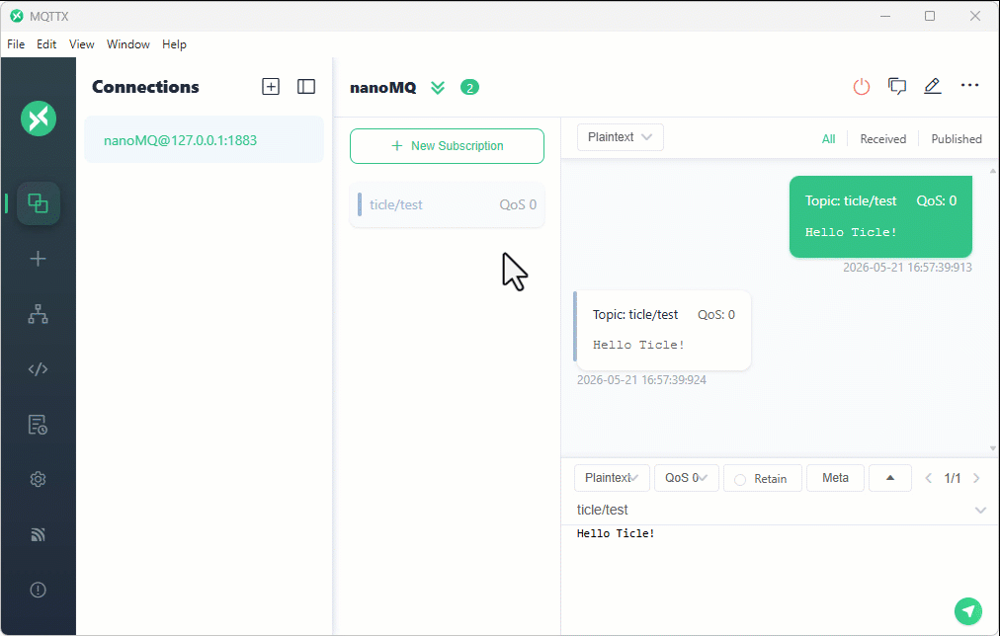</br>

**한 걸음 더**

여러 학생들이 같은 NanoMQ 브로커를 사용하도록 BROKER를 동일한 주소로 설정한 뒤, TOPIC을 ticle/hello/자신의 이름처럼 바꾸어 실행해 본다. MQTTX에서는 ticle/hello/#을 구독한다. 여러 보드가 동시에 메시지를 보내면 각자의 메시지가 같은 화면에 모인다. 이때 브로커는 보낸 사람의 위치를 따로 묻지 않고, 토픽 이름을 기준으로 메시지를 모아 전달한다.

메시지 본문도 바꾸어 본다. 예를 들어 hello from TiCLE Lite 대신 강의실 번호, 팀 이름, 현재 시간처럼 짧은 정보를 넣을 수 있다. 같은 토픽에 여러 보드가 메시지를 보내면 MQTTX 화면에는 메시지가 도착한 순서대로 표시된다. 이 구조가 뒤의 센서 모니터링 예제에서는 여러 센서값을 한 화면에 모으는 방식으로 확장된다.

---

## 원격 센서 모니터링

> **풀고 싶은 문제**  
> TiCLE Lite가 책상 위에 있고 관찰자는 강의실 뒤쪽에 있다면, VR과 CdS 값을 어떻게 볼 수 있을까. 센서값을 MQTT 메시지로 발행하여 PC 화면에서 실시간으로 관찰한다.

이 예제에서는 TiCLE Lite가 센서 보드 역할을 한다. 보드는 VR과 CdS 값을 주기적으로 읽고, 각 값을 서로 다른 토픽으로 발행한다. PC에서는 MQTTX로 ticle/sensor/#을 구독하여 보드가 보내는 모든 센서 메시지를 한 화면에서 관찰한다.

센서값은 한 번만 보내는 정보가 아니라 계속 변하는 정보이다. 따라서 프로그램은 센서를 읽고, MQTT로 발행하고, 잠시 기다리는 과정을 반복하는데, 발행 주기가 너무 느리면 변화가 늦게 보이고 너무 빠르면 네트워크와 브로커에 불필요한 부하가 생긴다. 여기서는 500ms마다 한 번씩 발행하여 사람이 관찰하기에 충분한 속도로 맞춘다.

토픽은 의미에 따라 나누어 사용한다. ticle/sensor/vr은 VR의 퍼센트 값, ticle/sensor/cds는 CdS의 퍼센트 값, ticle/sensor/raw는 두 센서의 원시 ADC 값을 함께 보낸다. 이렇게 나누면 구독자는 필요한 값만 골라 받을 수 있고, 전체 상태가 필요할 때는 ticle/sensor/#으로 한꺼번에 볼 수 있다.

```python
# mqtt_sensor_publish.py
import time
from wifi import Wifi
from upaho import Client
from ticle_lite.ain import Ain

BROKER = "192.168.100.93"  # You can change this to your MQTT broker address

if not Wifi.is_connected():
    raise RuntimeError("Wi-Fi is not connected")

ain  = Ain([27, 28], bits=12)   # GP27: VR, GP28: CdS, 12-bit ADC

client = Client("ticle-sensor")
client.connect(BROKER)

try:
    while True:
        vr_raw  = ain[0].read()
        vr_perc = vr_raw * 100.0 / 4095

        cds_raw  = ain[1].read()
        cds_perc = cds_raw * 100.0 / 4095

        client.publish("ticle/sensor/vr",  f"{vr_perc:.1f}")
        client.publish("ticle/sensor/cds", f"{cds_perc:.1f}")
        client.publish("ticle/sensor/raw", f"{vr_raw},{cds_raw}")
        client.loop(timeout=0)

        print(f"VR:{vr_perc:.1f}% CdS:{cds_perc:.1f}%")
        time.sleep_ms(500)
finally:
    client.disconnect()
    ain.deinit()
```

**코드 해설**

vr = Ain(27), cds = Ain(28)처럼 센서마다 개별 인스턴스를 만들 수도 있지만, 여기서는 Ain([27, 28])처럼 하나의 인스턴스에 두 핀을 함께 묶었다. ain[0]은 VR, ain[1]은 CdS를 가리키며, 여러 채널을 한 번에 관리해야 할 때는 이렇게 인덱스로 구분하는 방식이 인스턴스를 여러 개 만드는 것보다 코드가 간결해진다.

vr_raw = ain[0].read()로 읽은 12비트 값을 4095로 나눠 vr_perc를 계산한다. 이 방식은 raw와 퍼센트가 같은 ADC 샘플에서 만들어지므로 두 토픽의 수치가 서로 일치한다. read()와 read_percent()를 따로 호출하면 ADC를 두 번 읽어 서로 다른 시점의 값이 raw와 퍼센트에 담길 수 있다.

토픽을 세 개로 나눈 것도 중요한 설계이다. 퍼센트 값은 사람이 보기 쉽고, raw 값은 센서 변화가 실제로 어느 정도인지 확인하기 좋다. 예를 들어 퍼센트 값이 크게 바뀌지 않아도 raw 값이 흔들린다면 센서 노이즈나 조명 환경의 미세한 변화를 의심할 수 있다.

client.loop(timeout=0)은 수신 메시지를 기다리기 위한 코드처럼 보이지만, 발행만 하는 프로그램에서도 주기적으로 호출하는 것이 좋다. MQTT 클라이언트는 연결 유지, 내부 버퍼 처리, 브로커와의 상태 확인을 loop()에서 함께 처리하기 때문이다.

finally 블록에서는 ain.deinit()을 한 번만 호출한다. Ain([27, 28])처럼 여러 핀을 하나의 인스턴스로 묶었으므로, 해제도 인스턴스 하나로 한 번에 처리된다.

**실행 결과와 확인할 점**

MQTTX에서 ticle/sensor/#을 구독하면 VR, CdS, raw 세 토픽의 값이 반복해서 들어온다. VR을 돌리면 ticle/sensor/vr 값이 변하고, CdS를 손으로 가리거나 밝은 곳에 비추면 ticle/sensor/cds 값이 변해야 한다. ticle/sensor/raw에는 두 채널의 원시 값이 쉼표로 구분되어 표시된다.

토픽을 ticle/sensor/vr로 바꾸어 구독하면 VR 값만 보이고, ticle/sensor/cds로 바꾸면 CdS 값만 보인다. 같은 데이터를 보내더라도 토픽을 어떻게 설계하느냐에 따라 관찰과 제어가 쉬워진다는 점을 확인한다.

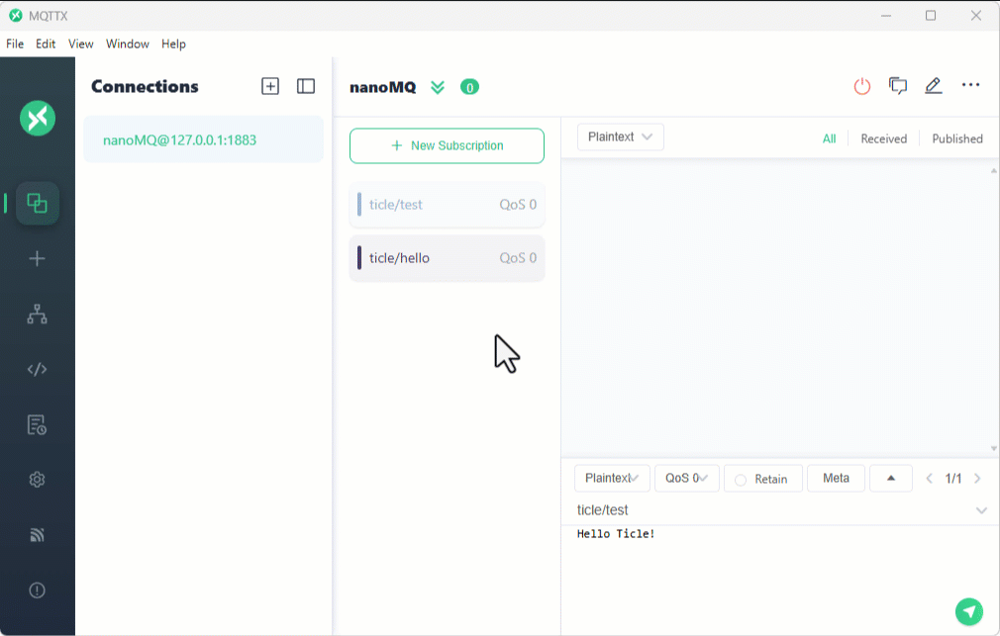</br>

**한 걸음 더**

발행 주기를 500ms에서 100ms로 줄여 보고 MQTTX 화면이 얼마나 빠르게 갱신되는지 확인한다. 반대로 2000ms로 늘리면 네트워크 사용량은 줄어들지만 변화가 늦게 보인다. 실제 시스템에서는 센서가 변하는 속도, 사람이 확인해야 하는 속도, 네트워크 부하를 함께 고려하여 주기를 정한다.

---

## PC에서 보내는 색상 리모컨

> **풀고 싶은 문제**  
> 보드에 손을 대지 않고 PC에서 조명의 색을 바꿀 수 있을까? MQTTX를 간단한 원격 조종기로 사용하여 문자열 명령이 실제 Pixel Display 보드 색으로 바뀌는 과정을 확인한다.

이번에는 TiCLE Lite가 명령을 받는 장치가 된다. PC의 MQTTX에서 색상 이름을 발행하면 보드는 그 문자열을 받아 Pixel Display 보드 색을 바꾼다. 앞 예제와 달리 센서값을 보내는 발행자 중심 구조가 아니라, 원격 명령을 기다리는 구독자 중심 구조이다.

명령 문자열은 red, green, blue, yellow, off 다섯 가지만 허용한다. 수신한 문자열을 그대로 실행하지 않고 COLORS에 등록된 명령인지 확인한 뒤 처리한다. 원격 제어 프로그램에서는 알 수 없는 메시지를 무시하는 규칙이 필요하다. 그래야 잘못된 입력이나 실수로 발행된 메시지가 장치 동작을 망가뜨리지 않는다.

```python
# mqtt_pixel_control.py
import time
from wifi import Wifi
from upaho import Client
from ticle_lite.ws2812 import Matrix

BROKER = "192.168.100.10"  # You can change this to your MQTT broker address

COLORS = {
    "red": (180, 0, 0),
    "green": (0, 140, 0),
    "blue": (0, 0, 180),
    "yellow": (160, 110, 0),
    "off": (0, 0, 0),
}

if not Wifi.is_connected():
    raise RuntimeError("Wi-Fi is not connected")

matrix = Matrix(0, brightness=0.15)

def on_message(client, userdata, msg):
    cmd = msg.payload.decode().strip().lower()
    print(msg.topic, cmd)
    if cmd in COLORS:
        matrix.fill(COLORS[cmd])
        matrix.update()

client = Client("ticle-pixel")
client.on_message = on_message
client.connect(BROKER)
client.subscribe("ticle/cmd/pixel")

try:
    print("publish red / green / blue / yellow / off to ticle/cmd/pixel")
    while True:
        client.loop(timeout=0.05)
        time.sleep_ms(10)
finally:
    client.disconnect()
    matrix.deinit()
```

**코드 해설**

client.subscribe("ticle/cmd/pixel")은 해당 토픽의 메시지를 받겠다는 뜻이다. 메시지가 도착하면 upaho가 on_message() 콜백을 호출한다. MQTTX에서 보낸 내용은 msg.payload에 bytes 형태로 들어 있으므로 decode()로 문자열로 바꾸고, strip()과 lower()로 앞뒤 공백과 대소문자 차이를 정리한다.

COLORS는 명령 이름과 실제 RGB 값을 연결하는 표이다. on_message()는 수신한 문자열이 COLORS에 있을 때만 Pixel Display 보드를 갱신하는데, 이 구조를 사용하면 명령을 추가할 때 if 문을 계속 늘리지 않고 COLORS에 항목을 추가하는 방식으로 확장할 수 있다.

반복문에서는 client.loop(timeout=0.05)를 자주 호출한다. 구독 프로그램은 loop()가 실행될 때 브로커에서 도착한 메시지를 확인하고 콜백을 실행한다. 따라서 반복문 안에 긴 sleep을 넣으면 원격 명령이 도착해도 늦게 반응한다.

**실행 결과와 확인할 점**

MQTTX에서 ticle/cmd/pixel로 red, green, blue, yellow, off를 차례로 발행하면 Pixel Display 보드 색이 바뀐다. 대문자로 RED를 보내거나 앞뒤에 공백이 있어도 같은 명령으로 처리된다. purple처럼 등록되지 않은 문자열을 보내면 터미널에는 수신 내용이 출력되지만 Pixel Display 보드 색은 바뀌지 않아야 한다.

반응이 없으면 먼저 MQTTX의 발행 토픽과 코드의 구독 토픽이 같은지 확인한다. 그다음 보드 터미널에 수신 문자열이 출력되는지 확인한다. 터미널에는 출력되지만 Pixel Display 보드가 바뀌지 않으면 명령 이름이 COLORS에 없는 경우이고, 터미널에도 출력되지 않으면 MQTT 연결이나 토픽이 잘못된 경우이다.

</br>

**한 걸음 더**

purple, white 같은 색 이름을 COLORS에 추가해 본다. 메시지 형식은 그대로 두고 수신 보드의 해석 규칙만 확장하면 된다. 같은 방식으로 blink나 rainbow 같은 명령을 추가하면 단순 색상 변경을 넘어 조명 효과 리모컨으로 확장할 수 있다.

---

## 무선 버튼으로 다른 보드 조종하기

> **풀고 싶은 문제**  
> TiCLE Lite의 버튼으로, 다른 TiCLE Lite의 Pixel Display 보드 출력을 바꿀 수 있을까? 먼저 PC의 MQTTX로 명령 토픽을 직접 보내며 동작 규칙을 확인하고, 이후 실제 버튼 보드를 추가하여 두 보드가 같은 규칙으로 통신하도록 만든다.

이 예제의 통신 규칙은 단순하다. 이동 명령은 ticle/room/button 토픽으로 발행하고, 메시지 내용은 UP, LEFT, DOWN, RIGHT 중 하나로 정한다. 수신 보드는 이 문자열을 방향 벡터로 해석하여 Pixel Display 보드 중앙의 +를 이동한다. +가 화면 범위를 벗어나지 않으면 새 위치로 이동하고, 더 이상 이동할 수 없으면 EDGE 상태를 발행한다.

### 수신 보드와 MQTTX로 이동 명령 보내기

> **이 예제로 풀 문제**  
> 수신 보드가 어떤 명령 형식을 기대하는지 모르면 송신 쪽을 만들기 어렵다. MQTTX로 명령을 직접 보내며 수신 보드 동작 규칙을 먼저 확정한다.


먼저 TiCLE Lite 한 대만 사용하는데, 이 보드는 MQTT 명령을 받는 수신 장치 역할을 하고 PC의 MQTTX가 버튼 리모컨 역할을 대신한다.

| 장치 | 역할 |
| ---- | ---- |
| PC MQTTX | ticle/room/button으로 방향 명령 발행 |
| TiCLE Lite | 방향 명령을 받아 Pixel Display 보드 + 이동 |

MQTTX에서는 ticle/room/#을 구독해 둔다. 그러면 PC가 보낸 방향 명령과 보드가 응답한 현재 좌표 또는 EDGE 상태를 함께 볼 수 있다. 다음 프로그램을 Core 보드에서 실행한 뒤, MQTTX에서 ticle/room/button 토픽으로 UP, LEFT, DOWN, RIGHT를 발행한다.

```python
# mqtt_pixel_receiver.py
import time
from wifi import Wifi
from upaho import Client
from ticle_lite.ws2812 import Matrix

BROKER = "192.168.100.10"  # You can change this to your MQTT broker address
TOPIC = "ticle/room/button"

DIRECTIONS = {
    "UP": (0, -1),
    "LEFT": (-1, 0),
    "DOWN": (0, 1),
    "RIGHT": (1, 0),
}
PLUS_COLOR = (0, 180, 80)
BG_COLOR = (0, 0, 0)
PLUS_DOTS = ((0, -1), (-1, 0), (0, 0), (1, 0), (0, 1))
MIN_POS = 1
MAX_POS = 14

plus_x = 8
plus_y = 8

if not Wifi.is_connected():
    raise RuntimeError("Wi-Fi is not connected")

matrix = Matrix(0, brightness=0.15)


def draw_plus():
    matrix.fill(BG_COLOR)
    for dx, dy in PLUS_DOTS:
        matrix.draw_rect(plus_x + dx, plus_y + dy, 1, 1,
                         PLUS_COLOR, fill=PLUS_COLOR)
    matrix.update()


def on_message(client, userdata, msg):
    global plus_x, plus_y

    name = msg.payload.decode().strip().upper()
    if name not in DIRECTIONS:
        return

    dx, dy = DIRECTIONS[name]
    nx = plus_x + dx
    ny = plus_y + dy

    if MIN_POS <= nx <= MAX_POS and MIN_POS <= ny <= MAX_POS:
        plus_x = nx
        plus_y = ny
        draw_plus()
        client.publish("ticle/room/matrix/status",
                       "%s %d,%d" % (name, plus_x, plus_y))
    else:
        client.publish("ticle/room/matrix/status",
                       "EDGE %d,%d" % (plus_x, plus_y))

client = Client("ticle-pixel-receiver")
client.on_message = on_message
client.connect(BROKER)
client.subscribe(TOPIC)

try:
    draw_plus()
    print("waiting for button commands")
    while True:
        client.loop(timeout=0.05)
        time.sleep_ms(10)
finally:
    client.disconnect()
    matrix.deinit()
```

**코드 해설**

수신 보드는 버튼이 어디에 있는지 알 필요가 없다. 오직 ticle/room/button 토픽으로 들어오는 문자열만 해석한다. 이처럼 입력 장치와 출력 장치를 토픽으로 분리하면, 처음에는 MQTTX로 테스트하고 나중에는 실제 버튼 보드로 쉽게 바꿀 수 있다.

DIRECTIONS는 문자열 명령을 좌표 변화량으로 바꾸는 표이다. 예를 들어 LEFT는 x 좌표를 1 줄이고, DOWN은 y 좌표를 1 늘린다. MIN_POS와 MAX_POS는 + 모양 전체가 화면 안에 남도록 중심 좌표의 범위를 제한한다. +는 가운데 픽셀뿐 아니라 위, 아래, 왼쪽, 오른쪽 픽셀까지 사용하므로 중심이 0이나 15까지 갈 수 없다.

draw_plus()는 먼저 전체 Pixel Display 보드를 배경색으로 지운 뒤 새 위치에 +를 다시 그린다. 이전 위치를 따로 기억해서 지우는 방법도 있지만, 16x16 Pixel Display 보드에서는 전체를 다시 그리는 방식이 단순하고 오류가 적다. 이동이 성공하면 현재 좌표를 상태 토픽으로 발행하고, 범위를 벗어나면 좌표를 바꾸지 않은 채 EDGE를 발행한다.

**실행 결과와 확인할 점**

TiCLE Lite의 Pixel Display 보드 중앙에 +가 표시된다. MQTTX에서 ticle/room/button으로 UP, LEFT, DOWN, RIGHT를 발행하면 +가 한 칸씩 이동한다. +가 화면 가장자리에 도달한 상태에서 바깥쪽으로 이동하는 명령을 보내면 위치는 바뀌지 않아야 한다.

MQTTX의 ticle/room/# 구독 창에는 사용자가 보낸 방향 메시지와 보드가 보낸 현재 좌표 또는 EDGE 상태가 함께 표시된다. 방향 메시지는 보이지만 +가 움직이지 않으면 보드 터미널에 오류가 있는지 확인한다. 방향 메시지는 보이지 않는데 보드가 기다리고 있다면 MQTTX의 발행 토픽이 정확한지 확인한다.

</br>

### 송신 보드와 MQTTX로 버튼 메시지 확인하기

> **이 예제로 풀 문제**  
> 버튼을 눌렀을 때 실제로 어떤 메시지가 발행되는지 먼저 확인해야 두 보드 연동 오류를 줄일 수 있다. 송신 보드의 발행 토픽과 payload를 MQTTX에서 검증한다.


이번에는 TiCLE Lite 한 대를 버튼 송신 보드로 사용하는데, 이 단계에서는 아직 수신 보드를 연결하지 않는다. 대신 PC의 MQTTX가 ticle/room/#을 구독하여 버튼을 눌렀을 때 올바른 방향 메시지가 발행되는지 확인한다.

| 장치 | 역할 | 실행 파일 |
| ---- | ---- | --------- |
| 보드 A | 버튼 입력을 MQTT 메시지로 발행 | mqtt_button_remote.py |
| PC MQTTX | ticle/room/# 구독으로 메시지 흐름 관찰 | - |

보드 A에는 다음 버튼 송신 프로그램을 실행한다. MQTTX에는 보드 A가 발행한 UP, LEFT, DOWN, RIGHT 메시지만 표시된다. 아직 수신 보드가 없으므로 좌표 상태 메시지는 나타나지 않는 것이 정상이다.

```python
# mqtt_button_remote.py
import time
from wifi import Wifi
from upaho import Client
from ticle_lite.button import Button

BROKER = "192.168.100.10"  # You can change this to your MQTT broker address
TOPIC = "ticle/room/button"
BTN_NAMES = ["UP", "LEFT", "DOWN", "RIGHT"]

if not Wifi.is_connected():
    raise RuntimeError("Wi-Fi is not connected")

# GP16: UP, GP17: LEFT, GP18: DOWN, GP19: RIGHT
buttons = Button([16, 17, 18, 19]) 
client = Client("ticle-button-remote")
client.connect(BROKER)

try:
    print("press a button to control the other TiCLE Lite")
    while True:
        client.loop(timeout=0)

        for idx in buttons.update(Button.PRESS):
            name = BTN_NAMES[idx]
            client.publish(TOPIC, name)
            print("sent:", name)

        time.sleep_ms(10)
finally:
    client.disconnect()
    buttons.deinit()
```

**코드 해설**

보드 A는 버튼을 직접 Pixel Display 보드에 연결하지 않는다. 버튼 클릭을 방향 메시지로 바꾸어 브로커에 발행할 뿐이다. 따라서 이 단계에서는 수신 보드 없이도 송신 보드가 올바른 토픽과 메시지를 만드는지 검증할 수 있다.

buttons.update()는 버튼 이벤트를 확인한다. 클릭 이벤트가 발생하면 버튼 번호를 BTN_NAMES의 방향 이름으로 바꾸고, 그 문자열을 ticle/room/button으로 발행한다. MQTTX에서 ticle/room/#을 구독해 두면 버튼을 누를 때마다 어떤 메시지가 발행되는지 바로 확인할 수 있다.

**실행 결과와 확인할 점**

보드 A에서 UP, LEFT, DOWN, RIGHT 버튼을 누르면 MQTTX의 ticle/room/# 구독 창에 같은 이름의 방향 메시지가 표시된다. 이 단계에서는 +가 움직이지 않는다. 수신 보드를 아직 실행하지 않았기 때문이다.

버튼을 눌렀는데 MQTTX에 방향 메시지가 보이지 않으면 보드 A의 Wi-Fi 연결, BROKER 주소, 버튼 연결을 확인한다. MQTTX에 메시지가 보이면 송신 보드의 역할은 정상이다.

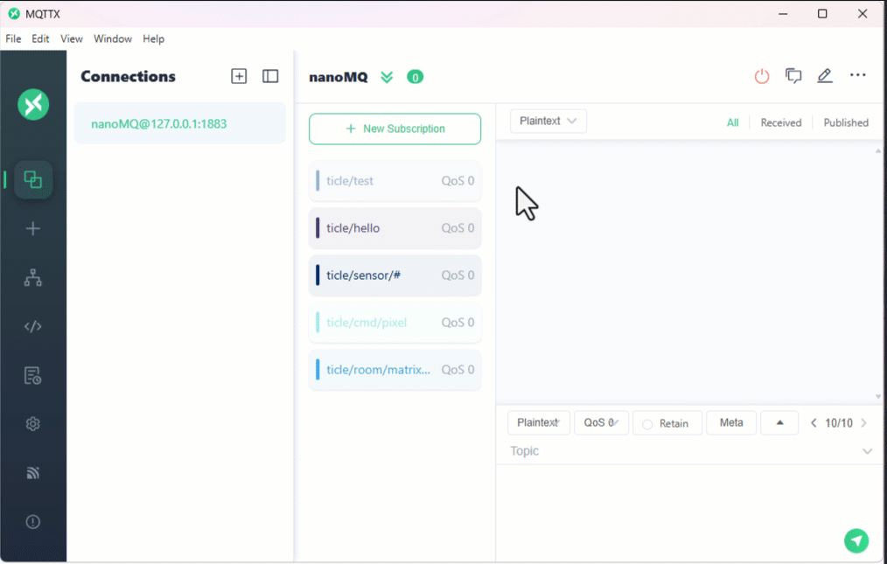</br>

### 수신 보드와 송신 보드를 함께 사용하기

> **이 예제로 풀 문제**  
> 개별 테스트가 끝난 두 보드를 실제로 연결했을 때 지연, 오동작, 중복 명령이 없는지 확인해야 한다. 버튼 입력이 원격 이동 명령으로 일관되게 전달되는지 점검한다.


이제 앞의 두 기본 단계를 결합한다. 보드 B에는 mqtt_pixel_receiver.py를 실행하고, 보드 A에는 mqtt_button_remote.py를 실행한다. MQTTX는 ticle/room/#을 구독한 상태로 두어 두 보드 사이의 메시지 흐름을 관찰한다.

| 장치 | 역할 | 실행 파일 |
| ---- | ---- | --------- |
| 보드 A | 버튼 입력을 방향 메시지로 발행 | mqtt_button_remote.py |
| 보드 B | 방향 메시지를 받아 Pixel Display 보드 + 이동 | mqtt_pixel_receiver.py |
| PC MQTTX | 방향 메시지와 좌표 상태 관찰 | - |

보드 A와 보드 B는 서로의 IP 주소를 알 필요가 없다. 보드 A는 ticle/room/button으로 방향 메시지를 발행하고, 보드 B는 같은 토픽을 구독한다. 따라서 첫 번째 기본 단계에서 MQTTX가 하던 송신 역할을 보드 A가 대신하게 된다.

**실행 결과와 확인할 점**

보드 A에서 UP, LEFT, DOWN, RIGHT 버튼을 누르면 보드 B의 +가 한 칸씩 이동한다. MQTTX의 ticle/room/# 구독 창에는 보드 A가 보낸 방향 메시지와 보드 B가 보낸 현재 좌표 또는 EDGE 상태가 함께 표시된다.

버튼을 눌렀는데 +가 움직이지 않으면 먼저 MQTTX에서 방향 메시지가 실제로 발행되는지 확인한다. 방향 메시지는 보이지만 좌표 상태가 보이지 않으면 보드 B가 실행 중인지, 보드 B의 BROKER 주소가 맞는지 확인한다. 방향 메시지 자체가 보이지 않으면 보드 A의 Wi-Fi 연결, BROKER 주소, 버튼 연결을 확인한다.


**한 걸음 더**

세 번째 TiCLE Lite를 추가하고 같은 mqtt_pixel_receiver.py를 실행해 본다. 두 수신 보드가 모두 ticle/room/button을 구독하면 보드 A의 버튼 하나로 여러 Pixel Display 보드 +가 동시에 움직인다. 반대로 보드 B와 보드 C를 따로 제어하고 싶다면 ticle/room/b/button, ticle/room/c/button처럼 장치 이름을 토픽에 포함하도록 바꾸어 본다.

---

## 무선 무드 조명 만들기

> **풀고 싶은 문제**  
> 책상 위 조명을 멀리 떨어진 곳에서 색상과 전원 상태까지 바꿀 수 있을까? 먼저 조명 보드가 MQTTX 명령을 올바르게 받는지 확인하고, 다음으로 컨트롤러 보드가 MQTTX에 명령을 올바르게 보내는지 확인한 뒤, 마지막에 두 보드를 연결하여 무선 무드 조명을 완성한다.

이 예제는 입력 장치와 출력 장치를 더 명확히 분리한다. 컨트롤러 보드는 VR, 버튼, CdS를 읽어 명령과 상태를 발행한다. 조명 보드는 Pixel Display 보드만 제어하며, mood/mode와 mood/power 명령을 구독한다.

mode는 색상 모드, power는 켜짐과 꺼짐, light는 컨트롤러 주변 밝기이다. 하나의 토픽에 모든 정보를 한꺼번에 넣지 않고 역할별로 나누면, 조명 보드는 mode와 power만 구독하고 관찰용 프로그램은 mood/#으로 전체 상태를 볼 수 있다.

### 조명 보드와 MQTTX로 조명 명령 확인하기

> **이 예제로 풀 문제**  
> 조명 보드가 색상 명령을 어떻게 해석하는지 먼저 확인하면 컨트롤러 코드를 단순하게 설계할 수 있다. MQTTX로 색상 명령을 보내 동작 범위를 검증한다.


먼저 TiCLE Lite 한 대를 조명 보드로 사용하는데, 이 단계에서는 실제 컨트롤러 보드를 연결하지 않고 PC의 MQTTX가 컨트롤러 역할을 대신한다. MQTTX에서 mood/mode와 mood/power 토픽으로 테스트 메시지를 보내면 조명 보드가 이를 받아 Pixel Display 보드 색과 전원 상태를 바꾼다.

| 장치 | 역할 |
| ---- | ---- |
| PC MQTTX | mood/mode와 mood/power 테스트 명령 발행 |
| TiCLE Lite | 명령을 받아 Pixel Display 보드 색과 전원 상태 변경 |

다음 프로그램을 조명 보드에서 실행한다. 실행 후 MQTTX에서 mood/mode 토픽으로 0부터 4까지의 숫자를 발행하고, mood/power 토픽으로 on 또는 off를 발행한다.

```python
# mqtt_mood_lamp.py
import time
from wifi import Wifi
from upaho import Client
from ticle_lite.ws2812 import Matrix

BROKER = "192.168.100.10"  # You can change this to your MQTT broker address
BASE = "mood"

PALETTE = [
    (180, 20, 20),
    (180, 100, 0),
    (0, 140, 60),
    (0, 80, 180),
    (120, 40, 160),
]

if not Wifi.is_connected():
    raise RuntimeError("Wi-Fi is not connected")

matrix = Matrix(0, brightness=0.12)
enabled = True
color_idx = 0

def redraw():
    matrix.fill(PALETTE[color_idx] if enabled else (0, 0, 0))
    matrix.update()

def on_message(client, userdata, msg):
    global enabled, color_idx
    text = msg.payload.decode().strip()

    if msg.topic == BASE + "/mode":
        try:
            color_idx = max(0, min(len(PALETTE) - 1, int(text)))
            redraw()
        except ValueError:
            print("invalid mode:", text)

    elif msg.topic == BASE + "/power":
        enabled = text == "on"
        redraw()

client = Client("mood-lamp")
client.on_message = on_message
client.connect(BROKER)
client.subscribe(BASE + "/mode")
client.subscribe(BASE + "/power")
redraw()

try:
    print("mood lamp ready")
    while True:
        client.loop(timeout=0.05)
        time.sleep_ms(10)
finally:
    client.disconnect()
    matrix.fill((0, 0, 0))
    matrix.update()
    matrix.deinit()
```

**코드 해설**

조명 보드는 mood/mode와 mood/power 두 토픽만 구독한다. mood/mode는 색상 번호이고, mood/power는 조명을 켜거나 끄는 명령이다. 조명 보드는 컨트롤러가 VR을 사용하는지, 버튼을 사용하는지 알 필요가 없다. 정해진 토픽으로 정해진 형식의 메시지가 오면 그에 맞게 출력만 바꾸면 된다.

PALETTE는 모드 번호와 실제 RGB 색을 연결하는 표이다. mode 값이 0이면 첫 번째 색, 1이면 두 번째 색을 사용한다. 수신한 mode 값이 범위를 벗어나면 max와 min으로 가장 가까운 범위 안으로 제한한다. power가 off이면 현재 색상 번호를 기억한 채 Pixel Display 보드만 끈다.

**실행 결과와 확인할 점**

MQTTX에서 mood/mode 토픽으로 0, 1, 2, 3, 4를 차례로 보내면 Pixel Display 보드 색이 단계적으로 바뀐다. mood/power 토픽으로 off를 보내면 꺼지고, on을 보내면 마지막으로 선택된 색이 다시 켜진다.

mode 명령은 반응하지만 power 명령이 반응하지 않으면 발행 토픽이 mood/power인지 확인한다. power 명령은 반응하지만 색이 바뀌지 않으면 mood/mode 메시지가 숫자 형식인지 확인한다.

</br>

### 컨트롤러 보드와 MQTTX로 명령 메시지 확인하기

> **이 예제로 풀 문제**  
> 컨트롤러 보드의 입력값이 조명 명령으로 올바르게 변환되는지 확인해야 두 장치를 묶었을 때 오동작을 줄일 수 있다. 발행 메시지를 MQTTX로 먼저 점검한다.


이번에는 TiCLE Lite 한 대를 컨트롤러 보드로 사용하는데, 이 단계에서는 조명 보드를 연결하지 않고 PC의 MQTTX가 mood/#을 구독하여 컨트롤러가 어떤 메시지를 발행하는지 관찰한다.

| 장치 | 역할 |
| ---- | ---- |
| TiCLE Lite | VR, 버튼, CdS를 읽어 mood 토픽으로 발행 |
| PC MQTTX | mood/# 구독으로 mode, power, light 메시지 확인 |

다음 프로그램을 컨트롤러 보드에서 실행한다.

```python
# mqtt_mood_controller.py
import time
from wifi import Wifi
from upaho import Client
from ticle_lite.ain import Ain
from ticle_lite.button import Button

BROKER = "192.168.100.10"  # You can change this to your MQTT broker address
BASE = "mood"

if not Wifi.is_connected():
    raise RuntimeError("Wi-Fi is not connected")

ain = Ain([27, 28], bits=12)   # GP27: VR, GP28: CdS, 12-bit ADC
up = Button(16)                # GP16: UP
client = Client("mood-controller")
client.connect(BROKER)

last_mode = -1
power = True
next_report = time.ticks_ms()

try:
    print("VR changes color, UP toggles power")
    while True:
        client.loop(timeout=0)

        mode = int(ain[0].read_percent() * 5 // 101)
        if mode != last_mode:
            last_mode = mode
            client.publish(BASE + "/mode", str(mode))
            print("mode:", mode)

        if up.update(Button.PRESS):
            power = not power
            client.publish(BASE + "/power", "on" if power else "off")
            print("power:", power)

        now = time.ticks_ms()
        if time.ticks_diff(now, next_report) >= 0:
            next_report = time.ticks_add(now, 1000)
            client.publish(BASE + "/light", "{:.1f}".format(ain[1].read_percent()))

        time.sleep_ms(20)
finally:
    client.disconnect()
    ain.deinit()
    up.deinit()
```

**코드 해설**

VR 값은 연속적인 아날로그 입력이지만, 조명 모드는 다섯 단계의 이산 값이다. 따라서 'ain.read_percent() * 5 // 101' 계산으로 0부터 4까지의 모드 번호로 변환한다. 연속 값을 몇 개의 구간으로 나누어 명령으로 바꾸는 것은 물리 입력을 디지털 시스템에서 다루는 대표적인 방법이다.

컨트롤러는 mode가 바뀌었을 때만 mood/mode를 발행한다. VR을 읽을 때마다 계속 발행하면 같은 값이 반복되어 브로커와 수신 보드에 불필요한 메시지가 쌓인다. 반면 CdS 밝기 값은 관찰용 상태이므로 1초에 한 번 mood/light로 발행한다. 명령 메시지와 상태 보고 메시지의 주기를 다르게 잡은 것이다.

**실행 결과와 확인할 점**

MQTTX에서 mood/#을 구독한 상태에서 컨트롤러 보드의 VR을 돌리면 mood/mode 메시지가 0부터 4 사이의 값으로 발행된다. UP 버튼을 누르면 mood/power 메시지가 on 또는 off로 발행된다. CdS 값은 mood/light로 1초마다 발행된다.

VR을 천천히 돌릴 때 같은 구간 안에서는 새 mode 메시지가 반복해서 나오지 않아야 한다. mode와 power는 사용자가 조작했을 때만 바뀌고, light는 1초마다 갱신된다. 이 차이를 확인하면 명령과 상태 보고를 구분하는 이유를 이해할 수 있다.

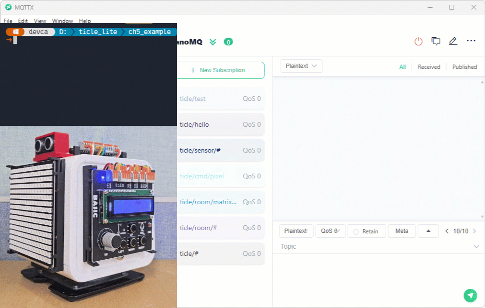</br>

### 컨트롤러 보드와 조명 보드를 함께 사용하기

> **이 예제로 풀 문제**  
> 입력 보드와 출력 보드를 분리했을 때도 사용자가 의도한 조명 변화가 즉시 반영되어야 한다. 두 보드를 연결해 원격 무드 조명 흐름을 완성한다.


이제 앞의 두 기본 단계를 결합한다. 보드 A에는 mqtt_mood_controller.py를 실행하고, 보드 B에는 mqtt_mood_lamp.py를 실행한다. MQTTX는 mood/#을 구독한 상태로 두어 컨트롤러가 보낸 메시지와 조명 보드의 반응을 함께 확인한다.

| 장치 | 역할 | 실행 파일 |
| ---- | ---- | --------- |
| 보드 A | VR, CdS, Button을 읽어 명령과 상태 발행 | mqtt_mood_controller.py |
| 보드 B | 명령을 받아 Pixel Display 보드 색과 전원 상태 변경 | mqtt_mood_lamp.py |
| PC MQTTX | mood/# 구독으로 메시지 흐름 관찰 | - |

보드 A는 사용자의 손 조작을 MQTT 명령으로 바꾸고, 보드 B는 명령을 받아 시각 효과로 표현한다. 보드 B는 VR이나 버튼이 어디에 연결되어 있는지 알지 못해도 된다. 반대로 보드 A도 조명이 어떤 RGB 값으로 표시되는지 알 필요가 없다. 두 보드는 mood 토픽 규칙만 공유한다.

**실행 결과와 확인할 점**

컨트롤러 보드의 VR을 돌리면 조명 보드의 Pixel Display 보드 색이 단계적으로 바뀐다. UP 버튼을 누르면 조명이 켜지거나 꺼진다. MQTTX에서 mood/#을 구독하면 mode, power, light 메시지가 함께 보이므로, 조명이 바뀌지 않을 때 송신 문제인지 수신 문제인지 구분할 수 있다.

mode 메시지는 보이지만 조명 색이 바뀌지 않으면 조명 보드가 실행 중인지, 조명 보드의 BROKER 주소가 맞는지 확인한다. mode 메시지 자체가 보이지 않으면 컨트롤러 보드의 Wi-Fi 연결, BROKER 주소, VR 연결을 확인한다.


**한 걸음 더**

CdS 값이 낮을 때만 조명이 자동으로 켜지도록 바꾸어 본다. 예를 들어 light가 20%보다 낮으면 mood/power에 on을 발행하고, 60%보다 높으면 off를 발행할 수 있다. 다만 수동 버튼 명령과 자동 밝기 판단이 충돌할 수 있으므로, 사용자가 끈 조명을 자동 규칙이 바로 다시 켜도 되는지 우선순위를 정해야 한다. 이것이 원격 제어 시스템에서 규칙 설계가 필요한 이유이다.

---

## 원격 전광판

> **풀고 싶은 문제**  
> 대기실에 설치한 전광판이 네트워크로 받은 공지사항을 스크롤로 내보내면서, 서보가 좌우를 훑다가 지나가는 사람을 감지하면 그 방향을 가리키도록 만들 수 있을까? 먼저 전광판 보드가 MQTTX에서 보낸 텍스트 명령을 올바르게 수신하는지 확인하고, 다음으로 서보와 초음파 센서가 스스로 스캔하고 잠금하는지 확인한 뒤, 마지막에 두 동작을 하나의 프로그램으로 합친다.

이전 예제들은 두 보드가 토픽을 사이에 두고 역할을 나누었다. 이 예제는 한 보드 안에서 네 가지 동작이 함께 돌아간다. MQTT로 받은 텍스트를 Pixel Display 보드에 스크롤하고, 서보가 좌우를 훑으며 초음파 센서로 30cm 이내 물체를 감지하고, CdS로 주변 밝기를 재어 디스플레이 밝기를 자동으로 조절한다. 이 절은 두 동작을 하나씩 확인하고 마지막에 합치는 순서로 진행한다.

텍스트 명령은 sign/text 토픽으로 수신하며, 페이로드는 JSON 문자열이다. count가 양의 정수이면 해당 횟수만큼 스크롤하고, -1이면 다음 명령이 올 때까지 무한 반복하며, 0이면 진행 중인 스크롤을 즉시 멈춘다. text는 표시할 문자열이고, fg는 글자색을 RGB 목록으로 지정한다. 예를 들어 {"count":3,"text":"Hello","fg":[255,128,0]}는 Hello를 주황색으로 세 번 스크롤한다.

### 전광판 보드와 MQTTX로 텍스트 명령 확인하기

> **이 예제로 풀 문제**  
> 전광판 보드가 문자열 명령을 어디까지 받아 처리하는지 모르면 운영 중 메시지 형식이 쉽게 깨진다. MQTTX로 텍스트 명령 규칙을 먼저 고정한다.


먼저 TiCLE Lite 한 대를 전광판 보드로 사용한다. 이 단계에서는 서보와 초음파 센서 없이 Pixel Display 보드와 MQTT 명령 처리만 확인한다. PC의 MQTTX가 명령 발송자 역할을 대신한다.

| 장치 | 역할 |
| ---- | ---- |
| PC MQTTX | sign/text 토픽으로 JSON 텍스트 명령 발행, sign/cds 구독으로 조도 확인 |
| TiCLE Lite | 명령을 받아 Pixel Display 보드에 텍스트 스크롤, CdS 값을 sign/cds 토픽으로 발행 |

MQTTX를 열고 브로커에 접속한 뒤, 다음 프로그램을 전광판 보드에서 실행한다.

```python
# mqtt_sign_display.py
import time
import json
from wifi import Wifi
from upaho import Client
from ticle_lite.ws2812 import Matrix
from ticle_lite.ain import Ain

BROKER = "192.168.100.10"  # You can change this to your MQTT broker address

if not Wifi.is_connected():
    raise RuntimeError("Wi-Fi is not connected")

matrix = Matrix(0, brightness=0.3)
cds = Ain(28, bits=12)  # GP28: CdS, 12-bit ADC

scroll_count   = 0
scroll_text    = ""
scroll_text_fg = (255, 128, 0)

def on_scroll_done(mx):  # mx is a Matrix object but is not used
    global scroll_count
    
    if scroll_count > 0:
        scroll_count -= 1
    if scroll_count == 0:
        matrix.fill((0, 120, 0))
        matrix.update()
    else:
        matrix.draw_text_scroll(scroll_text, fg=scroll_text_fg,
                                on_done=on_scroll_done)

def on_message(client, userdata, msg):
    global scroll_count, scroll_text, scroll_text_fg
    
    try:
        raw_payload = msg.payload.decode().strip()
        data = json.loads(raw_payload)
        scroll_count = data.get('count', 0)

        if scroll_count == 0:
            matrix.stop_scroll()
            matrix.fill((0, 120, 0))
            matrix.update()
            return

        scroll_text = data.get('text', '')
                
        if 'fg' in data and isinstance(data['fg'], list):
            scroll_text_fg = tuple(data['fg'])
        
        matrix.stop_scroll()
        matrix.draw_text_scroll(scroll_text, fg=scroll_text_fg,
                                on_done=on_scroll_done)
    except (ValueError, KeyError) as e:
        print("JSON parsing error:", e)
    
client = Client("sign-display")
client.on_message = on_message
client.connect(BROKER)
client.subscribe("sign/text")

matrix.fill((0, 120, 0))
matrix.update()

brightness_tick = 0

try:
    print("sign display ready")
    while True:
        client.loop(timeout=0.05)
        brightness_tick += 1
        if brightness_tick >= 10:
            brightness_tick = 0
            cds_perc = cds.read_percent()
            client.publish("sign/cds", f"{cds_perc:.1f}")
            matrix.brightness = 0.05 + (cds_perc / 100.0) * 0.45
        time.sleep_ms(50)
finally:
    client.disconnect()
    matrix.stop_scroll()
    matrix.deinit()
    cds.deinit()
```

**코드 해설**

on_message()는 수신한 payload를 문자열로 바꾼 뒤 json.loads()로 딕셔너리로 변환하여 명령을 해석한다. MQTTX에서 보낼 때는 Payload에 JSON 문자열을 그대로 입력하면 된다. JSON 형식이 틀리면 JSON parsing error를 출력하고 현재 스크롤 상태를 그대로 유지한다. fg는 JSON 배열로 들어오지만 draw_text_scroll()에는 튜플로 넘겨야 하므로 tuple()로 변환하고, count가 0이면 stop_scroll()로 즉시 멈추고 초록색으로 되돌린다.

Matrix(0, brightness=0.3)는 생성과 동시에 스크롤 타이머를 50ms 주기로 초기화하는데, draw_text_scroll()에서 speed_ms를 따로 지정하지 않으면 이 값을 그대로 사용한다.

draw_text_scroll()의 on_done 콜백을 on_scroll_done() 함수에 연결했다. 스크롤이 한 번 끝날 때마다 이 함수가 호출되고, 남은 횟수를 줄이거나 다음 반복을 시작할지 결정한다. count가 -1이면 scroll_count가 0이 되지 않으므로 계속 반복된다. 이 방식 덕분에 메인 반복문에서 스크롤 상태를 직접 관리할 필요 없이 MQTT 수신과 밝기 조절을 이어갈 수 있다.

밝기 조절은 매 반복마다 하지 않고 10회에 한 번만 수행한다. 루프 안에는 client.loop(timeout=0.05)와 time.sleep_ms(50)이 함께 있으므로, MQTT 메시지가 계속 들어오지 않는 보통 상황에서는 한 반복이 약 100ms에 가깝고 CdS는 약 1초 간격으로 읽힌다. CdS 퍼센트 값은 sign/cds 토픽으로 발행하므로 MQTTX나 다른 클라이언트에서 현재 조명 환경을 확인할 수 있다. 주변이 밝을수록 CdS 값이 커지므로 brightness도 함께 올라간다. 어두운 환경에서는 brightness를 낮추어 디스플레이가 눈부시지 않게 한다.

**실행 결과와 확인할 점**

MQTTX에서 sign/text 토픽으로 {"count":1,"text":"Hello"}를 보내면 Hello가 기본색인 주황색으로 한 번 스크롤되고 초록색으로 돌아와야 한다. {"count":-1,"text":"Hello, \"World\"","fg":[128,0,255]}를 보내면 보라색으로 Hello, "World" 스크롤이 계속 반복된다. 스크롤 중에 {"count":0}을 보내면 즉시 멈추고 초록색으로 돌아와야 한다.

CdS를 손으로 가리면 다음에 출력되는 글자의 밝기가 어두워지고, 손을 떼면 다음에 출력되는 글자의 밝기가 다시 밝아져야 한다. 긴 문장을 count -1로 반복해 출력하는 동안에도 sign/cds 값은 약 1초마다 갱신된다. 밝기 변화가 글자 중간에서 즉시 바뀌기보다 다음에 그려지는 글자부터 반영되는지 확인한다.

</br>

> **알아두기 — on_done 콜백**  
> draw_text_scroll()은 내부 타이머로 구동되지만, 실제 스크롤 한 프레임 처리는 타이머가 micropython.schedule()로 예약한 내부 함수에서 이루어진다. on_done에 등록한 함수는 스크롤 한 회가 끝났을 때 자동으로 호출된다. 따라서 이 함수 안에서 다시 draw_text_scroll()을 호출하면 다음 반복을 시작할 수 있다.

### 서보와 초음파 센서로 자동 감지 확인하기

> **이 예제로 풀 문제**  
> 전광판 제어에 거리 감지를 결합하려면 센서 측정과 서보 동작의 기준값을 먼저 검증해야 한다. 자동 감지 루프가 안정적으로 반복되는지 확인한다.


이 단계에서는 서보와 초음파 센서만 사용하고, MQTT 없이 동작 자체를 먼저 확인한다. 서보가 30도에서 150도 사이를 일정 속도로 오가면서 초음파 센서로 거리를 측정한다. 30cm 이하에 물체가 감지되면 서보가 멈추고, 물체가 사라지면 다시 스캔을 재개한다.

```python
# mqtt_sign_servo_scan_test.py
import time
import math
from ticle_lite.servo import Servo
from ticle_lite.us import SR04 as UltraSonic
from ufilter import Median

def scan_task():
    SCAN_MIN = 30.0
    SCAN_MAX = 150.0
    DETECT_MAX_CM = 30.0  # Increase the distance as needed.
    SERVO_STEP = 1.5

    SCANNING = 0
    LOCKED = 1
    UNLOCK_THRESHOLD = 6  # Resume scan after 6 consecutive out-of-range scans (approx. 300ms)

    servo = Servo(1)
    sonic = UltraSonic(trig=12, echo=13)
    dist_filter = Median(5, initial=999.0)

    servo_angle = 90.0
    servo_dir = 1.0
    servo_state = SCANNING
    unlock_tick = 0

    try:
        while True:
            raw = sonic.read()
            dist_cm = dist_filter.update(999.0 if math.isnan(raw) else raw * 100)
            in_range = dist_cm <= DETECT_MAX_CM

            if servo_state == SCANNING:
                servo_angle += servo_dir * SERVO_STEP
                if servo_angle >= SCAN_MAX:
                    servo_angle = SCAN_MAX
                    servo_dir = -1.0
                elif servo_angle <= SCAN_MIN:
                    servo_angle = SCAN_MIN
                    servo_dir = 1.0
                servo.move_to(servo_angle, ms=60)
                if in_range:
                    servo_state = LOCKED
                    unlock_tick = 0
                    print("locked at {:.1f} cm".format(dist_cm))
            else:
                if in_range:
                    unlock_tick = 0
                else:
                    unlock_tick += 1
                    if unlock_tick >= UNLOCK_THRESHOLD:
                        servo_state = SCANNING
                        unlock_tick = 0
                        print("scanning")

            time.sleep_ms(50)
    finally:
        servo.home()
        servo.wait()
        servo.deinit()

if __name__ == "__main__":
    scan_task()
```

**코드 해설**

서보 동작은 SCANNING과 LOCKED 두 상태로 나누어 관리한다. SCANNING 상태에서는 매 반복마다 servo_angle을 SERVO_STEP(1.5도)씩 늘리거나 줄인 뒤 move_to로 목표 각도를 보낸다. 50ms마다 1.5도씩 움직이므로 초당 약 30도씩 훑으며, 30도에서 150도 사이를 한 번 왕복하는 데 약 8초가 걸린다.

물체가 감지되면 LOCKED로 전환하고 move_to 호출을 멈춘 후 물체가 사라지기를 기다린다. 잠금 해제 조건에는 주의가 필요하다. SR04는 에코 신호를 받지 못하면 nan을 돌려주고, 감지 경계 근처에서는 측정값이 범위 안팎을 빠르게 오가기도 한다. 

한 번의 이탈 판정만으로 SCANNING으로 돌아가면, 실제로는 물체가 있는데도 서보가 다시 움직이는 경우가 생긴다. 이를 막기 위해 unlock_tick 카운터를 두었다. 범위를 벗어날 때마다 카운터를 올리고, 범위 안 값이 들어오면 0으로 리셋한다. 이탈이 UNLOCK_THRESHOLD(6회, 약 300ms)만큼 연속되어야 비로소 스캔을 재개하므로, 측정값이 잠깐 흔들리거나 nan이 나와도 잠금 상태가 유지된다.

**실행 결과와 확인할 점**

프로그램을 실행하면 서보가 30도와 150도 사이를 천천히 오가기 시작한다. SR04 앞 30cm 이내에 손을 가져다 대면 locked 메시지가 출력되면서 서보가 그 각도에 멈춘다. 손을 30cm 밖으로 치운 뒤 약 300ms가 지나면 scanning 메시지와 함께 서보가 다시 움직인다. 손을 빠르게 흔들거나 잠깐 뺐다가 대면 서보가 멈춤 상태를 유지하는지 확인한다. 범위를 잠깐 이탈했다가 다시 들어오면 unlock_tick이 리셋되어 잠금이 계속 유지되어야 한다.

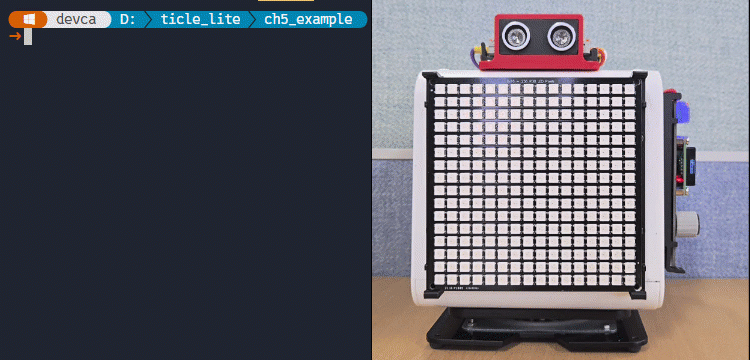</br>

> **한 걸음 더**  
> SERVO_STEP을 0.5로 줄이면 서보가 훨씬 느리게 훑는다. 이때 손을 빠르게 지나가면 서보가 반응하기 전에 감지 범위를 벗어날 수 있다. 반대로 3.0으로 늘리면 빠르게 훑지만 각도 해상도가 낮아진다. 두 값을 바꾸어 보며 스캔 속도와 감지 정밀도의 차이를 직접 확인해 보자.

### 전체 전광판 동작 확인하기

> **이 예제로 풀 문제**  
> 개별 기능이 정상이어도 통합하면 충돌이 생길 수 있다. 텍스트 명령, 자동 감지, 표시 동작이 한 시스템에서 끊김 없이 이어지는지 종합 검증한다.


앞의 두 단계를 하나의 프로그램으로 합친다. MQTT 텍스트 스크롤, 서보 스캔,잠금, CdS 밝기 조절이 동시에 돌아가는 것이 목표이다.

그런데 두 예제를 단순히 하나의 while 루프에 합치면 스크롤 글자가 순간적으로 튀는 현상이 나타난다. Matrix의 draw_text_scroll()은 타이머와 micropython.schedule()로 프레임 처리를 예약하는데, SR04 에코 대기처럼 코어를 점유하는 코드가 실행 중이면 예약된 처리가 그만큼 밀린다. mqtt_sign_display.py 단독으로는 부드럽고, 서보 스캔 단독으로는 정상인데, 둘을 합치면 문제가 나타나는 것은 이 때문이다.

해결 방법은 역할을 코어 단위로 나누는 것이다. _thread 모듈로 코어1에 별도 함수를 실행하고, 코어0에는 MQTT 수신과 Matrix 스크롤만 담당하게 한다. 코어1이 SR04 에코 대기와 서보 스캔을 맡으므로 코어0는 타이머가 예약한 프레임 처리를 지연 없이 실행할 수 있다.

| 장치 | 역할 |
| ---- | ---- |
| TiCLE Lite | 텍스트 스크롤 수신, 서보 스캔,잠금, CdS 밝기 자동 조절, sign/cds 발행 |
| PC MQTTX | sign/text 발행으로 JSON 스크롤 명령 전송, sign/cds 구독으로 조도 모니터링 |

```python
# mqtt_sign_board.py
import _thread
import time
import math
import json
from wifi import Wifi
from upaho import Client
from ticle_lite.ws2812 import Matrix
from ticle_lite.ain import Ain
from ticle_lite.servo import Servo
from ticle_lite.us import SR04 as UltraSonic

SCAN_MIN = 30.0
SCAN_MAX = 150.0
DETECT_MAX_CM = 30.0
SERVO_STEP = 1.5
SCANNING = 0
LOCKED = 1
UNLOCK_THRESHOLD = 6

BROKER = "192.168.100.10"  # You can change this to your MQTT broker address

if not Wifi.is_connected():
    raise RuntimeError("Wi-Fi is not connected")

servo = Servo(1)
sonic = UltraSonic(trig=12, echo=13)
matrix = Matrix(0, brightness=0.3)
cds = Ain(28, bits=12)  # GP28: CdS, 12-bit ADC

scroll_count   = 0
scroll_text    = ""
scroll_text_fg = (255, 128, 0)
scroll_pending = False

def on_scroll_done(mx):
    global scroll_count, scroll_pending
    if scroll_count > 0:
        scroll_count -= 1
    scroll_pending = True

def on_message(client, userdata, msg):
    global scroll_count, scroll_text, scroll_text_fg, scroll_pending

    try:
        raw = msg.payload.decode().strip()
        data = json.loads(raw)
        scroll_count = data.get('count', 0)
        scroll_text = data.get('text', '')
        if 'fg' in data and isinstance(data['fg'], list):
            scroll_text_fg = tuple(data['fg'])
    except (ValueError, KeyError) as e:
        print("JSON parsing error:", e)
        return

    scroll_pending = True

def apply_scroll_command():
    global scroll_pending, scroll_count

    if not scroll_pending:
        return
    scroll_pending = False

    matrix.stop_scroll()

    if scroll_count == 0:
        matrix.fill((0, 120, 0))
        matrix.update()
    else:
        matrix.draw_text_scroll(scroll_text, fg=scroll_text_fg, 
                                on_done=on_scroll_done)

_scan_running = True

def _scan_thread():
    servo_angle = 90.0
    servo_dir = 1.0
    servo_state = SCANNING
    unlock_tick = 0

    while _scan_running:
        raw = sonic.read()
        dist_cm = 999.0 if math.isnan(raw) else raw * 100
        in_range = dist_cm <= DETECT_MAX_CM

        if servo_state == SCANNING:
            servo_angle += servo_dir * SERVO_STEP
            if servo_angle >= SCAN_MAX:
                servo_angle = SCAN_MAX
                servo_dir = -1.0
            elif servo_angle <= SCAN_MIN:
                servo_angle = SCAN_MIN
                servo_dir = 1.0
            servo.angle = servo_angle
            if in_range:
                servo_state = LOCKED
                unlock_tick = 0
                print("locked at {:.1f} cm".format(dist_cm))
        else:
            if in_range:
                unlock_tick = 0
            else:
                unlock_tick += 1
                if unlock_tick >= UNLOCK_THRESHOLD:
                    servo_state = SCANNING
                    unlock_tick = 0
                    print("scanning")

        time.sleep_ms(50)

client = Client("sign-display")
client.on_message = on_message
client.connect(BROKER)
client.subscribe("sign/text")

matrix.fill((0, 120, 0))
matrix.update()

brightness_tick = 0

try:
    print("sign board ready")
    _thread.start_new_thread(_scan_thread, ())

    while True:
        client.loop(timeout=0.05)
        apply_scroll_command()
        brightness_tick += 1
        if brightness_tick >= 10:
            brightness_tick = 0
            cds_perc = cds.read_percent()
            client.publish("sign/cds", f"{cds_perc:.1f}")
            matrix.brightness = 0.05 + (cds_perc / 100.0) * 0.45
        time.sleep_ms(50)
finally:
    _scan_running = False
    time.sleep_ms(200)
    client.disconnect()
    matrix.deinit()
    cds.deinit()
    servo.home()
    servo.wait()
    servo.deinit()
```

**코드 해설**

on_message()와 on_scroll_done()은 공통된 설계 원칙을 따른다. 두 함수 모두 화면을 직접 바꾸지 않고 scroll_pending을 True로 바꾸는 데 그친다. 실제 화면 갱신은 메인 반복문이 client.loop()를 마친 뒤 apply_scroll_command()에서 처리한다. MQTT 콜백이나 타이머 완료 콜백 안에서 바로 draw_text_scroll()을 호출하면, 오류가 발생했을 때 client.loop() 안으로 예외가 전달되어 MQTT 연결이 끊길 수 있기 때문이다.

_scan_thread()는 코어1에서 실행된다. sonic.read()는 에코 신호를 기다리며 최대 38ms 동안 블로킹되지만, 코어1이 담당하므로 코어0의 스크롤 타이머에는 영향을 미치지 않는다. 스캔과 잠금 동작은 앞 단계와 같다.

한편 servo.move_to() 대신 servo.angle 속성을 사용하는데, move_to()는 내부에서 타이머를 만들어 부드럽게 이동하지만, Matrix 스크롤 타이머와 타이머 자원을 함께 사용하면 메모리 부담이 늘어난다. angle 속성은 PWM 레지스터만 갱신하므로 추가 타이머가 필요 없어 두 기능을 함께 실행하기에 적합하다.

finally 블록에서는 _scan_running을 False로 바꾼 뒤 200ms를 대기하여 코어1 루프가 종료되도록 한다. 그런 다음 client, matrix, cds, servo 순으로 정리한다. matrix.deinit()은 내부 스크롤 타이머를 해제하고 화면을 지운다.

**실행 결과와 확인할 점**

보드를 실행하면 Pixel Display 보드가 초록색으로 켜지고 서보가 좌우를 오가기 시작한다. MQTTX에서 {"count":3,"text":"Hello","fg":[255,128,0]}를 보내면 Hello가 세 번 스크롤되는데, 스크롤 중에도 서보는 멈추지 않는다. 코어 분리가 정상적으로 동작하고 있다면 스크롤 글자가 중간에 튀거나 멈추는 현상 없이 부드럽게 나아가야 한다.

SR04 앞에 손을 가져다 대면 서보가 그 각도에 멈추고, 스크롤은 계속 진행된다. 스크롤이 끝난 뒤에도 서보가 멈춤 상태를 유지하는지, 손을 치우고 약 300ms 후에 다시 스캔을 시작하는지 확인한다. CdS를 손으로 가리면 다음 글자부터 밝기가 어두워지고, 밝게 하면 다시 밝아진다. MQTTX에서 sign/cds 토픽을 구독해 두면 약 1초마다 값이 갱신되는지도 함께 확인할 수 있다.

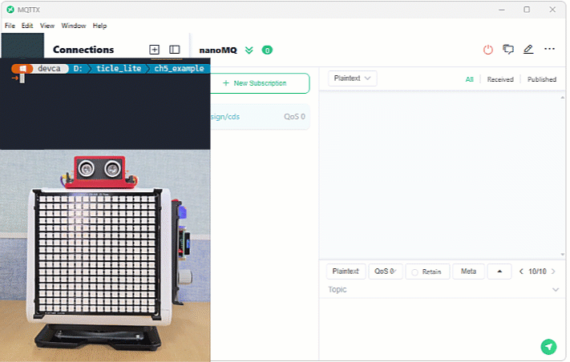</br>

> **한 걸음 더**  
> DETECT_MAX_CM 값을 바꾸어 보자. 20으로 줄이면 아주 가까운 대상에만 서보가 멈추고, 80으로 늘리면 더 먼 대상에도 반응한다. 또한 SERVO_STEP을 크게 하면 서보가 더 빠르게 훑고, 작게 하면 더 세밀하게 훑는다. 두 값을 함께 조절하면서 반응 속도와 안정성의 차이를 비교해 보자.

---

## PC에서 파이썬으로 MQTT 사용하기

> **풀고 싶은 문제**  
> 앞의 예제들에서 PC는 항상 MQTTX로 메시지를 보냈다. MQTTX는 메시지를 한 번씩 손으로 보내기에 좋지만, 조건에 따라 자동으로 보내거나 연속된 메시지를 처리하기는 어렵다. PC 파이썬 프로그램이 MQTTX 역할을 대신할 수 있을까?

Core 보드에서 upaho를 사용하듯, PC에서는 paho-mqtt 라이브러리로 MQTT 메시지를 보내고 받을 수 있다. 두 라이브러리의 핵심 구조는 거의 같다. Client 인스턴스를 만들고, 브로커에 연결하고, 토픽을 발행하거나 구독하는 방식이다. 차이는 upaho가 마이크로컨트롤러의 제한된 환경에 맞추어 설계된 반면, paho-mqtt는 데스크톱 파이썬 표준에 맞추어 만들어졌다는 점이다.

아래 표는 두 라이브러리의 주요 기능을 비교한 것이다.

| 기능 | upaho (TiCLE Lite) | paho-mqtt (PC) |
| ---- | ------------------ | -------------- |
| 인스턴스 생성 | Client("이름") | mqtt.Client() |
| 브로커 연결 | client.connect(host) | client.connect(host, port) |
| 발행 | client.publish(topic, msg) | client.publish(topic, msg) |
| 구독 | client.subscribe(topic) | client.subscribe(topic) |
| 루프 처리 | client.loop(timeout) | client.loop_start() / loop_forever() |
| 메시지 수신 | on_message 콜백 | on_message 콜백 |

터미널에서 다음 명령으로 paho-mqtt를 PC에 설치한다.

```sh
pip install paho-mqtt
```

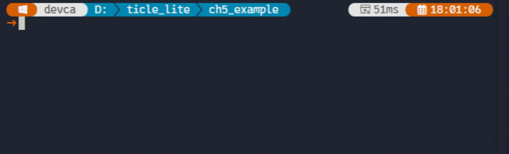</br>

설치가 완료되면 파이썬 파일에서 'import paho.mqtt.client as mqtt' 한 줄로 가져올 수 있다.

### PC 파이썬으로 색상 명령 보내기

> **이 예제로 풀 문제**  
> MQTTX 대신 파이썬 코드로 명령을 보내 자동화 스크립트를 만들 수 있을까? PC 프로그램에서 색상 명령을 발행해 보드 제어를 코드 기반으로 확장한다.


앞에서 다룬 색상 리모컨 예제에서 MQTTX가 하던 역할을 PC 파이썬 스크립트로 대신한다. Core 보드에서는 mqtt_pixel_control.py를 그대로 실행하고, PC에서는 python 명령으로 아래 스크립트를 실행하여 색상 명령을 자동으로 보낸다.

| 장치 | 실행 | 역할 |
| ---- | ---- |---|
| TiCLE Lite | mqtt_pixel_control.py | ticle/cmd/pixel 구독, 명령에 따라 픽셀 색 변경 |
| PC Python | pc_color_publish.py | ticle/cmd/pixel로 색상 명령을 2초 간격으로 순서대로 발행 |

```python
# pc_color_publish.py
import time
import paho.mqtt.client as mqtt

BROKER = "192.168.100.10"  # You can change this to your MQTT broker address
COLORS = ["red", "green", "blue", "yellow", "off"]

connected = False

def on_connect(client, userdata, flags, rc, properties=None):
    global connected
    if rc == 0:
        connected = True
        print("connected")

client = mqtt.Client(callback_api_version=mqtt.CallbackAPIVersion.VERSION2)
client.on_connect = on_connect
client.connect(BROKER)
client.loop_start()

while not connected:
    time.sleep(0.1)

try:
    for color in COLORS:
        client.publish("ticle/cmd/pixel", color)
        print("sent:", color)
        time.sleep(2.0)
finally:
    client.loop_stop()
    client.disconnect()
```

**코드 해설**

mqtt.Client(callback_api_version=mqtt.CallbackAPIVersion.VERSION2)는 paho-mqtt 2.x에서 필수로 지정해야 하는 콜백 버전이다. 이전 버전에서는 mqtt.Client()만으로도 동작했지만, 2.x부터는 콜백 함수의 인자 형식이 바뀌었으므로 버전을 명시하지 않으면 경고가 발생한다. VERSION2를 사용하면 on_connect와 on_message의 마지막 인자로 properties가 추가된다. 이 예제처럼 properties를 실제로 쓰지 않을 때는 함수 선언에 properties=None을 적어 두어 인자를 받아도 무시하게 한다.

loop_start()는 브로커 연결과 메시지 처리를 백그라운드 스레드로 맡는다. 덕분에 메인 코드는 connected 플래그만 확인한 뒤 publish를 순서대로 호출하면 된다. connected 플래그가 True로 바뀌기 전에 publish를 호출하면 메시지가 전달되지 않으므로, while not connected 대기 단계를 생략해서는 안 된다.

**실행 결과와 확인할 점**

터미널 창이 상단에서 'New Terminal'을 눌러 새 터미널을 실행한 후 패널 오른쪽에서 이전 터미널 아이콘을 마우스로 끌어다 빈 영역에 놓으며, 2개의 터미널이 수직으로 나란히 배치된다. 새 터미널은 항상 작업 폴더에서 열리므로 만약 하위 폴더에서 작업 중이라면 'cd <하위폴더>' 명령으로 이동해야 한다. 

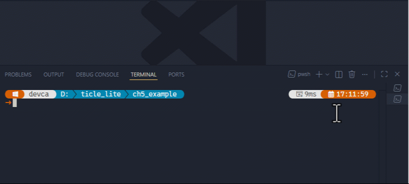</br>

이전 터미널에서 mqtt_pixel_control.py를 Core 보드에 실행해 토픽 메시지를 구독한다. 
```
replx mqtt_pixel_control.py
```

새 터미널은 python 명령으로 토픽 메시지를 발행하는 pc_color_publish.py를 PC에 실행한다. 
```
python pc_color_publish.py
```

Core 보드에 mqtt_pixel_control.py를 먼저 실행하고, PC에서 pc_color_publish.py를 실행한다. Pixel Display 보드가 red → green → blue → yellow → off 순서로 2초 간격으로 바뀐다. MQTTX에서 ticle/cmd/pixel을 구독하면 PC 파이썬이 보낸 색상 명령이 표시된다.

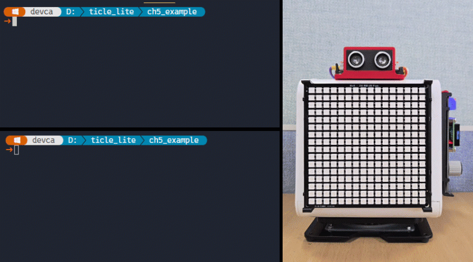</br>

> **한 걸음 더**  
> for 루프 대신 input()을 사용해 사용자가 색상 이름을 직접 입력하면 보내는 방식으로 바꾸어 본다. PC 터미널에서 키보드로 조작하는 간단한 대화형 리모컨이 된다.

### PC 파이썬으로 전광판에 텍스트 명령 보내기

> **이 예제로 풀 문제**  
> 운영 환경에서는 전광판 문구를 코드에서 자동 갱신해야 할 때가 많다. PC 파이썬으로 텍스트 명령을 발행해 전광판 제어를 자동화한다.


앞 단계에서 MQTTX로 직접 입력했던 JSON 텍스트 명령을 PC 파이썬으로 자동화한다. Core 보드에서는 pc_sign_control.py를 그대로 실행하고, PC에서는 아래 스크립트가 텍스트 명령을 순서대로 발행한다. 동시에 전광판 보드가 측정한 CdS 조도 값을 구독하므로, PC 터미널에서 전광판 주변 밝기를 확인할 수 있다.

| 장치 | 실행 | 역할 |
| ---- | ---- |---|
| TiCLE Lite | mqtt_sign_display.py | sign/text 구독, 텍스트 스크롤, sign/cds 발행 |
| PC Python | pc_sign_control.py | sign/text로 JSON 명령 발행, sign/cds 구독으로 조도 수신 |

```python
# pc_sign_control.py
import time
import json
import paho.mqtt.client as mqtt

BROKER = "192.168.100.10"  # You can change this to your MQTT broker address
MESSAGES = [
    {"count": 2, "text": "Hello World",     "fg": [255, 128,   0]},
    {"count": 2, "text": "MQTT Sign Board", "fg": [  0, 200, 100]},
    {"count": 2, "text": "Python + MQTT",   "fg": [100, 100, 255]},
]

connected = False

def on_connect(client, userdata, flags, rc, properties=None):
    global connected
    if rc == 0:
        connected = True
        client.subscribe("sign/cds")
        print("connected")

def on_message(client, userdata, msg, properties=None):
    if msg.topic == "sign/cds":
        print(f"brightness: {msg.payload.decode()}%")

client = mqtt.Client(callback_api_version=mqtt.CallbackAPIVersion.VERSION2)
client.on_connect = on_connect
client.on_message = on_message
client.connect(BROKER)
client.loop_start()

while not connected:
    time.sleep(0.1)

try:
    for data in MESSAGES:
        payload = json.dumps(data)
        client.publish("sign/text", payload)
        print("sent:", payload)
        time.sleep(8.0)
    client.publish("sign/text", json.dumps({"count": 0}))
    print("done")
    time.sleep(1.0)
finally:
    client.loop_stop()
    client.disconnect()
```

**코드 해설**

on_connect()에서 connected를 True로 바꾸는 동시에 sign/cds를 구독한다. 발행과 구독을 같은 Client 인스턴스로 처리하므로 on_message()는 TiCLE Lite가 약 1초마다 보내는 CdS 조도 값을 수신한다. VERSION2 콜백 규약에 따라 on_message의 시그니처에도 properties=None이 포함되어 있다.

MESSAGES는 순서대로 보낼 텍스트 명령 목록이다. 각 항목은 json.dumps()로 문자열로 변환하여 sign/text로 발행한다. time.sleep(8.0)은 스크롤이 끝날 때까지 기다리는 여유 시간인데, 텍스트 길이에 따라 실제 스크롤 시간이 달라지므로 여유 있게 잡았다. 모든 메시지를 보낸 뒤 count 0을 발행하면 전광판이 초록색으로 돌아온다.

**실행 결과와 확인할 점**

첫 번째 터미널에서 mqtt_sign_display.py를 Core 보드에 실행해 토픽 메시지를 구독한다. 
```
replx mqtt_sign_display.py
```

두 번째 터미널에서 python 명령으로 토픽 메시지를 발행하는 pc_sign_control.py를 PC에 실행한다. 
```
python pc_sign_control.py
```

Core 보드에 mqtt_sign_display.py를 먼저 실행하고, PC에서 pc_sign_control.py를 실행한다. Hello World, MQTT Sign Board, Python + MQTT가 각각의 색상으로 두 번씩 스크롤된다. PC 터미널에는 스크롤이 진행되는 동안 약 1초마다 조도 값이 출력된다. CdS를 손으로 가리면 brightness 값이 낮아지고, 손을 떼면 다시 높아져야 한다.

</br>

> **한 걸음 더**  
> on_message() 안에서 수신한 밝기 값이 30% 미만이면 PC가 자동으로 {"count":-1,"text":"Too Dark!","fg":[255,200,0]}를 발행하도록 조건을 추가해 보자. TiCLE Lite가 수집한 환경 정보에 PC가 반응하여 전광판 내용을 바꾸는 자동화 흐름이 만들어진다.

---

## 정리

> **풀고 싶은 문제**  
> 이번 장에서 배운 MQTT 요소를 실제 프로젝트에 적용하려면 무엇부터 설계하고 무엇을 먼저 검증해야 할까? 핵심 개념과 실습 흐름을 연결해 재사용 가능한 체크리스트로 정리한다.


MQTT는 브로커를 중심으로 장치들이 메시지를 주고받는 통신 방식이다. TiCLE Lite 한 대가 센서값을 발행하면 PC, 다른 TiCLE Lite, 태블릿 프로그램 등이 같은 값을 동시에 받을 수 있다. 반대로 PC나 다른 보드가 발행한 명령을 TiCLE Lite가 구독하여 Pixel Display 보드, Servo 같은 액추에이터를 제어할 수 있다. 이 장에서는 발행만 하는 센서 모니터링, 구독만 하는 원격 제어, 발행과 구독을 동시에 하는 전광판까지 세 가지 구조를 순서대로 다루었다.

MQTT 클라이언트는 연결된 뒤에도 loop()를 주기적으로 호출해야 브로커와의 연결 유지 신호를 보내고 수신 메시지를 콜백으로 전달한다. 원격 전광판 예제에서는 SR04 에코 대기가 loop() 호출을 막는 문제를 _thread로 코어를 분리하여 해결했다. 코어0는 MQTT와 스크롤 타이머를 맡고, 코어1은 거리 측정과 서보 스캔을 담당하므로 두 동작이 서로를 방해하지 않는다.

PC에서는 MQTTX로 메시지를 직접 보내며 동작을 검증하고, 이후 paho-mqtt 스크립트로 같은 역할을 자동화할 수 있다. upaho와 paho-mqtt는 인스턴스 생성, 연결, 발행, 구독, 콜백 구조가 거의 같으므로 한쪽을 이해하면 다른 쪽으로 전환하는 데 어렵지 않다. 다만 paho-mqtt 2.x에서는 mqtt.Client()를 만들 때 callback_api_version=mqtt.CallbackAPIVersion.VERSION2를 지정해야 하며, on_connect와 on_message의 마지막 인자로 properties가 추가된다.

이 장의 핵심은 3장과 4장에서 만든 장치 제어 코드가 네트워크와 결합될 때 구조가 어떻게 달라지는지 이해하는 것이다. 센서 읽기, 버튼 처리, Pixel Display 보드 출력, Servo 이동 자체는 크게 변하지 않는다. 달라지는 것은 입력과 출력이 직접 연결되지 않고 MQTT 토픽을 통해 분리된다는 점이다. 장치는 발행자나 구독자 중 하나일 수도 있고, 두 역할을 동시에 수행하며 피드백 흐름을 만들 수도 있다.

### 스스로 점검하기

1. MQTT에서 브로커가 필요한 이유를 설명하시오.
2. ticle/sensor/+와 ticle/sensor/#의 차이를 예를 들어 설명하시오.
3. 두 TiCLE Lite가 같은 Client ID로 브로커에 연결하면 어떤 문제가 생길 수 있는가?
4. 원격 제어 프로그램에서 client.loop()를 반복적으로 호출해야 하는 이유는 무엇인가?
5. 원격 전광판 예제에서 SR04 거리 측정과 서보 스캔을 코어1에서 처리한 이유를 설명하시오.
6. 무선 무드 조명 예제에서 VR의 연속 값을 0~4 모드 번호로 바꾸는 이유를 설명하시오.
7. PC에서 paho-mqtt로 MQTT 메시지를 보낼 때 연결 완료를 확인한 뒤 publish를 호출해야 하는 이유를 설명하시오.
8. paho-mqtt 2.x에서 mqtt.Client()를 만들 때 callback_api_version을 지정해야 하는 이유는 무엇인가?
9. 반응속도 게임 예제에서 PC가 측정한 반응 시간에 MQTT 왕복 지연이 포함되는 이유를 설명하시오.

