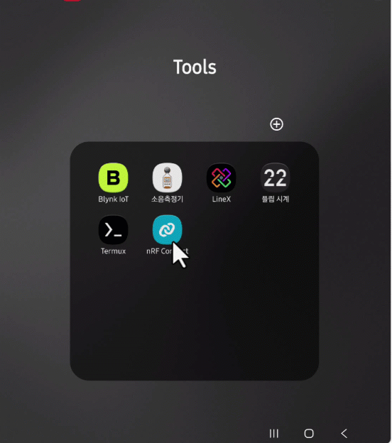
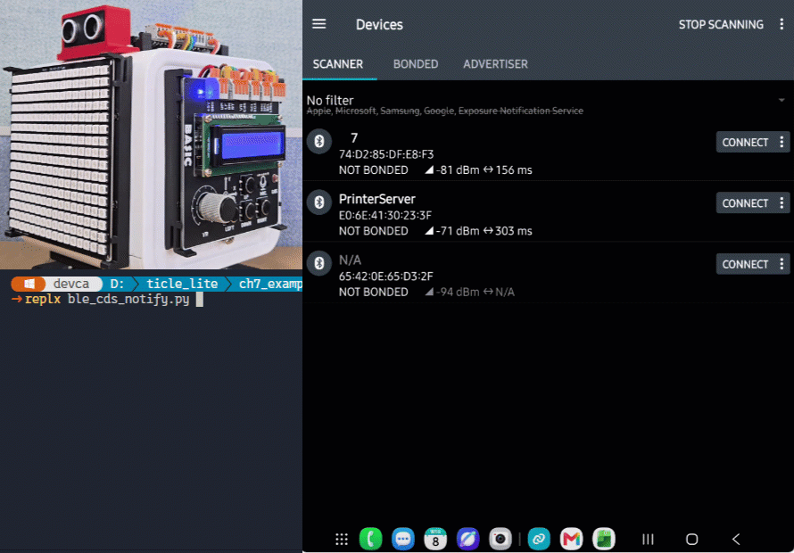
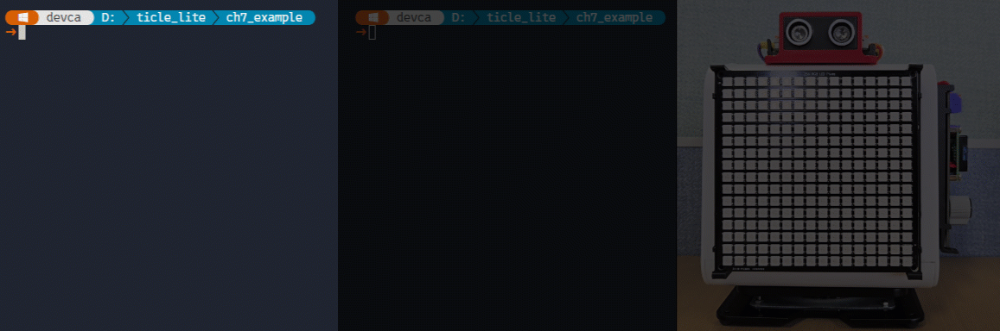
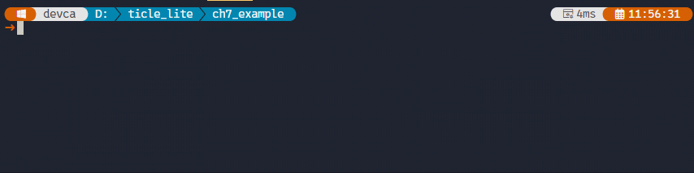
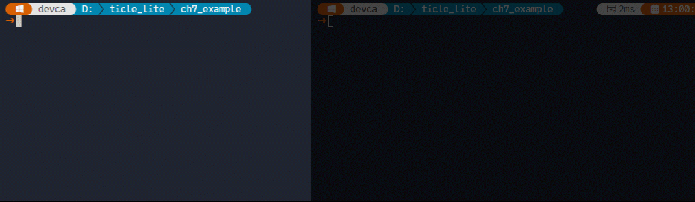
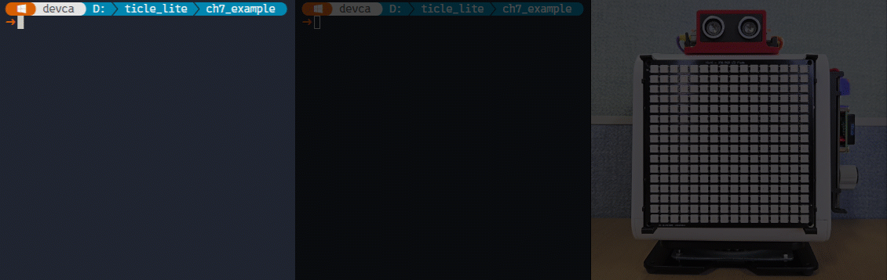

# 7. BLE와 GATT

## 개요

### 학습 목표

- BLE에서 Peripheral과 Central의 역할을 설명할 수 있다.
- GATT의 Service, Characteristic, Write, Notify 개념을 이해하고 활용할 수 있다.
- 스마트폰이나 태블릿에서 TiCLE Lite를 검색하고 연결할 수 있다.
- BLEServer와 BLEClient를 사용하여 BLE 기반 topic 메시지를 주고받을 수 있다.
- 3장과 4장에서 학습한 Matrix, Button, Ain, Servo를 BLE와 결합하여 로컬 원격 제어 시스템을 만들 수 있다.
- TiCLE Lite 두 대 이상을 BLE로 연결하여 근거리 협력 시스템을 구성할 수 있다.

### 이 장의 의미

6장에서 학습한 MQTT는 Wi-Fi와 브로커를 사용한다. 여러 장치가 동시에 데이터를 공유하기 쉽고, 실습실 전체 또는 원격 장소까지 확장하기에 적합하다. 그러나 MQTT를 사용하려면 Wi-Fi 연결과 브로커가 준비되어야 한다.

근거리 무선 통신 기술인 블루투스(Bluetooth) 표준 중 저전력/소량 데이터에 특화된 BLE(Bluetooth Low Energy)는 가까운 거리에서 스마트폰, 태블릿, 다른 TiCLE Lite와 직접 연결할 때 유용하다. 별도의 브로커가 필요하지 않으며, 사용자는 모바일 앱에서 주변 장치를 검색하고 연결할 수 있다. 이러한 특성 때문에 BLE는 로컬 설정, 간단한 리모컨, 스마트폰 기반 장치 제어에 많이 사용된다.

이 장에서는 BLE를 단순히 무선 연결 기능으로 보지 않는다. 3장과 4장에서 만든 센서와 액추에이터 프로그램을 스마트폰 또는 다른 TiCLE Lite와 연결하여, 손 안의 리모컨이나 근거리 협력 장치로 확장하는 방법을 다룬다.

---

## BLE와 GATT 기본 개념

> **풀고 싶은 문제**  
> Wi-Fi 브로커가 없어도 스마트폰이나 다른 보드와 데이터를 주고받을 수 있을까? 근거리 무선 기술인 BLE의 Peripheral과 Central 역할, 그리고 GATT를 통한 데이터 교환 방식을 학습한다.

### Peripheral과 Central

> **이 예제로 풀 문제**  
> 스마트폰과 TiCLE Lite 중 누가 먼저 광고하고 누가 먼저 연결을 시작해야 할까? 두 역할을 분리해 BLE 연결 시작 지점을 명확히 한다.


BLE 연결에는 두 가지 역할이 있다.

| 역할 | 의미 | 예 |
| ---- | ---- | -- |
| Peripheral | 자신을 광고하고 연결을 기다리는 장치 | TiCLE Lite |
| Central | 주변 BLE 장치를 검색하고 연결을 시작하는 장치 | 스마트폰, 태블릿, 다른 TiCLE Lite |

Peripheral은 자신의 이름과 서비스 정보를 주변에 알린다. 이 과정을 광고(Advertising)라고 한다. Central은 주변의 광고 신호를 스캔하여 장치를 찾고, 원하는 장치에 연결 요청을 보낸다.

스마트폰으로 TiCLE Lite를 제어할 때는 일반적으로 TiCLE Lite가 Peripheral이고 스마트폰이 Central이다. TiCLE Lite 두 대를 연결할 때는 한 대가 Peripheral, 다른 한 대가 Central 역할을 맡는다.

### GAP와 GATT

> **이 예제로 풀 문제**  
> 장치를 찾는 단계와 데이터를 주고받는 단계를 섞어 이해하면 디버깅이 어려워진다. GAP와 GATT를 분리해 연결 문제와 데이터 문제를 나눠 해결한다.


BLE 통신은 두 단계로 구분할 수 있다. 첫 번째 단계는 장치를 찾고 연결하는 것이고, 두 번째 단계는 연결된 뒤 데이터를 주고받는 것이다. 이 두 단계를 각각 담당하는 표준이 GAP와 GATT이다.

GAP(Generic Access Profile)는 광고, 스캔, 연결 과정을 정의한다. Peripheral이 이름과 서비스 정보를 담은 광고 패킷을 주기적으로 내보내고, Central이 이를 수신해 연결 요청을 보내는 것이 GAP의 역할이다.

GAP로 연결이 완료되면 두 장치는 GATT(Generic Attribute Profile)를 통해 실제 데이터를 주고받는다. GATT는 데이터를 Profile, Service, Characteristic이라는 3단계 계층으로 정리한다.

| 요소 | 의미 |
| ---- | ---- |
| Profile | 장치의 전체적인 역할과 정체성을 정의한다 |
| Service | 관련 기능을 묶은 단위. 하나의 Profile은 여러 Service를 가질 수 있다 |
| Characteristic | 실제 데이터를 읽고 쓰거나 알림으로 받는 채널 |

Characteristic에서 사용할 수 있는 동작은 다음 세 가지이다.

| 동작 | 방향 | 의미 |
| ---- | ---- | ---- |
| Read | Central <- Peripheral | Central이 Peripheral에서 데이터를 읽는다 |
| Write | Central -> Peripheral | Central이 Peripheral로 데이터를 보낸다 |
| Notify | Central <- Peripheral | Peripheral이 값이 바뀌면 Central에 자동으로 알린다 |

각 Service와 Characteristic은 서로를 구분하기 위해 UUID(Universally Unique Identifier)를 가진다. UUID에는 두 종류가 있다.

- 표준 UUID(16비트): 블루투스 협회(SIG)에서 미리 정해 둔 공식 규격이다. 예를 들어 배터리 서비스는 0x180F, 심박수 서비스는 0x180D이다.
- 커스텀 UUID(128비트): 공식 규격에 없는 데이터를 주고받을 때 직접 정하는 긴 ID이다. 6E400001-B5A3-F393-E0A9-E50E24DCCA9E처럼 표기한다.

예를 들어 조명 제어 장치라면 하나의 Service 안에 색상 명령을 받는 Characteristic(Write)과 현재 상태를 알려 주는 Characteristic(Notify)이 있을 수 있다. 이 교재에서는 원시 GATT를 직접 다루는 대신, TiCLE Lite 라이브러리에서 제공하는 ble 모듈의 BLEServer와 BLEClient가 제공하는 단순화된 메시지 방식을 사용한다.

### BLEServer와 BLEClient

> **이 예제로 풀 문제**  
> 저수준 GATT를 직접 구현하면 초반 학습 부담이 크다. BLEServer/BLEClient의 topic 메시지 방식으로 핵심 통신 흐름을 먼저 완성한다.


MicroPython은 저수준 BLE 제어를 위한 bluetooth 모듈과 비동기 방식의 aioble 모듈을 기본 제공한다. 두 모듈 모두 GATT Service와 Characteristic을 직접 정의하고 UUID를 관리해야 하므로, BLE 구조를 충분히 이해하기 전에는 코드가 복잡해진다. 이 장에서는 TiCLE Lite 라이브러리의 ble 모듈이 제공하는 BLEServer와 BLEClient를 사용한다. 두 클래스는 GATT 설정을 내부에서 처리하고, 6장의 upaho와 비슷한 topic 메시지 방식을 제공한다.

BLEServer는 Peripheral 역할을 한다. 장치 이름을 광고하고 연결을 기다리며, 연결된 Central(스마트폰 또는 다른 TiCLE Lite)과 메시지를 주고받는다. 내부적으로 GATT Service와 Characteristic을 만들고, 문자열 메시지를 다음 형식으로 주고받는다.

```
topic:payload
```

예를 들어 스마트폰에서 cmd/pixel:red를 Write하면 TiCLE Lite는 이를 topic cmd/pixel, payload red로 처리한다. 반대로 TiCLE Lite가 sensor/cds:72.5를 publish하면 스마트폰은 Notify로 이 문자열을 받는다.

BLEClient는 Central 역할을 한다. 주변 BLEServer 장치를 스캔한 뒤 이름 또는 주소로 연결하고, BLEServer와 같은 topic 메시지 형식으로 통신한다. TiCLE Lite 두 대를 연결할 때 한 대에는 BLEServer를, 다른 한 대에는 BLEClient를 사용한다.

최근 BLEClient 구현은 실습 중 자주 보이던 연결 실패를 줄이도록 개선되었다. 같은 이름의 장치가 여러 개 발견되면 RSSI가 가장 강한 장치를 우선 선택하고, 연결 직후 서비스 탐색에서 일시적으로 `Service not found`가 발생하면 짧은 대기 후 자동으로 재시도한다. 또한 publish는 빠른 반복 전송에서 `EALREADY`를 줄이기 위해 응답 대기형 쓰기 대신 명령형 쓰기(Write Command)를 사용한다.

이 구조는 MQTT의 토픽 방식과 비슷하다. MQTT 예제를 이해한 뒤에는 BLE 예제도 같은 방식으로 읽을 수 있다. 차이는 메시지 경로가 Wi-Fi와 브로커를 통과하지 않고 BLE 직접 연결을 통과한다는 점이다.

---

## 실습 준비

> **풀고 싶은 문제**  
> BLE 실습은 장치 이름, 앱, UUID, 연결 순서가 조금만 어긋나도 실패한다. 본격 실습 전에 연결 환경을 표준화해 시행착오를 줄인다.


### nRF Connect 설치

> **이 예제로 풀 문제**  
> 코드를 바꾸기 전에 스마트폰에서 광고, 연결, 특성 쓰기/알림이 되는지 먼저 확인하면 문제 원인 분리가 쉬워진다. nRF Connect를 실습 기준 도구로 준비한다.


BLE 동작을 확인하려면 스마트폰 또는 태블릿에 BLE GATT 테스트 앱이 필요하다. 이 교재에서는 nRF Connect for Mobile을 기준으로 설명한다.

| 플랫폼 | 앱 |
| ------ | -- |
| Android | nRF Connect for Mobile |
| iOS | nRF Connect for Mobile |

실습 순서는 다음과 같다.

1. TiCLE Lite에서 BLE 예제를 실행한다.
2. nRF Connect에서 Scan을 눌러 주변 BLE 장치를 검색한다.
3. 예제에서 지정한 장치 이름을 선택하고 Connect한다.
4. Service 안의 Characteristic에서 Write 또는 Notify를 사용한다.

BLEServer의 service_uuid와 char_uuid 매개변수에는 기본값이 지정되어 있다.

```python
BLEServer(name, *, service_uuid="12345678-0000-0000-0000-000000000010",
                   char_uuid="12345678-0000-0000-0000-000000000011", ...)
```

매개변수를 따로 지정하지 않으면 아래 UUID가 사용된다.

| 항목 | 기본 UUID |
| ---- | --------- |
| Service | 12345678-0000-0000-0000-000000000010 |
| Characteristic | 12345678-0000-0000-0000-000000000011 |

nRF Connect에서 연결하면 Unknown Service와 그 아래 Unknown Characteristic이 이 UUID로 표시된다. 교재의 모든 예제는 기본값을 그대로 사용하므로 UUID를 따로 외울 필요는 없다. 목록에서 해당 UUID의 Characteristic을 선택하면 된다.

같은 실습 공간에 여러 보드가 동시에 BLEServer를 실행해도 UUID는 모두 같아도 된다. BLE 연결은 장치의 MAC 주소(보드 고유 하드웨어 주소)를 기준으로 이루어지고, UUID는 연결된 이후 그 연결 안에서 Service와 Characteristic을 식별하는 용도이기 때문이다. 20명이 같은 UUID를 사용해도 각자의 스마트폰은 자신이 연결한 보드 안에서만 UUID를 참조하므로 충돌이 없다.

장치 이름은 가능하면 고유하게 정하는 편이 좋다. 현재 BLEClient는 같은 이름을 사용하는 장치가 여러 개 보이면 RSSI가 가장 강한 장치를 우선 선택하고, 경고 메시지를 출력한다. 그래도 의도한 보드와 다른 장치가 선택될 수 있으므로, 같은 강의실처럼 장치가 많은 환경에서는 이름 뒤에 자리 번호를 붙이거나 주소(addr)로 직접 연결하는 방식을 권장한다. 스마트폰 앱(nRF Connect)에서도 같은 이름이 여러 개 보이면 장치를 구분하기 어렵기 때문에 이름 규칙을 미리 정해 두면 실습이 훨씬 안정적이다.

여러 명이 함께 실습할 때는 장치 이름에 자리 번호(학교라면 학번)를 붙이는 방식을 권장한다. 예를 들어 자리 번호가 5번이라면 다음과 같이 지정한다.

```python
server = BLEServer("TiCLE-Pixel-05")   # BLEServer 쪽
client.connect("TiCLE-Pixel-05", retries=2)  # BLEClient 쪽도 같은 이름 사용
```

스캔 결과에서 addr를 확인했다면 이름 대신 주소로 연결할 수도 있다.

```python
client.connect("aa:bb:cc:dd:ee:ff", retries=2)  # 예시 주소
```

공개 제품을 만들거나 실습 구역이 물리적으로 분리된 환경에서는 UUID까지 고유하게 바꾸는 것이 좋다. 이 경우 BLEClient도 BLEServer와 동일한 UUID를 사용해야 한다.

```python
MY_SVC  = "ABCDEF01-0000-0000-0000-000000000010"
MY_CHAR = "ABCDEF01-0000-0000-0000-000000000011"

server = BLEServer("TiCLE-BLE", service_uuid=MY_SVC, char_uuid=MY_CHAR)
client = BLEClient(service_uuid=MY_SVC, char_uuid=MY_CHAR)
```

---

## 스마트폰에 TiCLE Lite 이름 띄우기

> **풀고 싶은 문제**  
> 스마트폰 주변 기기 목록에 TiCLE Lite가 직접 나타나게 할 수 있을까. 데이터 제어를 시작하기 전에, 보드가 자신의 이름을 주변에 알리고 스마트폰이 이를 발견하는 과정을 확인한다.

```python
# ble_advertise.py
import time
from ble import BLEServer

server = BLEServer("TiCLE-BLE")

def on_connect(handle):
    print("connected:", handle)

def on_disconnect(handle):
    print("disconnected:", handle)

server.on_connect = on_connect
server.on_disconnect = on_disconnect

try:
    print("Scan and connect to TiCLE-BLE in nRF Connect.")
    while True:
        server.publish("status", "alive", retain=True)
        time.sleep_ms(1000)
finally:
    server.deinit()
```

**코드 해설**

BLEServer("TiCLE-BLE")는 TiCLE Lite를 TiCLE-BLE이라는 이름으로 광고한다. 장치 이름은 광고 패킷이 아닌 스캔 응답 패킷에 담기므로, nRF Connect처럼 능동 스캔을 수행하는 앱에서는 이름이 목록에 표시된다.

on_connect와 on_disconnect는 연결 상태를 확인하기 위한 콜백이다. BLE 연결은 사용자가 스마트폰에서 연결을 끊거나 장치가 멀어지면 언제든 끊어질 수 있으므로, 연결과 해제 상태를 출력해 두면 실습 중 문제를 파악하기 쉽다.

**실행 결과와 확인할 점**

nRF Connect에서 Scan을 실행하면 TiCLE-BLE이라는 장치 이름이 목록에 나타난다. 연결하면 터미널에 connected 메시지가 출력되고, 연결을 끊으면 disconnected 메시지가 출력된다. 장치가 보이지 않으면 이전에 실행 중이던 BLE 프로그램이 남아 있지 않은지, 보드가 재시작되었는지 확인한다.

</br>

**한 걸음 더**

장치 이름을 자신의 이름이나 팀 이름이 들어가도록 바꾸어 본다. 여러 보드가 동시에 광고할 때 이름을 다르게 지정하면 어떤 보드에 연결해야 하는지 쉽게 구분할 수 있다.

---

## 스마트폰 색상 팔레트

> **풀고 싶은 문제**  
> 스마트폰을 색상 팔레트처럼 사용하여 TiCLE Lite Matrix의 색을 바꿀 수 있을까. GATT의 Write 동작을 사용하여 Central에서 Peripheral로 명령을 전달한다.

nRF Connect에서 TiCLE-BLE-Pixel에 연결한 뒤 Characteristic에 다음 문자열 중 하나를 UTF-8 Text로 Write한다.

```
cmd/pixel:red
cmd/pixel:green
cmd/pixel:blue
cmd/pixel:yellow
cmd/pixel:off
```

```python
# ble_pixel_control.py
import time
from ble import BLEServer
from ticle_lite.ws2812 import Matrix

COLORS = {
    "red": (180, 0, 0),
    "green": (0, 140, 0),
    "blue": (0, 0, 180),
    "yellow": (160, 110, 0),
    "off": (0, 0, 0),
}

matrix = Matrix(0, brightness=0.15)
server = BLEServer("TiCLE-BLE-Pixel")

def on_message(topic, payload):
    print(topic, payload)
    if topic == "cmd/pixel" and payload in COLORS:
        matrix.fill(COLORS[payload])
        matrix.update()

server.on_message = on_message
server.subscribe("cmd/#")

try:
    print("Write cmd/pixel:red in nRF Connect.")
    while True:
        time.sleep_ms(100)
finally:
    server.deinit()
    matrix.deinit()
```

**코드 해설**

server.subscribe("cmd/#")는 cmd/로 시작하는 메시지를 처리하겠다는 뜻이다. 스마트폰에서 cmd/pixel:red를 Write하면 on_message("cmd/pixel", "red")가 호출된다.

Matrix 제어 코드는 MQTT 예제와 거의 같다. 통신 경로만 Wi-Fi/MQTT에서 BLE/GATT로 바뀌었다. 이처럼 제어 로직과 통신 로직을 분리해서 생각하면 새로운 통신 방식을 배울 때도 기존 장치 제어 지식을 재사용할 수 있다.

**실행 결과와 확인할 점**

nRF Connect에서 TiCLE-BLE-Pixel을 찾아 연결한 후 Client 탭에서 Unknown Service 아래에 있는 Characteristic을 펼친다.

Characteristic 우측에 위쪽 화살표(↑) 아이콘이 Write 버튼이다. 누르면 값 입력 대화상자가  열린다. 형식은 UTF-8을 선택하고 New Value 입력란에 cmd/pixel:red를 입력한 후 SEND를 누르면 Matrix가 빨간색으로 바뀐다. green, blue, yellow, off도 같은 방식으로 확인한다. Write 형식을 UTF-8 Text로 선택했는지, 콜론 앞뒤의 topic과 payload가 정확한지 확인하는 것이 중요하다.

</br>

**한 걸음 더**

색 이름 대신 brightness:0.05, brightness:0.20 같은 명령을 추가해 본다. 같은 Characteristic으로 색과 밝기를 모두 제어하려면 topic을 cmd/pixel과 cmd/brightness처럼 나누어 해석하면 된다.

---

## 스마트폰 조도계

> **풀고 싶은 문제**  
> 스마트폰 화면을 TiCLE Lite의 조도계 표시창으로 사용할 수 있을까. Peripheral에서 Central로 데이터를 보내는 Notify를 사용하여 CdS 값을 실시간으로 확인한다.

nRF Connect에서 TiCLE-BLE-CdS에 연결한 뒤 Characteristic의 Notify 버튼을 켠다.

```python
# ble_cds_notify.py
import time
from ble import BLEServer
from ticle_lite.ain import Ain

cds = Ain(28, bits=12)  # GP28: CdS, 12-bit ADC
server = BLEServer("TiCLE-BLE-CdS")

try:
    print("Connect and enable Notify in nRF Connect.")
    while True:
        cds_percent = cds.read_percent()
        server.publish("sensor/cds", f"{cds_percent:.1f}")
        print(f"CdS:{cds_percent:.1f}%")
        time.sleep_ms(500)
finally:
    server.deinit()
    cds.deinit()
```

실행 결과는 다음과 같다.

</br>

**코드 해설**

server.publish("sensor/cds", "...")는 연결된 스마트폰으로 sensor/cds:값 형식의 Notify를 보낸다.

BLE는 가까운 거리에서 짧은 메시지를 주고받는 데 적합하다. 센서값을 너무 빠르게 보내면 스마트폰 앱이나 BLE 스택이 처리하지 못할 수 있으므로, 처음에는 500ms 정도의 간격으로 확인한다.

**실행 결과와 확인할 점**

nRF Connect에서 TiCLE-BLE-CdS를 찾아 연결한 후 Client 탭에서 Unknown Service 아래에 있는 Characteristic을 펼치면, Value 항목에 'sensor/cds:값' 형식의 문자열이 반복해서 표시된다. CdS를 손으로 가리면 값이 변해야 한다.

**한 걸음 더**

CdS 값이 일정 기준보다 낮을 때만 Notify를 보내도록 바꾸어 본다. 모든 값을 계속 보내는 방식과 의미 있는 변화만 보내는 방식의 차이를 비교하면, 무선 통신에서 데이터 양을 줄이는 이유를 이해할 수 있다.

---

## 스마트폰 무드 램프

> **풀고 싶은 문제**  
> 스마트폰을 리모컨처럼 사용하여 작은 무드 램프의 색상과 움직임을 조절할 수 있을까. 스마트폰(또는 PC)에서 색상과 Servo 각도를 보내고, TiCLE Lite는 VR/CdS/버튼 상태를 다시 알려 준다.

| 방향 | topic | payload | Characteristic |
| ---- | ----- | ------- | -------------- |
| 스마트폰 -> TiCLE Lite | cmd/pixel | red, green, blue, yellow, off | Char 0 |
| 스마트폰 -> TiCLE Lite | cmd/servo | 0~180 | Char 0 |
| TiCLE Lite -> 스마트폰 | sensor/vr | VR 퍼센트 | Char 1 |
| TiCLE Lite -> 스마트폰 | sensor/cds | CdS 퍼센트 | Char 2 |
| TiCLE Lite -> 스마트폰 | input/button | UP, LEFT, DOWN, RIGHT | Char 3 |

nRF Connect에서 Char 0에는 Write로 cmd/pixel:red 또는 cmd/servo:90을 보내고, Char 1, Char 2, Char 3에는 각각 Notify를 켠다.

```python
# ble_mood_lamp.py
import time
from ble import BLEServer
from ticle_lite.ain import Ain
from ticle_lite.button import Button
from ticle_lite.ws2812 import Matrix
from ticle_lite.servo import Servo

COLORS = {
    "red": (180, 0, 0),
    "green": (0, 140, 0),
    "blue": (0, 0, 180),
    "yellow": (160, 110, 0),
    "off": (0, 0, 0),
}
BTN_NAMES = ["UP", "LEFT", "DOWN", "RIGHT"]

ain = Ain([27, 28] , bits=12)  # GP27: VR, GP28: CdS 12-bit ADC
btn = Button([16, 17, 18, 19])
matrix = Matrix(0, brightness=0.15)
servo = Servo(1)

server = BLEServer("TiCLE-Mood",
    char_uuids=[
        "12345678-0000-0000-0000-000000000011",  # char 0: command recv(Write)
        "12345678-0000-0000-0000-000000000012",  # char 1: VR sensor notify (Notify)
        "12345678-0000-0000-0000-000000000013",  # char 2: CdS sensor notify (Notify)
        "12345678-0000-0000-0000-000000000014",  # char 3: button notify (Notify)
    ],
    char_flags=[
        BLEServer.FLAG_WRITE,           # char 0: command recv only
        BLEServer.FLAG_NOTIFY,          # char 1: VR sensor notify only
        BLEServer.FLAG_NOTIFY,          # char 2: CdS sensor notify only
        BLEServer.FLAG_NOTIFY,          # char 3: button notify only
    ],
)

def on_message(topic, payload):
    if topic == "cmd/pixel" and payload in COLORS:
        matrix.fill(COLORS[payload])
        matrix.update()
        print("pixel:", payload)

    elif topic == "cmd/servo":
        try:
            angle = max(0, min(180, int(payload)))
            servo.move_to(angle, ms=300, easing="quad")
            print("servo:", angle)
        except ValueError:
            print("invalid angle:", payload)

server.on_message = on_message
server.subscribe("cmd/#")

next_sensor = time.ticks_ms()
SENSOR_MS = 500

try:
    print("Connect to TiCLE-Mood and enable Notify.")
    while True:
        for idx in btn.update(Button.PRESS):
            server.publish("input/button", BTN_NAMES[idx], char=3)
            print("button:", BTN_NAMES[idx])

        now = time.ticks_ms()
        if time.ticks_diff(now, next_sensor) >= 0:
            next_sensor = time.ticks_add(now, SENSOR_MS)
            server.publish("sensor/vr",  f"{ain[0].read_percent():.1f}", char=1)
            server.publish("sensor/cds", f"{ain[1].read_percent():.1f}", char=2)

        time.sleep_ms(20)
finally:
    server.deinit()
    ain.deinit()
    btn.deinit()
    servo.home()
    servo.wait()
    servo.deinit()
    matrix.deinit()
```

**코드 해설**

이 예제는 스마트폰과 TiCLE Lite 사이의 양방향 통신을 사용한다. 스마트폰은 Write로 명령을 보내고, TiCLE Lite는 Notify로 상태를 보낸다.

char_uuids=[...]에 UUID를 4개 넣으면 BLEServer가 같은 Service 안에 Characteristic을 4개 등록한다. char_flags=[...]로 Characteristic마다 속성을 다르게 지정한다. Char 0은 FLAG_WRITE만 갖고, Char 1/2/3은 FLAG_NOTIFY만 갖는다. 따라서 제어 명령은 Char 0으로 받고, VR/CdS/버튼 상태는 서로 다른 채널로 나누어 보낼 수 있다.

cmd/pixel과 cmd/servo는 수신 명령 토픽이다. sensor/vr, sensor/cds, input/button은 발행 토픽이다. 이처럼 제어 입력과 상태 출력을 분리하면 스마트폰과 PC 어느 쪽에서 붙어도 같은 메시지 규약으로 확장할 수 있다.

**실행 결과와 확인할 점**

nRF Connect에서 TiCLE-Mood에 연결하면 Unknown Service 아래에 Characteristic 4개가 표시된다. Char 0(UUID ...0011)에 Write로 cmd/pixel:red를 보내면 Matrix 색이 바뀌고, cmd/servo:90을 보내면 Servo가 이동한다. Char 1(UUID ...0012)/Char 2(UUID ...0013)/Char 3(UUID ...0014)에 Notify를 켜면 sensor/vr:값, sensor/cds:값, input/button:버튼명이 각각 표시된다. Char 0은 Write 버튼만 보이고, Char 1~3은 Notify 버튼만 보인다.

</br>

**한 걸음 더**

VR 값이 일정 범위에 들어오면 TiCLE Lite가 스스로 추천 색상을 Notify하도록 바꾸어 본다. 스마트폰이 명령만 보내는 장치가 아니라, 보드가 판단한 상태를 보여 주는 화면이 될 수 있다.

---

## TiCLE Lite 두 대 연결하기

> **풀고 싶은 문제**  
> 스마트폰 없이 TiCLE Lite 한 대가 다른 TiCLE Lite에 직접 명령을 보낼 수 있을까. 한 보드는 BLEServer로 기다리고, 다른 보드는 BLEClient로 검색하여 연결한다.

BLEServer는 Peripheral로 연결을 기다린다. BLEClient는 Central로 주변을 스캔한 뒤 이름 또는 주소로 대상 장치를 지정해 연결하고, publish로 메시지를 보낸다. 연결 직후 서비스 탐색이 일시적으로 실패하면 설정한 횟수만큼 자동 재시도할 수 있다. 첫 번째 보드에는 앞에서 작성한 ble_pixel_control.py를 실행한다. 두 번째 보드에는 아래 코드를 실행한다.

```python
# ble_node_send.py
import time
from ble import BLEClient

SERVER_NAME = "TiCLE-BLE-Pixel"
client = BLEClient(
    service_uuid="12345678-0000-0000-0000-000000000010",
    char_uuid="12345678-0000-0000-0000-000000000011",
)
target = SERVER_NAME

print(f"Searching for {SERVER_NAME}...")
devices = client.scan(duration_ms=3000)
for dev in devices:
    if dev["name"] == SERVER_NAME:
        print(f"   >>> Found: {dev['name']} {dev['rssi']}dBm {dev['addr']}")
        # If a name conflict occurs, connect by fixing the address instead of the name.
        # target = dev["addr"]
        break
else:
    raise RuntimeError(f"{SERVER_NAME} not found")

print("Connecting...")
if not client.connect(target, timeout_ms=6000, retries=2):
    raise RuntimeError(f"Error connecting to {target}")
print("   >>> Connected")

print("Starting color sequence...")
try:
    colors = ["red", "green", "blue", "yellow", "off"]
    while True:
        for color in colors:
            client.publish("cmd/pixel", color)
            print("   >>> sent:", color)
            time.sleep_ms(100)
finally:
    client.deinit()
```

**코드 해설**

client.scan(duration_ms=3000)은 3초 동안 주변 BLE 장치를 스캔하고, 발견한 장치 목록을 반환한다. 각 항목에는 name, rssi, addr가 담겨 있다. 같은 이름을 사용하는 장치가 많은 환경에서는 이름 대신 addr를 target으로 지정해 오접속을 줄일 수 있다.

client.connect(target, timeout_ms=6000, retries=2)는 이름 또는 주소로 연결을 시도한다. 연결 직후 서비스 탐색이 일시적으로 실패하면 내부적으로 재시도한다. 그래도 실패한다면 서버 보드의 UUID 설정 또는 광고 상태를 점검해야 한다.

publish("cmd/pixel", color)는 BLEServer와 같은 형식으로 메시지를 보낸다. 현재 구현은 빠른 반복 전송에서 충돌을 줄이도록 명령형 쓰기(Write Command)를 사용하므로, 짧은 주기에서도 전송 안정성이 높다. BLEServer 쪽에서는 on_message("cmd/pixel", "red")가 그대로 호출된다.

**실행 결과와 확인할 점**

두 번째 보드 터미널에 스캔 결과와 sent: red, sent: green 메시지가 출력되고, 첫 번째 보드의 Matrix 색이 차례로 바뀐다. 스캔 목록에 TiCLE-BLE-Pixel이 나타나지 않으면 첫 번째 보드가 정상 실행 중인지 확인한다.

간헐적으로 연결 직후 서비스 탐색 실패가 나타나도 자동 재시도 후 연결될 수 있다. 재시도 후에도 실패가 반복되면 서버와 클라이언트의 service_uuid/char_uuid가 같은지, 그리고 실습 공간에 동일한 이름의 장치가 없는지 먼저 확인한다.

</br>

**한 걸음 더**

client.scan() 결과에서 rssi 값을 확인해 본다. 두 보드의 거리를 바꾸면 값이 달라진다. RSSI는 수신 신호 강도이며 0에 가까울수록 신호가 강하다.

---

## PC에서 파이썬으로 BLE 사용하기

> **풀고 싶은 문제**  
> nRF Connect는 Characteristic에 직접 Write하거나 Notify를 눈으로 읽기에 좋다. 그러나 조건에 따라 자동으로 명령을 보내거나 수신한 데이터를 분석해 다른 동작을 유발하려면, PC 파이썬 프로그램이 필요하다. PC 파이썬이 nRF Connect의 역할을 대신할 수 있을까?

TiCLE Lite에서 BLEClient를 사용하면 다른 TiCLE Lite에 연결할 수 있다. PC에서는 bleak 라이브러리를 사용하면 같은 역할을 할 수 있다. bleak은 Windows, macOS, Linux에서 동작하는 비동기 BLE 라이브러리이다.

아래 표는 두 라이브러리의 주요 기능을 비교한 것이다.

| 기능 | BLEClient (TiCLE Lite) | bleak (PC) |
| ---- | -------------------- | ---------- |
| 주변 장치 스캔 | client.scan(duration_ms) | BleakScanner.discover(timeout) |
| 장치 연결 | client.connect(name 또는 addr, retries=...) | BleakClient(address) |
| 데이터 쓰기 | client.publish(topic, payload) | client.write_gatt_char(uuid, data) |
| 알림 수신 등록 | client.subscribe(topic) + on_message | client.start_notify(uuid, callback) |
| 비동기 방식 | 동기식 (while 반복문) | asyncio 기반 비동기 |

메시지 형식은 BLEServer와 동일하다. bleak에서 Write할 때는 "topic:payload" 문자열을 UTF-8로 인코딩해 전송하고, Notify를 받을 때는 수신 바이트를 디코딩해 topic과 payload로 분리한다.

### bleak 설치

> **이 예제로 풀 문제**  
> PC에서도 BLE 장치를 스캔하고 제어하려면 표준 라이브러리만으로는 기능이 부족하다. bleak와 rich를 설치해 파이썬 기반 BLE 실습 환경을 만든다.


PC 터미널에서 다음 명령으로 설치한다.

```sh
pip install bleak rich
```

</br>


설치가 완료되면 파이썬 파일에서 from bleak import BleakScanner, BleakClient와 from rich.console import Console 등으로 가져올 수 있다.

bleak은 비동기 라이브러리이므로 async def로 정의한 함수 안에서 await와 함께 사용하며, asyncio.run()으로 실행한다. rich는 터미널 출력을 색상/표/스피너 등으로 시각화하는 라이브러리로, bleak와 함께 사용하면 스캔 결과를 읽기 좋은 형태로 출력할 수 있다.

### BLE 장치 스캔하기

> **이 예제로 풀 문제**  
> 주변 장치가 많은 환경에서 내 보드를 정확히 찾지 못하면 이후 제어가 모두 빗나간다. 이름과 주소를 기준으로 대상 장치를 식별한다.

MQTT에서는 브로커 주소를 미리 알고 있으면 바로 연결한다. BLE는 연결 전 먼저 주변 장치를 스캔해 주소를 확인해야 한다. nRF Connect의 Scan 기능과 같은 역할이다.

TiCLE Lite에서 ble_advertise.py를 실행하거나 BLEServer를 사용하는 예제를 실행한 상태에서, PC에서 아래 스크립트를 실행하면 주변 BLE 장치 목록을 볼 수 있다. 

목록은 좀 더 보기 좋고, 읽기 쉽도록 터미널에 색상과 스타일을 적용한 서식 있는 텍스트를 작성하고, 표, 마크다운, 구문 강조 코드와 같은 고급 콘텐츠 표시를 지원하는 rich 모듈을 이용한다.

```python
# pc_ble_scan_rich.py
import asyncio
from bleak import BleakScanner
from rich.console import Console
from rich.table import Table

async def main():
    console = Console()
    
    # 1. Start scanning with a loading spinner
    with console.status("[bold cyan]Scanning for BLE devices...", spinner="dots"):
        found = await BleakScanner.discover(timeout=5.0, return_adv=True)
    
    # Sort devices by RSSI in descending order
    results = sorted(found.values(), key=lambda x: x[1].rssi or -100, reverse=True)
    
    # 2. Initialize the visual table
    table = Table(title=f"\n[bold green]BLE Scan Results ({len(found)} devices found)[/]", title_justify="left")
    
    # Define table columns
    table.add_column("Device Name", style="magenta", no_wrap=True)
    table.add_column("MAC Address", style="cyan")
    table.add_column("RSSI", style="green", justify="right")
    table.add_column("TX Power", style="yellow", justify="right")

    # Populate the table with device data
    for device, adv in results:
        name = device.name or adv.local_name or "[italic dim](unknown)[/]"
        rssi = f"{adv.rssi} dBm" if adv.rssi else "N/A"
        tx_power = f"{adv.tx_power}dBm" if adv.tx_power is not None else "N/A"
        
        # Highlight RSSI based on signal strength
        if adv.rssi and adv.rssi >= -60:
            rssi_str = f"[bold green]{rssi}[/]"
        elif adv.rssi and adv.rssi <= -90:
            rssi_str = f"[dim red]{rssi}[/]"
        else:
            rssi_str = rssi

        table.add_row(name, device.address, rssi_str, tx_power)

    # 3. Print the finalized table to the console
    console.print(table)

if __name__ == "__main__":
    asyncio.run(main())
```

> <details>
> <summary><b>rich를 적용하지 않은 버전</b></summary>
>
>```python
># pc_ble_scan_simple.py
>import asyncio
>from bleak import BleakScanner
>
>async def main():
>    print("Scanning for BLE devices...")
>    found = await BleakScanner.discover(timeout=5.0, return_adv=True)
>    # found: {address: (BLEDevice, AdvertisementData)}
>    results = sorted(found.values(), key=lambda x: x[1].rssi or -100, reverse=True)
>
>    for device, adv in results:
>        name = device.name or adv.local_name or "(no name)"
>        print("{:25s}  {}  RSSI:{}".format(name, device.address, adv.rssi))
>    print("\nFound {} device(s)".format(len(found)))
>
>asyncio.run(main()) 
>```
>
> </details>
</br>

**코드 해설**

BleakScanner.discover(timeout=5.0, return_adv=True)는 5초 동안 주변 BLE 장치를 스캔하고, 주소를 키로 하는 딕셔너리를 반환한다. 각 값은 (BLEDevice, AdvertisementData) 쌍으로, BLEDevice에는 name과 address가, AdvertisementData에는 rssi와 local_name이 담겨 있다. 최신 bleak(0.20 이상)에서는 BLEDevice에서 rssi를 직접 읽을 수 없으므로 AdvertisementData.rssi를 사용해야 한다.

console.status(...)는 스캔이 진행되는 동안 터미널에 회전 스피너를 표시한다. 스캔이 끝나면 스피너가 사라지고 Table 인스턴스로 결과를 출력한다. RSSI가 -60 dBm 이상이면 초록색 굵은 글씨, -90 dBm 이하이면 어두운 빨간색으로 표시해 신호 강도를 한눈에 구분할 수 있다. tx_power는 장치가 광고 패킷에 포함한 송신 전력으로, 지원하지 않는 장치는 None이므로 N/A로 처리했다.

결과를 RSSI 내림차순으로 정렬하므로 가장 가까운 장치가 표 맨 위에 표시된다.

**실행 결과와 확인할 점**

TiCLE Lite에서 BLEServer를 실행한 상태에서 이 스크립트를 실행하면 스캔 중에 스피너가 표시되다가, 완료 후 이름/주소/RSSI/TX Power 열로 구성된 표가 출력된다. RSSI 열이 초록색으로 표시된 장치가 가장 신호가 강한 장치이다. 장치 이름이 보이지 않으면 TiCLE Lite의 BLEServer 예제가 정상 실행 중인지 확인한다.

</br>

**한 걸음 더**

timeout 값을 3.0으로 줄이거나 10.0으로 늘려 보고 스캔 결과에 차이가 있는지 확인한다. 표에 Manufacturer Data 열을 추가해 adv.manufacturer_data를 출력하면 장치 제조사 정보도 확인할 수 있다.


### PC에서 색상 명령 보내기

> **이 예제로 풀 문제**  
> 스마트폰 앱이 아니라 PC 스크립트에서도 동일한 명령 프로토콜로 보드를 제어할 수 있어야 자동화가 가능하다. 색상 명령 전송 경로를 PC로 확장한다.


앞에서 nRF Connect로 cmd/pixel:red를 Write하던 동작을 PC 파이썬 스크립트로 대신한다. TiCLE Lite에서 ble_pixel_control.py를 실행한 상태에서 아래 스크립트를 실행한다.

| 장치 | 역할 |
| ---- | ---- |
| TiCLE Lite | ble_pixel_control.py 실행 — cmd/# 구독, 명령에 따라 픽셀 색 변경 |
| PC Python | TiCLE-BLE-Pixel을 검색하여 연결하고, 색상 명령을 2초 간격으로 순서대로 Write |

```python
# pc_ble_pixel.py
import asyncio
from bleak import BleakScanner, BleakClient

CHAR_UUID   = "12345678-0000-0000-0000-000000000011"
TARGET_NAME = "TiCLE-BLE-Pixel"
COLORS      = ["red", "green", "blue", "yellow", "off"]

async def find_device(name, timeout=5.0):
    found = await BleakScanner.discover(timeout=timeout, return_adv=True)
    matches = []
    for device, adv in found.values():
        dev_name = device.name or adv.local_name
        if dev_name == name:
            matches.append((device, adv))

    if not matches:
        return None, None

    matches.sort(key=lambda x: x[1].rssi if x[1].rssi is not None else -100, reverse=True)
    return matches[0]

async def main():
    print("Scanning for {}...".format(TARGET_NAME))
    device, adv = await find_device(TARGET_NAME)
    if device is None:
        print("{} not found".format(TARGET_NAME))
        return

    rssi_text = "{} dBm".format(adv.rssi) if adv and adv.rssi is not None else "N/A"
    print("Found: {}  RSSI:{}".format(device.address, rssi_text))
    async with BleakClient(device.address) as client:
        for color in COLORS:
            msg = "cmd/pixel:{}".format(color).encode()
            await client.write_gatt_char(CHAR_UUID, msg, response=False)
            print("sent:", color)
            await asyncio.sleep(2.0)

asyncio.run(main())
```

**코드 해설**

bleak은 스캔, 연결, Write, Notify 모두 완료까지 시간이 걸리는 작업이다. 파이썬에서 이런 작업을 기다리는 동안 다른 코드가 실행될 수 있도록 async/await를 사용한다. main()을 async def로 정의하고 asyncio.run()으로 실행하는 것이 bleak 프로그램의 기본 구조이다.

find_device()는 BleakScanner.discover(timeout=..., return_adv=True)를 사용해 스캔 결과를 (BLEDevice, AdvertisementData) 형태로 받는다. 이름이 같은 장치가 여러 개이면 RSSI가 가장 강한 장치를 우선 선택한다. 이름이 일치하는 장치가 없으면 (None, None)을 반환하므로, 연결 시도 전에 반드시 device가 None인지 확인해야 한다.

최신 bleak(0.20 이상)에서는 BLEDevice에 rssi 속성이 없으므로 device.rssi 대신 adv.rssi를 사용한다.

async with BleakClient(device.address) as client는 연결을 열고 블록이 끝나면 자동으로 연결을 닫는다. finally에서 disconnect()를 따로 호출할 필요가 없다.

write_gatt_char(uuid, data)에는 bytes를 전달해야 하므로 문자열에 encode()를 붙인다. response=False는 Write Without Response 방식으로, 전송 후 TiCLE Lite의 확인 응답을 기다리지 않는다. 단방향 명령처럼 응답이 필요 없는 경우에 적합하며, 응답을 기다리는 시간이 없으므로 처리가 빠르다. BLEServer의 Characteristic UUID는 12345678-0000-0000-0000-000000000011이다. nRF Connect에서 같은 UUID를 선택해 Write하던 것과 동일한 대상이다.

**실행 결과와 확인할 점**

TiCLE Lite의 Pixel Display 보드가 red -> green -> blue -> yellow -> off 순서로 2초 간격으로 바뀐다. RSSI 값이 −80 dBm 이하이면 신호가 약해 Write가 실패하거나 느릴 수 있다. 보드에 가까이 있는지 확인한다.

</br>

> **한 걸음 더**  
> for 루프 대신 input()을 사용해 터미널에서 색상 이름을 직접 입력하는 방식으로 바꾸어 본다. PC 터미널이 텍스트 기반 BLE 리모컨이 된다.

### PC에서 센서값 받기

> **이 예제로 풀 문제**  
> 원격 제어뿐 아니라 상태 모니터링까지 하려면 Notify 데이터를 PC에서 안정적으로 받아야 한다. 센서값 수신 루프를 구성해 실시간 관찰 경로를 만든다.

이번에는 TiCLE Lite가 Notify로 보내는 CdS 값을 PC에서 수신한다. nRF Connect에서 Notify 버튼을 켜던 동작을 start_notify로 대신한다. TiCLE Lite에서 ble_cds_notify.py를 실행한 상태에서 아래 스크립트를 실행한다.

| 장치 | 역할 |
| ---- | ---- |
| TiCLE Lite | ble_cds_notify.py 실행 — sensor/cds를 500ms마다 Notify |
| PC Python | TiCLE-BLE-CdS를 검색해 연결하고, Notify를 수신해 출력 |

```python
# pc_ble_cds.py
import asyncio
from bleak import BleakScanner, BleakClient
from rich.console import Console
from rich.table import Table
from rich.live import Live
from rich.panel import Panel
from rich.progress import ProgressBar  # Added for rendering the bar chart

CHAR_UUID = "12345678-0000-0000-0000-000000000011"
TARGET_NAME = "TiCLE-BLE-CdS"

console = Console()

# Global variables for live UI updates
latest_topic = "N/A"
latest_payload = 0.0  # Changed to float for tracking numeric values
data_count = 0

def on_notification(sender, data):
    global latest_topic, latest_payload, data_count
    try:
        msg = data.decode().strip()
        if ":" in msg:
            topic, payload = msg.split(":", 1)
            latest_topic = topic.strip()
            # Convert payload to float, default to 0.0 if conversion fails
            latest_payload = float(payload.strip())
            data_count += 1
    except Exception as e:
        latest_topic = "Error"
        latest_payload = 0.0

async def find_device(name, timeout=5.0):
    with console.status(f"[bold cyan]Scanning for target device: '{name}'...", spinner="dots"):
        found = await BleakScanner.discover(timeout=timeout, return_adv=True)
    
    matches = []
    for device, adv in found.values():
        dev_name = device.name or adv.local_name
        if dev_name == name:
            matches.append((device, adv))

    if not matches:
        return None, None

    matches.sort(key=lambda x: x[1].rssi if x[1].rssi is not None else -100, reverse=True)
    return matches[0]

def generate_dashboard():
    """Generates a live grid layout table including a visual progress bar."""
    table = Table(show_header=False, box=None, padding=(0, 2))
    
    # 1. Generate the visual progress bar based on the 0.0 ~ 100.0 range
    # total=100 sets the upper bound of the bar
    bar = ProgressBar(total=100.0, completed=latest_payload, width=30, pulse=False)
    
    # Dynamic color styling depending on the intensity of the value
    if latest_payload < 30.0:
        val_color = "bright_green"
    elif latest_payload < 70.0:
        val_color = "bright_yellow"
    else:
        val_color = "bright_red"

    # 2. Add rows to the layout table
    table.add_row("[bold magenta]Topic:[/]", f"[bold white]{latest_topic}[/]")
    table.add_row(
        "[bold cyan]Payload:[/]", 
        f"[{val_color}]{latest_payload:>5.1f}[/]  ", 
        bar  # The ProgressBar object is placed directly into the table cell
    )
    table.add_row("[bold yellow]Total Packets:[/]", f"[dim]{data_count}[/]")
    
    return Panel(
        table, 
        title=f"[bold green] Live Data Stream: {TARGET_NAME} [/]", 
        subtitle="[dim red]Press Ctrl+C to stop[/]",
        border_style="bright_blue",
        expand=False
    )

async def main():
    # 1. Discover the target device
    device, adv = await find_device(TARGET_NAME)
    if device is None:
        console.print(f"[bold red]Error:[/] Target device '{TARGET_NAME}' not found.")
        return

    rssi_val = adv.rssi if adv and adv.rssi else "N/A"
    console.print(f"[bold green]✔ Found target device![/]")
    console.print(f"  [bold]Address:[/] [cyan]{device.address}[/]")
    console.print(f"  [bold]Signal:[/] [yellow]{rssi_val} dBm[/]\n")

    # 2. Establish connection
    connected_client = None
    with console.status(f"[bold cyan]Connecting to {device.address}...", spinner="bouncingBar"):
        try:
            client = BleakClient(device.address)
            await client.connect()
            await client.start_notify(CHAR_UUID, on_notification)
            connected_client = client
            console.print(f"[bold green]✔ Successfully connected to {TARGET_NAME}[/]\n")
        except Exception as e:
            console.print(f"[bold red]Connection Error:[/] {e}")
            return

    # 3. Enter the live updating rendering loop
    if connected_client:
        try:
            with Live(generate_dashboard(), refresh_per_second=10) as live:
                while True:  # Changed to an infinite loop until Ctrl+C is pressed
                    await asyncio.sleep(0.1)
                    live.update(generate_dashboard())
        except asyncio.CancelledError:
            pass
        finally:
            # Clean up and close connection properly
            with console.status("[bold yellow]Disconnecting safely...", spinner="dots"):
                await connected_client.stop_notify(CHAR_UUID)
                await connected_client.disconnect()
            console.print("[bold green]✔ Disconnected successfully.[/]")

if __name__ == "__main__":
    try:
        asyncio.run(main())
    except KeyboardInterrupt:
        console.print("\n[bold yellow]ℹ Process interrupted by user. Exiting...[/]")
```

> <details>
> <summary><b>rich를 적용하지 않은 버전</b></summary>
>
>```python
># pc_ble_cds_simple.py
>import asyncio
>from bleak import BleakScanner, BleakClient
>
>CHAR_UUID   = "12345678-0000-0000-0000-000000000011"
>TARGET_NAME = "TiCLE-BLE-CdS"
>
>def on_notification(sender, data):
>    msg = data.decode()
>    if ":" in msg:
>        topic, payload = msg.split(":", 1)
>        print("{}: {}".format(topic, payload))
>
>async def find_device(name, timeout=5.0):
>    found = await BleakScanner.discover(timeout=timeout, return_adv=True)
>    matches = []
>    for device, adv in found.values():
>        dev_name = device.name or adv.local_name
>        if dev_name == name:
>            matches.append((device, adv))
>
>    if not matches:
>        return None, None
>
>    matches.sort(key=lambda x: x[1].rssi if x[1].rssi is not None else -100, reverse=True)
>    return matches[0]
>
>async def main():
>    print("Scanning for {}...".format(TARGET_NAME))
>    device, _ = await find_device(TARGET_NAME)
>    if device is None:
>        print("{} not found".format(TARGET_NAME))
>        return
>
>    async with BleakClient(device.address) as client:
>        await client.start_notify(CHAR_UUID, on_notification)
>        print("receiving sensor/cds ... press Ctrl+C to stop")
>
>        while True:
>            await asyncio.sleep(0.1)
>
>try:
>    asyncio.run(main())
>except KeyboardInterrupt:
>    pass
>```
>
> </details>
</br>

**코드 해설**

이 예제는 notify 수신 자체는 start_notify로 처리하고, 표시 계층은 rich 대시보드로 분리해 구성한다. on_notification 콜백은 수신된 문자열을 topic:payload로 분리해 전역 상태(latest_topic, latest_payload, data_count)만 갱신하고, 화면 렌더링은 generate_dashboard에서 담당한다. 콜백을 가볍게 유지하면 수신 빈도가 높아져도 처리 지연이 줄어든다.

generate_dashboard는 Table, Panel, ProgressBar를 조합해 현재 CdS 값을 실시간으로 보여 준다. payload 값이 0~100 범위이므로 막대 바의 total을 100으로 두고, 값 구간에 따라 색을 달리해 밝기 변화를 직관적으로 확인할 수 있게 했다.

장치 검색은 return_adv=True 스캔 결과에서 이름을 비교하고, 같은 이름의 장치가 여러 개면 RSSI가 가장 강한 장치를 선택한다. 장치가 많은 실습 환경에서 오접속 가능성을 줄이는 방법이다. main 루프는 Live(..., refresh_per_second=10)로 0.1초마다 대시보드를 갱신하며, 종료 시 stop_notify와 disconnect를 순서대로 호출해 연결을 안전하게 정리한다.

**실행 결과와 확인할 점**

프로그램을 실행하면 스캔/연결 단계에서 rich 스피너가 표시되고, 연결 후에는 Topic, Payload, Total Packets를 포함한 라이브 대시보드가 계속 갱신된다. CdS를 가리거나 밝은 곳에 비추면 payload 숫자와 막대 바 길이, 색상이 함께 변한다. 값이 갱신되지 않으면 TiCLE Lite 측 ble_cds_notify.py가 실행 중인지, 그리고 start_notify가 성공했는지 먼저 확인한다.

</br>

> **한 걸음 더**  
> 대시보드에 최근 10초 평균값을 추가해 본다. 콜백에서 최근 샘플을 리스트에 저장하고, generate_dashboard에서 평균을 계산해 별도 행으로 출력하면 순간값과 추세를 함께 볼 수 있다.

### 양방향 BLE 연동

> **풀고 싶은 문제**  
> TiCLE Lite가 보내는 VR/CdS/버튼 상태를 PC가 동시에 구독하고, PC는 servo/pixel 명령을 주기적으로 발행할 수 있을까? 수신 모니터링과 주기 제어를 한 프로그램에 통합한다.

TiCLE Lite에서 ble_mood_lamp.py를 실행한 상태에서 아래 스크립트를 실행한다. 이 예제는 TiCLE-Mood에서 오는 sensor/vr, sensor/cds, input/button Notify를 수신해 rich 대시보드로 표시하고, cmd/pixel과 cmd/servo를 주기적으로 Write한다.

| 방향 | 내용 |
| ---- | ---- |
| TiCLE Lite -> PC | sensor/vr Notify (Char 1), sensor/cds Notify (Char 2), input/button Notify (Char 3) |
| PC -> TiCLE Lite | cmd/pixel, cmd/servo Write (Char 0) |

```python
# pc_ble_auto.py
import asyncio
import time
from bleak import BleakScanner, BleakClient
from rich.console import Console
from rich.table import Table
from rich.live import Live
from rich.panel import Panel
from rich.layout import Layout
from rich.progress import ProgressBar

# Characteristic UUIDs
CHAR_UUID_CMD = "12345678-0000-0000-0000-000000000011"
CHAR_UUID_VR  = "12345678-0000-0000-0000-000000000012"
CHAR_UUID_CDS = "12345678-0000-0000-0000-000000000013"
CHAR_UUID_BTN = "12345678-0000-0000-0000-000000000014"

TARGET_NAME = "TiCLE-Mood"
PIXEL_SEQ = ["red", "green", "blue", "yellow", "off"]
SERVO_SEQ = [0, 45, 90, 135, 180, 90]
PIXEL_MS = 1000
SERVO_MS = 1200

console = Console()

# Global states
sensor_data = {
    "vr": 0.0,
    "cds": 0.0,
    "btn": "RELEASED"  # This will store "UP", "DOWN", "LEFT", "RIGHT", or "RELEASED"
}
tx_data = {
    "last_pixel": "None",
    "last_servo": "None",
    "tx_count": 0
}
rx_count = 0

def on_notification(sender, data):
    global rx_count
    try:
        msg = data.decode().strip()
        if ":" in msg:
            topic, payload = msg.split(":", 1)
            topic = topic.strip().lower()
            payload = payload.strip().upper()  # Keep string payloads like 'UP', 'DOWN' in uppercase
            
            if "vr" in topic:
                sensor_data["vr"] = float(payload)
            elif "cds" in topic:
                sensor_data["cds"] = float(payload)
            elif "btn" in topic or "button" in topic:
                sensor_data["btn"] = payload  # Successfully captures 'UP', 'DOWN', 'LEFT', 'RIGHT', etc.
                
            rx_count += 1
    except Exception:
        pass

async def find_device(name, timeout=5.0):
    with console.status(f"[bold cyan]Scanning for target device: '{name}'...", spinner="dots"):
        found = await BleakScanner.discover(timeout=timeout, return_adv=True)
    
    matches = []
    for device, adv in found.values():
        dev_name = device.name or adv.local_name
        if dev_name == name:
            matches.append((device, adv))

    if not matches:
        return None, None

    matches.sort(key=lambda x: x[1].rssi if x[1].rssi is not None else -100, reverse=True)
    return matches[0]

def make_layout() -> Layout:
    layout = Layout()
    layout.split_row(
        Layout(name="left", ratio=1),
        Layout(name="right", ratio=1)
    )
    return layout

def update_dashboard_content(layout: Layout):
    """Generates panels with proper string directional button mapping."""
    # --- Left Panel: RX (Telemetry) ---
    rx_table = Table(show_header=False, box=None, padding=(0, 1))
    
    vr_bar = ProgressBar(total=100.0, completed=min(max(sensor_data["vr"], 0.0), 100.0), width=12)
    cds_bar = ProgressBar(total=100.0, completed=min(max(sensor_data["cds"], 0.0), 100.0), width=12)
    
    # Map directional string payloads to distinct visual colors
    btn_raw = sensor_data["btn"]
    if btn_raw in ["UP", "DOWN", "LEFT", "RIGHT"]:
        btn_style = f"[bold text on yellow] {btn_raw} [/]"  # Highlight actual direction pressed
    elif "RELE" in btn_raw or "OFF" in btn_raw:
        btn_style = "[dim white]RELEASED[/]"
    else:
        btn_style = f"[bold white]{btn_raw}[/]"  # Fallback for any other unexpected string

    rx_table.add_row("[bold magenta]VR:[/]", f"{sensor_data['vr']:>5.1f}", vr_bar)
    rx_table.add_row("[bold cyan]CdS:[/]", f"{sensor_data['cds']:>5.1f}", cds_bar)
    rx_table.add_row("[bold yellow]Btn:[/]", btn_style)
    rx_table.add_row("", "")
    rx_table.add_row("[bold dim white]Total RX:[/]", f"[dim]{rx_count}[/]")

    # --- Right Panel: TX (Control) ---
    tx_table = Table(show_header=False, box=None, padding=(0, 1))
    
    px_color = tx_data['last_pixel']
    px_style = f"[bold {px_color}]{px_color}[/]" if px_color in ["red", "green", "blue", "yellow"] else f"[white]{px_color}[/]"
    
    tx_table.add_row("[bold orange3]LED:[/]", px_style)
    tx_table.add_row("[bold chartreuse3]Servo:[/]", f"[bold white]{tx_data['last_servo']}°[/]")
    tx_table.add_row("", "")
    tx_table.add_row("[bold dim white]Total TX:[/]", f"[dim]{tx_data['tx_count']}[/]")

    # Inject into layout
    layout["left"].update(Panel(rx_table, title="[bold green]📥 RX[/]", border_style="green"))
    layout["right"].update(Panel(tx_table, title="[bold orange3]📤 TX[/]", border_style="orange3"))

async def main():
    # 1. Discovery
    device, adv = await find_device(TARGET_NAME)
    if device is None:
        console.print(f"[bold red]Error:[/] Target device '{TARGET_NAME}' not found.")
        return

    rssi_val = adv.rssi if adv and adv.rssi else "N/A"
    console.print(f"[bold green] Found target device![/]")
    console.print(f"  [bold]Address:[/] [cyan]{device.address}[/]")
    console.print(f"  [bold]Signal:[/] [yellow]{rssi_val} dBm[/]\n")

    # 2. Connection
    client = BleakClient(device.address)
    with console.status(f"[bold cyan]Connecting to {device.address}...", spinner="bouncingBar"):
        try:
            await client.connect()
            await client.start_notify(CHAR_UUID_VR, on_notification)
            await client.start_notify(CHAR_UUID_CDS, on_notification)
            await client.start_notify(CHAR_UUID_BTN, on_notification)
            console.print(f"[bold green] Connected & Subscribed to {TARGET_NAME}[/]\n")
        except Exception as e:
            console.print(f"[bold red]Connection Error:[/] {e}")
            return

    # 3. Execution & Loop
    pixel_idx = 0
    servo_idx = 0
    next_pixel = time.monotonic()
    next_servo = time.monotonic()

    dashboard_layout = make_layout()

    try:
        with Live(dashboard_layout, refresh_per_second=10, auto_refresh=False) as live:
            while True:
                now = time.monotonic()

                # TX Task: LED Color
                if now >= next_pixel:
                    next_pixel = now + (PIXEL_MS / 1000.0)
                    color = PIXEL_SEQ[pixel_idx]
                    cmd = f"cmd/pixel:{color}"
                    pixel_idx = (pixel_idx + 1) % len(PIXEL_SEQ)
                    
                    await client.write_gatt_char(CHAR_UUID_CMD, cmd.encode(), response=True)
                    tx_data["last_pixel"] = color
                    tx_data["tx_count"] += 1

                # TX Task: Servo Angle
                if now >= next_servo:
                    next_servo = now + (SERVO_MS / 1000.0)
                    angle = SERVO_SEQ[servo_idx]
                    cmd = f"cmd/servo:{angle}"
                    servo_idx = (servo_idx + 1) % len(SERVO_SEQ)
                    
                    await client.write_gatt_char(CHAR_UUID_CMD, cmd.encode(), response=True)
                    tx_data["last_servo"] = str(angle)
                    tx_data["tx_count"] += 1

                # Refresh Dashboard Layout
                update_dashboard_content(dashboard_layout)
                live.refresh()
                
                await asyncio.sleep(0.05)
                
    except asyncio.CancelledError:
        pass
    except Exception as e:
        console.print(f"\n[bold red]Runtime Error:[/] {e}")
    finally:
        with console.status("[bold yellow]Disconnecting safely...", spinner="dots"):
            try:
                await client.stop_notify(CHAR_UUID_VR)
                await client.stop_notify(CHAR_UUID_CDS)
                await client.stop_notify(CHAR_UUID_BTN)
                await client.disconnect()
            except Exception:
                pass
        console.print("[bold green] Disconnected successfully.[/]")

if __name__ == "__main__":
    try:
        asyncio.run(main())
    except KeyboardInterrupt:
        console.print("\n[bold yellow]ℹ Process interrupted by user. Exiting...[/]")
```

> <details>
> <summary><b>rich를 적용하지 않은 버전</b></summary>
>
>```python
># pc_ble_auto_simple.py
>import asyncio
>import time
>from bleak import BleakScanner, BleakClient
>
># ble_mood_lamp.py의 Characteristic UUID
>CHAR_UUID_CMD = "12345678-0000-0000-0000-000000000011"  # char 0: command Write
>CHAR_UUID_VR  = "12345678-0000-0000-0000-000000000012"  # char 1: sensor/vr Notify
>CHAR_UUID_CDS = "12345678-0000-0000-0000-000000000013"  # char 2: sensor/cds Notify
>CHAR_UUID_BTN = "12345678-0000-0000-0000-000000000014"  # char 3: input/button Notify
>TARGET_NAME      = "TiCLE-Mood"
>PIXEL_SEQ = ["red", "green", "blue", "yellow", "off"]
>SERVO_SEQ = [0, 45, 90, 135, 180, 90]
>PIXEL_MS = 1000
>SERVO_MS = 1200
>
>def on_notification(sender, data):
>    msg = data.decode()
>    if ":" not in msg:
>        return
>    topic, payload = msg.split(":", 1)
>    print("{}: {}".format(topic, payload))
>
>async def find_device(name, timeout=5.0):
>    found = await BleakScanner.discover(timeout=timeout, return_adv=True)
>    matches = []
>    for device, adv in found.values():
>        dev_name = device.name or adv.local_name
>        if dev_name == name:
>            matches.append((device, adv))
>
>    if not matches:
>        return None, None
>
>    matches.sort(key=lambda x: x[1].rssi if x[1].rssi is not None else -100, reverse=True)
>    return matches[0]
>
>async def main():
>    print("Scanning for {}...".format(TARGET_NAME))
>    device, _ = await find_device(TARGET_NAME)
>    if device is None:
>        print("{} not found".format(TARGET_NAME))
>        return
>
>    async with BleakClient(device.address) as client:
>        # sensor/vr is received in Char 1, sensor/cds in Char 2, and input/button in Char 3.
>        await client.start_notify(CHAR_UUID_VR, on_notification)
>        await client.start_notify(CHAR_UUID_CDS, on_notification)
>        await client.start_notify(CHAR_UUID_BTN, on_notification)
>
>        print("connected. printing vr/cds/button and sending pixel/servo periodically")
>        pixel_idx = 0
>        servo_idx = 0
>        next_pixel = time.monotonic()
>        next_servo = time.monotonic()
>
>        while True:
>            now = time.monotonic()
>
>            if now >= next_pixel:
>                next_pixel = now + (PIXEL_MS / 1000.0)
>                cmd = "cmd/pixel:{}".format(PIXEL_SEQ[pixel_idx])
>                pixel_idx = (pixel_idx + 1) % len(PIXEL_SEQ)
>                await client.write_gatt_char(CHAR_UUID_CMD, cmd.encode(), response=True)
>                print("sent:", cmd)
>
>            if now >= next_servo:
>                next_servo = now + (SERVO_MS / 1000.0)
>                cmd = "cmd/servo:{}".format(SERVO_SEQ[servo_idx])
>                servo_idx = (servo_idx + 1) % len(SERVO_SEQ)
>                await client.write_gatt_char(CHAR_UUID_CMD, cmd.encode(), response=True)
>                print("sent:", cmd)
>
>            await asyncio.sleep(0.1)
>
>try:
>    asyncio.run(main())
>except KeyboardInterrupt:
>    pass
>```
>
> </details>
</br>

**코드 해설**

이 예제는 수신/송신 로직과 표시 로직을 분리했다. on_notification은 Notify 패킷을 topic:payload로 분리한 뒤 sensor_data와 rx_count만 갱신하고, 화면 출력은 update_dashboard_content가 담당한다. 콜백에서 직접 print를 반복하지 않기 때문에 수신 빈도가 높아져도 화면 갱신 흐름을 안정적으로 유지할 수 있다.

대시보드는 좌우 2단 Layout으로 구성된다. 왼쪽 RX 패널은 VR, CdS를 ProgressBar로, 버튼은 UP/DOWN/LEFT/RIGHT 상태 라벨로 표시한다. 오른쪽 TX 패널은 마지막 pixel 색상, 마지막 servo 각도, 누적 송신 횟수를 표시한다. Live(..., auto_refresh=False) 환경에서 루프마다 update_dashboard_content와 live.refresh()를 호출해 표시를 명시적으로 제어한다.

명령 송신은 메인 루프에서 주기적으로 처리한다. 이 PC 예제는 CPython 기준이므로 time.ticks_ms() 대신 time.monotonic()을 사용해 다음 전송 시점을 계산한다. 또한 ble_mood_lamp.py의 Char 0이 FLAG_WRITE(Write Request) 설정이므로 write_gatt_char(..., response=True)로 전송한다. PIXEL_SEQ는 cmd/pixel 순환 명령을 만들고, SERVO_SEQ는 cmd/servo 각도 명령을 만든다. 두 주기(PIXEL_MS, SERVO_MS)를 분리했기 때문에 색상 변화와 Servo 동작을 독립적으로 조절할 수 있다.

장치 검색은 return_adv=True로 받은 광고 데이터의 RSSI를 기준으로 정렬해, 같은 이름을 사용하는 장치가 여러 개일 때 신호가 강한 장치를 우선 선택한다. 종료 시에는 stop_notify와 disconnect를 순서대로 호출해 연결을 안전하게 정리한다.

**실행 결과와 확인할 점**

프로그램을 실행하면 스캔/연결 단계에서 rich 스피너가 표시되고, 연결 후에는 좌측 RX 패널과 우측 TX 패널이 실시간으로 갱신된다. RX 패널에서는 VR/CdS 값과 버튼 상태를 즉시 확인할 수 있고, TX 패널에서는 마지막으로 전송한 pixel 색상과 servo 각도, 누적 전송 횟수를 확인할 수 있다.

TiCLE Lite에서 ble_mood_lamp.py가 실행 중이면 대시보드 값이 계속 변한다. 동시에 cmd/pixel과 cmd/servo가 주기적으로 전송되어 Matrix 색과 Servo 각도가 순환 동작한다. 버튼을 누르면 버튼 상태 라벨이 즉시 바뀌는지 확인한다.

nRF Connect에서 수동으로 하던 Notify 확인과 Write 입력을 PC 프로그램이 자동으로 수행하는 구조이다. 핵심은 상태 토픽 세 종류(VR, CdS, Button)를 구독하고, 제어 토픽 두 종류(Pixel, Servo)를 주기적으로 발행하면서 이를 한 화면에서 함께 관찰하는 흐름이다.

</br>

> **한 걸음 더**  
> PIXEL_MS와 SERVO_MS를 서로 다른 값으로 조정해 본다. 두 주기의 최소공배수가 길어질수록 반복 패턴이 늦게 겹치므로, 더 다양한 동작 시퀀스를 만들 수 있다.

---

## 정리

> **풀고 싶은 문제**  
> BLE 프로젝트를 바로 시작하려면 역할 분담, 이름 규칙, UUID, 메시지 흐름을 어떤 순서로 결정해야 할까? 장 전체 내용을 설계 관점으로 묶어 재사용 기준을 만든다.


이 장의 핵심은 역할 분리와 메시지 규약 고정이다. BLE에서는 Peripheral(TiCLE Lite)과 Central(스마트폰/PC)의 역할을 먼저 정하고, GATT에서는 Service/Characteristic의 방향(Write, Notify)을 명확히 나눠야 한다. 이 기준이 서면 나머지는 topic:payload 문자열 규약으로 일관되게 확장할 수 있다.

실습 흐름은 광고 확인 -> Write 제어 -> Notify 모니터링 -> 양방향 통합으로 단계적으로 구성되었다. 같은 장치 제어 코드(Matrix, Servo, Button, Ain)를 유지한 채 통신 경로만 BLE로 바꾸는 방식이므로, 기능 코드를 다시 만들기보다 메시지 입출력 경로를 설계하는 것이 핵심이라는 점을 확인했다.

구현 관점에서는 BLEServer/BLEClient가 저수준 GATT 작업을 단순화해 MQTT와 유사한 사고방식을 제공한다. TiCLE Lite 두 대를 연결할 때도, PC에서 bleak를 사용할 때도 결국 구조는 동일하다. 스캔으로 대상 식별 -> 연결 -> 메시지 송수신 -> 안전한 종료의 공통 루프를 재사용하면 된다.

운영 안정성을 위해 이 장에서 다룬 실무 포인트도 중요하다. 같은 이름을 사용하는 장치가 여러 개일 때는 RSSI 기준 선택 또는 addr 고정 연결을 사용한다. PC 예제에서는 bleak의 최신 스캔/광고 데이터 구조를 반영해 RSSI를 처리하고, CPython과 MicroPython의 시간 함수 차이를 구분해 사용한다. 또한 보드 쪽 Characteristic 속성에 맞춰 PC 쓰기 모드(response=True/False)를 맞춰야 송신 로그와 실제 장치 반응이 일치한다.

정리하면, BLE 프로젝트를 빠르게 성공시키는 순서는 다음과 같다. 1) 역할과 방향 정의, 2) UUID와 이름 규칙 확정, 3) topic 규약 고정, 4) nRF Connect로 수동 검증, 5) 코드 자동화(BLEClient/bleak), 6) 연결/종료/예외 처리 점검, 이 순서를 지키면 스마트폰 제어, 보드 간 연결, PC 대시보드 자동화까지 같은 설계로 확장할 수 있다.

---

### 스스로 점검하기

1. BLE 프로젝트 시작 시 Peripheral과 Central 역할을 먼저 고정해야 하는 이유를 설명하시오.
2. GATT에서 Service, Characteristic, Write, Notify를 이 장의 무드 램프 예제로 연결해 설명하시오.
3. 이 장에서 사용한 topic:payload 규약이 스마트폰, TiCLE Lite, PC 예제 사이의 재사용성을 어떻게 높였는지 설명하시오.
4. 광고 확인 -> Write 제어 -> Notify 모니터링 -> 양방향 통합의 단계형 실습 흐름이 디버깅에 유리한 이유를 설명하시오.
5. 같은 이름을 사용하는 장치가 여러 개 있을 때 RSSI 우선 선택과 addr 고정 연결을 각각 언제 쓰는 것이 적절한지 설명하시오.
6. PC 예제에서 CPython과 MicroPython의 시간 함수 차이를 왜 구분해야 하는지, 잘못 섞으면 어떤 문제가 생기는지 설명하시오.
7. 보드 Characteristic 속성(Write/Notify)과 PC write_gatt_char의 response 모드를 맞춰야 하는 이유를 설명하시오.
8. 이 장에서 정리한 6단계 실행 순서(역할/UUID/규약/수동검증/자동화/예외처리)를 기준으로, 새로운 BLE 프로젝트 시작 체크리스트를 작성하시오.
