# 8. GUI 기반 원격 제어

## 개요

### 학습 목표

- PySide6로 기본 GUI 창을 만들고 버튼, 슬라이더, 진행 막대, 콤보박스 위젯을 사용할 수 있다.
- 신호-슬롯 연결 방식을 이해하고 위젯 이벤트에 함수를 연결할 수 있다.
- Qt Designer로 UI 레이아웃을 시각적으로 설계하고 파이썬 코드와 연결할 수 있다.
- pyserial을 GUI와 결합하여 직렬 포트 기반 보드 제어 창을 만들 수 있다.
- paho-mqtt를 GUI와 결합하여 센서 모니터링 대시보드를 만들 수 있다.

### 이 장의 의미

6장과 7장에서 만든 MQTT와 BLE 프로그램은 모두 터미널에서 실행했다. PC 파이썬 코드가 TiCLE Lite와 대화하고, 그 결과가 텍스트로 터미널에 출력되었다. 이 방식은 통신 구조를 이해하기에 좋지만 사용하기에는 불편하다. 버튼 클릭으로 명령을 보내고, 센서값 변화를 막대 그래프로 보여 주는 창이 있다면 훨씬 직관적이다.

이 장에서는 파이썬 GUI 라이브러리 PySide6와 레이아웃 도구 Qt Designer로 창 기반 프로그램을 만드는 기본기를 익힌 뒤, 6~7장의 통신 코드를 GUI와 결합하는 세 가지 패턴을 학습한다.

---

## PySide6로 GUI 작성하기

> **풀고 싶은 문제**  
> 터미널 텍스트 대신 버튼과 슬라이더가 있는 창으로 TiCLE Lite를 제어할 수 있을까? 어떤 통신 방식과도 결합할 수 있도록 GUI의 기본 구성 요소와 동작 원리를 먼저 익힌다.

PySide6는 Qt6 C++ 프레임워크의 파이썬 바인딩으로, 버튼, 입력 필드, 슬라이더, 진행 막대처럼 실무에서 자주 쓰는 위젯을 풍부하게 제공하며 Windows, macOS, Linux에서 같은 코드로 동작한다. PySide6 프로그램은 세 가지 개념을 중심으로 이해할 수 있다.

위젯(Widget)은 화면을 구성하는 기본 단위로 버튼 하나, 레이블 하나가 모두 위젯이다. 각 위젯은 특정 사건이 발생했을 때 자동으로 신호(Signal)를 발생시킨다. 버튼을 누르면 clicked 신호가, 텍스트가 바뀌면 textChanged 신호가 발생하는 방식이다. 다른 언어에서 이벤트 핸들러나 콜백 함수라고 부르는 것이 Qt에서는 슬롯(Slot)에 해당한다. 신호와 슬롯을 connect()로 연결해 두면 신호가 발생할 때마다 연결된 슬롯이 자동으로 호출된다.

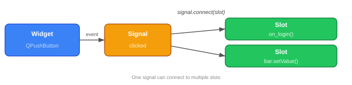</br>

신호-슬롯 메커니즘은 Qt 전체를 관통하는 핵심 설계로, 위젯 간 통신뿐 아니라 스레드 간 안전한 데이터 전달에도 같은 방식이 그대로 적용된다.

아래 표는 이 장의 예제에서 사용하는 주요 위젯과 각 위젯에서 자주 쓰는 신호, 메서드를 정리한 것이다.

| 클래스 | 역할 | 주요 신호 | 주요 메서드 |
|---|---|---|---|
| QMainWindow | 메뉴, 상태 표시줄을 포함한 기본 창 | — | setWindowTitle(), setFixedSize(), setStatusBar() |
| QLabel | 텍스트, 이미지 표시 레이블 | — | setText(), setGeometry(), setAlignment() |
| QPushButton | 클릭 가능한 버튼 | clicked | setText(), setGeometry(), setEnabled() |
| QLineEdit | 한 줄 텍스트 입력 필드 | textChanged, returnPressed | text(), setText(), setPlaceholderText(), setEchoMode() |
| QMessageBox | 정보/경고/오류 팝업 대화상자 | — | information() (정적), warning() (정적) |
| QTimer | 일정 간격으로 신호를 발생시키는 타이머 | timeout | start(ms), stop(), setSingleShot() |
| QDial | 원형 손잡이 형태의 값 입력/표시 위젯 | valueChanged | setValue(), setRange(), setNotchesVisible() |
| QSlider | 수평/수직 막대 형태의 값 입력/표시 위젯 | valueChanged | setValue(), setRange(), setOrientation() |
| QScrollBar | 스크롤 바 형태의 값 입력 위젯 | valueChanged | setValue(), setRange() |
| QStatusBar | 창 하단 상태 표시줄 | — | showMessage(), clearMessage() |
| QProgressBar | 진행률 표시 막대 | — | setValue(), setRange() |
| QComboBox | 드롭다운 선택 목록 | currentIndexChanged, currentTextChanged | addItem(), currentText(), setCurrentIndex() |
| QGroupBox | 관련 위젯을 묶는 그룹 컨테이너 | — | setTitle(), setEnabled() |
| QListWidget | 항목을 나열하는 리스트 위젯 | currentRowChanged, itemClicked | addItem(), clear(), currentRow() |
| QThread | 백그라운드 스레드 실행 클래스 | (사용자 정의 Signal) | start(), run() (오버라이드), wait(), msleep() |

이벤트 루프는 QApplication.exec()로 실행되어 창이 닫힐 때까지 마우스, 키보드, 타이머 이벤트를 처리한다. 이 절의 예제들은 이 세 개념이 실제 코드에서 어떻게 맞물려 동작하는지를 순서대로 보여 준다.

### 설치

> **이 예제로 풀 문제**  
> 코드 작성 전에 개발 환경이 맞지 않으면 실행 오류로 학습 흐름이 끊긴다. PySide6 설치를 먼저 완료해 GUI 실습의 공통 기반을 만든다.


PC 터미널에서 다음 명령을 실행한다.

```sh
pip install PySide6
```

### 첫 번째 창 만들기

> **이 예제로 풀 문제**  
> 버튼과 그래프를 올리기 전에 최소 창이 뜨는 구조를 알아야 이후 확장이 쉽다. QApplication과 QMainWindow의 기본 생명주기를 먼저 확인한다.


GUI 프로그램의 가장 기본적인 구조는 애플리케이션 객체와 창 객체이다. 


애플리케이션 객체는 프로그램 전체의 이벤트 루프를 관리하고, 창 객체는 화면에 표시되는 창을 나타낸다.

```python
# hello_gui.py
import sys
from PySide6.QtWidgets import QApplication, QLabel, QMainWindow, QStyle
from PySide6.QtCore import Qt

class MainWindow(QMainWindow):
    def __init__(self):
        super().__init__()
        self.setWindowTitle("TiCLE GUI")
        self.setFixedSize(300, 120)
        icon = self.style().standardIcon(QStyle.StandardPixmap.SP_ComputerIcon)
        self.setWindowIcon(icon)

if __name__ == '__main__':
    app = QApplication(sys.argv)
    window = MainWindow()
    window.show()
    sys.exit(app.exec())
```

**코드 해설**

QApplication은 GUI 프로그램의 핵심 객체이다. 하나의 프로그램에 QApplication이 하나 있어야 하며, app.exec()를 호출하면 창이 닫힐 때까지 이벤트 루프가 실행된다.

QMainWindow는 메뉴, 상태 표시줄, 도구 모음을 갖춘 기본 창이다. setWindowTitle()는 윈도우 타이틀을 설정하고, setFixedSize()는 크기를 고정한다. 일반적으로 아이콘은 QIcon("icon.png")으로 만든 아이콘 객체를 setWindowIcon()으로 설정하지만, 아이콘 이미지가 없을 때는 style().standardIcon()으로 다음과 같은 내장 아이콘을 선택할 수 있다. 단, 플랫폼(OS) 및 QApplication.setStyle()에 따라 생김새가 완전히 달라지거나 아예 보이지 않을 수 있다.

<table>
<thead>
<tr><th>상수</th><th>아이콘</th><th>아이콘 의미</th></tr>
</thead>
<tbody>
<tr><td>SP_ComputerIcon</td><td></td><td>컴퓨터</td></tr>
<tr><td>SP_DesktopIcon</td><td></td><td>바탕화면</td></tr>
<tr><td>SP_TitleBarMenuButton</td><td></td><td>타이틀바 메뉴</td></tr>
<tr><td>SP_VistaShield</td><td></td><td>보안(방패)</td></tr>
</tbody>
</table>

**실행 결과와 확인할 점**

"TiCLE GUI"라는 제목과 컴퓨터 아이콘이 달린 빈 창이 열린다. 300×120 크기로 고정되어 있으므로 창 모서리를 드래그해도 크기가 바뀌지 않는다. 창을 닫으면 프로그램이 종료된다.

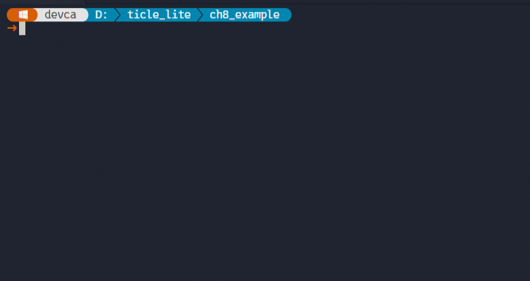</br>


### QLabel 위젯과 QTimer를 이용한 명함

> **이 예제로 풀 문제**  
> 정적인 창에서 끝나면 GUI의 장점을 체감하기 어렵다. QLabel과 QTimer를 결합해 화면 갱신과 위젯 배치의 기본 패턴을 익힌다.


이번에는 창 안에 기본적인 위젯인 QLabel을 추가해 보자.

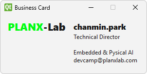

QLabel은 텍스트를 표시하는 가장 기본적인 위젯이다. 부모 위젯을 생성자 인자로 넘기면 레이아웃 없이 창 안에 직접 배치되며, setGeometry로 위치와 크기를 절대 좌표로 지정할 수 있어 창 크기가 고정된 예제에 적합하다. QTimer는 지정한 간격마다 timeout 신호를 발생시켜 연결된 슬롯을 반복 호출하는 타이머로, QLabel의 HTML 렌더링 기능과 결합하면 코드를 멈추지 않고 텍스트 색이 계속 변하는 애니메이션 효과를 만들 수 있다.

```python
# business_card.py
import sys
from PySide6.QtWidgets import QApplication, QMainWindow, QLabel, QStyle
from PySide6.QtCore import Qt, QTimer

class MainWindow(QMainWindow):
    def __init__(self):
        super().__init__()
        self.setWindowTitle("Business Card")
        self.setFixedSize(300, 120)
        self.setWindowIcon(self.style().standardIcon(QStyle.StandardPixmap.SP_TitleBarMenuButton))

        self._lblTitle = QLabel(self)
        self._lblTitle.setAlignment(Qt.AlignmentFlag.AlignCenter)
        self._set_font(self._lblTitle, 16)
        self._lblTitle.setGeometry(0, 0, self.width()//2, self._lblTitle.height()+16)

        lblName = QLabel("chanmin.park", self)
        self._set_font(lblName, 12)
        lblName.setGeometry(self.width()//2, 0, self.width()//2, lblName.height()+16)

        lblcontact = QLabel("Technical Director\n\nEmbedded & Pysical AI\ndevcamp@planxlab.com", self)
        lblcontact.setGeometry(self.width()//2, 0, self.width()//2, self.height()+16)

        self._hue = -2
        self._update_color()
        timer = QTimer(self)
        timer.timeout.connect(self._update_color)
        timer.start(50)

    def _set_font(self, label, size):
        font = label.font()
        font.setBold(True)
        font.setPointSize(size)
        label.setFont(font)

    def _update_color(self):
        self._hue = (self._hue + 2) % 360
        self._lblTitle.setText(f'<span style="color: hsl({self._hue},100%,50%);">PLANX</span>-Lab')

if __name__ == '__main__':
    app = QApplication(sys.argv)
    window = MainWindow()
    window.show()
    sys.exit(app.exec())
```

**코드 해설**

QLabel(self)는 부모 위젯을 인자로 넘겨 레이아웃 없이 창 안에 직접 배치하며, setGeometry(x, y, w, h)로 절대 좌표와 크기를 지정한다. 창이 300×120으로 고정되어 있으므로 왼쪽 절반(0~150)에 제목 레이블, 오른쪽 절반(150~300)에 이름과 연락처 레이블을 각각 배치했다.

_set_font는 label.font()로 폰트 객체를 가져온 뒤 굵기와 크기를 설정하고 label.setFont(font)로 적용한다. Qt에서 폰트를 바꿀 때는 항상 이 패턴을 사용한다.

QLabel은 HTML 마크업을 이해하는 텍스트 영역이기도 하다. setText()에 `<span style="color: hsl(...)">` 태그를 넣으면 Qt가 HTML 렌더링으로 처리하며, hsl(색조, 100%, 50%) 형식에서 색조만 0~359로 순환시키면 무지개 색이 반복된다. span 태그 범위 밖에 있는 "-Lab"은 기본 텍스트 색으로 고정되어 색이 바뀌는 부분과 고정된 부분을 한 setText() 호출로 분리할 수 있다.

QTimer(self)는 주기적으로 timeout 신호를 발생시키는 타이머다. timer.start(50)을 호출하면 50ms마다 timeout이 발생하고 연결된 _update_color 슬롯이 자동으로 호출된다. 사용자 조작 없이도 타이머가 스스로 실행되므로 별도의 루프 없이 화면을 지속적으로 갱신할 수 있다. start() 전에 _update_color()를 직접 한 번 호출하는 것은 타이머가 첫 번째 틱을 발생시키기 전까지 레이블이 빈 채로 보이는 것을 막기 위해서다.

**실행 결과와 확인할 점**

창이 열리면 왼쪽의 "PLANX-Lab" 텍스트 색이 50ms마다 무지개 색으로 순환한다. "PLANX" 부분만 색이 바뀌고 "-Lab"은 기본 텍스트 색으로 고정된다. 오른쪽에는 이름과 연락처가 고정 텍스트로 표시된다. 창 크기가 고정되어 있으므로 레이아웃 없이 절대 좌표만으로도 배치가 유지된다.

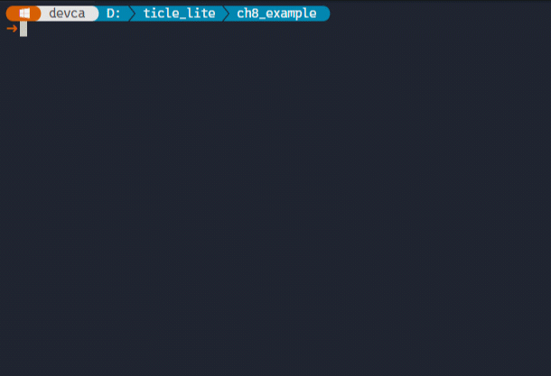</br>

> **한 걸음 더**  
> timer.start(50)의 50을 10으로 줄이거나 200으로 늘려 색 변화 속도를 조절해 본다. _update_color에서 self._hue += 2의 증가폭을 5나 10으로 바꾸면 색조가 더 빠르게 바뀐다. 타이머 간격과 색조 증가폭의 조합으로 시각적 효과의 속도를 독립적으로 조정할 수 있다.


### QEdit와 QPushButton 위젯 및 신호와 슬롯을 이용한 로그인 창

> **이 예제로 풀 문제**  
> 사용자 입력을 받아 조건을 검사하고 결과를 화면에 반영하는 흐름은 모든 제어 앱의 기초다. 입력 위젯과 신호-슬롯 연결로 상호작용 구조를 만든다.


Qt의 신호(Signal)와 슬롯(Slot)은 객체 사이에 이벤트를 전달하는 핵심 메커니즘이다. 신호는 위젯에서 어떤 사건이 발생했을 때 자동으로 발생하는 알림이고, 슬롯은 신호를 받아 실행되는 함수이다. connect(슬롯)으로 신호와 슬롯을 연결하면 신호가 발생할 때마다 슬롯이 자동으로 호출된다. QPushButton의 clicked, QLineEdit의 textChanged나 returnPressed가 대표적인 내장 신호이며, 어떤 함수든 슬롯으로 연결할 수 있다.

QLineEdit는 한 줄 텍스트를 입력받는 위젯이다. placeholderText로 입력 전 안내 문구를 표시하고, echoMode를 Password로 설정하면 입력한 문자가 점으로 가려진다. QMessageBox는 정보, 경고, 오류 등을 팝업 대화상자로 표시하는 위젯이다. 정적 메서드 information과 warning을 사용하면 창 객체를 직접 만들지 않고 한 줄로 대화상자를 띄울 수 있다.

```python
# login.py
import sys
from PySide6.QtWidgets import (QApplication, QMainWindow, QStyle, 
                               QLineEdit, QPushButton, QMessageBox)

class MainWindow(QMainWindow):
    def __init__(self):
        super().__init__()
        self.setWindowTitle("TiCLE GUI")
        self.setFixedSize(300, 120)
        icon = self.style().standardIcon(QStyle.StandardPixmap.SP_DesktopIcon)
        self.setWindowIcon(icon)
        
        self.editId = QLineEdit(self, placeholderText="Your ID")
        self.editId.setGeometry(20, 5, 260, 30)
        
        self.editPassword = QLineEdit(self, placeholderText="Your password", 
                                      echoMode=QLineEdit.EchoMode.Password)
        self.editPassword.setGeometry(20, 40, 260, 30)
        
        btnLogin = QPushButton("Login", self)
        btnLogin.setGeometry(110, 80, 80, 30)
        btnLogin.clicked.connect(self.on_login)  # signal-slot connection
    
    def on_login(self):
        id = self.editId.text()
        password = self.editPassword.text()
        if id and password:
            QMessageBox.information(self, "Login Info", f"ID: {id}\nPassword: {password}")
            self.close()
        else:
            QMessageBox.warning(self, "Login Failed", "Please enter both ID and password.")
                
if __name__ == '__main__':
    app = QApplication(sys.argv)
    window = MainWindow()
    window.show()
    sys.exit(app.exec())
```

**코드 해설**

QLineEdit(self, placeholderText="...")처럼 부모 위젯과 키워드 인자를 함께 넘기면 생성과 동시에 속성을 설정할 수 있다. echoMode=QLineEdit.EchoMode.Password를 지정하면 입력 문자가 점으로 표시되어 비밀번호 필드로 동작하며, setGeometry로 두 입력 필드를 창 안에 위아래로 배치했다.

QPushButton도 부모 위젯을 인자로 넘겨 절대 좌표로 배치하며, clicked 신호에 on_login 슬롯을 연결해 버튼을 눌렀을 때 입력값 검사가 이루어지도록 했다.

on_login은 text()로 각 필드의 현재 텍스트를 읽어 두 값이 모두 있으면 QMessageBox.information으로 정보 대화상자를 띄우고 self.close()로 창을 닫는다. 하나라도 비어 있으면 QMessageBox.warning으로 경고 대화상자를 띄우되 창은 그대로 유지한다. 두 정적 메서드는 모두 첫 번째 인자로 부모 창을 받아 대화상자가 항상 부모 창 위에 표시된다.

**실행 결과와 확인할 점**

창이 열리면 ID와 비밀번호 입력 필드가 위아래로 배치되고 아래에 Login 버튼이 표시되며, 비밀번호 필드에 입력하면 문자가 점으로 가려진다. 두 필드를 모두 채우고 Login을 누르면 입력한 값을 보여 주는 정보 대화상자가 열리고 확인을 누르면 창이 닫힌다. 하나라도 비어 있으면 경고 대화상자가 열리고 창은 그대로 유지된다.

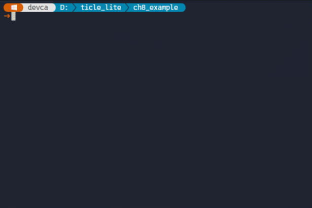</br>

> **한 걸음 더**  
> editPassword에 returnPressed 신호를 연결해 Enter 키를 눌러도 on_login이 호출되도록 바꾸어 본다. editId의 returnPressed에는 editPassword.setFocus()를 연결하면 Tab 없이 Enter만으로 필드를 순서대로 이동할 수 있다.

### 백그라운드 스레드와 QDial, QScrollBar, QSlider 위젯을 이용한 데이터 시각화

> **이 예제로 풀 문제**  
> 통신이나 센서 갱신이 길어지면 GUI가 멈추는 문제가 생긴다. 백그라운드 스레드와 값 입력 위젯을 결합해 반응성을 유지하는 구조를 학습한다.


앞 소절에서 버튼의 clicked 신호처럼 사용자 조작으로 발생하는 신호를 살펴봤다. 이번에는 센서처럼 독립적으로 데이터를 생성하는 백그라운드 작업에서 신호를 직접 발생시키는 방법을 알아본다.

QThread를 상속한 클래스의 run()을 오버라이드하면 별도 스레드에서 실행되는 작업을 만들 수 있다. 클래스 변수로 Signal을 선언하고 run() 안에서 emit()을 호출하면 메인 스레드의 슬롯으로 데이터를 안전하게 전달한다. 앞 소절의 신호-슬롯 연결 원리 그대로이며, 신호를 발생시키는 주체가 사용자 조작이 아닌 스레드일 뿐이다.

QDial은 원형 손잡이 형태로 값 범위를 표시하고, QSlider는 수평/수직 막대로 값을 표시한다. QScrollBar는 스크롤 바 형태의 입력 위젯이다. setStyleSheet()로 창과 위젯의 배경색, 글자색, 폰트를 CSS와 유사한 문법으로 직접 지정할 수 있다.

```python
# data_visualization.py
import sys
import random
from PySide6.QtWidgets import (QApplication, QMainWindow, QStyle, 
                               QDial, QSlider, QScrollBar, QStatusBar)
from PySide6.QtCore import Qt, QThread, Signal

class ImuWorker(QThread):
    accelerometer_changed = Signal(float, float, float)
    
    def __init__(self):
        super().__init__()
        self.interval_ms = 500  # Default interval in milliseconds
        self._running = True
        
    def run(self):
        while self._running:
            # Simulate accelerometer data update
            ax = random.uniform(-20, 20)
            ay = random.uniform(-20, 20)
            az = random.uniform(-20, 20)
            self.accelerometer_changed.emit(ax, ay, az)
            self.msleep(self.interval_ms)

    def stop(self):
        self._running = False
        self.wait()

class CdsWorker(QThread):
    cds_changed = Signal(int)
    
    def __init__(self):
        super().__init__()
        self.interval_ms = 500  # Default interval in milliseconds
        self._running = True
    
    def run(self):
        while self._running:
            # Simulate CDS data update
            value = random.randint(0, 100)
            self.cds_changed.emit(value)
            self.msleep(self.interval_ms)

    def stop(self):
        self._running = False
        self.wait()

class MainWindow(QMainWindow):
    def __init__(self):
        super().__init__()
        self.setWindowTitle("Sensor Visualization")
        self.setFixedSize(300, 120)
        icon = self.style().standardIcon(QStyle.StandardPixmap.SP_VistaShield)
        self.setWindowIcon(icon)
        self.setStyleSheet("""
                           QMainWindow { 
                               background-color: rgb(255, 255, 128); 
                           }""")
        
        self.statusBar = QStatusBar(self)
        # Customize the status bar appearance
        self.statusBar.setStyleSheet(""" 
                           QStatusBar {
                               background-color: #252526;
                               color: gold; 
                               font-weight: bold;
                               font-size: 10px;
                           }""")
        self.setStatusBar(self.statusBar)
        self.statusBar.setVisible(True)
        self.statusBar.showMessage("Initializing sensors...")
        
        self.diaVr = QDial(self)
        self.diaVr.setRange(0, 100)
        self.diaVr.setGeometry(10, 0, 100, 100)
        self.diaVr.setNotchesVisible(True)
        
        self.sldAx = QSlider(Qt.Orientation.Horizontal, self)
        self.sldAy = QSlider(Qt.Orientation.Horizontal, self)
        self.sldAz = QSlider(Qt.Orientation.Horizontal, self)
        # Set the range and geometry for each slider
        for sld, y in {self.sldAx: 10, self.sldAy: 25, self.sldAz: 40}.items():
            sld.setRange(-20, 20)
            sld.setGeometry(120, y, 170, 20)

        # Make the dials and sliders non-interactive
        for widget in (self.diaVr, self.sldAx, self.sldAy, self.sldAz):
            widget.setAttribute(Qt.WidgetAttribute.WA_TransparentForMouseEvents)
            widget.setFocusPolicy(Qt.FocusPolicy.NoFocus)
        
        sldInterval = QScrollBar(Qt.Orientation.Horizontal, self)
        sldInterval.setRange(1, 10)
        sldInterval.setGeometry(120, 75, 170, 20)
        sldInterval.setValue(5)
        sldInterval.valueChanged.connect(self.on_interval_changed)
        
        self.imu_worker = ImuWorker()
        self.imu_worker.accelerometer_changed.connect(self.on_accelerometer_changed)
        self.imu_worker.start()
        
        self.cds_worker = CdsWorker()
        self.cds_worker.cds_changed.connect(self.diaVr.setValue)
        self.cds_worker.start()
    
    def on_accelerometer_changed(self, ax, ay, az):
        self.sldAx.setValue(int(ax))
        self.sldAy.setValue(int(ay))
        self.sldAz.setValue(int(az))
    
    def on_interval_changed(self, value):
        interval_ms = value * 100
        self.imu_worker.interval_ms = interval_ms
        self.cds_worker.interval_ms = interval_ms
        self.statusBar.showMessage(f"Update interval: {interval_ms} ms")
    
    def closeEvent(self, event):
        self.imu_worker.stop()
        self.cds_worker.stop()
        super().closeEvent(event)
    
if __name__ == '__main__':
    app = QApplication(sys.argv)
    window = MainWindow()
    window.show()
    sys.exit(app.exec())
```

**코드 해설**

ImuWorker와 CdsWorker는 각각 QThread를 상속한다. run()을 오버라이드해 _running 플래그가 True인 동안 msleep()으로 지정한 간격만큼 대기한 뒤 랜덤 값을 emit하는 루프를 실행한다. msleep()은 현재 스레드만 잠시 멈추므로 GUI 이벤트 루프는 그 사이에도 계속 동작한다. stop()은 _running을 False로 바꿔 루프를 탈출시킨 뒤 wait()로 스레드가 완전히 종료될 때까지 기다리며, 창을 닫을 때 closeEvent에서 두 워커의 stop()을 호출해 스레드를 안전하게 정리한다.

diaVr.setValue는 QDial이 직접 제공하는 슬롯이므로 cds_worker.cds_changed.connect(self.diaVr.setValue)처럼 슬롯 함수를 별도로 만들지 않고 바로 연결할 수 있다. accelerometer_changed는 세 값을 한 번에 전달하므로 on_accelerometer_changed 슬롯을 따로 선언해 각 슬라이더에 분배한다.

다이얼과 슬라이더는 기본적으로 사용자가 값을 직접 바꿀 수 있는 입력 위젯이지만, 이 예제에서는 센서 데이터를 표시하는 용도로만 사용한다. setAttribute(WA_TransparentForMouseEvents)를 설정하면 위젯이 마우스 이벤트를 무시하고, setFocusPolicy(NoFocus)를 함께 설정하면 Tab 키로도 포커스를 받지 않아 완전히 표시 전용 위젯으로 동작한다.

sldInterval은 QScrollBar로 만든 갱신 주기 조절 위젯으로, 범위를 1~10으로 설정하고 valueChanged 신호에 on_interval_changed를 연결했다. 슬롯에서는 전달받은 값에 100을 곱해 밀리초 단위의 주기로 변환한 뒤 두 워커의 interval_ms를 동시에 갱신한다.

setStyleSheet()는 Qt 스타일 시트로 위젯 외관을 꾸민다. "QMainWindow { background-color: rgb(255,255,128); }"처럼 위젯 클래스 이름을 선택자로 쓰고 CSS 속성을 지정한다. QStatusBar에 배경색, 글자색, 폰트 굵기를 설정하면 창 하단 상태 표시줄에 별도의 어두운 테마를 적용해 본문 영역과 시각적으로 구분할 수 있다.

**실행 결과와 확인할 점**

창이 열리면 상태 바에 "Initializing sensors..."가 표시되고, 곧바로 왼쪽의 다이얼과 오른쪽의 세 슬라이더가 500ms마다 자동으로 갱신된다. 오른쪽 하단의 스크롤 바를 움직이면 상태 바에 새 주기가 표시되면서 다이얼과 슬라이더의 변화 속도가 달라진다. 창 본문은 연한 노란색이고 상태 바는 어두운 색으로 구분되어 setStyleSheet 적용 결과를 바로 확인할 수 있다.

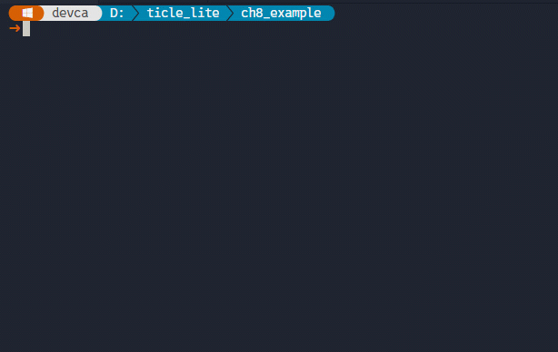</br>

> **한 걸음 더**  
> ImuWorker의 accelerometer_changed 신호에 세 값이 아닌 값 하나만 전달하는 방식으로 바꾸고, 슬라이더마다 별도의 워커를 만들어 각각 다른 주기로 갱신해 본다. 또는 setStyleSheet로 슬라이더 색을 축별로 빨강, 초록, 파랑으로 지정해 x, y, z 축을 직관적으로 구분해 본다.

--- 

## Qt Designer로 UI 설계하기

> **풀고 싶은 문제**  
> 앞 절에서 만든 창처럼 위젯이 몇 개뿐일 때는 setGeometry로 좌표를 직접 지정해도 충분하다. 그러나 MQTT, BLE 제어처럼 버튼, 진행 막대, 입력 필드가 열 개 이상 필요한 창을 코드로 작성하면 레이아웃 코드만 수십 줄이 된다. Qt Designer로 마우스로 배치하고 pyside6-uic로 파이썬 코드와 연결하는 방법을 익힌다.

지금까지는 위젯마다 생성 코드와 setGeometry 호출을 직접 작성하는 방식으로 화면을 구성했다. 위젯이 서너 개일 때는 충분하지만, 위젯이 열 개 이상으로 늘어나면 배치 코드만 수십 줄이 되고, 좌표 하나를 바꿀 때마다 실행해 보며 확인해야 하므로 관리가 점점 어려워진다.

Qt Designer는 위젯을 마우스로 끌어다 놓고 속성 편집기에서 크기, 정렬, 텍스트를 실시간으로 확인하며 조정하는 시각적 UI 설계 도구다. 배치 결과가 즉시 화면에 반영되므로 setGeometry 수치를 반복 수정하지 않아도 되고, 위젯이 늘어날수록 코드 방식보다 훨씬 빠르고 정밀하게 레이아웃을 완성할 수 있다.

Qt Designer로 설계를 마치면 .ui 파일로 저장한다. 이 파일은 위젯의 종류, 배치, 속성을 기술한 XML이며 파이썬 코드가 아니다. pyside6-uic 명령으로 .ui 파일을 파이썬 파일로 변환하면 Ui_MainWindow 클래스가 생성된다. 이 클래스의 setupUi(window) 메서드가 창에 레이아웃을 적용하며, Qt Designer에서 각 위젯에 지정한 objectName이 코드에서 위젯에 접근하는 속성 이름이 된다. 파이썬 코드에서는 QMainWindow와 Ui_MainWindow를 함께 상속한 뒤 self.setupUi(self)를 한 번 호출하는 것만으로 시각적으로 설계한 레이아웃 전체가 창에 적용된다.

### 인터페이스 구성과 초기 설정

> **이 예제로 풀 문제**  
> Qt Designer를 처음 실행하면 낯선 패널이 여러 개 열려 어디서부터 시작해야 할지 막막하다. 주요 패널의 역할과 상호 관계를 파악해 두면 이후 화면 설계 작업에 바로 집중할 수 있다.

Qt Designer를 처음 실행하면 새로 만들기 대화상자가 나타나는데, 이 대화상자가 매번 표시되지 않도록 하단의 'Show this Dialog on Startup' 체크를 해제한 후 Main Window 템플릿을 선택하고 Create를 누르면 편집 화면이 열린다. 오른쪽 패널에 있는 Resource Browser는 이미지 리소스를 관리하는 패널이지만 이 교재에서는 사용하지 않는다. 마우스로 끌어 Property Editor 탭 영역에 합쳐 놓으면 Object Inspector와 Property Editor가 더 넓게 표시되어 작업하기 편하다.

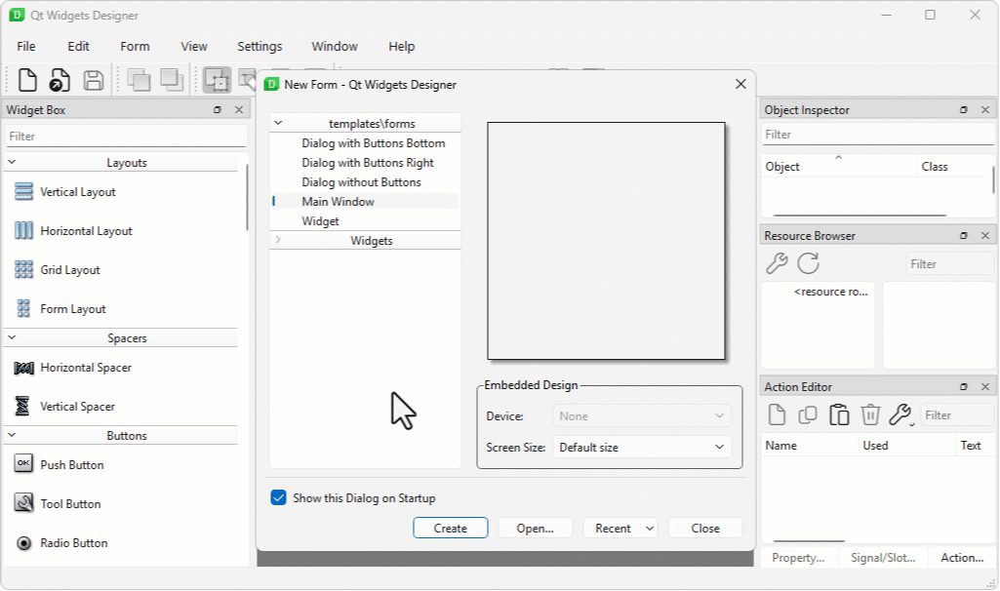</br>

Qt Designer의 편집 화면은 네 영역으로 나뉜다.

| 패널 | 위치 | 역할 |
|---|---|---|
| Widget Box | 왼쪽 | 사용 가능한 위젯 목록. 원하는 위젯을 캔버스로 드래그해 배치한다. |
| 캔버스 | 가운데 | 실제 UI를 설계하는 영역. 배치한 위젯을 직접 선택하고 이동, 크기 조정할 수 있다. |
| Object Inspector | 오른쪽 상단 | 캔버스에 배치된 위젯의 계층 구조를 트리로 표시한다. |
| Property Editor | 오른쪽 하단 | 선택된 위젯의 속성(objectName, 크기, 텍스트 등)을 편집한다. |

세 패널은 하나의 작업 흐름으로 연결된다. Widget Box에서 위젯을 드래그해 캔버스에 놓으면 Object Inspector의 트리에 해당 위젯이 추가된다. 캔버스나 Object Inspector에서 위젯을 클릭하면 Property Editor에 그 위젯의 속성 목록이 표시된다. 여기서 objectName을 지정하면 pyside6-uic로 변환된 파이썬 코드에서 self.objectName으로 해당 위젯에 접근할 수 있다.

Object Inspector의 트리는 위젯의 부모-자식 관계도 보여 준다. QMainWindow 아래 centralwidget이 있고, 그 아래 배치한 버튼과 레이블이 들어간다. QGroupBox를 배치하고 그 안에 다른 위젯을 넣으면 트리에서 QGroupBox의 자식으로 표시된다. 이후 코드에서 groupBox.setEnabled(False)를 호출하면 자식 위젯 전체가 함께 비활성화된다. 계층 구조가 의도한 대로 구성되어 있는지 캔버스를 확인하지 않고도 Object Inspector 트리 하나로 바로 파악할 수 있다.

### 위젯 배치, 속성 설정, 신호-슬롯 연결

> **이 예제로 풀 문제**  
> 코드를 한 줄도 작성하지 않고 다이얼을 돌리면 LCD 숫자가 바뀌는 화면을 만들 수 있을까? Widget Box, Property Editor, 신호-슬롯 편집 기능을 차례로 사용해 Qt Designer의 핵심 작업 흐름을 익혀 본다.

Widget Box에서 자주 쓰는 위젯을 꺼내 캔버스에 배치하고, Property Editor에서 속성을 설정하는 기본 흐름을 익혀 본다. Qt Designer에는 신호-슬롯 연결을 마우스로 설정하는 기능도 있어 코드 없이도 위젯 사이를 연결할 수 있다.

**Group Box와 LCD Number, Dial 배치**

Menu Bar와 Status Bar를 제거한 후 MainWindow의 windowTitle을 'Hello Designer'로 변경하고 Widget Box의 Containers 항목에서 Group Box를 캔버스로 드래그한다. Group Box를 선택한 상태에서 Property Editor에서 title을 "Level"로 바꾼다. 이번에는 Widget Box의 Display Widgets에서 LCD Number를, Input Widgets에서 Dial을 Group Box 안으로 드래그한다. 위젯이 Group Box 안에 올바르게 들어갔다면 Object Inspector에서 그룹박스의 자식으로 표시된다. 다시 새 Group Box를 추가하고 title을 "Gauge"로 바꾼 후 Dial과 Tool Button, Horizontal Slider를 안으로 드래그한다.

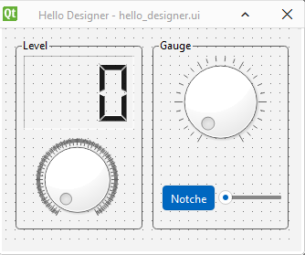</br>

각 위젯을 선택하고 Property Editor에서 속성을 다음과 같이 설정한다.

| Target | Widget | Property | Value |
|---|-|---|---|
| MainWindow |  | windowTitle | Hello Designer |
| Group Box (Level) | LCD Number | objectName | lcdLevel |
|| | frameShape | Panel |
|| | frameShadown | Sunken |
|| | digitCount | 3 |
|| Dial | objectName | dalLevel |
||  | maximum | 999 |
||  | notchesVisible | True |
| Group Box (Gauge)| Dial | objectName | dalGauge |
||  | maximum | 100 |
||  | notchesVisible | True |
|| Tool Button | objectName | btnGaugeToggleNotche |
||  | text | Notche |
||  | checkable | True |
||  | checked | True |
|| Horizontal Slider | objectName | sldGauge |
||  | maximum | 100 |
||  | notchesVisible | True |

배치가 끝나면 Qt Designer 툴바의 시그널/슬롯 편집 버튼( F4 키 )을 누르거나 메뉴에서 Edit > Edit Signals/Slots를 선택한 후 dalLevel과 sldGauge의 valueChanged 신호를 각각 lcdLevel의 display와 dalGauge의 setValue 슬롯에 연결하고, btnGaugeToggleNotche의 toggled 신호도 dalGauge의 setNotchesVisible에 연결한다. 다이얼을 마우스로 클릭한 채 LCD Number 위로 드래그하면 연결 대화상자가 열린다. 왼쪽(신호)에서 valueChanged(int)를 선택하고 오른쪽(슬롯)에서 display(int)를 선택한 뒤 OK를 누른다. 편집 화면 하단에 연결 목록이 표시되면 연결이 완료된 것이다.

F3 키를 눌러 위젯 편집 모드로 되돌아간다. 저장하면 .ui 파일에 \<connections> 블록이 추가되어 신호-슬롯 연결이 기록된다. pyside6-uic로 변환된 파이썬 파일에도 연결 코드가 자동으로 생성되므로 MainWindow 코드에서 따로 connect()를 작성하지 않아도 된다. 작업이 완료되면 hello_designer.ui로 저장한다.

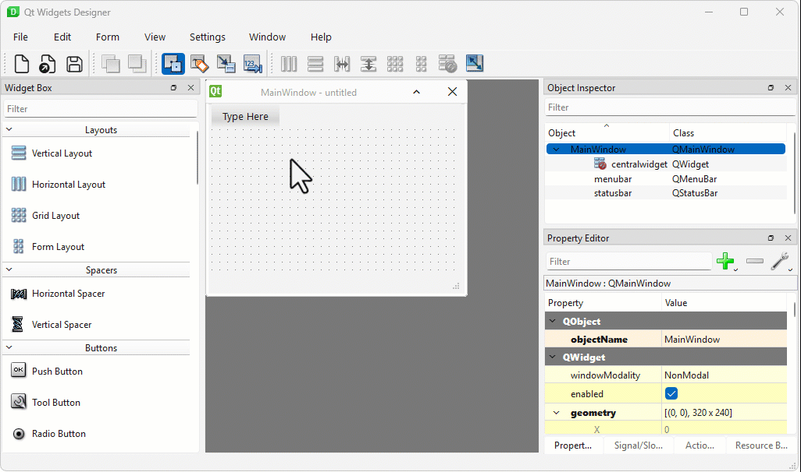</br>

> <details>
> <summary><b>hello_designer.ui</b></summary>
>
>```xml
><?xml version="1.0" encoding="UTF-8"?>
><ui version="4.0">
> <class>MainWindow</class>
> <widget class="QMainWindow" name="MainWindow">
>  <property name="geometry">
>   <rect>
>    <x>0</x>
>    <y>0</y>
>    <width>320</width>
>    <height>240</height>
>   </rect>
>  </property>
>  <property name="windowTitle">
>   <string>Hello Designer</string>
>  </property>
>  <widget class="QWidget" name="centralwidget">
>   <widget class="QGroupBox" name="groupBox">
>    <property name="geometry">
>     <rect>
>      <x>10</x>
>      <y>10</y>
>      <width>141</width>
>      <height>211</height>
>     </rect>
>    </property>
>    <property name="title">
>     <string>Level</string>
>    </property>
>    <widget class="QLCDNumber" name="lcdLevel">
>     <property name="geometry">
>      <rect>
>       <x>10</x>
>       <y>20</y>
>       <width>121</width>
>       <height>81</height>
>      </rect>
>     </property>
>     <property name="frameShape">
>      <enum>QFrame::Shape::Panel</enum>
>     </property>
>     <property name="frameShadow">
>      <enum>QFrame::Shadow::Sunken</enum>
>     </property>
>     <property name="digitCount">
>      <number>3</number>
>     </property>
>    </widget>
>    <widget class="QDial" name="dalLevel">
>     <property name="geometry">
>      <rect>
>       <x>23</x>
>       <y>110</y>
>       <width>91</width>
>       <height>91</height>
>      </rect>
>     </property>
>     <property name="maximum">
>      <number>999</number>
>     </property>
>     <property name="notchesVisible">
>      <bool>true</bool>
>     </property>
>    </widget>
>   </widget>
>   <widget class="QGroupBox" name="groupBox_2">
>    <property name="geometry">
>     <rect>
>      <x>160</x>
>      <y>10</y>
>      <width>151</width>
>      <height>211</height>
>     </rect>
>    </property>
>    <property name="title">
>     <string>Gauge</string>
>    </property>
>    <widget class="QDial" name="dalGauge">
>     <property name="geometry">
>      <rect>
>       <x>10</x>
>       <y>20</y>
>       <width>131</width>
>       <height>101</height>
>      </rect>
>     </property>
>     <property name="maximum">
>      <number>100</number>
>     </property>
>     <property name="notchesVisible">
>      <bool>true</bool>
>     </property>
>    </widget>
>    <widget class="QToolButton" name="btnGaugeToggleNotche">
>     <property name="geometry">
>      <rect>
>       <x>10</x>
>       <y>160</y>
>       <width>61</width>
>       <height>31</height>
>      </rect>
>     </property>
>     <property name="text">
>      <string>Notche</string>
>     </property>
>     <property name="checkable">
>      <bool>true</bool>
>     </property>
>     <property name="checked">
>      <bool>true</bool>
>     </property>
>    </widget>
>    <widget class="QSlider" name="sldGauge">
>     <property name="geometry">
>      <rect>
>       <x>73</x>
>       <y>167</y>
>       <width>71</width>
>       <height>20</height>
>      </rect>
>     </property>
>     <property name="maximum">
>      <number>100</number>
>     </property>
>     <property name="orientation">
>      <enum>Qt::Orientation::Horizontal</enum>
>     </property>
>    </widget>
>   </widget>
>  </widget>
> </widget>
> <resources/>
> <connections>
>  <connection>
>   <sender>dalLevel</sender>
>   <signal>valueChanged(int)</signal>
>   <receiver>lcdLevel</receiver>
>   <slot>display(int)</slot>
>   <hints>
>    <hint type="sourcelabel">
>     <x>74</x>
>     <y>164</y>
>    </hint>
>    <hint type="destinationlabel">
>     <x>75</x>
>     <y>88</y>
>    </hint>
>   </hints>
>  </connection>
>  <connection>
>   <sender>btnGaugeToggleNotche</sender>
>   <signal>toggled(bool)</signal>
>   <receiver>dalGauge</receiver>
>   <slot>setNotchesVisible(bool)</slot>
>   <hints>
>    <hint type="sourcelabel">
>     <x>211</x>
>     <y>189</y>
>    </hint>
>    <hint type="destinationlabel">
>     <x>223</x>
>     <y>98</y>
>    </hint>
>   </hints>
>  </connection>
>  <connection>
>   <sender>sldGauge</sender>
>   <signal>valueChanged(int)</signal>
>   <receiver>dalGauge</receiver>
>   <slot>setValue(int)</slot>
>   <hints>
>    <hint type="sourcelabel">
>     <x>280</x>
>     <y>183</y>
>    </hint>
>    <hint type="destinationlabel">
>     <x>265</x>
>     <y>120</y>
>    </hint>
>   </hints>
>  </connection>
> </connections>
></ui>
>```
>
> </details>
</br>


디자인 파일이 완성되면 pyside6-uic로 XML 코드인 hello_designer.ui를 파이썬 코드인 hello_designer_ui.py로 변환한다.

```sh
pyside6-uic hello_designer.ui -o hello_designer_ui.py
```

> <details>
> <summary><b>hello_designer_ui.py</b></summary>
>
>```python
># -*- coding: utf-8 -*-
>
>################################################################################
>## Form generated from reading UI file 'hello_designer.ui'
>##
>## Created by: Qt User Interface Compiler version 6.11.1
>##
>## WARNING! All changes made in this file will be lost when recompiling UI file!
>################################################################################
>
>from PySide6.QtCore import (QCoreApplication, QDate, QDateTime, QLocale,
>    QMetaObject, QObject, QPoint, QRect,
>    QSize, QTime, QUrl, Qt)
>from PySide6.QtGui import (QBrush, QColor, QConicalGradient, QCursor,
>    QFont, QFontDatabase, QGradient, QIcon,
>    QImage, QKeySequence, QLinearGradient, QPainter,
>    QPalette, QPixmap, QRadialGradient, QTransform)
>from PySide6.QtWidgets import (QApplication, QDial, QFrame, QGroupBox,
>    QLCDNumber, QMainWindow, QSizePolicy, QSlider,
>    QToolButton, QWidget)
>
>class Ui_MainWindow(object):
>    def setupUi(self, MainWindow):
>        if not MainWindow.objectName():
>            MainWindow.setObjectName(u"MainWindow")
>        MainWindow.resize(320, 240)
>        self.centralwidget = QWidget(MainWindow)
>        self.centralwidget.setObjectName(u"centralwidget")
>        self.groupBox = QGroupBox(self.centralwidget)
>        self.groupBox.setObjectName(u"groupBox")
>        self.groupBox.setGeometry(QRect(10, 10, 141, 211))
>        self.lcdLevel = QLCDNumber(self.groupBox)
>        self.lcdLevel.setObjectName(u"lcdLevel")
>        self.lcdLevel.setGeometry(QRect(10, 20, 121, 81))
>        self.lcdLevel.setFrameShape(QFrame.Shape.Panel)
>        self.lcdLevel.setFrameShadow(QFrame.Shadow.Sunken)
>        self.lcdLevel.setDigitCount(3)
>        self.dalLevel = QDial(self.groupBox)
>        self.dalLevel.setObjectName(u"dalLevel")
>        self.dalLevel.setGeometry(QRect(23, 110, 91, 91))
>        self.dalLevel.setMaximum(999)
>        self.dalLevel.setNotchesVisible(True)
>        self.groupBox_2 = QGroupBox(self.centralwidget)
>        self.groupBox_2.setObjectName(u"groupBox_2")
>        self.groupBox_2.setGeometry(QRect(160, 10, 151, 211))
>        self.dalGauge = QDial(self.groupBox_2)
>        self.dalGauge.setObjectName(u"dalGauge")
>        self.dalGauge.setGeometry(QRect(10, 20, 131, 101))
>        self.dalGauge.setMaximum(100)
>        self.dalGauge.setNotchesVisible(True)
>        self.btnGaugeToggleNotche = QToolButton(self.groupBox_2)
>        self.btnGaugeToggleNotche.setObjectName(u"btnGaugeToggleNotche")
>        self.btnGaugeToggleNotche.setGeometry(QRect(10, 160, 61, 31))
>        self.btnGaugeToggleNotche.setCheckable(True)
>        self.btnGaugeToggleNotche.setChecked(True)
>        self.sldGauge = QSlider(self.groupBox_2)
>        self.sldGauge.setObjectName(u"sldGauge")
>        self.sldGauge.setGeometry(QRect(73, 167, 71, 20))
>        self.sldGauge.setMaximum(100)
>        self.sldGauge.setOrientation(Qt.Orientation.Horizontal)
>        MainWindow.setCentralWidget(self.centralwidget)
>
>        self.retranslateUi(MainWindow)
>        self.dalLevel.valueChanged.connect(self.lcdLevel.display)
>        self.btnGaugeToggleNotche.toggled.connect(self.dalGauge.setNotchesVisible)
>        self.sldGauge.valueChanged.connect(self.dalGauge.setValue)
>
>        QMetaObject.connectSlotsByName(MainWindow)
>    # setupUi
>
>    def retranslateUi(self, MainWindow):
>        MainWindow.setWindowTitle(QCoreApplication.translate("MainWindow", u"Hello Designer", None))
>        self.groupBox.setTitle(QCoreApplication.translate("MainWindow", u"Level", None))
>        self.groupBox_2.setTitle(QCoreApplication.translate("MainWindow", u"Gauge", None))
>        self.btnGaugeToggleNotche.setText(QCoreApplication.translate("MainWindow", u"Notche", None))
>    # retranslateUi
>```
>
> </details>
</br>

**자주 쓰는 기본 위젯과 주요 속성**

아래는 Qt Designer에서 배치할 때 처음 설정해야 할 속성을 위젯별로 정리한 것이다.

| 위젯 | Widget Box 분류 | 주요 설정 속성 |
|---|---|---|
| QPushButton | Buttons | objectName, text (버튼 표시 문자) |
| QCheckBox | Buttons | objectName, text (레이블), checked (초기 체크 여부) |
| QRadioButton | Buttons | objectName, text, checked |
| QLineEdit | Input Widgets | objectName, text (초기 텍스트), placeholderText (안내 문구), readOnly |
| QSpinBox | Input Widgets | objectName, minimum, maximum, value (초기 값) |
| QSlider | Input Widgets | objectName, minimum, maximum, value, orientation (수평/수직) |
| QProgressBar | Display Widgets | objectName, minimum, maximum, value |
| QLabel | Display Widgets | objectName, text, alignment |
| QGroupBox | Containers | objectName, title, checkable (체크박스 형태 그룹), flat |

QGroupBox의 checkable 속성을 체크하면 그룹 박스 제목 왼쪽에 체크박스가 생긴다. 체크를 해제하면 그룹 안의 위젯이 모두 비활성화되어 옵션 그룹을 통째로 켜고 끄는 데 쓸 수 있다.

QRadioButton은 같은 부모 컨테이너 안에 여러 개를 배치하면 자동으로 하나만 선택되는 그룹이 된다. 다른 그룹과 독립적으로 동작시키려면 QGroupBox나 QFrame 안에 각각 나눠 배치한다.

신호-슬롯 편집 모드에서 자주 연결하는 조합은 다음과 같다.

| 신호 (송신 위젯) | 슬롯 (수신 위젯) | 효과 |
|---|---|---|
| QDial.valueChanged(int) | QLCDNumber.display(int) | 다이얼 값을 LCD에 표시 |
| QSlider.valueChanged(int) | QProgressBar.setValue(int) | 슬라이더로 진행 막대 제어 |
| QSpinBox.valueChanged(int) | QDial.setValue(int) | 스핀 박스로 다이얼 제어 |
| QPushButton.clicked() | QLineEdit.clear() | 버튼으로 텍스트 초기화 |
| QCheckBox.toggled(bool) | QGroupBox.setEnabled(bool) | 체크박스로 그룹 활성화 전환 |

코드로 작성할 때는 connect()를 직접 써야 하지만, Qt Designer에서는 마우스 드래그 하나로 같은 연결을 설정할 수 있다. 단, Qt Designer의 신호-슬롯 편집에서는 위젯이 기본으로 제공하는 신호와 슬롯만 선택할 수 있다. 이후 소절처럼 파이썬 코드에서 직접 정의한 슬롯과 연결하려면 setupUi 호출 이후 connect()를 추가해야 한다.

### UI 파일 변환과 코드 연결

> **이 예제로 풀 문제**  
> Designer에서 만든 .ui를 실제 제어 코드와 연결하지 못하면 화면과 로직이 분리된 채로 남는다. 변환과 클래스 결합 절차를 정리해 유지보수 가능한 구조를 만든다.


변환된 hello_designer_ui.py에는 Ui_MainWindow 클래스가 자동으로 생성되어 있다. MainWindow가 이 클래스를 함께 상속하면 setupUi(self) 한 줄로 모든 위젯이 창에 배치된다.

```python
# hello_designer.py
import sys
from PySide6.QtWidgets import QApplication, QMainWindow, QStyle
from PySide6.QtCore import Qt
from hello_designer_ui import Ui_MainWindow

class MainWindow(QMainWindow, Ui_MainWindow):
    def __init__(self):
        super().__init__()
        self.setupUi(self)
        icon = self.style().standardIcon(QStyle.StandardPixmap.SP_ComputerIcon)
        self.setWindowIcon(icon)
        self.setWindowFlags(self.windowFlags() | Qt.MSWindowsFixedSizeDialogHint)
        
if __name__ == '__main__':
    app = QApplication(sys.argv)
    window = MainWindow()
    window.show()
    sys.exit(app.exec())
```

**코드 해설**

hello_designer_ui.py는 pyside6-uic가 자동으로 생성한 파일이므로 직접 편집하지 않는다. 이 파일 안에는 Ui_MainWindow 클래스가 있고, setupUi(self) 메서드가 Qt Designer에서 설정한 위젯 생성, 배치, 속성, 신호-슬롯 연결을 모두 수행한다.

MainWindow는 QMainWindow와 Ui_MainWindow를 동시에 상속한다. QMainWindow가 실제 창 기능을 제공하고, Ui_MainWindow가 설계한 레이아웃 적용 능력을 추가한다. 생성자에서 super().__init__()으로 Qt 창을 초기화한 뒤 self.setupUi(self)를 호출하면 Qt Designer에서 배치한 모든 위젯이 창에 한꺼번에 적용된다. 이후 각 위젯은 Qt Designer에서 지정한 objectName으로 self.btnOk, self.dialValue처럼 접근할 수 있다.

windowFlags()로 현재 윈도우 속성을 읽은 후 대화상자처럼 고정된 크기를 갖도록 시스템 힌트를 부여하는 Qt.MSWindowsFixedSizeDialogHint를 추가한 후 setWindowFlag()로 바꾸면 창 크기는 고정된다.

**실행 결과와 확인할 점**

창이 열리면 Qt Designer에서 배치한 위젯이 지정한 위치와 크기 그대로 나타난다. Qt Designer 신호-슬롯 편집에서 연결한 조합도 코드 없이 동작하는지 확인한다. 예를 들어 Dial을 돌리면 LCD Number의 숫자가 자동으로 바뀌어야 한다. hello_designer.py에는 connect() 호출이 한 줄도 없는데, 이는 Qt Designer가 저장한 .ui 파일의 연결 정보를 pyside6-uic가 변환할 때 자동으로 코드로 생성했기 때문이다.

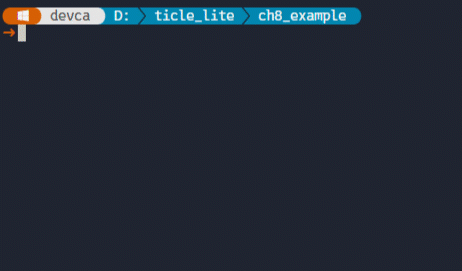</br>

> **한 걸음 더**  
> hello_designer.py의 MainWindow 생성자에 self.setupUi(self) 다음 줄에 self.dialValue.valueChanged.connect(self.statusBar().showMessage)처럼 추가 연결을 작성해 본다. setupUi 이후에 connect()를 추가하면 Qt Designer에서 설정한 연결을 그대로 유지하면서 파이썬 코드에서만 처리할 수 있는 슬롯을 자유롭게 붙일 수 있다.

### 시리얼 대시보드 GUI 
> **이 예제로 풀 문제**  
> 다음 절의 'pyserial + GUI'처럼 여러 개의 위젯을 코드로 작성하면 레이아웃 코드만 수십 줄이 된다. Qt Designer로 UI 파일을 만들고, pyside6-uic로 파이썬 클래스로 변환한 뒤 임포트하는 방법을 익혀 둔다.

pyside6-designer의 'File > New'를 선택한 후 "Main Window" 템플릿을 선택하고, MainWindow에서 Menu Bar만 제거한 후 Property Editor를 통해 windowTitle을 'Serial Board'로 변경한다.

이후 Widget Box의 Containers 항목에서 Group Box를 캔버스로 드래그하는데, 2회더 반복한다. 첫번째 Group Box를 선택한 상태에서 Property Editor에서 title을 "Serial"로 바꾼다. 두번째와 세번째 Group Box의 title은 "Pixel"과 "Sensor"로 바꾼다.

첫 번째 Group Box 안에 Label, Combo Box, Push  Button을 넣고, 두 번째 Group Box에는 Label 3개와 Horizontal Slider 3개 및 Widget을 넣는다. Widget은 형태가 없으므로 틀만 보인다. 세 번째 Group Box에는 Label 2개와 Dial 2개를 넣는다.

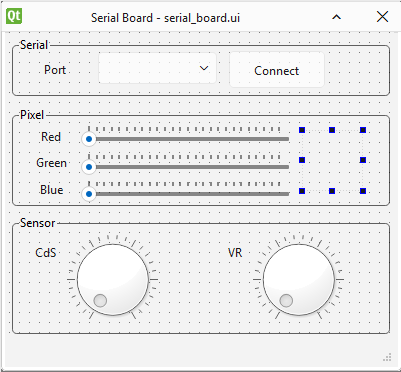</br>

각 위젯을 선택하고 Property Editor에서 속성을 다음과 같이 설정한다. 삭제하지 않은 Status Bar의 objectName은 기본값인 statusBar이다. 편집 과정에서 위젯의 위치를 세밀하게 이동할 때는 Ctrl을 누른 상태에서 방향키를 사용하고, 여러 위젯을 선택할 때는 Ctrl키를 누른 상태에서 마우스로 해당 위젯을 선택한다. 이렇게 선택한 위젯들은 Ctrl+C 복사 후 Ctrl+V로 붙여넣기가 가능하다. 

| Target | Widget | Property | Value |
|---|-|---|---|
| MainWindow |  | windowTitle | Serial Board |
| Group Box (Serial) | Label | text | Port |
||Combo Box | objectName | cmbPort |
||Push Button | objectName | btnConnect |
||  | text | Connect |
| Group Box (Pixel)| Label | text | Red |
|| Horizontal Slider | objectName | sldPixelRed |
||  | maximum | 255 |
||  | tickPosition | TicksAbove |
||  | tickInterval | 10 |
|| Label | text | Green |
|| Horizontal Slider | objectName | sldPixelGreen |
||  | maximum | 255 |
||  | tickPosition | TicksAbove |
||  | tickInterval | 10 |
|| Label | text | Blue |
|| Horizontal Slider | objectName | sldPixelBlue |
||  | maximum | 255 |
||  | tickPosition | TicksAbove |
||  | tickInterval | 10 |
|| Widget | objectName | widPixelColor |
| Group Box (Sensor)| Label | text | CdS |
|| Dial | objectName | dalSensorCds |
||  | notchesVisible | True |
||  | maximum | 100 |
|| Label | text | VR |
|| Dial | objectName | dalSensorVr |
||  | notchesVisible | True |
||  | maximum | 100 |

여기서는 시그널/슬롯 편집은 필요 없다. 작업이 완료되면 serial_board.ui로 저장한다.

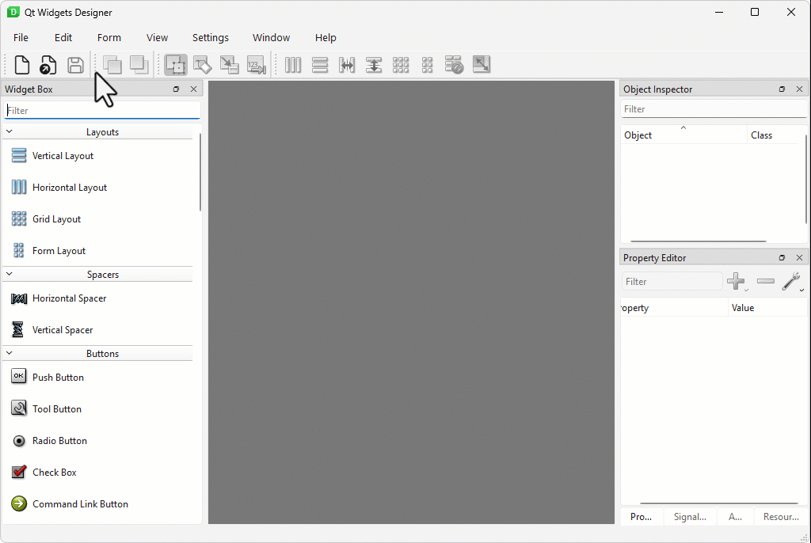</br>

> <details>
> <summary><b>serial_board.ui</b></summary>
>
>```xml
><?xml version="1.0" encoding="UTF-8"?>
><ui version="4.0">
> <class>MainWindow</class>
> <widget class="QMainWindow" name="MainWindow">
>  <property name="geometry">
>   <rect>
>    <x>0</x>
>    <y>0</y>
>    <width>374</width>
>    <height>333</height>
>   </rect>
>  </property>
>  <property name="windowTitle">
>   <string>Serial Board</string>
>  </property>
>  <widget class="QWidget" name="centralwidget">
>   <widget class="QGroupBox" name="groupBox">
>    <property name="geometry">
>     <rect>
>      <x>0</x>
>      <y>0</y>
>      <width>371</width>
>      <height>61</height>
>     </rect>
>    </property>
>    <property name="title">
>     <string>Serial</string>
>    </property>
>    <widget class="QLabel" name="label">
>     <property name="geometry">
>      <rect>
>       <x>10</x>
>       <y>24</y>
>       <width>49</width>
>       <height>16</height>
>      </rect>
>     </property>
>     <property name="text">
>      <string>Port</string>
>     </property>
>    </widget>
>    <widget class="QComboBox" name="cmbPort">
>     <property name="geometry">
>      <rect>
>       <x>70</x>
>       <y>20</y>
>       <width>121</width>
>       <height>26</height>
>      </rect>
>     </property>
>    </widget>
>    <widget class="QPushButton" name="btnConnect">
>     <property name="geometry">
>      <rect>
>       <x>200</x>
>       <y>20</y>
>       <width>81</width>
>       <height>26</height>
>      </rect>
>     </property>
>     <property name="text">
>      <string>Connect</string>
>     </property>
>    </widget>
>   </widget>
>   <widget class="QGroupBox" name="groupBox_2">
>    <property name="geometry">
>     <rect>
>      <x>0</x>
>      <y>64</y>
>      <width>371</width>
>      <height>101</height>
>     </rect>
>    </property>
>    <property name="title">
>     <string>Pixel</string>
>    </property>
>    <widget class="QLabel" name="label_2">
>     <property name="geometry">
>      <rect>
>       <x>10</x>
>       <y>20</y>
>       <width>49</width>
>       <height>16</height>
>      </rect>
>     </property>
>     <property name="text">
>      <string>Red</string>
>     </property>
>    </widget>
>    <widget class="QSlider" name="sldPixelRed">
>     <property name="geometry">
>      <rect>
>       <x>70</x>
>       <y>20</y>
>       <width>160</width>
>       <height>21</height>
>      </rect>
>     </property>
>     <property name="maximum">
>      <number>255</number>
>     </property>
>     <property name="orientation">
>      <enum>Qt::Orientation::Horizontal</enum>
>     </property>
>     <property name="tickPosition">
>      <enum>QSlider::TickPosition::TicksAbove</enum>
>     </property>
>     <property name="tickInterval">
>      <number>10</number>
>     </property>
>    </widget>
>    <widget class="QLabel" name="label_3">
>     <property name="geometry">
>      <rect>
>       <x>10</x>
>       <y>50</y>
>       <width>49</width>
>       <height>16</height>
>      </rect>
>     </property>
>     <property name="text">
>      <string>Green</string>
>     </property>
>    </widget>
>    <widget class="QSlider" name="sldPixelGreen">
>     <property name="geometry">
>      <rect>
>       <x>70</x>
>       <y>48</y>
>       <width>160</width>
>       <height>21</height>
>      </rect>
>     </property>
>     <property name="maximum">
>      <number>255</number>
>     </property>
>     <property name="orientation">
>      <enum>Qt::Orientation::Horizontal</enum>
>     </property>
>     <property name="tickPosition">
>      <enum>QSlider::TickPosition::TicksAbove</enum>
>     </property>
>     <property name="tickInterval">
>      <number>10</number>
>     </property>
>    </widget>
>    <widget class="QLabel" name="label_4">
>     <property name="geometry">
>      <rect>
>       <x>10</x>
>       <y>77</y>
>       <width>49</width>
>       <height>16</height>
>      </rect>
>     </property>
>     <property name="text">
>      <string>Blue</string>
>     </property>
>    </widget>
>    <widget class="QSlider" name="sldPixelBlue">
>     <property name="geometry">
>      <rect>
>       <x>70</x>
>       <y>77</y>
>       <width>160</width>
>       <height>21</height>
>      </rect>
>     </property>
>     <property name="maximum">
>      <number>255</number>
>     </property>
>     <property name="orientation">
>      <enum>Qt::Orientation::Horizontal</enum>
>     </property>
>     <property name="tickPosition">
>      <enum>QSlider::TickPosition::TicksAbove</enum>
>     </property>
>     <property name="tickInterval">
>      <number>10</number>
>     </property>
>    </widget>
>    <widget class="QWidget" name="widPixelColor" native="true">
>     <property name="geometry">
>      <rect>
>       <x>240</x>
>       <y>19</y>
>       <width>121</width>
>       <height>71</height>
>      </rect>
>     </property>
>    </widget>
>   </widget>
>   <widget class="QGroupBox" name="groupBox_3">
>    <property name="geometry">
>     <rect>
>      <x>0</x>
>      <y>170</y>
>      <width>371</width>
>      <height>141</height>
>     </rect>
>    </property>
>    <property name="title">
>     <string>Sensor</string>
>    </property>
>    <widget class="QLabel" name="label_5">
>     <property name="geometry">
>      <rect>
>       <x>30</x>
>       <y>40</y>
>       <width>31</width>
>       <height>16</height>
>      </rect>
>     </property>
>     <property name="text">
>      <string>CdS</string>
>     </property>
>    </widget>
>    <widget class="QDial" name="dalSensorCds">
>     <property name="geometry">
>      <rect>
>       <x>60</x>
>       <y>20</y>
>       <width>121</width>
>       <height>111</height>
>      </rect>
>     </property>
>     <property name="maximum">
>      <number>100</number>
>     </property>
>     <property name="notchesVisible">
>      <bool>true</bool>
>     </property>
>    </widget>
>    <widget class="QDial" name="dalSensorVr">
>     <property name="geometry">
>      <rect>
>       <x>224</x>
>       <y>20</y>
>       <width>121</width>
>       <height>111</height>
>      </rect>
>     </property>
>     <property name="maximum">
>      <number>100</number>
>     </property>
>     <property name="notchesVisible">
>      <bool>true</bool>
>     </property>
>    </widget>
>    <widget class="QLabel" name="label_6">
>     <property name="geometry">
>      <rect>
>       <x>194</x>
>       <y>40</y>
>       <width>31</width>
>       <height>16</height>
>      </rect>
>     </property>
>     <property name="text">
>      <string>VR</string>
>     </property>
>    </widget>
>   </widget>
>  </widget>
>  <widget class="QStatusBar" name="statusbar"/>
> </widget>
> <resources/>
> <connections/>
></ui>
>```
>
> </details>
</br>

설계가 끝나면 터미널에서 다음 명령으로 serial_board.ui를 serial_board_ui.py로 변환한다.

```sh
pyside6-uic serial_board.ui -o serial_board_ui.py
```

> <details>
> <summary><b>serial_board_ui.py</b></summary>
>
>```python
># -*- coding: utf-8 -*-
>
>################################################################################
>## Form generated from reading UI file 'serial_board.ui'
>##
>## Created by: Qt User Interface Compiler version 6.11.1
>##
>## WARNING! All changes made in this file will be lost when recompiling UI file!
>################################################################################
>
>from PySide6.QtCore import (QCoreApplication, QDate, QDateTime, QLocale,
>    QMetaObject, QObject, QPoint, QRect,
>    QSize, QTime, QUrl, Qt)
>from PySide6.QtGui import (QBrush, QColor, QConicalGradient, QCursor,
>    QFont, QFontDatabase, QGradient, QIcon,
>    QImage, QKeySequence, QLinearGradient, QPainter,
>    QPalette, QPixmap, QRadialGradient, QTransform)
>from PySide6.QtWidgets import (QApplication, QComboBox, QDial, QGroupBox,
>    QLabel, QMainWindow, QPushButton, QSizePolicy,
>    QSlider, QStatusBar, QWidget)
>
>class Ui_MainWindow(object):
>    def setupUi(self, MainWindow):
>        if not MainWindow.objectName():
>            MainWindow.setObjectName(u"MainWindow")
>        MainWindow.resize(374, 333)
>        self.centralwidget = QWidget(MainWindow)
>        self.centralwidget.setObjectName(u"centralwidget")
>        self.groupBox = QGroupBox(self.centralwidget)
>        self.groupBox.setObjectName(u"groupBox")
>        self.groupBox.setGeometry(QRect(0, 0, 371, 61))
>        self.label = QLabel(self.groupBox)
>        self.label.setObjectName(u"label")
>        self.label.setGeometry(QRect(10, 24, 49, 16))
>        self.cmbPort = QComboBox(self.groupBox)
>        self.cmbPort.setObjectName(u"cmbPort")
>        self.cmbPort.setGeometry(QRect(70, 20, 121, 26))
>        self.btnConnect = QPushButton(self.groupBox)
>        self.btnConnect.setObjectName(u"btnConnect")
>        self.btnConnect.setGeometry(QRect(200, 20, 81, 26))
>        self.groupBox_2 = QGroupBox(self.centralwidget)
>        self.groupBox_2.setObjectName(u"groupBox_2")
>        self.groupBox_2.setGeometry(QRect(0, 64, 371, 101))
>        self.label_2 = QLabel(self.groupBox_2)
>        self.label_2.setObjectName(u"label_2")
>        self.label_2.setGeometry(QRect(10, 20, 49, 16))
>        self.sldPixelRed = QSlider(self.groupBox_2)
>        self.sldPixelRed.setObjectName(u"sldPixelRed")
>        self.sldPixelRed.setGeometry(QRect(70, 20, 160, 21))
>        self.sldPixelRed.setMaximum(255)
>        self.sldPixelRed.setOrientation(Qt.Orientation.Horizontal)
>        self.sldPixelRed.setTickPosition(QSlider.TickPosition.TicksAbove)
>        self.sldPixelRed.setTickInterval(10)
>        self.label_3 = QLabel(self.groupBox_2)
>        self.label_3.setObjectName(u"label_3")
>        self.label_3.setGeometry(QRect(10, 50, 49, 16))
>        self.sldPixelGreen = QSlider(self.groupBox_2)
>        self.sldPixelGreen.setObjectName(u"sldPixelGreen")
>        self.sldPixelGreen.setGeometry(QRect(70, 48, 160, 21))
>        self.sldPixelGreen.setMaximum(255)
>        self.sldPixelGreen.setOrientation(Qt.Orientation.Horizontal)
>        self.sldPixelGreen.setTickPosition(QSlider.TickPosition.TicksAbove)
>        self.sldPixelGreen.setTickInterval(10)
>        self.label_4 = QLabel(self.groupBox_2)
>        self.label_4.setObjectName(u"label_4")
>        self.label_4.setGeometry(QRect(10, 77, 49, 16))
>        self.sldPixelBlue = QSlider(self.groupBox_2)
>        self.sldPixelBlue.setObjectName(u"sldPixelBlue")
>        self.sldPixelBlue.setGeometry(QRect(70, 77, 160, 21))
>        self.sldPixelBlue.setMaximum(255)
>        self.sldPixelBlue.setOrientation(Qt.Orientation.Horizontal)
>        self.sldPixelBlue.setTickPosition(QSlider.TickPosition.TicksAbove)
>        self.sldPixelBlue.setTickInterval(10)
>        self.widPixelColor = QWidget(self.groupBox_2)
>        self.widPixelColor.setObjectName(u"widPixelColor")
>        self.widPixelColor.setGeometry(QRect(240, 19, 121, 71))
>        self.groupBox_3 = QGroupBox(self.centralwidget)
>        self.groupBox_3.setObjectName(u"groupBox_3")
>        self.groupBox_3.setGeometry(QRect(0, 170, 371, 141))
>        self.label_5 = QLabel(self.groupBox_3)
>        self.label_5.setObjectName(u"label_5")
>        self.label_5.setGeometry(QRect(30, 40, 31, 16))
>        self.dalSensorCds = QDial(self.groupBox_3)
>        self.dalSensorCds.setObjectName(u"dalSensorCds")
>        self.dalSensorCds.setGeometry(QRect(60, 20, 121, 111))
>        self.dalSensorCds.setMaximum(100)
>        self.dalSensorCds.setNotchesVisible(True)
>        self.dalSensorVr = QDial(self.groupBox_3)
>        self.dalSensorVr.setObjectName(u"dalSensorVr")
>        self.dalSensorVr.setGeometry(QRect(224, 20, 121, 111))
>        self.dalSensorVr.setMaximum(100)
>        self.dalSensorVr.setNotchesVisible(True)
>        self.label_6 = QLabel(self.groupBox_3)
>        self.label_6.setObjectName(u"label_6")
>        self.label_6.setGeometry(QRect(194, 40, 31, 16))
>        MainWindow.setCentralWidget(self.centralwidget)
>        self.statusbar = QStatusBar(MainWindow)
>        self.statusbar.setObjectName(u"statusbar")
>        MainWindow.setStatusBar(self.statusbar)
>
>        self.retranslateUi(MainWindow)
>
>        QMetaObject.connectSlotsByName(MainWindow)
>    # setupUi
>
>    def retranslateUi(self, MainWindow):
>        MainWindow.setWindowTitle(QCoreApplication.translate("MainWindow", u"Serial Board", None))
>        self.groupBox.setTitle(QCoreApplication.translate("MainWindow", u"Serial", None))
>        self.label.setText(QCoreApplication.translate("MainWindow", u"Port", None))
>        self.btnConnect.setText(QCoreApplication.translate("MainWindow", u"Connect", None))
>        self.groupBox_2.setTitle(QCoreApplication.translate("MainWindow", u"Pixel", None))
>        self.label_2.setText(QCoreApplication.translate("MainWindow", u"Red", None))
>        self.label_3.setText(QCoreApplication.translate("MainWindow", u"Green", None))
>        self.label_4.setText(QCoreApplication.translate("MainWindow", u"Blue", None))
>        self.groupBox_3.setTitle(QCoreApplication.translate("MainWindow", u"Sensor", None))
>        self.label_5.setText(QCoreApplication.translate("MainWindow", u"CdS", None))
>        self.label_6.setText(QCoreApplication.translate("MainWindow", u"VR", None))
>    # retranslateUi
>```
>
> </details>
</br>

---

## pyserial + GUI

> **풀고 싶은 문제**  
> TiCLE Lite가 USB로 연결되어 있을 때, PC GUI 앱의 버튼을 눌러 직렬 포트로 색상 명령을 보내고, 보드가 주기적으로 출력하는 센서값이 윈도우에 실시간으로 표시되도록 만들 수 있을까?

시리얼 포트 통신은 네트워크 설정 없이 USB 케이블 하나로 PC와 TiCLE Lite를 연결하는 가장 기본적인 방식이다. PC에서는 pyserial이 제공하는 Serial 클래스로 직렬 포트를 열고, TiCLE Lite에서는 termio 모듈의 ReplSerial로 같은 포트를 읽고 쓴다. replx 툴이 내부에서 pyserial을 사용하므로 PC에는 별도 설치가 필요 없다.

이 절에서는 TiCLE Lite가 100ms마다 CdS와 VR 센서값을 직렬 포트로 전송하고, PC GUI의 슬라이더를 움직이면 RGB 값이 보드로 전달되어 Pixel Display 보드 색이 바뀌는 양방향 통신 프로그램을 만든다.

### TiCLE Lite 펌웨어 프로그램

> **이 예제로 풀 문제**  
> PC GUI가 직렬 포트로 보낸 색상 명령을 보드가 이해하고, 보드가 읽은 센서값을 다시 PC로 돌려보내게 하려면 어떤 문자열 규칙이 필요할까? 직렬 기반 양방향 프로토콜을 먼저 고정한다.


3장과 4장에서 배운 Ain과 Matrix를 그대로 사용하되, termio의 ReplSerial을 추가해 직렬 포트 읽기와 쓰기를 결합한다. 루프마다 PC가 보낸 RGB 값이 있으면 픽셀에 반영하고, 없으면 100ms 간격으로 센서값을 PC에 전송한다.

```python
# serial_board_firmware.py
import time
from ticle_lite.ain import Ain
from ticle_lite.ws2812 import Matrix
from termio import ReplSerial

ain = Ain([27, 28], bits=12) # GP27: VR, GP28: CdS, 12-bit ADC
mat = Matrix(0, brightness=0.2)  # GP0: WS2812 data pin
ser = ReplSerial(timeout=0) # non-blocking

t0 = time.ticks_ms()
try:
    while True:
        rgb = ser.read_until(b'\n').decode().strip() # Read RGB value("[r, g, b]") sent from PC
        if rgb:
            if rgb.startswith('[') and rgb.endswith(']') and len(rgb.split(',')) == 3:
                try:
                    r, g, b = map(int, rgb[1:-1].split(','))
                    mat.fill((r, g, b))
                    mat.update()
                except ValueError:
                    pass
        else:
            if time.ticks_diff(time.ticks_ms(), t0) > 100:
                # Update VR and CdS value
                vr = ain[0].read_percent()
                cds = ain[1].read_percent()
                ser.write(f"{cds} {vr}\n".encode())  # Send data("cds, vr") to PC
                t0 = time.ticks_ms()
        time.sleep_ms(20)
finally:
    ser.close()
    ain.deinit()
    mat.deinit()
```

**코드 해설**

ReplSerial(timeout=0)은 비차단 모드로 직렬 포트를 연다. read_until(b'\n')을 호출했을 때 수신된 데이터가 없으면 즉시 빈 바이트열을 반환하므로 시리얼 데이터를 기다리느라 루프가 멈추지 않는다.

루프는 읽기를 먼저 시도하는 구조다. rgb에 값이 있으면 "[r, g, b]" 형식인지 검사한 뒤 정수로 변환해 매트릭스에 적용한다. startswith, endswith, split(',')으로 형식을 확인하고 map(int, ...)으로 변환하는 과정에서 잘못된 값이 들어오면 ValueError가 발생할 수 있으므로 try/except로 감싸 그 경우에는 조용히 넘어간다.

rgb가 빈 문자열이면 PC가 아무것도 보내지 않은 상태이므로 time.ticks_diff로 마지막 전송 이후 경과 시간을 확인한다. 100ms를 넘으면 ain[0].read_percent()와 ain[1].read_percent()로 VR과 CdS 퍼센트값을 읽어 f"{cds} {vr}\n" 형식의 문자열로 PC에 전송한 뒤 t0를 갱신한다. 루프 끝의 sleep_ms(20)은 한 주기를 약 20ms로 제한해 CPU를 독점하지 않도록 한다. finally 블록은 루프가 정상 종료되거나 예외로 중단될 때 모두 실행되어 직렬 포트와 주변기기를 안전하게 정리한다.

**실행 결과와 확인할 점**

펌웨어는 replx와 동일한 시리얼 통신을 수행하므로, 지금까지와 다르게 동작 검증한 후 replx와 분리해 실행한다. 먼저 replx run --text 명령으로 동작을 검증하는데, Ctr+T를 눌려 반드시 구문 문자를 LF('\n')으로 변경해야 한다. 예상대로 동작하면 다시 replx run -n 으로 실행하는데, 이렇게 하면 replx는 대기하지 않고 즉시 종료한다. 이후 replx shutdown을 실행해 에이전트가 관리하는 시리얼 포트를 해제해야 PC GUI가 같은 포트에 연결할 수 있다. 보드는 에이전트 종료와 무관하게 독립적으로 실행 중이므로 PC GUI가 연결하기 전까지 픽셀은 꺼져 있고 센서값은 계속 전송되고 있다.

replx run --text로 실행하면 터미널에 보드가 출력하는 "cds vr" 형식의 센서값이 100ms마다 나타난다. Ctrl+T를 눌러 줄 끝 문자를 LF로 바꾼 뒤 터미널에 [255, 0, 0]을 입력하고 Enter를 누르면 픽셀이 빨간색으로 바뀌어야 한다. [0, 0, 0]을 입력하면 꺼진다. 형식이 올바르지 않은 문자열을 입력해도 보드가 조용히 무시하는지 확인한다.

</br>


### PC GUI 프로그램

> **이 예제로 풀 문제**  
> 사용자는 슬라이더로 색을 바꾸고 싶고, 동시에 보드에서 올라오는 센서값도 끊김 없이 보고 싶다. 직렬 송신과 수신을 한 창 안에서 충돌 없이 묶는 구조를 만든다.


앞 절 Qt Designer에서 설계하고 변환한 serial_board_ui.py를 임포트해 Ui_MainWindow로 사용한다. 레이아웃 코드는 한 줄도 직접 작성하지 않고 신호 연결과 직렬 통신 로직에만 집중한다. GUI와 별도 스레드가 함께 동작하는 구조에서 스레드가 위젯을 직접 수정하면 프로그램이 예기치 않게 종료될 수 있으므로 Bridge(QObject) 패턴으로 스레드 간 데이터를 안전하게 전달한다.

```python
# serial_board.py
import sys
import threading
import serial
import serial.tools.list_ports
from PySide6.QtWidgets import QApplication, QMainWindow, QStyle
from PySide6.QtCore import Qt, Signal, QObject
from serial_board_ui import Ui_MainWindow

class Bridge(QObject):
    #  Signal to send received data from the read thread to the main thread
    received = Signal(str)

class MainWindow(QMainWindow, Ui_MainWindow):
    def __init__(self):
        super().__init__()
        self.setupUi(self)
        icon = self.style().standardIcon(QStyle.StandardPixmap.SP_ComputerIcon)
        self.setWindowIcon(icon)
        self.setWindowFlags(self.windowFlags() | Qt.MSWindowsFixedSizeDialogHint)

        self.statusbar.showMessage("Ready")

        # Make sensor widgets non-interactive
        for widget in [self.dalSensorCds, self.dalSensorVr]:
            widget.setAttribute(Qt.WidgetAttribute.WA_TransparentForMouseEvents)
            widget.setFocusPolicy(Qt.FocusPolicy.NoFocus)

        # Populate the combo box with available serial ports
        for p in serial.tools.list_ports.comports():
            self.cmbPort.addItem(p.device)

        self.btnConnect.clicked.connect(self.on_toggle_connect)
        self.color = [0, 0, 0]
        self.sldPixelRed.sliderReleased.connect(
            lambda: self.update_color(0, self.sldPixelRed.value())
        )
        self.sldPixelGreen.sliderReleased.connect(
            lambda: self.update_color(1, self.sldPixelGreen.value())
        )
        self.sldPixelBlue.sliderReleased.connect(
            lambda: self.update_color(2, self.sldPixelBlue.value())
        )

        self.ser = None
        self._stop_event = threading.Event() # Event to signal the read thread to stop
        self._read_thread = None
        self.bridge = Bridge() # Bridge instance to handle communication between threads
        # Connect the signal to the slot to update the UI when data is received
        self.bridge.received.connect(self.on_received) 

    def update_color(self, index, value):
        self.color[index] = value
        self.widPixelColor.setStyleSheet(f"""
                                         background-color: 
                                           rgb({self.color[0]}, 
                                           {self.color[1]}, 
                                           {self.color[2]})
                                         """)
    
        if self.ser and self.ser.is_open:
            self.ser.write((f"{self.color}" + "\n").encode())
            self.statusbar.showMessage(f"Sent: {self.color}")
    
    def on_toggle_connect(self):
        if self.ser is None:
            port = self.cmbPort.currentText()
            try:
                self.ser = serial.Serial(port, 115200, timeout=0)
                self.btnConnect.setText("Disconnect")
                self.statusbar.showMessage(f"Connected: {port}")
                self._stop_event.clear()
                self._read_thread = threading.Thread(target=self._task_read_loop, daemon=True)
                self._read_thread.start()
            except Exception as e:
                self.statusbar.showMessage(f"Error: {e}")
        else:
            self._stop_event.set()
            self.ser.close()
            self.ser = None
            if self._read_thread is not None:
                self._read_thread.join(timeout=2)
                self._read_thread = None
            self.btnConnect.setText("Connect")
            self.statusbar.showMessage("Disconnected")

    def on_received(self, msg):
        self.statusbar.showMessage("Received: {}".format(msg))
        try:
            cds_val, vr_val = msg.split()
            self.dalSensorCds.setValue(int(float(cds_val)))
            self.dalSensorVr.setValue(int(float(vr_val)))
        except ValueError:
            pass

    def _task_read_loop(self):
        while not self._stop_event.is_set() and self.ser and self.ser.is_open:
            try:
                line = self.ser.readline().decode().strip()
                if line:
                    self.bridge.received.emit(line)
            except Exception:
                break

if __name__ == '__main__':
    app = QApplication(sys.argv)
    window = MainWindow()
    window.show()
    sys.exit(app.exec())
```

**코드 해설**

MainWindow는 QMainWindow와 Ui_MainWindow를 동시에 상속한다. setupUi(self) 한 줄로 Qt Designer에서 배치한 모든 위젯이 창에 적용되고, 각 위젯은 Qt Designer에서 지정한 objectName으로 접근한다.

생성자에서 dalSensorCds와 dalSensorVr에 WA_TransparentForMouseEvents를 설정하면 다이얼이 마우스 입력을 무시하는 표시 전용 위젯이 된다. serial.tools.list_ports.comports()는 현재 시스템에 연결된 직렬 포트 목록을 반환하며, 각 포트의 device 속성을 콤보박스에 추가한다.

슬라이더는 valueChanged 대신 sliderReleased 신호에 연결했다. valueChanged는 슬라이더를 움직이는 동안 픽셀 하나마다 신호가 발생해 직렬 포트에 명령이 쏟아지지만, sliderReleased는 손을 뗄 때만 한 번 발생하므로 보드가 처리할 수 있는 속도로만 명령을 보낸다.

Bridge(QObject)는 수신 전용 신호 객체다. 직렬 포트 읽기는 threading.Thread로 만든 백그라운드 스레드 _task_read_loop에서 실행되는데, 이 스레드에서 위젯을 직접 수정하면 Qt의 GUI 스레드 안전 제약을 위반한다. Bridge.received 신호를 emit하면 Qt 이벤트 큐를 통해 메인 스레드의 on_received 슬롯으로 데이터가 전달되므로 스레드 간 안전한 GUI 업데이트가 보장된다.

on_toggle_connect는 self.ser의 존재 여부로 연결 상태를 판단한다. 연결할 때는 Serial을 열고 _stop_event를 초기화한 뒤 읽기 스레드를 시작한다. 해제할 때는 _stop_event를 설정해 읽기 루프가 자연스럽게 탈출하도록 한 뒤, 포트를 닫고 join으로 스레드가 완전히 종료될 때까지 기다린다.

update_color는 슬라이더 값을 self.color 리스트에 기록하고 widPixelColor에 setStyleSheet으로 현재 색을 미리 보여 준다. 포트가 열려 있으면 f"{self.color}\n"을 전송하는데, 파이썬 리스트를 f-string으로 변환하면 "[r, g, b]" 형식이 되어 펌웨어가 기대하는 형식과 일치한다.

**실행 결과와 확인할 점**

창이 열리면 콤보박스에 현재 연결된 직렬 포트 목록이 표시되고 상태 바에 "Ready"가 나타난다. TiCLE Lite가 연결된 포트를 선택하고 Connect를 누르면 버튼 텍스트가 "Disconnect"로 바뀌고 상태 바에 연결된 포트가 표시된다. 이후 100ms마다 보드에서 센서값이 수신되어 CdS와 VR 다이얼이 자동으로 움직인다.

Red, Green, Blue 슬라이더를 움직인 뒤 손을 떼면 색 미리보기 위젯의 색이 바뀌고 상태 바에 전송된 값이 표시된다. 동시에 보드의 Pixel Display 보드 색이 슬라이더 값과 같은 색으로 바뀐다. Disconnect를 누르면 읽기 스레드가 멈추고 포트가 해제되어 상태 바에 "Disconnected"가 표시된다.

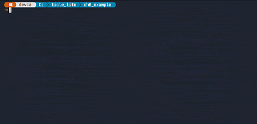</br>


> **한 걸음 더**  
> sldPixelRed의 sliderReleased를 valueChanged로 바꾸어 본다. 슬라이더를 빠르게 움직이면 명령이 쏟아지면서 보드와 PC의 반응이 어떻게 달라지는지 확인한다. 또는 self.color가 [0, 0, 0]일 때 상태 바에 "Pixel off" 메시지를 표시하는 조건을 update_color 안에 추가해 본다.

---

## paho-mqtt + GUI

> **풀고 싶은 문제**  
> TiCLE Lite가 Wi-Fi로 MQTT 브로커에 연결되어 있을 때, PC GUI 앱에서 브로커 주소를 입력하고 Connect를 누르면 센서값이 실시간으로 표시되고, 슬라이더를 움직이면 Pixel Display 보드 색이 바뀌도록 만들 수 있을까?

앞 절의 'pyserial + GUI'와 흐름은 같다. TiCLE Lite는 주기적으로 센서값을 MQTT 토픽으로 발행하고 RGB 명령 토픽을 구독한다. PC GUI는 연결하면 센서 토픽을 구독하고, 슬라이더를 움직이면 RGB 토픽을 발행한다. 달라지는 것은 USB 직렬 포트 대신 Wi-Fi 위의 MQTT 브로커를 경유한다는 점이다. paho-mqtt 콜백은 내부 스레드에서 호출되는데, PySide6-PahoMqtt 래퍼가 이 콜백을 PySide6 Signal로 자동 변환해 준다. Bridge(QObject)를 직접 만들지 않아도 슬롯에서 안전하게 위젯을 갱신할 수 있다.

두 장치 사이의 토픽 약속은 다음과 같다.

| 방향 | 토픽 | 내용 |
| ---- | ---- | ---- |
| PC → TiCLE Lite | board/rgb | 색상 값 "[r, g, b]" |
| TiCLE Lite → PC | board/sensor | CdS와 VR 퍼센트 "cds vr" |

이번 절은 6장에서 소개한 nanoMQ 브로커가 실행 중이어야 하고, TiCLE Lite와 PC 모두 브로커와 통신할 수 있어야 한다.

### MQTT 대시보드 GUI

> **이 예제로 풀 문제**  
> USB 케이블 없이도 다른 방에 있는 보드 상태를 같은 GUI로 보고 제어할 수 있을까? 직렬 대시보드 구조를 MQTT 브로커 기반 원격 제어 도구로 확장한다.


앞 절의 serial_board.ui에서 바꾸어야 할 위젯은 하나뿐이다. Designer에서 serial_board.ui를 불러온다.

```sh
pyside6-designer serial_board.ui
```

Group Box (Serial)의 안의 cmbPort(QComboBox)를 삭제하고 같은 자리에 QLineEdit를 배치한 뒤 아래 표의 속성을 설정한다. Group Box와 Lable은 title과 text를 수정하고 나머지 위젯은 그대로 유지한다.

| Target | Widget | Property | Value |
|---|---|---|---|
| Group Box (Serial) |  | title | MQTT Broker |
|| Label | text | Broker |
|| QLineEdit | objectName | edtBroker |
||  | placeholderText | Broker IP |


수정이 끝나면 mqtt_board.ui로 저장하고 pyside6-uic를 이용해 .py로 변환한다.

```sh
pyside6-uic mqtt_board.ui -o mqtt_board_ui.py
```

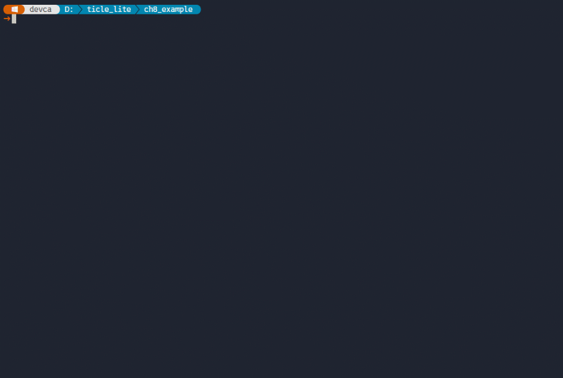</br>

> <details>
> <summary><b>mqtt_board.ui</b></summary>
>
>```xml
><?xml version="1.0" encoding="UTF-8"?>
><ui version="4.0">
> <class>MainWindow</class>
> <widget class="QMainWindow" name="MainWindow">
>  <property name="geometry">
>   <rect>
>    <x>0</x>
>    <y>0</y>
>    <width>374</width>
>    <height>333</height>
>   </rect>
>  </property>
>  <property name="windowTitle">
>   <string>Serial Board</string>
>  </property>
>  <widget class="QWidget" name="centralwidget">
>   <widget class="QGroupBox" name="groupBox">
>    <property name="geometry">
>     <rect>
>      <x>0</x>
>      <y>0</y>
>      <width>371</width>
>      <height>61</height>
>     </rect>
>    </property>
>    <property name="title">
>     <string>MQTT Broker</string>
>    </property>
>    <widget class="QLabel" name="label">
>     <property name="geometry">
>      <rect>
>       <x>10</x>
>       <y>24</y>
>       <width>49</width>
>       <height>16</height>
>      </rect>
>     </property>
>     <property name="text">
>      <string>Broker</string>
>     </property>
>    </widget>
>    <widget class="QPushButton" name="btnConnect">
>     <property name="geometry">
>      <rect>
>       <x>200</x>
>       <y>20</y>
>       <width>81</width>
>       <height>26</height>
>      </rect>
>     </property>
>     <property name="text">
>      <string>Connect</string>
>     </property>
>    </widget>
>    <widget class="QLineEdit" name="edtBroker">
>     <property name="geometry">
>      <rect>
>       <x>73</x>
>       <y>20</y>
>       <width>121</width>
>       <height>26</height>
>      </rect>
>     </property>
>     <property name="placeholderText">
>      <string>Broker IP</string>
>     </property>
>    </widget>
>   </widget>
>   <widget class="QGroupBox" name="groupBox_2">
>    <property name="geometry">
>     <rect>
>      <x>0</x>
>      <y>64</y>
>      <width>371</width>
>      <height>101</height>
>     </rect>
>    </property>
>    <property name="title">
>     <string>Pixel</string>
>    </property>
>    <widget class="QLabel" name="label_2">
>     <property name="geometry">
>      <rect>
>       <x>10</x>
>       <y>20</y>
>       <width>49</width>
>       <height>16</height>
>      </rect>
>     </property>
>     <property name="text">
>      <string>Red</string>
>     </property>
>    </widget>
>    <widget class="QSlider" name="sldPixelRed">
>     <property name="geometry">
>      <rect>
>       <x>70</x>
>       <y>20</y>
>       <width>160</width>
>       <height>21</height>
>      </rect>
>     </property>
>     <property name="maximum">
>      <number>255</number>
>     </property>
>     <property name="orientation">
>      <enum>Qt::Orientation::Horizontal</enum>
>     </property>
>     <property name="tickPosition">
>      <enum>QSlider::TickPosition::TicksAbove</enum>
>     </property>
>     <property name="tickInterval">
>      <number>10</number>
>     </property>
>    </widget>
>    <widget class="QLabel" name="label_3">
>     <property name="geometry">
>      <rect>
>       <x>10</x>
>       <y>50</y>
>       <width>49</width>
>       <height>16</height>
>      </rect>
>     </property>
>     <property name="text">
>      <string>Green</string>
>     </property>
>    </widget>
>    <widget class="QSlider" name="sldPixelGreen">
>     <property name="geometry">
>      <rect>
>       <x>70</x>
>       <y>48</y>
>       <width>160</width>
>       <height>21</height>
>      </rect>
>     </property>
>     <property name="maximum">
>      <number>255</number>
>     </property>
>     <property name="orientation">
>      <enum>Qt::Orientation::Horizontal</enum>
>     </property>
>     <property name="tickPosition">
>      <enum>QSlider::TickPosition::TicksAbove</enum>
>     </property>
>     <property name="tickInterval">
>      <number>10</number>
>     </property>
>    </widget>
>    <widget class="QLabel" name="label_4">
>     <property name="geometry">
>      <rect>
>       <x>10</x>
>       <y>77</y>
>       <width>49</width>
>       <height>16</height>
>      </rect>
>     </property>
>     <property name="text">
>      <string>Blue</string>
>     </property>
>    </widget>
>    <widget class="QSlider" name="sldPixelBlue">
>     <property name="geometry">
>      <rect>
>       <x>70</x>
>       <y>77</y>
>       <width>160</width>
>       <height>21</height>
>      </rect>
>     </property>
>     <property name="maximum">
>      <number>255</number>
>     </property>
>     <property name="orientation">
>      <enum>Qt::Orientation::Horizontal</enum>
>     </property>
>     <property name="tickPosition">
>      <enum>QSlider::TickPosition::TicksAbove</enum>
>     </property>
>     <property name="tickInterval">
>      <number>10</number>
>     </property>
>    </widget>
>    <widget class="QWidget" name="widPixelColor" native="true">
>     <property name="geometry">
>      <rect>
>       <x>240</x>
>       <y>19</y>
>       <width>121</width>
>       <height>71</height>
>      </rect>
>     </property>
>    </widget>
>   </widget>
>   <widget class="QGroupBox" name="groupBox_3">
>    <property name="geometry">
>     <rect>
>      <x>0</x>
>      <y>170</y>
>      <width>371</width>
>      <height>141</height>
>     </rect>
>    </property>
>    <property name="title">
>     <string>Sensor</string>
>    </property>
>    <widget class="QLabel" name="label_5">
>     <property name="geometry">
>      <rect>
>       <x>30</x>
>       <y>40</y>
>       <width>31</width>
>       <height>16</height>
>      </rect>
>     </property>
>     <property name="text">
>      <string>CdS</string>
>     </property>
>    </widget>
>    <widget class="QDial" name="dalSensorCds">
>     <property name="geometry">
>      <rect>
>       <x>60</x>
>       <y>20</y>
>       <width>121</width>
>       <height>111</height>
>      </rect>
>     </property>
>     <property name="maximum">
>      <number>100</number>
>     </property>
>     <property name="notchesVisible">
>      <bool>true</bool>
>     </property>
>    </widget>
>    <widget class="QDial" name="dalSensorVr">
>     <property name="geometry">
>      <rect>
>       <x>224</x>
>       <y>20</y>
>       <width>121</width>
>       <height>111</height>
>      </rect>
>     </property>
>     <property name="maximum">
>      <number>100</number>
>     </property>
>     <property name="notchesVisible">
>      <bool>true</bool>
>     </property>
>    </widget>
>    <widget class="QLabel" name="label_6">
>     <property name="geometry">
>      <rect>
>       <x>194</x>
>       <y>40</y>
>       <width>31</width>
>       <height>16</height>
>      </rect>
>     </property>
>     <property name="text">
>      <string>VR</string>
>     </property>
>    </widget>
>   </widget>
>  </widget>
>  <widget class="QStatusBar" name="statusbar"/>
> </widget>
> <resources/>
> <connections/>
></ui>
>```
>
> </details>
</br>


> <details>
> <summary><b>mqtt_board_ui.py</b></summary>
>
>```python
># -*- coding: utf-8 -*-
>
>################################################################################
>## Form generated from reading UI file 'mqtt_board.ui'
>##
>## Created by: Qt User Interface Compiler version 6.11.1
>##
>## WARNING! All changes made in this file will be lost when recompiling UI file!
>################################################################################
>
>from PySide6.QtCore import (QCoreApplication, QDate, QDateTime, QLocale,
>    QMetaObject, QObject, QPoint, QRect,
>    QSize, QTime, QUrl, Qt)
>from PySide6.QtGui import (QBrush, QColor, QConicalGradient, QCursor,
>    QFont, QFontDatabase, QGradient, QIcon,
>    QImage, QKeySequence, QLinearGradient, QPainter,
>    QPalette, QPixmap, QRadialGradient, QTransform)
>from PySide6.QtWidgets import (QApplication, QDial, QGroupBox, QLabel,
>    QLineEdit, QMainWindow, QPushButton, QSizePolicy,
>    QSlider, QStatusBar, QWidget)
>
>class Ui_MainWindow(object):
>    def setupUi(self, MainWindow):
>        if not MainWindow.objectName():
>            MainWindow.setObjectName(u"MainWindow")
>        MainWindow.resize(374, 333)
>        self.centralwidget = QWidget(MainWindow)
>        self.centralwidget.setObjectName(u"centralwidget")
>        self.groupBox = QGroupBox(self.centralwidget)
>        self.groupBox.setObjectName(u"groupBox")
>        self.groupBox.setGeometry(QRect(0, 0, 371, 61))
>        self.label = QLabel(self.groupBox)
>        self.label.setObjectName(u"label")
>        self.label.setGeometry(QRect(10, 24, 49, 16))
>        self.btnConnect = QPushButton(self.groupBox)
>        self.btnConnect.setObjectName(u"btnConnect")
>        self.btnConnect.setGeometry(QRect(200, 20, 81, 26))
>        self.edtBroker = QLineEdit(self.groupBox)
>        self.edtBroker.setObjectName(u"edtBroker")
>        self.edtBroker.setGeometry(QRect(73, 20, 121, 26))
>        self.groupBox_2 = QGroupBox(self.centralwidget)
>        self.groupBox_2.setObjectName(u"groupBox_2")
>        self.groupBox_2.setGeometry(QRect(0, 64, 371, 101))
>        self.label_2 = QLabel(self.groupBox_2)
>        self.label_2.setObjectName(u"label_2")
>        self.label_2.setGeometry(QRect(10, 20, 49, 16))
>        self.sldPixelRed = QSlider(self.groupBox_2)
>        self.sldPixelRed.setObjectName(u"sldPixelRed")
>        self.sldPixelRed.setGeometry(QRect(70, 20, 160, 21))
>        self.sldPixelRed.setMaximum(255)
>        self.sldPixelRed.setOrientation(Qt.Orientation.Horizontal)
>        self.sldPixelRed.setTickPosition(QSlider.TickPosition.TicksAbove)
>        self.sldPixelRed.setTickInterval(10)
>        self.label_3 = QLabel(self.groupBox_2)
>        self.label_3.setObjectName(u"label_3")
>        self.label_3.setGeometry(QRect(10, 50, 49, 16))
>        self.sldPixelGreen = QSlider(self.groupBox_2)
>        self.sldPixelGreen.setObjectName(u"sldPixelGreen")
>        self.sldPixelGreen.setGeometry(QRect(70, 48, 160, 21))
>        self.sldPixelGreen.setMaximum(255)
>        self.sldPixelGreen.setOrientation(Qt.Orientation.Horizontal)
>        self.sldPixelGreen.setTickPosition(QSlider.TickPosition.TicksAbove)
>        self.sldPixelGreen.setTickInterval(10)
>        self.label_4 = QLabel(self.groupBox_2)
>        self.label_4.setObjectName(u"label_4")
>        self.label_4.setGeometry(QRect(10, 77, 49, 16))
>        self.sldPixelBlue = QSlider(self.groupBox_2)
>        self.sldPixelBlue.setObjectName(u"sldPixelBlue")
>        self.sldPixelBlue.setGeometry(QRect(70, 77, 160, 21))
>        self.sldPixelBlue.setMaximum(255)
>        self.sldPixelBlue.setOrientation(Qt.Orientation.Horizontal)
>        self.sldPixelBlue.setTickPosition(QSlider.TickPosition.TicksAbove)
>        self.sldPixelBlue.setTickInterval(10)
>        self.widPixelColor = QWidget(self.groupBox_2)
>        self.widPixelColor.setObjectName(u"widPixelColor")
>        self.widPixelColor.setGeometry(QRect(240, 19, 121, 71))
>        self.groupBox_3 = QGroupBox(self.centralwidget)
>        self.groupBox_3.setObjectName(u"groupBox_3")
>        self.groupBox_3.setGeometry(QRect(0, 170, 371, 141))
>        self.label_5 = QLabel(self.groupBox_3)
>        self.label_5.setObjectName(u"label_5")
>        self.label_5.setGeometry(QRect(30, 40, 31, 16))
>        self.dalSensorCds = QDial(self.groupBox_3)
>        self.dalSensorCds.setObjectName(u"dalSensorCds")
>        self.dalSensorCds.setGeometry(QRect(60, 20, 121, 111))
>        self.dalSensorCds.setMaximum(100)
>        self.dalSensorCds.setNotchesVisible(True)
>        self.dalSensorVr = QDial(self.groupBox_3)
>        self.dalSensorVr.setObjectName(u"dalSensorVr")
>        self.dalSensorVr.setGeometry(QRect(224, 20, 121, 111))
>        self.dalSensorVr.setMaximum(100)
>        self.dalSensorVr.setNotchesVisible(True)
>        self.label_6 = QLabel(self.groupBox_3)
>        self.label_6.setObjectName(u"label_6")
>        self.label_6.setGeometry(QRect(194, 40, 31, 16))
>        MainWindow.setCentralWidget(self.centralwidget)
>        self.statusbar = QStatusBar(MainWindow)
>        self.statusbar.setObjectName(u"statusbar")
>        MainWindow.setStatusBar(self.statusbar)
>
>        self.retranslateUi(MainWindow)
>
>        QMetaObject.connectSlotsByName(MainWindow)
>    # setupUi
>
>    def retranslateUi(self, MainWindow):
>        MainWindow.setWindowTitle(QCoreApplication.translate("MainWindow", u"Serial Board", None))
>        self.groupBox.setTitle(QCoreApplication.translate("MainWindow", u"MQTT Broker", None))
>        self.label.setText(QCoreApplication.translate("MainWindow", u"Broker", None))
>        self.btnConnect.setText(QCoreApplication.translate("MainWindow", u"Connect", None))
>        self.edtBroker.setPlaceholderText(QCoreApplication.translate("MainWindow", u"Broker IP", None))
>        self.groupBox_2.setTitle(QCoreApplication.translate("MainWindow", u"Pixel", None))
>        self.label_2.setText(QCoreApplication.translate("MainWindow", u"Red", None))
>        self.label_3.setText(QCoreApplication.translate("MainWindow", u"Green", None))
>        self.label_4.setText(QCoreApplication.translate("MainWindow", u"Blue", None))
>        self.groupBox_3.setTitle(QCoreApplication.translate("MainWindow", u"Sensor", None))
>        self.label_5.setText(QCoreApplication.translate("MainWindow", u"CdS", None))
>        self.label_6.setText(QCoreApplication.translate("MainWindow", u"VR", None))
>    # retranslateUi
>```
>
> </details>
</br>

### TiCLE Lite 펌웨어 프로그램

> **이 예제로 풀 문제**  
> MQTT GUI가 보낸 RGB 명령을 받아 픽셀 색을 바꾸고, 현재 센서 상태를 주기적으로 다시 GUI에 올리게 하려면 보드는 어떤 토픽 약속을 따라야 할까? 발행과 구독 규칙을 펌웨어 쪽에서 먼저 확정한다.


펌웨어는 pyserial + GUI 절의 firmware 코드에서 ReplSerial을 upaho의 Client로 교체한다. 루프마다 client.loop()를 호출해 수신 메시지를 처리하고, 100ms마다 센서값을 board/sensor 토픽으로 발행한다. RGB 값이 도착하면 on_message 콜백에서 픽셀에 적용한다.

```python
# mqtt_board_firmware.py
import time
from wifi import Wifi
from upaho import Client
from ticle_lite.ain import Ain
from ticle_lite.ws2812 import Matrix

BROKER = "192.168.100.10"  # Wi-Fi IP address of the PC running NanoMQ

if not Wifi.is_connected():
    raise RuntimeError("Wi-Fi is not connected")

ain = Ain([27, 28])         # GP27: VR, GP28: CdS
mat = Matrix(0, brightness=0.2)

def on_message(client, userdata, msg):
    rgb = msg.payload.decode().strip()
    if rgb.startswith('[') and rgb.endswith(']') and len(rgb.split(',')) == 3:
        try:
            r, g, b = map(int, rgb[1:-1].split(','))
            mat.fill((r, g, b))
            mat.update()
        except ValueError:
            pass

# let broker assign a unique client ID automatically
client = Client("")
client._auto_reconnect = True
client.on_message = on_message
client.connect(BROKER)
client.subscribe("board/rgb")

t0 = time.ticks_ms()
try:
    while True:
        client.loop(timeout=0.02) # 20ms loop to handle MQTT events
        if time.ticks_diff(time.ticks_ms(), t0) > 100:
            vr = ain[0].read_percent()
            cds = ain[1].read_percent()
            client.publish("board/sensor", f"{cds} {vr}")
            t0 = time.ticks_ms()
finally:
    client.disconnect()
    ain.deinit()
    mat.deinit()
```

**코드 해설**

pyserial + GUI 펌웨어와 루프 구조가 같다. 달라진 점은 다음과 같다.

첫째, ReplSerial 대신 Wi-Fi 연결 확인 후 Client로 브로커에 접속한다. client._auto_reconnect = True를 설정하면 예기치 않은 연결 끊김 이후 upaho가 자동으로 재연결을 시도한다. 둘째, read_until 루프 대신 on_message 콜백을 등록해 board/rgb 토픽 메시지를 처리한다. 셋째, 센서값을 직렬 포트로 쓰는 대신 board/sensor 토픽으로 발행한다.

client.loop(timeout=0.02)는 최대 20ms 동안 브로커 패킷을 기다리며 처리한다. 이전 코드의 sleep_ms(20) 역할을 loop 대기 시간이 대신하므로 별도의 sleep을 추가하지 않는다. 100ms 타이머는 루프가 실행될 때마다 경과 시간을 검사하므로 루프 주기에 상관없이 일정 간격으로 센서값을 발행할 수 있다.

**실행 결과와 확인할 점**

MQTTX에서 board/# 토픽을 구독해 두면 보드가 발행하는 board/sensor 메시지가 100ms마다 나타나는지 확인할 수 있다. board/rgb 토픽으로 [255, 0, 0]처럼 RGB 값을 발행하면 Pixel Display 보드 색이 바뀌어야 한다. 색이 바뀌지 않으면 브로커 주소가 BROKER 상수와 일치하는지, Wi-Fi가 연결되어 있는지 먼저 확인한다.

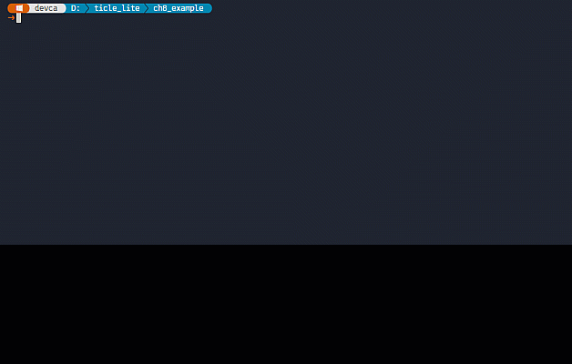</br>

### PC GUI 프로그램

> **이 예제로 풀 문제**  
> 브로커 주소를 입력하고 연결 버튼을 누른 뒤, 센서값은 자동으로 받아 보고 색상 명령은 필요할 때마다 보내려면 GUI를 어떻게 구성해야 할까? MQTT 연결 상태와 발행, 구독 흐름을 한 화면에서 관리한다.


GUI는 pyserial + GUI에서 시리얼 포트 관련 코드만 교체한다. PySide6-PahoMqtt를 먼저 설치한다.

```sh
pip install PySide6-PahoMqtt
```

앞 절 Qt Designer에서 수정한 mqtt_board_ui.py를 임포트한다. PySide6.PahoMqtt의 Client 클래스가 내부 스레드와 Signal 변환을 처리하므로 Bridge(QObject)는 필요 없다.

```python
# mqtt_board.py
import sys
from PySide6.QtWidgets import QApplication, QMainWindow, QStyle
from PySide6.QtCore import Qt
from PySide6.PahoMqtt import Client
from mqtt_board_ui import Ui_MainWindow

class MainWindow(QMainWindow, Ui_MainWindow):
    def __init__(self):
        super().__init__()
        self.setupUi(self)
        icon = self.style().standardIcon(QStyle.StandardPixmap.SP_ComputerIcon)
        self.setWindowIcon(icon)
        self.setWindowFlags(self.windowFlags() | Qt.MSWindowsFixedSizeDialogHint)

        self.statusbar.showMessage("Ready")

        # Make sensor widgets non-interactive
        for widget in [self.dalSensorCds, self.dalSensorVr]:
            widget.setAttribute(Qt.WidgetAttribute.WA_TransparentForMouseEvents)
            widget.setFocusPolicy(Qt.FocusPolicy.NoFocus)

        self.btnConnect.clicked.connect(self.on_toggle_connect)
        self.color = [0, 0, 0]
        self.sldPixelRed.sliderReleased.connect(
            lambda: self.update_color(0, self.sldPixelRed.value())
        )
        self.sldPixelGreen.sliderReleased.connect(
            lambda: self.update_color(1, self.sldPixelGreen.value())
        )
        self.sldPixelBlue.sliderReleased.connect(
            lambda: self.update_color(2, self.sldPixelBlue.value())
        )

        self._connected = False
        self.mqtt = Client()
        self.mqtt.on_connect.connect(self.on_connect)
        self.mqtt.on_connect_fail.connect(self.on_connect_fail)
        self.mqtt.on_disconnect.connect(self.on_disconnect)
        self.mqtt.on_message.connect(self.on_message)

    def update_color(self, index, value):
        self.color[index] = value
        self.widPixelColor.setStyleSheet(
            f"background-color: rgb({self.color[0]}, {self.color[1]}, {self.color[2]})"
        )
        if self._connected:
            self.mqtt.publish("board/rgb", self.color)
            self.statusbar.showMessage(f"Sent: {self.color}")

    def on_toggle_connect(self):
        if self.btnConnect.text() == "Connect":
            broker = self.edtBroker.text().strip()
            if broker:
                self.mqtt.connect(broker)
                self.statusbar.showMessage(f"Connecting to {broker}…")
        else:
            self.mqtt.disconnect()
    
    def on_connect(self, connect_flags, reason_code, properties):
        if reason_code == 0:
            self._connected = True
            self.mqtt.subscribe("board/sensor")
            self.btnConnect.setText("Disconnect")
            self.statusbar.showMessage(f"Connected: {self.edtBroker.text().strip()}")
        else:
            self.statusbar.showMessage(f"Connect failed (code {reason_code})")

    def on_connect_fail(self):
        self.statusbar.showMessage("Connect failed: host unreachable")

    def on_disconnect(self, disconnect_flags, reason_code):
        self._connected = False
        self.btnConnect.setText("Connect")
        self.statusbar.showMessage("Disconnected")

    def on_message(self, topic, payload, qos, retain, properties):
        self.statusbar.showMessage(f"Received: {payload}")
        if topic == "board/sensor":
            try:
                cds_val, vr_val = payload.split()
                self.dalSensorCds.setValue(int(float(cds_val)))
                self.dalSensorVr.setValue(int(float(vr_val)))
            except ValueError:
                pass
        
    def closeEvent(self, event):
        self.mqtt.disconnect()
        super().closeEvent(event)

if __name__ == '__main__':
    app = QApplication(sys.argv)
    window = MainWindow()
    window.show()
    sys.exit(app.exec())
```

**코드 해설**

pyserial + GUI 코드와 클래스 구조, 슬라이더 연결, update_color, 다이얼 비대화형 설정이 모두 같다. 달라진 부분은 다음 세 곳이다.

첫째, serial.Serial과 threading.Thread, Bridge(QObject) 세 객체 대신 Client() 하나로 교체된다. PySide6.PahoMqtt의 Client는 paho-mqtt 내부 스레드를 감싸고 on_connect, on_connect_fail, on_disconnect, on_message를 PySide6 Signal로 제공한다. 각 신호에 슬롯을 연결하면 콜백이 자동으로 GUI 스레드에서 호출된다.

둘째, on_toggle_connect는 self.ser의 존재 여부 대신 버튼 텍스트로 연결 상태를 판단한다. 연결할 때는 self.mqtt.connect(broker)를 호출하고, 해제할 때는 self.mqtt.disconnect()만 호출하면 충분하다. on_connect는 TCP 연결이 완료된 후 호출되는 슬롯으로, reason_code가 0일 때만 board/sensor 구독을 등록하고 버튼 텍스트와 상태 바를 갱신한다. reason_code가 0이 아니면 상태 바에 오류 코드를 표시한다. on_connect_fail은 호스트에 아예 접근할 수 없을 때 호출되는 슬롯으로, 상태 바에 접근 불가 메시지를 표시한다. self._connected 플래그는 update_color에서 연결 전 발행을 막기 위한 guard로만 사용한다.

셋째, on_message는 같은 이름의 신호 슬롯으로 topic, payload, qos, retain, properties를 인자로 받는다. topic이 board/sensor일 때만 공백으로 구분된 두 값을 파싱해 다이얼을 갱신한다. closeEvent에서 self.mqtt.disconnect()를 호출해 창을 닫을 때 연결을 정리한다.

**실행 결과와 확인할 점**

창이 열리면 상태 바에 "Ready"가 나타난다. Broker IP 입력 필드에 NanoMQ가 실행 중인 PC의 IP 주소를 입력하고 Connect를 누르면 버튼 텍스트가 "Disconnect"로 바뀌고 상태 바에 연결된 브로커 주소가 표시된다. 이후 100ms마다 보드에서 센서값이 수신되어 CdS와 VR 다이얼이 자동으로 움직인다.

Red, Green, Blue 슬라이더를 움직인 뒤 손을 떼면 색 미리보기 위젯의 색이 바뀌고 상태 바에 전송된 값이 표시된다. 동시에 보드의 Pixel Display 보드 색이 바뀐다. Disconnect를 누르면 MQTT 연결이 해제되어 상태 바에 "Disconnected"가 표시된다.

</br>

> **한 걸음 더**  
> pyserial + GUI의 GUI 코드와 mqtt_board.py를 비교해 추가되거나 삭제된 코드가 몇 줄인지 세어 본다. update_color에서 self.mqtt.publish 직전에 self.color가 [0, 0, 0]이면 발행하지 않고 상태 바에 "Pixel off"를 표시하는 조건을 추가해 본다.

---

## 정리

> **풀고 싶은 문제**  
> GUI, 직렬 통신, MQTT, BLE를 각각 배운 뒤 실제 프로젝트에서 어떤 조합을 선택해야 할까? 장 전체를 통합 관점에서 정리해 구현 전략을 세운다.


PySide6는 버튼, 슬라이더, 진행 막대 같은 위젯을 레이아웃으로 배치하고, 신호-슬롯 연결로 사용자 이벤트에 반응하는 GUI 프로그램을 만든다. Qt Designer는 .ui 파일로 레이아웃을 시각적으로 설계하여 코드와 UI를 분리한다.

통신 라이브러리와 GUI를 결합할 때 공통으로 만나는 문제가 있다. 수신 콜백은 별도 스레드에서 실행되지만 GUI 위젯은 메인 스레드에서만 수정할 수 있다. pyserial에서는 threading.Thread로 읽기 루프를 만들고 Bridge(QObject)의 Signal로 데이터를 메인 스레드에 전달한다. paho-mqtt에서는 PySide6-PahoMqtt 래퍼가 콜백을 Signal로 자동 변환해 주므로 Bridge를 직접 만들 필요가 없다.

| 라이브러리 | 수신 방식 | GUI 스레드 전달 |
| ---------- | --------- | --------------- |
| pyserial | threading.Thread + readline | Bridge(QObject) Signal emit |
| paho-mqtt | PySide6-PahoMqtt 내부 스레드 | MqttClient Signal (자동) |

통신 방식이 달라져도 GUI 구조 자체는 바뀌지 않는다. Qt Designer로 설계한 UI 파일을 공유하고 연결, 수신, 전송 코드만 교체하면 같은 화면을 다른 통신 방식으로 재사용할 수 있다.

---

### 스스로 점검하기

1. 위젯을 setGeometry로 배치하는 방식과 Qt Designer로 배치하는 방식의 차이를 설명하고, 위젯 개수가 늘어날 때 어느 쪽이 유리한지 서술하시오.
2. Qt의 신호-슬롯 메커니즘에서 신호와 슬롯은 각각 무엇인지 설명하시오. Signal 클래스를 사용해 직접 신호를 선언하는 방법을 예를 들어 서술하시오.
3. 백그라운드 스레드에서 GUI 위젯을 직접 수정하면 안 되는 이유를 설명하시오.
4. Signal emit이 스레드 안전한 이유를 설명하고, 이 장에서 Signal을 사용한 이유를 서술하시오.
5. Qt Designer로 만든 .ui 파일을 파이썬에서 사용하는 두 단계를 설명하시오. pyside6-uic 변환 후 코드에서 Ui_MainWindow를 사용할 때 권장하는 클래스 선언 방식을 함께 서술하시오.
6. pyserial 예제에서 사용한 Bridge 패턴을 설명하고, 이 패턴이 필요한 이유를 서술하시오. paho-mqtt 예제에서는 Bridge 없이도 스레드 안전하게 처리할 수 있는 이유는 무엇인지 함께 서술하시오.
7. GUI 창을 닫을 때 closeEvent에서 자원을 정리하는 이유를 설명하시오. 백그라운드 스레드 예제와 paho-mqtt GUI 예제에서 각각 closeEvent 안에서 무엇을 정리하는지 비교하시오.
