# 9. MicroPython 머신러닝

## 개요

### 학습 목표

- ulab 라이브러리로 수치 배열을 생성하고 배열 전체에 한 번에 연산할 수 있다.
- IMU와 CdS 센서에서 시계열 데이터를 창(window) 단위로 수집하고, VR, 초음파, 디지털 마이크 같은 입력과 함께 특징 벡터로 바꿀 수 있다.
- 평균과 표준편차로 특징값을 추출하고 json으로 학습 데이터를 저장하고 불러올 수 있다.
- emlearn-micropython의 emlearn_neighbors, emlearn_trees, emlearn_iir, emlearn_iir_q15를 9장의 핵심 모듈로 이해할 수 있다.
- k-최근접 이웃(kNN), Random Forest, IIR 필터 중 문제 성격에 맞는 방법을 선택할 수 있다.
- Z-score 기반 이상값 탐지를 구현하여 진동 패턴의 이상을 자동으로 감지할 수 있다.
- 분류 결과를 Matrix, Servo, Button, TextLCD 같은 TiCLE Lite 장치와 연결해 온디바이스 피드백 루프를 구성할 수 있다.
- 센서 수집 주기, 창 길이, 추론 주기를 분리해 임베디드 자원 제약에서 안정적으로 동작하는 엣지 ML 루프를 설계할 수 있다.
- 재미있고 의미 있는 피지컬 인공지능 응용 예제를 스스로 변형하고 확장할 수 있다.

### 이 장의 의미

지금까지 센서 데이터는 주로 조건문으로 처리했다. 거리가 30cm 이하면 경고를 보내고, 주변이 어두우면 LED를 켜는 방식이 대표적이다. 하지만 이 방식은 개발자가 임계값을 미리 정해야 하므로, 사람마다 다른 동작 패턴이나 서서히 바뀌는 환경 변화에 유연하게 적응하지 못한다는 근본적인 한계가 있다.

머신러닝은 이와 다른 방식으로 접근한다. 조건을 코드로 직접 작성하는 대신, 예제 데이터를 시스템에 제공해 스스로 패턴을 찾게 만든다. 예를 들어, TiCLE Lite를 흔들 때 나타나는 가속도 패턴을 10번 정도 수집해 '흔들기'라는 이름을 붙인다. 이후 새로운 흔들기 입력이 들어왔을 때 이를 동일한 동작으로 판별하는 것이 이 장의 목표이다.

마이크로컨트롤러인 Core 보드에서 이러한 머신러닝이 가능한 이유는 ulab 덕분이다. ulab은 MicroPython 환경에서 NumPy와 같은 방식으로 고속 배열 연산을 수행하는 라이브러리이며, TiCLE Lite용 MicroPython 빌드에 기본 포함되어 있다. ulab의 배열 연산 기능을 활용하면 수십~수백 줄의 가벼운 예제 코드만으로도 데이터 분류와 이상 탐지가 가능한 경량 알고리즘을 구현할 수 있다.

여기에 emlearn-micropython을 더하면 Core 보드처럼 리소스가 제한되고 전력 소모가 적은 임베디드 하드웨어에서 머신러닝 모델을 구동하는 TinyML 구조가 완성된다. emlearn-micropython은 PC의 scikit-learn 등으로 학습한 모델을 Core 보드 위에서 직접 추론할 수 있도록 설계된 경량 머신러닝 라이브러리이다. 추론 엔진을 C 언어로 구현한 뒤 MicroPython 네이티브 확장 모듈(.mpy)로 패키징해 배포하므로, 별도 컴파일 없이 replx mip install 명령 한 줄로 보드에 쉽게 설치할 수 있다. 즉, ulab이 센서 원시 데이터를 창 단위의 특징 벡터로 정형화하면 emlearn-micropython이 해당 특징을 받아 빠르게 추론(Inference)을 수행한다. 이 조합은 계산 능력과 메모리가 제한된 Core 보드 환경에서 가장 실용적인 패턴 중 하나이다.

이 장은 단순히 모델을 생성하고 끝나는 구성이 아니다. 실제 피지컬 인공지능 시스템에서는 추론 결과가 곧바로 장치의 동작으로 이어져야 하며, 데이터 수집, 재학습, 재배치가 반복될 수 있어야 한다. 따라서 9장은 알고리즘 설명과 함께 장치 통합, 실행 주기 설계, 모델 저장 및 재사용, 민감도 조정까지 포함하여 현장형 엣지 AI의 전체 라이프사이클을 깊이 있게 다룬다.

이 장에서 다루는 emlearn-micropython 계열 모듈의 역할은 다음과 같다. 우선 emlearn_neighbors는 이번 장에서 실습할 kNN(K-Nearest Neighbors) 분류 알고리즘에 대응한다. kNN은 새 입력과 저장된 예제 사이의 거리를 계산해 가장 가까운 k개의 다수결로 클래스를 결정한다. 별도 학습 없이 데이터를 모으는 즉시 분류에 활용할 수 있고 계산량도 적어 Core 보드에 적합하다. emlearn_trees는 PC에서 scikit-learn으로 학습한 랜덤 포레스트(Random Forest, 이하 RF) 모델을 CSV 파일로 내보내 보드에 배포할 때 사용한다. 트리기반 알고리즘은 추론 시 전체 데이터와 거리를 계산하지 않고 트리의 깊이만큼만 탐색하므로 kNN보다 빠르고 복잡한 클래스 경계를 다룰 수 있다. 마지막으로 emlearn_iir와 emlearn_iir_q15는 마이크나 초음파 센서처럼 노이즈가 섞인 센서 신호를 매끄럽게 다듬는 전처리에 적합하다. 특히 emlearn_iir_q15는 부동소수점(float) 연산용 메모리가 부족한 상황에서 int16 정수 버퍼를 활용해 메모리를 절약하고자 할 때 사용한다.

### 라이브러리 구성

본 장의 피지컬 인공지능 시스템 구현에 사용하는 주요 라이브러리의 역할은 다음과 같다. 수학 연산의 핵심인 ulab.numpy는 센서 데이터를 다차원 배열로 구조화하고 행렬 연산과 평균, 분산 등 통계적 특징 데이터를 고속 추출한다.

센서 입력부인 ticle_lite 하위 모듈들은 하드웨어 제어를 단순화한다. mpu6050은 가속도 및 자이로 데이터를 제공하고, ain과 us는 각각 주변 밝기와 물리적 거리를 실시간 측정한다. audio 모듈은 I2S 기반 디지털 음성 신호 입출력을 동시에 처리한다. 시스템 제어와 출력부 역시 ticle_lite 드라이버로 통합된다. button은 데이터 수집을 유도하는 트리거 역할을 하며, ws2812와 servo는 추론 결과를 색상 신호와 회전 각도 운동으로 변환하여 표현한다. lcd_hd44780은 현재 동작 모드, 분류된 클래스명, 추론 신뢰도를 텍스트로 상시 화면에 표시한다. 

마지막으로 내장 json 모듈은 Core 보드의 전원이 꺼지더라도 수집한 학습 데이터와 모델 파라미터가 유지되도록 파일 형태로 저장하고 불러오는 역할을 수행한다.

| 라이브러리 | 역할 |
|---|---|
| ulab.numpy | 배열 생성, 행렬 연산, 평균/분산 계산 |
| ticle_lite.mpu6050 | MPU6050 IMU 센서 드라이버 (가속도, 자이로) |
| ticle_lite.ain | CdS 광도 센서 드라이버 |
| ticle_lite.us | 초음파 거리 센서 드라이버 |
| ticle_lite.audio | I2S 디지털 마이크/스피커 통합 드라이버 |
| ticle_lite.button | 버튼 입력 (데이터 수집 트리거) |
| ticle_lite.ws2812.Matrix | 분류 결과 색상 피드백 출력 |
| ticle_lite.servo | 분류 결과를 물리 동작(각도)으로 표현 |
| ticle_lite.lcd_hd44780 | 클래스/신뢰도/모드 상태 텍스트 표시 |
| json | 학습 데이터와 모델 파라미터 저장 |

### emlearn-micropython 추천 모듈

Core 보드 내 머신러닝 파이프라인 구축을 위한 emlearn-micropython의 모듈별 특징은 다음과 같다. 필수 모듈인 emlearn_neighbors는 kNN 알고리즘 기반 추론 엔진을 담당하며, IMU 제스처 인식이나 가변 저항(VR) 및 광도 센서(CdS) 데이터를 활용한 초기 분류 시스템에 사용한다. 

또 다른 필수 모듈인 emlearn_iir은 무한 임펄스 응답(IIR) 필터로 전처리를 수행하며, 마이크 입력이나 진동 및 흔들림 신호의 노이즈를 제거하고 파형을 평활화한다. 권장 모듈인 emlearn_iir_q15는 고정소수점 전처리 모듈이며, 부동소수점(float) 연산으로 인한 메모리와 연산 부하가 큰 고주파 오디오 및 고밀도 센서 환경에서 시스템 자원을 아끼는 대안이 된다. 마지막 권장 모듈인 emlearn_trees는 PC의 scikit-learn에서 학습한 랜덤 포레스트(Random Forest) 모델을 Core 보드로 이식하며, 복잡한 비선형 경계면을 가진 클래스를 고속으로 분류하고 배포할 때 탁월한 성능을 발휘한다.

| 권장도 | 모듈 | 9장에서의 역할 | 대표 사용 장면 |
|---|---|---|---|
| 필수 | emlearn_neighbors | kNN 추론 | IMU 제스처, VR/CdS 프로토타입 분류 |
| 필수 | emlearn_iir | IIR 필터 기반 전처리 | 마이크, 진동, 흔들림 신호 평활화 |
| 권장 | emlearn_iir_q15 | 고정소수점 IIR 전처리 | float 메모리가 빠듯한 오디오/센서 전처리 |
| 권장 | emlearn_trees | Random Forest 추론 | VR/CdS RF 배포, 복잡한 경계 분류 |

### 실습 구성

이 장은 설명 중심이 아니라 다음 실습 순서로 진행하는 것이 좋다.

1. ulab으로 센서 창 데이터를 모으고 평균, 표준편차, 최대/최솟값을 계산한다.
2. emlearn_neighbors를 기준으로 IMU 동작 분류를 먼저 구현한다.
3. emlearn_iir로 마이크, 진동, 초음파 신호를 먼저 다듬고, 잡음이 줄어드는지 확인한다.
4. emlearn_iir_q15로 같은 필터를 정수형 버퍼에 적용해 메모리 절약 흐름을 익힌다.
5. VR+CdS 데이터를 PC에서 RandomForest로 학습하고 emlearn_trees로 보드에 배포한다.

아래처럼 실습 과제를 잡으면 장의 내용이 실제 코드 실행으로 이어진다.

| 실습 | 입력 | 주요 모듈 | 목표 |
|---|---|---|---|
| 1 | IMU | ulab + emlearn_neighbors | 흔들기/정지/기울기 분류 |
| 2 | VR + CdS | ulab + emlearn_neighbors | 의도와 환경을 함께 읽는 조명 모드 분류 |
| 3 | 초음파 | ulab + emlearn_iir | 거리 신호를 평활화한 뒤 손짓 분류 |
| 4 | 마이크 | ulab + emlearn_iir_q15 | 배경 소음이 많은 환경에서 RMS 특징 추출 |
| 5 | VR + CdS | sklearn RF + emlearn_trees | PC 학습 후 보드에 배포한 조명 모드 분류기 |

> 실습 파일의 역할도 분명히 나누는 편이 좋다. *_collect.py는 데이터를 모으고, pc_train_*.py는 PC에서 모델을 학습하고, *_deploy.py는 보드에서 추론만 수행한다. 이렇게 나누면 같은 센서라도 학습과 배포의 차이를 분명하게 이해할 수 있다.

### 실습 전 준비

이 장의 실습을 진행하려면 우선 5장까지 다룬 TiCLE Lite 라이브러리가 하드웨어에 설치되어 있어야 한다. 반면 수학 연산을 담당하는 ulab 라이브러리는 TiCLE Lite 공식 펌웨어에 기본 내장되어 있어 별도의 추가 설치가 필요 없다. 펌웨어 내 ulab 라이브러리 포함 여부는 인터프리터나 스크립트에서 다음 import 명령을 실행하여 바로 확인할 수 있다.

```python
from ulab import numpy as np
```

하드웨어는 앞서 3장과 4장에서 실습한 내용을 변형 없이 그대로 재사용한다. 이 장의 실습 예제는 단일 장치 제어에 그치지 않고, 다음에 제시하는 세 영역의 다양한 임베디드 장치들을 동시에 제어하고 연동하는 통합 시스템 흐름을 기준으로 작성한다.

- 입력: IMU(I2C), CdS(ADC), Button(GPIO)
- 출력: Matrix(WS2812), Servo(PWM), TextLCD(I2C)
- 계산: ulab 배열 연산 + 경량 분류(kNN, RF)

데이터 처리 및 하드웨어 제어 과정에서 발생할 수 있는 자원 충돌과 병목 현상을 방지하기 위해 데이터 수집 루프와 결과 표시 루프를 엄격히 분리하여 설계한다. 이에 따라 실습 예제 내의 센서 데이터 읽기 주기(INTERVAL), 연산에 활용할 특징 창 길이(WINDOW), 실제 머신러닝 추론 실행 주기(INFER_MS)는 시스템 내부에서 각각 독립된 매개변수로 정의되어 안전하게 관리된다.

emlearn-micropython 모듈은 펌웨어에 내장된 ulab과 달리 사용자가 Core 보드에 별도로 설치해야 한다. 핵심 모듈인 emlearn_neighbors, emlearn_trees, emlearn_iir, emlearn_iir_q15는 각 하드웨어 플랫폼에 맞춤 컴파일된 .mpy 파일로 배포된다. .mpy 파일은 MicroPython 전용 바이트코드 형식이며, C 언어로 구현된 고속 추론 엔진을 별도 빌드 없이 바로 실행할 수 있게 패키징한 결과물이다. TiCLE Lite의 Core 보드는 ARM Cortex-M 계열(armv7emsp) 아키텍처와 MicroPython 6.3 기반 펌웨어를 사용하므로, 해당 빌드 경로는 armv7emsp_6.3이 된다. 개발자는 VSCode 터미널에서 다음 명령 한 줄로 해당 파일들을 보드 내부의 /lib 폴더에 바로 설치할 수 있다.

```sh
replx mip install --source https://emlearn.github.io/emlearn-micropython/builds/latest/armv7emsp_6.3/ emlearn_neighbors.mpy emlearn_trees.mpy emlearn_iir.mpy emlearn_iir_q15.mpy 
```

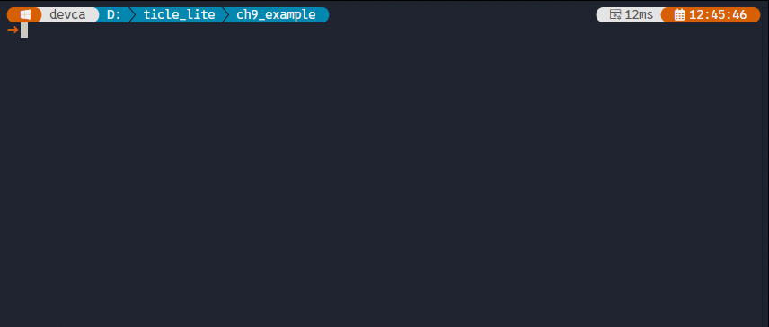</br>

3절 실습 예제에는 Core 보드 연산뿐만 아니라, PC에서 파이썬 scikit-learn 라이브러리로 머신러닝 모델을 직접 학습시키는 과정이 포함된다. 이를 위해 PC에 scikit-learn 패키지가 반드시 사전 설치되어 있어야 한다. 만약 라이브러리가 설치되어 있지 않다면 VSCode 터미널 창에 다음 명령어를 입력하여 설치를 진행한다.sh

```sh
pip install scikit-learn
```

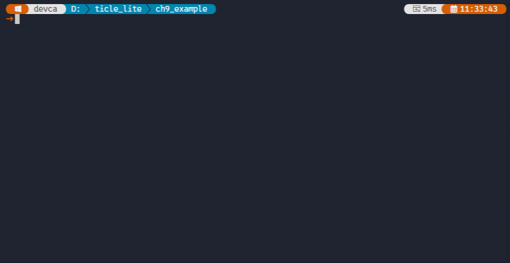</br>


여기서 주의할 점은 임베디드 환경과 PC 환경의 역할 분담을 명확히 인지하는 것이다. 배열 연산 및 경량 추론을 담당하는 ulab과 emlearn-micropython 모듈은 오직 Core 보드 위에서만 동작하며, 앞서 설치한 scikit-learn 라이브러리는 모델 학습을 담당하는 PC 환경에서만 요구된다. 독자는 실습 전 이와 같은 교차 개발 환경이 양쪽 모두 준비되어 있는지 최종 확인해야 한다.

9장의 기술적 전개와 설계 방향은 다음과 같다. 먼저 내장된 ulab으로 실시간 센서 원시 데이터를 일정 구간(Window) 단위의 정형화된 특징 벡터로 가공하고, emlearn_neighbors 모듈을 활용해 보드 자체에서 즉각적인 분류 추론을 시작한다. 이어서 시스템 고도화를 위해 emlearn_trees 모듈을 도입하여 PC의 scikit-learn 환경에서 학습된 랜덤 포레스트 모델을 보드 내부로 배포한다. 최종적으로는 emlearn_iir 및 emlearn_iir_q15 모듈을 센서 입력단에 배치하여 신호의 노이즈를 다듬음으로써 오작동과 오탐지율을 낮추는 구조를 완성하는 것이다.


### TiCLE Lite 엣지 ML 실행 틀

> **풀고 싶은 문제**
> 분류 알고리즘만 단독으로 구동하더라도 머신러닝의 기초적인 학습과 추론 자체는 가능하다. 하지만 실제 마이크로컨트롤러 기반의 장치에서는 센서 입력 데이터의 실시간 수집, 모델의 추론 연산, 주변 하드웨어를 통한 물리적 출력, 그리고 사용자의 인터랙션 개입이 하나의 프로세스 안에서 동시에 유기적으로 돌아가야 한다. 그렇다면 TiCLE Lite 실습 장비의 전체 하드웨어 기능을 완벽히 반영한 임베디드 AI의 기본 실행 프레임워크는 어떻게 설계해야 할까?

9장의 모든 예제는 아래 파이프라인을 공통으로 따른다.

1. 센서 창 수집: IMU 가속도나 CdS 광도 센서의 아날로그 측정값을 미리 지정된 시간 윈도우(Window) 단위의 버퍼로 촘촘히 모은다.
2. 특징 추출: 수집된 원시 데이터 버퍼를 바탕으로 평균, 표준편차, 최댓값, 최솟값 등 계산 비용이 매우 적으면서도 데이터의 성격을 대표하는 저비용 특징 벡터를 계산한다.
3. 온디바이스 추론: 임베디드 보드 내부에서 kNN, 랜덤 포레스트(Random Forest), 또는 Z-score 알고리즘을 수행하여 현재 장치의 상태나 입력의 종류를 실시간으로 판정한다.
4. 멀티 출력 반영: 판정된 추론 결과를 마이크로컨트롤러와 연결된 Matrix LED의 색상 변화, 서보모터(Servo)의 물리적 회전 각도, 그리고 TextLCD 화면의 상태 텍스트로 동시에 표현한다.
5. 사용자 피드백: 장치에 내장된 푸시 버튼(Button) 인터럽트 이벤트를 감지하여 데이터 수집 모드와 실시간 추론 모드를 수시로 전환하거나 모델의 재학습을 현장에서 즉시 트리거한다.

이와 같이 모듈화된 파이프라인 구조를 유지하면 향후 백엔드 머신러닝 알고리즘을 kNN에서 다른 고급 분류기로 교체하더라도 전후방의 하드웨어 입출력 제어 코드는 대부분 수정 없이 재사용할 수 있다. 여기서 활용되는 Z-score는 현재 측정된 센서값이 정상 상태의 평균으로부터 표준편차의 몇 배만큼 벗어났는지를 나타내는 통계적 수치이다. 이 방식은 사전에 레이블(Label)이 지정된 대량의 학습 데이터를 수집하지 않아도 현재 데이터가 평소에 비해 얼마나 이상한지를 숫자로 즉각 판단할 수 있다는 장점이 있다.

덕분에 산업 현장의 기계 진동 이상 감지나 갑작스러운 주변 환경 변화처럼 정상 범위를 이탈하는 순간을 포착하는 이상 탐지(Anomaly Detection) 모델에 자주 쓰인다. 요약하자면, 앞선 3장과 4장에서 익힌 하드웨어 제어 코드를 9장의 머신러닝 루프 앞단(입력/전처리)과 뒷단(출력/제어)에 유기적으로 결합하는 설계 방식이 본 장을 관통하는 핵심 구조이다.

---

## ulab 기초

> **풀고 싶은 문제**
> 이후 실습 코드를 읽고 수정하려면 ulab의 어떤 기능만 알면 충분할까?

이 절은 이후 예제에서 실제로 반복되는 계산만 다룬다. 핵심은 다섯 가지다.

1. 리스트를 배열로 바꾸기: np.array
2. 시간 창을 축 기준으로 집계하기: np.mean, np.std, axis=0
3. 특징 벡터 만들기: 평균 묶음 + 표준편차 묶음
4. 거리로 가장 가까운 클래스 찾기: np.sqrt, np.sum
5. 이상 탐지 점수 계산하기: np.sqrt, np.max

### 시간 창을 한 번에 집계하기

> **이 예제로 풀 문제**
> IMU처럼 여러 축 데이터를 시간 창으로 모았을 때, 각 축의 평균과 표준편차를 짧은 코드로 한 번에 구하려면 어떻게 해야 할까?

IMU처럼 여러 축을 동시에 측정하면 수집된 데이터는 2차원 배열이 된다. 행(row)은 시간 단계, 열(column)은 센서 축에 대응한다. 이 배열에서 각 축의 통계를 구하려면 행 방향, 즉 시간 축을 따라 같은 열(센서 축)끼리 묶어야 한다. ulab의 np.mean과 np.std는 axis=0을 지정하면 열별 평균과 표준편차를 한 번에 계산해 주므로, 반복문 없이 짧은 코드로 6개 축의 통계값을 동시에 얻을 수 있다. 아래 예제는 4개 시간 단계 × 6축 배열로 이 집계 과정을 보여 준다.

```python
# ulab_feature_vector.py
from ulab import numpy as np

# row is time, column is sensor axis (ax, ay, az, gx, gy, gz)
window = np.array([
    [0.10, 9.80, 0.20,  0.8, 0.1, 0.2],
    [0.20, 9.70, 0.10,  0.9, 0.2, 0.3],
    [0.00, 9.90, 0.30,  0.7, 0.0, 0.2],
    [0.10, 9.85, 0.15,  0.8, 0.1, 0.1],
])

# the mean of each column (sensor axis) across the time window
mean6 = np.mean(window, axis=0)  
# the standard deviation of each column (sensor axis) across the time window
std6 = np.std(window, axis=0)    
print("std6:", std6)
```

**코드 해설**

배열 shape가 (4, 6)일 때 axis=0은 '행을 따라', 즉 시간 방향을 압축한다. 같은 열에 놓인 네 개 값을 하나의 숫자로 요약하므로 결과는 길이 6인 1차원 배열이 된다. axis=1로 바꾸면 반대로 열(축) 방향을 압축해 길이 4인 결과가 나오는데, 이는 센서 축들을 섞어 하나로 만들어 버리므로 각 축을 독립적으로 보존해야 하는 특징 추출에는 맞지 않는다.

mean6은 창 안에서 각 축이 평균적으로 가리키는 방향, 즉 정적인 자세를 담는다. std6은 같은 창에서 값이 얼마나 출렁였는지, 즉 동적인 움직임 강도를 담는다. 두 정보가 합쳐져야 가만히 있었다와 살짝 흔들었다를 구분할 수 있다. 평균만 쓰면 흔들기와 정지가 우연히 같은 평균을 가질 수 있고, 표준편차만 쓰면 방향 정보가 빠진다.

**실행 결과와 확인할 점**

mean6에 6개 값이 출력되고, ax 평균(첫 번째 값)이 약 0.1, ay 평균(두 번째 값)이 약 9.8임을 확인한다. std6의 각 값이 0보다 크고 10보다 작은지도 함께 살펴보자. axis=1로 바꾸어 실행하면 출력 개수가 달라지는데, 그 차이가 무엇을 뜻하는지 비교해 본다.

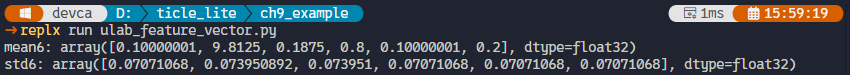</br>


> **알아두기 - 데이터 전처리**
> 데이터 전처리(Data Preprocessing)는 모델이 데이터를 효과적으로 학습할 수 있도록 원천 데이터를 가공하는 모든 과정을 의미한다. 그중에서도 특성 스케일링(Feature Scaling)은 서로 다른 변수의 범위를 조정하여 모델의 학습 효율을 높이는 핵심적인 단계이다. 
>
> **1. 데이터 전처리 단계**
> - 데이터 클리닝: 결측치(Missing Data) 및 이상치(Outlier) 식별 및 처리.
> - 데이터 변환: 범주형 데이터를 수치 데이터로 변환(Encoding).
> - 특성 스케일링: 변수별 데이터 범위를 일정 수준으로 조정.
> - 데이터 분할: 전체 데이터를 학습(Train) 및 테스트(Test) 세트로 분리.
> 
> **2. 특성 스케일링을 위한 통계적 지표**
> 특성 스케일링의 기반이 되는 주요 지표와 그 역할은 다음과 같다.
>
> 개념 | 역할 | 중요성|
>----|------------|-------|
>평균 (Mean) | 데이터의 중심 측정 | 일반적인 경향성 파악, 이상치 처리 및 정규화 기준점 설정
>분산 (Variance) | 데이터의 흩어짐 정도 | 평균과의 거리 측정, 과적합(Overfitting)/과소적합(Underfitting) 판단의 핵심 지표
>표준편차 (Std Dev) | 변동성의 직관적 지표 | 데이터 단위와 동일한 척도로, 정규화 시 데이터 범위를 조정하는 필수 요소
>
> **3. 정규화와 표준화의 이해**
> 데이터의 평균과 표준편차를 활용하면 모델의 수렴 속도를 높이고 학습 안정성을 확보할 수 있다. 특히 분산이 지나치게 높으면 모델이 노이즈까지 학습하는 과적합 문제가 발생할 수 있으므로 주의해야 한다.
> - 표준화 (Standardization / Z-score Normalization)
>   - 데이터 분포를 평균 0, 표준편차 1로 변환
>   - 이상치(Outlier)가 포함된 데이터셋에서도 비교적 안정적인 성능을 보임
>   - KNN, SVM과 같이 데이터 간 거리를 계산하는 알고리즘에서 필수적
> - 정규화 (Normalization / Min-Max Scaling)
>   - 데이터를 0과 1 사이의 값으로 변환
>   - 변수의 범위를 특정 구간으로 엄격히 제한하고자 할 때 사용
>
> **표준화(Z-score) 수행 절차**
> 표준화는 다음 단계를 통해 수행되며, 공식은 $z = \frac{x - \mu}{\sigma}$를 따른다.
> 1. 평균($\mu$) 산출: 특정 특성(Column)의 모든 데이터 합을 개수로 나눈다.
> 2. 표준편차($\sigma$) 산출: 각 데이터와 평균의 차이(편차)를 제곱한 것들의 평균(분산)을 구한 뒤, 그 값에 제곱근을 씌운다.
> 3. 값 변환($z$): 원본 데이터($x$)를 위에서 계산된 $\mu$와 $\sigma$를 활용하여 표준 점수로 변환한다.

### 특징 벡터 만들기

> **이 예제로 풀 문제**
> 시간 창 원시값을 그대로 쓰지 않고, 이후 분류기에 바로 넣을 수 있는 고정 길이 특징 벡터로 바꾸려면 어떤 순서로 계산해야 할까?

특징 벡터는 센서 원시 데이터에서 분류에 유용한 수치를 골라 고정 길이 배열로 묶은 것이다. 원시값은 측정 횟수나 창 크기에 따라 길이가 달라지지만, 특징 벡터는 어떤 상황에서도 같은 길이를 유지해야 분류기가 일관된 입력을 처리할 수 있다. 시간 창 원시값은 창 크기에 따라 길이가 달라지므로 분류기에 직접 넣을 수 없다. 평균과 표준편차는 창 크기와 무관하게 항상 축 수만큼의 고정 길이가 나오므로, 이 둘을 이어 붙이면 분류기가 일관된 입력을 받을 수 있는 특징 벡터가 된다. 아래 예제는 앞 절의 window 배열에 평균과 표준편차를 차례대로 계산하고 하나의 리스트로 합치는 전 과정을 보여 준다.

```python
# ulab_nearest_distance.py
from ulab import numpy as np

window = np.array([
    [0.10, 9.80, 0.20,  0.8, 0.1, 0.2],
    [0.20, 9.70, 0.10,  0.9, 0.2, 0.3],
    [0.00, 9.90, 0.30,  0.7, 0.0, 0.2],
    [0.10, 9.85, 0.15,  0.8, 0.1, 0.1],
])

feat = list(np.mean(window, axis=0)) + list(np.std(window, axis=0))
print("feature length:", len(feat))
print("feature:", feat)
```

**코드 해설**

np.mean과 np.std는 모두 ulab ndarray를 반환한다. ulab은 numpy.concatenate에 해당하는 배열 이어 붙이기를 지원하지 않으므로, list()로 Python 리스트로 먼저 변환한 뒤 + 연산자로 두 리스트를 연결한다. 이 패턴은 중간에 리스트 인스턴스가 하나 더 생기지만 MicroPython에서 배열을 이어 붙일 때 추가 라이브러리 없이 쓸 수 있는 가장 안전한 방법이다.

결과인 feat의 길이는 항상 6 + 6 = 12다. window에 행이 30개든 50개든, 즉 창 크기가 바뀌어도 특징 벡터 길이는 축 수에만 의존한다. 이것이 원시값 대신 통계값을 특징으로 쓰는 핵심 이유다. 길이가 고정되어야 분류기가 입력 형식을 바꾸지 않고 그대로 재사용될 수 있다.

**실행 결과와 확인할 점**

feature length: 12가 출력되고, feature 목록에 12개 숫자가 나타나는지 확인한다. 앞 6개가 mean6와 같고 뒤 6개가 std6와 같은지도 비교해 본다. window에 행을 하나 더 추가하거나 빼도 feature length가 그대로 12인지 확인하면, 특징 벡터 길이가 창 크기가 아니라 축 수에만 의존한다는 점을 직접 확인할 수 있다.

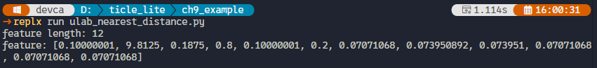</br>

### 거리 기반 분류에 필요한 계산

> **이 예제로 풀 문제**
> 새 입력 벡터가 들어왔을 때, 대표점들과의 거리를 계산해 가장 가까운 클래스를 고르는 최소 계산식은 무엇일까?

kNN의 핵심 연산은 입력 벡터와 모든 대표점 사이의 유클리드 거리를 구하고, 그 중 가장 작은 값을 찾는 것이다. 유클리드 거리는 두 점 사이의 직선 거리로, 각 차원 차이를 제곱해 더한 뒤 제곱근을 취한 값이다. ulab의 브로드캐스팅을 이용하면 대표점 수만큼 반복문을 돌리지 않고 행렬 연산 한 번으로 모든 거리를 동시에 계산할 수 있다. 브로드캐스팅은 크기가 다른 두 배열을 연산할 때 작은 쪽을 자동으로 늘려 맞추는 규칙으로, centers - $x$처럼 (3×3) 행렬과 (3,) 벡터를 빼면 $x$가 각 행에 자동으로 맞춰진다. 아래 예제는 직관적으로 이해하기 쉽도록 3차원 특징 벡터 세 개로 구성된 간단한 형태로 이 과정을 보여 준다.

```python
# ulab_z_score.py
from ulab import numpy as np

# row is time, column is sensor axis (ax, ay, az)
centers = np.array([
    [0.10, 9.80, 0.20],  # still
    [0.80, 8.90, 1.10],  # shake
    [0.30, 9.10, 3.20],  # tilt
])
labels = ["still", "shake", "tilt"]

x = np.array([0.12, 9.75, 0.25]) # new sample to classify
# difference between each center and the new sample
diff = centers - x 
# sqrt of sum of squared difference, i.e., Euclidean distance
dist = np.sqrt(np.sum(diff * diff, axis=1)) 
best = int(np.argmin(dist))

print("distance:", dist)
print("predict:", labels[best])
```

**코드 해설**

centers - $x$에서 centers는 (3, 3) 행렬이고 x는 (3,) 벡터다. 크기가 다르지만 ulab은 브로드캐스팅 규칙에 따라 $x$를 세 행 각각에 맞춰 자동 확장한다. 덕분에 for 루프 없이 세 대표점에서 동시에 $x$를 빼는 행렬 연산을 한 줄로 표현할 수 있다. 임베디드에서 브로드캐스팅은 반복문 해석 오버헤드를 없애 실행 속도도 높인다.

diff * diff로 제곱한 뒤 axis=1로 합산하면 각 행(대표점)의 거리 제곱이 나온다. axis=1을 쓰는 이유는 특징 차원(열)을 압축해 대표점별로 하나의 값을 만들기 위해서다. axis=0으로 바꾸면 반대로 행(대표점)을 압축해 특징 차원별 값이 나오므로 의미가 없다. np.argmin(dist)는 가장 작은 값의 인덱스를 ndarray로 반환하는데, labels[...]에 바로 넣으려면 Python int가 필요하므로 int()로 변환한다.

**실행 결과와 확인할 점**

distance에 세 값이 출력되고, 첫 번째 값(still까지의 거리)이 가장 작을 것이다. predict: still이 출력되면 정상이다. $x$를 np.array([0.85, 8.95, 1.15])로 바꾸면 predict가 shake로 바뀌는지 확인해 보자.

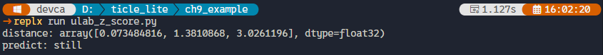</br>

### 이상 탐지에 필요한 Z-score 계산

> **이 예제로 풀 문제**
> 현재 측정값이 정상 범위에서 얼마나 벗어났는지 특징별로 계산하고, 하나의 이상 점수로 요약하려면 어떻게 해야 할까?

kNN은 레이블 있는 데이터를 훈련해야 하지만, 이상 탐지는 다르다. 정상 상태의 평균과 표준편차만 미리 계산해 두면, 새 데이터가 그 범위를 얼마나 벗어났는지를 Z-score로 숫자화할 수 있다. 아래 예제는 4차원 특징의 정상 통계값과 현재 측정으로 Z-score를 계산하고, 그 중 가장 큰 이상 점수 하나를 최종 판정값으로 사용하는 가장 단순한 형태를 보여 준다.

```python
# ulab_z_score_detect.py
from ulab import numpy as np

# row is time, column is sensor axis (ax, ay, az, gx, gy, gz)
mean = np.array([0.1, 9.8, 0.2, 0.8])
std = np.array([0.05, 0.08, 0.04, 0.10]) + 1e-6
now = np.array([0.4, 9.5, 0.9, 1.4])

# z-score for each axis
diff = (now - mean) / std 
# sqrt of squared difference, i.e., absolute value of z-score
z_each = np.sqrt(diff * diff) 
# max of z_each is the z-score for this sample
z_score = float(np.max(z_each)) 

print("z_each:", z_each)
print("z_score:", z_score)
```

**코드 해설**

(now - mean) / std는 각 특징이 정상 범위에서 얼마나 벗어났는지를 표준편차 단위로 환산한다. 축마다 단위가 달라도, 예를 들어 가속도는 m/s$^2$, 자이로는 deg/s여도, 표준편차로 나누면 모두 같은 척도가 되어 이후 최대값 비교가 의미를 가진다. 이 결과를 diff * diff -> np.sqrt()로 처리하는 이유는 ulab에 np.abs()가 없기 때문이다. 제곱하면 음수 부호가 사라지고 제곱근을 취하면 원래 크기로 돌아오므로, 결국 부호를 없앤 거리와 같다.

여러 Z-score 중 np.max()를 최종 판정에 쓰는 것은 어떤 축이든 하나라도 크게 벗어나면 이상이라는 논리를 구현한다. np.mean()으로 평균을 취하면 대부분의 축이 정상일 때 큰 이탈 하나가 묻혀 경보를 놓칠 수 있다. std에 1e-6을 더하는 것은 모든 측정값이 완전히 일정해 표준편차가 정확히 0이 되는 극단적인 경우에도 0 나누기를 막는 안전 처리다.

**실행 결과와 확인할 점**

z_each에 4개 Z-score가 출력되고, z_score에는 그 중 최대값이 출력된다. now를 np.array([0.1, 9.8, 0.2, 0.8])처럼 평균과 같은 값으로 바꾸면 z_score가 0에 가까워지고, now의 세 번째 값을 크게 바꿀수록 z_score가 급격히 올라가는지 확인한다. 이상 탐지 절에서는 z_score가 3.0을 넘으면 경보로 판정하게 된다.

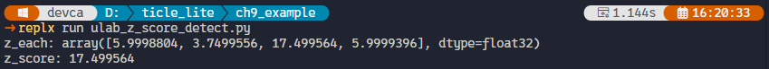</br>

### 실습 체크

> **풀고 싶은 문제**
> 지금까지 다룬 ulab 필수 계산을 실제 실습 수정에 바로 쓸 수 있는 수준인지, 어떤 항목으로 빠르게 점검할 수 있을까?

아래 네 가지가 바로 되면 이후 실습을 이해하고 수정할 준비가 끝난다.

1. 2차원 창 배열에서 axis=0 평균과 표준편차를 구할 수 있다.
2. 평균 묶음과 표준편차 묶음을 이어 특징 벡터를 만들 수 있다.
3. 입력 벡터와 대표점 사이의 거리를 계산해 가장 가까운 클래스를 고를 수 있다.
4. 평균, 표준편차, 현재 벡터로 Z-score를 계산해 이상 여부를 판정할 수 있다.

---

## IMU 제스처 인식

> **풀고 싶은 문제**
> IMU 센서로 still, shake, tilt를 구분하는 장치를 만들고 싶다. 데이터 수집부터 분류, 실시간 추론까지 IMU 한 가지 센서로 전 과정을 어떻게 연결할까?

### 데이터 수집

> **이 예제로 풀 문제**
> 머신러닝은 센서 흔들기 패턴을 직접 코드로 쓰는 대신, 실제로 흔들기를 수행한 센서값을 여러 번 보여 주고 패턴을 찾게 하는 방법이다. 보드에게 동작을 가르치려면 어떤 데이터를 어떤 형식으로 모아야 할까?

머신러닝 분류기 구현에는 데이터(Data)와 레이블(Label)이 필요하다. 데이터는 센서에서 읽은 숫자들의 집합이며, 레이블은 그 숫자들이 어떤 상태인지 나타내는 이름이다. 예를 들어 TiCLE Lite를 정지 상태에서 측정한 센서값 묶음이 데이터라면, 이 묶음에 'still(정지)'이라는 이름을 부여한 것이 레이블이다 레이블이 없으면 분류기는 수치 데이터만 인지할 뿐 어떤 상황인지 구분하지 못한다.

예제는 still(정지), shake(흔들기), tilt(기울기) 세 동작을 10번씩 수집하여 레이블과 함께 dataset.json에 저장한다. 같은 클래스를 반복 수집하는 이유는 사용자가 동작을 취할 때마다 센서값이 조금씩 달라지기 때문이다. 10번의 사례를 제공하면 완벽히 일치하는 숫자가 아니어도 전반적인 패턴이 유사하면 동일 동작으로 판별하는 유연성을 갖추게 된다.

센서 데이터는 정해진 창(Window) 크기로 일정하게 끊어서 저장하며, 이 창 하나가 하나의 학습 사례(Instance)가 된다. 순간 측정값 한 개로는 동작을 파악하기 어렵지만, 약 600ms 동안 연속으로 읽은 30개 데이터 묶음을 창 단위로 활용하면 일련의 움직임과 패턴을 정확히 담아낼 수 있다.

```python
# imu_collect.py
import json
import time
from ulab import numpy as np
from ticle_lite.mpu6050 import MPU6050 as IMU
from ticle_lite.i2c import I2CController
from ticle_lite.button import Button

i2c = I2CController(sda=10, scl=11)  # GP10: SDA, GP11: SCL
imu = IMU(i2c)
btn = Button(16)  # UP

WINDOW = 30      # One sample = 30 measurements (600ms)
SAMPLES = 10     # 10 samples per class
INTERVAL = 20    # Measurement interval 20ms (50 Hz)
READY_MS = 400   # Delay after button press to let the user begin the action

def wait_button():
    while True:
        if btn.update(Button.PRESS):
            return
        time.sleep_ms(20)

def collect_class(label):
    print(f"Class {label!r}: Press the button to start collecting")
    samples = []
    for i in range(SAMPLES):
        wait_button()
        print(f"  {i+1}/{SAMPLES} Ready... (perform the action now)")
        time.sleep_ms(READY_MS)
        print(f"  Collecting...")
        window = []
        for _ in range(WINDOW):
            ax, ay, az = imu.accel
            gx, gy, gz = imu.gyro
            window.append([ax, ay, az, gx, gy, gz])
            time.sleep_ms(INTERVAL)
        arr = np.array(window)
        # Feature values: mean + standard deviation for each axis (12 dimensions)
        feat = list(np.mean(arr, axis=0)) + list(np.std(arr, axis=0))
        samples.append(feat)
        print(f"  Done. Mean (ax): {feat[0]:.3f}")
    return samples


dataset = {}
for cls in ["still", "shake", "tilt"]:
    dataset[cls] = collect_class(cls)

with open("dataset.json", "w") as f:
    json.dump(dataset, f)
print("Save complete: dataset.json")

imu.deinit()
btn.deinit()
```

**코드 해설**

wait_button()이 click 대신 press 이벤트를 기다리는 이유는 타이밍 정밀도 때문이다. click은 버튼을 눌렀다가 뗄 때 발생하는데, 손을 떼는 순간이 불규칙하다. press는 눌리는 순간에 즉시 발생하므로 수집 시작 타이밍이 훨씬 정확해진다.

READY_MS는 버튼 press 이후 실제 측정이 시작되기까지의 준비 시간이다. 버튼을 누르면 즉시 측정이 시작되므로, 동작을 시작하기 전에 이미 창(window)의 초반 샘플이 채워질 수 있다. still은 이미 정지 상태에서 누르므로 문제가 없지만, shake는 누른 뒤 흔들기 시작하고 tilt는 누른 뒤 기울이기 시작하면 초반 샘플이 의도한 동작이 아닌 전환 상태로 오염된다. READY_MS = 400으로 설정하면 "Ready..." 메시지가 출력된 뒤 400ms 동안 사용자가 동작을 시작할 수 있고, 이후 "Collecting..."이 표시될 때 600ms 창 전체가 의도한 동작으로 채워진다.

원시값(30×6 행렬)을 그대로 저장하지 않고 특징 벡터로 변환한 뒤 저장하는 이유는 두 가지다. 첫째, 원시값은 창 크기(WINDOW)에 따라 길이가 달라지지만, 평균+표준편차 특징은 언제나 12개로 고정되어 분류기가 일관된 입력을 처리할 수 있다. 둘째, 특징으로 압축하면 저장 용량과 이후 kNN 거리 계산 비용이 모두 줄어든다.

dataset.json의 구조는 {클래스 이름: [특징 벡터, ...]}다. 딕셔너리 키가 레이블이고 값이 그 레이블에 해당하는 예제 목록이다. 이 구조를 선택한 이유는, 나중에 새 클래스를 추가하거나 기존 클래스 예제를 추가 수집할 때 파일을 읽어 특정 키에만 덧붙이는 방식으로 쉽게 확장할 수 있기 때문이다.

**실행 결과와 확인할 점**

수집 전에 각 클래스를 어떤 자세로 수행해야 하는지 먼저 이해해야 한다. 이 예제에서 쓰는 특징은 창 안에서의 평균과 표준편차다. 가속도 평균은 보드가 어느 방향을 향하고 있느냐에 따라 달라진다. 보드를 수평으로 놓으면 ax 평균이 0에 가깝고, 왼쪽으로 기울이면 ax 평균이 음수 방향으로 이동한다. kNN은 이 평균값의 차이로 클래스를 구분한다.

여기서 한 가지 의문이 생길 수 있다. still은 움직이지 않는 상태이므로, 보드를 어느 방향으로 돌려 놓아도 정지해 있으면 still 아닐까? 개념으로는 맞다. 그러나 이 예제에서 tilt는 기울이는 동작이 아니라 기울어진 자세를 유지하는 상태로 정의했다. 이렇게 되면 tilt는 결국 기울어진 방향의 still이고, still과의 차이는 ax 평균값 하나뿐이다. 따라서 still을 여러 방향으로 수집하면 still의 ax 평균이 -1부터 +1까지 넓게 흩어지고, tilt의 ax 평균이 그 범위 안에 묻혀 kNN이 두 클래스를 구분하지 못하게 된다. still은 수평 자세로만 수집해야 tilt와의 ax 평균 차이가 유지된다.

세 클래스의 수집 방법은 다음과 같이 고정한다. 버튼을 누르면 "Ready..."가 출력되고 400ms 후 "Collecting..."이 나타난다. 실제 측정은 "Collecting..." 시점부터 600ms 동안 진행된다.

- still: 보드를 책상 위에 수평으로 올려 두고, 그 자세를 유지한 채 UP 버튼을 누른다. "Collecting..." 이후 600ms 동안 움직이지 않는다.
- shake: UP 버튼을 누른 뒤 "Ready..."가 보이면 즉시 좌우로 빠르게 흔들기 시작한다. "Collecting..."이 나타날 때 이미 흔들기 동작이 진행 중이어야 한다. 흔드는 크기가 매번 일관되도록 한다.
- tilt: UP 버튼을 누른 뒤 "Ready..."가 보이면 즉시 왼쪽으로 기울이기 시작한다. "Collecting..."이 나타날 때 목표 각도에 도달해 있어야 하고, "Done." 이 출력될 때까지 그 자세를 유지한다. 10번 모두 같은 방향, 비슷한 각도로 기울인다.

측정이 끝나면 '  Done. Mean (ax): 0.xxx'가 출력된다. 이 값이 수집마다 크게 달라지면 자세가 일관되지 않은 것이다.

수집이 끝나면 다음 소절을 통해 dataset.json이 생성되는지 확인한다. 

</br>

> **한 걸음 더**
> WINDOW를 50으로 늘리면 더 긴 동작을 담을 수 있다. INTERVAL을 10ms로 줄이면 더 빠른 동작도 잡힌다. 두 값을 바꾸며 수집하고, 동작 구분이 더 명확해지는지 확인한다.

### 데이터 수집 결과 확인 - kNN에서 데이터가 곧 모델이다

> **이 예제로 풀 문제**
> 수집이 끝났다고 바로 분류기를 만들어도 될까? kNN은 예제 데이터가 곧 모델이므로, 나쁜 데이터로 만든 분류기는 처음부터 성능이 낮다. 클래스 사이가 충분히 구분되는지, 같은 클래스 안에서 샘플이 일관되게 모여 있는지 어떻게 확인할까?

kNN 알고리즘은 모델 학습 과정이 없다. 새 데이터 입력이 들어오면 저장된 예제 전체와 거리를 계산하고, 가장 가까운 k개의 다수결로 최종 클래스를 결정한다. 저장된 데이터 자체가 모델로 기능하므로 수집 단계의 품질이 분류 성능을 직접 결정한다. 가중치를 조정하며 노이즈의 영향을 흡수하는 인공신경망과 달리, kNN은 조정 단계가 없어 나쁜 데이터가 그대로 오염된 분류 엔진이 된다.

좋은 데이터의 조건은 두 가지이다. 첫째, 클래스 간 특징값 차이가 명확해야 한다. 여전히(still) 상태와 흔들기(shake) 상태의 x축 가속도(ax) 평균이 비슷하면 클래스 간 거리가 좁아져 구분이 어려워진다. 둘째, 동일 클래스 내의 샘플들이 밀도 높게 모여 있어야 한다. 특징값이 크게 분산되어 있으면 동작을 일관되게 수행하지 못한 것이며, 분류 경계면이 불안정해지는 원인이 된다.

다음 코드는 dataset.json에 저장된 데이터 구조를 분석하여 클래스별 ax 대표 평균, 클래스 내 샘플 분포, 개별 샘플의 원시 ax 수치를 출력한다.

```python
# imu_check_dataset.py
import json

with open("dataset.json") as f:
    dataset = json.load(f)

# Store the output lines for each class to print them in columns
columns_lines = []

for label, samples in dataset.items():
    n = len(samples)
    # Feature index 0 = per-window ax mean (imu_collect.py: feat = mean + std)
    ax_vals = [s[0] for s in samples]
    avg = sum(ax_vals) / n
    spread = (sum((v - avg) ** 2 for v in ax_vals) / n) ** 0.5
    
    # Collect all print strings for the current class
    lines = []
    lines.append(f"'{label}': {n} samples, {len(samples[0])} features")
    lines.append(f"  ax mean={avg:+.3f}  spread={spread:.3f}")
    for i, v in enumerate(ax_vals):
        lines.append(f"  [{i+1:2d}] ax={v:+.3f}")
    
    columns_lines.append(lines)

# Determine the maximum number of rows among all classes
max_rows = max(len(lines) for lines in columns_lines)
# Define a fixed column width for neat alignment
col_width = 35  

# Print the columns row by row
for row_idx in range(max_rows):
    row_str = ""
    for col in columns_lines:
        # If a class has fewer rows, pad it with spaces to maintain alignment
        # Compatible with MicroPython by using standard string formatting instead of ljust()
        if row_idx < len(col):
            row_str += "%-*s" % (col_width, col[row_idx])
        else:
            row_str += "%-*s" % (col_width, "")
    print(row_str)
```

**코드 해설**

imu_collect.py에서 feat = list(np.mean(arr, axis=0)) + list(np.std(arr, axis=0)) 순서로 특징 벡터를 만들었으므로, feat[0]은 창(window) 안에서의 ax 평균값이다. ax_vals는 한 클래스에서 수집한 10개 샘플 각각의 ax 평균을 모은 리스트가 된다.

avg는 한 클래스를 대표하는 ax값이다. spread는 10개 샘플의 ax값이 avg로부터 얼마나 떨어져 있는지를 나타내는 표준편차로, 수집 일관성의 지표다. 샘플별 [1]~[10] 출력은 클래스 3개를 나란히 3열로 배치해 한 화면에서 바로 비교할 수 있도록 했다. "%-*s" % (col_width, ...) 는 MicroPython에서 ljust()를 대신해 열 폭을 고정하는 방식이다.

**실행 결과와 확인할 점**

먼저 모든 클래스의 샘플 수가 10이고 특징 수가 12인지 확인한다. 부족한 클래스가 있으면 imu_collect.py를 다시 실행해 해당 클래스만 보충한다.

다음으로 still과 shake의 ax mean을 비교한다. 정지 상태인 still은 중력 방향에 따라 ax 평균이 대체로 0에 가깝고, shake는 흔들림으로 인해 평균이 크게 달라진다. 두 값이 너무 비슷하면 흔들기 동작을 더 크고 명확하게 해서 다시 수집하는 편이 좋다.

마지막으로 각 클래스의 spread와 [1]~[10] 샘플 값을 확인한다. 한 클래스 안에서 값이 비슷하게 모여 있으면 수집이 일관되게 이루어진 것이다. 값이 크게 흩어져 있으면 동작이 매번 달랐다는 뜻이므로 해당 클래스를 다시 수집한다. 문제 있는 클래스만 골라서 재수집하려면 아래 **알아두기 - 특정 클래스만 재수집하기**에 포함된 imu_recollect.py를 사용한다.

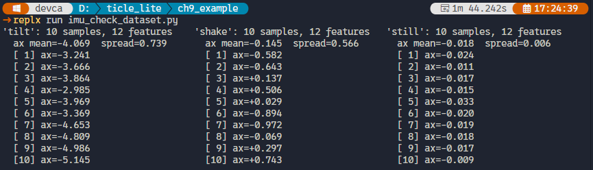</br>

위 결과를 항목별로 분석하면 다음과 같다.

- still: mean이 -0.018로 0에 매우 가깝고 spread가 0.006에 불과하다. 10개 샘플 전체가 -0.033~-0.009 안에 밀집해 있어 사실상 오차 범위 안에 있다.
- shake: mean이 -0.145로 0 근처다. 좌우 흔들기는 양방향 가속도가 상쇄되어 창 내 ax 평균이 0에 수렴하는 것이 정상 물리 동작이므로, still과 mean이 비슷하게 나오는 것은 문제가 아니다. shake를 still과 구분하는 실질적인 특징은 ax 표준편차(feat[6])이며, 흔드는 동안 값이 크게 요동치므로 still의 ax_std(≈0.006)보다 훨씬 큰 값이 된다. spread 0.566은 10번 흔들기의 세기가 완전히 일관되지는 않았음을 보여 주지만 허용 범위 안에 있다.
- tilt: mean이 -4.069로, still(-0.018)과의 ax 평균 차이가 4.05에 달한다. 이는 kNN이 두 클래스를 구분하기에 충분히 넓은 간격이다. 10개 샘플 전체가 음수로 일관되고(-2.985~-5.145), shake의 최대값(+0.743)과의 사이에 겹치는 구간이 전혀 없다. spread 0.739는 세 클래스 중 가장 크지만, 기울기 각도가 매번 정확히 같기 어렵다는 점을 감안하면 이 정도 퍼짐은 정상 범위다.

세 클래스 모두 10개 샘플, 12개 특징이 확인되었고 클래스 간 분리 거리도 충분하다. 이 데이터로 kNN 분류 단계를 진행해도 된다.

> <details>
> <summary><b>알아두기 - 특정 클래스만 재수집하기</b></summary>
> imu_collect.py는 세 클래스를 순서대로 전부 수집하므로, 한 클래스에 문제가 있어도 처음부터 다시 해야 한다. imu_recollect.py는 TARGET에 지정한 클래스 하나만 다시 수집하고, 나머지 클래스는 기존 dataset.json에서 그대로 유지한다.
>
> ```python
> # imu_recollect.py
> from ulab import numpy as np
> from ticle_lite.mpu6050 import MPU6050 as IMU
> from ticle_lite.button import Button
> import json
> import time
>
> i2c = I2CController(sda=10, scl=11)  # GP10: SDA, GP11: SCL
> imu = IMU(i2c)
> btn = Button([16])
>
> WINDOW = 30
> SAMPLES = 10
> INTERVAL = 20
> READY_MS = 400   # Delay after button press to let the user begin the action
> TARGET = "tilt"   # Recollect target class: "still", "shake", or "tilt"
>
> def wait_button():
>     while True:
>         if btn.update(Button.PRESS):
>             return
>         time.sleep_ms(20)
>
> def collect_class(label):
>     print(f"Class {label!r}: Press the button to start collecting")
>     samples = []
>     for i in range(SAMPLES):
>         wait_button()
>         print(f"  {i+1}/{SAMPLES} Ready... (perform the action now)")
>         time.sleep_ms(READY_MS)
>         print(f"  Collecting...")
>         window = []
>         for _ in range(WINDOW):
>             ax, ay, az = imu.accel
>             gx, gy, gz = imu.gyro
>             window.append([ax, ay, az, gx, gy, gz])
>             time.sleep_ms(INTERVAL)
>         arr = np.array(window)
>         feat = list(np.mean(arr, axis=0)) + list(np.std(arr, axis=0))
>         samples.append(feat)
>         print(f"  Done. Mean (ax): {feat[0]:.3f}")
>     return samples
>
> try:
>     with open("dataset.json") as f:
>         dataset = json.load(f)
>     print(f"Loaded dataset.json ({len(dataset)} classes)")
> except OSError:
>     dataset = {}
>     print("dataset.json not found. Starting new dataset.")
>
> dataset[TARGET] = collect_class(TARGET)
>
> with open("dataset.json", "w") as f:
>     json.dump(dataset, f)
> print(f"Updated: '{TARGET}' -> dataset.json")
>
> imu.deinit()
> btn.deinit()
> ```
>
> TARGET 한 줄만 바꾸어 실행하면 된다. 수집 후 imu_check_dataset.py로 해당 클래스만 다시 확인한다.
>
> </details>
</br>

### kNN 분류기 구현

> **이 예제로 풀 문제**
> 이전에 수집하여 보드 내부 저장소에 저장해 둔 dataset.json 파일을 분석하고, 실시간으로 입력되는 새로운 센서 데이터가 기존의 어떤 클래스에 가장 가까운지 정확하게 판별해내는 경량 분류기를 어떻게 구현할 수 있을까?

앞서 수집한 예제 데이터를 바탕으로 실시간 분류 엔진을 구축할 차례이다. kNN 알고리즘은 새 센서 입력이 들어오면 저장된 예제 전체와 거리를 비교해 가장 가까운 k개를 찾고, 그중 다수결로 레이블을 결정한다. 별도의 가중치 학습 연산 없이 데이터 수집 즉시 추론에 활용할 수 있어 연산 자원이 부족한 임베디드 환경에 적합하다.

이 거리 연산을 C 언어로 구현해 .mpy 파일로 패키징한 모듈이 emlearn_neighbors이다. additem() 함수로 기존 수집 데이터를 분류기에 등록하고, 실시간 입력이 들어오면 predict() 함수로 결과 레이블 인덱스를 반환받는다. 모듈 입력 인자는 반드시 int16 정수형 배열 타입(array.array('h'))이어야 한다. ulab으로 추출한 float 특징 데이터를 정수로 변환하는 배율(SCALE) 값만 맞추면 기존 파이프라인을 그대로 연동해 고속 추론을 수행할 수 있다.

```python
# imu_knn_emlearn.py
import array
import json
import emlearn_neighbors

SCALE = 10  # float -> int16: multiply to preserve precision within int16 range

# Load training data collected by imu_collect.py
with open("dataset.json") as f:
    raw = json.load(f)

# Build sorted label list and integer index mapping
labels = sorted(raw.keys())
label_to_index = {label: idx for idx, label in enumerate(labels)}

# Count total samples and feature dimensions
n_samples = sum(len(v) for v in raw.values())
n_features = len(next(iter(raw.values()))[0])

# Create kNN model: (max_items, n_features, k)
model = emlearn_neighbors.new(n_samples, n_features, 3)

# Register each sample with additem (requires int16 array)
for label in labels:
    for feat in raw[label]:
        item = array.array('h', [int(v * SCALE) for v in feat])
        model.additem(item, label_to_index[label])


def predict(feat):
    q = array.array('h', [int(v * SCALE) for v in feat])  # int16, same scale as training
    label_idx = model.predict(q)
    return labels[label_idx]


if __name__ == "__main__":
    # Self-test: each class's first sample must predict its own label
    for label in labels:
        sample = raw[label][0]
        result = predict(sample)
        ok = "OK" if result == label else "FAIL"
        print(f"{ok}  expected={label}  got={result}")
```

**코드 해설**

labels = sorted(raw.keys())는 딕셔너리 키 순서가 JSON 파일마다, 또는 MicroPython 버전마다 달라질 수 있으므로 정렬로 고정한다. 정렬하지 않으면 같은 dataset.json을 읽어도 shake가 인덱스 0이 될 수도 있고 1이 될 수도 있어, label_to_index에 저장된 정수의 의미가 실행마다 달라진다.

emlearn_neighbors의 additem과 predict는 모두 int16 배열(array.array('h'))을 요구한다. float 특징을 그대로 넘기면 타입 불일치로 ValueError가 발생한다. 따라서 SCALE = 10을 곱해 int16으로 변환한다. SCALE이 너무 크면 가속도(±10 m/s²)는 괜찮지만 자이로(최대 ±2000 deg/s)가 int16 범위(±32767)를 넘어 오버플로가 생긴다. SCALE = 10은 자이로 최대값 2000 × 10 = 20000으로 여유가 있다. 학습 시와 추론 시에 반드시 같은 SCALE을 써야 거리 계산이 일관되게 유지된다.

emlearn_neighbors.new(max_items, n_features, k)는 C 레이어에서 내부 버퍼를 미리 할당한다. 이후 additem()을 호출할 때마다 샘플이 이 버퍼에 하나씩 복사된다. fit() 같은 일괄 등록 메서드는 없다. model.predict(q)는 등록된 모든 예제와 q 사이의 int16 유클리드 거리를 C 코드로 계산해 k개 다수결로 레이블 인덱스를 반환한다.

if __name__ == "__main__": 블록은 두 가지 역할을 분리하는 Python 관용 패턴이다. replx imu_knn_emlearn.py처럼 직접 실행할 때는 이 블록이 실행되어 자기 검증을 수행한다. gesture_live.py에서 from imu_knn_emlearn import predict로 import할 때는 이 블록이 실행되지 않으므로, import 시점에 불필요한 출력이나 연산이 발생하지 않는다. 모듈과 검증 코드를 별도 파일로 나눌 필요가 없어 파일 관리도 단순해진다.

**실행 결과와 확인할 점**

imu_collect.py로 dataset.json을 만든 뒤 imu_knn_emlearn.py를 직접 실행한다. 세 줄 모두 OK가 출력되면 모델이 올바르게 등록된 것이다.

FAIL이 나오면 dataset.json을 다시 수집했는데 SCALE이 바뀌었거나, 수집 도중 다른 파일로 덮어 씌워진 경우다. k 값의 영향이 궁금하다면 emlearn_neighbors.new의 세 번째 인자를 1, 3, 5로 바꾸어 가며 다시 실행한다. k=1이면 가장 가까운 예제 하나에만 의존하므로 잡음에 민감하고, k=5면 다수결 기준이 넓어져 경계가 부드러워진다.

결과를 확인했으면, imu_knn_emlearn.py에서 구현한 predict()을 다음 절의 '실시간 동작 인식'에서 사용하기 위해 다음 명령으로 보드에 업로드한다.

```sh
replx mpy imu_knn_emlearn.py -d lib
```

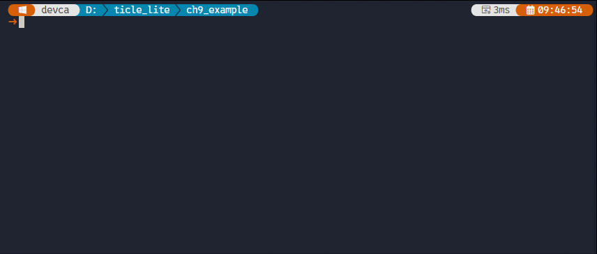</br>

> **알아두기 — 유클리드 거리**
> 두 점 사이의 직선 거리를 뜻한다. 2차원에서 $(x_1, y_1)$과 $(x_2, y_2)$ 사이의 거리는 $\sqrt(x_1-x_2)^2 + (y_1-y_2)^2$ 이다. 12차원 특징 벡터에도 같은 공식이 그대로 적용되며, 값이 비슷할수록 거리가 작다.

### 실시간 동작 인식

> **이 예제로 풀 문제**
> kNN 분류기 준비 완료 후, 추론 결과를 장치 동작으로 연결하는 방법은 무엇인가? stop, still, shake, tilt 네 상태를 정의하고 Matrix 색상과 Servo 각도를 매핑하는 추론 사이클 설계법을 알아본다.

앞서 수집한 데이터와 구축한 분류기를 시스템의 메인 실행 루프에 연결할 차례이다. 본 제어 시스템은 장치 상태를 다음 네 가지로 명확히 구분하여 관리한다. stop은 추론을 수행하지 않는 대기 상태이며, Matrix LED는 꺼지고 Servo는 90도에 위치한다. still, shake, tilt는 추론 결과에 해당하며, 각 상태에 지정된 고유 색상과 Servo 각도가 즉각 출력된다. 추론 완료 후 지정된 시간(ACT_MS) 동안 결과를 유지하며, 이후 Servo를 90도로 복귀시키고 다시 stop 상태로 전환된다.

Servo는 IMU 센서의 추론 연산이 완전히 끝난 직후에만 독립적으로 구동된다. 600ms 단위의 데이터 창 측정이 완료된 다음에 결과를 처리하므로, 모터가 회전할 때 발생하는 물리적 진동이 IMU 센서 측정에 영향을 주지 않는다.

UP 버튼과 DOWN 버튼은 추론을 시작하는 트리거 방식만 다르다. UP 버튼을 누르면 단 한 번만 추론을 실행하고 stop으로 복귀한다. DOWN 버튼을 누르면 추론을 연속으로 반복하며, 다시 누르면 연산을 멈춘다. 두 방식 모두 내부적으로는 'stop 대기 -> 센서 수집 및 추론 -> 결과 표시 -> stop 복귀'라는 표준화된 제어 사이클을 동일하게 공유한다.

```python
# imu_gesture_live.py
from ulab import numpy as np
from ticle_lite.mpu6050 import MPU6050 as IMU
from ticle_lite.i2c import I2CController
from ticle_lite.ws2812 import Matrix
from ticle_lite.servo import Servo
from ticle_lite.button import Button
from imu_knn_emlearn import predict
import time

i2c = I2CController(sda=10, scl=11)  # GP10: SDA, GP11: SCL
imu = IMU(i2c)
mat = Matrix(0, brightness=0.2)
servo = Servo(1)
btn = Button([16, 18])  # UP, DOWN

WINDOW   = 30
INTERVAL = 20
INFER_MS = 700   # auto mode: interval between inference cycles (after ACT_MS)
ACT_MS   = 600   # time to display result and let servo reach position

COLOR = {
    "still": (0, 80, 0),
    "shake": (80, 0, 0),
    "tilt":  (0, 0, 80),
}

ANGLE = {
    "shake": 140,
    "tilt":  40,
}

auto_mode  = False
acting     = False    # True while displaying result / servo moving
act_end_at = None
next_infer = time.ticks_ms()


def get_feature():
    window = []
    for _ in range(WINDOW):
        ax, ay, az = imu.accel
        gx, gy, gz = imu.gyro
        window.append([ax, ay, az, gx, gy, gz])
        time.sleep_ms(INTERVAL)
    arr = np.array(window)
    return list(np.mean(arr, axis=0)) + list(np.std(arr, axis=0))


def infer_and_act():
    global acting, act_end_at
    feat   = get_feature()
    result = predict(feat)
    print("result:", result)

    mat.fill(COLOR.get(result, (20, 20, 20)))
    mat.update()

    if result in ANGLE:
        servo.move_to(ANGLE[result], ms=500, easing="quad")

    acting     = True
    act_end_at = time.ticks_add(time.ticks_ms(), ACT_MS)

print("UP=oneshot  DOWN=continue/stop")
try:
    while True:
        for idx in btn.update(Button.PRESS):
            if idx == 1:    # DOWN: press to toggle continue/stop
                auto_mode = not auto_mode
                if auto_mode:
                    next_infer = time.ticks_ms()
                print("auto_mode:", auto_mode)
            elif idx == 0 and not acting:  # UP: oneshot inference
                infer_and_act()

        now = time.ticks_ms()

        # End of acting phase: turn off matrix and reset servo to home
        if acting and act_end_at is not None and time.ticks_diff(now, act_end_at) >= 0:
            acting     = False
            act_end_at = None
            mat.fill((0, 0, 0))
            mat.update()
            servo.move_to(90, ms=300, easing="quad")
            if auto_mode:
                next_infer = time.ticks_add(now, INFER_MS)

        # Auto mode: start next inference after INFER_MS, only when not acting
        if auto_mode and not acting and time.ticks_diff(now, next_infer) >= 0:
            infer_and_act()

        time.sleep_ms(20)
finally:
    imu.deinit()
    mat.deinit()
    servo.home(ms=300)
    servo.wait()
    servo.deinit()
    btn.deinit()
```

**코드 해설**

infer_and_act()는 추론과 출력을 한 함수 안에서 처리한다. get_feature()가 600ms 동안 창을 측정한 뒤 predict()로 클래스를 판별하고, Matrix 색상과 Servo 각도를 즉시 반영한다. 서보 이동은 측정이 완전히 끝난 뒤에 시작되므로 서보 진동이 IMU에 영향을 줄 수 없다.

acting 플래그와 act_end_at가 결과 표시 구간을 관리한다. infer_and_act()가 끝나면 acting이 True가 되고 ACT_MS 후에 Matrix가 꺼지고 Servo가 90도로 복귀하며 acting이 False로 돌아온다. UP 버튼은 acting이 False일 때만 처리하므로 표시 중에 중복 실행되지 않는다.

auto_mode에서 next_infer는 acting 종료 시점에 갱신된다. 고정 주기가 아니라 이전 사이클이 완전히 끝난 뒤 INFER_MS를 더한 시점이 다음 추론 시각이 된다. 이렇게 하면 측정 600ms + 표시 ACT_MS + 대기 INFER_MS가 순서대로 이어지고 사이클이 겹치지 않는다.

**실행 결과와 확인할 점**

앞서 진행한 실습을 통해 imu_knn_emlearn.py를 컴파일해 보드의 lib 경로에 imu_knn_emlearn.mpy가 배포되고, IMU 데이터셋인 dataset.json이 보드에 있어야 동작한다. 처음 실행하면 Matrix가 꺼진 stop 상태로 시작한다.

UP 단발 모드로 먼저 확인한다. 보드를 수평으로 놓고 UP을 누른다. "result: still"이 출력되고 Matrix가 초록색으로 켜졌다가 ACT_MS 후 꺼지며 Servo는 90도를 유지한다. 보드를 흔드는 상태에서 UP을 누르면 "result: shake"가 출력되고 Matrix가 빨간색, Servo가 140도로 이동한다. ACT_MS 후 Matrix가 꺼지고 Servo가 90도로 복귀한다. 왼쪽으로 기울인 상태에서 UP을 누르면 "result: tilt", Matrix 파란색, Servo 40도, ACT_MS 후 복귀 순서로 동작한다. 오른쪽이나 앞뒤로 기울이면 tilt로 인식되지 않는다. imu_collect.py에서 왼쪽 기울기만 수집했으므로 분류기는 학습한 방향만 tilt로 반환한다.

DOWN을 한 번 누르면 "auto_mode: True"가 출력되며 연속 모드로 전환된다. INFER_MS마다 추론이 자동으로 시작되고 결과에 따라 Matrix와 Servo가 반응한 뒤 stop으로 돌아온다. still 상태에서는 Matrix가 초록색으로 켜졌다가 꺼지고 Servo는 90도를 유지한다. DOWN을 다시 누르면 "auto_mode: False"로 멈춘다.

분류가 불안정하면 INFER_MS를 1000으로 늘리거나 imu_recollect.py로 해당 클래스의 데이터를 다시 수집한다.

</br>

> **한 걸음 더**
> tilt는 수집한 방향만 인식한다. 추가 데이터 없이 4방향 기울기를 모두 인식하려면 다음 소절의 하이브리드 방식을 시도해 보자. 데이터를 더 추가하려면 imu_collect.py에서 tilt_left와 tilt_right를 별도로 수집하고 분류기를 다시 만들면 된다. mean_ay의 부호가 서로 달라 두 클래스는 특징 공간에서 자연스럽게 분리된다.

### 하이브리드 동작 인식

> **이 예제로 풀 문제**
> kNN 분류기에서 tilt는 학습한 방향만 동작한다. 추가 수집 없이 모든 방향의 기울기를 인식하면서, shake는 ML이 안정적으로 담당하도록 개선할 수 없을까?

imu_gesture_live.py 실행에서 확인한 것처럼, kNN 분류기는 학습에 포함된 왼쪽 기울기만 tilt로 인식하고 오른쪽이나 앞뒤 기울기는 인식하지 못한다. tilt는 보드를 기울이면 중력 성분이 mean_ax와 mean_ay에 방향과 크기로 나타난다. 이 관계는 물리 법칙에서 나오므로 학습 데이터 없이 4방향 모두에 동일하게 성립한다. 반면 shake는 흔들리는 동안 mean이 양쪽으로 요동쳐 순간적으로 TILT_TH를 넘는 방향이 생겨 tilt로 오인되기 쉽다. ML은 학습한 shake의 특징 패턴 전체로 판단하므로 이 오인 없이 shake를 안정적으로 구분한다.

classify()는 predict()에 먼저 shake인지를 묻는다. shake이면 ML 결과를 그대로 반환하고, shake가 아니면 mean_ax와 mean_ay로 4방향 기울기를 판별한다. 두 규칙 모두 해당하지 않으면 still로 반환한다. 버튼 없이 시작부터 연속 추론하며, TextLCD가 현재 상태를 표시하고 스피커가 클래스별 효과음을 note()로 출력한다.

```python
# imu_gesture_live_hybrid.py
import time
from ulab import numpy as np
from ticle_lite.ws2812 import Matrix
from ticle_lite.audio import Audio
from ticle_lite.hd44780 import HD44780_PCF8574 as CharLCD
from ticle_lite.mpu6050 import MPU6050 as IMU
from ticle_lite.i2c import I2CController
from imu_knn_emlearn import predict

mat   = Matrix(0, brightness=0.2)
audio = Audio(sck=4, ws=5, sd_out=7, tempo_bpm=300)
i2c = I2CController(sda=10, scl=11)
lcd = CharLCD(i2c)
imu   = IMU(i2c) 

WINDOW   = 30
INTERVAL = 20
INFER_MS = 700
ACT_MS   = 600
TILT_TH  = 0.3   # tilt direction threshold (g unit, arcsin(0.3) ≈ 17 degrees)

COLOR = {
    "still":      (0,  80,  0),
    "shake":      (80,  0,  0),
    "tilt_left":  (0,   0, 80),
    "tilt_right": (0,  40, 80),
    "tilt_fwd":   (0,  60, 60),
    "tilt_back":  (60,  0, 60),
}

# ['note', beats, ...] sequence for audio.note() — edit to customize sounds
SOUND = {
    "still":      ['C4', 4],
    "shake":      ['A5', 8, 'E5', 8],
    "tilt_left":  ['C5', 4],
    "tilt_right": ['E5', 4],
    "tilt_fwd":   ['G5', 4],
    "tilt_back":  ['A4', 4],
}

LABEL_TXT = {
    "still":      "Still",
    "shake":      "Shake",
    "tilt_left":  "Tilt Left",
    "tilt_right": "Tilt Right",
    "tilt_fwd":   "Tilt Forward",
    "tilt_back":  "Tilt Back",
}

def get_feature():
    window = []
    for _ in range(WINDOW):
        ax, ay, az = imu.accel
        gx, gy, gz = imu.gyro
        window.append([ax, ay, az, gx, gy, gz])
        time.sleep_ms(INTERVAL)
    arr = np.array(window)
    return list(np.mean(arr, axis=0)) + list(np.std(arr, axis=0))

def classify(feat):
    # Ask ML one question: is this shake?
    if predict(feat) == "shake":
        return "shake"
    # Not shake: determine tilt direction by gravity component
    ax, ay = feat[0], feat[1]
    if ay >  TILT_TH:  return "tilt_right"
    if ay < -TILT_TH:  return "tilt_left"
    if ax >  TILT_TH:  return "tilt_back"
    if ax < -TILT_TH:  return "tilt_fwd"
    return "still"

def show(result):
    mat.fill(COLOR.get(result, (20, 20, 20)))
    mat.update()
    audio.note(SOUND.get(result, []))
    lcd.clear()
    lcd.text("Detected:", 0, 0)
    lcd.text(f">>>{LABEL_TXT.get(result, '')}", 0, 1)

def reset():
    mat.fill((0, 0, 0))
    mat.update()
    lcd.clear()
    lcd.text("Inferring...", 0, 0)

print("imu_gesture_live_hybrid: auto mode")
reset()
try:
    while True:
        feat   = get_feature()
        result = classify(feat)
        print("result:", result)
        show(result)
        time.sleep_ms(ACT_MS)
        reset()
        time.sleep_ms(INFER_MS)
finally:
    imu.deinit()
    mat.deinit()
    audio.deinit()
    lcd.deinit()
```

**코드 해설**

imu = IMU(i2c)는 remap 인자를 생략해 기본값(remap='-xzy')을 그대로 쓰는데, 이 기본값이 이미 Pixel Display 보드를 전방으로 삼는 방향이므로 별도로 지정할 필요가 없다. 버튼과 auto_mode 플래그가 사라지면서 루프가 단순해졌다. get_feature() -> classify() -> show() -> sleep(ACT_MS) -> reset() -> sleep(INFER_MS) 순서가 끊김 없이 반복된다.

show()가 Matrix, 스피커, LCD를 한 번에 처리한다. SOUND 딕셔너리에 ['음이름', 박자, ...] 형식의 시퀀스를 클래스별로 담아 두고, audio.note()로 한 번에 재생한다. note()도 블로킹 호출이므로 시퀀스가 끝난 뒤 다음 줄로 넘어간다. SOUND 값을 바꾸기만 하면 각 동작의 효과음을 자유롭게 교체할 수 있다. reset()에서는 소리를 내지 않아 다음 추론 사이에 조용한 구간이 생긴다.

classify()가 predict()를 shake 판별에만 사용하는 이유는 학습 데이터의 구성에 있다. tilt는 한 방향만 수집했으므로 predict()에 4방향 판별을 맡기면 학습하지 않은 방향은 still로 반환된다. shake는 어느 방향으로 흔들어도 특징 전체에 고진폭 패턴이 나타나므로 한 번의 학습으로 4방향 모두에 일반화된다. ML이 shake라고 답한 경우에만 그 결과를 쓰고, 나머지는 물리 규칙으로 처리하는 방식이 이 불균형을 해소한다.

**실행 결과와 확인할 점**

imu_knn_emlearn.py와 dataset.json이 보드에 있어야 동작한다. 실행하면 LCD에 "inferring..."이 뜨고 결과가 표시되며 효과음이 울린다. still은 C4 한 음, shake는 A5->E5 두 음, tilt 4방향은 각기 다른 음표로 구분된다.

shake가 제대로 인식되지 않으면 학습 데이터에서 shake 샘플 수를 늘린다. TILT_TH는 tilt 방향을 결정하는 임계값으로, 0.3은 arcsin(0.3) = 약 17도에 해당한다. 값을 높이면 더 크게 기울여야 방향이 결정된다. 수평 상태에서 print(imu.accel)로 ax, ay 값을 확인해 그 값보다 충분히 높게 설정하면 정지 상태에서의 잘못 탐지를 줄일 수 있다.

</br>

---

## PC에서 학습하고 보드에서는 추론만 수행하기

> **풀고 싶은 문제**
> 보드에서 수집한 데이터를 PC로 가져가 scikit-learn으로 학습한 뒤, 결과 모델만 다시 TiCLE Lite에 올려 추론을 수행하는 연동 파이프라인을 구축할 수 있을까?

가능하다. 센서 데이터 수집은 현장 장치가 담당하고 모델 학습과 검증은 자원이 풍부한 PC에서 수행한 뒤, 결과물만 장치에 맞는 형태로 배포하는 방식은 현업의 엣지 AI 흐름과 일치한다. 이 방식을 사용하면 TiCLE Lite의 메모리와 CPU를 절약하면서 PC의 강력한 scikit-learn 도구들을 모두 활용할 수 있다.

이 구조는 TinyML 프로젝트의 표준적인 ulab과 emlearn 조합이다. ulab이 입력을 정형화하면 emlearn이 해당 특징을 받아 빠르게 추론을 수행한다. 단순한 편의 기능이 아니라 9장 전체 실습에서 반복해서 사용하게 될 핵심 실행 패턴이다

이 과정의 핵심은 ulab으로 생성한 특징 벡터를 emlearn_neighbors 추론 엔진으로 그대로 넘기는 흐름이다. PC의 scikit-learn 학습 과정과 보드의 emlearn 추론 과정이 동일한 입력 형식을 공유하므로, 학습과 배포의 차이는 모델 엔진이 아닌 실행 위치의 차이로만 좁혀진다.

### 전체 흐름

> **이 예제로 풀 문제**
> 보드에서 수집한 데이터를 PC로 이관하여 모델을 학습시키고, 결과물을 다시 보드에 반영해 추론을 실행하는 전체 프로세스의 구성 순서는 어떻게 되는가?

데이터 수집 및 추론은 센서와 직결된 TiCLE Lite가 담당하고, 자원이 풍부한 PC가 scikit-learn 기반의 정규화, 교차검증, 하이퍼파라미터 탐색 등 모델 학습과 검증을 맡는다. 두 환경의 역할을 분리하고 JSON 파일로 연동하면, 보드의 제한된 메모리와 CPU 자원을 아끼면서도 PC에서 생성한 고품질 모델을 추론에 활용할 수 있다.

두 환경 간의 파일 이동은 replx 명령어를 사용한다. 보드 내부에 저장된 수집 데이터를 PC로 가져올 때는 replx get 명령을 사용하며, PC에서 최종 생성한 모델 파일을 보드로 업로드할 때는 replx put 명령을 사용한다.

```sh
# Step 1: copy collected data from board to PC
replx get /dataset.json ./dataset.json

# Step 2: copy trained model from PC back to board
replx put ./gesture_model.json /gesture_model.json
```

전체 흐름은 여섯 단계다.

1. TiCLE Lite에서 센서 데이터를 json 파일로 저장한다.
2. replx get으로 파일을 PC로 가져온다.
3. PC에서 scikit-learn으로 학습하고 검증한다.
4. 보드가 읽을 수 있는 json 모델 파일로 변환한다.
5. replx put으로 모델 파일을 TiCLE Lite에 업로드한다.
6. TiCLE Lite에서는 모델을 읽어 예측만 수행한다.

**실행 결과와 확인할 점**

replx get 실행 후 로컬 폴더에 dataset.json 파일이 생성되었는지 확인한다. replx put 실행 후에는 replx ls / 명령어로 보드의 루트 디렉토리에 gesture_model.json 파일이 정상적으로 저장되었는지 확인한다. 파일 전송 중 오류가 발생하면 보드와 PC 간의 연결 상태를 재확인한 뒤 다시 시도한다.

> **알아두기 — 왜 scikit-learn 인스턴스를 그대로 보드에 올릴 수 없는가**
> scikit-learn의 KNeighborsClassifier 인스턴스는 Python의 pickle 형식으로 직렬화할 수 있지만, MicroPython 환경에는 pickle 모듈이 존재하지 않는다. 또한 scikit-learn 라이브러리 자체가 MicroPython에서 동작하지 않는다. 따라서 보드가 직접 읽고 처리할 수 있는 경량 자료구조(숫자 리스트와 딕셔너리) 형태만 JSON 파일로 변환하여 저장하는 과정이 필수적이다.

### PC에서 scikit-learn으로 학습하기

> **이 예제로 풀 문제**
> 보드에서 구현하기 쉬운 kNN을 사용하더라도, PC 환경에서는 데이터 정규화와 검증 과정이 포함된 체계적인 머신러닝 학습 파이프라인을 구축하고 싶다.

다음 실습은 TiCLE Lite에서 수집한 dataset.json 파일을 PC에서 로드하여 진행한다. StandardScaler를 통한 데이터 정규화와 KNeighborsClassifier 기반의 모델 학습을 수행한 뒤, 최종적으로는 보드가 직접 해석하고 실행할 수 있는 JSON 형태의 모델 파일로 변환하여 저장하는 과정이다.

```python
# pc_train_knn.py
import json
import numpy as np
from sklearn.model_selection import train_test_split
from sklearn.preprocessing import StandardScaler
from sklearn.neighbors import KNeighborsClassifier
from sklearn.metrics import classification_report

with open("dataset.json", "r", encoding="utf-8") as f:
    raw = json.load(f)

X = []
y = []
for label, samples in raw.items():
    for feat in samples:
        X.append(feat)
        y.append(label)

X = np.array(X, dtype=np.float32)
y = np.array(y)

X_train, X_test, y_train, y_test = train_test_split(
    X, y, test_size=0.3, random_state=42, stratify=y
)

scaler = StandardScaler()
X_train_scaled = scaler.fit_transform(X_train)
X_test_scaled = scaler.transform(X_test)

clf = KNeighborsClassifier(n_neighbors=3)
clf.fit(X_train_scaled, y_train)

pred = clf.predict(X_test_scaled)
print(classification_report(y_test, pred))

deploy_model = {
    "type": "knn",
    "version": 1,
    "labels": sorted(set(y.tolist())),
    "mean": scaler.mean_.tolist(),
    "scale": scaler.scale_.tolist(),
    "X_train": X_train_scaled.tolist(),
    "y_train": y_train.tolist(),
    "k": 3,
}

with open("gesture_model.json", "w", encoding="utf-8") as f:
    json.dump(deploy_model, f)

print("saved: gesture_model.json")
```

**코드 해설**

train_test_split에 stratify=y를 설정하면 훈련 세트와 테스트 세트 각각에 클래스 비율이 동일하게 유지된다. 클래스당 샘플 수가 10개처럼 적을 때 stratify 없이 분할하면 어떤 클래스는 테스트 세트에 하나도 안 들어갈 수 있어 classification_report가 왜곡된다.

scaler.fit_transform(X_train)과 scaler.transform(X_test)를 구분하는 이유가 있다. fit_transform은 훈련 데이터에서 평균과 표준편차를 계산(fit)하고 그 값으로 변환(transform)하는 두 단계를 한 번에 수행한다. 테스트 데이터에는 transform만 쓰는 것은, 테스트 세트의 통계값이 스케일 계산에 개입하지 않도록 하기 위해서다. 이 원칙은 보드 배포에서도 그대로 이어진다. 새 입력이 들어오면 훈련 때 구한 mean과 scale로만 정규화해야 학습과 추론의 입력 분포가 일치한다.

deploy_model은 scikit-learn 인스턴스가 아니라 Python 리스트와 숫자로만 이루어진 딕셔너리다. scikit-learn 인스턴스를 pickle로 저장하면 PC에서는 다시 로드할 수 있지만, MicroPython에는 pickle 모듈이 없고 scikit-learn 자체도 동작하지 않는다. 따라서 추론에 필요한 mean, scale, 이미 정규화된 X_train, y_train, k만 뽑아 JSON에 담는 것이다.

**실행 결과와 확인할 점**

replx get 명령으로 dataset.json를 PC로 가져온 후 python 명령으로 pc_train_knn.py를 실행하면 터미널에 다음과 같은 classification_report가 출력된다. 

```text
              precision    recall  f1-score   support

       shake       1.00      1.00      1.00         3
       still       1.00      1.00      1.00         3
        tilt       1.00      1.00      1.00         3

    accuracy                           1.00         9
   macro avg       1.00      1.00      1.00         9
weighted avg       1.00      1.00      1.00         9

saved: gesture_model.json
```

클래스별 f1-score가 모두 1.00에 가까우면 수집 데이터 품질이 충분한 것이다. f1-score가 낮은 클래스가 있으면 해당 클래스의 동작이 다른 클래스와 잘 구분되지 않는다는 뜻이므로, imu_collect.py를 다시 실행해 그 클래스만 추가로 수집한다. 

학습이 끝나면 gesture_model.json이 같은 폴더에 생성되는데, replx put 명령으로 보드에 배포한다.

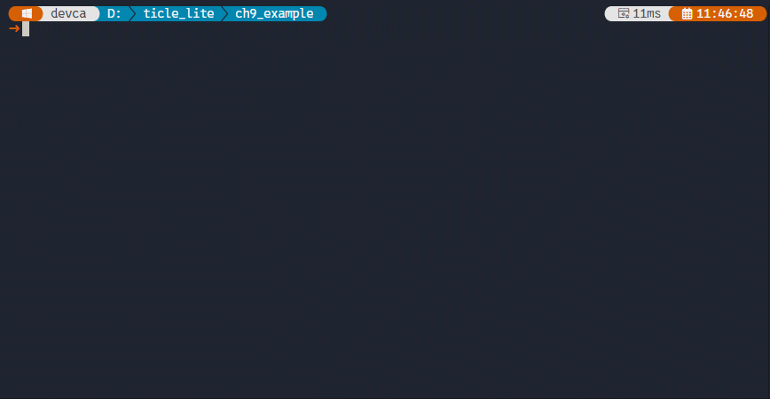</br>

> **한 걸음 더**
> pc_train_knn.py의 n_neighbors를 1, 3, 5로 바꾸며 classification_report를 비교해 본다. 데이터가 클래스당 10개처럼 적을 때는 k가 클수록 경계가 안정되지만, 너무 크면 클래스 간 경계가 흐려질 수 있다. test_size를 0.2와 0.4로 바꾸어 훈련 샘플 수 변화가 정확도에 얼마나 영향을 주는지도 확인한다.

### TiCLE Lite에서 배포 모델 읽기

> **이 예제로 풀 문제**
> PC에서 학습한 모델을 보드에서 곧바로 불러와 예측만 수행할 수 있을까? 이때 PC의 정규화 단계를 보드에서도 똑같이 재현해야 하는 이유는 무엇인가?

gesture_model.json을 파일 시스템에서 읽으면 보드는 학습 없이 즉시 추론을 시작할 수 있다. predict()는 특징 벡터를 받아 PC에서 저장한 mean과 scale로 정규화한 뒤, 정규화된 학습 벡터 전체와 유클리드 거리를 계산한다. 이 정규화 단계가 핵심이다. PC에서 StandardScaler로 변환한 것과 완전히 같은 수식, 즉 평균을 빼고 표준편차로 나누는 변환을 보드에서도 그대로 재현해야 학습 단계와 추론 단계의 입력 분포가 일치한다. 분포가 어긋나면 거리 계산이 엉뚱한 방향을 가리켜 분류 정확도가 크게 떨어진다.

```python
# imu_gesture_deploy.py
from ulab import numpy as np
from ticle_lite.mpu6050 import MPU6050 as IMU
from ticle_lite.i2c import I2CController
from ticle_lite.ws2812 import Matrix
import json
import time

i2c = I2CController(sda=10, scl=11)  # GP10: SDA, GP11: SCL
imu = IMU(i2c)
mat = Matrix(0, brightness=0.2)

WINDOW = 30
INTERVAL = 20

COLOR = {
    "still": (0, 60, 0),
    "shake": (80, 0, 0),
    "tilt": (0, 0, 80),
}

with open("gesture_model.json") as f:
    model = json.load(f)

mean = np.array(model["mean"])
scale = np.array(model["scale"])
X_train = np.array(model["X_train"])
y_train = model["y_train"]
k = int(model["k"])

def get_feature():
    window = []
    for _ in range(WINDOW):
        ax, ay, az = imu.accel
        gx, gy, gz = imu.gyro
        window.append([ax, ay, az, gx, gy, gz])
        time.sleep_ms(INTERVAL)
    arr = np.array(window)
    return np.array(list(np.mean(arr, axis=0)) + list(np.std(arr, axis=0)))

def predict(feat):
    q = (feat - mean) / scale
    diff = X_train - q
    dist = np.sqrt(np.sum(diff * diff, axis=1))
    idx = list(range(len(dist)))
    idx.sort(key=lambda i: dist[i])
    votes = {}
    for i in idx[:k]:
        label = y_train[i]
        votes[label] = votes.get(label, 0) + 1
    return max(votes, key=votes.get)

try:
    while True:
        label = predict(get_feature())
        mat.fill(COLOR.get(label, (20, 20, 20)))
        mat.update()
        print("deploy predict:", label)
except KeyboardInterrupt:
    pass
finally:
    imu.deinit()
    mat.deinit()
```

**코드 해설**

predict() 첫 줄에서 수행하는 q = (feat - mean) / scale은 PC에서 StandardScaler.transform(x)가 수행한 수식, 즉 (x - mean_) / scale_과 완전히 같다. gesture_model.json에 이미 정규화된 X_train이 들어 있으므로, 쿼리도 같은 기준으로 변환해야 두 벡터의 스케일이 맞는다. 정규화를 빠트리면 가속도(단위: m/s²)와 자이로(단위: deg/s)의 값 크기가 달라 거리 계산이 자이로 방향으로 쏠리고 분류가 틀린다.

idx.sort(key=lambda i: dist[i])는 idx 리스트를 제자리에서 정렬해 새 인스턴스를 만들지 않는다. sort()는 메모리를 추가로 할당하지 않으므로 메모리가 제한된 보드에서 더 적합하다. votes.get(label, 0)은 키가 없을 때 KeyError 대신 0을 반환해, 처음 나오는 레이블도 초기화 없이 안전하게 누적할 수 있다.

**실행 결과와 확인할 점**

gesture_model.json을 보드에 올린 뒤 imu_gesture_deploy.py를 실행한다. 클래스 이름이 출력되고 동시에 Matrix 색이 바뀌는지 확인한다. 데이터 수집 버튼 없이 즉시 분류가 시작되어야 한다.

tilt를 왼쪽 기울기로만 수집했을 때 다음 결과를 확인할 수 있다.

첫째, 오른쪽 기울기도 tilt로 인식된다. imu_gesture_live.py에서 emlearn_neighbors는 정규화 없이 원시 특징값으로 거리를 계산했다. 원시 공간에서 오른쪽 기울기(ax 양수)는 ax = 0인 still 클러스터 보다 ax 부호가 반대인 left tilt 클러스터(ax 음수)와 더 멀다. 그래서 오른쪽 기울기가 still로 분류되었다. imu_gesture_deploy.py는 predict()에서 q = (feat - mean) / scale로 StandardScaler 정규화를 먼저 적용한다. 정규화 후에는 모든 특징 차원이 동일한 척도를 갖게 된다. ax 부호 차이는 정규화 공간의 한 차원에 불과하지만, az 평균 감소(좌우 기울기 모두 공통)와 표준편차가 낮은 패턴(정지 자세 공통)은 나머지 여러 차원에서 동시에 tilt 클러스터와의 유사성을 높인다. 12차원 전체 유클리드 거리에서 이 공통 패턴들의 합산 기여가 ax 부호 차이 하나를 이겨, 오른쪽 기울기도 tilt 클러스터에 더 가깝게 위치하게 된다. 이 차이는 kNN 알고리즘 자체(emlearn_neighbors vs Python 루프)에서 오는 것이 아니다. imu_gesture_live.py에서도 학습 데이터와 추론 특징 모두를 같은 mean/scale로 미리 정규화해 emlearn_neighbors에 등록했다면 동일한 결과를 얻을 수 있다. imu_gesture_deploy.py가 바로 그 방식을 구현한 것으로, 정규화를 온디바이스에서 처리하는 대신 PC에서 미리 계산해 gesture_model.json에 담아 놓는다.

둘째, 앞뒤 기울기는 shake로 인식된다. 앞뒤 기울기(피치, 앞뒤 방향으로 회전)는 좌우 기울기(롤, 좌우 방향으로 회전)와 서로 다른 축을 회전시키므로, 두 동작이 각 축의 평균에 미치는 영향이 다르다. 앞 기울기의 특징 벡터는 학습된 tilt 클러스터(왼쪽 기울기)와 크게 다르고, still 클러스터와도 az 감소 때문에 차이가 있다. 모델은 still, shake, tilt 중 하나를 반드시 선택해야 하므로, 정규화된 12차원 공간에서 가장 가까운 이웃인 shake로 분류된다. 뒤 기울기는 간혹 tilt로 인식되는데, 이는 뒤 기울기가 좌우 기울기와 같은 방향으로 ax를 변화시키는 경우가 있기 때문이다.

셋째, 흔들기는 shake로 올바르게 인식된다. 흔들기는 ax 표준편차가 크게 올라가는 뚜렷한 특징을 가지므로, 정규화된 공간에서 정지 및 기울기 클러스터와 확실히 구분된다.

kNN은 항상 가장 가까운 기존 클래스를 선택한다. 학습하지 않은 입력이 들어와도 "알 수 없음"이 없다. 앞뒤 기울기를 올바르게 분류하려면 imu_collect.py에서 앞 기울기와 뒤 기울기를 별도 클래스나 tilt 클래스의 추가 샘플로 수집해 다시 학습해야 한다.

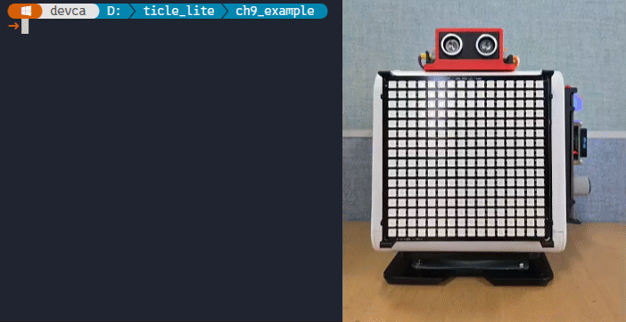</br>

> <details>
> <summary><b>알아두기 - "PC 학습 + 보드 추론" 구조를 kNN 이외 모델로 확장</b></summary>
>
> DecisionTreeClassifier를 PC에서 학습한 뒤, 분기 조건(feature index, threshold, class)만 JSON으로 추출해 보드에서 트리 순회 방식으로 재현해 본다. 그러면 "PC 학습 + 보드 추론" 구조가 kNN 이외의 모델로도 확장된다는 것을 직접 확인할 수 있다.
>
> PC 쪽에서는 pc_train_knn.py와 동일하게 StandardScaler로 정규화한 뒤 DecisionTreeClassifier를 학습하고, 트리 내부 구조를 JSON으로 저장한다.
>
>```python
># pc_train_imu_dt.py
>import json
>import numpy as np
>from sklearn.tree import DecisionTreeClassifier
>from sklearn.preprocessing import StandardScaler
>
>with open("dataset.json") as f:
>    raw = json.load(f)
>
>X, y = [], []
>for label, samples in raw.items():
>    for feat in samples:
>        X.append(feat)
>        y.append(label)
>
>scaler = StandardScaler()
>X_sc = scaler.fit_transform(X)
>
>clf = DecisionTreeClassifier(max_depth=4, random_state=0)
>clf.fit(X_sc, y)
>print(f"accuracy: {clf.score(X_sc, y):.3f}")
>
>t      = clf.tree_
>labels = clf.classes_.tolist()
>
>def node_to_dict(nid):
>    if t.children_left[nid] == -1:           # 리프 노드
>        return {"label": labels[int(np.argmax(t.value[nid]))]}
>    return {
>        "f":   int(t.feature[nid]),
>        "thr": round(float(t.threshold[nid]), 6),
>        "l":   node_to_dict(t.children_left[nid]),
>        "r":   node_to_dict(t.children_right[nid]),
>    }
>
>model = {
>    "mean":  [round(v, 6) for v in scaler.mean_.tolist()],
>    "scale": [round(v, 6) for v in scaler.scale_.tolist()],
>    "tree":  node_to_dict(0),
>}
>
>with open("dt_model.json", "w") as f:
>    json.dump(model, f)
>print("saved dt_model.json")
>```
>
>저장된 dt_model.json은 아래와 같은 형태다. f는 12개 특징 중 비교할 인덱스, thr는 분기 임계값, l과 r은 각각 값이 임계값 이하일 때와 초과할 때 이동할 자식 노드다.
>
>```json
>{
>  "mean":  [0.12, -0.05, 9.71, ...],
>  "scale": [0.45,  0.32, 1.23, ...],
>  "tree": {
>    "f": 2, "thr": -0.731,
>    "l": {
>      "f": 8, "thr": 0.234,
>      "l": {"label": "tilt"},
>      "r": {"label": "shake"}
>    },
>    "r": {"label": "still"}
>  }
>}
>```
>
>보드 쪽에서는 imu_gesture_deploy.py에서 predict 함수 하나만 트리 순회 방식으로 교체한다. 정규화, 특징 추출, 창 수집 로직은 그대로 재사용한다.
>
>```python
># imu_gesture_dt.py  (predict 함수 부분만 발췌)
>import json
>
>with open("dt_model.json") as f:
>    model = json.load(f)
>
>mean  = model["mean"]
>scale = model["scale"]
>tree  = model["tree"]
>
>def predict(feat):
>    node = tree
>    while "label" not in node:
>        node = node["l"] if feat[node["f"]] <= node["thr"] else node["r"]
>    return node["label"]
>
># 정규화 후 predict 호출 (imu_gesture_deploy.py와 동일한 방식)
># q = [(feat[i] - mean[i]) / scale[i] for i in range(len(feat))]
># label = predict(q)
>```
>
>kNN은 추론할 때마다 전체 학습 샘플과의 거리를 계산하지만, 결정 트리는 루트에서 리프까지 한 번만 내려가면(O(depth)) 된다. max_depth=4이면 최대 4번 비교로 분류가 끝난다. 실행 후 추론 시간과 분류 결과를 imu_gesture_deploy.py와 비교해 보자.
>
> </details>
</br>

---

## 이상 탐지

> **풀고 싶은 문제**
> 센서 신호에서 정상 범위를 벗어난 값을 자동으로 감지하려면 어떻게 해야 할까? 이상 사례를 미리 수집하기 어려운 상황도 있고, 정상과 이상 데이터를 모두 모을 수 있는 상황도 있다. 두 경우에 접근 방식이 어떻게 달라질까?

이상 탐지는 문제 상황에 따라 두 방향으로 접근할 수 있다. 이상 사례가 드물거나 미리 수집하기 어렵다면 정상 상태의 통계만 기억하고 새 데이터가 그 범위에서 얼마나 벗어났는지를 Z-score로 판단하는 비지도 방식이 적합하다. 반면 정상과 이상 데이터를 모두 수집할 수 있다면 IIR 필터로 전처리한 뒤 결정 트리를 학습해 더 정교한 탐지 경계를 만들 수 있다.

### Z-score 기반 이상 탐지

> **이 예제로 풀 문제**
> 기계나 장치가 정상 동작할 때의 진동 패턴을 미리 기억해 두면, 이후 이상한 진동이 감지되었을 때 경보를 낼 수 있을까?

이상값 탐지는 분류와 달리 레이블이 붙은 이상 사례가 없어도 동작한다. 정상 상태에서 측정한 데이터의 통계값만 저장해 두면, 새 데이터가 그 범위를 얼마나 벗어나는지를 숫자로 나타낼 수 있다. 이 방법은 고장 사례를 미리 수집하기 어려운 예지 정비(Predictive Maintenance)나 안전 감시처럼 정상 데이터는 풍부하지만 비정상 데이터는 드문 상황에 특히 적합하다.

이 예제는 IMU 가속도 창의 평균, 표준편차를 정상 통계로 저장하고, 이후 입력이 들어올 때마다 각 특징의 Z-score를 계산해 임계값과 비교한다. 탐지 결과는 Matrix 색, Servo 각도, LCD 텍스트로 동시에 반영되고, 버튼으로 임계값을 현장에서 즉시 조정하거나 정상 상태를 다시 학습할 수 있다.

```python
# anomaly_detect.py
import json
import time
from ulab import numpy as np
from ticle_lite.ws2812 import Matrix
from ticle_lite.audio import Audio
from ticle_lite.button import Button
from ticle_lite.servo import Servo
from ticle_lite.mpu6050 import MPU6050 as IMU
from ticle_lite.hd44780 import HD44780_PCF8574 as CharLCD
from ticle_lite.i2c import I2CController

mat = Matrix(0, brightness=0.2)
audio = Audio(sck=4, ws=5, sd_out=7, tempo_bpm=300)
btn = Button([16, 18, 19])           # GP16: UP, GP18: DOWN, GP19: RIGHT
servo = Servo(1)
i2c = I2CController(sda=10, scl=11)
lcd = CharLCD(i2c)
imu = IMU(i2c)

WINDOW = 30
INTERVAL = 20
THRESHOLD = 50.0

SOUND = {
    "alert":  ['A5', 4, 'A5', 4],
    "normal": ['C4', 4],
}

def get_window():
    window = []
    btn_events = []
    for _ in range(WINDOW):
        # Check for button events during data collection
        btn_events.extend(btn.update(Button.PRESS))
        ax, ay, az = imu.accel
        window.append([ax, ay, az])
        time.sleep_ms(INTERVAL)
    arr = np.array(window)
    feats = list(np.mean(arr, axis=0)) + list(np.std(arr, axis=0))
    return feats, btn_events

def display(state, z_score):
    if state == "alert":
        mat.fill((80, 0, 0))
        servo.move_to(160, ms=250, easing="quad")
    else:
        mat.fill((0, 20, 0))
        servo.move_to(90, ms=250, easing="quad")

    mat.update()
    servo.wait()            # Wait for servo to reach the target position
    time.sleep_ms(300)      # Wait for IMU vibration to settle
    audio.note(SOUND[state])
    
    lcd.clear()
    lcd.text("Anomaly: {}".format(state), 0, 0)
    lcd.text("z={:.2f}".format(z_score), 0, 1)

def relearn_normal():
    global mean_normal, std_normal
    print("Relearning normal state...")
    feats = np.array([get_window()[0] for _ in range(20)])
    mean_normal = np.mean(feats, axis=0)
    std_normal = np.std(feats, axis=0) + 1e-6
    with open("normal_model.json", "w") as f:
        json.dump({
            "mean": list(mean_normal),
            "std": list(std_normal),
            "threshold": THRESHOLD,
        }, f)
    print("Relearning completed")


print("UP=Threshold+10, DOWN=Threshold-10, RIGHT=Relearn")
print("Maintain normal state (about 14 seconds)...")

normal_feats = np.array([get_window()[0] for _ in range(20)])
mean_normal = np.mean(normal_feats, axis=0)
std_normal = np.std(normal_feats, axis=0) + 1e-6

model = {"mean": list(mean_normal), "std": list(std_normal), "threshold": THRESHOLD}
with open("normal_model.json", "w") as f:
    json.dump(model, f)
print("Normal model saved")

print(" Anomaly detection started (Ctrl+C to exit)...")
try:
    while True:
        feat_arr, btn_events = get_window()
        restart_loop = False
        
        for idx in btn_events:
            if idx == 0:                    # UP: threshold up
                THRESHOLD = min(100.0, THRESHOLD + 10.0)
                print(f"THRESHOLD: {THRESHOLD}")
                restart_loop = True
                break
            elif idx == 1:                  # DOWN: threshold down
                THRESHOLD = max(10.0, THRESHOLD - 10.0)
                print(f"THRESHOLD: {THRESHOLD}")
                restart_loop = True
                break
            elif idx == 2:                  # RIGHT: Normal state relearn
                relearn_normal()
                restart_loop = True
                break
            
        if restart_loop:
            continue
        
        feat = np.array(feat_arr)
        diff = (feat - mean_normal) / std_normal
        z_score = float(np.sqrt(np.mean(diff * diff)))  # Root Mean Square of z-scores

        if z_score > THRESHOLD:
            display("alert", z_score)
            print(f"Anomaly detected! z={z_score:.2f}")
        else:
            display("normal", z_score)
            print(f"Normal. z={z_score:.2f}")
except KeyboardInterrupt:
    print("Exiting...")
finally:
    servo.home()
    servo.wait()
    servo.deinit()
    lcd.deinit()
    btn.deinit()
    audio.deinit()
    imu.deinit()
    mat.deinit()
```

**코드 해설**

정상 상태 수집에 20회를 쓰는 이유는 표준편차 추정의 안정성 때문이다. 5회처럼 너무 적으면 우연한 흔들림이 표준편차를 크게 벌려 탐지 민감도가 떨어지고, 50회처럼 너무 많으면 사용자가 그 시간 동안 완전히 정지 상태를 유지해야 한다는 부담이 생긴다. 20회 × 600ms이면 약 14초로 대부분의 준비 과정에서 현실적인 길이다.

get_window()는 가속도 3축만 쓰고, 창 내부 루프마다 btn.update()를 함께 호출해 버튼 이벤트 목록을 같이 반환한다. 탐지의 목적이 진동, 충격 패턴 감지이므로 속도 누적에 해당하는 자이로보다 순간 가속도가 더 직접적인 정보를 담는다. 버튼 이벤트를 창 수집과 같은 루프에서 수집하는 이유는 타이밍 때문이다. 창 수집은 600ms 동안 블로킹되는데, 이 시간에 눌린 버튼을 바깥 루프에서 확인하면 이미 수집이 끝난 뒤라 이벤트를 놓치게 된다. 반환된 btn_events를 먼저 확인해 버튼 조작이 있었으면 그 창의 z-score 계산을 건너뛰므로, 버튼 누름에 의한 움직임이 이상값으로 분류되지 않는다.

z_score는 전 특징 차원의 z-score를 제곱평균제곱근(RMS)으로 계산한다. 단일 차원의 최댓값을 쓰면 std_normal이 아주 작은 한 차원이 전체 z-score를 지배해 작은 진동에도 경보가 울린다. RMS는 모든 차원을 균등하게 반영하므로 더 안정적이다.

display()에서 서보를 움직인 뒤 srv[0].wait()와 time.sleep_ms(300)을 순서대로 호출하는 이유는 서보 진동이 다음 창 수집에 유입되는 것을 막기 위해서다. 서보가 목표 각도에 완전히 도달한 뒤 300ms 추가 대기하는 동안 audio.note()가 재생되고, 그 사이 IMU 진동이 충분히 가라앉는다.

relearn_normal()이 global mean_normal, std_normal을 선언하는 이유는 함수 안에서 이 두 변수에 할당(=)하기 때문이다. 읽기만 한다면 global 선언 없이도 접근되지만, 재할당하려면 명시적으로 전역 변수로 지정해야 변경이 루프 밖으로 반영된다.

THRESHOLD를 버튼으로 조정할 수 있도록 설계한 이유는 환경 의존성 때문이다. 실험실 데스크에서 측정한 정상 범위와 금속 선반 위에서 측정한 정상 범위가 다를 수 있으므로, 임계값을 코드에 고정하면 환경이 달라질 때마다 다시 편집해야 한다. 현장에서 버튼 두 개로 즉시 조정할 수 있으면 재배포 없이 대응이 가능하다.

**실행 결과와 확인할 점**

프로그램을 시작하면 약 14초 동안 정상 상태 측정이 자동으로 진행되고, Normal model saved가 출력된 뒤 탐지 루프가 시작된다. 보드를 조용히 놓은 상태에서는 Normal. z=...가 계속 출력되고, Matrix가 초록색, 스피커에서 짧은 낮은 음이 들려야 한다. 정상 상태의 z값은 0.3∼3.0 사이에서 머문다. 보드에 충격을 가하면 Anomaly detected! z=...가 출력되고 Matrix가 빨간색, Servo가 160도로 이동하며 짧은 경고음 두 번이 울린다. 충격 순간의 z값은 수백 이상으로 급등하는데, 이는 충격이 가해진 창의 평균, 표준편차가 정상 통계에서 크게 벗어났기 때문이다. 서보가 멈춘 뒤 300ms 대기와 경고음 재생이 끝난 뒤 다음 창 수집이 시작되어 서보 진동에 의한 연속 경보가 발생하지 않는다.

UP 버튼을 누르면 임계값이 0.5 올라가(최대 7.0) 큰 충격에만 반응하게 되고, DOWN 버튼으로 낮출수록(최소 3.0) 가벼운 움직임에도 반응한다. RIGHT 버튼을 누르면 현재 상태를 새 정상 기준으로 재학습한다. 세 버튼 모두 창 수집 중에 눌러도 정상적으로 인식되며, 해당 창의 탐지는 건너뛴다.

Z-score는 어떤 값이 평균에서 얼마나 떨어져 있는지를 표준편차 단위로 나타낸 것이다. z = (값 − 평균) / 표준편차. 정규분포에서 |z| > 3인 경우는 전체의 0.3% 미만의 드문 상황이다.

예제에서는 6개 특징 차원 각각의 z-score를 구한 뒤, 그 제곱의 평균에 제곱근을 취한 RMS Z-score를 최종 점수로 사용한다. 정상 상태에서는 모든 차원이 정상 범위 안에 있으므로 z값이 0.8∼3.0 사이에 머문다. 충격이 가해지면 여러 축의 가속도 평균과 표준편차가 동시에 크게 변하고, 그 편차가 RMS로 합산되어 z값이 수백 이상으로 급등한다. 단일 차원의 최댓값 대신 RMS를 쓰는 이유는 한 차원만 잠깐 흔들리는 노이즈성 이상과, 여러 차원이 함께 크게 변하는 실제 충격을 구분하기 위해서다. 공장 기계의 진동 모니터링, 금융 이상 거래 감지 등에 이 기법이 실제로 사용된다.

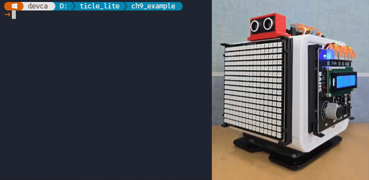</br>

> <details>
> <summary><b>알아두기 - 히스테리시스 로직 적용</b></summary>
>
> 이상 상태가 일정 횟수 연속으로 감지될 때만 경보를 발생시키는 히스테리시스 로직을 추가해 본다. 일시적인 노이즈로 인한 잘못된 탐지를 줄일 수 있다.
>
>ALERT_CONSECUTIVE = 2를 상수로 추가하고, 메인 루프에서 카운터 하나만 관리하면 된다.
>
>```python
>ALERT_CONSECUTIVE = 2   # 경보 발생까지 필요한 연속 감지 횟수
>alert_count = 0
>
># while True 루프 안의 탐지 부분을 아래로 교체
>if z_score > THRESHOLD:
>    alert_count += 1
>    if alert_count >= ALERT_CONSECUTIVE:
>        display("alert", z_score)
>        print("Anomaly detected! z={:.2f} (x{})".format(z_score, alert_count))
>    else:
>        print("Anomaly candidate z={:.2f} ({}/{})".format(
>            z_score, alert_count, ALERT_CONSECUTIVE))
>else:
>    alert_count = 0
>    display("normal", z_score)
>    print("Normal. z={:.2f}".format(z_score))
>```
>
>z-score가 THRESHOLD를 넘을 때마다 alert_count가 1씩 오르고, ALERT_CONSECUTIVE 이상이 되어야 display("alert", ...)가 호출된다. 단 한 번의 이상 창은 후보(candidate)로만 출력하고 경보는 내지 않는다. 정상 창이 오면 카운터가 0으로 초기화된다. ALERT_CONSECUTIVE 값을 1로 낮추면 기존 동작과 같고, 3 이상으로 올리면 더 느리지만 더 확실한 경보를 낸다.
>
> </details>
</br>

IIR 필터를 전처리에 활용하면 더 정교한 탐지가 가능하다. 마이크 소음과 초음파 거리처럼 끊임없이 흔들리는 신호에 IIR 필터를 먼저 적용하면 노이즈 성분이 줄어들고, 정상과 이상 데이터를 모두 수집해 결정 트리를 학습하면 원시 신호를 직접 사용할 때보다 안정적인 탐지 경계가 만들어진다.

마이크 RMS와 초음파 거리는 서로 다른 의미를 담으므로 독립적으로 분류한다. 마이크는 MIC_NORMAL과 MIC_ANOMALY, 초음파는 SR04_NORMAL과 SR04_ANOMALY로 나뉘어 두 개의 결정 트리 모델을 만든다. 보드에서는 두 모델을 동시에 실행해 각 센서 상태를 따로 예측한다. 이를 위해 데이터 수집 -> PC 학습 -> 보드 예측의 세 단계를 순서대로 진행한다.

### 결정 트리 학습을 위한 데이터 수집

> **이 예제로 풀 문제**
> IIR 필터로 평활화한 마이크 RMS와 초음파 거리에서 어떤 특징을 추출해야 정상과 이상을 구분하기에 충분할까?

특징으로 쓸 값은 슬라이딩 윈도우 안의 IIR 필터링된 신호 평균과 분산이다. WINDOW_SIZE 12샘플 × 20ms 간격이면 240ms 구간의 통계를 추출한다. 마이크의 경우 평균 RMS는 음량 수준을, 분산은 음량의 들쭉날쭉함을 나타낸다. 초음파는 평균 거리와 거리 변동 폭이 특징이 된다.

수집 방법에 따라 특징의 의미가 달라진다. 초음파를 특정 위치에 고정하면 정상은 좁은 평균 범위, 이상은 평균이 크게 벗어나는 패턴이 된다. 반면 넓은 유효 범위에서 자유롭게 움직이는 상태를 정상으로 정의하면 이상은 분산이 급격히 커지는 패턴이 된다. 마이크도 조용한 환경을 정상으로 정하면 이상은 높은 평균 RMS, 소음이 일정 수준 있는 환경에서는 낮은 분산이 기준이 된다. 수집 전에 어떤 상태를 정상과 이상으로 정의할지 결정하지 않으면 모델이 의도한 대로 작동하지 않는다.

```python
# mic_ultra_collect.py
import math
import array
import time
import json
import sys
from ulab import numpy as np
from ticle_lite.audio import Audio
from ticle_lite.us import SR04 as UltraSonic
from ticle_lite.button import Button
from termviz import Canvas, Plot, Scope, Term
import emlearn_iir
import emlearn_iir_q15

SAMPLES_PER_CLASS = 10
WINDOW_SIZE = 12  # samples per window, 12 * 20ms = 240ms
DATASET_FILE = "mic_ultra_dataset.json"
TARGET_CLASS = None # None(All), "MIC_NORMAL", "MIC_ANOMALY", "SR04_NORMAL", "SR04_ANOMALY"

LABEL_MAP = {
    0: "MIC_NORMAL",
    2: "MIC_ANOMALY",
    1: "SR04_NORMAL",
    3: "SR04_ANOMALY",
}

if TARGET_CLASS is None:
    SEQUENCE = [0, 2, 1, 3] # UP, DOWN, LEFT, RIGHT
else:
    INV_LABEL_MAP = {v: k for k, v in LABEL_MAP.items()}
    if TARGET_CLASS in INV_LABEL_MAP:
        SEQUENCE = [INV_LABEL_MAP[TARGET_CLASS]]
    else:
        print(f"[ERROR] Invalid TARGET_CLASS name: {TARGET_CLASS}")
        raise ValueError(f"Invalid TARGET_CLASS name: {TARGET_CLASS}")

audio = Audio(sck=4, ws=5, sd_in=6)
sonic = UltraSonic(trig=12, echo=13)
btn = Button([16, 17, 18, 19])  # GP16: UP, GP17: LEFT, GP18: DOWN, GP19: RIGHT

coefficients = array.array('f', [0.067455, 0.134910, 0.067455, 1.0, -1.142980, 0.412802])
filter = emlearn_iir.new(coefficients)
q15_buffer = emlearn_iir_q15.convert_coefficients(coefficients)
q15_filter = emlearn_iir_q15.new(q15_buffer)
mic_buf = array.array('f', [0.0])
ultra_q15_buf = array.array('h', [0])

total_saved = 0
current_seq_idx = 0
current_class_count = 0

# RAM buffer list to prevent file writing during the loop
collected_samples = []

def save_all_samples_to_file():
    if not collected_samples:
        return
    show_status("Saving data...", "Updating flash memory...", "Please wait...")

    existing_samples = []
    
    # Read existing dataset if it exists
    try:
        with open(DATASET_FILE, "r") as f:
            for line in f:
                line = line.strip()
                if line:
                    existing_samples.append(json.loads(line))
    except Exception:
        # If file doesn't exist, start with an empty list
        pass

    # If TARGET_CLASS is set, filter out (delete) the old data of that specific class
    if TARGET_CLASS is not None:
        # Keep only the samples that DO NOT match the target class
        existing_samples = [s for s in existing_samples if s["label"] != TARGET_CLASS]
        note_text = f"Replaced old '{TARGET_CLASS}' data."
    else:
        note_text = "Appended new sequential data."

    # Combine old filtered data with newly collected data
    final_samples = existing_samples + collected_samples

    # Overwrite ("w") the entire file with the clean updated list
    try:
        with open(DATASET_FILE, "w") as f:
            for sample in final_samples:
                json.dump(sample, f)
                f.write("\n")
        print(f"\n[SUCCESS] {note_text} Total {len(final_samples)} samples in {DATASET_FILE}")
    except Exception as e:
        raise RuntimeError(f"\n[ERROR] Failed to save dataset: {e}")

STATUS_ROW = 22
cv = Canvas(60, 20)
plt_mic = Plot(cv, region_px=(2,  2, 56, 76))
plt_ultra = Plot(cv, region_px=(62, 2, 56, 76))
scope_mic = Scope(plt_mic, vmin=0, vmax=300)
scope_ultra = Scope(plt_ultra, vmin=0, vmax=1.0)

_w = sys.stdout.buffer.write

def show_status(line1, line2="", line3=""):
    _w(Term.cursor_to(STATUS_ROW,     1) + Term.erase_line()
       + Term.FG.CYAN   + line1 + Term.RESET)
    _w(Term.cursor_to(STATUS_ROW + 1, 1) + Term.erase_line()
       + Term.FG.MUTED  + line2 + Term.RESET)
    _w(Term.cursor_to(STATUS_ROW + 2, 1) + Term.erase_line()
       + Term.FG.YELLOW + line3 + Term.RESET)

def stage_status(note=""):
    required = SEQUENCE[current_seq_idx]
    label = LABEL_MAP[required]
    
    direction_map = {0: "UP", 2: "DOWN", 1: "LEFT", 3: "RIGHT"}
    btn_direction = direction_map.get(required, "UNKNOWN")
    
    mode_text = "Single Mode" if TARGET_CLASS else "Sequential Mode"
    return (
        f"Stage {current_seq_idx + 1}/{len(SEQUENCE)} [{mode_text}]: {label}",
        f"Count {current_class_count}/{SAMPLES_PER_CLASS}  |  Buffered {total_saved}",
        note or f">> PRESS BUTTON [{required}] ({btn_direction}) to record",
    )

window_mic = array.array('f', [0.0] * WINDOW_SIZE)
window_ultra = array.array('f', [0.0] * WINDOW_SIZE)

show_status(*stage_status())

done = False
try:
    while not done:
        btn_events = []
        
        for i in range(WINDOW_SIZE):
            btn_events.extend(btn.update())

            raw_mic = audio.rms(160)
            mic_buf[0] = raw_mic
            filter.run(mic_buf)
            filt_mic = mic_buf[0]
            window_mic[i] = filt_mic

            distance = sonic.read() # m or NaN
            raw_ultra = 0.0 if math.isnan(distance) else float(distance)
            ultra_q15_buf[0] = int(raw_ultra * 1000) # Convert to mm and store as Q15
            q15_filter.run(ultra_q15_buf)
            filt_ultra = ultra_q15_buf[0] / 1000.0   # Convert back to m
            window_ultra[i] = filt_ultra

            scope_mic.tick(
                [raw_mic, filt_mic],
                names=["raw", "filt"],
                info_text="Mic RMS",
            )
            scope_ultra.tick(
                [raw_ultra, filt_ultra],
                names=["raw", "filt"],
                info_text="Ultra(m)",
            )
            
            time.sleep_ms(20) 

        if not btn_events:
            continue

        required = SEQUENCE[current_seq_idx]
        has_press_event = False
        
        for btn_idx, event in btn_events:
            if event == "press":
                has_press_event = True
                break
                
        if not has_press_event:
            continue

        arr_mic = np.array(window_mic)
        arr_ultra = np.array(window_ultra)

        std_mic = float(np.std(arr_mic))
        std_ultra = float(np.std(arr_ultra))
        features = [
            float(np.mean(arr_mic)),   std_mic   * std_mic,
            float(np.mean(arr_ultra)), std_ultra * std_ultra,
        ]

        for btn_idx, event in btn_events:
            if event != "press":
                continue
            if btn_idx == required:
                sample = {"label": LABEL_MAP[required], "features": features}
                
                # Remove file writing and immediately add to RAM buffer to prevent delay
                collected_samples.append(sample)
                
                total_saved         += 1
                current_class_count += 1
                if current_class_count >= SAMPLES_PER_CLASS:
                    current_seq_idx    += 1
                    current_class_count = 0
                    if current_seq_idx >= len(SEQUENCE):
                        done = True
                        break
                if not done:
                    show_status(*stage_status())
                
                # Wait 50ms to stabilize peripheral interrupts before the next data sampling.
                #time.sleep_ms(50)
                break
            else:
                show_status(*stage_status("[!] Wrong button. Expected: " + LABEL_MAP[required]))
                #time.sleep_ms(50)
                break

    sonic.deinit()
    audio.deinit()
    btn.deinit()
    # Safely write RAM data to the internal file system after all hardware has completely stopped.
    save_all_samples_to_file()
except:
    show_status("Interrupted.", "Dot not Saving buffered data")
    time.sleep_ms(1000)
finally:
    cv.end()
```

**코드 해설**

LABEL_MAP은 버튼 핀 인덱스와 클래스 이름을 연결한다. Button([16, 17, 18, 19])는 UP, LEFT, DOWN, RIGHT 순서로 인덱스 0, 1, 2, 3을 부여하고, SEQUENCE = [0, 2, 1, 3]은 UP -> DOWN -> LEFT -> RIGHT 순서로 클래스를 수집하도록 인덱스를 재배치한다. TARGET_CLASS가 None이면 네 클래스를 순서대로 모두 수집하고, 특정 클래스 이름을 지정하면 그 클래스만 재수집해 기존 데이터를 교체한다. 일부 클래스 데이터가 불충분할 때 전체를 다시 수집하지 않아도 된다.

IIR 필터는 emlearn_iir(마이크, float)와 emlearn_iir_q15(초음파, int16)를 각각 사용한다. 두 필터는 같은 2차 저역통과 계수 배열로 만들어지지만 내부 데이터 형식이 다르다. 초음파 거리값은 미터 단위 실수로 0~3m 범위이므로 1000을 곱해 밀리미터 정수로 변환하면 int16 범위(±32767) 안에 충분히 들어간다. 필터 적용 후에는 다시 1000으로 나눠 미터 단위로 환원한다. 버퍼 mic_buf와 ultra_q15_buf는 루프 밖에서 한 번만 할당하고 매 샘플마다 값만 덮어씌워 재사용한다. filter.run()은 버퍼를 in-place로 수정하므로 호출 후에는 필터링된 값이 버퍼[0]에 들어온다.

샘플은 루프 안에서 바로 파일에 쓰지 않고 collected_samples 리스트에만 쌓는다. sonic.deinit(), audio.deinit(), btn.deinit()으로 하드웨어를 전부 해제한 뒤 save_all_samples_to_file()을 호출한다. 루프 중 파일 쓰기는 플래시 I/O 지연이 버튼 응답에 영향을 줄 수 있고, 파일 쓰기 도중 인터럽트가 발생하면 파일이 손상될 위험이 있다. 하드웨어 해제 후에 한꺼번에 저장하면 이 두 가지 위험을 모두 피할 수 있다.

TARGET_CLASS가 None이 아닌 경우, save_all_samples_to_file()은 기존 파일에서 해당 클래스의 이전 데이터를 모두 제거하고 새로 수집한 데이터로 교체한다. 기존 다른 클래스 데이터는 그대로 유지된다.

**실행 결과와 확인할 점**

실행하면 터미널 상단에 두 개의 Scope가 수평으로 표시되고, 하단 세 행에 현재 수집 단계 정보가 나타난다. Stage 1/4 [Sequential Mode]: MIC_NORMAL 형식으로 어떤 클래스를 수집 중인지 알 수 있다. 버튼 안내 줄에 >> PRESS BUTTON [0] (UP) to record처럼 눌러야 할 버튼이 명시된다.

MIC_NORMAL을 수집할 때는 주변이 일상적인 상태에서 Mic RMS Scope의 raw와 filt 선이 낮은 수준에서 나란히 움직이는지 확인한다. 이 상태에서 UP 버튼을 누르면 평균이 낮고 분산도 작은 특징이 RAM에 저장된다. MIC_ANOMALY를 수집할 때는 마이크 근처에서 시끄러운 음악을 틀어 raw 선이 크게 오르는 것을 확인한 뒤 DOWN 버튼을 누른다.

SR04_NORMAL은 초음파 센서와의 거리가 정상 범위에서 움직이거나 유지되는 상태, SR04_ANOMALY는 정상적인 범위를 벗어난 상태다. Scope의 Ultra(m) 채널에서 raw와 filt 선이 어떻게 다르게 움직이는지 보면 필터의 평활화 효과를 실시간으로 확인할 수 있다.

4개 클래스 수집이 끝나면 Saving data...가 표시되고 mic_ultra_dataset.json이 보드 파일 시스템에 저장된다. 저장이 완료되면 다음 명령으로 보드에 저장된 mic_ultra_dataset.json 내용을 확인한 후 PC로 가져온다.

```sh
replx ls mic_ultra_dataset.json
replx get mic_ultra_dataset.json ./mic_ultra_dataset.json
```

</br>

> **한 걸음 더**
> SAMPLES_PER_CLASS를 20으로 늘려 각 클래스당 더 많은 샘플을 수집해 보자. 데이터가 많을수록 결정 트리의 분기 경계가 더 정교해진다. 수집한 클래스 일부가 마음에 들지 않으면 TARGET_CLASS를 해당 클래스 이름으로 지정해 그 클래스만 다시 수집하면 된다.

### PC에서 결정 트리 모델 학습하기

> **이 예제로 풀 문제**
> 보드에서 수집한 마이크, 초음파 특징 데이터를 PC에서 두 개의 독립 결정 트리로 학습하고, 보드가 직접 실행할 수 있는 Python 함수 파일로 내보내려면 어떻게 해야 할까?

emlearn_trees 같은 추론 라이브러리 없이 결정 트리를 보드에 배포하는 방법이 있다. 결정 트리는 결국 if-else 분기의 연속이므로, 트리 구조를 그대로 Python 함수로 변환하면 보드에서 직접 실행할 수 있다. mic_ultra_pc_train.py는 scikit-learn 결정 트리의 내부 구조를 순회해 if-else Python 코드로 변환하고, 두 모델 함수를 하나의 mic_ultra_model.py 파일로 저장한다. 이 파일을 replx mpy 명령으로 보드에 설치하면 import만으로 두 예측 함수를 사용할 수 있다.

```python
# mic_ultra_pc_train.py
import json
import numpy as np
from sklearn.tree import DecisionTreeClassifier

DATASET_FILE = "mic_ultra_dataset.json"
MODEL_OUTPUT_FILE = "mic_ultra_model.py"

# Data parsing
X_mic, y_mic = [], []
X_ultra, y_ultra = [], []

with open(DATASET_FILE, "r") as f:
    for line in f:
        line = line.strip()
        if not line: continue
        data = json.loads(line)
        feat = data["features"] # [mean_mic, var_mic, mean_ultra, var_ultra]
        lbl = data["label"]
        
        # Mic training set (normal vs anomaly)
        if lbl in ["MIC_NORMAL", "MIC_ANOMALY"]:
            X_mic.append([feat[0], feat[1]]) # Use only mic data
            y_mic.append(1 if lbl == "MIC_ANOMALY" else 0)
            
        # Ultra training set (normal vs anomaly)
        if lbl in ["SR04_NORMAL", "SR04_ANOMALY"]:
            X_ultra.append([feat[2], feat[3]]) # Use only ultra data
            y_ultra.append(1 if lbl == "SR04_ANOMALY" else 0)

# Train two independent models
clf_mic = DecisionTreeClassifier(max_depth=3, random_state=42).fit(np.array(X_mic), np.array(y_mic))
clf_ultra = DecisionTreeClassifier(max_depth=3, random_state=42).fit(np.array(X_ultra), np.array(y_ultra))

# Convert tree structure to independent function code
def export_tree(tree, name, feature_desc):
    tree_ = tree.tree_
    lines = [f"def {name}(features):", f"    # features: {feature_desc}"]
    
    def recurse(node, depth):
        indent = "    " * (depth + 1)
        if tree_.feature[node] != -2:
            feat_idx = tree_.feature[node]
            threshold = tree_.threshold[node]
            lines.append(f"{indent}if features[{feat_idx}] <= {threshold:.6f}:")
            recurse(tree_.children_left[node], depth + 1)
            lines.append(f"{indent}else:")
            recurse(tree_.children_right[node], depth + 1)
        else:
            class_idx = np.argmax(tree_.value[node][0])
            lines.append(f"{indent}return 'ANOMALY' if {class_idx} == 1 else 'NORMAL'")
    recurse(0, 1)
    return "\n".join(lines) + "\n\n"

# Merge the function structures of the two models into one file
ml_code = export_tree(clf_mic, "predict_mic", "[mean_mic, var_mic]")
ml_code += export_tree(clf_ultra, "predict_ultra", "[mean_ultra, var_ultra]")

with open(MODEL_OUTPUT_FILE, "w", encoding="utf-8") as f:
    f.write(ml_code)

print(f"[Success] Separate models have been saved to {MODEL_OUTPUT_FILE}.")
```

**코드 해설**

데이터를 마이크와 초음파 두 집합으로 나눠 독립적으로 학습하는 이유가 있다. 두 센서를 하나의 4차원 특징 벡터로 합쳐 학습하면 한 센서의 이상이 다른 센서 판단에 영향을 줄 수 있다. 마이크 이상이 발생했을 때 초음파가 정상이어도 혼합 분류기는 전체 상태를 이상으로 잘못 판정할 가능성이 있다. 독립 모델은 각 센서 상태를 별도로 판단하므로 이 문제가 없다.

DecisionTreeClassifier(max_depth=3)으로 깊이를 제한하는 이유는 보드 메모리와 실행 속도 때문이다. max_depth=3이면 예측 시 최대 3번 비교로 답이 나오므로 느린 MicroPython에서도 충분히 빠르다. 깊이 제한이 없으면 트리가 학습 데이터에 과적합되어 새 입력에서 오동작할 가능성도 높아진다.

export_tree 함수는 scikit-learn 트리 인스턴스의 내부 배열(tree_.feature, tree_.threshold, tree_.children_left, tree_.children_right, tree_.value)을 재귀 순회해 Python if-else 코드로 변환한다. feature[node]가 -2이면 리프 노드이므로 class_idx에서 최빈 클래스를 꺼내 ANOMALY 또는 NORMAL을 반환한다. 분기 노드에서는 features[feat_idx] <= threshold 조건으로 왼쪽 또는 오른쪽 자식으로 내려간다. 생성된 함수는 중첩 if-else 구조로 트리 깊이만큼 들여쓰기가 반복되므로, max_depth=3이면 최대 3단계 들여쓰기로 제한된다.

replx mpy mic_ultra_model.py -d /lib 명령은 Python 소스를 마이크로파이썬 바이트코드(.mpy)로 컴파일해 보드의 /lib 폴더에 설치한다. 소스 파일 대신 바이트코드를 쓰면 파일 크기가 줄고 로드 속도도 빨라진다.

**실행 결과와 확인할 점**

DATASET_FILE이 현재 경로에 있어야 실행된다. python으로 mic_ultra_pc_train.py를 실행하면 출력은 [Success] Separate models have been saved to mic_ultra_model.py. 한 줄이다. 생성된 mic_ultra_model.py를 에디터로 열어 predict_mic과 predict_ultra 두 함수가 올바르게 생성되었는지 확인한다. 트리가 예상보다 짧다면 max_depth=3보다 작은 깊이에서 이미 완전 분류가 이루어진 것이다. 반대로 분기가 너무 복잡해 보이면 max_depth를 2로 줄여 단순화할 수 있다.

학습 데이터가 적으면 트리가 훈련 데이터에 과적합될 수 있으므로 SAMPLES_PER_CLASS를 늘리거나 수집 품질을 점검한다. 학습 후 생성된 mic_ultra_model.py를 다음 명령으로 보드에 설치한다.

```sh
replx mpy mic_ultra_model.py -d /lib
```

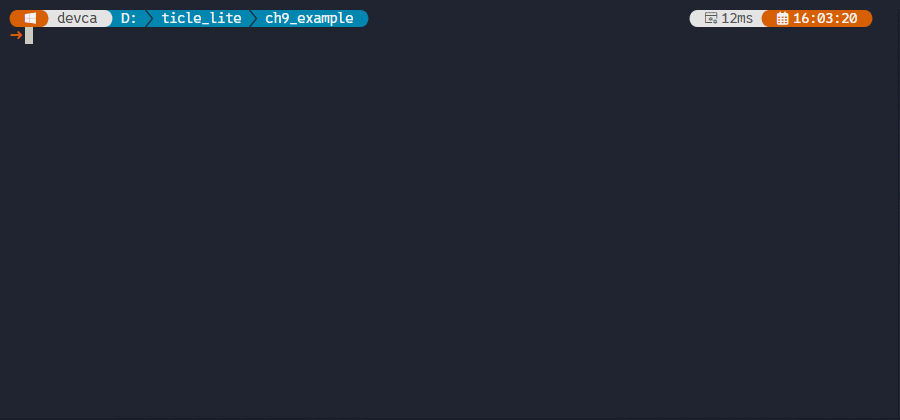</br>

> **한 걸음 더**
> sklearn의 train_test_split으로 데이터를 7:3으로 나누고 clf_mic.score로 검증 정확도를 확인해 보자. 훈련 정확도는 높은데 검증 정확도가 낮다면 과적합이므로 max_depth를 줄이거나 데이터를 더 수집해야 한다.

### 보드에서 결정 트리 모델로 실시간 예측하기

> **이 예제로 풀 문제**
> 설치된 모델 함수를 호출해 실시간 IIR 필터 기반 특징으로 마이크 상태와 초음파 상태를 동시에 예측할 수 있을까?

수집과 학습 단계를 거쳤으므로 이제 보드에는 mic_ultra_model 모듈이 설치되어 있다. mic_ultra_inference.py는 수집할 때와 동일한 IIR 필터, 윈도우 크기, 특징 계산 방식을 그대로 사용해 predict_mic과 predict_ultra를 호출한다. 학습 시와 추론 시의 전처리 파이프라인이 동일해야 모델이 올바르게 작동하므로, 계수 배열과 WINDOW_SIZE, 특징 계산 공식이 수집 코드와 정확히 일치해야 한다.

```python
# mic_ultra_inference.py
import gc
import math
import array
import time
import sys

from ulab import numpy as np
from ticle_lite.audio import Audio
from ticle_lite.us import SR04 as UltraSonic
from termviz import Canvas, Plot, Scope, Term
import emlearn_iir
import emlearn_iir_q15

# Load the two separate prediction functions
from mic_ultra_model import predict_mic, predict_ultra

WINDOW_SIZE = 12

audio = Audio(sck=4, ws=5, sd_in=6)
sonic = UltraSonic(trig=12, echo=13)

coefficients = array.array('f', [0.067455, 0.134910, 0.067455, 1.0, -1.142980, 0.412802])
filter = emlearn_iir.new(coefficients)
q15_buffer = emlearn_iir_q15.convert_coefficients(coefficients)
q15_filter = emlearn_iir_q15.new(q15_buffer)
mic_buf = array.array('f', [0.0])
ultra_q15_buf = array.array('h', [0])

STATUS_ROW = 22
cv = Canvas(60, 20)
plt_mic = Plot(cv, region_px=(2,  2, 56, 76))
plt_ultra = Plot(cv, region_px=(62, 2, 56, 76))
scope_mic = Scope(plt_mic,   vmin=0, vmax=300)
scope_ultra = Scope(plt_ultra, vmin=0, vmax=1.0)

_w = sys.stdout.buffer.write

def show_prediction_status(mic_res, ultra_res, features):
    # Line 1: Display microphone prediction status (determined solely by mic_res)
    _w(Term.cursor_to(STATUS_ROW, 1) + Term.erase_line()
       + Term.FG.CYAN + f"[PREDICT] MIC STATUS   -> {mic_res}" + Term.RESET)
    
    # Line 2: Display ultrasonic prediction status (determined solely by ultra_res)
    _w(Term.cursor_to(STATUS_ROW + 1, 1) + Term.erase_line()
       + Term.FG.YELLOW + f"[PREDICT] ULTRA STATUS -> {ultra_res}" + Term.RESET)
    
    # Line 3: Display sensor statistics in a single line
    stats_text = (f"Mic M:{features[0]:.1f}/V:{features[1]:.1f} | "
                  f"Ultra M:{features[2]:.2f}/V:{features[3]:.4f}")
    _w(Term.cursor_to(STATUS_ROW + 2, 1) + Term.erase_line()
       + Term.FG.MUTED + stats_text + Term.RESET)

window_mic = array.array('f', [0.0] * WINDOW_SIZE)
window_ultra = array.array('f', [0.0] * WINDOW_SIZE)

try:
    while True:
        gc.collect() 

        for i in range(WINDOW_SIZE):
            raw_mic = audio.rms(160)
            mic_buf[0] = raw_mic
            filter.run(mic_buf)
            filt_mic = mic_buf[0]
            window_mic[i] = filt_mic

            distance = sonic.read()
            raw_ultra = 0.0 if math.isnan(distance) else float(distance)
            ultra_q15_buf[0] = int(raw_ultra * 1000)
            q15_filter.run(ultra_q15_buf)
            filt_ultra = ultra_q15_buf[0] / 1000.0
            window_ultra[i] = filt_ultra

            scope_mic.tick([raw_mic, filt_mic], names=["raw", "filt"], info_text="Mic RMS")
            scope_ultra.tick([raw_ultra, filt_ultra], names=["raw", "filt"], info_text="Ultra(m)")
            
            time.sleep_ms(20) 

        arr_mic = np.array(window_mic)
        arr_ultra = np.array(window_ultra)

        std_mic = float(np.std(arr_mic))
        std_ultra = float(np.std(arr_ultra))
        
        # Extract features for each sensor
        mic_features = [float(np.mean(arr_mic)), std_mic * std_mic]
        ultra_features = [float(np.mean(arr_ultra)), std_ultra * std_ultra]
        all_features = mic_features + ultra_features

        # Perform inference with independent models (eliminate mutual interference)
        mic_prediction = predict_mic(mic_features)
        ultra_prediction = predict_ultra(ultra_features)
        
        # Display results
        show_prediction_status(mic_prediction, ultra_prediction, all_features)

except KeyboardInterrupt:
    print("\nInference stopped by user.")
finally:
    sonic.deinit()
    audio.deinit()
    cv.end()
```

**코드 해설**

from mic_ultra_model import predict_mic, predict_ultra는 /lib에 설치된 mic_ultra_model.mpy에서 두 함수를 가져온다. 이 구문이 성공하려면 replx mpy 설치 명령이 먼저 완료되어 있어야 한다.

루프 구조는 수집 코드와 거의 동일하다. WINDOW_SIZE만큼 샘플을 쌓고 특징을 계산한 뒤 예측 함수를 호출한다. 다른 점은 버튼 처리가 없고, 수집 대신 예측 결과를 화면에 출력한다는 것이다. gc.collect()를 루프 시작에서 호출하는 이유는 창 수집, 특징 계산, 예측 호출이 반복되면서 힙 파편화가 쌓이는 것을 방지하기 위해서다.

마이크 특징 [mean_mic, var_mic]과 초음파 특징 [mean_ultra, var_ultra]을 분리해 각 모델에 넘기는 것이 중요하다. predict_mic는 마이크 2차원 특징만, predict_ultra는 초음파 2차원 특징만 처리하도록 학습되었으므로 4차원 전체를 넘기면 오동작한다. show_prediction_status는 두 예측 결과와 원시 통계값을 캔버스 하단 세 행에 고정 위치로 출력한다. Term.cursor_to()로 커서를 지정 행으로 이동해 Scope 그래픽과 겹치지 않게 한다.

**실행 결과와 확인할 점**

실행하면 Scope가 표시되고 매 윈도우(약 240ms)마다 하단 세 행이 업데이트된다. 조용한 환경에서는 [PREDICT] MIC STATUS -> NORMAL이, 소음이 있으면 [PREDICT] MIC STATUS -> ANOMALY가 출력되어야 한다. 초음파도 정상 위치에서는 [PREDICT] ULTRA STATUS -> NORMAL이, 장애물이 갑자기 가까워지면 [PREDICT] ULTRA STATUS -> ANOMALY가 출력된다.

예측이 올바르지 않다면 대부분 학습 데이터와 현재 환경의 특징 분포가 다른 경우다. 조용했던 환경에서 학습하고 소음이 있는 환경에서 실행하면 MIC_NORMAL이 ANOMALY로 잘못 판정된다. 이런 경우 mic_ultra_collect.py로 현재 환경에서 데이터를 다시 수집하고 모델을 재학습해 설치하면 된다.

</br>

> **한 걸음 더**
> Matrix와 Audio를 예측 결과에 연결해 보자. MIC_ANOMALY 판정 시 매트릭스를 빨간색으로 채우고 경고음을 울리면 화면 없이도 이상을 즉시 알 수 있다. 'Z-score 기반 이상 탐지' 절의 display() 함수를 참고해 경보 출력 로직을 추가해 보자.

---

## 정리

이 장의 핵심은 TiCLE Lite 위에서 실행 가능한 머신러닝 기본 틀을 익히는 것이다. ulab 배열 연산으로 센서 데이터를 창 단위로 압축하고, 특징 벡터를 kNN 분류기나 이상 탐지 알고리즘에 연결하면 보드 위에서 실시간 판단을 직접 수행할 수 있다. 즉, 모델 정확도만이 아니라 입력, 추론, 출력이 끊기지 않는 온디바이스 루프를 설계하는 역량이 목표다.

이 장은 이상 탐지를 두 관점에서 다룬다. 이상 사례를 미리 수집하기 어려울 때는 정상 통계만으로 Z-score를 계산하는 비지도 방식이 적합하다. 반면 정상과 이상 데이터를 모두 모을 수 있다면 IIR 필터로 신호를 전처리하고 결정 트리를 PC에서 학습한 뒤 보드에 배포하면 더 안정적인 탐지 경계를 얻을 수 있다. 두 방식 모두 센서 읽기 -> 특징 추출 -> 추론 -> 피드백이라는 공통 파이프라인 위에서 동작하며, 알고리즘을 교체해도 하드웨어 입출력 코드는 그대로 재사용할 수 있다.

실무 적용 관점에서는 세 가지를 반드시 함께 튜닝해야 한다. 첫째는 데이터 수집 품질(창 길이, 샘플 수, 측정 주기)이고, 둘째는 추론 안정성(k 값, 임계값, 필터 계수, 특징 구성)이다. 마지막으로 시스템 반응성(출력 주기, 인터랙션 설계, 모델 저장/재사용)을 살펴야 한다. 학습을 보드에서 직접 할지, PC에서 오프보드 학습한 뒤 보드에는 추론만 배치할지도 중요한 설계 선택이다.

| 개념 | 핵심 역할 |
|---|---|
| ulab.numpy | 배열 전체에 한 번에 수행하는 수치 연산 |
| 특징 추출 | 시계열 원시 데이터를 평균/분산으로 압축 |
| kNN 분류 | 유클리드 거리로 가장 비슷한 예제 k개 찾아 다수결 |
| Z-score 이상 탐지 | 정상 통계만으로 이탈 정도를 표준편차 단위로 측정 |
| IIR 필터 전처리 | 고주파 노이즈를 줄여 분류기 입력의 특징을 안정화 |
| 결정 트리 분류 | if-else 분기로 정상/이상을 고속으로 판별 |
| PC 배포 파이프라인 | 수집 -> PC 학습 -> 보드 배포의 오프보드 학습 구조 |

정리하면, 9장을 마친 학습자는 다음을 수행할 수 있어야 한다.

1. TiCLE Lite 센서 데이터를 ulab으로 처리해 고정 길이 특징 벡터를 안정적으로 만든다.
2. 문제 성격에 맞게 kNN 분류, Z-score 이상 탐지, IIR+결정 트리 이상 탐지를 선택해 온디바이스 추론을 구현한다.
3. IIR 필터로 센서 신호를 전처리해 분류기 입력을 안정화하는 이유와 방법을 설명할 수 있다.
4. 추론 결과를 Matrix/Servo/LCD/Audio 등 출력 장치와 결합해 즉시 피드백 시스템을 만든다.
5. 보드에서 데이터를 수집하고 PC에서 모델을 학습한 뒤 보드에 배포하는 파이프라인을 설계할 수 있다.
6. 비지도(Z-score)와 지도(IIR+결정 트리) 이상 탐지의 차이를 파악하고 상황에 맞게 선택할 수 있다.

### 스스로 점검하기

1. 30×6 센서 배열에서 axis=0 집계와 axis=1 집계가 각각 어떤 의미를 가지는지 설명하고, 동작 분류 특징 추출에서 어떤 축이 더 자주 쓰이는지 서술하시오.
2. 원시 시계열을 그대로 쓰지 않고 특징 벡터(평균, 분산)로 압축하는 이유를 메모리, 계산량, 일반화 관점에서 설명하시오.
3. kNN에서 k 값을 1, 3, 5로 바꿨을 때 나타날 수 있는 장단점을 노이즈 민감도와 경계 안정성 관점에서 비교하시오.
4. Z-score 기반 이상 탐지에서 임계값 조정이 잘못된 탐지와 탐지 누락에 어떤 영향을 주는지 설명하시오.
5. std에 작은 상수(예: 1e-6)를 더하는 수치적 이유를 설명하고, 임베디드 환경에서 이 처리의 필요성을 서술하시오.
6. Z-score 기반 이상 탐지와 IIR+결정 트리 기반 이상 탐지의 차이를 학습 데이터 필요 여부, 사용 센서, 탐지 경계 안정성 관점에서 비교하시오.
7. IIR 필터를 분류기 입력의 전처리로 사용하는 이유를 특징 안정성 관점에서 설명하고, emlearn_iir와 emlearn_iir_q15의 차이를 서술하시오.
8. 마이크 RMS와 초음파 거리에서 평균과 분산을 특징으로 선택하는 이유를 이상 탐지 관점에서 설명하시오.
9. 마이크와 초음파에 대해 하나의 4차원 혼합 분류기 대신 두 개의 독립 2차원 분류기를 사용하는 이유를 설명하시오.
10. 결정 트리 구조를 Python if-else 함수로 변환해 보드에 배포하는 방식과, kNN 학습 데이터를 JSON으로 저장해 배포하는 방식을 추론 속도와 메모리 사용 관점에서 비교하시오.
11. 보드에서 수집한 데이터를 PC로 가져와 scikit-learn으로 학습하고 보드에 배포하는 흐름을 단계별로 설명하고, 각 단계에서 쓰이는 replx 명령을 함께 서술하시오.
12. 9장에서 다룬 수집 -> 학습 -> 배포 파이프라인을 바탕으로 새로운 응용 하나를 선택하고 입력 센서, 특징, 추론 방식(비지도/지도), 출력 장치를 포함한 설계안을 작성하시오.
